<!--
author:   Brenda Meery

email:    LiaScript@web.de

version:  0.0.1

language: en

narrator: US English Female

comment:  mathematics, algebra

logo:     ../cover.jpg

tags:      Real world math introduction ...

-->

# CK-12 Algebra I - Honors

> This document was automatically translated to LiaScript from
>
> https://www.ck12.org/book/ck-12-algebra-i-honors/

## 1.0 Welcome to the Real World

<article>

**Introduction**

The real number system is made up of rational and irrational numbers. The rational numbers include the natural numbers, whole numbers, integers and rational numbers. The natural numbers are the counting numbers and consist of all positive, whole numbers. The natural numbers are numbers in the list 1, 2, 3... and are often referred to as positive integers. The whole numbers are the natural numbers and zero. They are the numbers in the list 0, 1, 2, 3... Integers are the numbers in the list..., -3, -2, -1, 0, 1, 2, 3... . These numbers are the natural numbers, their opposites and zero. The rational numbers are numbers that can be written as the ratio of two numbers $\frac{a}{b}$ and $b \neq 0$. The rational numbers include all terminating decimals as well as those decimals that are non-terminating but have a repeating pattern of digits. Included in the rational numbers are the natural numbers, whole numbers and the integers. The irrational numbers are those that cannot be expressed as the ratio of two numbers. The irrational numbers include decimal numbers that are non-terminating decimals as well as those with digits that do not repeat with a pattern. The rational numbers along with the irrational numbers make up the real number system.

The chapter will continue with lessons on how to perform the basic operations of addition, subtraction, multiplication and division with real numbers. All of these operations will then be applied to order of operations.

Students will also learn how to express a fraction as a decimal and a decimal number as a fraction. The final section of the chapter will deal with representing real numbers on a number line.

**Lessons**

In this chapter you will do the following lessons:

* Addition of Real Numbers
* Subtraction of Real Numbers
* Multiplication of Real Numbers
* Division of Real Numbers
* Properties of Addition
* Properties of Multiplication
* Order of Operations with Real Numbers
* Decimal Notation
* Graphing Real Numbers on a Number Line

</article>

### 1.1 Addition of Real Numbers

<article>

Addition of Integers
--------------------

**Objectives**

The lesson objectives for The Addition of Real Numbers are:

* Addition of Integers Using Models
* Addition of Integers Using the Number Line
* Addition of Integers Using the Rules

**Introduction**

In this concept you will learn to add integers by using different representations. You will learn how to add integers by using appropriate models and by using the number line. These methods will lead to the formation of two rules for adding integers.

**Watch This**

[Khan Academy Adding/Subtracting Negative Numbers](http://www.youtube.com/watch?v=C38B33ZywWs)

!?[video](https://www.youtube.com/watch?v=C38B33ZywWs)

**Guidance**

On Monday, Marty borrows $50.00 from his father. On Thursday, he gives his father $28.00.

Write an addition statement to describe Marty’s financial transactions.

Marty borrowed $50.00 which he must repay to his father. Therefore Marty has $-\$50.00$.

He returns $28.00 to his father. Now Marty has $-\$50.00+(\$28.00)=-\$22.00$. He still owes his father $22.00.

**Example A**

$5+(-3)=?$

The problem can be represented by using color counters. In this case, the red counters represent positive numbers and the yellow ones represent the negative numbers.

One positive counter and one negative counter equals zero. $1+(-1)=0$

Draw a line through the counters that equal zero.

=2$. The answer is the difference between 5 and 3. The answer takes on the sign of the larger digit and in this case the five has a positive value and it is greater than 3.")

**Example B**

$4+(-7)=?$

")

\[Figure 4\]

The above representation shows the addition of 4 positive counters and 7 negative counters.

One positive counter and one negative counter equals zero. $1+(-1)=0$

Draw a line through the counters that equal zero.

=-3$. The answer is the difference between 7 and 4. The answer takes on the sign of the larger digit and in this case the seven has a negative value and it is greater than 4.")

**Example C**

This same method can be extended to adding variables. Algebra tiles can be used to represent positive and negative values.

$6x+(-8x)=?$

+(-8x)=-2x$. The answer is the difference between $8x$ and $6x$. The answer takes on the sign of the larger digit and in this case the eight has a negative value and it is greater than 6.")

**Example D**

$(-3)+(-5)=?$

The solution to this problem can be determined by using the number line.

Indicate the starting point of –3 by using a dot. From this point, add a –5 by moving five places to the left. You will stop at –8.

+(-5)=-8$")

The answer is the sum of 5 and 3. The answer takes on the sign of the digits being added. In this case the 3 and the 5 have negative signs. The answer will be a negative number.

From using models to add integers, there are two rules that become obvious. These rules are:

* When you add integers that have the same sign, you add the numbers and use the sign of those numbers.
* When you add integers that have different signs, you subtract the numbers and use the sign of the larger number.

**Vocabulary**

__Integer__

All natural numbers, their opposites, and zero are **_integers_**. A number in the list ..., –3, –2, –1, 0, 1, 2, 3...

__Irrational Numbers__

The **_irrational numbers_** are those that cannot be expressed as the ratio of two numbers. The **_irrational numbers_** include decimal numbers that are non-terminating decimals as well as those with digits that do not repeat with a pattern.

__Natural Numbers__

The **_natural numbers_** are the counting numbers and consist of all positive, whole numbers. The **_natural numbers_** are numbers in the list 1, 2, 3... and are often referred to as positive integers.

__Number Line__

A **_number line_** is a line that matches a set of points and a set of numbers one to one.

It is often used in mathematics to show mathematical computations.

The **_rational numbers_** are numbers that can be written as the ratio of two numbers $\frac{a}{b}$ and $b \neq 0$. The **_rational numbers_** include all terminating decimals as well as those decimals that are non-terminating but have a repeating pattern of digits.

__Real Numbers__

The rational numbers and the irrational numbers make up the **_real numbers_**.

**Guided Practice**

1.  Use a model to answer the problem $(-7)+(+5)=?$
2.  Use the number line to determine the answer to the problem $8+(-2)=?$
3.  Determine the answer to $(-6)+(-3)=?$ and $(2)+(-5)=?$ by using the rules for adding integers.

**Answers**

1. $(-7)+(+5)=?$

")

\[Figure 11\]

Cancel the counters that equal zero.

There are 2 negative counters left. Therefore, $(-7)+(+5)=-2$. The answer is the difference between 7 and 5. The answer takes on the sign of the larger digit and in this case the seven has a negative value and it is greater than 5.

2. $8+(-2)=?$

=6$.")

The answer is the difference between 8 and 2. The answer takes on the sign of the larger digit and in this case the eight has a positive value and it is greater than 2.

3. $(-6)+(-3)=?$

Both numbers have negative signs. The numbers must be added and the sum will be a negative answer. Therefore $(-6)+(-3)=-9$.

$(2)+(-5)=?$

The numbers being added have different signs. The numbers must be subtracted and the answer will have the sign of the larger digit. Therefore $(2)+(-5)=-3$.

**Summary**

The addition of integers can be represented with manipulatives such as color counters and algebra tiles. A number line can also be used to show the addition of integers.

The addition of integers can be done by following two rules: Integers with unlike signs must be subtracted and the answer will have a sign that is the same as that of the higher digit. Integers with the same sign must be added and the answer will have a sign that is the same as that of the digits being added.

**Problem Set**

**Use color counters to represent the following addition problems and use that model to determine the answer.**

1.  $(-7)+(-2)$
2.  $(6)+(-8)$
3.  $(5)+(4)$
4.  $(-7)+(9)$
5.  $(-1)+(5)$

**Use a number line to represent the following addition problems and use the number line to determine the answer.**

1.  $(8)+(-12)$
2.  $(-2)+(-5)$
3.  $(3)+(4)$
4.  $(-6)+(10)$
5.  $(-1)+(-7)$

**Use the rules that you have learned for adding integers to answer the following problems and state the rule that you used.**

1.  $(-13)+(9)$
2.  $(-3)+(-8)+(12)$
3.  $(14)+(-6)+(5)$
4.  $(15)+(-8)+(-9)$
5.  $(7)+(6)+(-9)+(-8)$

**For each of the following models, write an addition problem and answer the problem.**

1.  
    
    \[Figure 13\]
    
2.  
    
    \[Figure 14\]
    
3.  
    
    \[Figure 15\]
    
4.  
    
    \[Figure 16\]
    
5.  
    
    \[Figure 17\]
    

Addition of Fractions
---------------------

**Objectives**

The lesson objectives for The Addition of Real Numbers are:

* Addition of Fractions Using Models
* Addition of Fractions Using the Number Line
* Addition of Fractions Using the Rules

**Introduction**

In this concept you will learn to add real numbers using different representations. You will learn to add fractions by using appropriate models and by using the number line. These methods will lead to the formation of rules for adding fractions.

**Watch This**

[Khan Academy Adding and Subtracting Fractions](http://www.youtube.com/watch?v=52ZlXsFJULI)

!?[video](https://www.youtube.com/watch?v=52ZlXsFJULI)

**Guidance**

$\frac{2}{5}+\frac{1}{5}=?$

The problem can be represented by using fraction strips. You can create these fraction strips yourself or you can use commercial pieces called Fraction Factory pieces. Those being presented in the following examples are not the commercial type. Therefore, the colors used are simply a personal choice. This first example will explore adding positive fractions that have the same denominator.

\boxed{\frac{2}{5} + \frac{1}{5} = \frac{2+1}{5} = \frac{3}{5}}
$$

To add fractions, the fractions must have the same bottom numbers (denominators). Both fractions have a denominator of 5. The answer is the result of adding the top numbers (numerators). The numbers in the numerator are 1 and 2. The sum of 1 and 2 is 3. This sum is written in the numerator over the denominator of 5. Therefore $\frac{2}{5}+\frac{1}{5}=\frac{3}{5}$.

**Example A**

$\frac{3}{7}+\frac{2}{7}=?$

This first example will explore adding positive fractions that have the same denominator.

\boxed{\frac{3}{7} + \frac{2}{7} = \frac{3+2}{7} = \frac{5}{7}}
$$

To add fractions, the fractions must have the same bottom numbers (denominators). Both fractions have a denominator of 7. The answer is the result of adding the top numbers (numerators). The numbers in the numerator are 3 and 2. The sum of 3 and 2 is 5. This sum is written in the numerator over the denominator of 7. Therefore $\frac{3}{7}+\frac{2}{7}=\frac{5}{7}$.

**Example B**

Louise is taking inventory of the amount of water in the water coolers located in the school. She estimates that one cooler is $\frac{2}{3}$ full and the other is $\frac{1}{4}$ full. What single fraction could Louise use to represent the amount of water of the two coolers together?

$\frac{2}{3}$ and $\frac{8}{12}$ are equivalent fractions. $\frac{2}{3} \left(\frac{4}{4}\right)=\frac{8}{12}$.

$\frac{1}{4}$ and $\frac{3}{12}$ are equivalent fractions. $\frac{1}{4} \left(\frac{3}{3}\right)=\frac{3}{12}$.

The two green pieces will be replaced with eight purple pieces and the one blue piece will be replaced with three purple pieces.

$$
\begin{align*}
& \frac{2}{3}+\frac{1}{4}\\
& \frac{8}{12}+\frac{3}{12}\\
& =\frac{11}{12}
\end{align*}
$$

The denominator of 12 is the LCD (least common denominator) of $\frac{2}{3}$ and $\frac{1}{4}$ because it is the LCM (least common multiple) of the denominators 3 and 4.

**Example C**

A number line can also be used to add fractions. In the following example, a mixed number which is a whole number and a fraction will be added to a fraction by using a $\frac{1}{4}$ number line.

$2\frac{3}{4}+\frac{1}{2}$

The number line is labeled in intervals of 4 which indicates that each interval represents $\frac{1}{4}$. From zero, move to the number 2 plus 3 more intervals to the right. Mark the location. This represents $2 \frac{3}{4}$.

From here, move to the right $\frac{1}{2}$ or $\frac{1}{2}$ of 4, which is 2 intervals. An equivalent fraction for is $\frac{1}{2}$ is $\frac{2}{4}$.

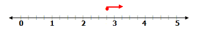

From using models to add fractions, there are two rules that become obvious. These rules are:

* Fractions can be added if they have the same denominator. To add fractions that have the same denominator, add the numerators and write the sum over the common denominator.
* When you add fractions that have different denominators, you must express the fractions as equivalent fractions with a LCD. Now, add the numerators and write the sum over the common denominator.

**Vocabulary**

__Denominator__

The **_denominator_** of a fraction is the number on the bottom that indicates the total number of equal parts in the whole or the group. $\frac{5}{8}$ has **_denominator_** 8.

__Fraction__

A **_fraction_** is any rational number that is not an integer.

__Improper Fraction__

$\frac{8}{3}$ is an **_improper fraction._**

__LCD__

The **_least common denominator_** is the lowest common multiple of the denominators of two or more fractions. The **_least common denominator_** of $\frac{3}{4}$ and $\frac{1}{5}$ is 20.

__LCM__

The **_least common multiple_** is the lowest common multiple that two or more numbers share. The **_least common multiple_** of 6 and 5 is 30.

__Mixed Number__

A **_mixed number_** is a number made up of a whole number and a fraction such as $4\frac{3}{5}$.

__Numerator__

The **_numerator_** of a fraction is the number on top that is the number of equal parts being considered in the whole or the group. $\frac{5}{8}$ has **_numerator_** 5.

**Guided Practice**

1.  Use a model to answer the problem $\frac{1}{2}+\frac{1}{6}=?$
2.  Use a number line to determine the answer to the problem $\frac{3}{4}+\frac{1}{2}$.
3.  Determine the answer to $\frac{1}{6}+\frac{3}{4}=?$ and $\frac{2}{5}+\frac{2}{3}=?$ by using the rules for adding fractions.

**Answers**

1. 

$\frac{1}{2}$ and $\frac{3}{6}$ are equivalent fractions. $\frac{1}{2} \left(\frac{3}{3}\right)=\frac{3}{6}$.

The two fractions now have the same denominator of 6.

The one yellow strip can be replaced with three green strips and the one orange strip can be replaced with one green strip.

\begin{align*}
& \frac{1}{2}+\frac{1}{6}\\
& \frac{3}{6}+\frac{1}{6}\\
& = \frac{4}{6}
\end{align*}
$$

2. $\frac{3}{4}+\frac{1}{2}$

Use a $\frac{1}{4}$ number line. The number line is labeled in intervals of 4. Place the starting point at $\frac{3}{4}$.

From this point, move to the right a total of 2 intervals. $\frac{1}{2}$ _of_ $4=2$. An equivalent fraction for $\frac{1}{2}$ is $\frac{2}{4} \cdot \frac{1}{2} \left(\frac{2}{2}\right)=\frac{2}{4}$. The point where you stop is the sum of $\frac{3}{4}+\frac{1}{2}$.

\begin{align*}
& \frac{3}{4}+\frac{1}{2}\\
& \frac{3}{4}+\frac{2}{4}\\
& =\frac{5}{4}
\end{align*}
$$

On the number line you stopped at the point $1 \frac{1}{4}$. This is equal to $\frac{5}{4}$.

3. $\frac{1}{6}+\frac{3}{4}=?$

The least common multiple of 6 and 4 is 12. This means that both fractions must have a common denominator of 12 before they can be added.

$\frac{1}{6} \left(\frac{2}{2}\right)=\frac{2}{12}$ $\frac{1}{6}$ and $\frac{2}{12}$ are equivalent fractions.

$\frac{3}{4} \left(\frac{3}{3}\right)=\frac{9}{12}$ $\frac{3}{4}$ and $\frac{9}{12}$ are equivalent fractions.

$$
\begin{align*}
& \frac{1}{6}+\frac{3}{4}\\
& \frac{2}{12}+\frac{9}{12}\\
& =\frac{11}{12}
\end{align*}
$$

$\frac{2}{5}+\frac{2}{3}=?$

The least common multiple of 5 and 3 is 15. This means that both fractions must have a common denominator of 15 before they can be added.

$\frac{2}{5} \left(\frac{3}{3}\right)=\frac{6}{15}$ $\frac{2}{5}$ and $\frac{6}{15}$ are equivalent fractions.

$\frac{2}{3} \left(\frac{5}{5}\right)=\frac{10}{15}$ $\frac{2}{3}$ and $\frac{10}{15}$ are equivalent fractions.

$$
\begin{align*}
& \frac{2}{5}+\frac{2}{3}\\
& \frac{6}{15}+\frac{10}{15}\\
& =\frac{16}{15}=1 \frac{1}{15}
\end{align*}
$$

$\frac{16}{15}$ is an improper fraction. An improper fraction is one which has a larger numerator than denominator. $\frac{15}{15}=1$ plus there is $\frac{1}{15}$ left over. This can be written as a whole number and a fraction $1 \frac{1}{15}$. This representation is called a mixed number.

**Summary**

The addition of fractions can be represented with a manipulative such as a fraction strip. A number line can also be used to show the addition of fractions. The sum of two fractions will often result in an answer that is an improper fraction. An improper fraction is a fraction which has a larger numerator than denominator. This answer can be written as a mixed number. A mixed number is a number made up of a whole number and a fraction.

The addition of fractions can be done by following two rules:

Fractions can be added only if they have the same denominator. To add fractions that have the same denominator, add the numerators and write the sum over the common denominator.

In order to add fractions that have different denominators, the fractions must be expressed as equivalent fractions with a LCD. The sum of the numerators can be written over the common denominator.

**Problem Set**

**Use fraction strips to represent the following addition problems and use that model to determine the answer.**

1.  $\frac{1}{4}+\frac{5}{8}$
2.  $\frac{2}{5}+\frac{1}{3}$
3.  $\frac{2}{9}+\frac{2}{3}$
4.  $\frac{3}{7}+\frac{2}{3}$
5.  $\frac{7}{10}+\frac{1}{5}$

**Use a number line to represent the following addition problems and use the number line to determine the answer.**

1.  $\frac{2}{3}+\frac{1}{2}$
2.  $\frac{2}{5}+\frac{3}{10}$
3.  $\frac{5}{9}+\frac{2}{3}$
4.  $\frac{3}{8}+\frac{3}{4}$
5.  $\frac{3}{5}+\frac{3}{10}$

**Use the rules that you have learned for adding integers to answer the following problems. Express all answers as proper fractions or as mixed numbers.**

1.  $\frac{7}{11}+\frac{1}{2}$
2.  $\frac{7}{8}+\frac{5}{12}$
3.  $\frac{3}{4}+\frac{5}{6}$
4.  $\frac{5}{6}+\frac{2}{5}$
5.  $\frac{4}{5}+\frac{3}{4}$

**For each of the following questions, write an addition statement and find the result. Express all answers as either proper fractions or mixed numbers.**

1.  Karen used $\frac{5}{8} \ cups$ of flour to make cookies. Jenny used $\frac{15}{16} \ cups$ of flour to make a cake. How much flour did they use altogether?
2.  Lauren used $\frac{3}{4} \ cup$ of milk, $1 \frac{1}{3} \ cups$ of flour and $\frac{3}{8} \ cup$ of oil to make pancakes. How many cups of ingredients did she use in total?
3.  Write two fractions with different denominators whose sum is $\frac{5}{6}$. Use fraction strips to model your answer.
4.  Allan’s cat ate $2 \frac{2}{3} \ cans$ of food in one week and $3 \frac{1}{4} \ cans$ the next week. How many cans of food did the cat eat in two weeks?
5.  Amanda and Justin each solved the same problem. **Amanda’s Solution** 
    
    $$
    \begin{align*}
    & \frac{1}{6}+\frac{3}{4}\\
    & \frac{2}{12}+\frac{9}{12}\\
    & =\frac{11}{24}
    \end{align*}
    $$
    
     **Justin’s Solution** 
    
    $$
    \begin{align*}
    & \frac{1}{6}+\frac{3}{4}\\
    & \frac{2}{12}+\frac{9}{12}\\
    & =\frac{11}{12}
    \end{align*}
    $$
    
     Who is correct? What would you tell the person who has the wrong answer?

Addition of Decimals
--------------------

**Objectives**

The lesson objectives for The Addition of Real Numbers are:

* Addition of Positive Decimal Numbers.
* Addition of Positive and Negative Decimal Numbers
* Addition of Decimals Using the Rules

**Introduction**

In this concept you will learn to add decimal numbers. You will learn first to add decimal numbers that are positive values. Then, you will add decimal numbers that are both negative and positive values. Mastering these concepts will lead to the formation of rules for adding decimal numbers.

**Watch This**

[Khan Academy Adding Decimals](http://www.youtube.com/watch?v=SxZUFA2SGX8)

!?[video](https://www.youtube.com/watch?v=SxZUFA2SGX8)

**Guidance**

Stephen went shopping to buy some new school supplies. He bought a backpack that cost $28.67 and a scientific calculator for $34.88. How much money did Stephen spend altogether?

Stephen bought two items. To determine the total amount of money he spent, add the prices of the items.

$\$ 28.67+\$34.88$

Adding numbers that are written horizontally is often difficult. To add the given decimal numbers, the problem should be written using the vertical alignment method. The decimal points must be kept directly under each other and the digits must be kept in the same place value in line with each other. This means that digits in the ones place must be directly below digits in the ones place, digits in the tenths place must be in the tenths column, digits in the hundredths place must be in the hundredths column and so on. Once the numbers have been correctly aligned, the addition process is the same as adding whole numbers.

**Example A**

$2.23+5.34$

Because decimal numbers represent fractions with denominators equal to multiples of ten, addition is very easy.

Begin by expressing the each decimal number as the sum of the whole number and its fraction parts.

$$
\begin{align*}
2.23 &= 2+\frac{2}{10}+\frac{3}{100}\\
5.34 &= 5+\frac{3}{10}+\frac{4}{100}
\end{align*}
$$

Add the whole numbers and the like fractions.

$$
\begin{align*}
2.23 &= 2+\frac{2}{10}+\frac{3}{100}\\
5.34 &= \frac{5+\frac{3}{10}+\frac{4}{100}}{7+\frac{5}{10}+\frac{7}{10}=7.57}
\end{align*}
$$

Instead of using this method to add decimals, simply write the decimals using the vertical alignment method and add the digits in each column.

**Example B**

$87.296+48.6$

Begin by writing the question using the vertical alignment method.

$$
\begin{align*}
& \quad 87.296\\
& \underline{+48.6\;\;\;\;}
\end{align*}
$$

The decimal points must be kept directly under each other and the digits must be kept in the same place value in line with each other. This means that digits in the ones place must be directly below digits in the ones place, digits in the tenths place must be in the tenths column, digits in the hundredths place must be in the hundredths column and so on. To ensure that the digits are aligned correctly, add zeros to 48.6.

$$
\begin{align*}
& \quad 87.296\\
& \underline{+48.6{\color{blue}00}}
\end{align*}
$$

Add the numbers.

$$
\begin{align*}
& \quad 87.296\\
& \underline{+ 48.6{\color{blue}00}}\\
& 135.896
\end{align*}
$$

**Example C**

$(97.38)+(-45.17)$

The first step is to write the problem using the vertical alignment method. The two decimal numbers that are being added have opposite signs. Apply the same rule that you used when adding integers that had opposite signs – subtract the numbers and use the sign of the larger number in the answer.

$$
\begin{align*}
& \quad 97.38\\
& \underline{- 45.17}\\
& \quad 52.21
\end{align*}
$$

The larger decimal number is 97.38 and it has a positive sign. This means that the sign of the answer will also be a positive value.

**Example D**

$(-168.8)+(-217.4536)$

The first step is to write the problem using the vertical alignment method. The two decimal numbers that are being added have the same signs. Apply the same rule that you used when adding integers that had same signs – add the numbers and use the sign of the numbers in the answer.

$$
\begin{align*}
& \quad -168.8\\
& \underline{+-217.4536}
\end{align*}
$$

To ensure that the digits are aligned correctly, add zeros to 168.8. Add the numbers.

$$
\begin{align*}
& \quad -168.8{\color{blue}000}\\
& \underline{+-217.4536}
\end{align*}
$$

Add the numbers.

$$
\begin{align*}
& \quad -168.8{\color{blue}000}\\
& \underline{+-217.4536}\\
& \ \ -386.2536
\end{align*}
$$

The decimal numbers being added both had negative signs. This means that the sign of the answer is also a negative value.

**Vocabulary**

__Decimal Number__

A **_decimal number_** is a fraction whose denominator is 10 or some multiple of 10.

__Decimal Point__

A **_decimal point_** is the place marker in a decimal number that separates the whole number and the fraction part. The decimal number 326.45 has the decimal point between the six and the four.

**Guided Practice**

1.  Add these decimal numbers by using the expanded fraction form: $14.68+39.217$
2.  $45.36+15+137.692+32.8$
3.  $(53.69)+(-33.7)+(6.298)$

**Answers**

1. $14.68+39.217$

$$
\begin{align*}
14.68 &= 14+\frac{6}{10}+\frac{8}{100}\\
39.217 &= 39+\frac{2}{10}+\frac{1}{100}+\frac{7}{1000}
\end{align*}
$$

As in adding decimals using the vertical alignment method, add a zero to 14.68 so that both addends have the same number of fraction parts.

$$
\begin{align*}
14.68{\color{blue}0} &= 14+\frac{6}{10}+\frac{8}{100}+\frac{{\color{blue}0}}{1000}\\
39.217 &= 39+\frac{2}{10}+\frac{1}{100}+\frac{7}{1000}
\end{align*}
$$

Add the whole numbers and the like fractions.

$$
\begin{align*}
14.68{\color{blue}0} &= 14+\frac{6}{10}+\frac{8}{100}+\frac{{\color{blue}0}}{1000}\\
39.217 &= \frac{39+\frac{2}{10}+\frac{1}{100}+\frac{7}{1000}}{53+\frac{8}{10}+\frac{9}{100}+\frac{7}{1000}=53.897}
\end{align*}
$$

2. $45.36+15+137.692+32.8$

Write the decimal numbers using the vertical alignment method.

$$
\begin{align*}
& \quad 45.36\\
& \quad 15\\
& \ 137.692\\
& \underline{+32.8}
\end{align*}
$$

Attach zeros to provide the same number of decimal digits in all of the addends. In a whole number, the decimal point is not written but it is understood as being at the end of the number. $15=15$.

$$
\begin{align*}
& \quad 45.36{\color{blue}0}\\
& \quad 15.{\color{blue}000}\\
& \ 137.692\\
& \underline{+32.8{\color{blue}00}}
\end{align*}
$$

**Add the numbers in each vertical column.**

$$
\begin{align*}
& \overset{2 1 \ \ 1}{\quad 45.36{\color{blue}0}}\\
& \quad 15.{\color{blue}000}\\
& \ 137.692\\
& \underline{+ 32.8{\color{blue}00}}\\
& \ 230.852
\end{align*}
$$

3. $(53.69)+(-33.7)+(6.298)$

Add the two positive decimal numbers. The answer will have a positive value – add the numbers with the same sign and the answer will have the same sign as the number being added.

$53.69+6.298$

Write the numbers using the vertical alignment method and add zeros so that all addends will have the same number of decimal digits. Add the numbers in each vertical column.

$$
\begin{align*}
& \quad 53.69{\color{blue}0}\\
& \underline{+ \ \ 6.298}\\
& \quad 59.988
\end{align*}
$$

Add the negative decimal number to this answer. When adding numbers with opposite signs, subtract the numbers and the answer will have the sign of the larger number. In this case, the larger number is 59.988, so the answer will have a positive value. Don’t forget the zeros.

$$
\begin{align*}
& \quad 59.988\\
& \underline{-33.7{\color{blue}00}}\\
& \ \ 26.288
\end{align*}
$$

**Summary**

The addition of decimal numbers is simply the addition of whole numbers and like fraction parts. To make this process simpler, the decimal numbers are written using the vertical alignment method. The decimal points are aligned and the numbers are aligned according to their place value. The numbers in each vertical column are then added. If the decimal numbers are signed numbers, the rules for adding integers are applied to the problem.

**Problem Set**

**Add the following decimal numbers by using the expanded fraction form:**

1.  $14.36+9.42$
2.  $52.72+27.163$
3.  $0.26+4.5+1.137$
4.  $37.231+14.567$
5.  $78.32+6.2+19.46$

**Add the following decimal numbers:**

1.  $65.23+12.75$
2.  $148.067+53.78+6.9$
3.  $56.75+14.9294+17.854$
4.  $18+26.87+65.358$
5.  $23.067+268.93+9.4$

**Add the following signed decimal numbers:**

1.  $(-24.69)+(-39.87)$
2.  $(76.35)+(-36.68)$
3.  $(-12.5)+(47.97)+(-21.653)$
4.  $(62.462)+(254.69)+(-427.9)$
5.  $(-37.76)+(-45.8)+(53.92)$

**Determine the answer to the following problems.**

1.  When the owners of the Finest Fixer Co. completed a small construction job, they found that the following expenses had been incurred: labour, $975.75; gravel, $88.79; sand, $43.51; cement, $284.96; and bricks $2214.85. What bill should they give the customer if they want to make a profit of $225 for the job?
2.  A tile setter purchases the following supplies for the day:
    
    * One bag of thin-set mortar - @$5.67 per bag
    * 44 sq ft of tile - @$107.80 for 44 sq ft of tile
    * One gallon of grout - @$17.97 per gallon
    * One container of grout sealer - @$32.77 per container
    * 3 containers of grout and tile cleaner - @$5.99 per container
    * 4 scrub pads - @$2.78 each
    * One trowel - @ 3.95 each
    * 2 packages of tile spacers - @2.27 each
    * One grout bag - @2.79 each
    * One grout float - @10.45 each
    
    What is the cost of these items before tax is added?
    
3.  The four employees of the Broken Body Shop earned the following amounts last week: $815.86, $789.21, $804.18 and $888.35. What is the average weekly pay for the employees?
4.  Jennifer bought the following school supplies:
    
    * 1000 sheets of paper - @$14.67
    * 36 pencils - @ $6.55
    * 1 binder - @$18.48
    * 1 backpack - @ $22.74
    * 1 lunch bag - @ 4.64
    
    How much did Jennifer spend on these supplies before taxes?
    
5.  A local seamstress needs to purchase fabric to sew curtains for the local theatre. She needs 123.75 yd. of black cotton for a backdrop, 217.4 yd. of white linen for stage curtains, 75 yd. for accessory curtains and 98.5 yd. for costumes. How many yards of fabric must be purchased to fill this order?

Summary
-------

In this lesson you have learned how to add real numbers by using a variety of models. The real numbers that you added were integers, fractions and decimal numbers. The models that were used to add integers were color counters, algebra tiles and a number line. By using these models, you learned the two rules for adding integers. These rules were: Integers with unlike signs must be subtracted and the answer will have a sign the same as that of the higher number. Integers with the same sign must be added and the answer will have a sign the same as that of the numbers being added. After adding integers, you then learned how to add fractions by using fraction strips and a number line. You learned that fractions can only be added if they have a common denominator. The sum of the numerators of the fractions being added is placed over the common denominator. If the numerator of the fraction is larger than the denominator, the answer could be expressed as a mixed number. The last real numbers that were added were decimal numbers. When adding decimal numbers that were signed numbers, the rules for the addition of integers were applied to the problems.

</article>

### 1.2 Subtraction of Real Numbers

<article>

Subtraction of Integers
-----------------------

**Objectives**

The lesson objectives for The Subtraction of Real Numbers are:

* Subtraction of Integers Using Models
* Subtraction of Integers Using the Number Line
* Subtraction of Integers Using the Rules

**Introduction**

In this concept you will learn to subtract integers by using different representations. You will learn how to subtract integers by using appropriate models and by using the number line. These methods will lead to the formation of two rules for subtracting integers.

**Watch This**

[Khan Academy Adding/Subtracting Negative Numbers](http://www.youtube.com/watch?v=C38B33ZywWs)

!?[video](https://www.youtube.com/watch?v=C38B33ZywWs)

**Guidance**

**Example A**

* To subtract one signed number from another, change the question from a subtraction question to an addition question, and change the sign of the number that was originally being subtracted. In other words, to subtract signed numbers simply add the opposite. Once these changes have been made, follow the rules for adding signed numbers.

$7-(-3)=? \quad 7+(+3)=?$

The problem can be represented by using color counters. In this case, the red counters represent positive numbers.

=10$")

**Example B**

$$
\begin{align*}
4-(+6) &= ?\\
4+(-6) &= ?
\end{align*}
$$

Change the problem to an addition problem and change the sign of the original number that was being subtracted.

One positive counter and one negative counter equals zero. $1+(-1)=0$

Draw a line through the counters that equal zero.

=-2$. The answer is the difference between 6 and 4. The answer takes on the sign of the larger digit and in this case the six has a negative value and it is greater than 4.")

**Example C**

This same method can be extended to adding variables. Algebra tiles can be used to represent positive and negative values.

$$
\begin{align*}
5x-(+8x) &= ?\\
5x+(-8x) &= ?
\end{align*}
$$

Add the opposite.

-(+8x)=-3x$. The answer is the difference between $8x$ and $5x$. The answer takes on the sign of the larger digit and in this case the eight has a negative value and it is greater than 5.")

**Example D**

$$
\begin{align*}
(-4)-(+3) &= ?\\
(-4)+(-3) &= ?
\end{align*}
$$

Add the opposite

The solution to this problem can be determined by using the number line.

Indicate the starting point of –4 by using a dot. From this point, add a –3 by moving three places to the left. You will stop at –7.

-(+3)=-7$")

The answer is the sum of 4 and 3. The answer takes on the sign of the digits being added. In this case the 4 and the 3 have negative signs. The answer will be a negative number.

From using models to subtract integers, there are two rules that become obvious. These rules are:

* When you subtract integers you change the question to an addition problem and change the sign of the original number being subtracted.
* Follow the rules for adding integers. When you add two integers with the same sign, add the numbers and use the sign of the digits being added. When you add two integers that have opposite signs, subtract the numbers and use the sign of the larger digit.

**Vocabulary**

__Integer__

All natural numbers, their opposites, and zero are **_integers_**. A number in the list ..., –3, –2, –1, 0, 1, 2, 3...

__Number Line__

A **_number line_** is a line that matches a set of points and a set of numbers one to one.

It is often used in mathematics to show mathematical computations.

1.  Use a model to answer the problem $(-2)-(-6)=?$
2.  Use the number line to determine the answer to the problem $7-(+5)=?$
3.  Determine the answer to $(-8)-(-5)=?$ and $(-4)-(+9)=?$ by using the rules for subtracting integers.

**Answers**

1. 

$$
\begin{align*}
(-2)-(-6) &= ?\\
(-2)+(+6) &= ?
\end{align*}
$$

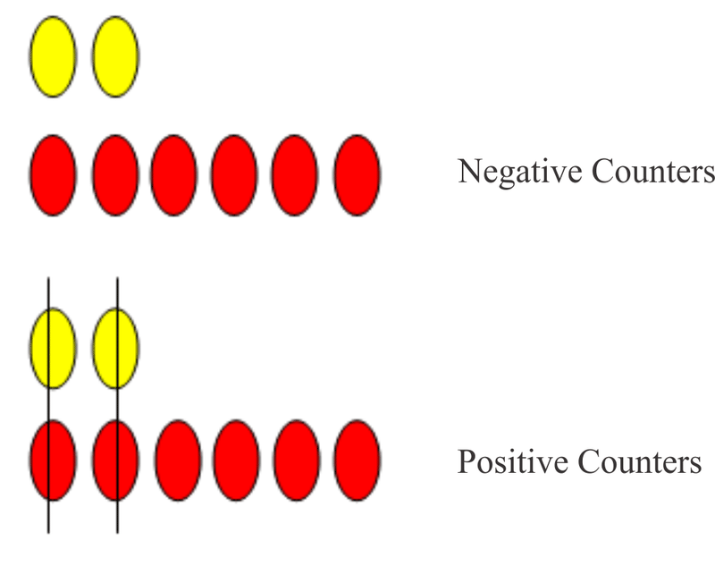

There are 4 positive counters left. Therefore, $(-2)-(-6)=4$. The answer is the difference between 6 and 2. The answer takes on the sign of the larger digit and in this case the six has a positive value and it is greater than 2.

2. 

$$
\begin{align*}
(7)-(+5) &=?\\
(7)+(-5) &= ?
\end{align*}
$$

=2$.")

The answer is the difference between 7 and 5. The answer takes on the sign of the larger digit and in this case the seven has a positive value and it is greater than 5.

3. 

$$
\begin{align*}
(-8)-(-5) &= ?\\
(-8)+(+5) &= ?
\end{align*}
$$

When the problem is written as an addition question and the sign of the original number being subtracted is changed to a positive, the numbers have opposite signs. The numbers must be subtracted and the answer is a negative value since the larger digit of 8 has a negative sign. Therefore, $(-8)-(-5)=-3$

$$
\begin{align*}
(-4)-(+9) &= ?\\
(-4)+(-9) &= ?
\end{align*}
$$

When the problem is written as an addition question and the sign of the original number being subtracted is changed to a negative, the numbers have the same signs. The numbers must be added and the answer is a negative value. Therefore, $(-4)-(+9)=-13$

**Summary**

The subtraction of integers can be represented with manipulatives such as color counters and algebra tiles. A number line can also be used to show the subtraction of integers. The subtraction of integers can be done by following two rules: When you subtract integers you change the question to an addition problem and you change the sign of the original number being subtracted. When the problem has been written as an addition problem, follow the rules for adding integers. When you add two integers with the same sign, add the numbers and use the sign of the digits being added. When you add two integers that have opposite signs, subtract the numbers and use the sign of the larger digit.

**Problem Set**

**Use color counters to represent the following subtraction problems and use that model to determine the answer.**

1.  $(-9)-(-2)$
2.  $(5)-(+8)$
3.  $(5)-(-4)$
4.  $(-7)-(-9)$
5.  $(6)-(+5)$

**Use a number line to represent the following subtraction problems and use the number line to determine the answer.**

1.  $(8)-(+4)$
2.  $(-2)-(-7)$
3.  $(3)-(+5)$
4.  $(-6)-(-10)$
5.  $(-4)-(-7)$

**Use the rules that you have learned for subtracting integers to answer the following problems and state the rule that you used.**

1.  $(-13)-(-9)$
2.  $(-6)-(+8)-(-12)$
3.  $(14)-(+8)-(-6)$
4.  $(18)-(+8)-(+3)$
5.  $(10)-(-6)-(+4)-(+2)$

**For each of the following models, write a subtraction problem and answer the problem. (Hint: You may find it easier to write an addition problem and then to rewrite the problem as a subtraction question)**

1.  
    
    \[Figure 11\]
    
2.  
    
    \[Figure 12\]
    
3.  
    
    \[Figure 13\]
    
4.  
    
    \[Figure 14\]
    
5.  
    
    \[Figure 15\]
    

Subtraction of Fractions
------------------------

**Objectives**

The lesson objectives for The Subtraction of Real Numbers are:

* Subtraction of Fractions Using Models
* Subtraction of Fractions Using the Number Line
* Subtraction of Fractions Using the Rules

**Introduction**

In this concept you will learn to subtract real numbers using different representations. You will learn to subtract fractions by using appropriate models and by using the number line. These methods will lead to the formation of rules for subtracting fractions.

**Watch This**

[Khan Academy Adding and Subtracting Fractions](http://www.youtube.com/watch?v=52ZlXsFJULI)

!?[video](https://www.youtube.com/watch?v=52ZlXsFJULI)

**Guidance**

$\frac{5}{7}-\frac{2}{7}=?$

The problem can be represented by using fraction strips. You can create these fraction strips yourself or you can use commercial pieces called Fraction Factory pieces. Those being presented in the following examples are not the commercial type. Therefore, the colors used are simply a personal choice. This first example will explore subtracting positive fractions that have the same denominator.

\boxed{\frac{5}{7}-\frac{2}{7}=\frac{5-2}{7}=\frac{3}{7}}
$$

To subtract fractions, the fractions must have the same bottom numbers (denominators). Both fractions have a denominator of 7. The answer is the result of subtracting the top numbers (numerators). The numbers in the numerator are 5 and 2. The difference of 5 and 2 is 3. This difference is written in the numerator over the denominator of 7. Therefore $\frac{5}{7}-\frac{2}{7}=\frac{3}{7}$.

**Example A**

$\frac{8}{11}-\frac{6}{11}=?$

This first example will explore subtracting positive fractions that have the same denominator.

\boxed{\frac{8}{11}-\frac{6}{11}=\frac{8-6}{11}=\frac{2}{11}}
$$

To subtract fractions, the fractions must have the same bottom numbers (denominators). Both fractions have a denominator of 11. The answer is the result of subtracting the top numbers (numerators). The numbers in the numerator are 8 and 6. The difference of 8 and 6 is 2. This difference is written in the numerator over the denominator of 11. Therefore $\frac{8}{11}-\frac{6}{11}=\frac{2}{11}$.

**Example B**

Bessie is measuring the amount of soda in the two coolers in the cafeteria. She estimates that the first cooler is $\frac{2}{3}$ full and the second cooler is $\frac{1}{4}$ full. What single fraction could Bessie use to represent how much more soda is in the first cooler than in the second cooler?

$\frac{2}{3}$ and $\frac{8}{12}$ are equivalent fractions. $\frac{2}{3} \left(\frac{4}{4}\right)=\frac{8}{12}$.

$\frac{1}{4}$ and $\frac{3}{12}$ are equivalent fractions. $\frac{1}{4} \left(\frac{3}{3}\right)=\frac{3}{12}$.

The two green pieces will be replaced with eight purple pieces and the one blue piece will be replaced with three purple pieces.

 of $\frac{2}{3}$ and $\frac{1}{4}$ because it is the LCM (least common multiple) of the denominators 3 and 4.")

**Example C**

A number line can also be used to subtract fractions. In the following example, a mixed number which is a whole number and a fraction will be added to a fraction by using a $\frac{1}{4}$ number line.

$1 \frac{3}{4}-\frac{1}{2}$

The number line is labeled in intervals of 4 which indicates that each interval represents $\frac{1}{4}$. From zero, move to the number 1 plus 3 more intervals to the right. Mark the location. This represents $1 \frac{3}{4}$.

From here, move to the left $\frac{1}{2}$ or $\frac{1}{2}$ of 4, which is 2 intervals. An equivalent fraction for $\frac{1}{2}$ is $\frac{2}{4}$.

Having used models to subtract fractions, there are two rules that become obvious. These rules are:

* Fractions can be subtracted if they have the same denominator. To subtract fractions that have the same denominator, subtract the numerators and write the difference over the common denominator.
* When you subtract fractions that have different denominators, you must express the fractions as equivalent fractions with a LCD. Now, subtract the numerators and write the difference over the common denominator.

**Vocabulary**

__Denominator__

The **_denominator_** of a fraction is the number on the bottom that indicates the total number of equal parts in the whole or the group. $\frac{5}{8}$ has **_denominator_** 8.

__Fraction__

A **_fraction_** is any rational number that is not an integer.

__LCD__

The **_least common denominator_** is the lowest common multiple of the denominators of two or more fractions. The **_least common denominator_** of $\frac{3}{4}$ and $\frac{1}{5}$ is 20.

__LCM__

The **_least common multiple_** is the lowest common multiple that two or more numbers share. The **_least common multiple_** of 6 and 5 is 30.

__Numerator__

The **_numerator_** of a fraction is the number on top that is the number of equal parts being considered in the whole or the group. $\frac{5}{8}$ has **'numerator** 5.

**Guided Practice**

1.  Use a model to answer the problem $\frac{7}{10}-\frac{2}{5}=?$
2.  Use a number line to determine the answer to the problem $\frac{7}{8}-\frac{1}{2}$.
3.  Determine the answer to $\frac{5}{8}-\frac{1}{3}=?$ and $\frac{4}{5}-\frac{1}{4}=?$ by using the rules for subtracting fractions.

**Answers**

1. 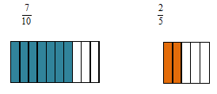

The fractions do not have a common denominator. An equivalent fraction for $\frac{2}{5}$ _is_ $\left(\frac{2}{2}\right) \left(\frac{2}{5}\right)=\frac{4}{10}$

$$
\boxed{\frac{7}{10}-\frac{4}{10}=\frac{7-4}{10}=\frac{3}{10}}
$$

2. $\frac{7}{8}-\frac{1}{2}$

Use a $\frac{1}{8}$ number line. The number line is labeled in intervals of 8. Place the starting point at $\frac{7}{8}$.

From this point, move to the left a total of 4 intervals. $\frac{1}{2}$ _of_ $8=4$. An equivalent fraction for $\frac{1}{2}$ is $\frac{1}{2} \left(\frac{4}{4} \right)=\frac{4}{8}$. The point where you stop is the difference of $\frac{7}{8}$ _and_ $\frac{1}{2}$.

3. $\frac{5}{8}-\frac{1}{3}=?$

The least common multiple of 8 and 3 is 24. This means that both fractions must have a common denominator of 24 before they can be subtracted.

$\frac{5}{8} \left(\frac{3}{3}\right)=\frac{15}{24}$ $\frac{5}{8}$ and $\frac{15}{24}$ are equivalent fractions.

$\frac{1}{3} \left(\frac{8}{8}\right)=\frac{8}{24}$ $\frac{1}{3}$ and $\frac{8}{24}$ are equivalent fractions.

$$
\begin{align*}
& \frac{5}{8}-\frac{1}{3}\\
& \frac{15}{24}-\frac{8}{24}\\
& =\frac{15-8}{24}=\frac{7}{24}
\end{align*}
$$

$\frac{4}{5}-\frac{1}{4}=?$

The least common multiple of 5 and 4 is 20. This means that both fractions must have a common denominator of 20 before they can be added.

$\frac{4}{5} \left(\frac{4}{4}\right)=\frac{16}{20}$ $\frac{4}{5}$ and $\frac{16}{20}$ are equivalent fractions.

$\frac{1}{4} \left(\frac{5}{5}\right)=\frac{5}{20}$ $\frac{1}{4}$ and $\frac{5}{20}$ are equivalent fractions.

$$
\begin{align*}
& \frac{4}{5}-\frac{1}{4}\\
& \frac{16}{20}-\frac{5}{20}\\
& =\frac{16-5}{20}=\frac{11}{20}
\end{align*}
$$

**Summary**

The subtraction of fractions can be represented with a manipulative such as a fraction strip. A number line can also be used to show the subtraction of fractions.

The subtraction of fractions can be done by following two rules:

Fractions can be subtracted only if they have the same denominator. To subtract fractions that have the same denominator, subtract the numerators and write the difference over the common denominator.

In order to subtract fractions that have different denominators, the fractions must be expressed as equivalent fractions with a LCD. The difference of the numerators can be written over the common denominator.

**Problem Set**

**Use fraction strips to represent the following subtraction problems and use that model to determine the answer.**

1.  $\frac{3}{4}-\frac{5}{8}$
2.  $\frac{4}{5}-\frac{2}{3}$
3.  $\frac{5}{9}-\frac{1}{3}$
4.  $\frac{6}{7}-\frac{2}{3}$
5.  $\frac{7}{10}-\frac{1}{5}$

**Use a number line to represent the following subtraction problems and use the number line to determine the answer.**

1.  $\frac{2}{3}-\frac{1}{2}$
2.  $\frac{3}{5}-\frac{3}{10}$
3.  $\frac{7}{9}-\frac{1}{3}$
4.  $\frac{5}{8}-\frac{1}{4}$
5.  $\frac{2}{5}-\frac{2}{10}$

**Use the rules that you have learned for subtracting fractions to answer the following problems.**

1.  $\frac{7}{11}-\frac{1}{2}$
2.  $\frac{5}{8}-\frac{5}{12}$
3.  $\frac{5}{6}-\frac{3}{4}$
4.  $\frac{5}{6}-\frac{2}{5}$
5.  $\frac{4}{5}-\frac{3}{4}$

**For each of the following questions, write a subtraction statement and find the result.**

1.  Sally used $\frac{2}{3} \ cups$ of flour to make cookies. Terri used $\frac{1}{2} \ cups$ of flour to make a cake. Who used more flour? How much more flour did she use?
2.  Lauren used $\frac{3}{4} \ cup$ of milk, $1 \frac{1}{3} \ cups$ of flour and $\frac{3}{8} \ cup$ of oil to make pancakes. Alyssa used $\frac{3}{8} \ cup$ of milk, $2 \frac{1}{4} \ cups$ of flour and $\frac{1}{3} \ cup$ of melted butter to make waffles. Who used more cups of ingredients? How many more cups of ingredients did she use?
3.  Write two fractions with different denominators whose difference is $\frac{3}{8}$. Use fraction strips to model your answer.
4.  Jake’s dog ate $12 \frac{2}{3} \ cans$ of food in one week and $9 \frac{1}{4} \ cans$ the next week. How many more cans of dog food did Jake’s dog eat in week one?
5.  Sierra and Clark each solved the same problem. **Sierra’s Solution** 
    
    $$
    \begin{align*}
    & \frac{3}{4}-\frac{1}{6}\\
    & \frac{9}{12}-\frac{2}{12}\\
    & =\frac{7}{12}
    \end{align*}
    $$
    
     **Clark’s Solution** 
    
    $$
    \begin{align*}
    & \frac{3}{4}-\frac{1}{6}\\
    & \frac{9}{12}-\frac{2}{12}\\
    & =\frac{7}{0}
    \end{align*}
    $$
    
     Who is correct? What would you tell the person who has the wrong answer?

Subtraction of Decimal Numbers
------------------------------

**Objectives**

The lesson objectives for The Subtraction of Real Numbers are:

* Subtraction of Positive Decimal Numbers.
* Subtraction of Positive and Negative Decimal Numbers
* Subtraction of Decimals Using the Rules

**Introduction**

In this concept you will learn to subtract decimal numbers. You will learn first to subtract decimal numbers that are positive values by applying the vertical alignment method. Then, you will subtract decimal numbers that are both negative and positive values. You will again apply the rules for adding integers since subtracting decimals that are signed numbers is the same as adding the opposite. Mastering these concepts will lead to the formation of rules for subtracting decimal numbers.

**Watch This**

[Khan Academy Subtracting Decimals](http://www.youtube.com/watch?v=0mOH-qNGM7M)

!?[video](https://www.youtube.com/watch?v=0mOH-qNGM7M)

**Guidance**

Jeremy and his family are driving to visit his grandparents. On the first day they drove 234.8 miles and on the second day they drove 251.6 miles. How many more miles did they drive on the second day?

To answer this question, the decimal numbers should be written using the vertical alignment method. The decimal number of greater magnitude should be placed above the number of smaller magnitude. Magnitude is simply the size of the number without respect to its sign or direction. The number –42.8 has a direction to the left and a magnitude of 42.8. The decimal points must be kept directly under each other and the digits must be kept in the same place value in line with each other. This means that digits in the ones place must be directly below digits in the ones place, digits in the tenths place must be in the tenths column, digits in the hundredths place must be in the hundredths column and so on. Once the numbers have been correctly aligned, the subtraction process is the same as subtracting whole numbers.

The decimal number 251.6 is of greater magnitude than 234.8. The numbers must be vertically aligned with the larger one above the smaller one. Now the numbers can be subtracted.

**Example A**

Subtract: $57.62 - 6.18$

Subtracting decimals is similar to subtracting whole numbers. We line up the decimal points so that we can subtract corresponding place value digits (e.g. tenths from tenths, hundredths from hundredths, and so on). As with whole numbers, we start from the right and work toward the left remembering to borrow when it is necessary.

To answer this question, the decimal numbers should be written using the vertical alignment method. Don’t forget to put the number of greater magnitude above the smaller number.

$$
\begin{align*}
& \quad 57. \cancel{\overset{5}{6}} \ ^1 2\\
& \underline{ \; \; -6.1 \; \; \; 8}\\
& \quad 51.4 \ \ 4
\end{align*}
$$

**Example B**

$(98.04)-(32.801)$

Begin by writing the question using the vertical alignment method.

$$
\begin{align*}
& \quad 98.04\\
& \underline{-32.801}\\
&
\end{align*}
$$

The decimal points must be kept directly under each other and the digits must be kept in the same place value in line with each other. This means that digits in the ones place must be directly below digits in the ones place, digits in the tenths place must be in the tenths column, digits in the hundredths place must be in the hundredths column and so on. To ensure that the digits are aligned correctly, add zero to 98.04.

&nbsp; 

$$
\begin{align*}
& \ \ 98.04 {\color{blue}0}\\
& \underline{-32.801}\\
&
\end{align*}
$$

Subtract the numbers.

&nbsp; 

$$
\begin{align*}
& \ \ 9 \overset{7}{\cancel{8}}.^1 0 \overset{3}{\cancel{4}} \ ^1 {\color{blue}0}\\
& \underline{-32. \; 80 \; \; \; 1}\\
& \ \ 65. \ 23 \quad 9
\end{align*}
$$

**Example C**

$(67.65)-(-25.43)$

The first step is to write the problem as an addition problem and to change the sign of the original number being subtracted. In other words, add the opposite.

$(67.65)+(+25.43)$

Now, write the problem using the vertical alignment method. The two decimal numbers that are being added have positive signs. Apply the same rule that you used when adding integers that had same signs – add the numbers and use the sign of the numbers in the answer.

&nbsp;

$$
\begin{align*}
& \ \quad 67.65\\
& \underline{ \;\; +25.43}\\
& +93.08
\end{align*}
$$

**Example D**

$(137.4)-(+259.687)$

The first step is to write the problem as an addition problem and to change the sign of the original number being subtracted. In other words, add the opposite.

$(137.4)+(-259.687)$

Now write the problem using the vertical alignment method. Remember to put 259.687 above 137.4 because 259.687 is the number of greater magnitude. The two decimal numbers that are being added have opposite signs. Apply the same rule that you used when adding integers that had opposite signs – subtract the numbers and use the sign of the larger number in the answer.

$$
\begin{align*}
&-259.687\\
& \underline{ \; +137.4 \;\;\;}\\
&
\end{align*}
$$

To ensure that the digits are aligned correctly, add zeros to 137.4.

$$
\begin{align*}
& -259.687\\
& \underline{ \; +137.4 {\color{blue}00}}\\
&
\end{align*}
$$

Subtract the numbers.

&nbsp;

$$
\begin{align*}
& \ -259.687\\
& \underline{ \;\; +137.4 {\color{blue}00}}\\
& -122.287
\end{align*}
$$

The decimal numbers being added have opposite signs. This means that the sign of the answer will be the same sign as that of the number of greater magnitude. In this problem the answer will have a negative sign.

**Vocabulary**

__Decimal Number__

A **_decimal number_** is a fraction whose denominator is 10 or some multiple of 10.

__Decimal Point__

A **_decimal point_** is the place marker in a decimal number that separates the whole number and the fraction part. The decimal number 326.45 has the decimal point between the six and the four.

__Magnitude__

A **_magnitude_** is the size of a number without respect to its direction. The number –35.6 has a direction to the left and a **_magnitude_** of 35.6.

**Guided Practice**

1.  Subtract these decimal numbers: $(243.67)-(196.3579)$
2.  $(32.47)-(-28.8)-(19.645)$
3.  Josie has $59.27 in her bank account. She went to the grocery store and wrote a cheque for $62.18 to pay for the groceries. Describe Josie’s balance in her bank account now.

**Answers**

1. $(243.67)-(196.3579)$

Write the decimal numbers using the vertical alignment method.

$$
\begin{align*}
& \quad 243.67\\
& \underline{-196.3579}\\
&
\end{align*}
$$

To ensure that the digits are properly aligned, add zeros to 243.67

$$
\begin{align*}
& \quad 243.67 {\color{blue}00}\\
& \underline{-196.3579}\\
&
\end{align*}
$$

Subtract the numbers. Work from right to left and borrow when it is necessary.

&nbsp; 

$$
\begin{align*}
& \ \ \overset{1}{\cancel{2}} \ \overset{13}{\cancel{4}} \ {^1} 3.6 \overset{6}{\cancel{7}} \ \overset{9}{^1 {\color{blue}\bcancel{0}}} \ {^1} {\color{blue}0}\\
& \underline{ -1 \; 9 \; \;\; 6.35 \;\; 7 \;\;\; 9\;\;}\\
& \quad \ \ 4 \ \ 7.31 \ \ 2 \ \ 1
\end{align*}
$$

2. $(32.47)-(-28.8)-(19.645)$

Write the question as an addition problem and change the sign of the original number being subtracted.

$(32.47)+(+28.8)+(-19.645)$

Follow the rules for adding integers. Like signs – add and use the sign of the numbers Being added.

&nbsp; 

$$
\begin{align*}
& \ \ 32.47 \qquad \text{Add a zero to} \ 28.8\\
& \underline{ +28.8 {\color{blue}0}}\\
&
\end{align*}
$$

Add the numbers

&nbsp; 

$$
\begin{align*}
& \ \ 32.47\\
& \underline{ +28.8 {\color{blue}0}}\\
& \ \ 61.27
\end{align*}
$$

The numbers being added are both positive so the answer will also be positive.

$(+61.27)+(-19.645)$

Write the problem using the vertical alignment method.

$$
\begin{align*}
& \quad 61.27 {\color{blue}0}\\
& \underline{-19.645}\\
&
\end{align*}
$$

The number of greater magnitude was written above the smaller number. A zero was added to 61.27. The numbers have opposite signs so they will be subtracted and the answer will have the same sign as the larger number – positive.

$$
\begin{align*}
& \quad 61.27 {\color{blue}0}\\
& \underline{-19.645}\\
& \ \ 41.625
\end{align*}
$$

3. Amount in her bank account: $59.27

Amount of the written cheque: $62.18

The amount of the cheque is greater than the amount of money in the account.

The account will have a negative value. This means that her account is overdrawn.

**Summary**

The subtraction of decimal numbers is simply the subtraction of whole numbers and like fraction parts. To make this process simpler, the decimal numbers are written using the vertical alignment method with the number of greater magnitude being written above the number of lesser magnitude. The decimal points are aligned and the numbers are aligned according to their place value. The numbers in each vertical column are then subtracted by starting right and working to the left. If the decimal numbers are signed numbers, the rules for subtracting integers are applied to the problem.

**Problem Set**

**Subtract the following decimal numbers:**

1.  $42.37-15.32$
2.  $37.891-7.2827$
3.  $579.237-45.68$
4.  $4.2935-0.327$
5.  $16.074-7.58$

**Subtract the following signed decimal numbers:**

1.  $(-17.39)-(-49.68)$
2.  $(92.75)+(-106.682)$
3.  $(-72.5)-(-77.57)-(31.724)$
4.  $(-82.456)-(279.83)+(-567.3)$
5.  $(-57.76)-(-85.9)-(33.84)$

**Determine the answer to the following problems.**

1.  The diameter of No. 12 bare copper wire is 0.08081 in., and the diameter of No. 15 bare copper wire is 0.05707 in. How much larger is No.12 wire than No. 15 wire?
2.  The resistance of an armature while it is cold is 0.208 ohm. After running for several minutes, the resistance increases to 1.340 ohms. Find the increase in resistance of the armature.
3.  The highest temperature recorded in Canada this year was $114.8^\circ F$. The lowest temperature of $-62.9^\circ F$ was recorded in February this year. Find the difference between the highest and lowest temperatures recorded in Canada this year.
4.  The temperature in Alaska was recorded as $-78.64^\circ F$ in January of 2010 and as $-59.8^\circ F$ on the same date in 2011. What is the difference between the two recorded temperatures?
5.  Laurie has a balance of –$32.16 in her bank account. Write a problem that could represent this balance.

Summary
-------

In this lesson you have learned how to subtract real numbers by using a variety of models. The real numbers that you subtracted were integers, fractions and decimal numbers. The models that were used to subtract integers were color counters, algebra tiles and a number line. By using these models, you learned that subtracting integers was actually adding the opposite. The subtraction problems were written as addition problems and the sign of the original number being subtracted was changed. To calculate the answer, the two rules for adding integers were applied. After subtracting integers, you then learned how to subtract fractions by using fraction strips and a number line. You learned that fractions can only be subtracted if they have a common denominator. The difference of the numerators of the fractions being subtracted is placed over the common denominator. The last real numbers that were subtracted were decimal numbers. You learned that a number has both direction and magnitude. The direction of a positive number is to the right and that of a negative number is to the left. This direction is determined by the number's location with respect to zero on the number line. The magnitude of a number is simply its size with no regard to its sign. When subtracting decimal numbers that were signed numbers, the rules for the addition of integers were applied to the problems.

</article>

### 1.3 Multiplication of Real Numbers

<article>

 

Multiplication of Integers
--------------------------

**Objectives**

The lesson objectives for The Multiplication of Real Numbers are:

* Multiplication of Integers Using Rules
* Multiplication of Fractions Using Rules
* Addition of Decimal Numbers Using the Rules

**Introduction**

In this concept you will learn to multiply integers, fractions and decimal numbers by using rules. All of these will be presented in one lesson. To become familiar with the processes, you will watch videos that demonstrate each of the objectives.

**Watch This**

[Khan Academy Multiplying and Dividing Negative Numbers](https://www.youtube.com/watch?v=d8lP5tR2R3Q)

!?[video](https://www.youtube.com/watch?v=d8lP5tR2R3Q)

[Khan Academy Multiplying Fractions](http://www.youtube.com/watch?v=Mnu16kCRW4U)

!?[video](https://www.youtube.com/watch?v=Mnu16kCRW4U)

[Khan Academy Multiplication 8: Multiplying Decimals](http://www.youtube.com/watch?v=m5z6pOsxF_8)

!?[video](https://www.youtube.com/watch?v=m5z6pOsxF_8)

**Guidance**

Multiplication by a positive integer can be thought of as repeated addition. To represent this by using color counters, one red counter will be +1 and one yellow counter will be –1.

Jacob received tips of $4.00 each from three of his paper route customers. How much did he receive in total?

To solve this problem, start with 0. (The empty blue rectangle represents 0.)

Add three groups of four red counters.

 \times (+4)$ is +12. The product of two positive integers is always positive.")

**Example A**

Sam spent $2.00 for a bottle of chocolate milk at the school cafeteria every school day. At the end of the week, how does this affect his net worth?

Start with 0. Add 5 groups of yellow counters.

 \times (-2)$ is –10. The product of a positive integer and a negative integer is always negative.")

**Example B**

Multiplication by a negative integer can be thought of as repeated subtraction.

What is the result of $(-2) \times (-3)$? Start with equal numbers of red and yellow counters to represent zero. Remove two groups of (–3). The result is +6.

 \times (-3)$ is +6. The product of two negative integers is always positive.")

You now have the **rules** for multiplying integers. When you multiply two integers that have the same sign, the product will always be positive. When you multiply two integers that have opposite signs, the product will always be negative.

**Example C**

i) $\left(\frac{2}{3}\right) \times \left(\frac{5}{7}\right)$

ii) $\left(\frac{7}{8}\right) \times \left(3 \frac{3}{4}\right)$

iii) $\left(5 \frac{3}{4} \right) \times \left(2 \frac{3}{5}\right)$

There are three simple steps to follow to multiply fractions:

1.  Multiply the numerators of the fractions
2.  Multiply the denominators of the fractions.
3.  Simplify the fraction if necessary.

i) $\left(\frac{2}{3}\right) \times \left(\frac{5}{7}\right)$

$$
\begin{align*}
& \frac{2 \times 5}{3 \times 7}\\
& \frac{10}{21}
\end{align*}
$$

ii) $\left(\frac{7}{8}\right) \times \left(3 \frac{3}{4}\right)$ Express the mixed number as an improper fraction.

$$
\begin{align*}
& \left(\frac{7}{8}\right) \times \left(\frac{15}{4}\right) \rightarrow \frac{(4 \times 3)+3}{4}\\
& \frac{7 \times 15}{8 \times 4}\\
& \frac{105}{32}=3 \frac{9}{32} \rightarrow \ \overset{ \quad \ 3}{32 \overline{ ) {105 }}} \quad 105-96=9
\end{align*}
$$

iii) $\left(5 \frac{3}{4}\right) \times \left(2 \frac{3}{5}\right)$ Express the mixed numbers as improper fractions.

$$
\begin{align*}
& \left(\frac{23}{4}\right) \times \left(\frac{13}{5}\right) \rightarrow \frac{(4 \times 5)+3}{4} \ \text{and} \ \frac{(5 \times 2)+3}{5}\\
& \frac{23 \times 13}{4 \times 5}\\
& \frac{299}{20}=14 \frac{19}{20} \rightarrow \overset{ \quad 14}{20 \overline{ ) {299 }}} \quad 299-280=19
\end{align*}
$$

**Example D**

$(14.65) \times (2.7)$

Multiply the numbers as you would whole numbers. To place the decimal in the answer, count the number of digits after the decimal points in the problem. There are two digits after the decimal point in 14.65 and one digit after the decimal point in 2.7. This is a total of three digits after the decimal points. From the right of the answer, count three places to the left and insert the decimal point.

$$
\begin{align*}
& 14.65\\
& \underline{\times \; 2.7 \;\;}\\
& \ \ 10255\\
& \underline{+29300}\\
& \ \ \underset{\quad \ {\color{red}\longleftarrow}}{39 {\color{red}.} 555}
\end{align*}
$$

**Vocabulary**

__Denominator__

The **_denominator_** of a fraction is the number on the bottom that indicates the total number of equal parts in the whole or the group. $\frac{5}{8}$ has **_denominator_** 8.

__Fraction__

A **_fraction_** is any rational number that is not an integer.

__Improper Fraction__

An **_improper fraction_** is a fraction in which the numerator is larger than the denominator. $\frac{8}{3}$ is an **_improper fraction_**.

__Integer__

All natural numbers, their opposites, and zero are **_integers_**. A number in the list ..., –3, –2, –1, 0, 1, 2, 3...

__Mixed Number__

A **_mixed number_** is a number made up of a whole number and a fraction such as $4 \frac{3}{5}$.

__Numerator__

The **_numerator_** of a fraction is the number on top that is the number of equal parts being considered in the whole or the group. $\frac{5}{8}$ has **_numerator_** 5.

**Guided Practice**

1. Use a model to represent the problem $(-3) \times (+2)$

Write a word problem that could be represented by the model.

2. Multiply the following fractions:

i) $\left(\frac{5}{9}\right) \times \left(\frac{-4}{7}\right)$

ii) $\left(3\frac{2}{3}\right) \times \left(4 \frac{1}{5}\right)$

3. Determine the answer to $(-135.697) \times (-34.32)$

**Answers**

1. $(-3) \times (+2)$

The model must start with an equal number of red and yellow counters to represent zero.

Three groups of 2 red counters must be removed.

2. $\left(\frac{5}{9}\right) \times \left(\frac{-4}{7}\right)$ Multiply the numerators. Multiply the denominators. Simplify the fraction.

Note: Remember the rule for multiplying integers. When you multiply two integers that have opposite signs, the product will always be negative.

$$
\begin{align*}
& \left(\frac{5}{9}\right) \times \left(\frac{-4}{7}\right)\\
& \left(\frac{5}{9}\right) \times \left(\frac{-4}{7}\right)=\frac{5 \times (-4)}{9 \times 7}=-\frac{20}{63}
\end{align*}
$$

The answer can be written as $\frac{-20}{63}$ or $-\frac{20}{63}$. The denominator of a fraction cannot be a negative value. If there is a negative sign in the denominator, move it up to the numerator of the fraction. If there are two signs in the numerator, change them to a single sign. You should now know that two opposite signs become a negative sign and two like signs become a positive sign.

$$
+-=- \qquad --=+\\
-+=- \qquad ++=+
$$

ii) $\left(3 \frac{2}{3}\right) \times \left(4 \frac{1}{5}\right)$

Write the two mixed numbers as improper fractions. Multiply the denominator and the whole number. Add the numerator to this product. Write the answer over the denominator. Follow the steps for multiplying fractions. Simplify the fraction if necessary.

$$
\begin{align*}
& \left(3 \frac{2}{3}\right) \times \left(4 \frac{1}{5}\right)\\
& \left(\frac{11}{3}\right) \times \left(\frac{21}{5}\right)\\
& \left(\frac{11}{3}\right) \times \left(\frac{21}{5}\right)=\frac{231}{15}\\
& \frac{231}{15}=\overset{ \quad 15}{15 \overline{ ) {231 }}} \quad 15 \times 15=225 \quad 231-225=6\\
& \frac{231}{15}=15 \frac{6}{15}=15 \frac{2}{5}
\end{align*}
$$

3. $(-135.697) \times (-34.32)$

Multiply the numbers as you would whole numbers. Remember the rule for multiplying integers. When you multiply two integers that have the same sign, the product will always be positive.

&nbsp; 

$$
\begin{align*}
& \ \ -135.697\\
& \underline{\times \; -34.32 \;\;\;\;}\\
& \quad \quad \ \ 271394\\
& \quad \quad \ 407091 {\color{blue}0}\\
& \quad \ \ 542788 {\color{blue}00}\\
& \underline{\;\;\;\; 407091 {\color{blue}000} \;}\\
& \quad \underset{\quad \ {\color{red}\longleftarrow}}{4657{\color{red}.}12104}
\end{align*}
$$

There are three digits after the decimal point in 135.697 and two digits after the decimal point in 34.32. Thus there are a total of five places. Beginning at the right of the product, count five places to the left and insert the decimal point.

**Summary**

The multiplication of integers can be represented with manipulatives such as color counters. Multiplication by a positive integer can be thought of as repeated addition and multiplication by a negative integer can be thought of as repeated subtraction. The models demonstrated that multiplication of two integers with the same signs produces a positive result and multiplication of two integers with unlike signs results in a negative answer.

These rules can be applied to the multiplication of all real numbers. In this lesson you also learned to multiply proper fractions as well as mixed numbers. To multiply fractions, you multiplied the numerators and then you multiplied the denominators. The product of the numerators over the product of the denominators was the answer to the problem. If the answer could be expressed as an equivalent fraction, you showed this as your answer to the question.

The final topic that was presented in this lesson was the multiplication of decimals. You learned that multiplying the decimal numbers was the same as multiplying whole numbers. The rules for multiplying integers were also applied to multiplying decimal numbers. The sum of the number of digits after the decimal points determined the placement of the decimal point in the answer.

**Problem Set**

**Use models of color counters to represent the following multiplication problems and use that model to determine the answer.**

1.  $(-7) \times (-2)$
2.  $(+3) \times (+4)$
3.  $(-5) \times (+3)$
4.  $(+2) \times (-4)$
5.  $(+4) \times (-1)$

**Match each given phrase with the correct multiplication statement. Then, determine each product.**

A. take away six groups of 3 balls

B. net worth after losing seven $5 bills

C. take away nine sets of 8 forks

D. take away four sets of four plates

E. receive eight groups of 4 glasses

F. buy seven sets of 12 place-mats

a) $(+8) \times (+4)$

b) $(+7) \times (-5)$

c) $(-4) \times (+4)$

d) $(-9) \times (+8)$

e) $(+7) \times (+12)$

f) $(-6) \times (+3)$

**Use the rules that you have learned for multiplying real numbers to answer the following problems.**

1. $(-13) \times (-9)$

2. $(-3.68) \times (82.4)$

3. $\left(\frac{4}{9}\right) \times \left(\frac{5}{7}\right)$

4. $\left(7 \frac{2}{3} \right) \times \left(6 \frac{1}{2}\right)$

5. $(15.734) \times (-8.1)$

**What integer multiplication is modeled?**

1.  
    
    \[Figure 5\]
    
2.  
    
    \[Figure 6\]
    
3.  
    
    \[Figure 7\]

</article>

### 1.4 Division of Real Numbers

<article>

Division of Real Numbers
------------------------

**Objectives**

The lesson objectives for The Division of Real Numbers are:

* Division of integers Using Rules
* Division of Fractions Using Rules
* Division of Decimals Using Rules

**Introduction**

In this concept you will learn to divide real numbers using the rules. You will learn to divide integers, fractions and decimal numbers. Since all of these topics will be presented in one lesson, you will begin by watching the videos that are listed below.

**Watch This**

[Khan Academy Multiplying and Dividing Negative Numbers](http://www.youtube.com/watch?v=fsAGQpWILRY)

!?[video](https://www.youtube.com/watch?v=fsAGQpWILRY)

[Khan Academy Dividing Fractions](http://www.youtube.com/watch?v=zQMU-lsMb3U)

!?[video](https://www.youtube.com/watch?v=zQMU-lsMb3U)

[Khan Academy Dividing Decimals](http://www.youtube.com/watch?v=S0uuK7SQcA8)

!?[video](https://www.youtube.com/watch?v=S0uuK7SQcA8)

**Guidance**

The meteorologist on the local radio station just announced that a cold front caused the temperature to drop $12^{\circ}C$ in just four hours. Use counters to show the mean temperature change per hour over these four hours.

\div(+4)$ is –3. When you divide by a positive integer, you can think of sharing equally by the magnitude of the positive integer.")

**Example A**

Miguel was doing a science project on weather and he reported a total temperature change of $-15^{\circ}F$ and a mean hourly change of $-3^{\circ}C$. How many hourly temperature changes did Miguel record?

You can use color counters to determine the number of changes that Miguel recorded. Start with zero and add a group of 3 yellow counters. Continue adding groups of three counters until you have 15 yellow counters.

You added 5 groups of three yellow counters. When you divide integers with the same sign, you can think of repeated addition. The result of $(-15)\div(-3)$ is 5.

Why can you **NOT** model $(+18)\div(-3)$ with color counters?

**Example B**

Multiplication and division are related. The relationship can be shown by using a triangle.

$(+6) \times (+3)=+18$

")

\[Figure 6\]

Dividing a positive integer by a positive integer results in a positive answer. The answer to a division question is called the quotient.

Copy the triangle and illustrate the division statements for the multiplication statement

$(-6)\times(+8)=-48$

* The quotient of integers with same or like signs is always positive.

* The quotient of integers with opposite or unlike signs is always negative.

**Example C**

i) $\left(\frac{6}{11}\right) \div \left(\frac{5}{7}\right)$

i) $\left(4 \frac{1}{3}\right) \div \left(2 \frac{5}{7}\right)$

The division of fractions involves one more step than the multiplication of fractions. This step is to begin the solution by inverting the fraction after the operation sign. If $\frac{5}{7}$ is inverted, the new fraction is $\frac{7}{5}$. This new fraction $\frac{7}{5}$ is called the reciprocal of $\frac{5}{7}$. The product of a number and its reciprocal is one. When you have completed this step, change the division sign to a multiplication sign and follow the rules for multiplying fractions.

$$
\begin{align*}
& \left(\frac{6}{11}\right) \div \left(\frac{5}{7}\right)\\
& \frac{6}{11} \times \frac{7}{5}\\
& \frac{6 \times 7}{11 \times 5}\\
& =\frac{42}{55}
\end{align*}
$$

ii) 

$$
\begin{align*}
& \left(4\frac{1}{3}\right) \div \left(2\frac{5}{7}\right) \ \text{Write the mixed numbers as improper fractions.}\\
& \left(\frac{13}{3}\right) \div \left(\frac{19}{7}\right)\ \text{Multiply by the reciprocal of} \ \frac{19}{7}.\\
& \frac{13}{3} \times \frac{7}{19}\\
& = \frac{91}{57}= 1 \frac{34}{57} \ \text{Simplify the fraction.}
\end{align*}
$$

**Example D**

i) $(0.68)\div(1.7)$

ii) $0.365 \div -18.25$

To divide decimal numbers, use the following steps:

* $\overset{ \qquad \qquad \quad \#({\color{blue}\text{quotient}})}{\#({\color{blue}\text{divisor}}) \overline{ ) {\#({\color{blue}\text{dividend}}) }}}$ Write the divisor and the dividend in standard long-division form.
* Move the decimal point of the divisor to the right so that the divisor is a whole number.
* Move the decimal point of the dividend to the right the same number of places that you moved the decimal point of the divisor. If necessary, add zeros in the dividend.
* Place the decimal point in the quotient directly above the new decimal point in the dividend.
* The decimal points can now be ignored. Divide the numbers the same as you would divide whole numbers.

$(0.68) \div (1.7)$

$$
\begin{align*}
& \overset{ \qquad \ 0.4}{\underset{\ \ \rightarrow}{1.7}  \overline{ ) {\underset{\ \ \rightarrow}{0.6} \ 8 \;}}}\\
& \quad \ \ \underline{- 6 \; 8}\\
& \qquad \quad \ 0
\end{align*}
$$

The decimal point of the divisor was moved one place to the right. The decimal point of the dividend was moved one place to the right. The decimal point was placed in the quotient directly above the new decimal point of the dividend.

ii) $0.365 \div -18.25$

You have learned that when you divide a positive number by a negative number, the answer will always be negative.

$$
\begin{align*}
& \overset{ \qquad \qquad -.02}{\underset{\quad \ \ \longrightarrow}{-18.25}  \overline{ ) {\underset{\ \ \longrightarrow}{0.36} \ 5{\color{blue}0}}}}\\
& \qquad \quad \ \underline{- 36 \; \; 50}\\
& \qquad \qquad \qquad 0
\end{align*}
$$

The decimal point of the divisor was moved two places to the right. The decimal point of the dividend was moved two place to the right. The decimal point was placed in the quotient directly above the new decimal point of the dividend.

**Vocabulary**

__Dividend__

In a division problem, the **_dividend_** is the number that is being divided. The **_dividend_** is written under the division sign. $\overset{}{4 \overline{ ) {38}}}$, 38 is the **_dividend._**

__Divisor__

In a division problem, the **_divisor_** is the number that is being divided into the dividend. The **_divisor_** is written in front of the division sign. $\overset{}{4 \overline{ ) {38}}}$ 4 is the **_divisor._**

__Mixed Number__

A mixed number is a number made up of a whole number and a fraction such as $4 \frac{3}{5}$.

__Reciprocal__

Reciprocal

The **_reciprocal_** of a number is the inverse of that number. If $\frac{a}{b}$ is a nonzero number, then $\frac{b}{a}$ is its **_reciprocal._** The product of a number and its **_reciprocal_** is one.

__Quotient__

Quotient

The **_quotient_** is the answer of a division problem.

**Guided Practice**

1. Use color counters to represent the division problem $(-24) \div(+6)$.

2. Use a triangle to represent the division statements related to $(-6) \times (+7)=-42$.

3. Determine the answer to $\left(\frac{7}{10}\right) \div \left ( \frac{5}{6} \right )=?$ and $\left(6 \frac{2}{5}\right) \div \left(1 \frac{2}{3}\right)=?$ by using the rules for dividing fractions.

4. How many pieces of plywood 0.375 in. thick are in a stack of 30 in. high?

**Answers**

1. $(-24) \div (+6)$

Begin with 24 yellow counters. Create 6 groups of yellow counters until you use all of the counters.

$(-24) \div (+6)=-4$

2. $(-6) \times (+7) =-42$

 $\left(\frac{7}{10}\right) \div \left(\frac{5}{6}\right)$")

$\frac{7}{10} \times \frac{6}{5}$

Multiply by the reciprocal.

$=\frac{7 \times 6}{10 \times 5}$

Multiply numerators. Multiply denominators.

$=\frac{42}{50}=\frac{21}{25}$

Simplify the fraction.

ii) $\left(6\frac{2}{5}\right) \div \left(1\frac{2}{3}\right)$

$\left(\frac{32}{5}\right) \div \left(\frac{5}{3}\right)$

Change the mixed numbers to improper fractions.

$\left(\frac{32}{5}\right) \times \left(\frac{3}{5}\right)$

Multiply by the reciprocal.

$\frac{32 \times 3}{5 \times 5}$

Multiply numerators. Multiply denominators.

$$
\begin{align*}
& =\frac{96}{25}\\
& =3\frac{21}{25}
\end{align*}
$$

Simplify the fraction.

4. To determine the number of pieces of plywood in the stack, divide the thickness of one piece into the height of the pile.

$$
\begin{align*}
& \overset{ \qquad \qquad \ 80}{\underset{\ \ \longrightarrow}{0.375}  \overline{ ) {\underset{\ \ \longrightarrow}{30.000}}}}\\
& \qquad \underline{- 3000\;}\\
& \qquad \qquad \quad 0\\
& \qquad \ \underline{- \;\;\;\;\;\;\;0}\\
& \qquad \qquad  \quad  0
\end{align*}
$$

There are 80 pieces of plywood in the pile.

**Summary**

The division of integers can be represented using color counters. By using these counters, the rules for dividing integers were obvious.

* When you divided two integers that had the same signs, the answer was always positive.
* When you divided two integers that had opposite signs, the answer was always negative.

Another way to demonstrate these rules was to use a triangle. The triangle showed the relationship between multiplication statements and division statements. The rules for dividing integers and for multiplying integers are the same.

You also learned that the division of fractions is simply the multiplication of one fraction by the reciprocal of another. You also learned that the reciprocal of a fraction is the fraction written upside down. The numerator was written as the denominator and the denominator was written as the numerator.

The final topic that you learned was the division of decimal numbers. The decimal point of the divisor was placed to the right of the divisor so that it became a whole number. The number of places that the decimal point was moved in the divisor determined the number of places that the decimal point had to be moved in the dividend. When the decimal point was placed in the quotient above the new decimal point in the dividend, the process of dividing was the same as long-division of whole numbers.

The rules for dividing integers apply to the division of all real numbers.

**Problem Set**

**Use color counters to find each quotient.**

1.  $(+14)\div (+2)$
2.  $(-14) \div (+2)$
3.  $(-9)\div (-3)$
4.  $(+16) \div (+4)$
5.  $(+25) \div (-5)$

**Use a triangle to represent the division statements for each of the multiplication statements.**

1.  $(-9)\times (7)=-63$
2.  $(-8)\times (-8)=64$
3.  $(+4)\times (-7)=-28$
4.  $(-10) \times (-3)=30$
5.  $(+5) \times (+2)=+10$

**Calculate the quotient for each of the following:**

1.  $\left(\frac{5}{16}\right) \div \left(\frac{3}{7}\right)$
2.  $(-8.8)\div (-3.2)$
3.  $(7.23)\div (0.6)$
4.  $\left(2\frac{3}{4}\right) \div \left(1\frac{1}{8}\right)$
5.  $(-30.24) \div (-0.42)$

**For each of the following questions, write a division statement and find the result.**

1.  A truck is delivering fruit baskets to the local food banks for the patrons. Each fruit basket weighs 3.68 lb. How many baskets are in a load weighing 5888 lb?
2.  A wedding invitation must be printed on card stock measuring $4 \frac{1}{4} \ in$. wide. If the area of the invitation is $23 \frac{3}{8} \ in^2$, what is its length? (Hint: The area of a rectangle is found by multiplying the length times the width.)
3.  A seamstress needs to divide $32 \frac{5}{8} \ ft$. of piping into 3 equal pieces. Calculate the length of each piece.
4.  The floor area of a room on a house plan measures 3.5 in. by 4.625 in. If the house plan is drawn to the scale 0.25 in. represents 1 ft, what is the actual size of the room?
5.  How many hair bows of $3 \frac{1}{2} \ in$. can be cut from $24 \frac{3}{4} \ in$. of ribbon?

Summary
-------

The division of integers can be represented with manipulatives such as color counters. By using the color counters, you learned that division by a positive integer can be thought of as sharing equally and division of a negative integer by a negative integer can be thought of as repeated addition. You also learned that a positive integer divided by a negative integer could not be modeled by using color counters. A positive integer cannot be shared in a negative number of ways and the repeated addition of negative integers would result in a negative sum. The rules for dividing integers were obvious from the color counter models:

* The quotient of two positive integers is always positive.
* The quotient of two negative integers is always positive.
* The quotient of a positive integer and a negative integer is always negative.

These rules can be applied to the division of all real numbers. In this lesson you also learned to demonstrate the relationship between multiplication statements and division statements by using a triangle. The factors that were multiplied to get the product were the same factors that resulted when the factors were divided into the product.

After you learned to divide integers, you learned to divide fractions. The rules used to multiply fractions were applied to dividing fractions after you changed the problem to a multiplication question and the divisor to its reciprocal. To divide fractions you simply multiplied by the reciprocal of the divisor (the fraction following the division sign).

The final topic that was presented in this lesson was the division of decimals. You learned that dividing decimal numbers was the same as dividing whole numbers after the decimal point of the divisor was moved to the right and then moved the same number places in the dividend.

</article>

### 1.5 Quiz

<article>

**Multiple Choice – Please** _circle the letter_ **for the correct answer and then** _write that letter_ **in the blank to the right of each question.**

1.  What property of addition is being represented by $(9+7)+4=9+(7+4)$? \_\_\_\_\_\_\_
    1.  Closure Property
    2.  Identity Problem
    3.  Associative Property
    4.  Negative One property
2.  In the statement $7 \times 1=7$, what is the number **one** called? \_\_\_\_\_\_\_
    1.  reciprocal
    2.  additive inverse
    3.  product
    4.  multiplicative identity
3.  What addition property states that the sum of two positive real numbers will be a unique real number? \_\_\_\_\_\_\_
    1.  Commutative Property
    2.  Closure Property
    3.  Inverse Property
    4.  Associative Property
4.  What is the product that results when a positive real number is multiplied by its multiplicative inverse. \_\_\_\_\_\_\_
    1.  one
    2.  negative real number
    3.  zero
    4.  the same positive real number
5.  Which of the following represents the commutative property of addition? \_\_\_\_\_\_\_
    1.  $8+(x+2)=(8+x)+2$
    2.  $13+0=13$
    3.  $5+6=6+5$
    4.  $8+3=11$
6.  What is the sum of a real positive number and its additive inverse? \_\_\_\_\_\_\_
    1.  one
    2.  negative real number
    3.  the same real positive number
    4.  zero
7.  What property of multiplication is represented by $8 \times(-1)=-8$? \_\_\_\_\_\_\_
    1.  Identity Property
    2.  Negative One Property
    3.  Inverse Property
    4.  Closure Property
8.  In the expression $\frac{5}{9}\times\frac{9}{5}$, what is the fraction $\frac{9}{5}$ called? \_\_\_\_\_\_\_
    1.  the flip
    2.  the opposite
    3.  the multiplicative identity
    4.  the multiplicative inverse

</article>

### 1.6 Properties of Addition

<article>

Properties of Addition of Real Numbers
--------------------------------------

**Objectives**

The lesson objectives for The Properties of Addition of Real Numbers are:

* The commutative property of addition
* The closure property of addition
* The associative property of addition
* The identity property of addition
* The inverse property of addition

**Introduction**

In this concept you will learn the properties of addition that apply to real numbers. These properties are the commutative property, the closure property, the associative property, the identity property and the inverse property. You will learn what is meant by each of these properties and how each one applies to the addition of real numbers. You will learn to apply the properties to addition, how to recognize the property as it is applied to addition and how to name the property that justifies a given addition statement.

**Guidance**

On the first day of school, you are all dressed in your new clothes. When you got dressed, you put one sock on your left foot and one sock on your right foot. Would it have made a difference if you had put one sock on your right foot first and then one sock on your left foot? The order in which the process was done, did not affect the outcome – you have one sock on each foot.

In algebra, the operation of addition is commutative. The order in which you add two real numbers does not change the result. Try these problems yourself.

$$
\begin{align*}
(+7)+(+20)&= ? && (+20)+(+7)=?\\
(+7)+(+20)&={\color{blue}+27} && (+20)+(+7)={\color{blue}+27}
\end{align*}
$$

The order in which you added the numbers did not affect the answer.

**Example A**

**Does** $(5)+(-3)=(-3)+(5)$?

Let’s use a number line to determine each result. You add a positive number by moving to the right on the number line and you add a negative number by moving to the left on the number line.

+(-3)=+2$ **The red dot is placed at +5. Then the (–3) is added by moving three places to the left. The result is +2.**")

$(-3)+(5)=+2$ **The blue dot is placed at –3. Then the (+5) is added by moving five places to the right. The result is +2.**

The result was the same regardless of the order in which the addition was performed. This is called the commutative property of addition. In general, the commutative property of addition states that the order in which two numbers are added does not affect the sum. If $a$ and $b$ are real numbers, then $\boxed{a+b=b+a}$.

**Example B**

**Does** $(-6)+(-2)=$ a real number?

+(-2)=-8$ **The red dot is placed at –6. Then the (–2) is added by moving two places to the left. The result is –8.**")

The result is –8. This is an integer. An integer is a real number. The sum of any two real numbers will result in a real number. This is known as the closure property of addition. The result will always be a real number. In general, the closure property states that the sum of any two real numbers is a unique real number. If $a, b$ and $c$ are real numbers, then $\boxed{a+b=c}$.

**Example C**

**Does** $(-4+7)+5=-4+(7+5)$?

+5=$ **The red dot is placed at –4. Then the (+7) is added by moving seven places to the left. Then (+5) is added by moving five places to the right. The result is +8.**")

$-4+(7+5)=$ **The blue dot is placed at +7. Then the (+5) is added by moving five places to the left. Then (–4) is added by moving four places to the left. The result is +8.**

$(-4+7)+5=-4+(7+5)$

The numbers in the problem were the same but on the left side of the equal sign, the numbers –4 and +7 were grouped in parenthesis. The addition in the parenthesis was completed first and then +5 was added to that sum. The final result was +8.

On the right side of the equal sign, the numbers +7 and +5 were grouped in parenthesis. The addition in the parenthesis was completed first and then (–4) was added to the sum. The final result was +8.

The order in which three or more real numbers are grouped for addition, will not affect the sum. This is known as the associative property of addition. The result will always be the same real number. In general, the associative property states that the order in which the numbers are grouped for addition does not change the sum. If $a, b$ and $c$ are real numbers, then $\boxed{(a+b)+c=a+(b+c)}$.

**Example D**

**Does $(-5)+0=-5$?**

+0=-5$ **The red dot is placed at –5. If zero is being added to the number, there is no movement to the right and no movement to the left. Therefore the result is –5.**")

When zero was added to the number –5, the number did not change. If zero is added to any real number the answer is always the real number. Zero is known as the additive identity or the identity element of addition. The sum of a number and zero is the number. This is called the identity property of addition. If $a$ is a real number, then $\boxed{a+0=a}$.

**Example E**

**Does** $(+6)+(-6)=0$?

+(-6)=0$ **The red dot is placed at +6. Then the (–6) is added by moving six places to the left. The result is 0.**")

When any real number is added to its opposite, the result is always zero. If $a$ is any real number, its opposite is $-a$. The opposite, $-a$, is also known as the additive inverse of $a$.

The sum of any real number and its additive inverse is zero. You learned in example D that zero is also called the identity element of addition. Therefore, it can be said that the sum of any real number and its additive inverse is the identity element. This is called the inverse property of addition. If $a$ is a real number, then $\boxed{a+(-a)=0}$.

**Vocabulary**

__Additive Identity__

The **_additive identity_** for addition of real numbers is zero.

__Additive Inverse__

The **_additive inverse_** of addition is the opposite of the real number and the sum of the real number and its additive inverse is zero. If $a$ is any real number, its additive inverse is $-a$.

__Associative Property__

The **_associative property of addition_** states the order in which three or more real numbers are grouped for addition will not affect the sum. If $a, b$ and $c$ are real numbers, then $\boxed{(a+b)+c=a+(b+c)}$.

__Closure Property__

The **_closure property of addition_** states that the sum of any two real numbers is a unique real number. If $a, b$ and $c$ are real numbers, then $\boxed{a+b=c}$.

__Commutative Property__

The **_commutative property_** of addition states that the order in which two numbers are added does not affect the sum. If $a$ and $b$ are real numbers, then $\boxed{a+b=b+a}$.

__Identity Element of Addition__

The **_identity element of addition_** is another term for the additive identity of addition. Therefore, the identity element of addition is zero.

__Identity Property__

The **_identity property of addition_** states that the sum of a number and zero is the number. If $a$ is a real number, then $\boxed{a+0=a}$.

__Inverse Property__

The **_inverse property of addition_** states that the sum of any real number and its additive inverse is zero. If $a$ is a real number, then $\boxed{a+(-a)=0}$.

**Guided Practice**

1. Add using the properties of addition: $-1.6+4.2+1.6$

2. What property justifies the statement? $(-21+6)+8=-21+(6+8)$

3. Apply the commutative property of addition to the following problem. $17x-15y$

**Answers**

1. 

$$
\begin{align*}
& -1.6+4.2+1.6\\
& -1.6+1.6+4.2 \rightarrow {\color{blue}\text{Commutative Property}}\\
& (-1.6+1.6)+4.2 \rightarrow {\color{blue}\text{Associative Property}}\\
& 0+4.2 \rightarrow {\color{blue}\text{Inverse Property}}\\
& =4.2 \rightarrow {\color{blue}\text{Identity Property}}
\end{align*}
$$

2. $(-21+6)+8=-21+(6+8)$

The numbers on each side of the equal sign are the same but they are not grouped the same.

$$
\begin{align*}
&(-21+6)+8 && -21+(6+8)\\
&=(-15)+8 && =-21+(14)\\
&=-7 && =-7
\end{align*}
$$

The order in which the numbers were grouped did not affect the answer. The property that is being used is the **_associative property_** of addition.

3. 

$$
\begin{align*}
& 17x-15y\\
& 17x+(-15y) \ \mathbf{Rewrite \ the \ statement \ as \ an \ addition \ statement.}\\
& 17x+(-15y)=-15y+17x
\end{align*}
$$

**The commutative property of addition states that the order in which two numbers are added, does not affect the sum.**

**Summary**

The properties of addition of real numbers do not apply to subtraction or division. All of the properties could be represented on a number line and the results paralleled with the property being presented. You learned that the order in which two numbers were added did not change the sum. This was the commutative property of addition. An extension to this property was the associative property which stated that the order in which three or more numbers were grouped had no effect on the result. The closure property simply stated that the sum of any two real numbers is a unique real number. The term unique means that the sum is a different real number than those being added. The identity property stated the sum of any real number and zero is the real number. You also learned that zero is the additive identity or the identity element of addition. The final property that you learned was the inverse property. This property stated that the sum of any real number and its opposite is always zero.

The guided examples showed you how to apply the properties to a given addition statement. You were also shown how to use the properties to justify an addition statement.

**Problem Set**

**Match the following addition statements with the correct property of addition.**

A. $(-5)+5=0$

B. $(-16+4)+5=-16+(4+5)$

C. $-9+(-7)=-16$

D. $45+0=45$

E. $9+(-6)=(-6)+9$

a) Commutative Property

b) Closure Property

c) Inverse Property

d) Identity Property

e) Associative Property

**Add the following using the properties of addition:**

1.  $24+(-18)+12$
2.  $-21+34+21$
3.  $5+\left(-\frac{2}{5}\right)+\left(-\frac{3}{5}\right)$
4.  $19+(-7)+9$
5.  $8+\frac{3}{7}+\left(-\frac{3}{7}\right)$

**Name the property of addition that is being shown in each of the following addition statements:**

1.  $(-12+7)+10=-12+(7+10)$
2.  $-18+0=-18$
3.  $16.5+18.4=18.4+16.5$
4.  $52+(-75)=-23$
5.  $(-26)+(26)=0$

</article>

### 1.7 Properties of Multiplication

<article>

Properties of Multiplication of Real Numbers
--------------------------------------------

**Objectives**

The lesson objectives for The Properties of Multiplication of Real Numbers are:

* The commutative property of multiplication
* The closure property of multiplication
* The associative property of multiplication
* The identity property of multiplication
* The inverse property of multiplication
* Property of negative one

**Introduction**

In this concept you will learn the properties of multiplication that apply to real numbers. These properties are the commutative property, the closure property, the associative property, the identity property, the inverse property and the property of negative one. You will learn what is meant by each of these properties and how each one applies to the multiplication of real numbers. You will learn how to apply the properties to multiplication statements, how to recognize the property as it is applied to multiplication and how to name the property that justifies a given multiplication statement.

**Guidance**

In the lesson that dealt with the multiplication of integers, the multiplication statement $(-2)\times(-3)$ is represented by using color counters. The statement means to remove two groups of 3 yellow counters. The yellow counters are negative counters. The result is six positive (red) counters. Would the result be the same if the statement were $(-3)\times(-2)$?

\times(-2)$? This statement means to remove 3 groups of two yellow counters.")

 counters.")

The order in which you multiplied the numbers did not affect the answer.

**Example A**

**Does $(-3)\times(+2)=(+2)\times(-3)$?**

Let’s use color counters to determine the answer.

$(-3)\times(+2)$

This statement means to remove 3 groups of two red counters.

\times(+2)=-6$.")

$(+2)\times(-3)$

This statement means to add two groups of three yellow counters.

 \times (-3) = -6$.")

The result was the same regardless of the order in which the multiplication was performed. This is called the commutative property of multiplication. In general, the commutative property of multiplication states that the order in which two numbers are multiplied does not affect the product. If $a$ and $b$ are real numbers, then $\boxed{a\times b=b\times a}$.

**Example B**

**Does** $(-6)\times(+3)=$ a real number?

$(-6)\times(+3)$

This multiplication statement means to remove six groups of 3 red counters.

\times(+3)=-18$")

The result is –18. This is an integer. An integer is a real number. The product of any two real numbers will result in a real number. This is known as the closure property of multiplication. The result will always be a real number. In general, the closure property states that the product of any two real numbers is a unique real number. If $a, b$ and $c$ are real numbers, then $\boxed{a\times b=c}$.

**Example C**

**Does** $(-3\times 2)\times 2=-3 \times (2 \times 2)$?

$(-3\times 2)\times 2$

To begin the problem, we must do the multiplication inside the parenthesis.

This statement means to remove 3 groups of two red counters.

\times(+2)=-6$.")

Now the multiplication must be continued to represent $(-6)\times(2)$. This statement means to remove 6 groups of two red counters.

\times(+2)=-12$.")

$-3\times(2 \times 2)$

To begin the problem, we must do the multiplication inside the parenthesis.

This statement means to add 2 groups of two red counters.

\times(+2)=+4$.")

Now the multiplication must be continued to represent $(-3)\times(4)$. This statement means to remove 3 groups of four red counters.

 \times 2=-3 \times(2 \times 2)$?")

The numbers in the problem were the same but on the left side of the equal sign, the numbers –3 and +2 were grouped in parenthesis. The multiplication in the parenthesis was completed first and then –6 was multiplied by +2 to determine the final product. The result was –12.

On the right side of the equal sign, the numbers +2 and +2 were grouped in parenthesis. The multiplication in the parenthesis was completed first and then (+4) was multiplied by –3 to determine the final product. The result was –12.

The order in which three or more real numbers are grouped for multiplication, will not affect the product. This is known as the associative property of multiplication. The result will always be the same real number. In general, the associative property states that the order in which the numbers are grouped for multiplication does not change the product. If $a, b$ and $c$ are real numbers, then $\boxed{(a\times b)\times c=a \times(b \times c)}$.

**Example D**

**Does** $8 \times 1=8$?

The statement means to add 8 groups of one positive (red) counter.

**Does** $-6 \times 1=-6$?

The statement means to remove 6 groups of 1 positive counter.

When any real number is multiplied by the number one, the real number does not change. In the above example, this was true whether the real number was positive or negative. The number 1 is called the multiplicative identity or the identity element of multiplication. The product of a number and one is the number. This is called the identity property of multiplication. If $a$ is a real number, then $\boxed{a \times 1 =a}$.

**Example E**

**Does** $7 \times \frac{1}{7}=1$?

You have already learned that multiplication can be thought of in terms of repeated addition.

To show this multiplication, a number line can be used. The number line must be divided into intervals of 7.

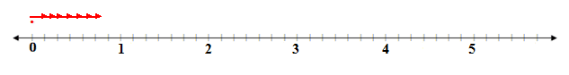

If $a$ is a nonzero real number, then the reciprocal or multiplicative inverse of $a$ is $\frac{1}{a}$. The product of any nonzero real number and its reciprocal is always one. The number 1 is called the multiplicative identity or the identity element of multiplication. Therefore, the product of $a$ and its reciprocal is the identity element of multiplication (one). This is known as the inverse property of multiplication. If $a$ is a nonzero real number, then $\boxed{a \times \frac{1}{a}=1}$.

**Example F**

**Does** $8 \times -1=-8$?

The statement means to add 8 groups of one negative (yellow) counter.

**Does** $-6 \times -1=+6$?

The statement means to remove 6 groups of 1 negative counter.

When any real number is multiplied by the number negative one, the result is the opposite of the number. The product of a real number and –1 changes the sign of the real number. This is called the property of negative one. If $a$ is a real number, then $a \times -1=-a$.

**Vocabulary**

__Multiplicative Identity__

The **_multiplicative identity_** for multiplication of real numbers is one.

__Multiplicative Inverse__

The **_multiplicative inverse_** of multiplication is the reciprocal of the nonzero real number and the product of the real number and its multiplicative inverse is one. If $a$ is any nonzero real number, its multiplicative inverse is $\frac{1}{a}$.

__Associative Property__

The **_associative property of multiplication_** states the order in which three or more real numbers are grouped for multiplication will not affect the product. If $a, b$ and $c$ are real numbers, then $\boxed{(a \times b)\times c=a \times(b \times c)}$.

__Closure Property__

The **_closure property of multiplication_** states that the product of any two real numbers is a unique real number. If $a, b$ and $c$ are real numbers, then $a \times b = c$.

__Commutative Property__

The **_commutative property of multiplication_** states that the order in which two numbers are multiplied does not affect the product. If $a$ and $b$ are real numbers, then $\boxed{a \times b= b \times a}$.

__Identity Element of Multiplication__

The **_identity element of multiplication_** is another term for the multiplicative identity of multiplication. Therefore, the identity element of multiplication is one.

__Identity Property__

The **_identity property of multiplication_** states that the product of a number and one is the number. If $a$ is a real number, then $\boxed{a \times 1=a}$.

__Inverse Property__

The **_inverse property of multiplication_** states that the product of any real number and its multiplicative inverse is one. If $a$ is a nonzero real number, then $a \times \left(\frac{1}{a}\right)=1$.

**Guided Practice**

1. Multiply using the properties of multiplication: $\left(6 \times \frac{1}{6} \right)\times(3 \times -1)$

2. What property of multiplication justifies the statement $(-9 \times 5)\times 2= -9 \times (5 \times 2)$?

3. Apply the negative one property of multiplication to the following problem: $-176 \times -1$?

**Answers**

1. 

$$
\begin{align*}
& \left(6 \times \frac{1}{6}\right) \times (3 \times -1)\\
& (1) \times (3 \times -1) \ \rightarrow \ \text{Inverse Property}\\
& (1) \times (-3) \ \rightarrow \text{Negative One Property}\\
& = -3 \ \rightarrow \text{The Product of two numbers with unlike signs is always negative.}
\end{align*}
$$

2. $(-9 \times 5) \times 2 = -9 \times (5 \times 2)$

The numbers on each side of the equal sign are the same but they are not grouped the same.

$$
\begin{align*}
&(-9 \times 5)\times 2 && -9 \times(5 \times 2)\\
&=(-45) \times 2 && =-9 \times(10)\\
&=-90 && =-90
\end{align*}
$$

The order in which the numbers were grouped did not affect the answer. The property that is being used is the **_associative property_** of multiplication.

3. 

$$
\begin{align*}
-176 \times -1 &= ?\\
-176 \times -1 &= 176
\end{align*}
$$

The number –176 is being multiplied by –1. The number remains the same but its sign has changed. This is the negative one property.

**Summary**

The properties of multiplication of real numbers do not apply to subtraction or division. Many of the properties were represented using color counters. You learned that the order in which two numbers were multiplied did not change the product. This was the commutative property of multiplication. An extension to this property was the associative property which stated that the order in which three or more numbers were grouped for multiplication had no effect on the final product. The closure property simply stated that the product of any two real numbers is a unique real number. The term unique means that the product is a different real number than those being multiplied. The identity property stated the product of any real number and one is the real number. You also learned that one is the multiplicative identity or the identity element of multiplication. Another property that you learned was the inverse property of multiplication. This property stated that the sum of any nonzero real number and its reciprocal is always one. The final property that you learned was the property of negative one. This property stated that the product of any real number and negative one will be the opposite of the real number. In other words, multiplying a real number by negative one will change the sign of the real number.

The guided examples showed you how to apply the properties to a given multiplication statement. You were also shown how to use the properties to justify a multiplication statement.

**Problem Set**

**Match the following multiplication statements with the correct property of multiplication.**

A. $(-1)\times 15=-15$

B. $9 \times \frac{1}{9}=1$

C. $(-7 \times 4)\times 2 = -7 \times(4 \times 2)$

D. $-8 \times (4) = -32$

E. $6 \times(-3)=(-3) \times 6$

F. $-7 \times 1=-7$

a) Commutative Property

b) Closure Property

c) Inverse Property

d) Identity Property

e) Associative Property

f) Negative One Property

**In each of the following, circle the correct answer.**

1.  What does $-5(4)\left(-\frac{1}{5}\right)$ equal?
    1.  –20
    2.  –4
    3.  +20
    4.  +4
2.  What is another name for the reciprocal of any real number?
    1.  the additive identity
    2.  the multiplicative identity
    3.  the multiplicative inverse
    4.  the additive inverse
3.  What is the multiplicative identity?
    1.  –1
    2.  1
    3.  0
    4.  $\frac{1}{2}$
4.  What is the product of a nonzero real number and its multiplicative inverse?
    1.  1
    2.  –1
    3.  0
    4.  there is no product
5.  Which of the following statements is NOT true?
    1.  The product of any real number and negative one is the opposite of the real number.
    2.  The product of any real number and zero is always zero.
    3.  The order in which two real numbers are multiplied does not affect the product.
    4.  The product of any real number and negative one is always a negative number.

**Name the property of multiplication that is being shown in each of the following multiplication statements:**

1.  $(-6\times 7)\times 2=-6 \times(7 \times 2)$
2.  $-12 \times 1 =-12$
3.  $25 \times 3 = 3 \times 25$
4.  $10 \times \frac{1}{10}=1$
5.  $-12 \times -1=12$

Summary
-------

In these lessons you have learned the properties of real numbers for both addition and multiplication. The properties for each of these operations are very closely related. The properties that you have learned for the real numbers $a, b$ and $c$ are:

| **Property** | **Addition** | **Multiplication** |
| --- | --- | --- |
| Commutative | $a+b=b+a$ | $a \times b=b \times a$ |
| Associative | $(a+b)+c=a+(b+c)$ | $(a \times b) \times c=a \times (b\times c)$ |
| Closure | $a+b=c$ | $a\times b = c$ |
| Identity | $a+0=a$ | $a \times 1= a$ |
| Inverse | $a+(-a)=0$ | $a \times \frac{1}{a}=1$ |
| Negative One | Not Applicable | $a \times -1=-a$ |

The properties were represented using color counters and/or the number line. In the problem sets for each lesson, you had the opportunity to apply your understanding of the properties. In algebra, these properties are very important. In addition to the properties themselves being important, it is also important to understand the terms that were introduced. You should know that the additive inverse of any real number is the opposite of the real number. You should also know that the additive identity of a real number is zero. For multiplication, the multiplicative inverse is the reciprocal of the real number and the multiplicative identity is one. You will apply the negative one property infinitely when you are multiplying.

</article>

### 1.8 Quiz

<article>

**Multiple Choice – Please** _circle the letter_ **for the correct answer and then** _write that letter_ **in the blank to the right of each question.**

1.  What property of addition is being represented by $(9+7)+4=9+(7+4)$? \_\_\_\_\_\_\_
    1.  Closure Property
    2.  Identity Problem
    3.  Associative Property
    4.  Negative One property
2.  In the statement $7 \times 1=7$, what is the number **one** called? \_\_\_\_\_\_\_
    1.  reciprocal
    2.  additive inverse
    3.  product
    4.  multiplicative identity
3.  What addition property states that the sum of two positive real numbers will be a unique real number? \_\_\_\_\_\_\_
    1.  Commutative Property
    2.  Closure Property
    3.  Inverse Property
    4.  Associative Property
4.  What is the product that results when a positive real number is multiplied by its multiplicative inverse. \_\_\_\_\_\_\_
    1.  one
    2.  negative real number
    3.  zero
    4.  the same positive real number
5.  Which of the following represents the commutative property of addition? \_\_\_\_\_\_\_
    1.  $8+(x+2)=(8+x)+2$
    2.  $13+0=13$
    3.  $5+6=6+5$
    4.  $8+3=11$
6.  What is the sum of a real positive number and its additive inverse? \_\_\_\_\_\_\_
    1.  one
    2.  negative real number
    3.  the same real positive number
    4.  zero
7.  What property of multiplication is represented by $8 \times(-1)=-8$? \_\_\_\_\_\_\_
    1.  Identity Property
    2.  Negative One Property
    3.  Inverse Property
    4.  Closure Property
8.  In the expression $\frac{5}{9}\times\frac{9}{5}$, what is the fraction $\frac{9}{5}$ called? \_\_\_\_\_\_\_
    1.  the flip
    2.  the opposite
    3.  the multiplicative identity
    4.  the multiplicative inverse

</article>

### 1.9 Decimal Notation

<article>

Decimal Notation
----------------

**Objectives**

The lesson objectives for Decimal Notation are:

* Understanding terminating and periodic decimals
* Expressing a given fraction as a decimal number
* Expressing a given decimal number as a fraction

**Introduction**

In this concept you will learn the difference between a terminating decimal number and a periodic decimal number. You will also learn how to express a given fraction as a decimal number and how to express a given decimal number as a fraction. All periodic decimal numbers can be expressed as common fractions. If the decimal number is non-periodic, it cannot be expressed as a common fraction.

A rational number is any number that be written in the form $\frac{a}{b}$ where $b \ne 0$. Therefore, periodic decimal numbers and terminating decimal numbers are rational numbers.

**Watch This**

[Khan Academy Converting Fractions to Decimals](http://www.youtube.com/watch?v=Gn2pdkvdbGQ)

!?[video](https://www.youtube.com/watch?v=Gn2pdkvdbGQ)

**Guidance**

To change a fraction to a decimal number, the numerator must be divided by the denominator. The denominator is the divisor, the numerator is the dividend and the decimal number is the quotient. Let’s investigate the long division process by changing $\frac{3}{4}$ first and then $\frac{3}{13}$ to decimal numbers.

$\frac{3}{4}=3 \div 4$

$$
\begin{align*}
& \overset{ \ \ {\color{red}0.75}}{4 \overline{ ) {3.00 \;}}}\\
& \underline{-0 \;\;\;\;\;}\\
& \ \ 3 \ 0\\
& \underline{- 2 \ 8 \; \;}\\
& \ \quad \  20\\
& \underline{- \;\;\; 20 \;}\\
& \qquad \ 0\\
\end{align*}
$$

When the fraction $\frac{3}{4}$ was divided, the result was a decimal number that ended. There were two digits after the decimal point. The division was complete when the remainder was zero. This decimal number is known as a terminating decimal number.

$\frac{3}{13}=3 \div 13$

$$
\begin{align*}
& \overset{ \ \ {\color{red}0.2307692307}}{13 \overline{ ) {3.0000000000 \;}}}\\
& \underline{- \  0 \;}\\
& \quad  3 \ 0\\
& \underline{- \ 2 \ 6 \;}\\
& \qquad  40\\
& \underline{- \;\;\;\;\;39}\\
& \ \qquad  \ 10\\
& \underline{- \;\;\;\;\;\;\;\;0}\\
& \ \qquad \  100\\
& \underline{- \;\;\;\;\;\;\;\;\;91}\\
& \ \qquad \quad  \ \ 90\\
& \underline{- \;\;\;\;\;\;\;\;\;\;\;78}\\
& \ \qquad \quad \ \ 120\\
& \underline{- \;\;\;\;\;\;\;\;\;\;\;117}\\
& \ \qquad \qquad \ \ 30\\
& \underline{- \;\;\;\;\;\;\;\;\;\;\;\;\;\;\;26}\\
& \ \qquad \qquad \quad \ 40\\
& \underline{- \;\;\;\;\;\;\;\;\;\;\;\;\;\;\;\;\;39}\\
& \ \qquad \qquad \quad \ \ 10\\
& \underline{- \;\;\;\;\;\;\;\;\;\;\;\;\;\;\;\;\;\;\;\;0}\\
& \ \qquad \qquad \quad \ \ 100\\
& \underline{- \;\;\;\;\;\;\;\;\;\;\;\;\;\;\;\;\;\;\;\;91}\\
& \ \qquad \qquad \qquad \ \ 9\\
\end{align*}
$$

When the fraction $\frac{3}{13}$ was divided, there was no end to the decimal number. However, as the division continued, a pattern developed. This is known as a periodic decimal number with a period length of 6. The period length is the number of digits in the quotient that form a pattern that will repeat itself as the division continues. In the decimal number 0.230 769 230 7... the period is 230 769. If you were to continue dividing, the period would repeat infinitely. The division would never result in a zero remainder.

**Example A**

What fraction is equal to 0.45454545?

The decimal number is a periodic or repeating decimal. The period has a length of two. This means that the pattern that is repeating consists of 2 digits. To express the decimal number as a fraction, follow these steps:

**Step 1:** Let $x=0.45454545$

**Step 2:** The repeating digit is 45. Place the repeating digit to the left of the decimal point by moving the decimal point 2 places to the right.

45.454545

To move the decimal point two places to the right, the decimal number was multiplied by 100. If you go back to step 1, you will see the equation $x=0.45454545$. If you multiply one side of the equation by 100, you must multiply the other side by 100. You now have $100x=45.454545$

**Step 3:** The repeating digits must be to the right of the decimal point. The digits are already to the right of the decimal point which means that no multiplication is necessary to move the decimal point. The two equations that you now have are $x=0.45454545$ and $100x=45.454545$

**Step 4:** Subtract the two equations and solve for $x$.

$$
\begin{align*}
&100x=45.454545\\
& \underline{\;\; -x=0.45454545}\\
& \frac{99x}{99}=\frac{45}{99}\\
& \quad \ x=\frac{45}{99}=\frac{5}{11}
\end{align*}
$$

**Example B**

Decimal numbers that terminate can be more readily changed to fractions.

What fraction is equal to 0.125?

This decimal appears to be a terminating decimal number. There is no indication that the division continues and no sign of a repeating pattern. The steps to follow to express 0.125 as a fraction are:

**Step 1:** Express the decimal number as a whole number by moving the decimal point to the right. In this case, the decimal must be moved three places to the right.

**Step 2:** $0.125=125$

Express 125 as a fraction with a denominator of 1 and three zeros. The three zeros represent the number of places that the decimal point was moved.

$\frac{125}{1000}$

**Step3:** If possible, simplify the fraction. If you are not sure of the simplified form, your calculator, TI83, will do the calculations.

**The method shown above is one that can be used if you can’t remember the place value associated with the decimal numbers. If you remember the place values, you can simply write the decimal as a fraction and simplify that fraction.**

Are the following decimal numbers terminating or periodic? If they are periodic, what is the period and what is its length?

i) 0.318181818

ii) 0.375

iii) 0.3125

iv) 0.121 122 111 2

i) 0.318181818 A periodic decimal number with a period of 18. The length of the period is 2.

ii) 0.375 A terminating decimal number.

iii) 0.3125 A terminating decimal number

iv) 0.121 122 111 2 This decimal number is not a terminating decimal nor is it a periodic decimal. Therefore, the decimal number is not a rational number. Decimal numbers that are non-periodic belong to the irrational numbers.

**Vocabulary**

__Irrational Numbers__

An **_irrational number_** is the set of non-periodic decimal numbers. Some examples of **_irrational numbers_** are $\sqrt{3},\sqrt{2}$ and $\pi$.

__Periodic Decimal__

A **_periodic decimal_** is a decimal number that has a pattern of digits that repeat. The decimal number 0.146 532 532 5, is a **_periodic decimal._**

__Rational Numbers__

A rational number is any number that be written in the form $\frac{a}{b}$ where $b \ne 0$. Therefore, periodic decimal numbers and terminating decimal numbers are **_rational numbers._**

__Terminating Decimal__

A **_terminating decimal_** is a decimal number that ends. The process of dividing the fraction ends when the remainder is zero. The decimal number 0.25 is a **_terminating decimal._**

**Guided Practice**

1. Express 2.018181818 in the form $\frac{a}{b}$.

2. Express $\frac{15}{11}$ in decimal form.

3. If one tablet of micro K contains 0.5 grams of potassium, how much is contained in $2\frac{3}{4}$ tablets?

**Answers**

1. 2.018181818

Let $x=2.018181818$ The period is 18.

2018.181818 The period must be placed to the left of the decimal point. This is done by moving the decimal point three places to the right. (Multiply both sides by 1000)

$1000x=2018.181818$

2.018181818 The repeating digits must be placed to the right of the decimal point. To get them there, the decimal point must be moved one place to the right. (Multiply both sides by 10)

$10x=20.18181818$

$$
\begin{align*}
& 1000 x=2018.181818 \qquad \text{These are the two equations that must be subtracted.}\\
& \underline{-10x=20.18181818}\\
& \frac{990x}{990}=\frac{1998}{990} \qquad \qquad \quad \ \ \text{Solve for} \ x.\\
& \quad \ \ x=\frac{1998}{990}
\end{align*}
$$

Use your calculator to simplify the fraction.

$x=\frac{1998}{990}$

The fraction is in the form of $\frac{a}{b}$. The decimal number 2.018181818 can be expressed as the fraction $\frac{111}{55}$.

2. $\frac{15}{11}=15 \div 11$

Long division must be done to express the fraction as a decimal number.

$$
\begin{align*}
& \overset{ \ \ 1.363636}{11 \overline{ ) {15.000000 \;}}}\\
& \underline{- \ \ 11 \;}\\
& \qquad  40\\
& \underline{- \;\;\;\;\;33}\\
& \ \qquad  \ 70\\
& \underline{- \;\;\;\;\;\;\;66}\\
& \ \qquad \quad 40\\
& \underline{- \;\;\;\;\;\;\;\;\;\;33}\\
& \ \qquad \quad  \ \ 70\\
& \underline{- \;\;\;\;\;\;\;\;\;\;\;66}\\
& \ \qquad \qquad 40\\
& \underline{- \;\;\;\;\;\;\;\;\;\;\;\;\;33}\\
& \ \qquad \qquad \ \ 70\\
& \underline{- \;\;\;\;\;\;\;\;\;\;\;\;\;\;\;66}\\
& \ \qquad \qquad \quad \  4\\
\end{align*}
$$

$\boxed{\frac{15}{11}=1.363636}$

3. The number of tablets is given as a mixed number.

$$
\begin{align*}
& 2 \frac{3}{4}\\
& \frac{3}{4}=3 \div 4\\
& \overset{ \ \ 0.75}{4 \overline{ ) {3.00 \;}}}\\
& \underline{- 2 \ 8 }\\
& \quad \ \ 20\\
& \underline{- \;\;\;20} \qquad \text{Change the fraction to a decimal number.}\\
& \qquad \ 0
\end{align*}
$$

The number of grams of potassium was given as a decimal number. The answer should also be expressed as a decimal number.

The number of tablets is 2.75.

The number of grams of potassium in these tablets is:

$2.75 \times 0.5=1.375 \ grams$

**Summary**

In this lesson you learned how to distinguish between a terminating decimal number and a periodic decimal number. You also learned that periodic decimal numbers and terminating decimal numbers are rational numbers. In addition you learned that the set of non-periodic decimal numbers belong to the irrational numbers.

You were also shown that a given fraction can be changed to a decimal number by long division. If the division ended, the decimal number was a terminating decimal. If the division did not end and the decimal number had digits that formed a repeating pattern, then the decimal number was a periodic decimal.

If a fraction can be changed to a decimal number, then the decimal number can be changed to a fraction. You learned to change a periodic decimal number to a fraction by using a set of structured steps. Although this process requires careful calculations, a correct result can be obtained by following the presented steps. You also learned how to change a terminating decimal number to a fraction by changing the decimal number to a whole number and writing the whole number over the place value of the decimal number.

**Problem Set**

**Express the following fractions in decimal form.**

1.  $\frac{1}{12}$
2.  $\frac{6}{11}$
3.  $\frac{3}{20}$
4.  $\frac{1}{13}$
5.  $\frac{3}{8}$

**Express the following decimal numbers in the form $\frac{a}{b}$.**

1.  0.325
2.  3.72727272
3.  0.245454545
4.  0.618
5.  0.36363636

**Complete the following table.**

| **Wire** | **Fraction Thickness (inches)** | **Decimal Thickness (inches)** |
| --- | --- | --- |
| **1** | $\frac{5}{64}$ |     |
| **2** | $\frac{11}{32}$ |     |
| **3** | $\frac{1}{20}$ |     |
| **4** |     | $0.0703125$ |
| **5** |     | $0.1875$ |

Summary
-------

In this lesson you have learned the difference between rational and irrational numbers. Rational numbers are numbers that can be expressed in the form $\frac{a}{b},b \ne 0$. These fractions can then be changed to decimal numbers by dividing the denominator into the numerator. The result of the long-division was either a decimal number that ended (terminating decimal number) or a decimal number that had digits that repeated in a definite pattern (Periodic decimal numbers).

Irrational numbers are numbers that are made up of the set of non-terminating, non-periodic decimal numbers.

You also learned how to change a decimal number to a fraction. Changing a terminating decimal number to a fraction involved expressing the decimal as a whole number and writing this number over the denominator that represented the place value of the last digit of the decimal number. You then learned to simplify the fraction by using the TI83 calculator. Changing a periodic decimal number to a fraction involved applying a series of structured steps. If you carefully followed the steps and then used your calculator to simplify the fraction, your answer was always a rational number.

Irrational numbers cannot be expressed in the form $\frac{a}{b},b \ne 0$.

</article>

### 1.10 The Real Number Line

<article>

Graphing on a Real Number Line
------------------------------

**Objectives**

The lesson objectives for Graphing on the Real Number Line are:

* Identifying the number set(s) to which numbers belong
* Graphing given sets on a number line

**Introduction**

In this concept you will review the number sets that make up the real number system. You will use the information learned in the review to identify the number set to which given numbers belong. In addition, you will use the information learned to graph inequalities on a real number line.

**Guidance**

To what number set(s) does the number 13 belong?

The number 13 is a whole number. $W=\{0,1,2,3 \ldots\}$

The number 13 is an integer. $I=\{\ldots,-3,-2,-1,0,1,2,3, \ldots\}$

The number 13 is a rational number. $Q=\{\frac{a}{b}, b \ne 0 \}$

The number 13 belongs to the real number system.

**Example**

The symbol > means “is greater than.”

The symbol < means “is less than.”

The symbol $\ge$ means “is greater than or equal to.”

The symbol $\le$ means “is less than or equal to.”

To represent all integers greater than 4, you can write $\{5,6,7,8, \ldots\}$, or write $x > 4$ such that $x$ is an integer. You can also use a number line to represent all integers greater than 4. Remember that the set of integers consists of negative whole numbers, zero and positive whole numbers. The number 4 is not included in the numbers greater than 4. However, to indicate 4 as a starting point, mark it on the number line with an open dot. If it were included in the answer, the dot would be closed or solid.

Represent $x>4$ where $x$ is an integer on a number line.

**Example B**

Represent this inequality statement on a number line $\{x \ge -2 | x \ \varepsilon \ R\}$.

$\{x \ge -2 | x \ \varepsilon \ R\}$ The statement can be read as “$x$ is greater than or equal to –2, such that $x$ belongs to or is a member of the real numbers.” In other words, represent all real numbers greater than or equal to –2.

**Example C**

In the above examples, the inequality symbol indicates the type of dot that is placed on the beginning point and the number set indicates whether an arrow is drawn on the number line or if a line with an arrow is drawn. The arrow means that the numbers included in the graph continue. The only time that an arrow is not used is when the inequality represents a beginning point and an ending point.

Represent this inequality statement, also known as set notation, on a number line $\{x|2 < x \le 7, x \ \varepsilon \ N\}$. This inequality statement can be read as $x$ such that $x$ is greater than 2 and less than or equal to 7 and $x$ belongs to the natural numbers. In other words, all natural numbers greater than 2 and less than or equal to 7.

**Vocabulary**

__Inequality__

An **_inequality_** is a mathematical statement relating expressions by using one or more inequality symbols. The inequality symbols are $>,<,\ge,\le$.

__Integer__

All natural numbers, their opposites, and zero are **_integers_**. A number in the list $\ldots, -3, -2, -1, 0, 1, 2, 3 \ldots$

__Irrational Numbers__

The **_irrational numbers_** are those that cannot be expressed as the ratio of two numbers. The **_irrational numbers_** include decimal numbers that are both non-terminating decimals and non-periodic decimal numbers.

__Natural Numbers__

The **_natural numbers_** are the counting numbers and consist of all positive, whole numbers. The **_natural numbers_** are numbers in the list $1, 2, 3\ldots$ and are often referred to as positive integers.

__Number Line__

A **_number line_** is a line that matches a set of points and a set of numbers one to one. It is often used in mathematics to show mathematical computations.

__Rational Numbers__

The **_rational numbers_** are numbers that can be written as the ratio of two numbers $\frac{a}{b}$ and $b \ne 0$. The **_rational numbers_** include all terminating decimals as well as periodic decimal numbers.

__Real Numbers__

The rational numbers and the irrational numbers make up the **_real numbers._**

__Set Notation__

**_Set notation_** is a mathematical statement that shows an inequality and the set of numbers to which the variable belongs. $\{x|x \ge -3, x \ \varepsilon \ I\}$ is an example of **_set notation._**

**Guided Practice**

1. Check the set(s) to which each number belongs. The number may belong to more than one set.

| **Number** | $N$ | $W$ | $I$ | $Q$ | $\overline{Q}$ | $R$ |
| --- | --- | --- | --- | --- | --- | --- | --- |
| 5   |     |     |     |     |     |     |
| $-\frac{47}{3}$ |     |     |     |     |     |     |
| 1.48 |     |     |     |     |     |     |
| $\sqrt{7}$ |     |     |     |     |     |     |
| 0   |     |     |     |     |     |     |     |
| $\pi$ |     |     |     |     |     |     |     |

2. Graph $\{x|-3 \le x \le 8, x \ \varepsilon \ R\}$ on a number line.

3. Use set notation to describe the set shown on the number line.

1. Before answering this question, review the definitions for each set of numbers. You can find these in the vocabulary.

| **Number** | $N$ | $W$ | $I$ | $Q$ | $\overline{Q}$ |
| --- | --- | --- | --- | --- | --- |
| 5   | X   | X   | X   | X   |     |
| $-\frac{47}{3}$ |     |     |     | X   |     |
| 1.48 |     |     |     | X   |     |
| $\sqrt{7}$ |     |     |     |     | X   |
| 0   |     | X   | X   | X   |     |
| $\pi$ |     |     |     |     | X   |

2. $\{x|-3 \le x \le 8, x \ \varepsilon \ R\}$

The set notation means to graph all real numbers between –3 and +8. The line joining the solid dots represents the fact that the set belongs to the real number system.

")

\[Figure 7\]

The closed dot means that –2 is included in the answer. The remaining dots are to the right of –2. The open dot means that 3 is not included in the answer. This means that the numbers are all less than 3. Graphing on a number line is done from smallest to greatest or from left to right. There is no line joining the dots so the variable does not belong to the set of real numbers. However, negative whole numbers, zero and positive whole numbers make up the integers.

The set notation that is represented on the number line is

$\boxed{\{x|-2 \le x < 3, x \ \varepsilon \ I\}}$

**Summary**

In this lesson you revisited the real number system. You reviewed the sets of numbers that made up the real number system and concentrated on the types of numbers that were included in each set. These sets included the natural numbers, whole numbers, integers, rational numbers and irrational numbers. Given a group of numbers, you learned how to assign each number to the number set(s) to which it belonged.

You also learned how to represent a set notation on a number line. You now know the meaning of a closed dot and an open dot when it is graphed on a number line. You also learned how to represent the various number sets on a number line. From a number line graph, you learned how to write the set notation that describes the set shown on the number line.

**Problem Set**

**Describe each set notation in words.**

1.  $\{x|x > 8, x \ \varepsilon \ R\}$
2.  $\{x|x \le -3, x \ \varepsilon \ I\}$
3.  $\{x|-4 \le x \le 6, x \ \varepsilon \ R\}$
4.  $\{x|5 \le x \le 11, x \ \varepsilon \ W\}$
5.  $\{x|x \ge 6, x \ \varepsilon \ N\}$

**Represent each graph using set notation**

1.  
    
    \[Figure 8\]
    
2.  
    
    \[Figure 9\]
    
3.  
    
    \[Figure 10\]
    
4.  
    
    \[Figure 11\]
    
5.  
    
    \[Figure 12\]
    

**For each of the following situations, use set notations to represent the limits.**

1.  To ride the new tilt-a whirl at the fairgrounds, a child can be no taller than 4.5 feet.
2.  A dance is being held at the community hall to raise money for breast cancer. The dance is only for those people 19 years of age or older.
3.  A sled driver in the Alaska Speed Quest must start the race with no less than 10 dogs and no more than 16 dogs.
4.  The residents of a small community are planning a skating party at the local lake. In order for the event to take place, the outdoor temperature needs to be above $-6^\circ C$ and not above $-5^\circ C$.
5.  Juanita and Hans are planning their wedding supper at a local venue. To book the facility, they must guarantee that at least 100 people will have supper but no more than 225 people will eat.

**Represent the following set notations on a number line.**

1.  $\{x|x>6, x \ \varepsilon \ N\}$
2.  $\{x|x\le 8, x \ \varepsilon \ R\}$
3.  $\{x|-3\le x < 2, x \ \varepsilon \ I\}$

**Summary**

In this lesson you revisited the real number system $(R)$. You reviewed the sets of numbers that make up the real number system and concentrated on the types of numbers that were included in each set. These sets included the natural numbers $(N)$, whole numbers $(W)$, integers $(I)$, rational numbers $(Q)$ and irrational numbers $(\overline{Q})$. Given a group of numbers, you learned how to assign each number to the number set(s) to which it belonged. When you assigned a number to its number set(s), you had to be careful not to put it in the wrong set. All whole numbers are integers but not all integers are whole numbers.

You also learned that a mathematical statement that shows an inequality and the set of numbers to which the variable belongs is known as set notation. Set notation can be described in words or can be represented on a number line. A closed dot on the number line means that the number is included in the set notation and an open dot means that the number is not included. A closed dot is the result of the inequality symbol $\le$ or $\ge$. An open dot is the result of the inequality sign &lt; or &gt;. You also learned how to represent the various number sets on a number line.

From a number line graph, you learned how to write the set notation that describes the set shown on the number line. You also learned how to write set notation to represent various real life situations. The set notations that represent real life situations can all be drawn on a number line.

Comparing Real Numbers
----------------------

**Objectives**

The lesson objectives for Comparing Real Numbers are:

* Ordering real numbers from least to greatest
* Representing real numbers on a number line
* Using technology to simplify the process

**Introduction**

In this concept you will revisit the number sets that make up the real number system. You will also apply the skills you have learned for changing fractions to decimal numbers. In addition, you will learn to order real numbers from least to greatest and to place these numbers on a number line. When placing numbers on a number line, you will learn helpful hints to make the process easier. Finally, you will learn to order the numbers using your TI83 calculator.

**Guidance**

Order the following real numbers from least to greatest.

$\frac{22}{7},1.234 234 \ldots, - \sqrt{7}, -5, -\frac{21}{4}, 7,-1.666,0,8.32,\frac{\pi}{2},-\pi,-5.38$

As you examine the above numbers, you can see that there are natural numbers, whole numbers, integers, rational numbers and irrational numbers. These numbers, as they are presented here, would be very difficult to order from least to greatest. The simplest way to order the numbers is to express them all in the same form – all fractions or all decimal numbers. Since you all have a calculator, use the calculator to express every number as a decimal number. Watch your signs – don't drop any of the negative signs.

| **Given Pos. Value** | **Positives** | **Given Neg. Value** | **Negatives** |
| --- | --- | --- | --- |
| $\frac{22}{7}$ | 3.142857 | $-\sqrt{7}$ | \-2.645751 |
| 1.234 234... | 1.234234 | –5  | –5  |
| 7   | 7   | $-\frac{21}{4}$ | –5.25 |
| 0   | 0   | –1.666 | –1.666 |
| 8.32 | 8.32 | $-\pi$ | –3.141592 |
| $\frac{\pi}{2}$ | 1.570796 | –5.38 | –5.38 |

The negative numbers with the greatest magnitude go left on the number line since they are the smallest of the numbers. Now arrange the numbers from least to greatest using the numbers you were given in the problem.

$-5.38, -\frac{21}{4}, -5, -\pi, -\sqrt{7}, -1.666, 0, 1.234234, \frac{\pi}{2},\frac{22}{7}, 7, 8.32$

**Example A**

Draw a number line and place these numbers on the line.

${\color{red}\sqrt{\frac{2}{5}}}, {\color{blue}0.6467},{\color{red}-\frac{3}{5}},{\color{red}\frac{1}{8}},{\color{green}0},{\color{red}\sqrt{0.5}},{\color{blue}-2.34},{\color{red}-\pi},{\color{red}\frac{2 \pi}{3},{\color{green}-1}},{\color{green}2}$

$\sqrt{\frac{2}{5}}=0.6324 \quad -\frac{3}{5}=-0.6 \quad \frac{1}{8}=0.125 \quad \sqrt{0.5}=0.7071 \quad -\pi=-3.1416 \quad \frac{2 \pi}{3}=2.0944$

Start by placing the ${\color{green}\mathbf{integers}}$ on the line first. Next place the ${\color{blue}\mathbf{decimal \ numbers}}$ on the line.

Use your calculator to convert ${\color{red}\mathbf{the \ remaining \ numbers}}$ to decimal numbers. Place these on the line last.

**Example B**

For each given pair of real numbers, find another real number that is between each of the pairs.

i) $-2,1$

ii) $3.5,3.6$

iii) $\frac{1}{2},\frac{1}{3}$

iv) $-\frac{1}{3}, -\frac{1}{4}$

The answers to these will vary.

i) The number must be greater than –2 and less than 1. $\boxed{-2, {\color{blue}0},1}$

ii) The number must be greater than 3.5 and less than 3.6. $\boxed{3.5, {\color{blue}3.54},3.6}$

iii) The number must be greater $\frac{1}{3}$ than and less than $\frac{1}{2}$. Write each fraction with a common denominator. $\frac{1}{2}=\frac{3}{6},\frac{1}{3}=\frac{2}{6}$. If you look at $\frac{2}{6}$ and $\frac{3}{6}$, there is no fraction, with a denominator of 6, between these values. Write the fractions with a larger common denominator. $\frac{1}{2}=\frac{6}{12}, \frac{1}{3}=\frac{4}{12}$. If you look at $\frac{4}{12}$ and $\frac{6}{12}$, the fraction $\frac{5}{12}$ is between them. $\boxed{\frac{1}{3},{\color{blue}\frac{5}{12}},\frac{1}{2}}$

iv) The number must be greater than $-\frac{1}{3}$ and less than $-\frac{1}{4}$. Write each fraction with a common denominator. $-\frac{1}{3}=-\frac{4}{12},-\frac{1}{4}=-\frac{3}{12}$. If you look at $-\frac{3}{12}$ and $-\frac{4}{12}$, there is no fraction, with a denominator of 12, between these values. Write the fractions with a larger common denominator. $-\frac{1}{3}=-\frac{8}{24},-\frac{1}{4}=-\frac{6}{24}$. If you look at $-\frac{6}{24}$ and $-\frac{8}{24}$, the fraction $-\frac{7}{24}$ is between them. $\boxed{-\frac{1}{3}, {\color{blue}-\frac{7}{24}}, -\frac{1}{4}}$

**Example C**

Order the following fractions from least to greatest.

$\frac{2}{11},\frac{7}{9},\frac{8}{7},\frac{1}{11},\frac{5}{6}$

The fractions do not have a common denominator. This makes it almost impossible to arrange the fractions from least to greatest. To determine the common denominator may take some time. Let’s use the TI83 to order these fractions.

$\frac{1}{11},\frac{2}{11},\frac{7}{9},\frac{5}{6},\frac{8}{7}$

**Guided Practice**

1. Arrange the following numbers in order from least to greatest and place them on a number line.

$-3.78, -\frac{11}{4},-4, \frac{\pi}{2}, -\sqrt{6},-1.888,0,0.2424,\pi,\frac{21}{15},2,1.75$

2. For each given pair of real numbers, find another real number that is between each of the pairs.

i) $-3,-5$

ii) $-3.4,-3.5$

iii) $\frac{1}{5},\frac{3}{10}$

iv) $-\frac{3}{4},-\frac{11}{6}$

3. Use technology to sort the following numbers:

$\sqrt{\frac{3}{5}},\frac{15}{38},-\frac{7}{12},\frac{1}{4},0,\sqrt{8},-\frac{13}{21},-\pi,\frac{3 \pi}{5},-6,3$

**Answers**

1. $-3.78, -\frac{11}{4},-4, \frac{\pi}{2}, -\sqrt{6},-1.888,0,0.2424,\pi,\frac{21}{15},2,1.75$

 $-3,-5$")

ii) $-3.4,-3.5$

iii) $\frac{1}{5},\frac{3}{10}$

iv) $-\frac{3}{4},-\frac{11}{16}$

i) The number must be greater than –5 and less than –3. $\boxed{-5,{\color{blue}-4},-3}$

ii) The number must be greater than –3.5 and less than –3.4. $\boxed{-3.5,{\color{blue}-3.45},-3.4}$

iii) The number must be greater than $\frac{1}{5}$ and less than $\frac{3}{10}$. Write each fraction with a common denominator. $\frac{1}{5}=\frac{2}{10}$. If you look at $\frac{2}{10}$ and $\frac{3}{10}$, there is no fraction, with a denominator of 10, between these values. Write the fractions with a larger common denominator. $\frac{1}{5}=\frac{4}{20},\frac{3}{10}=\frac{6}{20}$. If you look at $\frac{4}{20}$ and $\frac{6}{20}$, the fraction $\frac{5}{20}=\frac{1}{4}$ is between them. $\boxed{\frac{1}{5}, \frac{{\color{blue}1}}{{\color{blue}4}}, \frac{3}{10}}$

iv) The number must be greater than $-\frac{3}{4}$and less than $-\frac{11}{16}$. Write each fraction with a common denominator. $-\frac{3}{4}=-\frac{12}{16}$. If you look at $-\frac{12}{16}$ and $-\frac{11}{16}$, there is no fraction, with a denominator of 16 between these values. Write the fractions with a larger common denominator. $-\frac{3}{4}=-\frac{24}{32},-\frac{11}{16}=-\frac{22}{32}$. If you look at $-\frac{24}{32}$ and $-\frac{22}{32}$, the fraction $-\frac{23}{32}$ is between them. $\boxed{-\frac{3}{4},-{\color{blue}\frac{23}{32}},-\frac{11}{16}}$

3. $\sqrt{\frac{3}{5}},\frac{15}{38},-\frac{7}{12},\frac{1}{4},0,\sqrt{8},-\frac{13}{21},-\pi,\frac{3 \pi}{5},-6,3$

$-6,-\pi,-\frac{13}{21},-\frac{7}{12},0,\frac{1}{4},\frac{15}{38},\sqrt{\frac{3}{5}},\frac{3 \pi}{5},\sqrt{8},3$

Summary
-------

In this lesson you learned to order real numbers from least to greatest. To facilitate the process, you learned that changing the numbers to decimal numbers made the ordering less difficult.

You also learned to represent the numbers on an appropriate number line. The given integers could be placed on the line first and then any given decimal numbers were located on the number line. The remaining numbers were changed to decimals and placed on the number line last. Placing the numbers on the number line gave you a visual image of the order of the real numbers.

You were also shown the key strokes to use to order the numbers by using technology. The numbers were entered into the calculator and were recorded as decimal numbers. You then sorted the numbers on the calculator to order them. The one thing that you had to remember was to track the numbers as you entered them into the calculator. This step was necessary to match the given numbers with the corresponding decimal numbers.

To apply the concept of ordering numbers, you then solved problems that asked you to find a real number between a pair of given numbers.

**Problem Set**

**Arrange the following numbers in order from least to greatest and place them on a number line.**

1.  $\{0.5,0.45,0.65,0.33,0,2,0.75,0.28\}$
2.  $\{\frac{1}{2},-2,0,-\frac{1}{3},1,\frac{2}{3},-\frac{1}{2}\}$
3.  $\{0.3,-\sqrt{2},1,-0.25,0,1.8,-\frac{\pi}{3}\}$

**For each given pair of real numbers, find another real number that is between each of the pairs.**

i) $8,10$

ii) $-7.6,-7.5$

iii) $\frac{1}{7},\frac{4}{21}$

iv) $-\frac{3}{5},-\frac{1}{2}$

**Use technology to sort the following numbers:**

1.  $\{-2,\frac{2}{3},0,\frac{3}{8},-\frac{7}{5},\frac{1}{2},4,-3.6\}$
2.  $\{\sqrt{10},-1,\frac{7}{12},3,-\frac{5}{4},-\sqrt{7},0,-\frac{2 \pi}{3},-\frac{3}{5}\}$

**Summary**

In this lesson you learned to order real numbers from least to greatest. To avoid using the guessing method, numbers that were not integers or were not given as decimal numbers were changed to decimal numbers. When you did this, you were less likely to make an error when ordering the numbers.

You also learned to represent the numbers on an appropriate number line. The given integers could be placed on the line first and then any given decimal numbers were located on the number line. The remaining numbers were changed to decimals and placed on the number line last. If a number line marked in intervals of 10 is used, the decimal numbers can be placed approximately where they belong. It is impossible to place the decimal numbers exactly where they belong. An approximate location is acceptable. This visual representation of the ordered numbers made the process more meaningful.

You were also shown the key strokes to use to order the numbers by using technology. As you entered the numbers into the calculator, they were converted to decimal numbers and stored in a list on the calculator. The numbers were sorted within seconds when the SORT command was used. The one thing that you had to remember was to track the numbers as you entered them into the calculator. This step was necessary to match the given numbers with the corresponding decimal numbers.

To apply the concept of ordering numbers, you then solved problems that asked you to find a real number between a pair of given numbers. When fractions were used, it was often necessary to write equivalent fractions using a common denominator and not a least common denominator.

</article>

### 1.11 Chapter Test

<article>

1.  Perform the indicated operations. If possible, simplify all answers.

|     |     |     |     |     |
| --- | --- | --- | --- | --- |
| $4 + (-11)$ | $-7 -9$ | $-7(6)$ | $-48 \div (-4)$ | $4 + (-9) + 2$ |
| $\left ( \frac{3}{5} \right ) + \left ( \frac{7}{8} \right )$ | $3.648 \div -0.2$ | $39 \div 1 \frac{3}{10}$ | $(-2.476) - (-6.94) - 5$ | $(-3.6)(4)(-1.7)$ |
| $\frac{5}{11} - \frac{1}{3}$ | $(0.765) - (-3.58) + (2.2)$ | $\left ( \frac{3}{8} \right ) \left ( \frac{7}{2} \right ) \div \left ( \frac{3}{4} \right )$ | $16 \div 2^2 \times 4 - 5$ | $(-15) \div \left ( \frac{1}{3} \right ) \times (-2)$ |

2.  State the property of addition or of multiplication that is shown in each example.

|     |     |
| --- | --- |
| $15 + (8+22) = (15 + 8) + 22$ |     |
| $\frac{3}{7} \times \frac{7}{3} = 1$ |     |
| $6.486 + 16.39 = 16.39 + 6.486$ |     |
| $36 + (-36) = 0$ |     |
| $44 \times 1 = 44$ |     |
| $24 \times 2 = 48$ |     |

3.  Tom has $40 to spend for groceries each week. His grocery list is shown below. If he is shopping on “NO TAX DAY”, will he have enough money to buy his groceries? If he has enough money, how much change will he receive? If he doesn’t have enough money, how much more money does he need?

| **Groceries** | **Price** |
| --- | --- |
| _2 dozen eggs_ | _$1.98/dozen_ |
| _1 loaf of bread_ | _$2.49_ |
| _4 lb. of ground beef_ | _$2.16/lb_ |
| _2 qt. milk_ | _$1.90/qt_ |
| _3 lb. of apples_ | _$1.99/lb_ |
| _6 lemons_ | _$0.79 for 3_ |
| _2.5 lb of tomatoes_ | _$1.49/lb_ |
| _Dish detergent_ | _$3.35_ |
| _2 bags of potatoes_ | _$3.49/bag_ |

4.  Answer the following:
    1.  In each of the following graphs, find the error(s). Identify each error and explain why each error exists.
    2.  Draw the correct graph to represent the given set notation.
        1.  $\{ x | 4 < x \le 9, x \ \varepsilon \ W \}$ 
            
            \[Figure 1\]
            
        2.  $\{ x | -3 \le x \le 2, x \ \varepsilon \ I \}$ 
            
            \[Figure 2\]
            
5.  Show all the necessary steps to convert 3.246464646 to the form $\frac{a}{b}$.
6.  A box of chicken nuggets weighs $1 \frac{5}{8}lb$. How many pounds will 20 cartons of 12 boxes each weigh?
7.  The exterior wall of a small office building under construction is built of $\frac{3}{4}in$ paneling, $\frac{5}{8}in$ fire code sheetrock, $5 \frac{3}{4}in$ studs, $\frac{1}{2}in$ plywood sheathing, $1 \frac{1}{4}in$ insulation board, and $\frac{5}{6}in$ exterior surfacing. What is the total thickness of the wall?

</article>

## 2.0 Can You Make It True?

<article>

**Introduction**

Equations are mathematical statements involving expressions that are separated by an equal sign. These expressions can involve one variable (a letter) or two variables (two letters) or more. The expressions can involve whole numbers, decimals, and/or fractions or as you learned in chapter one, they involve any numbers in the real number system. The purpose in solving these equations is to find the numerical values for the variables that make the expressions true.

In this chapter you will learn how to solve linear equations in one variable that are simple as well as those that contain common fractions and decimals. The equations will also involve the distributive property. Once the task of solving the equations algebraically has been mastered, students will proceed to expressing words first as algebraic expressions and then as linear equations. Students will continue this process by solving the equation to solve the given word problem.

In addition to solving linear equations, students will also learn to solve linear inequalities algebraically and then how to graph the result on a number line. The final concept of this chapter will deal with equations and inequalities involving absolute value.

**Lessons**

In this chapter you will do the following lessons:

* Solving Linear Equations in One Variable using Integers
* Solving Linear Equations in One Variable using Decimals and Fractions
* Expressing words as Algebraic Expressions
* Solving Linear Inequalities in One Variable
* Solving Equations and Inequalities with Absolute Value

</article>

### 2.1 Solving Linear Equations in One Variable using Integers

<article>

**Objectives**

The lesson objectives for Solving Linear Equations with Variables are:

* Solving linear equations with variables on one side of the equation
* Solving linear equations with variables on both sides of the equation
* Solving linear equations that apply the distributive property

Solving Linear Equations with Variables on One Side of the Equation
-------------------------------------------------------------------

**Introduction**

In this concept you will begin your study of mathematical equations by learning how to solve equations with only one variable. What this means is that the mathematical expression will have a letter and possibly some number on one side of the equal sign and numbers on the other side of the equal sign. It is your job to find a value for the letter that makes the expression true. Once you have mastered this process, you can solve for two variables and also add more complex numbers.

It is interesting to note that the variables are known as literal coefficients. Literal means “letter”. So the literal coefficient is the unknown quantity in the mathematical expression represented by a letter (also called a variable). What do you think a numerical coefficient is?

Right! A numerical coefficient is a number in the mathematical expression. In the algebraic term $5abc$, the numerical coefficient is 5.

**Watch This**

[Khan Academy Slightly More Complicated Equations](http://www.youtube.com/watch?v=XoEn1LfVoTo)

!?[video](https://www.youtube.com/watch?v=XoEn1LfVoTo)

**Guidance**

Erin, Jillian, Stephanie and Jacob went to the movies. The total bill for the tickets and snacks came to $72.00. How much should each teen pay to split the bill evenly.

There are four teens going to the movies (Erin, Jillian, Stephanie, and Jacob). The total bill was $72.00. Therefore our equation is $4x = 72$. We divide by 4 to find our answer.

$$
\begin{align*}
x &= \frac{72}{4}\\
x &= 18
\end{align*}
$$

Therefore each teen will have to pay $18.00 for their movie ticket and snack.

**Example A**

$5a + 2 = 17$

The problem can be solved if we think about it in terms of a balance (or a seesaw). We know that the two sides are equal so the balance has to stay horizontal. We can place each side of the equation on each side of the balance.

 all by itself. Always remember that we need to keep the balance horizontal. This means that whatever we do to one side of the equation, we **_have_** to do to the other side.")

Let’s first subtract 2 from both sides to get rid of the 2 on the left.

 by dividing by 5. Remember that whatever we do to one side, we have to do to the other.")

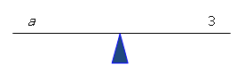

We can check our answer to see if we are correct.

$$
\begin{align*}
5a + 2 &= 17\\
5({\color{red}3}) + 2 &= 17\\
15 + 2 &= 17\\
17 &= 17 \ \ Y
\end{align*}
$$

**Example B**

$7b - 7 = 42$

Again, we can solve the problem if we think about it in terms of a balance (or a seesaw). We know that the two sides are equal so the balance has to stay horizontal. We can place each side of the equation on each side of the balance.

 all by itself. Always remember that we need to keep the balance horizontal. This means that whatever we do to one side of the equation, we **_have_** to do to the other side.")

Let’s first add 7 from both sides to get rid of the 7 on the left.

")

\[Figure 7\]

Since 7 is multiplied by $b$, we can get $a$ by itself (or isolate it) by dividing by 7. Remember that whatever we do to one side, we have to do to the other.

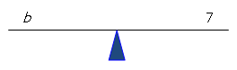

We can check our answer to see if we are correct.

$$
\begin{align*}
7b - 7 &= 42\\
7({\color{red}7}) - 7 &= 42\\
49 - 7 &= 42\\
42 &= 42 \ \ Y
\end{align*}
$$

**Example C**

This same method can be extended by using algebra tiles. If we let green rectangles represent the variable, green square tiles represent the positive numbers and white tiles represent the negative numbers, we can solve the equations using an alternate method.

. Therefore there are 3 $c$ blocks for the equation. The other green blocks represent the numbers or constants. There is a 2 on the left side of the equation so there are 2 green blocks. There is an 11 on the right side of the equation so there are 11 green blocks on the right side of the equation.")

To solve, add two negative tiles to the right and left hand sides. The same rule applies to this problem as to all of the previous problems. Whatever we do to one side we have to do to the other.

Let’s do our check as with the previous problem.

$$
\begin{align*}
3c + 2 &= 11\\
3({\color{red}3}) + 2 &= 11\\
9 + 2 &= 11\\
11 &= 11 \ \ Y
\end{align*}
$$

**Vocabulary**

__Constant__

A **_constant_** is a numerical coefficient but does not contain a variable. For example in the equation $4x + 72 = 0$, the 72 is a constant.

__Equation__

An **_equation_** is a pair of mathematical expressions separated by an equal sign.

__Numerical Coefficient__

In mathematical equations, the **_numerical coefficients_** are the numbers associated with the variable. For example, with the expression $4x$, 4 is the numerical coefficient and $x$ is the literal coefficient.

__Variable__

A **_variable_** is an unknown quantity in a mathematical expression. It is represented by a letter. It is often referred to as the literal coefficient.

**Guided Practice**

1.  Use a model to solve for the variable in the problem $x-5=12$.
2.  Use a different model than used in question (1) to solve for the variable in the problem $3y+9=12$.
3.  Using one of the models from the lesson, solve for $x$ in the equation $3x-2x+16=-3$.

**Answers**

1. $x-5=12$

$$
\begin{align*}
x - 5 &= 12\\
({\color{red}17}) - 5 &= 12\\
17 - 5 &= 12\\
12 &= 12 \ \ Y
\end{align*}
$$

2. $3y+9=12$

")

\[Figure 17\]

Now, in order to get $y$ all by itself, you have to divide both sides by 3. This will isolate the variable $y$.

$$
\begin{align*}
3y + 9 &= 12\\
3({\color{red}1}) +9 &= 12\\
3 + 9 &= 12\\
12 &= 12 \ \ Y
\end{align*}
$$

3. $3x-2x+16=-3$

You can use any method to solve this equation. Remember to isolate the $x$ variable. You will notice here that there are two $x$ values on the left. First let’s combine these terms.

$$
\begin{align*}
3x-2x+16 &= -3\\
x+16 &= -3
\end{align*}
$$

Now you can use any method to solve the equation. You now should just have to subtract 16 from both sides to isolate the $x$ variable.

$$
\begin{align*}
x+16 {\color{red}-16} &= -3 {\color{red}-16}\\
x &= -19
\end{align*}
$$

Let's do a check to make sure.

$$
\begin{align*}
3x-2x+16 &=-3 \quad \text{(original problem)}\\
x+16 &= -3 \quad \text{(simplified problem)}\\
{\color{red}-19}+16 &= -3\\
-3 &= -3 \ \ Y
\end{align*}
$$

**Summary**

Solving equations with variables on one side can be done using models such as a balance (or a seesaw) or by using algebra tiles.

Remember that when solving equations with variables on one side of the equation there is one main rule to follow: whatever you do to one side of the equal sign you must do the same to the other side of the equal sign. For example, if you add a number to the left side of an equal sign, you must add the same number to the right side of the equal sign.

**Problem Set**

Use the model of the balance (or seesaw) to solve for each of the following variables.

1.  $a+3=-5$
2.  $2b-1=5$
3.  $4c-3=9$
4.  $2-d=3$
5.  $4-3e=-2$

Use algebra tiles to solve for each of the following variables.

1.  $x+3=14$
2.  $2y-7=5$
3.  $3z+6=9$
4.  $5+3x=-3$
5.  $2x+2=-4$

Use the models that you have learned to solve for the variables in the following problems.

1.  $-4x+13=5$
2.  $3x-5=22$
3.  $11-2x=5$
4.  $2x-4=4$
5.  $5x+3=28$

For each of the following models, write a problem involving an equation with a variable on one side of the equation expressed by the model and then solve for the variable.

1.  
    
    \[Figure 19\]
    
2.  
    
    \[Figure 20\]
    
3.  
    
    \[Figure 21\]
    
4.  
    
    \[Figure 22\]
    
5.  
    
    \[Figure 23\]
    

**Guidance**

Thomas has $50 and Jack has $100. Thomas is saving $10 per week for his new bike. Jack is saving $5 a week for his new bike. How long will it be before the two boys have the same amount of money?

If we let $w$ be the number of weeks, we can write the following equation.

$\underbrace{ 10x+50 }_{\text{Thomas's money:} \ \$10 \ \text{per week} + \$50}= \underbrace{ 5x+100 }_{\text{Jack's money:} \ \$5 \ \text{per week} + \$100}$

We can solve the equation now by first combining like terms.

$$
\begin{align*}
10x+50 &= 5x+100\\
10x {\color{red}-5x}+50 &= 5x {\color{red}-5x}+100 && \text{-combining the} \ x \ \text{variables to left side of the equation}\\
5x+50 {\color{red}-50} &= 100 {\color{red}-50} && \text{-combining the constants to left side of the equation}\\
5x &= 50
\end{align*}
$$

We can now solve for $x$ to find the number of weeks until the boys have the same amount of money.

$$
\begin{align*}
5x &= 50\\
\frac{5x}{5} &= \frac{50}{5}\\
x &= 10
\end{align*}
$$

Therefore in 10 weeks Jack and Thomas will each have the same amount of money!

**Example A**

$x+4=2x-6$

We will solve this problem using the balance (or seesaw) that we used in the previous lesson.

$$
\begin{align*}
\text{Check}&\\
x+4 &= 2x-6\\
({\color{red}10})+4 &= 2({\color{red}10})-6\\
14 &= 20-6\\
14 &= 14 \ \ Y
\end{align*}
$$

**Example B**

$14-3y=4y$

We will solve this problem using the algebra tiles we used in the previous lesson.

$ tiles onto the same side of the equation. We do this by adding $3 x$ tiles to both sides of the equal sign. In this way the $-3y$ will be eliminated from the left hand side of the equation.")

$ we are left with these algebra tiles.")

\begin{align*}
\text{Check} &\\
14 - 3y &= 4y\\
14-3({\color{red}2}) &= 4({\color{red}2})\\
14-6 &= 8\\
8 &= 8 \ \ Y
\end{align*}
$$

Therefore $y = 2$.

**Example C**

We can use these same methods for any of the equations involving variables. Sometimes, however, numbers are so large that one method is more valuable than the other. Let’s look at the following problem.

$53a-99=42a$

To solve this problem, we may need to have a large number of algebra tiles! It might be more efficient to use the balance method to solve this problem.

\begin{align*}
\text{Check} &\\
53a-99 &= 42a\\
53({\color{red}9})-99 &= 42({\color{red}9})\\
477-99 &= 378\\
378 &= 378 \ \ Y
\end{align*}
$$

Therefore $a = 9$.

**Vocabulary**

__Degrees__

The **_degree_** is the exponent on the variable in a term. For example, in the term $4x$, the exponent is 1 so the degree is 1.

__Like Terms__

**_Like terms_** refer to terms in which the degrees match and the variables match. For example $3x$ and $4x$ are like terms.

__Variable__

A **_variable_** is an unknown quantity in a mathematical expression. It is represented by a letter. It is often referred to as the literal coefficient.

**Guided Practice**

1.  Use algebra tiles to solve for the variable in the problem $6x+4=5x-5$.
2.  Use the balance (seesaw) method to solve for the variable in the problem $7r-4=3+8r$.
3.  Determine the most efficient method to solve for the variable in the problem $10b-22=29-7b$. Explain your choice of method for solving this problem.

**Answers**

1. $6x+4=5x-5$

")

\[Figure 33\]

$$
\begin{align*}
\text{Check}&\\
6x+4 &= 5x-5\\
6({\color{red}-9})+4 &= 5({\color{red}-9})-5\\
-54+4 &= -45-5\\
-50 &= -50 \ \ Y
\end{align*}
$$

2. $7r-4=3+8r$

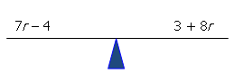

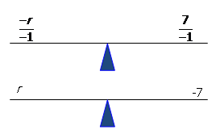

$$
\begin{align*}
\text{Check} &\\
7r-4 &= 3+8r\\
7({\color{red}-7})-4 &= 3+8({\color{red}-7})\\
-49-4 &= 3-56\\
-53 &= -53 \ \ Y
\end{align*}
$$

3. $10b-22=29-7b$

You could choose either method but there are larger numbers in this equation. With larger numbers, the use of algebra tiles is not an efficient manipulative. You should solve the problem using the balance (or seesaw) method. Work through the steps to see if you can follow them.

$$
\begin{align*}
\text{Check} &\\
10b-22 &= 29-7b\\
10({\color{red}3})-22 &= 29-7({\color{red}3})\\
30-22 &= 29-21\\
8 &= 8 \ \ Y
\end{align*}
$$

**Summary**

The methods used for solving equations with variables on both sides of the equation are the same as the methods used to solve equations with variables on one side of the equation. What differs in this lesson is that there is the added step of combining like terms with the variables before isolating the variable to find the solution.

You must remember in these problems, as with any math problems involving an equal sign, whatever operation (addition, subtraction, multiplication, or division) you do to one side of the equal sign, you must do to the other side. This is a big rule to remember in order for equations to remain equal or to remain in balance.

**Problem Set**

Use the balance (seesaw) method to find the solution for the variable in each of the following problems.

1.  $5p+3=-3p-5$
2.  $6b-13=2b+3$
3.  $2x-5=x+6$
4.  $3x-2x=-4x+4$
5.  $4t-5t+9=5t-9$

Use algebra tiles to find the solution for the variable in each of the following problems.

1.  $6-2d=15-d$
2.  $8-s=s-6$
3.  $5x+5=2x-7$
4.  $3x-2x=-4x+4$
5.  $8+t=2t+2$

Use the methods that you have learned for solving equations with variables on both sides to solve for the variables in each of the following problems. Remember to choose an efficient method to solve for the variable.

1.  $4p-7=21-3p$
2.  $75-6x=4x-15$
3.  $3t+7=15-t$
4.  $5+h=11-2x$
5.  $9-2e=3-e$

For each of the following models, write a problem to represent the model and then find the variable for the problem.

1.  
    
    \[Figure 40\]
    
2.  
    
    \[Figure 41\]
    
3.  
    
    \[Figure 42\]
    
4.  
    
    \[Figure 43\]
    
5.  
    
    \[Figure 44\]
    

Solving Linear Equations that Apply to the Distributive Property
----------------------------------------------------------------

**Introduction**

In this concept you will learn to solve equations with variables that involve the distributive property. The distributive property is a mathematical way of grouping terms. The **_distributive property_** states that the product of a number and a sum is equal to the sum of the individual products of the number and the addends. Wow! Let’s see what this looks like in math terms. Say you had ${\color{red}3}({\color{blue}x + 5})$. The distributive property states that the product of a number (${\color{red}3}$) and a sum $({\color{blue}x + 5})$ is equal to the sum of the individual products of the number $({\color{red}3})$ and the addends (${\color{blue}x}$ and ${\color{blue}5}$).

When solving equations using the distributive property, you simply have one more step to follow than you have experienced in the previous lessons. You still have the same goal for solving problems with variables. That is to get the variables on one side and the constants on the other side. You do this by adding and subtracting terms from both sides of the equal sign. Then you isolate the variables by multiplying or dividing. In this lesson, your first step will be to use the distributive property to remove any brackets.

**Watch This**

[Khan Academy Solving Equations with the Distributive Property](http://www.youtube.com/watch?v=YZBStgZGyDY)

!?[video](https://www.youtube.com/watch?v=YZBStgZGyDY)

**Guidance**

Morgan, Connor, and Jake are going on a class field trip with 12 of their classmates. Each student is required to have a survival kit with a flashlight, a first aid kit, and enough food rations for the trip. A flashlight costs $10. A first aid kit costs $9. Each day's food ration costs $7. If the class has only $1000 for the survival kits, how many days can they go on their trip?

If First let’s write down what we know:

$\#$ Students going on the trip = 15 (Morgan, Connor, Jake + 12 others)

Total money available = $1000

Each flashlight costs $10

Each first aid kit costs $9

Each day's food ration costs $7

One survival kit contains 1 flashlight + 1 first aid kit + $x$ days of rations

Therefore cost of each survival kit: $\$10 + \$9 + \$7x = \$19 + \$7x$

For the 15 students, the total cost of the survival kits would be:

$$
15 (\$19+\$7x)=\$285+\$105x
$$

Since the class has $1000 to spend, you can calculate how many days they can go on their trip.

$$
\begin{align*}
\$1000 &= \$285+\$105x\\
\$1000 {\color{red}- \$285} &= \$285 {\color{red}-\$285}+\$105x\\
\$715 &= \$105x\\
\frac{\$715}{\$105} &= \frac{\$105x}{\$105}\\
6.81 &= x
\end{align*}
$$

Since the class does not have enough money to buy 7 days of food rations for each student, they will buy six days of food rations and the class will go on a class trip for six days.

**Example A**

$2(3x+5)=-2$

We will solve this problem using the balance (or seesaw) used in the previous lesson.

")

\[Figure 48\]

Now divide by 6 to solve for the $x$ variable. ")

\[Figure 50\]

Therefore $x = -2$.

$$
\begin{align*}
\text{Check}&\\
2(3x+5) &= -2\\
2(3({\color{red}-2})+5) &= -2\\
2(-6+5) &= -2\\
2(-1) &= -2\\
-2 &= -2 \ \ Y
\end{align*}
$$

**Example B**

$3(4+3y)=-6$

We will solve this problem using the algebra tiles we used in previous lessons.

 are on the same side, you only need to subtract the 3 groups of 4 from both sides of the equal sign to isolate the variable.")

$$
\begin{align*}
\text{Check} &\\
3(4+3y) &= -6\\
3(4+3({\color{red}-2})) &= -6\\
3(4-6) &= -6\\
3(-2) &= -6\\
-6 &= -6 \ \ Y
\end{align*}
$$

**Example C**

$6(4x+1)=-18$

$$
\begin{align*}
\text{Check} &\\
6(4x+1) &= -18\\
6(4({\color{red}-1})+1) &= -18\\
6(-4+1) &= -18\\
6(-3) &= -18\\
-18 &= -18 \ \ Y
\end{align*}
$$

**Vocabulary**

__Distributive Property__

The **_distributive property_** is a mathematical way of grouping terms. It states that the product of a number and a sum is equal to the sum of the individual products of the number and the addends. For example, in the expression: ${\color{red}3}({\color{blue}x + 5})$, the distributive property states that the product of a number $({\color{red}3})$ and a sum $({\color{blue}x + 5})$ is equal to the sum of the individual products of the number $({\color{red}3})$ and the addends $({\color{blue}x}$ and ${\color{blue}5})$.

__Variable__

A **_variable_** is an unknown quantity in a mathematical expression. It is represented by a letter. It is often referred to as the literal coefficient.

**Guided Practice**

1.  Use balance (seesaw) method to solve for the variable in the problem $6(-3x+2)=-6$.
2.  Use the algebra tiles to solve for the variable in the problem $2(r-2)=-6$.
3.  Determine the most efficient method to solve for the variable in the problem $2(j+1)=3(j-1)$. Explain your choice of method for solving this problem.

**Answers**

1. $6(-3x+2)=-6$.

$$
\begin{align*}
\text{Check} &\\
6(-3x+2) & =-6\\
6(-3({\color{red}1})+2) &= -6\\
6(-3+2) &= -6\\
6(-1) &= -6\\
-6 &= -6 \ \ Y
\end{align*}
$$

2. $2(r-2)=-6$

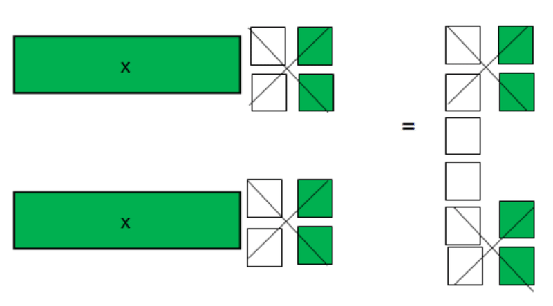

$$
\begin{align*}
\text{Check} &\\
2(r-2) &= -6\\
2(({\color{red}-1})-2) &= -6\\
2(-3) &= -6\\
-6 &= -6 \ \ Y
\end{align*}
$$

3. $2(j+1)=3(j-1)$.

You could choose either method for this problem. Below you will see the balance method used to solve the problem. Work through the steps to see if you can follow them. Remember since there are brackets, you must start with the distributive property and remove the brackets.

$$
\begin{align*}
\text{Check} &\\
2(j+1) &= 3(j-1)\\
2(({\color{red}5})+1) &= 3(({\color{red}5})-1)\\
2(6) &= 3(4)\\
12 &= 12 \ \ Y
\end{align*}
$$

**Summary**

The previous three lessons began your study of solving equations with variables. In this final lesson of the section, you were working with the distributive property. Equations with one variable that involve the distributive property are solved in the exact same way as any other equations with one variable. The only difference is that the very first step with distributive property problems is to remove the brackets.

To remove brackets, remember that you must multiply all the numbers inside the brackets by the number outside the brackets. After you remove brackets, you can then solve the equation by combining like terms, moving constants to one side of the equal sign, variables to the other side of the equal sign, then isolating the variable to find the solution.

Again, as with previous lessons, you must remember in these problems, as with any math problems involving an equal sign, whatever function (addition, subtraction, multiplication, or division) you do to one side of the equal sign, you must do to the other side. This is a big rule to remember in order for equations to remain equal or to remain in balance.

**Problem Set**

Use the balance (seesaw) method to find the solution for the variable in each of the following problems.

1.  $5(4x+3)=75$
2.  $3(s-4)=15$
3.  $5(k-4)=10$
4.  $43=4(t+6)-1$
5.  $6(x+4)=3(5x+2)$

Use algebra tiles to find the solution for the variable in each of the following problems.

1.  $2(d-3)=4$
2.  $5+2(x+7)=20$
3.  $2(3x-4)=22$
4.  $2(3x+2)-x=-6$
5.  $2(x+4)-x=9$

Use the methods that you have learned for solving equations with variables to solve for the variables in each of the following problems. Remember to choose an efficient method to solve for the variable.

1.  $-6=-6(3x-8)$
2.  $-2(x-2)=11$
3.  $2+3(-2x+1)=23$
4.  $3(x+2)-x=12$
5.  $5(2-3x)=-8-6x$

Summary
-------

In this lesson, you have worked with linear equations in one variable. You have learned how to solve problems where variables were on one side of the equation, where variables were on both sides of the equation, and also when there are brackets involved in the equations. The key to solving these equations is to make sure that whatever you do to one side of the equal sign, you do the other. In other words, if you add a number to the left hand side of the equal sign, add it to the right hand side. In this way the equation stays in balance.

When solving equations, you want to get variables on one side of the equal sign by adding or subtracting constant terms and then solving for the variable by multiplying or dividing by whatever term is attached to your variable. When you have brackets, your very first step is to use the distributive property and remove these brackets.

As well, you used two main methods to solve these equations as you begin learning to solve linear equations. You learned to solve using a balance (or seesaw) where the middle of the seesaw represents the equal sign. The other method is using algebra tiles. Although algebra tiles are great for solving these types of equations, when numbers get large, they become very cumbersome and therefore not very efficient. It may be more helpful to use another method.

</article>

### 2.2 Solving Linear Equations in One Variable using Decimals and Fractions

<article>

**Objectives**

The lesson objectives for Solving Linear Equations in One Variable using Decimals and Fractions are:

* Solving linear equations with one variable involving decimals
* Solving linear equations with one variable involving fractions
* Solving linear equations with decimals and fractions that apply the distributive property

Solving Linear Equations with One Variable Involving Decimals
-------------------------------------------------------------

**Introduction**

In the previous concept you learned to solve equations with one variable that involved whole numbers. In this concept you will apply the same rules to solve mathematical problems with equations that have decimals. The equations in this concept still only have one variable and it is still your mission to isolate your variable and then find a solution for it.

In the previous lesson you used two main methods to solve for equations with on variable. You used the balance (seesaw) method as well as algebra tiles. In this concept, you will use the balance (seesaw) method but will begin to use algebra statements to solve these equations. You can still use algebra tiles if you like by following the method learned in the previous concept.

What is most important when solving problems involving decimals is to remember that they look worse than they are and what's even better is that you can make them look easier. Take for example the problem below.

$0.1x+0.4=0.5$

At first this looks difficult. But multiply all of the numbers by 10 and see what happens.

$$
\begin{align*}
{\color{red}(10)}0.1x+{\color{red}(10)}0.4 &= {\color{red}(10)}0.5\\
1x+4 &= 5\\
or\\
x+4 &= 5
\end{align*}
$$

Now can you see the solution for $x$? That's right! It is 1.

So you have learned that when you have a mathematical problem involving decimals, you are first going to remove the decimals by multiplying by 10 (if one decimal place), 100 (if two decimal places), or 1000(if three decimal places).

**Watch This**

[Khan Academy Simple Equations](http://www.youtube.com/watch?v=9Ek61w1LxSc)

!?[video](https://www.youtube.com/watch?v=9Ek61w1LxSc)

**Guidance**

Karen wants to design a garden for her back yard. She knows she only has space for a rectangular garden of a perimeter equal to 60 feet. She needs to know the dimensions. The width will be half the length. What will be the dimensions of the garden?

\begin{align*}
Perimeter \ (P) &= 60 \ feet\\
P &= 2l + 2w\\
w &= \frac{1}{2} l
\end{align*}
$$

Therefore: $P=2l+2 \left(\frac{1}{2}\right)l$

or

$$
\begin{align*}
P &= 2l+\cancel{2} \left(\frac{1}{\cancel{2}}\right)l\\
P &= 2l+l\\
P &= 3l
\end{align*}
$$

Since you know that Karen has 60 feet for her perimeter, you can substitute 60 in for $P$.

$60=3l$

Now you can solve for $l$ (the length).

$$
\begin{align*}
\frac{60}{3} &= \frac{3l}{3}\\
l &= 20 \ feet
\end{align*}
$$

You now know that the length is 20 feet. You also know that the width is $\frac{1}{2}$ the length. So you can solve for the width.

$$
\begin{align*}
w &= \frac{1}{2} l\\
w &= \frac{1}{2} (20)\\
w &= 10 \ feet
\end{align*}
$$

Therefore the dimensions of Karen’s garden are $20 \ feet \times 10 \ feet$.

**Example A**

$a + 2.3 = 4.7$

Again, you can think of this problem being solved if you think about the problem in terms of a balance (or a seesaw). You know that the two sides are equal so the balance has to stay horizontal. We can place each side of the equation on each side of the balance.

 all by itself. Always remember that you need to keep the balance horizontal. This means that whatever you do to one side of the equation, you **_have_** to do to the other side.")

Let’s subtract 2.3 from both sides to get rid of the 2.3 on the left and isolate the variable.

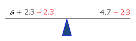

You can, as always, check your answer to see if you are correct.

$$
\begin{align*}
a + 2.3 &= 4.7\\
({\color{red}2.4}) + 2.3 &= 4.7\\
4.7 &= 4.7 \ \ Y
\end{align*}
$$

Example B

$b - 1.6 = 2.4$

This time let’s solve the problem using algebra tiles. Now you know that algebra tiles are used previously with whole numbers and they are not easily broken into pieces to make fractions. But we can make this problem more user friendly for solving with algebra tiles. Let’s multiply this problem by 10 to get rid of the decimal.

$$
\begin{align*}
{\color{red}(10)}b - {\color{red}(10)}1.6 &= {\color{red}(10)}2.4 \\
10b - 16 &= 24
\end{align*}
$$

Now you could use algebra tiles to solve for the variable.

Let’s do your check as with the previous problems.

$$
\begin{align*}
b - 1.6 &= 2.4\\
({\color{red}4}) - 1.6 &= 2.4\\
2.4 &= 2.4 \ \ Y
\end{align*}
$$

It could be noted that since the numbers were so large with this problem, the balance (or seesaw) method is more efficient. This is true with most problems involving decimals. In fact, algebra tiles are rarely more efficient when solving problems with variables involving decimals. Having said this, you may find it a valuable solution method for you in your problem solving.

**Example C**

$6.4c - 2.1 = 7.5$

You can again use the balance (seesaw) method to solve this problem.

 by dividing by 6.4. Remember that whatever you do to one side, you have to do to the other.")

You can check your answer to see if you are correct.

$$
\begin{align*}
6.4c - 2.1 &= 7.5\\
6.4({\color{red}1.5}) - 2.1 &= 7.5\\
9.6 - 2.1 &= 7.5\\
7.5 &= 7.5 \ \ Y
\end{align*}
$$

**Vocabulary**

__Equation__

An **_equation_** is two mathematical expressions separated by an equal sign.

__Variable__

A **_variable_** is an unknown quantity in a mathematical expression. It is represented by a letter. It is often referred to as the literal coefficient.

**Guided Practice**

1.  Use a model to solve for the variable in the problem $t-1.4=0.6$.
2.  Use a model then solve for the variable in the problem $1.2s+3.9=4.1$.
3.  Using the rules from the lesson, solve for x in the equation $7-0.03x=1.72x+1.75$.

**Answers**

1. $t-1.4=0.6$

You can use either method to solve this problem but let’s use algebra tiles for this one. Remember since there are decimals (to one decimal place to be exact), you first must multiply the equation by 10 to get rid of the decimals.

$$
\begin{align*}
{\color{red}(10)}t-{\color{red}(10)}1.4 &= {\color{red}(10)}0.6\\
10t-14 &= 6
\end{align*}
$$

$$
\begin{align*}
t - 1.4 &= 0.6\\
({\color{red}2}) - 1.4 &= 0.6\\
0.6 &= 0.6 \ \ Y
\end{align*}
$$

2. $1.2s+3.9=4.1$

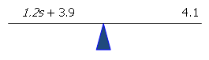

$$
\begin{align*}
1.2s + 3.9 &= 4.1\\
1.2({\color{red}0.17}) +3.9 &= 4.1\\
0.20 + 3.9 &= 4.1\\
4.1 &= 4.1 \ \ Y
\end{align*}
$$

3. $7-0.03x=1.72x+1.75$

You can use any method to solve this equation. Remember to isolate the $x$ variable. You will notice here that there are two $x$ values, one on each side of the equation. First let’s first combine these terms by adding $0.03x$ to both sides of the equation.

$7-0.03x {\color{red}+0.03x}=1.72x {\color{red}+0.03x}+1.75$

Simplifying you get:

$7=1.75x+1.75$

Now you can use any method to solve the equation. You now should just have to subtract 1.75 from both sides to isolate the $x$ variable.

$7{\color{red}-1.75}=1.75x+1.75 {\color{red}-1.75}$

Simplifying you get:

$5.25=1.75x$

Now to solve for the variable, you need to divide both sides by 1.75.

$\frac{5.25}{1.75}=\frac{1.75x}{1.75}$

You can now solve for $x$.

$x = 3$

Let's do a check to make sure.

$$
\begin{align*}
7-0.03x &= 1.72x+1.75 \quad (\text{original problem})\\
7 &= 1.75x+1.75 \quad (\text{simplified problem})\\
7 &= 1.75({\color{red}3})+1.75\\
7 &= 7 \ \ Y
\end{align*}
$$

**Summary**

Solving equations with one variable with decimals involves the same rules as when there are whole numbers. The goal is still to isolate the variable by combining like terms and putting all constant terms on one side of the equal sign with variables on the opposite side of the equal sign. The same two methods for solving equations with one variable can be used for these problems. These two methods are the balance (seesaw) model and using algebra tiles.

When using algebra tiles, the first step is always to multiply by 10, 100, or 1000 in order to remove the decimal. In other words, a tenths decimal place value (0.5) would be multiplied by 10. A hundredths place value decimal would be multiplied by 100 (0.55). A thousandths place value decimal would be multiplied by 1000 (0.555). Having said this, with equations with one variable involving the decimal, the use of algebra tiles may become more cumbersome as the numbers are larger.

**Problem Set**

Use the model of the balance (or seesaw) to solve for each of the following variables.

1.  $a+0.3=-0.5$
2.  $2b-1.5=6.3$
3.  $1.4c-3.2=4.9$
4.  $2.1-1.5d=3.2$
5.  $4.5-3.1e=-2.2$

Use algebra tiles to solve for each of the following variables.

1.  $0.5x+0.2=0.7$
2.  $0.2y-0.9=0.5$
3.  $0.2z-0.3=0.7$
4.  $0.07+0.05x=-0.03$
5.  $0.05x+0.16=-0.04$

Use the rules that you have learned to solve for the variables in the following problems.

1.  $0.87+0.15x=-0.03$
2.  $0.52x+0.12=-0.4$
3.  $0.25z-3.3=0.7$
4.  $0.6x-1.25=0.4x+0.35$
5.  $x-0.3+0.05x=2-1.4x$

Solving Linear Equations with One Variable Involving Fractions
--------------------------------------------------------------

**Introduction**

This concept is an extension of the previous four concepts in that you will be solving equations with one variable. When introducing fractions into these equations, the same rules apply. You need to keep the equations in balance by adding, subtracting, multiplying, or dividing on both sides of the equal sign in order to isolate the variable. The goal still remains to get your variable alone on one side of the equal sign with your constant terms on the other in order to solve for this variable.

When solving equations with fractions, you can use the balance method but you can begin to solve these problems without the aid of the “balance”. This was illustrated in the final problem of the problem set in the previous lesson. For the problems in this concept, you will be guided through algebraic problem solving of linear equations with one variable involving fractions.

**Watch This**

[Khan Academy Slightly More Complicated Equations](http://www.youtube.com/watch?v=XoEn1LfVoTo)

!?[video](https://www.youtube.com/watch?v=XoEn1LfVoTo)

**Guidance**

In this year’s student election for president, there were two candidates. The winner received $\frac{1}{3}$ more votes. If there were 588 votes cast for president, how many votes did each of the two candidates receive?

Let $x =$ votes for candidate 1 (the winner)

Let $y =$ votes for candidate 2

$x + y = 588$

You need to get only one variable into the equation in order to solve it. Let’s look at another relationship from the problem.

$$
\begin{align*}
x &= y + \frac{1}{3} y && (\text{candidate} \ 1 \ \text{received} \ \frac{1}{3} \ \text{more votes than candidate} \ 2)\\
x &= \frac{3}{3} y + \frac{1}{3} y && (\approx \text{Make denominator common for both} \ y \ \text{variables})\\
x &= \frac{4}{3} y && (\approx \text{Simplify})
\end{align*}
$$

Now substitute into the original problem.

$$
\begin{align*}
\frac{4}{3} y + y &= 588 && (\approx \text{Substitute for} \ x \ \text{into the equation})\\
\frac{4}{3} y + \frac{3}{3} y &= 588 && (\approx \text{Make denominator common for both} \ y \ \text{variables})\\
\frac{7}{3} y &= 588 && (\approx \text{Combine like terms})\\
{\color{red}(\cancel{3})} \frac{7}{\cancel{3}} y &= 588 {\color{red}(3)} && (\approx \text{Multiply both sides by the denominator in the fraction})\\
7y &= 1764 && (\approx \text{Simplify})\\
\frac{\cancel{7} y}{{\color{red}\cancel{7}}} &= \frac{1764}{{\color{red}7}} && (\approx \text{Divide both sides by the numerator in the fraction})\\
y &= 252 && (\approx \text{Simplify})
\end{align*}
$$

So candidate 2 received 252 votes. Candidate 1 must have received $588 - 252 = 336$ votes.

**Example A**

$$
\begin{align*}
\frac{1}{3}t+5 &= -1\\
\frac{1}{3}t+5 {\color{red}-5} &= -1 {\color{red}-5} && (\approx \text{Subtract} \ 5 \ \text{from both sides to isolate the variable})\\
\frac{1}{3}t &= -6 && (\approx \text{Simplify})\\
({\color{red}\cancel{3}}) \frac{1}{\cancel{3}}t &= -6 ({\color{red}3}) && (\approx \text{Multiply both sides by the denominator} \ ({\color{red}3}) \ \text{in the fraction})\\
t &= -18 && (\approx \text{Simplify})
\end{align*}
$$

Therefore $t = -18$.

$$
\begin{align*}
\text{Check} &\\
\frac{1}{3}t+5 &= -1\\
\frac{1}{3} ({\color{red}-18})+5 &= -1\\
-6+5 &= -1\\
-1 &= -1 \ \ Y
\end{align*}
$$

**Example B**

$$
\begin{align*}
\frac{3}{4}x-3 &= 2\\
\frac{3}{4}x-3 {\color{red}+3} &= 2 {\color{red}+3} && (\approx \text{Add} \ 3 \ \text{to both sides to isolate the variable})\\
\frac{3}{4}x &= 5 && (\approx \text{Simplify})\\
({\color{red}\cancel{4}}) \frac{3}{4}x &= 5({\color{red}4})&& (\approx \text{Multiply both sides by the denominator} \ ({\color{red}4}) \ \text{in the fraction}\\
3x &= 20 && (\approx \text{Simplify})\\
\frac{\cancel{3} x}{{\color{red}\cancel{3}}} &= \frac{20}{{\color{red}3}}\\
x &= \frac{20}{3}
\end{align*}
$$

Therefore $x = \frac{20}{3}$.

$$
\begin{align*}
\text{Check} &\\
\frac{3}{4} x-3 &= 2\\
\frac{3}{4} \left(\frac{20}{3}\right)-3 &= 2\\
\frac{20}{4}-3 &= 2\\
5-3 &= 2\\
2 &= 2 \ \ Y
\end{align*}
$$

**Example C**

$$
\begin{align*}
\frac{2}{5} x-4 &= -\frac{1}{5}x+8\\
\frac{2}{5}x {\color{red}+\frac{1}{5}x}-4 &= -\frac{1}{5}x {\color{red}+\frac{1}{5}x}+8 && (\approx \text{Add} \ \frac{1}{5}x \ \text{to both sides of the equal sign to combine variables})\\
\frac{3}{5} x-4 &= 8 && (\approx \text{Simplify})\\
\frac{3}{5}x-4 {\color{red}+4} &= 8 {\color{red}+4} && (\approx \text{Add} \ 4 \ \text{to both sides of the equation to isolate the variable})\\
\frac{3}{5}x &= 12 && (\approx \ \text{Simplify})\\
({\color{red}\cancel{5}}) \frac{3}{\cancel{5}}x &= 12({\color{red}5}) && (\approx \ \text{Multiply both sides by the denominator } ({\color{red}5}) \text{ in the fraction})\\
3x &= 60 && (\approx \text{Simplify})\\
\frac{\cancel{3}x}{\cancel{3}} &= \frac{60}{3} && (\approx \text{Divide both sides by the numerator } ({\color{red}3}) \text{ in the fraction})\\
x &= 20 && (\approx \text{Simplify})
\end{align*}
$$

Therefore $x = 20$.

$$
\begin{align*}
\text{Check} &\\
\frac{2}{5}x-4 &= -\frac{1}{5}x+8\\
\frac{2}{5} ({\color{red}20})-4 &=- \frac{1}{5} ({\color{red}20})+8\\
\frac{40}{5}-4 &=-\frac{20}{5}+8\\
8-4 &= -4+8\\
4 &= 4 \ \ Y
\end{align*}
$$

**Vocabulary**

__Fraction__

A **_fraction_** is a part of a whole consisting of a numerator divided by a denominator. For example, if a pizza is cut into eight slices and you ate 3 slices, you would have eaten $\frac{3}{8}$ of the pizza. $\frac{3}{8}$ is a fraction with 3 being the numerator and 8 being the denominator.

__Least Common Denominator__

The **_least common denominator_** or lowest common denominator is the smallest number that all of the denominators (or the bottom numbers) can be divided into evenly. For example with the fractions $\frac{1}{2}$ and $\frac{1}{3}$, the smallest number that both 2 and 3 will divide into evenly is 6. Therefore the least common denominator is 6.

**Guided Practice**

1.  Solve for the variable in the problem $\frac{2}{3}x=12$.
2.  Solve for the variable in the problem $\frac{3}{4}x-5=19$.
3.  Solve for the variable in the problem $\frac{1}{4}w-3=\frac{2}{3}w$.

**Answers**

1. 

$$
\begin{align*}
\frac{2}{3}x &= 12\\
({\color{red}\cancel{3}}) \frac{2}{3}x &= 12 ({\color{red}3}) && (\approx \text{Multiply both sides by the denominator} \ ({\color{red}3}) \ \text{in the fraction})\\
2x &= 36 && (\approx \text{Simplify})\\
\frac{\cancel{2} x}{{\color{red}\cancel{2}}} &= \frac{36}{{\color{red}2}} && (\approx \text{Divide both sides by the numerator} \ ({\color{red}2}) \ \text{in the fraction})\\
x &= 18 && (\approx \text{Simplify})
\end{align*}
$$

Therefore $x = 18$.

$$
\begin{align*}
\text{Check} &\\
\frac{2}{3}x &= 12\\
\frac{2}{3} ({\color{red}18}) &= 12\\
\frac{36}{3} &= 12\\
12 &= 12 \ \ Y
\end{align*}
$$

2. 

$$
\begin{align*}
\frac{3}{4}x-5 &= 19\\
\frac{3}{4}x-5 {\color{red}+5} &= 19 {\color{red}+5} && (\approx \text{Add} \ 5 \ \text{to both sides of the equal sign to isolate the variable})\\
\frac{3}{4}x &= 24 && (\approx Simplify)\\
({\color{red}\cancel{4}}) \frac{3}{\cancel{4}}x &= 24({\color{red}4}) && (\approx \text{Multiply both sides by the denominator} ({\color{red}4}) \ \text{in the fraction})\\
3x &= 96 && (\approx \text{Simplify})\\
\frac{\cancel{3} x}{{\color{red}\cancel{3}}}&=\frac{96}{{\color{red}3}} && (\approx \text{Divide both sides by numberator } ({\color{red}2}) \text{ in the fraction})\\
x &= 32 && (\approx \text{Simplify})
\end{align*}
$$

Therefore $x = 32$.

$$
\begin{align*}
\text{Check} &\\
\frac{3}{4}x-5 &= 19\\
\frac{3}{4} ({\color{red}32})-5 &= 19\\
\frac{96}{4}-5 &= 19\\
24-5 &= 19\\
19 &= 19 \ \ Y
\end{align*}
$$

3. 

$$
\begin{align*}
\frac{1}{4}w-3 &= \frac{2}{3}w\\
\frac{1}{4}w-3 {\color{red}+3} &= \frac{2}{3}w {\color{red}+3} && (\approx \text{Add} \ 3 \ \text{to both sides of the equal sign to start})\\
\frac{1}{4}w &= \frac{2}{3}w+3 && (\approx \text{Simplify})\\
\frac{1}{4}w {\color{red}-\frac{2}{3}w} &= \frac{2}{3}w {\color{red}-\frac{2}{3}w}+3 && (\approx \text{Subtract} \ \frac{2}{3}w \ \text{from both sides of the equal sign to get variables on same side})\\
\frac{1}{4}w-\frac{2}{3}w &= 3 && (\approx \text{Simplify})
\end{align*}
$$

In order to simplify further, you need to make the fractions all have the same denominator. In order to do this you need to find the least common denominator (LCD). If you look at the last equation $\left(\frac{1}{4}w-\frac{2}{3}w=3 \right)$ you will see that the denominators are 4, 3, and 1. The equation can really be seen as $\left(\frac{1}{{\color{blue}4}}w-\frac{2}{{\color{blue}3}}w=\frac{3}{{\color{blue}1}}\right)$.

So what is the least common denominator for the numbers 1, 3, and 4? Well all three numbers will divide into 12 evenly $({\color{blue}4} \times 3 = 12, {\color{blue}3} \times 4 = 12$, and ${\color{blue}1} \times 12 = 12)$. Therefore you need to multiply $\frac{1}{{\color{blue}4}}w$ by $\frac{3}{3},-\frac{2}{{\color{blue}3}}w$, by $\frac{4}{4}$, and $\frac{3}{{\color{blue}1}}$ by $\frac{12}{12}$ in order to carry on with this problem and solve for the variable. Notice that by multiplying by $\frac{3}{3}$, you are really just multiplying by 1!

$$
\begin{align*}
{\color{magenta}\left(\frac{3}{3}\right)} \frac{1}{4}w- {\color{magenta}\left(\frac{4}{4}\right)} \frac{2}{3}w &= {\color{magenta} \left(\frac{12}{12}\right)} 3 && (\approx \text{Multiply by the LCD})\\
\frac{3}{12}w-\frac{8}{12}w &= \frac{36}{12} && (\approx \text{Simplify})
\end{align*}
$$

Since all the denominators are the same (12), we can simplify further:

$$
\begin{align*}
3w-8w &= 36 && (\approx \text{Combine like terms})\\
-5w &= 36 && (\approx \text{Simplify})\\
\frac{-5w}{{\color{red}-5}} &= \frac{36}{{\color{red}-5}} && (\approx \text{Divide by} \ -5 \ \text{to solve for the variable})\\
w &= -\frac{36}{5} && (\approx \text{Simplify})
\end{align*}
$$

Therefore $w = -\frac{36}{5}$.

$$
\begin{align*}
\text{Check} &\\
\frac{1}{4}w-3 &= \frac{2}{3}w\\
\frac{1}{4} \left({\color{red}\frac{-36}{5}} \right)-3 &= \frac{2}{3} \left({\color{red}\frac{-36}{5}}\right)\\
\frac{-36}{20} -3 &= \frac{-72}{15}\\
\frac{-108}{60}-\frac{180}{60} &= \frac{-288}{60}\\
\frac{-288}{60} &= \frac{-288}{60} \ \ Y
\end{align*}
$$

**Summary**

You have expanded your problem solving techniques for solving equations with one variable to include problems that involve fractions. You have learned that the solution steps are the same as those you have learned previously in that whatever you do to one side of the equal sign, you must do to the other. As well, your goal still remains to isolate the variables onto one side of the equation and then solve for the variable.

With fractions, however, there is the added step of multiplying and dividing the equation by the numerator and denominator in order to solve for the variable. As well, if your fractions do not have the same denominator, you must first find the least common denominator (LCD) before combining like terms or combining constants.

**Problem Set**

Solve for the variable in each of the following problems.

1.  $\frac{1}{3}p=5$
2.  $\frac{3}{7}j=8$
3.  $\frac{2}{5}b+4=6$
4.  $\frac{2}{3}x-2=1$
5.  $\frac{1}{3}x+3=-3$

Solve for the variable in each of the following problems.

1.  $\frac{1}{8}k+\frac{2}{3}=5$
2.  $\frac{1}{6}c+\frac{1}{3}=-2$
3.  $\frac{4}{5}x+3=\frac{2}{3}$
4.  $\frac{3}{4}x-\frac{2}{5}=\frac{1}{2}$
5.  $\frac{1}{4}t+\frac{2}{3}=\frac{1}{2}$

Solve for the variable in each of the following problems.

1.  $\frac{1}{3}x+\frac{1}{4}x=1$
2.  $\frac{1}{5}d+\frac{2}{3}d=\frac{5}{3}$
3.  $\frac{1}{2}x-1=\frac{1}{3}x$
4.  $\frac{1}{3}x-\frac{1}{2}=\frac{3}{4}x$
5.  $\frac{2}{3}j-\frac{1}{2}=\frac{3}{4}j+\frac{1}{3}$

Solving Linear Equations with Fractions and Decimals that Apply the Distributive Property
-----------------------------------------------------------------------------------------

**Introduction**

If you recall, the distributive property is a mathematical way of grouping terms. As you learned in a previous lesson, the **_distributive property_** states that the product of a number and a sum is equal to the sum of the individual products of the number and the addends. In this lesson, you will use the distributive property with linear equations and fractions. The same rules apply. You have to multiply what is on the outside of the brackets by what is on the inside of the brackets and this is your first step in solving equations with one variable where there are brackets.

**Watch This**

[Khan Academy Solving Equations with the Distributive Property](http://www.youtube.com/watch?v=YZBStgZGyDY)

!?[video](https://www.youtube.com/watch?v=YZBStgZGyDY)

**Guidance**

Pens are $9 per dozen and pencils are $6 per dozen. Janet needs to buy a half dozen of each for school. How much is the total cost of her purchase?

If first let’s write down what you know:

Let $x =$ total cost

Cost of pens: $9/dozen

Cost of pencils: $6/dozen

Janet needs one half dozen of each.

The total cost would therefore be:

$$
\begin{align*}
\frac{1}{2}(\$9+\$6) &= x\\
\frac{\$ 9}{2}+\frac{\$ 6}{2} &= x\\
\$4.50+\$3.00 &= x\\
\$7.50 &= x
\end{align*}
$$

Therefore Janet would need $7.50 to buy these supplies.

**Example A**

$$
\begin{align*}
\frac{2}{5}(d+4) &= 6\\
\frac{2}{5}d+\frac{8}{5} &= 6 && (\approx \text{Apply the distributive property to remove the brackets})
\end{align*}
$$

Find the LCD for 5, 5, and 1. Since it is 5, multiply the last number by $\frac{5}{5}$, to get the same denominator.

$$
\begin{align*}
\frac{2}{5}d+\frac{8}{5} &= \left({\color{red}\frac{5}{5}}\right)6\\
\frac{2}{5}d+\frac{8}{5} &= \frac{30}{5} && (\approx \text{Simplify})
\end{align*}
$$

Since all of the denominators are the same, the equation becomes:

$$
\begin{align*}
2d+8 &= 30\\
2d+8 {\color{red}-8} &= 30 {\color{red}-8} && (\approx \text{Subtract} \ 8 \ \text{from both sides of the equal sign to isolate the variable})\\
2d &= 22 && (\approx \text{Simplify})\\
\frac{2d}{{\color{red}2}}&=\frac{22}{{\color{red}2}} && (\approx \text{Divide by} \ 2 \ \text{to solve for the variable})\\
d &= 11
\end{align*}
$$

Therefore $d = 11$.

$$
\begin{align*}
\text{Check} &\\
\frac{2}{5}(d+4) &= 6\\
\frac{2}{5} ({\color{red}11} +4) &=6\\
\frac{2}{5}(15) &= 6\\
\frac{30}{5} &= 6\\
6 &= 6 \ \ Y
\end{align*}
$$

**Example B**

$$
\begin{align*}
\frac{1}{4}(3x+7) &= -2\\
\frac{3}{4}x+\frac{7}{4} &= -2 && (\approx \text{Apply the distributive property to remove the brackets})
\end{align*}
$$

Find the LCD for 4, 4, and 1. Since it is 4, multiply the last number by $\frac{4}{4}$, to get the same denominator.

$$
\begin{align*}
\frac{3}{4}x+\frac{7}{4} &= \left({\color{red}\frac{4}{4}}\right)-2\\
\frac{3}{4}x+\frac{7}{4} &= \frac{-8}{4} && (\approx \text{Simplify})
\end{align*}
$$

Since all of the denominators are the same, the equation becomes:

$$
\begin{align*}
3x+7 &= -8\\
3x+7 {\color{red}-7} &= -8 {\color{red}-7} && (\approx \text{Subtract} \ 7 \ \text{from both sides of the equal sign to isolate the variable})\\
3x &= -15 && (\approx \text{Simplify})\\
\frac{3x}{{\color{red}3}} &= \frac{-15}{{\color{red}3}} && (\approx \text{Divide by} \ 3 \ \text{to solve for the variable})\\
x &= -5
\end{align*}
$$

Therefore $x = -5$.

$$
\begin{align*}
\text{Check} &\\
\frac{1}{4}(3x+7) &= -2\\
\frac{1}{4} (3 ({\color{red}-5})+7) &= -2\\
\frac{1}{4}(-15+7) &= -2\\
\frac{1}{4}(-8) &= -2\\
\frac{-8}{4} &= -2\\
-2 &= -2 \ \ Y
\end{align*}
$$

**Example C**

$$
\begin{align*}
\frac{1}{3}(x-2) &= -\frac{2}{3}(2x+4)\\
\frac{1}{3}x-\frac{2}{3} &= -\frac{4}{3}x-\frac{8}{3} && (\approx \text{Apply the distributive property to remove the brackets})
\end{align*}
$$

Since all of the denominators are the same, the equation becomes:

$$
\begin{align*}
x-2 &= -4x-8\\
x {\color{red}+4x} -2 &= -4x {\color{red}+4x}-8 && (\approx \text{Add} \ 4x \ \text{to both sides of the equal sign to combine variables})\\
5x-2 &= -8 && (\approx \text{Simplify})\\
5x-2 {\color{red}+2} &= -8 {\color{red}+2} && (\approx \text{Add} \ 2 \ \text{to both sides of the equation to isolate the variable})\\
5x &= -6 && (\approx \text{Simplify})\\
\frac{5x}{{\color{red}5}} &= \frac{-6}{{\color{red}5}} && (\approx \text{Divide both sides by} \ 5 \ \text{to solve for the variable})\\
x&=\frac{-6}{5} && (\approx \text{Simplify})
\end{align*}
$$

Therefore $x=\frac{-6}{5}$.

$$
\begin{align*}
\text{Check}&\\
\frac{1}{3}(x-2) &= -\frac{2}{3}(2x+4)\\
\frac{1}{3} \left( {\color{red}\left(\frac{-6}{5}\right)} -2 \right) &= -\frac{2}{3} \left(2 {\color{red}\left(\frac{-6}{5}\right)}+4\right)\\
0.33(-1.2-2) &= -0.67(2(-1.2)+4)\\
0.33(-3.2) &= -0.67(1.6)\\
-1.1 &= -1.1 \ \ Y
\end{align*}
$$

**Vocabulary**

__Distributive Property__

The **_distributive property_** is a mathematical way of grouping terms. It states that the product of a number and a sum is equal to the sum of the individual products of the number and the addends. For example, in the expression: ${\color{red}\frac{2}{3}} ({\color{blue}x + 5})$, the distributive property states that the product of a number $({\color{red}\frac{2}{3}})$ and a sum $({\color{blue}x + 5})$ is equal to the sum of the individual products of the number $({\color{red}\frac{2}{3}})$ and the addends $({\color{blue}x}$ and ${\color{blue}5})$.

**Guided Practice**

1.  Solve for the variable in the problem $\frac{1}{2}(5x+3)=1$.
2.  Solve for the variable in the problem $\frac{2}{3}(9x-6)=2$.
3.  Solve for the variable in the problem $\frac{2}{3}(3x+9)=\frac{1}{4}(2x+5)$.

**Answers**

1. 

$$
\begin{align*}
\frac{1}{2} (5x+3) &=1 \\
\frac{5}{2}x+\frac{3}{2}&=1 && (\approx \text{Apply the distributive property to remove the brackets})
\end{align*}
$$

Find the LCD for 2, 2, and 1. Since it is 2, multiply the last number by $\frac{2}{2}$, to get the same denominator.

$$
\begin{align*}
\frac{5}{2}x+\frac{3}{2} &= 1 {\color{red}\left(\frac{2}{2}\right)}\\
\frac{5}{2}x+\frac{3}{2} &= \frac{2}{2} && (\approx \text{Simplify})
\end{align*}
$$

Since all of the denominators are the same, the equation becomes:

$$
\begin{align*}
5x+3 &= 2\\
5x+3 {\color{red}-3} &= 2 {\color{red}-3} && (\approx \text{Subtract} \ 3 \ \text{from both sides of the equal sign to isolate the variable})\\
5x &= -1 && (\approx \text{Simplify})\\
\frac{5x}{{\color{red}5}} &= \frac{-1}{{\color{red}5}} && (\approx \text{Divide both sides by the} \ 5 \ \text{to solve for the variable})\\
x &= \frac{-1}{5} && (\approx \text{Simplify})
\end{align*}
$$

Therefore $x=\frac{-1}{5}$.

$$
\begin{align*}
\text{Check} &\\
\frac{1}{2} (5x+3) &= 1\\
\frac{1}{2} \left(5 \left({\color{red}\frac{-1}{5}}\right)+3\right) &= 1\\
\frac{1}{2}(-1+3) &= 1\\
\frac{1}{2}(2) &= 1\\
1 &= 1 \ \ Y
\end{align*}
$$

2. 

$$
\begin{align*}
\frac{2}{3} (9x-6) &= 2\\
\frac{18}{3}x-\frac{12}{3} &= 2 && (\approx \text{Apply the distributive property to remove the brackets})
\end{align*}
$$

Find the LCD for 3, 3, and 1. Since it is 3, multiply the last number by $\frac{3}{3}$, to get the same denominator.

$$
\begin{align*}
\frac{18}{3}x-\frac{12}{3} &= 2 {\color{red}\left(\frac{3}{3}\right)}\\
\frac{18}{3}x-\frac{12}{3} &= \frac{6}{3} && (\approx \text{Simplify})
\end{align*}
$$

Since all of the denominators are the same, the equation becomes:

$$
\begin{align*}
18x-12 &= 6\\
18x-12 {\color{red}+12} &= 6 {\color{red}+12} && (\approx \text{Add} \ 12 \ \text{to both sides of the equal sign to isolate the variable})\\
18x &= 18 && (\approx \text{Simplify})\\
\frac{18x}{{\color{red}18}} &= \frac{18}{{\color{red}18}} && (\approx \text{Divide both sides by the} \ 18 \ \text{to solve for the variable})\\
x &= 1 && (\approx \text{Simplify})
\end{align*}
$$

Therefore $x=1$.

$$
\begin{align*}
\text{Check} &\\
\frac{2}{3}(9x-6) &= 2\\
\frac{2}{3}(9({\color{red}1})-6) &= 2\\
\frac{2}{3}(3) &= 2\\
2 &= 2 \ \ Y
\end{align*}
$$

3. 

$$
\begin{align*}
\frac{2}{3}(3x+9) &= \frac{1}{4}(2x+5)\\
\frac{6}{3}x+\frac{18}{3} &= \frac{2}{4}x+\frac{5}{4} && (\approx \text{Apply the distributive property to remove the brackets})
\end{align*}
$$

Find the LCD for 3, 3, and 4, 4. Since it is 12, multiply the first two fractions by $\frac{4}{4}$ and the second two fractions by $\frac{3}{3}$, to get the same denominator.

$$
\begin{align*}
\left({\color{red}\frac{4}{4}}\right) \frac{6}{3}x+\left({\color{red}\frac{4}{4}}\right) \frac{18}{3} &= \left({\color{red}\frac{3}{3}}\right) \frac{2}{4}x+\left({\color{red}\frac{3}{3}}\right) \frac{5}{4}\\
\frac{24}{12}x+\frac{72}{12} &= \frac{6}{12}x+\frac{15}{12} && (\approx \text{Simplify})
\end{align*}
$$

Since all of the denominators are the same, the equation becomes:

$$
\begin{align*}
24x+72 &= 6x+15\\
24x+72 {\color{red}-72} &= 6x+15 {\color{red}-72} && (\approx \text{Subtract} \ 72 \ \text{from both sides of the equal sign to isolate the variable})\\
24x &= 6x-57 && (\approx \text{Simplify})\\
24x {\color{red}-6x} &= 6x {\color{red}-6x} - 57 && (\approx \text{Subtract} \ 6x \ \text{from both sides of the equal sign to get variables on same side})\\
18x &= -57 && (\approx \text{Simplify})\\
\frac{18x}{{\color{red}18}} &= \frac{-57}{{\color{red}18}} && (\approx \text{Divide both sides by} \ 18 \ \text{to solve for the variable})\\
x &= \frac{-57}{18} && (\approx \text{Simplify})
\end{align*}
$$

Therefore $x=\frac{-57}{18}$.

$$
\begin{align*}
\text{Check} &\\
\frac{2}{3} (3x+9) &= \frac{1}{4}(2x+5)\\\
\frac{2}{3} \left(3 \left( {\color{red}\frac{-57}{18}}\right)+9\right) &= \frac{1}{2} \left(2 \left({\color{red}\frac{-57}{18}} \right)+5\right)\\
\frac{2}{3}(-9.5+9) &= \frac{1}{4}(-6.33+5)\\
\frac{2}{3}(-0.5) &= \frac{1}{4}(-1.33)\\
-0.33 &= -0.33 \ \ Y
\end{align*}
$$

**Summary**

In this final lesson on solving linear equations with one variable, you have learned how to solve equations using the distributive property. The same rules apply with decimals and fractions as apply with whole numbers in that the brackets must be removed as the first step in solving these types of problems.

Always remember, to remove brackets you must multiply all the numbers inside the brackets by the number outside the brackets. After you remove brackets, you then solve the equation by combining like terms; move constants to one side of the equal sign, variables to the other side of the equal sign, then isolate the variable to find the solution.

**Problem Set**

Solve for the variable in each of the following problems.

1.  $\frac{1}{2} (x+5)=6$
2.  $\frac{1}{4}(g+2)=8$
3.  $0.4(b+2)=2$
4.  $0.5(r-12)=4$
5.  $\frac{1}{4}(x-16)=7$

Solve for the variable in each of the following problems.

1.  $26.5-k=0.5(50-k)$
2.  $2(1.5c+4)=-1$
3.  $-\frac{1}{2}(3x-5)=7$
4.  $0.35+0.10(m-1)=5.45$
5.  $\frac{1}{4}+\frac{2}{3}(t+1)=\frac{1}{2}$

Solve for the variable in each of the following problems.

1.  $\frac{1}{2}x-3 (x+4)=\frac{2}{3}$
2.  $-\frac{5}{8}x+x=\frac{1}{8}$
3.  $0.4(12-d)=18$
4.  $0.25(x+3)=0.4(x-5)$
5.  $\frac{2}{3}(t-2)=\frac{3}{4}(t+2)$

Summary
-------

In this lesson, you have extended your learning with linear equations in one variable. You still worked with learning how to solve problems where variables were on one side of the equation, where variables were on both sides of the equation, and also when there are brackets involved in the equations. In this lesson, decimals and fractions were introduced. With decimals, the calculations become more complex. Normally, you would multiply by 10, 100, or 1000 to get rid of the decimal. Then you could follow the same rules and the same steps in problem-solving as you learned in the previous lesson. Remember that whatever you do to one side of the equal sign, you do the other in order for the equation to stay in balance.

With fractions, it is important to have a common denominator. To do this, you learned to find the least common denominator (LCD) and then simplify your equation once all terms have the common denominator. From here, isolating and solving for the variable uses the same procedure.

As far as the methods are concerned, you spent little time with algebra tiles as they are more difficult to use with fractions and decimals. Using the balance (seesaw) method or solving using algebra steps is both helpful and efficient.

</article>

### 2.3 Quiz I

<article>

1.  Which of the following is the solution to the linear equation? $6-d=-7$
    1.  –13
    2.  –1
    3.  1
    4.  13
2.  Which of the following is the solution to the linear equation? $4(3j-2)+9=4$
    1.  \-3
    2.  1
    3.  $\frac{-1}{4}$
    4.  $\frac{1}{4}$
3.  Which of the following is the solution to the linear equation? $\frac{1}{3}(18-27t)-3=12$
    1.  0
    2.  –1
    3.  1
    4.  $\frac{1}{3}$
4.  Which of the following is the solution to the linear equation? $4(4.23+1.25h)=5.91$
    1.  –2.20
    2.  2.00
    3.  –2.00
    4.  2.20
5.  Which of the following is the solution to the linear equation? $4(3e+6)+2=3e-10$
    1.  –4
    2.  –2
    3.  0
    4.  4
6.  Which of the following is the solution to the linear equation? $3.5(g-5.6)+0.03g=4.2g-25.5$
    1.  –29.7
    2.  –8.8
    3.  8.8
    4.  29.7
7.  Solve the following linear equation using the most efficient method. $5r-16=-5r+14$
8.  Solve the following linear equation using the most efficient method. $3(5s-2)=2(7s-5)$
9.  Write a problem to represent this model and solve for the variable. 
    
    \[Figure 1\]
    
10. Write a problem to represent this model and solve for the variable. 
    
    \[Figure 2\]

</article>

### 2.4 Expressing Words as Algebraic Expressions

<article>

Using Mathematical Symbols to Represent Words
---------------------------------------------

**Objectives**

The lesson objectives for Expressing Words as Algebraic Expressions are:

* Using mathematical symbols to represent words
* Using algebraic expressions to represent words
* Writing linear equations in one variable to represent words

**Introduction**

Mathematics is a language like English or French or Chinese is a language. Mathematics can be seen as a universal language. What this means is that words spoken in mathematical terms mean the same in the United States as they mean in Canada, as they mean in Europe, and so forth. For example, if you were to say “I am going to add 3 avocados to 2 avocados," the word add is a universal term. Someone may not know what an avocado is but they would know what the term “add” means. The term “add” would give you the mental image of the symbol “+”.

In this lesson, you are going to explore some of these mathematical symbols and their word translations. Words such as gain, more, sum, total, increase, and plus all mean to add. Words such as difference between, minus, decrease, less, fewer, and loss all mean to subtract. Words such as the product of, double $(2x)$, twice $(2x)$, triple $(3x)$, a fraction of, a percent of, or times all mean to multiply. And finally words such as the quotient of, divided equally, and per mean to divide. Knowing these terms will lead to the next lesson on translating algebraic expressions from words to symbols.

**Watch This**

[Khan Academy Problem Solving Word Problems 2](http://www.youtube.com/watch?v=W254ewkkMck)

!?[video](https://www.youtube.com/watch?v=W254ewkkMck)

**Guidance**

Rob is describing his weight training to his friend James. He said that when he started training he weighed 185 pounds. He gained 8 pounds in the first month of training. How much did he weigh?

The word gain is the same as saying add.

Therefore Rob weighs $185 + 8 = 193 \ pounds$.

**Example A**

What is the sum of five and seventeen?

Break apart the sentence. It is often helpful to underline the words before and after the word AND. Also, it is helpful to box the mathematical symbol.

$$
\begin{align*}
& \text{What is the} \ \boxed{\text{sum}} \ \text{of} \ \underline{\text{five}} \ \text{and} \ \underline{\text{seventeen}}? \\
&\qquad \qquad \qquad \uparrow \qquad \quad \uparrow \qquad \quad \ \  \uparrow\\
& \qquad \qquad \qquad \ {\color{red}+} \qquad \ \ 5 \qquad \quad \ 17
\end{align*}
$$

Then translate the symbols together into a mathematical equation and solve it.

$5 {\color{red}+} 17 = 22$

**Example B**

Thomas had twenty-four dollars and after shopping his money decreased by four dollars.

Break apart the sentence. Underline the words before and after the word AND, and box the mathematical symbol.

$$
\begin{align*}
& \text{Thomas had} \ \underline{\text{twenty-four}} \ \text{dollars and after shopping his money} \ \boxed{\text{decreased}} \ \text{by} \ \underline{\text{four}} \ \text{dollars.}\\
&\qquad \qquad \qquad \quad \uparrow \qquad \qquad \qquad \qquad \qquad \qquad \qquad \qquad \qquad \qquad \qquad \uparrow \qquad \qquad \ \ \uparrow\\
& \qquad \qquad \qquad \quad  24 \qquad \qquad \qquad \qquad \qquad \qquad \qquad \qquad \qquad \qquad \quad \ \ {\color{red}-} \qquad \qquad \ 4
\end{align*}
$$

Then translate the symbols together into a mathematical equation and solve it.

$24 {\color{red}-}4 = 20$

Therefore Thomas had $20.00 left after shopping.

**Example C**

Nick, Chris, and Jack are sharing a bag of jelly beans. There are 30 jelly beans for the three boys to share equally. How many would each get?

Again, break apart the sentence. Underline the numerical words and box the mathematical symbol.

$$
\begin{align*}
& \text{There are} \ \underline{30} \ \text{jelly beans for the} \ \underline{\text{three}} \ \text{boys to} \ \boxed{\text{share equally.}} \ \text{How many would each get?}\\
&\qquad \qquad \ \uparrow \qquad \qquad \qquad \qquad  \qquad \uparrow \qquad \qquad \qquad \ \ \uparrow\\
&\qquad \qquad \ 30 \qquad \qquad \qquad \qquad \quad \ \ 3 \qquad \qquad \qquad \ \ {\color{red}\div}
\end{align*}
$$

$30 \div 3 = 10$

Therefore each boy would get 10 jelly beans.

**Vocabulary**

__Addition__

Words such as gain, more, sum, total, increase, and plus all mean to use **_addition_** or to add.

__Subtraction__

Words such as the difference between, minus, decrease, less, fewer, and loss all mean to use **_subtraction_** or to subtract.

__Multiplication__

Words such as the product of, double $(2x)$, twice $(2x)$, triple $(3x)$, fraction of, percent of, and times all mean to use **_multiplication_** or to multiply.

__Division__

Division

Words such as the quotient of, divided equally, and per mean to use **_division_** or to divide.

**Guided Practice**

1.  What is twelve increased by eighteen?
2.  Joanne and Jillian were each going to share their babysitting money for the week. They made $45.00 in total. How much does each girl receive?
3.  The number five is increased by seven. Three-fourths of this number is then decreased from twenty. What is the result?

**Answers**

1. What is twelve increased by eighteen?

Break apart the sentence. Underline the numerical words and box the mathematical symbol.

$$
\begin{align*}
& \text{What is} \ \underline{\text{twelve}} \ \boxed{\text{increased}} \ \text{by} \ \underline{\text{eighteen}}?\\
&\qquad \qquad \ \uparrow \qquad  \qquad \uparrow \qquad \qquad \quad \uparrow\\
&\qquad \qquad \ 12 \qquad \quad \ {\color{red}+} \qquad \qquad \quad 18
\end{align*}
$$

$12 + 18 = 30$

2. Joanne and Jillian were each going to share their babysitting money for the week. They made $45.00 in total. How much does each girl receive?

Break apart the sentence. Underline the numerical words and box the mathematical symbol.

$$
\begin{align*}
& \underline{\text{Joanne and Jillian}} \ \text{were each going to} \ \boxed{\text{share}} \ \text{their babysitting money for the week. They made} \ \underline{\$45.00} \ \text{in total}?\\
&\qquad \qquad  \uparrow \qquad  \qquad \qquad \qquad \qquad \quad \quad \ \ \uparrow \qquad \qquad \qquad \qquad  \qquad \qquad \quad \qquad \qquad \qquad \qquad \qquad \qquad \ \uparrow\\
&\qquad \qquad \ 2 \qquad  \qquad \qquad \qquad \qquad \quad \quad \ \ {\color{red}\div} \qquad \qquad \qquad \qquad  \qquad \qquad \quad \qquad \qquad \qquad \qquad \qquad \quad \ \ 45
\end{align*}
$$

$45 \div 2 = 22.5$

Therefore each girl would get $22.50.

3. The number five is increased by seven. Three-fourths of this number is then decreased from twenty. What is the result?

Break apart the sentence. Underline the numerical words and box the mathematical symbol.

$$
\begin{align*}
& \text{The number} \ \underline{\text{five}} \ \text{is} \ \boxed{\text{increased}} \ \text{by} \ \underline{\text{seven}}. \ \boxed{\text{Three-fourths}} \ \text{of this} \ \underline{\text{number}} \ \text{is then} \ \boxed{\text{decreased}} \ \text{from} \ \underline{\text{twenty}}.\\
&\qquad \qquad  \qquad \uparrow \qquad \quad \uparrow \qquad \qquad \quad \ \uparrow \qquad \qquad \quad \uparrow \qquad \qquad \qquad \quad \ \uparrow \qquad \qquad \qquad \quad \  \uparrow \qquad \qquad \qquad \uparrow\\
&\qquad \qquad  \qquad 5 \qquad \quad {\color{red}+} \qquad \qquad \quad \ 7 \qquad \qquad \quad {\color{red}\times} \qquad \qquad \qquad \ \ 5+7 \qquad \qquad \qquad {\color{red}-} \qquad \qquad \quad \ 20
\end{align*}
$$

Step 1: $5 + 7 = 12$

Step 2: $20- \frac{3}{4}(12) = 11$

**Summary**

Knowing how to translate key words from English into mathematical symbols is important in problem solving. The first step in any problem solving situation in mathematics is always to read the problem. Afterwards, translating the words into mathematical symbols is next. In other words, you identify the mathematical key words that indicate what mathematical operation you are to perform and with what numbers to use in the operation.

Within the mathematical operations, of course, there are a variety of terms that can be used for addition, subtraction, multiplication, and division. Experience and practice with problem solving will help better acquaint you with the key words that translate into these operations.

**Problem Set**

1.  Six less than fifty-three is what number?
2.  Twice the sum of eight and nine is what number?
3.  Twenty-five is diminished by four times five. What is the result?
4.  The product of five times four plus seven is what number?
5.  The sum of forty-four and fifty-two then divided by twelve results in what number?

Using Algebraic Expressions to Represent Words
----------------------------------------------

**Introduction**

The previous concept introduced you to the keywords used in translating word problems into mathematical expressions. This lesson was essential in order to move onto algebraic expressions. An algebraic expression not only contains numbers but also contains variables as you remember from previous concepts.

In this lesson, you will learn to translate algebraic expressions. Remember in the previous lessons, you solved equations with one variable. These were algebraic expressions. Algebraic expressions can also be grouped (having parentheses) and therefore requiring use of the distributive property. However, as with the previous lesson, you need to look for key words and translate them into mathematical expressions.

**Watch This**

[Khan Academy Problem Solving Word Problems 2](http://www.youtube.com/watch?v=W254ewkkMck)

!?[video](https://www.youtube.com/watch?v=W254ewkkMck)

**Guidance**

The sum of two consecutive even integers is 34. What are the integers?

Let $x =$ integer 1

Then $x + 2 =$ integer 2 (Because they are even, they must be separated by at least one number. For example: 2, 4, 6, 8,... all have one number in between them and are therefore two values apart from the preceding number.)

You can now write an algebraic expression to solve for the two integers. Remember that you are talking about the sum. You can box the operation in the question.

The $\boxed{\text{sum}}$ of two consecutive even integers is 34.

$$
\begin{align*}
x + (x + 2) &= 34\\
x + x + 2 &= 34 && (\approx \text{Remove the brackets})\\
2x + 2 &= 34 && (\approx \text{Combine like terms})\\
2x + 2 {\color{red}-2} &= 34 {\color{red}-2} && (\approx \text{Subtract} \ 2 \ \text{from both sides to isolate the variable})\\
2x &= 32 && (\approx \text{Simplify})\\
\frac{2x}{{\color{red}2}} &= \frac{32}{{\color{red}2}} && (\approx \text{Divide both sides by} \ 2 \ \text{to solve for the variable})\\
x &= 16 && (\approx \text{Simplify})
\end{align*}
$$

Therefore the first integer is 16 and the second integer is $(16 + 2) = 18$. Also $16 + 18$ is indeed 34.

**Example A**

Two consecutive integers have a sum of 173. What are those numbers?

Let $x =$ integer 1

Then $x + 1 =$ integer 2 (Because they are consecutive, they must be separated by at only one number. For example: 1, 2, 3, 4,... all are consecutive.)

You can box the operation in the question.

&nbsp;   

Two consecutive integers have a sum of 173.

$$
\begin{align*}
x + (x + 1) &= 173\\
x + x + 1 &= 173 && (\approx \text{Remove the brackets})\\
2x + 1 &= 173 && (\approx \text{Combine like terms})\\
2x + 1 {\color{red}-1} &= 173 {\color{red}-1} && (\approx \text{Subtract} \ 1 \ \text{from both sides to isolate the variable})\\
2x &= 172 && (\approx \text{Simplify})\\
\frac{2x}{{\color{red}2}} &= \frac{172}{{\color{red}2}} && (\approx \text{Divide both sides by} \ 2 \ \text{to solve for the variable})\\
x &= 86 && (\approx \text{Simplify})
\end{align*}
$$

Therefore the first integer is 86 and the second integer is $(86 + 1) = 87$. Also $86 + 87$ is indeed 173.

**Example B**

When a number is subtracted from 35, the result is 11. What is the number?

Let $x =$ number

You can box the operation in the question.

When a number is $\boxed{\text{subtracted}}$ from 35, the result is 11.

$$
\begin{align*}
35 - x &= 11\\
35 {\color{red}- 35} - x &= 11 {\color{red}- 35} && (\approx \text{Subtract} \ 35 \ \text{from both sides to isolate the variable})\\
-x &= -24 && (\approx \text{Simplify})\\
\frac{-x}{{\color{red}-1}} &= \frac{-24}{{\color{red}-1}} && (\approx \text{Divide both sides by} \ -1 \ \text{to solve for the variable})\\
x &= 24 && (\approx \text{Simplify})
\end{align*}
$$

Therefore the number is 24.

**Example C**

When one third of a number is subtracted from one half of a number, the result is 14. What is the number?

Let $x =$ number

You can box the operation in the question.

When one third of a number is $\boxed{\text{subtracted}}$ from one half of a number, the result is 14

$\frac{1}{2}x-\frac{1}{3}x=14$

You need to get a common denominator in this problem in order to solve it. For this problem, the denominators are 2, 3, and 1. The LCD is 6. Therefore multiply the first fraction by $\frac{3}{3}$, the second fraction by $\frac{2}{2}$, and the third number by $\frac{6}{6}$.

$$
\begin{align*}
\left({\color{red}\frac{3}{3}}\right) \frac{1}{2}x-\left({\color{red}\frac{2}{2}}\right) \frac{1}{3}x &= \left({\color{red}\frac{6}{6}}\right)14\\
\frac{3}{6}x-\frac{2}{6}x &= \frac{84}{6} && (\approx \text{Simplify})
\end{align*}
$$

Now that the denominator is the same, the equation can be simplified to be:

$$
\begin{align*}
3x-2x &= 84\\
x &= 84 && (\approx \text{Combine like terms})
\end{align*}
$$

Therefore the number is 84.

**Vocabulary**

__Algebraic Expression__

An algebraic expression contains numbers, variables and operations.

__Consecutive__

The term consecutive means in a row. Therefore an example of consecutive numbers is 1, 2, and 3. An example of consecutive even numbers would be 2, 4, and 6. An example of consecutive odd numbers would be 1, 3, and 5.

**Guided Practice**

1.  What is a number that when doubled would equal sixty?
2.  The sum of two consecutive odd numbers is 176. What are these numbers?
3.  The perimeter of a square frame is 48 in. What are the lengths of each side?

**Answers**

1. What is a number that when doubled would equal sixty?

Let $x =$ number

You can box the operation in the question.

What is a number that when $\boxed{\text{doubled}}$ would equal sixty?

$$
\begin{align*}
2x &= 60\\
\frac{2x}{{\color{red}2}} &= \frac{60}{{\color{red}2}} && (\approx \text{Divide by} \ 2 \ \text{to solve for the variable})\\
x &= 30 && (\approx \text{Simplify})
\end{align*}
$$

Therefore the number is 30.

2. The sum of two consecutive odd numbers is 176. What are these numbers?

Let $x =$ first number

Let $x + 2 =$ second number

You can box the operation in the question.

The $\boxed{\text{sum}}$ of two consecutive odd numbers is 176.

$$
\begin{align*}
x + (x + 2) &= 176\\
x + x + 2 &= 176 && (\approx \text{Remove brackets})\\
2x + 2 &= 176 && (\approx \text{Combine like terms})\\
2x+2 {\color{red}-2} &= 176 {\color{red}-2} && (\approx \text{Subtract} \ 2 \ \text{from both sides of the equal sign to isolate the variable})\\
2x &= 174 && (\approx \text{Simplify})\\
\frac{2x}{{\color{red}2}} &-\frac{174}{{\color{red}2}} && (\approx \text{Divide by} \ 2 \ \text{to solve for the variable})\\
x &= 87
\end{align*}
$$

Therefore the first number is 87 and the second number is $(87 + 2) = 89$.

3. The perimeter of a square frame is 48 in. What are the lengths of each side?

You have to remember that a square has 4 sides of equal length in order to solve this problem.

$$
\begin{align*}
s + s + s + s &= 48 && (\approx \text{Write initial equation with four sides adding to the perimeter})\\
4s &= 48 && (\approx \text{Simplify})\\
\frac{4s}{{\color{red}4}} &= \frac{48}{{\color{red}4}} && (\approx \text{Divide by} \ 4 \ \text{to solve for the variable})\\
s &= 12
\end{align*}
$$

Therefore the side length is 12 inches.

**Summary**

In this lesson you have expanded on your ability to translate mathematical expressions to include variables. In other words, you have learned how to translate algebraic expressions from words into symbols. The same rules apply as was learned in the previous lesson in terms of looking for key words to indicate the operation used in the problem.

Once the equation is known, to solve the problem you use the same rules as when solving equations with one variable. Isolate the variable and then solve for it, making sure that whatever you do to one side of the equal sign you do to the other side. Drawing a diagram is also helpful in solving some of the word problems involving algebraic expressions.

**Problem Set**

1.  The sum of two consecutive numbers is 159. What are these numbers?
2.  The sum of three consecutive numbers is 33. What are these numbers?
3.  A new computer is on sale for 30% off. If the sale price is $500, what was the original price?
4.  Jack and his three friends are sharing an apartment for the next year while at university (8 months). The rent costs $1200 per month. How much does Jack have to pay?
5.  You are designing a triangular garden with an area of 168 square feet and a base length of 16 feet. What would be the height of the triangle of the garden shape?

Writing Linear Equations in One Variable to Represent Words
-----------------------------------------------------------

**Introduction**

A linear equation in one variable is an algebraic expression where the equation can be written in the form of $ax + b = c$. As well, for linear equations in this form, $a \neq 0$. As well, there is only one solution for these variables. This solution is often called the root of the linear equation.

For the past series of lessons you have been solving linear equations in one variable. You have been learning rules where you maintain the balance from one side of the equal sign to the other side. In other words, if you add a number to one side of the equal sign, you must add the same number to the other side. The reason is to maintain the balance of the equal sign and isolate the variable in order to solve for it.

In this lesson, you will be performing the same type of problem solving strategies but first you will have to use your skills of translating them from English into math.

**Watch This**

[Khan Academy Problem Solving Word Problems 2](http://www.youtube.com/watch?v=W254ewkkMck)

!?[video](https://www.youtube.com/watch?v=W254ewkkMck)

**Guidance**

One forth of a number less one sixth of three less this same number is equal to one. What is the number?

If first let’s write down what you know:

Let $x =$ the number

$$
\begin{align*}
& \underline{\text{One forth}} \ \text{of a number} \ \boxed{\text{less}} \ \underline{\text{one sixth}} \ \text{of} \ \underline{\text{three less this same number}} \ \text{is equal to} \ \underline{\text{one}}.\\
& \quad \ \ \uparrow \qquad \qquad \qquad \qquad \ \ \uparrow \quad \ \ \quad \uparrow \qquad \qquad \qquad \qquad \quad \uparrow \qquad \qquad \qquad \qquad \qquad \quad \ \ \uparrow\\
& \quad \quad \frac{1}{4} \qquad \qquad \qquad \qquad \ {\color{red}-} \quad \ \quad \frac{1}{4} \qquad \qquad \qquad \ \ \quad (x-3) \qquad \qquad \qquad \qquad \quad \quad \ 1
\end{align*}
$$

The equation would therefore be:

$\frac{1}{4}x-\frac{1}{6}(x-3)=1$

The common denominator for 4, 6, and 1 is 12. Therefore multiply the first fraction by $\frac{3}{3}$, the second fraction by $\frac{2}{2}$, and the third number by $\frac{12}{12}$.

$$
\begin{align*}
\left({\color{red}\frac{3}{3}}\right) \frac{1}{4}x-\left({\color{red}\frac{2}{2}}\right) \frac{1}{6}(x-3) &= \left({\color{red}\frac{12}{12}}\right)1\\
\frac{3}{12}x -\frac{2}{12} (x-3) &= \frac{12}{12}\\
3x-2(x-3) &=12 && (\approx \text{Simplify since the denominators are the same})\\
3x-2x+6 &= 12 && (\approx \text{Remove brackets})\\
x+6 &= 12 && (\approx \text{Combine like terms})\\
x+6 {\color{red}-6} &= 12 {\color{red}-6} && (\approx \text{Subtract} \ 6 \ \text{from both sides to solve for the variable})\\
x &= 6
\end{align*}
$$

Therefore $x = 6$.

**Example A**

If four times a number is added to six, the result is 50. What is that number?

Let $n =$ the number

$$
\begin{align*}
& \text{If} \ \underline{\text{four}} \ \boxed{\text{times}} \ \text{a number is} \ \boxed{\text{added}} \ \text{to} \ \underline{\text{six}}, \ \text{the result is} \ 50.\\
& \quad \ \uparrow \qquad \uparrow \qquad \qquad \qquad \qquad \ \ \uparrow \quad \quad \quad \uparrow\\
& \quad \ \ 4 \qquad {\color{red}\times} \qquad \qquad \qquad \qquad {\color{red}+} \quad \quad \quad 6
\end{align*}
$$

The equation would therefore be:

$$
\begin{align*}
4x+6 &= 50\\
4x+6 {\color{red}-6} &= 50 {\color{red}-6} && (\approx \text{Subtract} \ 6 \ \text{from both sides to isolate the variable})\\
4x &= 44 && (\approx \text{Simplify})\\
\frac{4x}{{\color{red}4}} &= \frac{44}{{\color{red}4}} && (\approx \text{Divide by} \ 4 \ \text{to solve for the variable})\\
x &= 11
\end{align*}
$$

Therefore $x = 11$.

**Example B**

This week, Emma earned ten more than half the number of dollars she earned last week babysitting. If this week, she earned 100 dollars, how much did she earn last week?

Let $d =$ the number of dollars earned

$$
\begin{align*}
& \text{This week, Emma earned} \ \underline{\text{ten}} \ \boxed{\text{more}} \ \text{than half the number of dollars she earned last week babysitting.}\\
& \qquad \qquad \qquad \qquad \qquad \quad \ \ \uparrow \quad \ \ \uparrow \qquad \qquad \ \ \uparrow\\
& \qquad \qquad \qquad \qquad \qquad \quad \ \ 10 \quad \ {\color{red}+} \qquad \qquad \ \frac{1}{2}
\end{align*}
$$

The equation would therefore be:

$$
\begin{align*}
\frac{1}{2}d+10 &= 100\\
\frac{1}{2}d+10 {\color{red}-10} &= 100 {\color{red}-10} && (\approx \text{Subtract} \ 16 \ \text{from both sides to isolate the variable})\\
\frac{1}{2}d &= 90 && (\approx \text{Simplify})\\
({\color{red}2}) \frac{1d}{2} &= 90 ({\color{red}2}) && (\approx \text{Multiply by} \ 2 \ \text{to solve for the variable})\\
d &= 180
\end{align*}
$$

Therefore last week, Emma earned $180 babysitting.

**Example C**

Three is twenty-one divided by the sum of a number plus five.

Let $t =$ the number

&nbsp;

$$
\begin{align*}
& \ \underline{\text{Three}} \ \text{is} \ \underline{\text{twenty-one}} \ \boxed{\text{divided}} \ \text{by the} \ \boxed{\text{sum of}} \ \text{a number plus} \ \underline{\text{five}}.\\
& \quad \uparrow \qquad \quad \ \quad \uparrow \qquad \qquad \ \uparrow \qquad \qquad \qquad \ \ \uparrow \qquad \qquad \uparrow \qquad \qquad \ \uparrow\\
& \quad \ 3 \qquad \quad \quad 21 \qquad \qquad {\color{red}\div} \qquad \qquad \qquad \ {\color{red}+} \qquad \qquad t \qquad \qquad \ 5
\end{align*}
$$

The equation would therefore be:

$3=\frac{21}{(t+5)}$

Since our unknown is on the denominator, let’s multiply both sides by $(t+5)$ to eliminate the denominator from the left side.

$$
\begin{align*}
{\color{red}(t+5)}3 &= \frac{21}{\cancel{(t+5)}} \cancel{{\color{red}(t+5)}}\\
(t+5)3 &= 21 && (\approx \text{Simplify})\\
3t+15 &= 21 && (\approx \text{Remove brackets})\\
3t+15 {\color{red}-15} &= 21 {\color{red}-15} && (\approx \text{Subtract} \ 15 \ \text{from both sides to isolate the variable})\\
3t &= 6 && (\approx \text{Simplify})\\
\frac{3t}{{\color{red}3}} &= \frac{6}{{\color{red}3}} && (\approx \text{Divide both sides by} \ 3 \ \text{to solve for the variable})\\
t &= 2
\end{align*}
$$

Therefore the number is 2.

**Vocabulary**

__Linear Equation__

A **_linear equation_** in one variable is an algebraic expression where the equation can be written in the form of $ax + b = c$. The variable is represented by “$x$” in this equation. It can be represented by any letter but it must be in the first power (no exponent). Therefore $x$ is not $x^2$, or $x^3$. Because the $x$ is in the first power, it makes the algebraic expression with the variable linear. As well, for linear equations in this form, $a \neq 0$. Furthermore, there is only one solution for these variables.

__Root__

A **_root_** in a linear equation is the solution. For example in the linear equation $p + 3 = 5$, the root (or the solution) would be 2.

**Guided Practice**

1.  Five less than three times a number is forty-six.
2.  Hannah had $237 in her bank account at the start of the summer. She worked for four weeks and now she has $1685 in the bank. How much did Hannah make each week in her summer job?
3.  The formula to estimate the length of the Earth's day in the future is found to be twenty–four hours added to the number of million years divided by two hundred and fifty. In five hundred million years, how long will the Earth's day be?

**Answers**

1. Five less than three times a number is forty six.

Let $f =$ the number

$$
\begin{align*}
& \text{\underline{Five}} \ \boxed{\text{less}} \ \text{than} \ \text{\underline{three}} \ \boxed{\text{times}} \ \text{a} \ \text{\underline{number}} \ \text{is} \ \text{\underline{forty-six}}.\\
& \ \uparrow \qquad \uparrow \qquad \qquad \ \uparrow \qquad \ \uparrow \qquad \quad \ \ \uparrow \qquad \qquad \ \uparrow\\
& \ \ 5 \quad \ \ - \qquad \qquad 3 \qquad {\color{red}\times} \qquad \quad \ \ f \qquad \qquad 46
\end{align*}
$$

The equation would therefore be:

$$
\begin{align*}
3f-5 &= 46\\
3f-5 {\color{red}+5} &= 46 {\color{red}+5} && (\approx \text{Add} \ 5 \ \text{to both sides to isolate the variable})\\
3f &= 51 && (\approx \text{Simplify})\\
\frac{3f}{{\color{red}3}} &= \frac{51}{{\color{red}3}} && (\approx \text{Divide both sides by} \ 3 \ \text{to solve for the variable})\\
f &= 17
\end{align*}
$$

Therefore the number is 17.

2. Hannah had $237 in her bank account at the start of the summer. She worked for four weeks and now she has $1685 in the bank. How much did Hannah make each week in her summer job?

Let $h =$ the number of dollars earned in one week

Starts with $237

Works for 4 weeks making $h$ dollars

Ends with $1685

The equation would therefore be:

$$
\begin{align*}
4h+237 &= 1685\\
4h+237 {\color{red}-237} &= 1685 {\color{red}-237} && (\approx \text{Subtract} \ 237 \ \text{from both sides to isolate the variable})\\
4h &= 1448 && (\approx \text{Simplify})\\
\frac{4h}{{\color{red}4}} &= \frac{1448}{{\color{red}4}} &&(\approx \text{Divide by} \ 4 \ \text{to solve for the variable})\\
h&=362
\end{align*}
$$

Therefore each week, Hannah earns $362.

3. The formula to estimate the length of the Earth's day in the future is found to be twenty–four hours added to the number of million years divided by two hundred and fifty. In five hundred million years, how long will the Earth's day be?

Let $t =$ the number years

Length of day $= d$

$$
\begin{align*}
& \text{The formula to estimate the length of the Earth's day in the future is found to be} \ \underline{\text{twenty-four}}\\ 
& \text{hours} \ \boxed{\text{added}} \ \text{to the number of years} \ \boxed{\text{divided}} \ \text{by} \ \underline{\text{two hundred and fifty}}.\\
& \qquad \qquad \uparrow \qquad \qquad \qquad \uparrow \qquad \qquad \quad \quad \quad \uparrow \qquad \qquad \qquad \qquad \uparrow \qquad \qquad \qquad \qquad \qquad \quad \ \uparrow\\
& \qquad \qquad {\color{red}+} \qquad \qquad \quad \quad t \qquad \qquad \quad \quad \quad {\color{red}\div} \qquad \qquad \qquad \quad \ 250 \qquad \qquad \qquad \ \ \qquad \qquad 24\\
& \text{In} \ \underline{\text{five hundred million}} \ \text{years, how long will the Earth's day be?}\\
& \qquad \qquad \quad \uparrow\\
& \qquad \qquad \quad \ t
\end{align*}
$$

The equation would therefore be:

$$
\begin{align*}
d &= 24+\frac{1}{250}(500)\\
d &= 24+2 && (\approx \text{Multiply through to solve for the variable})\\
d &= 26 && (\approx \text{Simplify})
\end{align*}
$$

Therefore in 500 million years, the length of the day will be 26 hours.

**Summary**

In this final lesson on translating words into linear equations, you have been able to use the skills of selecting key words and translating them into mathematical operations, variables, and numbers in order to solve for the variables. All of the concepts you have learned in the previous nine lessons have been helpful, in one way or another, in the translation and solving of these algebraic expressions.

It is important for you to look for the key words, translate them into a linear equation, and then solve the algebraic equation by first isolating the variable then solving for it.

**Problem Set**

1.  Three times a number less six is one hundred twenty-six.
2.  Sixty dollars was two-thirds the total money spent by Jack and Thomas at the store.
3.  Ethan mowed lawns for five weekends over the summer. He worked ten hours each weekend and each lawn takes an average of two and one-half hours. How many lawns did Ethan mow?
4.  The area of a rectangular pool is found to be two hundred eighty square feet. If the base length of the pool is 20 feet, what is the width of the pool?
5.  A cell phone company charges a base rate of $10 per month plus 5¢ per minute for any long distance calls. Sandra gets her cell phone bill for $21.20. How many long distance minutes did she use?

Summary
-------

In this lesson, you have learned how to translate from words into mathematical symbols in order to solve linear equations. Remember the key steps are to identify key words in the problem and from here write your linear equation. Sometimes it is helpful to box mathematical operations and underline constants and variables to help you in the identification of key words.

Just as there are different definitions for words in the English language, there are different words that can be used for the mathematical operations. You will be better able to identify these words as you gain experience in solving problems.

</article>

### 2.5 Solving Linear Inequalities in One Variable

<article>

The Rules Used to Solve Linear Inequalities in One Variable
-----------------------------------------------------------

**Objectives**

The lesson objectives for Solving Linear Inequalities in One Variable are:

* Mastering the rules used to solve linear inequalities
* Solving linear inequalities algebraically
* Graphing the solution set of linear inequalities on a number line

**Introduction**

In the previous lessons you learned rules to solve for algebraic expressions. The rules were that you should always:

1.  Add the same number to both sides
2.  Subtract the same number from both sides
3.  Multiply each side by the same number
4.  Divide each side by the same number
5.  Remove brackets first using the distributive property (if brackets exist)
6.  Get a common denominator if there are fractions

In this lesson, you are going to learn about linear inequations. Linear inequations have a different form than linear equations. You learned that linear equations had the general form of $ax + b = c$, where $a \ne 0$. Linear inequations can have one of four forms: $ax + b > c, ax + b < c, ax + b \ge c,$ or $ax + b \le c$. Notice the difference? That’s right! There is no equal sign. The equal sign is replaced with an inequality sign.

When you solve for a linear inequality, you follow the same rules as you would for a linear equality; however, you must remember **_one big rule_**. If you divide or multiply by a negative number (look at Numbers 3, and 4 above), the sign of the inequality is reversed.

**Watch This**

[Khan Academy One Step Inequalities](http://www.youtube.com/watch?v=17a443nL7Qw)

!?[video](https://www.youtube.com/watch?v=17a443nL7Qw)

**Guidance**

Janet holds up a card that reads $2x + 6 = 16$. Donna holds up a card that reads $2x + 6 > 16$. Andrew says they are not the same but Donna argues with him. Show, using an example, that Andrew is correct.

Andrew could use a real world example. For example, say Andrew help out two $5 bills and six $1 bills. Andrew holds Janet’s card and says, "Is this true?"

Now let’s try it with Donna's inequality.

**Example A**

In the following table, a linear equation has been solved. Solve for the inequality using the similar steps. Are the steps the same? Answer the question: Is the inequality still true if you substitute 8 in for $p$?

| **Equation** | **Inequality** | **Is the inequality still true?** |
| --- | --- | --- |
| $2p + 4 = 20$ | $2p + 4 < 20$ | ?   |
| $2p + 4 - 4 = 20 - 4$ |     |     |
| $2p = 16$ |     |     |
| $\frac{2p}{2}=\frac{16}{2}$ |     |     |
| $p=8$ |     |     |

Is there any difference between the rules used in the two solutions?

| **Equation** | **Inequality** | **Is the inequality still true?** |
| --- | --- | --- |
| $2p + 4 = 20$ | $2p + 4 < 20$ | no  |
| $2p + 4 - 4 = 20 - 4$ | $2p+4{\color{red}-4}<20{\color{red}-4}$ |     |
| $2p = 16$ | $2p<16$ |     |
| $\frac{2p}{2}=\frac{16}{2}$ | $\frac{2p}{{\color{red}2}}<\frac{16}{{\color{red}2}}$ |     |
| $p=8$ | $p<8$ |     |

No, there is no difference in the rules used for the two solutions.

**Example B**

In the following table, a linear equation has been solved. Solve for the inequality using the similar steps. Are the steps the same? Answer the question: Is the inequality still true if you substitute 6 in for $x$?

| **Equation** | **Inequality** | **Is the inequality still true?** |
| --- | --- | --- |
| $3x + 5 = 23$ | $3x + 5 \ge 23$ | ?   |
| $3x + 5 - 5= 23 - 5$ |     |     |
| $3x = 18$ |     |     |
| $\frac{3x}{3}=\frac{18}{3}$ |     |     |
| $x=6$ |     |     |

| **Equation** | **Inequality** | **Is the inequality still true?** |
| --- | --- | --- |
| $3x + 5 = 23$ | $3x + 5 \ge 23$ | yes |
| $3x + 5 - 5= 23 - 5$ | $3x + 5 {\color{red}-5} \ge 23{\color{red}-5}$ |     |
| $3x = 18$ | $3x\ge 18$ |     |
| $\frac{3x}{3}=\frac{18}{3}$ | $\frac{3x}{{\color{red}3}}\ge \frac{18}{{\color{red}3}}$ |     |
| $x=6$ | $x \ge 6$ |     |

No, there is no difference in the rules used for the two solutions.

**Example C**

In the following table, a linear equation has been solved. Solve for the inequality using the similar steps. Are the steps the same? Answer the question: Is the inequality still true if you substitute 3 in for $c$?

| **Equation** | **Inequality** | **Is the inequality still true?** |
| --- | --- | --- |
| $5 - 3c = -4$ | $5 - 3c \le -4$ | ?   |
| $5-5-3c =-4-5$ |     |     |
| $-3c = -9$ |     |     |
| $\frac{-3c}{-3}=\frac{-9}{-3}$ |     |     |
| $c=3$ |     |     |

| **Equation** | **Inequality** | **Is the inequality still true?** |
| --- | --- | --- |
| $5 - 3c = -4$ | $5 - 3c \le -4$ | yes |
| $5-5-3c =-4-5$ | $5{\color{red}-5}-3c \le -4{\color{red}-5}$ |     |
| $-3c = -9$ | $-3c \le -9$ |     |
| $\frac{-3c}{-3}=\frac{-9}{-3}$ | $\frac{-3c}{{\color{red}-3}} \ge \frac{-9}{{\color{red}-3}}$ |     |
| $c=3$ | $c \ge 3$ |     |

Yes, there was a difference in the rules used for the two solutions. When dividing by –3, the sign of the inequality was reversed.

**Vocabulary**

__Linear Inequality__

**_Linear inequalities_** can have one of four forms: $ax + b > c, ax + b < c, ax + b \ge c$, or $ax + b \le c$. In other words, the left side no longer equals the right side, it is less than, greater than, less than or equal to, or greater than or equal to.

**Guided Practice**

1. In the following table, a linear equation has been solved. Solve for the inequality using the similar steps. Are the steps the same? Answer the question: Is the inequality still true if you substitute 10 in for $a$?

| **Equation** | **Inequality** | **Is the inequality still true?** |
| --- | --- | --- |
| $4.6a + 8.2 = 2.4a - 13.8$ | $4.6a + 8.2 > 2.4a - 13.8$ | ?   |
| $4.6a + 8.2+13.8 = 2.4a - 13.8 + 13.8$ |     |     |
| $4.6a + 22 = 2.4a$ |     |     |
| $4.6a-4.6a + 22 = 2.4a-4.6a$ |     |     |
| $22 =-2.2a$ |     |     |
| $\frac{22}{-2.2}=\frac{-2.2a}{-2.2}$ |     |     |
| $a=10$ |     |     |

2. In the following table, a linear equation has been solved. Solve for the inequality using the similar steps. Are the steps the same? Answer the question: Is the inequality still true if you substitute 6 in for $w$?

| **Equation** | **Inequality** | **Is the inequality still true?** |
| --- | --- | --- |
| $3(w + 4) = 2(3 + 2w)$ | $3(w + 4) < 2(3 + 2w)$ | ?   |
| $3w + 12 = 6 + 4w$ |     |     |
| $3w + 12-12 = 6-12 + 4w$ |     |     |
| $3w = -6 + 4w$ |     |     |
| $3w-4w = -6 + 4w-4w$ |     |     |
| $-w = -6$ |     |     |
| $\frac{-w}{-1}=\frac{-6}{-1}$ |     |     |
| $w=6$ |     |     |

3. In the following table, a linear equation has been solved. Solve for the inequality using the similar steps. Are the steps the same? Answer the question: Is the inequality still true if you substitute –10 in for $h$?

| **Equation** | **Inequality** | **Is the inequality still true?** |
| --- | --- | --- |
| $\frac{1}{3}(2-h)=4$ | $\frac{1}{3}(2-h) \ge 4$ | ?   |
| $\frac{1}{3}(2-h)=4 \left(\frac{3}{3}\right)$ |     |     |
| $\frac{1}{3}(2-h)=\frac{12}{3}$ |     |     |
| $2-h=12$ |     |     |
| $2-2-h=12-2$ |     |     |
| $-h=10$ |     |     |
| $\frac{-h}{-1}=\frac{10}{-1}$ |     |     |
| $h=-10$ |     |     |

**Answers**

1.

| **Equation** | **Inequality** | **Is the inequality still true?** |
| --- | --- | --- |
| $4.6a + 8.2 = 2.4a - 13.8$ | $4.6a + 8.2 > 2.4a - 13.8$ | no  |
| $4.6a + 8.2+13.8 = 2.4a - 13.8 + 13.8$ | $4.6a + 8.2{\color{red}+13.8} > 2.4a - 13.8 {\color{red}+13.8}$ |     |
| $4.6a + 22 = 2.4a$ | $4.6a + 22 > 2.4a$ |     |
| $4.6a-4.6a + 22 = 2.4a-4.6a$ | $4.6a{\color{red}-4.6a} + 22 > 2.4a{\color{red}-4.6a}$ |     |
| $22 =-2.2a$ | $22 >-2.2a$ |     |
| $\frac{22}{-2.2}=\frac{-2.2a}{-2.2}$ | $\frac{22}{{\color{red}-2.2}}<\frac{-2.2a}{{\color{red}-2.2}}$ |     |
| $a=10$ | $a>10$ |     |

Yes, there was a difference in the rules used for the two solutions. When dividing by –2.2, the sign of the inequality was reversed.

2.

| **Equation** | **Inequality** | **Is the inequality still true?** |
| --- | --- | --- |
| $3(w + 4) = 2(3 + 2w)$ | $3(w + 4) < 2(3 + 2w)$ | no  |
| $3w + 12 = 6 + 4w$ | $3w + 12 < 6 + 4w$ |     |
| $3w + 12-12 = 6-12 + 4w$ | $3w + 12{\color{red}-12} < 6 {\color{red}-12}+4w$ |     |
| $3w = -6 + 4w$ | $3w < -6 + 4w$ |     |
| $3w-4w = -6 + 4w-4w$ | $3w{\color{red}-4w} < -6+4w{\color{red}-4w}$ |     |
| $-w = -6$ | $-w < -6$ |     |
| $\frac{-w}{-1}=\frac{-6}{-1}$ | $\frac{-w}{{\color{red}-1}}<\frac{-6}{{\color{red}-1}}$ |     |
| $w=6$ | $w>6$ |     |

Yes, there was a difference in the rules used for the two solutions. When dividing by -1, the sign of the inequality was reversed.

3.

| **Equation** | **Inequality** | **Is the inequality still true?** |
| --- | --- | --- |
| $\frac{1}{3}(2-h)=4$ | $\frac{1}{3}(2-h) \ge 4$ | yes |
| $\frac{1}{3}(2-h)=4\left(\frac{3}{3}\right)$ | $\frac{1}{3}(2-h) \ge 4\left({\color{red}\frac{3}{3}}\right)$ |     |
| $\frac{1}{3}(2-h)=\frac{12}{3}$ | $\frac{1}{3}(2-h)\ge \frac{12}{3}$ |     |
| $2-h=12$ | $2-h \ge 12$ |     |
| $2-2-h=12-2$ | $2{\color{red}-2}-h \ge 12{\color{red}-2}$ |     |
| $-h=10$ | $-h \ge 10$ |     |
| $\frac{-h}{-1}=\frac{10}{-1}$ | $\frac{-h}{{\color{red}-1}} \le \frac{10}{{\color{red}-1}}$ |     |
| $h=-10$ | $h \le-10$ |     |

Yes, there was a difference in the rules used for the two solutions. When dividing by -1, the sign of the inequality was reversed.

**Summary**

Linear inequalities are similar to linear equations in that they are both relating mathematical expressions. In linear inequalities you use the symbols $>, <, \le$, and $\ge$ rather than the equal sign to show the relationship between the left hand side of the expression and the right hand side of the expression.

The rules to solve linear inequalities with one variable are almost the same as those you have learned to solve linear equations with one variable. The difference between these rules comes into play when dividing and multiplying by a negative number. When doing so, you must remember to reverse the sign of the inequality. Other than this, the rules remain the same as you have learned in previous lessons.

It was also found in this lesson that the inequality and the equality have the same solution (or it holds true) if and only if the inequality uses the symbols $\le$ or $\ge$.

**Problem Set**

1.  In the following table, a linear equation has been solved. Solve for the inequality using the similar steps. Are the steps the same? Answer the question if the inequality is still true if you substitute –4.5 in for $x$?

| **Equation** | **Inequality** | **Is the inequality still true?** |
| --- | --- | --- |
| $5.2+x+3.6=4.3$ | $5.2+x+3.6 \ge 4.3$ | ?   |
| $8.8+x=4.3$ |     |     |
| $8.8-8.8+x=4.3-8.8$ |     |     |
| $x=-4.5$ |     |     |

2.  In the following table, a linear equation has been solved. Solve for the inequality using the similar steps. Are the steps the same? Answer the question if the inequality is still true if you substitute 8 in for $n$?

| **Equation** | **Inequality** | **Is the inequality still true?** |
| --- | --- | --- |
| $\frac{n}{4}-5=-3$ | $\frac{n}{4}-5 <-3$ | ?   |
| $\frac{n}{4}-5\left(\frac{4}{4}\right)=-3\left(\frac{4}{4}\right)$ |     |     |
| $\frac{n}{4}-\frac{20}{4}=\frac{-12}{4}$ |     |     |
| $n-20=-12$ |     |     |
| $n-20+20=-12+20$ |     |     |
| $n=8$ |     |     |

3.  In the following table, a linear equation has been solved. Solve for the inequality using the similar steps. Are the steps the same? Answer the question if the inequality is still true if you substitute -11 in for $z$?

| **Equation** | **Inequality** | **Is the inequality still true?** |
| --- | --- | --- |
| $1-z=5(3+2z)+8$ | $1-z<5(3+2z)+8$ | ?   |
| $1-z=15+10z+8$ |     |     |
| $1-z=23+10z$ |     |     |
| $1-z+z=23+10z+z$ |     |     |
| $1=23+11z$ |     |     |
| $1-23=23-23+11z$ |     |     |
| $-22=11z$ |     |     |
| $\frac{-22}{11}=\frac{11z}{11}$ |     |     |
| $z=-2$ |     |     |

4.  The sum of two numbers is 764. If one of the numbers is 416, what could the solution be?
5.  Two hundred and five less a number is greater than or equal to one hundred and twelve. What could that solution be?

Solving Linear Inequalities in One Variable Algebraically
---------------------------------------------------------

**Introduction**

In the previous lessons you learned about linear equations. Linear equations were of the form $ax + b = 0$, where $a \ne 0$. With linear equations, the mathematical expressions always used the equal sign. Linear inequalities are mathematical statements relating expressions by using one or more inequality symbols $<, >,  \le$, or $\ge$. In other words, the left side no longer equals the right side; it is less than, greater than, less than or equal to, or greater than or equal to.

If you recall at the beginning of this chapter you looked at the method of using a balance to solve algebraic problems. Look at the example below.

To solve for $a + 2 = 5$, you would draw the following balance:

$ side of the seesaw and someone light on the (5) side of the seesaw. The $(a + 2)$ person has a weight greater than (>) the (5) person and therefore the seesaw moves down to the ground.")

The rules for solving inequalities are basically the same as you used for solving linear equations. In other words, whatever you do to one side of the equation, you have to do to the other side. Even though there is no equal sign, there is now an inequality sign. There are a few additional ones. One big rule is to reverse the sign of the inequality if you are multiplying or dividing both sides by a negative number.

It is important for you to remember what the symbols mean. Always remember that the mouth of the sign opens toward the larger number. So $8 >5$, the mouth of the > sign opens toward the 8 so 8 is larger than 5. You know that’s true.

$6b-5 < 300$, the mouth opens toward the 300, so 300 is larger than $6b - 5$. See how it works?

**Watch This**

[Khan Academy One Step Inequalities](http://www.youtube.com/watch?v=17a443nL7Qw)

!?[video](https://www.youtube.com/watch?v=17a443nL7Qw)

**Guidance**

The Morgan Silver Dollar is a very valuable American dollar minted between 1978 and 1921. When placed on a scale with twenty 1-gram masses, the scale tips toward the Morgan Dollar. Draw a picture to represent this scenario and then write the inequality.

Let $m =$ Morgan dollar

$m>20$

**Example A**

$15 < 4 + 3x$

To solve variables in inequalities, you need to use the same rules as if you were solving any algebraic expression. Remember that whatever you do to one side of the inequality sign, you do to the other.

$$
\begin{align*}
15 {\color{red}-4} &< 4 {\color{red}-4} + 3x && \approx \text{Subtract 4 from both sides to isolate the variable}\\
11 &< 3x && \approx \text{Simplify}\\
\frac{11}{{\color{red}3}} &< \frac{3x}{{\color{red}3}} && \approx \text{Divide by 3 to solve for the variable}\\
x &> \frac{11}{3} && \approx \text{Simplify}\\
\end{align*}
$$

Let’s just do a quick check to see if this is true. $\frac{11}{3}$ is approximately 3.67. Try substituting 0, 3, and 4 into the equation.

$$
\begin{align*}
15 &< 4 + 3x	&& 15 < 4 + 3x	&& 15 < 4 + 3x\\
15 &< 4 + 3 ({\color{red}0}) && 15 < 4 + 3 ({\color{red}3}) && 15 < 4 + 3 ({\color{red}4})\\
15 &< 4 \ \text{(False)} && 15 < 13 \ \text{(False)}  && 15 < 16 \ \text{(True)}
\end{align*}
$$

The only value where $x > \frac{11}{3}$ is 4. If you look at the statements above, it was the only inequality that gave a true statement.

**Example B**

$2y + 3 > 7$

Again, to solve this inequality, use the same rules as if you were solving any algebraic expression. Remember that whatever you do to one side of the inequality sign, you do to the other.

$$
\begin{align*}
2y + 3 {\color{red}-3} &> 7  {\color{red}-3} && \approx \text{Subtract 3 from both sides to isolate the variable}\\
2y &> 4 && \approx \text{Simplify}\\
\frac{2y}{{\color{red}2}} &> \frac{4}{{\color{red}2}} && \approx \text{Divide by 2 to solve for the variable}\\
y &> 2 && \approx \text{Simplify}
\end{align*}
$$

Let’s just do a quick check to see if this is true. Try substituting 0, 4, and 8 into the equation.

$$
\begin{align*}
2y + 3 &> 7 && \ \ 2y + 3 > 7 && \ \ 2y + 3 > 7\\
2({\color{red}0}) + 3 &> 7 && 2({\color{red}4}) + 3 > 7 && 2({\color{red}8}) + 3 > 7\\
3 &> 7 \ \text{(False)} && \qquad \ 11 > 7 \ \text{(True)} && \qquad \ 19 > 7 \ \text{(True)}
\end{align*}
$$

The values where $y>2$ are 4 and 8. If you look at the statements above, these values when substituted into the inequality gave true statements.

**Example C**

$-2c-5 < 8$

Again, to solve this inequality, use the same rules as if you were solving any algebraic expression. Remember that whatever you do to one side of the inequality sign, you do to the other.

$$
\begin{align*}
-2c-5{\color{red}+5} &< 8 {\color{red}+5} && \approx \text{Add 5 to both sides to isolate the variable}\\
-2c &<13&& \approx \text{Simplify}\\
\frac{-2c}{{\color{red}-2}} &< \frac{13}{{\color{red}-2}} && \approx \text{Divide by -2 to solve for the variable}
\end{align*}
$$

Note: When you divide by a negative number, the inequality sign reverses.

$$
\begin{align*}
c > \frac{-13}{2} && \approx \text{Simplify}
\end{align*}
$$

Let’s just do a quick check to see if this is true. $\frac{-13}{2}$ is equal to –6.5. Try substituting –8, 0, and 2 into the equation.

$$
\begin{align*}
-2c - 5 &< 8 && \quad -2c - 5 < 8 && \quad -2c - 5 < 8\\
-2({\color{red}-8}) - 5 &< 8 && -2({\color{red}0}) - 5 < 8 && -2({\color{red}2}) - 5 < 8\\
11 &< 8	\ \text{(False)} && \qquad \quad -5 < 8 \ \text{(True)} && \qquad \qquad \ -9 < 8 \ \text{(True)}
\end{align*}
$$

The values where $c>\frac{-13}{2}$ are 0 and 2. If you look at the statements above, these values when substituted into the inequality gave true statements.

**Vocabulary**

__Linear Inequality__

Linear Inequality

Linear inequalities are mathematical statements relating expressions by using one or more inequality symbols $<, >,  \le$, or $\ge$. In other words, the left side no longer equals the right side; it is less than, greater than, less than or equal to, or greater than or equal to.

**Guided Practice**

1. $4t + 3 > 11$

2. $2z + 7 \le 5z + 28$

3. $9(j - 2) \ge 6(j + 3) - 9$

**Answers**

1. 

$$
\begin{align*}
4t + 3 &> 11\\
4t+3{\color{red}-3} &> 11{\color{red}-3}&& \approx \text{Subtract 3 from both sides to isolate the variable}\\
4t &> 8&& \approx \text{Simplify}\\
\frac{4t}{{\color{red}4}} &> \frac{8}{{\color{red}4}}&& \approx \text{Divide by 4 to solve for the variable}\\
t &> 2
\end{align*}
$$

Let’s just do a quick check to see if this is true. Try substituting –2, 0, and 4 into the equation.

$$
\begin{align*}
4t + 3 &> 11 && \quad 4t + 3 > 11 && \quad 4t + 3 > 11\\
4({\color{red}-2}) + 3 &> 11 && 4({\color{red}0}) + 3 > 11 && 4({\color{red}4}) + 3 > 11\\
-5 &> 11 \ \text{(False)} && \qquad \quad 3 > 11 \ \text{(False)} && \qquad \ \ 19 > 11 \ \text{(True)}
\end{align*}
$$

The value where $t > 2$ is 4. If you look at the statements above, these values when substituted into the inequality gave true statements.

2. 

$$
\begin{align*}
2z + 7 &\le 5z + 28\\
2z{\color{red}-2z}+7 &\le 5z{\color{red}-2z}+28 && \approx \text{Subtract} \  2z \ \text{from both sides to get variables on same side of the inequality sign.}\\
7 &\le 3z+28 && \approx \text{Simplify}\\
7 {\color{red}-28} &\le 3z+28 {\color{red}-28} && \approx \text{Subtract 28 from both sides to isolate the variable}\\
-21 &\le 3z  && \approx \text{Simplify}\\
\frac{3z}{{\color{red}3}} &\ge \frac{-21}{{\color{red}3}} && \approx \text{Divide by 3 to solve for the variable}\\
z &\ge -7
\end{align*}
$$

Let’s just do a quick check to see if this is true. Try substituting –10, 0, and 10 into the equation.

$$
\begin{align*}
2z + 7 &\le 5z + 28 && \quad 2z + 7 \le 5z + 28 && \quad \ 2z + 7 \le 5z + 28\\
2({\color{red}-10}) + 7 &\le 5({\color{red}-10})+28 && 2({\color{red}0}) + 7 \le  5({\color{red}0}) + 28 && 2({\color{red}10}) + 7 \le 5({\color{red}10}) + 28\\
-13 &\le -22 \ \text{(False)} && \qquad  \quad 7 \le 28 \ \text{(True)}  && \qquad \quad 27 \le 78 \ \text{(True)}
\end{align*}
$$

The values where $z \ge -7$ are 0 and 10. If you look at the statements above, these values when substituted into the inequality gave true statements.

3. 

$$
\begin{align*}
9(j-2) &\ge 6(j + 3)-9\\
9j-18 & \ge 6j+18-9 && \approx \text{Remove brackets}\\
9j-18 & \ge 6j+9&& \approx \text{Combine like terms on each side of inequality sign}\\
9j{\color{red}-6j}-18 & \ge 6j{\color{red}-6j}+9&& \approx \text{Subtract} \ 6j \ \text{from both sides to get variables on same side of the inequality sign.}\\
3j-18 & \ge 9&& \approx \text{Simplify}\\
3j-18{\color{red}+18} & \ge 9{\color{red}+18}&& \approx \text{Add 18 to both sides to isolate the variable}\\
3j &\ge 27&& \approx \text{Simplify}\\
\frac{3j}{{\color{red}3}} &\ge \frac{27}{{\color{red}3}}&& \approx \text{Divide by 3 to solve for the variable}\\
j &\ge 9
\end{align*}
$$

Let’s just do a quick check to see if this is true. Try substituting –10, 0, and 10 into the equation.

$$
\begin{align*}
9(j - 2) &\ge 6(j + 3) - 9  &&  \quad 9(j - 2) \ge 6(j + 3) - 9 && \quad \ 9(j - 2) \ge  6(j + 3) - 9\\
9(({\color{red}-10})-2) &\ge 6(({\color{red}-10}) + 3) - 9  &&   9(({\color{red}0}) -2) \ge 6(({\color{red}0}) + 3) - 9 && 9(({\color{red}10}) -2) \ge 6(({\color{red}10}) + 3) -9\\
9(-12) &\ge 6(-7) - 9 && \quad \ \ 9(-2) \ge 6(3)-9 && \qquad \quad 9(8) \ge 6(13) - 9\\
-108 &\ge -51 \ \text{(False)} &&  \qquad -18 \ge 9 \ \text{(False)} && \qquad \quad \ \ 72 \ge 69 \ \text{(True)}
\end{align*}
$$

The value where $j \ge 9$ is 10. If you look at the statements above, this values when substituted into the inequality is the only true statement.

**Summary**

Linear inequalities are very similar to linear equations in that they are mathematical statements relating expressions. The difference between the two is that with linear equations, there is an equal sign relating these expressions. With linear inequations, there is an inequality sign $(>, <, \ge, \le)$.

To solve an inequality, the steps are very similar to the steps for solving linear equations. For example, if you have brackets, remove these by using the distributive property. You must isolate the variable by moving constants to one side and variables to the other side of the inequality sign. You also have to remember that whatever you do to one side of the inequality, you must do to the other. The same was true when you were working with linear equations.

When multiplying and dividing with inequalities, a big point to remember is that when you multiply or divide by a negative number, you must reverse the sign of the inequality. In other words if it is a greater than or equal to sign $(\ge)$ in the inequality, it would change to a less than or equal to sign $(\le)$.

**Problem Set**

**Solve for the variable in the following inequalities.**

1.  $a+8>4$
2.  $4c-1>7$
3.  $5-3k<6$
4.  $3-4t \le -11$
5.  $6 \ge 11-2b$

**Solve for the variable in the following inequalities.**

1.  $\frac{e}{5}-3 >-1$
2.  $\frac{1}{5}(r-3) <-1$
3.  $\frac{1}{3}(f+2) <4$
4.  $\frac{p+3}{4} \ge -2$
5.  $\frac{1}{2}(5-w) \le -3$

**Solve for the variable in the following inequalities.**

1.  $3(2x-5)<2(x-1)+3$
2.  $2(y+8)+5(y-1)>6$
3.  $2(d-3)<-3(d+3)$
4.  $3(g+3) \ge 2(g+1)-2$
5.  $2(3s-4)+1 \le 3(4s+1)$

Graphing the Solution Set of Linear Inequalities in One Variable on a Number Line
---------------------------------------------------------------------------------

**Introduction**

In the previous two sections you have learned how to find the solution set for linear inequalities with one variable using algebra. After finding the solution set of a linear inequality, it is often helpful to visualize the solution on a number line. You have learned some of the steps for using number lines in earlier concepts. In this lesson you will focus on learning how to graph a solution set on a number line for linear inequalities with one variable.

**Watch This**

[Khan Academy Inequalities on a Number Line](http://www.youtube.com/watch?v=dTwZ5N126gw)

!?[video](https://www.youtube.com/watch?v=dTwZ5N126gw)

**Guidance**

Jack is 3 years older than his brother. How old are they if the sum of their ages is greater than 17? Write an inequality and solve. Represent the solution set on a number line.

If first let’s write down what you know:

Let $x =$ Jack’s brother’s age

Let $x + 3 =$ Jack’s age

The equation would therefore be:

$$
\begin{align*}
x+x+3 &> 17\\
2x+3 &> 17 && (\approx \text{Combine like terms})\\
2x+3{\color{red}-3} &> 17{\color{red}-3} && (\approx \text{Subtract 3 from both sides to solve for the variable})\\
2x &> 14 && (\approx \text{Simplify})\\
\frac{2x}{{\color{red}2}} &> \frac{14}{{\color{red}2}} && (\approx \text{Divide by 2 to solve for the variable})\\
x &> 7
\end{align*}
$$

Therefore if Jack’s brother is 8 (since $8 > 7$), Jack would be 11.

Representing on a number line

Represent the solution set to the following inequality on a number line.

$$
\begin{align*}
x + 2 &< 5\\
x+2{\color{red}-2} &< 5{\color{red}-2} && (\approx \text{Subtract 2 from both sides to isolate the variable})\\
x &< 3 && (\approx \text{Simplify})
\end{align*}
$$

Represent the solution set to the following inequality on a number line.

$$
\begin{align*}
3x + 2 &\ge  5\\
3x+2{\color{red}-2} &\ge 5{\color{red}-2} && (\approx \text{Subtract 2 from both sides to isolate the variable})\\
3x &\ge 3 && (\approx \text{Simplify})\\
\frac{3x}{{\color{red}3}} &\ge \frac{3x}{{\color{red}3}} && (\approx \text{Divide by 3 to solve for the variable})\\
x &\ge 1
\end{align*}
$$

Represent the solution set to the following inequality on a number line.

$$
\begin{align*}
-3x + 8 &\le  17\\
-3x+8{\color{red}-8} &\le 17{\color{red}-8} && (\approx \text{Subtract 8 from both sides to isolate the variable})\\
-3x &\le 9 && (\approx \text{Simplify})\\
\frac{-3x}{{\color{red}-3}} &\ge \frac{9}{{\color{red}-3}} && (\approx \text{Divide both sides by -3 to solve for the variable, reverse sign of inequality})\\
x &\ge -3
\end{align*}
$$

__Number Line__

A **_number line_** is a line that matches a set of points and a set of numbers one to one.

It is often used in mathematics to show mathematical computations.

1. Represent the solution set to the inequality $3(a - 1) < 9$ on a number line.

2. Represent the solution set to the inequality $2b + 4 \ge 5b + 19$ on a number line.

3. Represent the solution set to the inequality $0.6c + 2 \ge 5.6$ on a number line.

**Answers**

1. 

$$
\begin{align*}
3(a-1)&<9\\
3a-3 &< 9 && (\approx \text{Remove brackets})\\
3a-3{\color{red}+3} &< 9 {\color{red}+3} && (\approx \text{Add 3 to both sides to isolate the variable})\\
3a &< 12 && (\approx \text{Simplify})\\
\frac{3a}{{\color{red}3}} &< \frac{12}{{\color{red}3}} && (\approx \text{Divide both sides by 3 to solve for the variable})\\
a &< 4
\end{align*}
$$

$$
\begin{align*}
2b+4 &\ge 5b+19\\
2b{\color{red}-5b}+4 &\ge 5b{\color{red}-5b}+19 && (\approx \text{Subtract} \ 5b \  \text{from both sides to get variables on same side})\\
-3b+4 &\ge 19 && (\approx \text{Simplify})\\
-3b+4{\color{red}-4} &\ge 19 {\color{red}-4} && (\approx \text{Subtract 4 from both sides to isolate the variable})\\
-3b &\ge 15 && (\approx \text{Simplify})\\
\frac{-3b}{{\color{red}-3}} &\le \frac{15}{{\color{red}-3}} && (\approx \text{Divide by -3 to solve for the variable, reverse sign of inequality})\\
b &\le -5
\end{align*}
$$

$$
\begin{align*}
0.6 c+2 &\ge 5.6\\
0.6c+2{\color{red}-2} &\ge 5.6{\color{red}-2} && (\approx \text{Subtract 2 from both sides to isolate the variable})\\
0.6c &\ge 3.6 && (\approx \text{Simplify})\\
\frac{0.6c}{{\color{red}0.6}} &\ge \frac{3.6}{{\color{red}0.6}} && (\approx \text{Divide both sides by 0.6 to solve for the variable})\\
c &\ge 6
\end{align*}
$$

Graphing the solution set to an inequality provides a visual representation of the solution. This allows you to “see” all of the numbers that could be possible solutions to the linear inequality. It is important to remember, as you have learned in the past, that when graphing solutions to inequalities, the open circle shows that the number is not included as part of the solution and the closed circle shows that the number is included as part of the solution. The red line, as you have used previously, would show all of the numbers that are possible solutions to the inequality.

**Problem Set**

1.  Represent the solution set to the inequality $-4v > 12$ on a number line.
2.  Represent the solution set to the inequality $\frac{-2r}{3} > 4$ on a number line.
3.  Represent the solution set to the inequality $4(t-2) \le 24$ on a number line.
4.  The prom committee is selling tickets for a fundraiser for the decorations. Each ticket costs $3.50. What is the least number of tickets they need to sell to make $1000? Write an inequality and solve. Graph the solution on a number line.
5.  Brenda made 72%, 81%, 88% and 94% on her last four major tests. How much does she need on her fifth and last test to have an average of at least 85% going into the final exam? Write an inequality and solve. Graph the solution on a number line.

Summary
-------

In this lesson, you began your learning of linear inequalities. Remember that linear inequalities do not have an equal sign but rather us the $>, <, \ge$, and $\le$ signs to relate the two mathematical expressions.

The rules for solving linear inequalities remain the same as for linear equations with one exception. Therefore whatever you do to one side of the inequality sign, you must do to the other side. The exception is if you have to multiply or divide by a negative number. If this happens, you have to reverse the sign of the inequality.

At the end of this lesson, you learned to graph inequalities on a real number line. Graphing the solution set for an inequality works the same as you learned in the previous chapter. You need to use an open circle for > and <. You used a closed circle for $\le$ and $\ge$.

</article>

### 2.6 Quiz II

<article>

1.  What is the translation of three times the difference of five and a number?
    1.  $3-5y$
    2.  $y-3 \times 5$
    3.  $3y-5$
    4.  $3(5-y)$
2.  What is the translation of the difference of a number and four all divided by two is equal to seventeen?
    1.  $x-\frac{4}{2}=17$
    2.  $\frac{(x-4)}{2}=17$
    3.  $\frac{(4-x)}{2}=17$
    4.  $4-\frac{x}{2}=17$
3.  The sum of two consecutive numbers is 63. What is the smallest number?
    1.  31
    2.  31.5
    3.  32
    4.  33
4.  Four consecutive numbers have a sum of 94. What is the largest number?
    1.  22
    2.  23.5
    3.  25
    4.  26
5.  Which of the following is the solution to the linear inequality? $9(x+7) \ge 198$
    1.  $x \ge 15$
    2.  $x \le 15$
    3.  $x \ge 22$
    4.  $x \le 22$
6.  Which of the following is the solution to the linear equation? $-2(t+3) >16$
    1.  $t < 11$
    2.  $t < -11$
    3.  $t > 11$
    4.  $t > -11$
7.  Which linear inequality will match the number line shown below. 
    
    \[Figure 1\]
    
    1.  $\frac{n}{2}+1 \ge 6$
    2.  $\frac{n}{2}+1 >6$
    3.  $3(n-1) \ge 12$
    4.  $3(n-1) > 12$
8.  The students’ council is selling chocolate bars for the big fundraiser. The company knows the school will sell a lot and therefore gives them an initial bonus of $200 to start off their fundraising. For every box of chocolate bars they sell, the school receives 45% of the money.
    1.  Write a linear equation to represent this scenario.
    2.  How many boxes does the council need to sell to make $1500?
9.  To play golf at the local country club, you can buy a membership or you can go and pay green fees and simply play for the day. The golf club is selling memberships for the rest of the season to encourage the community to buy memberships. You play golf there all the time. It costs $25 to play 9 holes. To buy a membership for the rest of the season (60 days), it costs $390 plus $10 per visit for mandatory cart rental. How many times would you have to golf in the next 60 days to make it worthwhile to join?
10. Some grey hounds can reach a top running speed of 45 miles per hour. A German Pinscher, on the other hand, only reaches a top speed of 30 miles per hour. If a greyhound is 7.5 miles behind the Pinscher, how long would it take for the greyhound to catch up?

</article>

### 2.7 Absolute Value Linear Equations and Inequalities

<article>

An Explanation and Examples of Absolute Value
---------------------------------------------

**Objectives**

The lesson objectives for Solving Equations and Inequalities with Absolute Value are:

* An explanation and examples of absolute value
* Solving an absolute value linear equation
* Solving an absolute value linear inequality
* Graphing the solution of an absolute value inequality on a real number line

**Introduction**

This final section of the chapter introduces you to absolute value. If you remember from the previous chapter, the set of real numbers $(R)$ contains both rational $(Q)$ and irrational $(\overline{Q})$ numbers. The diagram below shows a representation of the set of real numbers.

As well, absolute value is always written as $|x|$. Using this notation can be translated as “the positive value of $x$”.

**Watch This**

[Khan Academy Absolute Value Equations](http://www.youtube.com/watch?v=jaizi_1IB5c)

!?[video](https://www.youtube.com/watch?v=jaizi_1IB5c)

**Guidance**

What is the absolute value represented by the number line below?

**Example A**

$|-7|=?$

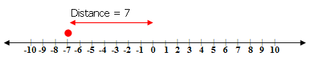

**Example B**

$$
\begin{align*}
|7-15|&=?\\
|-8|&=?
\end{align*}
$$

|-8|=8
$$

**Example C**

$$
\begin{align*}
|-9|-|-2| &= ?\\
|-9|-|-2| &= 9-2\\
|-9|-|-2| &= 7
\end{align*}
$$

**Vocabulary**

__Absolute Value__

**_Absolute value_** in the real number system is the distance from zero on the number line. It is always a positive number and is represented using the symbol $|x|$.

**Guided Practice**

1. $|-50|=?$

2. $\big |- \frac{4}{5} \big |=?$

3. $|-3|-|-4|=?$

**Answers**

1. $|-50|=?$

2. $\big | -\frac{4}{5} \big |=?$

4. 

$$
\begin{align*}
|-3|-|-4| &=?\\
|-3|-|-4| &=3-4\\
|-3|-|-4| &= -1
\end{align*}
$$

**Summary**

In this lesson you were introduced to absolute value. Absolute value in the real number system is the distance from zero on the number line. It is always a positive number and is represented using the symbol $|x|$.

**Problem Set**

**Evaluate each of the following using a number line:**

1.  $|-4.5|=?$
2.  $|-1|=?$
3.  $\big | -\frac{1}{3} \big |=?$
4.  $|4|=?$
5.  $|-2|=?$

**Evaluate each of the following:**

1.  $|-1|+|3|=?$
2.  $|5|-|-2|=?$
3.  $\big | -\frac{1}{2}\big |+ \big | - \frac{2}{3} \big |=?$
4.  $|-2.4|-|-1.6|=?$
5.  $|-3|-|-2.4|=?$

**Evaluate each of the following:**

1.  $|2-4|=?$
2.  $|5-6|=?$
3.  $\big | -\frac{1}{2} - \frac{5}{6}\big |=?$
4.  $|2.3-3.7|=?$
5.  $|7.8 - 9.4|=?$

Solving an Absolute Value Linear Equation
-----------------------------------------

**Introduction**

Recall that a linear equation relates mathematical expressions with the equal sign. Linear equations, actually, are considered to be true or false statements because there is only one solution. Remember when you did your checks? You found that the solution for the variable in the linear equation was true and therefore you did all of your algebra correct!

To solve an absolute linear equation you have to remember the same rules that you have learned and used throughout this chapter to solve linear equations with one variable. The difference now is that you are dealing with absolute value. Keep in mind that the absolute value is the positive value of $x$.

**Watch This**

[Khan Academy Absolute Value Equations](http://www.youtube.com/watch?v=jaizi_1IB5c)

!?[video](https://www.youtube.com/watch?v=jaizi_1IB5c)

**Guidance**

Solve for the variable in the expression: $|3x+1|=4$

Because $|3x+1|=4$, the expression $3x + 1$ is equal to 4 **_or_** –4.

$$
\begin{align*}
3x+1&=4\\
3x+1{\color{red}-1}&=4{\color{red}-1} && \approx\text{Subtract 1 from both sides to isolate the variable}\\
3x&=3 && \approx \text{Simplify}\\
\frac{3x}{{\color{red}3}}&=\frac{3}{{\color{red}3}} && \approx \text{Divide by 3 to solve for the variable}\\
x&=1 && \approx \text{Simplify}\\
&& OR\\
3x+1&=-4\\
3x+1{\color{red}-1}&=-4{\color{red}-1} && \approx \text{Subtract 1 from both sides to isolate the variable}\\
3x&=-5 && \approx \text{Simplify}\\
\frac{3x}{{\color{red}3}}&=\frac{-5}{{\color{red}3}} && \approx \text{Divide by 3 to solve for the variable}\\
x&=\frac{-5}{3} && \approx \text{Simplify}
\end{align*}
$$

With absolute value linear equations, there are actually two solutions! Let’s check and see if this is true.

$$
\begin{align*}
&|3x+1|=4 && |3x+1|=4\\
& \bigg |3\left({\color{red}\frac{-5}{3}}\right)+1 \bigg |=4 && |3({\color{red}1})+1|=4\\
& |-5+1|=|-4|=4 && |4|=4
\end{align*}
$$

So the linear equation has two solutions when there is an absolute function.

**Example A**

$|d+3|=2.1$

$$
\begin{align*}
d+3&=2.1\\
d+3{\color{red}-3}&=2.1{\color{red}-3} && \approx \text{Subtract 3 from both sides to isolate the variable}\\
d&=-0.9 && \approx \text{Simplify}\\
& OR\\
d+3 &=-2.1\\
d+3{\color{red}-3}&=-2.1{\color{red}-3} && \approx \text{Subtract 3 from both sides to isolate the variable}\\
d&=-5.1 && \approx \text{Simplify}
\end{align*}
$$

Solutions $= -0.9, -5.1$

**Example B**

$|2(z+4)|=|5|$

$$
\begin{align*}
2(z+4)&=5\\
2z+8&=5 && \approx \text{Remove brackets}\\
2z+8{\color{red}-8}&=5{\color{red}-8} && \approx \text{Subtract 8 from both sides to isolate the variable}\\
2z&=-3 && \approx \text{Simplify}\\
\frac{2z}{{\color{red}2}}&=\frac{-3}{{\color{red}2}} && \approx \text{Divide by 2 to solve for the variable}\\
z&=\frac{-3}{2} && \approx \text{Simplify}\\
& OR\\
2(z+4)&=-5 \\
2z+8&=-5 && \approx \text{Remove brackets}\\
2z+8{\color{red}-8}&=-5{\color{red}-8} && \approx \text{Subtract 8 from both sides to isolate the variable}\\
2z&=-13 && \approx \text{Simplify}\\
\frac{2z}{{\color{red}2}}&=\frac{-13}{{\color{red}2}} && \approx \text{Divide by 2 to solve for the variable}\\
z&=\frac{-13}{2} && \approx \text{Simplify}
\end{align*}
$$

Solutions $= \frac{-3}{2},\frac{-13}{2}$

**Example C**

$\big|\frac{1}{2}x+3\big|=\big|\frac{4}{5}\big|$

$$
\begin{align*}
\frac{1}{2}x+3&=\frac{4}{5}\\
\left({\color{red}\frac{5}{5}}\right)\frac{1}{2}x+\left({\color{red}\frac{10}{10}}\right)3&=\left({\color{red}\frac{2}{2}}\right)\frac{4}{5} && \approx \text{Multiply to get common denominator (LCD} = 10)\\
\frac{5}{10}x+\frac{30}{10}&=\frac{8}{10} && \approx \text{Simplify}\\
5x+30 &= 8 && \approx \text{Simplify}\\
5x+30{\color{red}-30}&=8{\color{red}-30} && \approx \text{Subtract 30 from both sides to isolate the variable}\\
5x&=-22 && \approx \text{Simplify}\\
\frac{5x}{{\color{red}5}}&=\frac{-22}{{\color{red}5}} && \approx \text{Divide by 5 to solve for the variable}\\
x &= \frac{-22}{5} && \approx \text{Simplify}\\
& OR \\
\frac{1}{2}x+3&=\frac{-4}{5}\\
\left({\color{red}\frac{5}{5}}\right)\frac{1}{2}x +\left({\color{red}\frac{10}{10}}\right)3&=\left({\color{red}\frac{2}{2}}\right)\frac{-4}{5} && \approx \text{Multiply to get common denominator (LCD} = 10) \\
\frac{5}{10}x+\frac{30}{10}&=\frac{-8}{10} && \approx \text{Simplify}\\
5x+30 &= -8 && \approx \text{Simplify}\\
5x+30{\color{red}-30}&=-8{\color{red}-30} && \approx \text{Subtract 30 from both sides to isolate the variable}\\
5x&=-38 && \approx \text{Simplify}\\
\frac{5x}{{\color{red}5}}&=\frac{-38}{{\color{red}5}} && \approx \text{Divide by 5 to solve for the variable}\\
x&=\frac{-38}{5} && \approx \text{Simplify}
\end{align*}
$$

Solutions $= \frac{-22}{5},\frac{-38}{5}$

**Vocabulary**

__Absolute Value__

**_Absolute value_** in the real number system is the distance from zero on the number line. It is always a positive number and is represented using the symbol $|x|$.

__Linear Equation__

A **_linear equation_** relates mathematical expressions with the equal sign. Linear equations, actually, are considered to be true or false statements because there is only one solution.

**Guided Practice**

1. $|4a-2|=3$

2. $|2b-8|-3=4$

3. $\big|\frac{1}{2}c-5\big|=3$

**Answers**

1. $|4a-2|=3$

$$
\begin{align*}
4a-2&=3\\
4a-2{\color{red}+2}&=3{\color{red}+2} && \approx \text{Add 2 to both sides to isolate the variable}\\
4a&=5 && \approx \text{Simplify}\\
\frac{4a}{{\color{red}4}}&=\frac{5}{{\color{red}4}} && \approx \text{Divide by 4 to solve for the variable}\\
a &= \frac{5}{4}\\
& OR\\
4a-2&=-3\\
4a-2{\color{red}+2}&=-3{\color{red}+2} && \approx \text{Add 2 to both sides to isolate the variable}\\
4a&=-1 && \approx \text{Simplify}\\
\frac{4a}{{\color{red}4}}&=\frac{-1}{{\color{red}4}} && \approx \text{Divide by 4 to solve for the variable}\\
a&=\frac{-1}{4}
\end{align*}
$$

Solutions $= \frac{5}{4},\frac{-1}{4}$

2. $|2b-8|-3=4$

First, we need to simplify so that the absolute value is alone on the left side.

$$
\begin{align*}
|2b-8|-3&=4\\
|2b-8|&=7 && \approx \text{Combine constant terms on right side of equal sign}\\
\end{align*}
$$

Now we can solve as before.

$$
\begin{align*}
2b-8=7\\
2b-8{\color{red}+8}&=7{\color{red}+8} && \approx \text{Add 8 to both sides to isolate the variable}\\
2b&=15 && \approx \text{Simplify}\\
\frac{2b}{{\color{red}2}}&=\frac{15}{{\color{red}2}} && \approx \text{Divide by 2 to solve for the variable}\\
b &= \frac{15}{2}\\
& OR\\
2b-8 &=-7\\
2b-8{\color{red}+8}&=-7{\color{red}+8} && \approx \text{Add 8 to both sides to isolate the variable}\\
2b&=1 && \approx \text{Simplify}\\
\frac{2b}{{\color{red}2}}&=\frac{1}{{\color{red}2}} && \approx \text{Divide by 2 to solve for the variable}\\
b&=\frac{1}{2}
\end{align*}
$$

Solutions $= \frac{15}{2},\frac{1}{2}$

3. $\big| \frac{1}{2}c-5\big|=3$

$$
\begin{align*}
\frac{1}{2}c-5 &= 3\\
\frac{1}{2}c-\left({\color{red}\frac{2}{2}}\right)5&=\left({\color{red}\frac{2}{2}}\right)3 && \approx \text{Multiply to get common denominator. (LCD} = 2)\\
\frac{c}{2}-\frac{10}{2}&=\frac{6}{2} && \approx \text{Simplify}\\
c-10 &=6 && \approx \text{Simplify}\\
c-10{\color{red}+10}&=6{\color{red}+10} && \approx \text{Add 10 to both sides to isolate the variable}\\
c &= 16\\
& OR\\
\frac{1}{2}c-5&=-3\\
\frac{1}{2}c-\left({\color{red}\frac{2}{2}}\right)5&=\left({\color{red}\frac{2}{2}}\right)(-3) && \approx \text{Multiply to get common denominator. (LCD} = 2)\\
\frac{c}{2}-\frac{10}{2}&=\frac{-6}{2} && \approx \text{Simplify}\\
c-10&=-6 && \approx \text{Simplify} \\
c-10{\color{red}+10}&=-6{\color{red}+10} && \approx \text{Add 10 to both sides to isolate the variable}\\
c&=4
\end{align*}
$$

Solutions $= 16, 4$

**Summary**

Linear equations in one variable have the form $ax + b = c$, where $a \ne 0$. If you add absolute value to linear equations, the general form of the equation becomes $|ax+b|=c$. The rules for solving linear equations involving absolute values are the same as solving linear equations without absolute values. There is one distinct difference though.

With absolute value equations, there are two solutions. In other words, in order to solve for $x$, you need to do two calculations, namely:

$$
ax+b=c \ and \ ax+b=-c
$$

It is also important to note that $c$ must be greater than or equal to 0. In other words, $c \ge 0$. If $c$ is negative, there is no solution. Think about it. Look at the statement below.

$$
|x|=-1
$$

The absolute value of $x$ can never be equal to a negative number. Therefore if an absolute value equation is equal to a negative number, there is no solution.

**Problem Set**

**Find the solutions for the variable in each of the following absolute value linear equations.**

1.  $|t+2|=4$
2.  $|r-2|=7$
3.  $|5-k|=6$
4.  $|6-y|=12$
5.  $-6=|1-b|$

**Find the solutions for the variable in each of the following absolute value linear equations.**

1.  $\big|\frac{1}{5}x-3\big|=1$
2.  $\big|\frac{1}{2}(r-3)\big|=2$
3.  $\big|\frac{1}{3}(f+1)\big|=5$
4.  $|3d-11|=-2$
5.  $|5w+9|-6=68$

**Find the solutions for the variable in each of the following absolute value linear equations.**

1.  $|5(2t+5)+3(t-1)|=-3$
2.  $|2.24x-24.63|=2.25$
3.  $|6(5j-3)+2|=14$
4.  $|7g-8(g+3)|=1$
5.  $|e+4(e+3)|=17$

Solving an Absolute Value Inequality
------------------------------------

**Introduction**

You have learned that a linear inequality is of the form $ax + b > c, ax + b < c, ax + b \ge c$, or $ax + b \le c$. Linear inequalities, unlike linear equations, have more than one solution. They have a solution set. For example, if you look at the linear inequality $x + 3 > 5$. You know that $2 + 3$ is equal to 5, therefore the solution set could be any number greater than 2.

You have just learned that when solving absolute value linear equations, you have to solve for the two related equations. Remember that for $|ax+b|=c$, you had to solve for $ax+b=c$ and $ax+b=-c$. The same is true for linear inequalities. If you have an absolute value linear inequality, you would need to solve for the two related linear inequalities.

The table below shows the four types of absolute value linear inequalities and the two related inequality expressions required to be solved for each one.

| **Absolute Value Inequality** | $\|ax+b\|>c$ | $\|ax+b\|<c$ | $\|ax+b\|\ge c$ | $\|ax+b\|\le c$ |
| --- | --- | --- | --- | --- |
| Equation 1 | $ax+b>c$ | $ax+b<c$ | $ax+b \ge c$ | $ax+b \le c$ |
| Equation 2 | $ax+b<-c$ | $ax+b>-c$ | $ax+b \le -c$ | $ax+b \ge -c$ |

Remember the rules to algebraically solve for the variable remain the same as you have used throughout the chapter.

**Watch This**

[Khan Academy Absolute Value Inequalities](http://www.youtube.com/watch?v=x5EJG_rAtkY)

!?[video](https://www.youtube.com/watch?v=x5EJG_rAtkY)

**Guidance**

A ball is fired from the cannon during the Independence Day celebrations. It is fired directly into the air with an initial velocity of 150 ft/sec. The speed of the cannon ball can be calculated using the formula $s =|-32t+150|$, where $s$ is the speed measure in ft/sec and $t$ is the time in seconds. Calculate the times when the speed is less than 86 ft/sec.

$86 > |-32t+150|$

$$
\begin{align*}
86 & > -32t+150\\
86 {\color{red}-150} &> -32t+150{\color{red}-150} && \approx \text{Subtract 150 from sides to isolate the variable}\\
-64 & > -32t && \approx \text{Simplify}\\
\frac{-64}{{\color{red}-32}} & < \frac{-32t}{{\color{red}-32}} && \approx \text{Divide by -32 to solve for the variable. Remember when}\\
& && \quad \ \text{dividing by a negative number to reverse the sign of the inequality.}\\
t &> 2\\
& OR\\
-86 & < -32t+150\\
-86 {\color{red}-150} & < -32t+150{\color{red}-150} && \approx \text{Subtract 150 from sides to isolate the variable}\\
-236 & < -32t && \approx \text{Simplify}\\
\frac{-236}{{\color{red}-32}} & > \frac{-32t}{{\color{red}-32}} && \approx \text{Divide by -32 to solve for the variable. Remember when}\\
& && \quad \ \text{dividing by a negative number to reverse the sign of the inequality.}\\
t &< 7.4
\end{align*}
$$

Therefore when $t >2$ and $t <7.4$, the speed is greater than 86 ft/sec.

**Example A**

Solve for the absolute value inequality $|g+5|<3$.

$|g+5|<3$

$$
\begin{align*}
g+5 &< 3\\
g+5{\color{red}-5} &< 3{\color{red}-5} && \approx \text{Subtract 5 from both sides to isolate the variable}\\
g &< -2\\
& OR\\
g+5 &>-3\\
g+5{\color{red}-5} &> -3{\color{red}-5} && \approx \text{Subtract 5 from both sides to isolate the variable}\\
g &> -8
\end{align*}
$$

Solutions $g <-2$ and $g>-8$.

**Example B**

Solve for the absolute value inequality $\big|j-\frac{1}{2}\big|>2$.

$\big|j-\frac{1}{2}\big|>2$

$$
\begin{align*}
j-\frac{1}{2} &>2\\
\left({\color{red}\frac{2}{2}}\right)j-\frac{1}{2} & > \left({\color{red}\frac{2}{2}}\right)2 && \approx \text{Multiply to get a common denominator (LCD} = 2)\\
\frac{2j}{2}-\frac{1}{2} & > \frac{4}{2} && \approx \text{Simplify}\\
2j-1 &> 4 && \approx \text{Simplify}\\
2j-1{\color{red}+1} &>4 {\color{red}+1} && \approx \text{Add 1 to both sides to isolate the variable}\\
2j &> 5 && \approx \text{Simplify}\\
\frac{2j}{{\color{red}2}}&>\frac{5}{{\color{red}2}} && \approx \text{Divide by 2 to solve for the variable.}\\
j &>\frac{5}{2}\\
& OR\\
j-\frac{1}{2} &<-2\\
\left({\color{red}\frac{2}{2}}\right)j-\frac{1}{2} &<\left({\color{red}\frac{2}{2}}\right)(-2) && \approx \text{Multiply to get a common denominator (LCD} = 2)\\
\frac{2j}{2}-\frac{1}{2} &< \frac{-4}{2} && \approx \text{Simplify}\\
2j-1 &< -4 && \approx \text{Simplify}\\
2j-1{\color{red}+1} &<-4{\color{red}+1} && \approx \text{Add 1 to both sides to isolate the variable}\\
2j &< -3 && \approx \text{Simplify}\\
\frac{2j}{{\color{red}2}}&<\frac{-3}{{\color{red}2}} && \approx \text{Divide by 2 to solve for the variable.}\\
j &<\frac{-3}{2}
\end{align*}
$$

Solutions $j > \frac{5}{2}$ and $j < \frac{-3}{2}$.

**Example C**

Solve for the absolute value inequality $|t+1|-3 \ge 2$.

First we need to get the absolute value alone on the left side of the equation.

$$
\begin{align*}
|t+1|-3 & \ge 2\\
|t+1| & \ge 5 && \approx \text{Combine constant terms on right side of inequality sign}\\
\end{align*}
$$

Now we can solve as usual.

$$
\begin{align*}
t+1 \ge 5\\
t+1{\color{red}-1} & \ge 5 {\color{red}-1} && \approx \text{Subtract 1 from both sides to isolate and solve for the variable}\\
t \ge 4\\
& OR\\
t+1 & \le -5\\
t+1{\color{red}-1} & \le -5 {\color{red}-1} && \approx \text{Subtract 1 from both sides to isolate and solve for the variable}\\
t & \le -6
\end{align*}
$$

Solutions $t \ge 4$ or $t \le -6$.

**Vocabulary**

__Absolute Value Linear Inequality__

**_Absolute Value Linear inequalities_** can have one of four forms: $|ax + b| > c, |ax + b| < c, |ax + b| \ge c$, or $|ax + b| \le c$. Absolute value linear inequalities have two related inequalities. For example for $|ax+b|>c$, the two related inequalities are $ax + b > c$ and $ax + b < -c$.

__Linear Inequality__

Linear inequalities can have one of four forms: $ax + b > c, ax + b < c, ax + b \ge c$, or $ax + b \le c$. In other words, the left side no longer equals the right side, it is less than, greater than, less than or equal to, or greater than or equal to.

**Guided Practice**

1. Solve for the solution set to the inequality $|x-1| \ge 9$.

2. Solve for the solution set to the inequality $|-2w+7|<23$.

3. Solve for the solution set to the inequality $|-4+2b|+3 \le 21$.

**Answers**

1. $|x-1|  \ge 9$

$$
\begin{align*}
x-1 & \ge 9\\
x-1{\color{red}+1} & \ge 9{\color{red}+1} && (\approx \text{Add 1 to both sides to isolate and solve for the variable})\\
x & \ge 10\\
& OR\\
x-1 & \le -9\\
x-1{\color{red}+1} & \le -9{\color{red}+1} && (\approx \text{Add 1 to both sides to isolate and solve for the variable})\\
x & \le -8
\end{align*}
$$

Therefore solution set is $x \ge 10,x \le -8$.

2. $|-2w+7| < 23$

$$
\begin{align*}
-2w+7 &< 23\\
-2w+7{\color{red}-7} &< 23{\color{red}-7} && (\approx \text{Subtract 7 from both sides to get variables on same side})\\
-2w &< 16 && (\approx \text{Simplify})\\
\frac{-2w}{{\color{red}-2}} &> \frac{16}{{\color{red}-2}} &&(\approx \text{Divide by -2 to solve for the variable, reverse sign of inequality})\\
w &> -8\\
& OR \\
-2w+7 &> -23\\
-2w+7{\color{red}-7} &> -23{\color{red}-7} && (\approx \text{Subtract 7 from both sides to get variables on same side})\\
-2w &> -30 && (\approx \text{Simplify})\\
\frac{-2w}{{\color{red}-2}} &< \frac{-30}{{\color{red}-2}} &&(\approx \text{Divide by -2 to solve for the variable, reverse sign of inequality})\\
w &<15
\end{align*}
$$

Therefore solution set is $w >-8,w<15$.

3. $|-4+2b|+3 \le 21$

First we need to get the absolute value alone on the left side of the equation.

$$
\begin{align*}
|-4+2b|+3 &\le 21\\
2b-4 & \le 18 && (\approx \text{Combine constant terms on right side of inequality sign})\\
\end{align*}
$$

Now we can solve as usual.

$$
\begin{align*}
2b-4 & \le 18 \\
2b-4{\color{red}+4} & \le 18{\color{red}+4} && (\approx \text{Add 4 to both sides to isolate the variable})\\
2b & \le  22 && (\approx \text{Simplify})\\
\frac{2b}{{\color{red}2}} &\le \frac{22}{{\color{red}2}} && (\approx \text{Divide both sides by 2 to solve for the variable})\\
b & \le 11\\
& OR\\
-4+2b & \ge -18\\
2b-4{\color{red}+4} & \ge -18{\color{red}+4} && (\approx \text{Add 4 to both sides to isolate the variable})\\
2b & \ge  -14 && (\approx \text{Simplify})\\
\frac{2b}{{\color{red}2}} &\ge \frac{-14}{{\color{red}2}} && (\approx \text{Divide both sides by 2 to solve for the variable})\\
b & \ge -7
\end{align*}
$$

Therefore solution set is $b \le 11,b \ge -7$.

**Summary**

In this lesson you solved absolute value linear inequalities. You found that you solved the linear inequalities using the same rules as you learned in previous lessons. The difference between solving linear inequalities and solving absolute value linear inequalities is that for the absolute value linear inequalities you must solve for the two related inequalities.

If you recall the table from the beginning of this lesson, you remember the absolute value linear inequalities and their related inequalities. So, for example, if you had the absolute value linear inequality $|ax+b| \ge c$, you would need to solve for both $ax+b \ge c$ and $ax+b \le -c$ to find the solution set.

It is also important to remember, as you found with absolute value linear equations, that if $c < 0$, there is no solution. If you think about it with an example it may seem clearer. Look at the example $|x + 3| < -5$. As you found in the previous lesson, there is no absolute value of $x + 3$ that will give you a negative number as an answer.

**Problem Set**

**Find the solution sets for the variable in each of the following absolute value linear inequalities.**

1.  $|p-16|>10$
2.  $|r+2|<5$
3.  $|3-2k|\le -1$
4.  $|8-y|>5$
5.  $8 \ge |5d-2|$

**Find the solution sets for the variable in each of the following absolute value linear inequalities.**

1.  $|s+2|-5>8$
2.  $|10+8w|-2<16$
3.  $|2q+1|-5 \le 7$
4.  $\big |\frac{1}{3}(g-2) \big |<4$
5.  $|-2(e+4)|>17$

**Find the solution sets for the variable in each of the following absolute value linear inequalities.**

1.  $|-5x-3(2x-1)|>3$
2.  $|2(a-1.2)|\ge 5.6$
3.  $|-2(r+3.1)| \le -1.4$
4.  $\big|\frac{3}{4}(m-3)\big| \le 8$
5.  $\big|-2\left(e-\frac{3}{4}\right)\big| \ge 3$

Graphing the Solution of an Absolute Value Inequality on a Real Number Line
---------------------------------------------------------------------------

**Introduction**

In this last lesson of Chapter - **Can You Make It True?**, you will learn to graph the solution of an absolute value inequality on a number line. In a previous lesson, you graphed linear inequalities on number lines. An example can be seen below.

For $x > 5$, the graph can be shown as:

What do you think would happen with absolute value linear inequalities? As you learned in the previous lesson, with absolute value linear inequalities, there are two solution sets. Therefore there would be two sections of the number line showing solutions.

For $|t|>5$, you would actually solve for $t > 5$ and $t <-5$. If you were to graph this solution on a number line it would look like the following:

[Khan Academy Absolute Value Inequalities on a Number Line](http://www.youtube.com/watch?v=TvUCe6Bomy4)

!?[video](https://www.youtube.com/watch?v=TvUCe6Bomy4)

**Guidance**

Solve the following inequality and graph the solution on a number line.

$|x+2|\le 3$

First solve the inequality:

$$
\begin{align*}
x+2 &\le 3\\
x+2{\color{red}-2} &\le 3{\color{red}-2} && \approx \text{Subtract 2 from both sides to isolate the variable}\\
x &\le 1 && \approx \text{Simplify}\\
& OR\\
x+2 &\ge -3\\
x+2{\color{red}-2} &\ge -3{\color{red}-2} && \approx \text{Subtract 2 from both sides to isolate the variable}\\
x &\ge -5 && \approx \text{Simplify}
\end{align*}
$$

The solution sets are $x \le 1,x \ge -5$.

Representing on a number line

Represent the solution set to the following inequality on a number line.

$$
\begin{align*}
|2x| &\ge 6\\
2x & \ge 6\\
\frac{2x}{{\color{red}2}} & \ge \frac{6}{{\color{red}2}} && (\approx \text{Divide by 2 to isolate and solve for the variable})\\
x & \ge 3 && (\approx \text{Simplify})\\
& OR\\
2x & \le -6\\
\frac{2x}{{\color{red}2}} & \le \frac{-6}{{\color{red}2}} && (\approx \text{Divide by 2 to isolate and solve for the variable})\\
x & \le -3 && (\approx \text{Simplify})
\end{align*}
$$

The solution sets are $x \ge 3, x \le -3$.

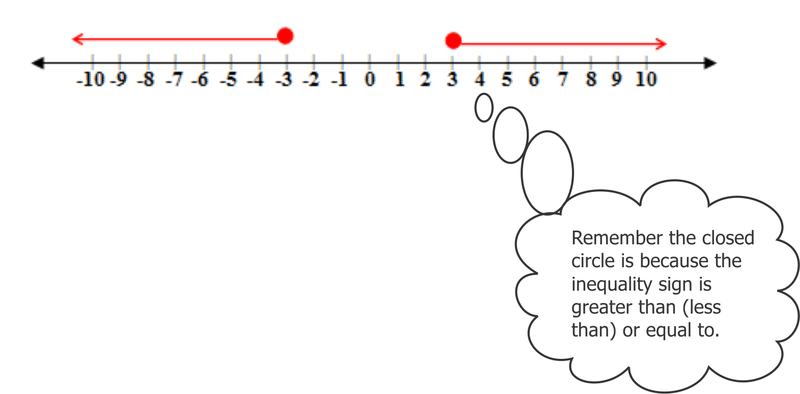

Solve the following inequality and graph the solution on a number line.

$$
\begin{align*}
|x+1| &> 3 \\
x+1 &>3\\
x+1{\color{red}-1} &> 3{\color{red}-1} && (\approx \text{Subtract 1 from both sides of the inequality sign})\\
x & > 2\\
& OR\\
x+1 &< -3\\
x+1{\color{red}-1} &< -3{\color{red}-1} && (\approx \text{Subtract 1 from both sides of the inequality sign})\\
x & < -4
\end{align*}
$$

The solution sets are $x>2,x<-4$.

Solve the following inequality and graph the solution on a number line.

$$
\begin{align*}
\bigg |x-\frac{5}{2} \bigg | &< 1\\
x-\frac{5}{2} &< 1\\
\left({\color{red}\frac{2}{2}}\right)x-\frac{5}{2} &< \left(\frac{{\color{red}2}}{{\color{red}2}}\right)1\\
\frac{2x}{2}-\frac{5}{2}&<\frac{2}{2}\\
2x-5&<2 && (\approx \text{Simplify})\\
2x-5{\color{red}+5} &< 2{\color{red}+5} && (\approx \text{Add 5 to isolate the variable})\\
2x &< 7&& (\approx \text{Simplify})\\
\frac{2x}{{\color{red}2}} &< \frac{7}{{\color{red}2}}\\
x &< \frac{7}{2}\\
& OR\\
x-\frac{5}{2} &> -1\\
\left({\color{red}\frac{2}{2}}\right)x-\frac{5}{2} &> \left(\frac{{\color{red}2}}{{\color{red}2}}\right)(-1) && (\approx \text{Multiply to get common denominator (LCD} = 2))\\
\frac{2x}{2}-\frac{5}{2}&<\frac{-2}{2}&& (\approx \text{Simplify})\\
2x-5&>-2 && (\approx \text{Simplify})\\
2x-5{\color{red}+5} &> -2{\color{red}+5} && (\approx \text{Add 5 to isolate the variable})\\
2x &> 3&& (\approx \text{Simplify})\\
\frac{2x}{{\color{red}2}} &> \frac{3}{{\color{red}2}} && (\approx \text{Divide both sides by 2 to solve for the variable})\\
x &> \frac{3}{2}
\end{align*}
$$

The solution sets are $x<\frac{7}{2}, x >\frac{3}{2}$.

__Absolute Value Linear Inequality__

**_Absolute Value Linear inequalities_** can have one of four forms: $|ax + b| > c, |ax + b| < c, |ax + b| \ge c$, or $|ax + b| \le c$. Absolute value linear inequalities have two related inequalities. For example for $|ax+b|>c$, the two related inequalities are $ax + b > c$ and $ax + b < -c$.

__Number Line__

A **_number line_** is a line that matches a set of points and a set of numbers one to one.

It is often used in mathematics to show mathematical computations.

1. Represent the solution set to the inequality $|2x+3|>5$ on a number line.

2. Represent the solution set to the inequality $|32x-16| \ge 32$ on a number line.

3. Represent the solution set to the inequality $|x-21.5|>12.5$ on a number line.

**Answers**

1. $|2x+3| >5$

$$
\begin{align*}
2x+3&>5\\
2x+3{\color{red}-3}&>5{\color{red}-3} && (\approx \text{Subtract 3 from both sides of the inequality sign})\\
2x &> 2 && (\approx \text{Simplify})\\
\frac{2x}{{\color{red}2}}&>\frac{2}{{\color{red}2}} && (\approx \text{Divide by 2 to solve for the variable})\\
x &>1\\
& OR\\
2x+3&<-5\\
2x+3{\color{red}-3}&<-5{\color{red}-3} && (\approx \text{Subtract 3 from both sides of the inequality sign})\\
2x &< -8 && (\approx \text{Simplify})\\
\frac{2x}{{\color{red}2}}&<\frac{-8}{{\color{red}2}} && (\approx \text{Divide by 2 to solve for the variable})\\
x &<-4
\end{align*}
$$

The solution sets are $x>1$ and $x<-4$.

$$
\begin{align*}
32x-16 &\ge 32\\
32x-16{\color{red}+16}&\ge 32{\color{red}+16} && (\approx\text{Add 16 to both sides of the inequality sign})\\
32x &\ge 48&& (\approx\text{Simplify})\\
\frac{32x}{{\color{red}32}} &\ge \frac{48}{{\color{red}32}}&& (\approx \text{Divide by 32 to solve for the variable})\\
x &\ge \frac{3}{2}\\
& OR \\
32x-16 &\le -32\\
32x-16{\color{red}+16}&\le -32{\color{red}+16} && (\approx\text{Add 16 to both sides of the inequality sign})\\
32x &\le -16&& (\approx\text{Simplify})\\
\frac{32x}{{\color{red}32}} &\le \frac{-16}{{\color{red}32}}&& (\approx \text{Divide by 32 to solve for the variable})\\
x &\le -\frac{1}{2}
\end{align*}
$$

The solution sets are $x \ge \frac{3}{2}, x \le -\frac{1}{2}$.

$$
\begin{align*}
x-21.5 &> 12.5\\
x-21.5{\color{red}+21.5}&>12.5{\color{red}+21.5} && (\approx \text{Add 21.5 to both sides to isolate the variable})\\
x &>34 &&(\approx \text{Simplify})\\
& OR\\
x-21.5 &< -12.5\\
x-21.5{\color{red}+21.5}&<-12.5{\color{red}+21.5} && (\approx \text{Add 21.5 to both sides to isolate the variable})\\
x &<9 &&(\approx \text{Simplify})
\end{align*}
$$

The solution sets are $x<9,x>34$.

Graphing the solution set to an absolute value linear inequality gives you the same visual representation as you had when graphing the solution set to linear inequalities. The same rules apply when graphing absolute values of linear inequalities on a real number line. In other words, once the solution is found, the open circle is used for absolute value inequalities containing the symbols > and <. The closed circle is used for absolute value inequalities containing the symbols $\le$ and $\ge$.

**Problem Set**

1.  Represent the solution sets to the absolute value inequality $|3-2x|<3$ on a number line.
2.  Represent the solution sets to the absolute value inequality $2\big|\frac{2x}{3}+1\big|\ge 4$ on a number line.
3.  Represent the solution sets to the absolute value inequality $\big|\frac{2g-9}{4}\big|<1$ on a number line.
4.  Represent the solution sets to the absolute value inequality $\big|\frac{4}{3}x-5\big|\ge 7$ on a number line.
5.  Represent the solution sets to the absolute value inequality $|2x+5|-4 \ge 1$ on a number line.

Summary
-------

Throughout this chapter you have been learning about solving linear equations with one variable and solving linear inequalities with one variable. You have learned that whether you have decimals, fractions, brackets, or variables on both sides, the rules stay basically the same for all of these expressions. In other words, the key is to isolate the variable and solve for it. You do this by making sure that whatever you do to one side of the equation you do to the other.

In this final lesson of Chapter 2, you were introduced to absolute value expressions. Absolute value expressions always have a positive value. In fact, if the absolute value linear equation is equal to a negative number or the absolute value linear inequality is less than or less than or equal to a negative number, then the linear equation or inequality simply has no solution.

In solving absolute value expressions, for both linear equations and linear inequalities, the rules remain the same with one addition. Because you are dealing with the absolute function, you have to solve for the two related expressions when solving a linear equation or inequality.

In the final section of the lesson and chapter, you had the opportunity to solve absolute value linear inequalities and then graph them on a number line. This combines the concepts learned in the previous lesson and those from this lesson as you complete this chapter. Remember that the same rules apply. The open circle indicates the > and < symbol is used in the solution set. The closed circle indicates that the $\le$ and $\ge$ symbols are used in the solution set.

</article>

### 2.8 Chapter Test

<article>

1.  Which of the following is the solution to this linear equation? $12f-2(f+1)=8f+22$
    1.  12
    2.  16
    3.  24
    4.  30
2.  Which of the following is the solution to this linear equation? $0.2(1-3y)=-(y-5)$
    1.  6
    2.  7
    3.  12
    4.  14
3.  Which of the following is the solution to this linear equation? $\frac{(7t+5)}{t}=\frac{26}{3}$?
    1.  3
    2.  6
    3.  9
    4.  12
4.  A rectangle has an area of forty-one square inches with one side equal to five inches. The other side has a length of four more than twice a number. What is that number?
    1.  5.0
    2.  4.3
    3.  3.4
    4.  2.1
5.  Three consecutive numbers add up to 81. What is the largest number?
    1.  26
    2.  27
    3.  28
    4.  81
6.  Which is the solution set when four is added to two times a number and is found to be less than or equal to eight less than six times a number?
    1.  $t \ge 3$
    2.  $t \le 4$
    3.  $t \ge 0$
    4.  $t \ge -0$
7.  Which number line best suits the linear inequality shown below? $4(2-d) \ge 20$
    1.  
        
        \[Figure 1\]
        
    2.  
        
        \[Figure 2\]
        
    3.  
        
        \[Figure 3\]
        
    4.  
        
        \[Figure 4\]
        
8.  Which of the following is the solution to the linear inequality? $16(s-1)+32 > 8(s+2)+4(s+1)$
    1.  $s < 1$
    2.  $s  > 1$
    3.  $s < -1$
    4.  $s > -1$
9.  Which of the following is a solution to the absolute value linear function? $2|-2r-2|-3=13$
    1.  5
    2.  –3
    3.  3
    4.  0
10. Which of the following is the solution to the absolute value linear inequality? $\frac{|g-4|}{3} \ge 2$
    1.  $g \ge -10, \ or \ g \le 2$
    2.  $g \ge 10, \ or \ g \le -2$
    3.  $g \le -10, \ or \ g \ge 2$
    4.  $g \le 10, \ or \ g \ge -2$

</article>

## 3.0 A Picture is Worth a Thousand Words

<article>

**Introduction**

In this chapter you will learn about linear functions. You will learn what is meant by a function, function notation and how to identify a function from a graph. You will also learn how to graph a linear function by creating a table of values and by plotting the $x$ and $y-$intercepts. In addition, you will learn about the domain and the range of functions, what these terms mean, what proper notation is, and how to determine these from a graph.

The chapter will continue with graphing a quadratic function of the form $y = x^2$. In this section, you will learn that a parabola has a vertex, an axis of symmetry, a domain and a range. You will also learn that a parabola can undergo transformations that will affect the vertex, the $y-$values, the direction of the opening and its range. These transformations will be presented in the function as it is written in transformational form. At the end of the chapter, you will learn how to use these transformations to graph the function.

**Lessons**

In this chapter you will do the following lessons:

* Relation vs Function
* A Function
* Cartesian Graphs
* Graphing a linear function
* Domain and Range
* Graphing the Quadratic Function $y=x^2$
* Transformations of $y=x^2$
* Transformational form of $y=x^2$

</article>

### 3.1 Relations vs Functions

<article>

Is There a Difference Between a Relation and a Function?
--------------------------------------------------------

**Objectives**

The lesson objective for Relations vs Functions is:

* Is there a difference between a relation and a function?

**Introduction**

In this introductory concept for chapter **A Picture is Worth a Thousand Words**, you will be introduced to two new terms, a relation and a function. It is important for you to keep these two terms clear in your mind. If you think of the relationship between two quantities, you can think of this relationship in terms of an input/output machine.

$$
\begin{align*}
& x \qquad 5  \qquad \ 10 \qquad 15 \qquad 10 \qquad \ 5 \qquad \ 0\\
& y  \qquad 12 \qquad 25 \qquad 37 \qquad 55 \qquad 72 \qquad 0
\end{align*}
$$

If you look at this table, there are two places where you see the more than one output for a single input.

**Watch This**

[Khan Academy Functions as Graphs](http://www.youtube.com/watch?v=jQ-fS2lsslU)

**Guidance**

It is often said that all functions are relations but not all relations are functions. How can this be true?

A relation is any set of ordered pairs. A function is a set of ordered pairs where there is only one value of $y$ for every value of $x$.

If you look at a set of ordered pairs (relation) and there is only one value of $y$ for every $x$, the relation is a function. Since a function is a set of ordered pairs where there is only one value of $y$ for every value of $x$, a relation can always be a function when there is only one value of $y$ for every $x$.

On the other hand if the relation shows that there is more than one output $(y)$ for an input $(x)$, the relation is not a function. The second part of the statement is then true. All relations are not functions.

Look at the two tables below. The first **table** [below](#x-ck12-dGFibGU6aXNhZnVuY3Rpb24.) shows a relation that is a function. The second **table** [below](#x-ck12-dGFibGU6bm90YWZ1bmN0aW9u) shows a relation that is not a function.

|     |     |
| --- | --- |A relation that is a function
| $x$ | $y$ |
| --- | --- |
| 0   | 0   |
| 1   | 1   |
| 2   | 2   |
| 3   | 3   |

|     |     |
| --- | --- |A relation that is not a function
| $x$ | $y$ |
| --- | --- |
| 0   | 0   |
| 1   | 1   |
| 2   | 2   |
| 2   | 1   |

**Example A**

Determine if the following relation is a function.

| $x$ | $y$ |
| --- | --- |
| $-3.5$ | $-3.6$ |
| $-1$ | $-1$ |
| 4   | 3.6 |
| 7.8 | 7.2 |

The relation is a function because there is only one value of $y$ for every value of $x$.

**Example B**

Which one of the following graphs represents a function?

")

\[Figure 4\]

")

\[Figure 6\]

In order to answer this question, you need to know about the Vertical Line Test. The Vertical Line Test is a test for functions. If you take your pencil and draw a straight line through any part of the graph, and the pencil hits the graph more than once, the graph is not a function. Therefore, a graph will represent a function if the vertical line test passes. In other words, no vertical line intersects the graph more than once.

Let’s look at the first graph. Draw a vertical line through the graph.

, the graph **_does not_** represent a function.")

, the graph **_does_** represent a function.")

, the graph **_does_** represent a function.")

, the graph **_does not_** represent a function.")

**Example C**

Which one of the following represents a function?

")

\[Figure 12\]

**Vocabulary**

__Function__

A **_function_** is a set of ordered pairs $(x, y)$ that shows a relationship where there is only one output for every input. In other words, for every value of $x$, there is only one value for $y$.

__Relation__

A **_relation_** is any set of ordered pairs $(x, y)$. A relation has more than one output for at least one input.

__Vertical Line Test__

The **_Vertical Line Test_** is a test for functions. If you take your pencil and draw a straight line through any part of the graph, and the pencil hits the graph more than once, the graph is not a function. Therefore, a graph will represent a function if the vertical line test passes, In other words, no vertical line intersects the graph more than once.

**Guided Practice**

1. Is the following a representation of a function? Explain.

$s = \{(1, 2), (2, 2), (3, 2), (4, 2)\}$

2. Which of the following relations represent a function? Explain.

")

\[Figure 14\]

3. Which of the following relations represent a function? Explain.

a) 

$$
\begin{align*}
& x \qquad 2 \qquad 4 \qquad \ 6 \qquad \ 8 \qquad \ 10 \qquad 12\\
& y  \qquad 3 \qquad 7 \qquad 11 \qquad 15 \qquad 19 \qquad 23
\end{align*}
$$

b)  ")

\[Figure 16\]

d) 

1. $s=\{(1,2),(2,2),(3,2),(4,2)\}$

This is a function because there is one output for every input. In other words, if you think of these points as coordinate points $(x, y)$, there is only one value for $y$ given for every value of $x$.

2. a) , the graph **_does not_** represent a function.")

b) , the graph **_does_** represent a function.")

3. a) 

$$
\begin{align*}
& x \qquad 2 \qquad 4 \qquad \ 6 \qquad \ 8 \qquad \ 10 \qquad 12\\
& y  \qquad 3 \qquad 7 \qquad 11 \qquad 15 \qquad 19 \qquad 23
\end{align*}
$$

This **_is a function_** because there is only one output for a given input.

b) ")

c) , the graph **_does not_** represent a function.")

d) , the graph **_does_** represent a function.")

**Summary**

Knowing the difference between a relation and a function is an important step in learning about linear and non-linear equations. A function is a relationship between quantities where there is one output for every input. If you have more than one output for a particular input, then the quantities represent a relation. A graph of a relationship can be shown to be a function using the vertical line test. If the vertical line can be drawn through the graph such that it intersects the graph line more than once, the graph is not function but a relation.

**Problem Set**

**Determine whether each of the following is a relation or a function. Explain your reasoning.**

1.  
    
    \[Figure 23\]
    
2.  
    
    \[Figure 24\]
    
3.  
    
    \[Figure 25\]
    
4.  
    
    \[Figure 26\]
    
5.  
    
    \[Figure 27\]
    

**Which of the following relations represent a function? Explain.**

1.  .

____$$
\begin{align*}
& X \qquad 2 \qquad \quad 3 \qquad 2 \qquad \quad \ 5\\
& Y \qquad 3 \qquad -1 \qquad 5 \qquad -4
\end{align*}
$$__

$$
\begin{align*}
& X \qquad 2 \qquad \quad 3 \qquad 2 \qquad \quad \ 5\\
& Y \qquad 3 \qquad -1 \qquad 5 \qquad -4
\end{align*}
$$__

__$$
\begin{align*}
& X \qquad 2 \qquad \quad 3 \qquad 2 \qquad \quad \ 5\\
& Y \qquad 3 \qquad -1 \qquad 5 \qquad -4
\end{align*}
$$__

$$
\begin{align*}
& X \qquad 2 \qquad \quad 3 \qquad 2 \qquad \quad \ 5\\
& Y \qquad 3 \qquad -1 \qquad 5 \qquad -4
\end{align*}
$$

2.  .

____$$
\begin{align*}
& X \qquad 4 \qquad 2 \qquad \quad 6 \qquad -1\\
& Y \qquad 2 \qquad 4 \qquad -3 \qquad \quad 5
\end{align*}
$$__

$$
\begin{align*}
& X \qquad 4 \qquad 2 \qquad \quad 6 \qquad -1\\
& Y \qquad 2 \qquad 4 \qquad -3 \qquad \quad 5
\end{align*}
$$__

__$$
\begin{align*}
& X \qquad 4 \qquad 2 \qquad \quad 6 \qquad -1\\
& Y \qquad 2 \qquad 4 \qquad -3 \qquad \quad 5
\end{align*}
$$__

$$
\begin{align*}
& X \qquad 4 \qquad 2 \qquad \quad 6 \qquad -1\\
& Y \qquad 2 \qquad 4 \qquad -3 \qquad \quad 5
\end{align*}
$$

3.  .

____$$
\begin{align*}
& X \qquad 1 \qquad 2 \qquad 3 \qquad 4\\
& Y \qquad 5 \qquad 8 \qquad 5 \qquad 8
\end{align*}
$$__

$$
\begin{align*}
& X \qquad 1 \qquad 2 \qquad 3 \qquad 4\\
& Y \qquad 5 \qquad 8 \qquad 5 \qquad 8
\end{align*}
$$__

__$$
\begin{align*}
& X \qquad 1 \qquad 2 \qquad 3 \qquad 4\\
& Y \qquad 5 \qquad 8 \qquad 5 \qquad 8
\end{align*}
$$__

$$
\begin{align*}
& X \qquad 1 \qquad 2 \qquad 3 \qquad 4\\
& Y \qquad 5 \qquad 8 \qquad 5 \qquad 8
\end{align*}
$$

4.  .

____$$
\begin{align*}
& X \qquad -6 \qquad -5 \qquad -4 \qquad -3\\
& Y \qquad \quad 4 \qquad \quad \ 4 \qquad \quad \ 4 \qquad \quad \ 4
\end{align*}
$$__

$$
\begin{align*}
& X \qquad -6 \qquad -5 \qquad -4 \qquad -3\\
& Y \qquad \quad 4 \qquad \quad \ 4 \qquad \quad \ 4 \qquad \quad \ 4
\end{align*}
$$__

__$$
\begin{align*}
& X \qquad -6 \qquad -5 \qquad -4 \qquad -3\\
& Y \qquad \quad 4 \qquad \quad \ 4 \qquad \quad \ 4 \qquad \quad \ 4
\end{align*}
$$__

$$
\begin{align*}
& X \qquad -6 \qquad -5 \qquad -4 \qquad -3\\
& Y \qquad \quad 4 \qquad \quad \ 4 \qquad \quad \ 4 \qquad \quad \ 4
\end{align*}
$$

5.  .

____$$
\begin{align*}
& X \qquad -2 \qquad 0 \qquad -2 \qquad 4\\
& Y \qquad \quad 6 \qquad \ 4 \qquad \quad \ 4 \qquad 6
\end{align*}
$$__

$$
\begin{align*}
& X \qquad -2 \qquad 0 \qquad -2 \qquad 4\\
& Y \qquad \quad 6 \qquad \ 4 \qquad \quad \ 4 \qquad 6
\end{align*}
$$__

__$$
\begin{align*}
& X \qquad -2 \qquad 0 \qquad -2 \qquad 4\\
& Y \qquad \quad 6 \qquad \ 4 \qquad \quad \ 4 \qquad 6
\end{align*}
$$__

$$
\begin{align*}
& X \qquad -2 \qquad 0 \qquad -2 \qquad 4\\
& Y \qquad \quad 6 \qquad \ 4 \qquad \quad \ 4 \qquad 6
\end{align*}
$$

**Which of the following relations does NOT represent a function? Explain.**

1.  $s=\{(-3,3),(-2,-2),(-1,-1),(0,0),(1,1),(2,2),(3,3)\}$
2.  $s=\{(1,1),(1,2),(1,3),(1,4),(1,5)\}$
3.  $s=\{(1,1),(2,1),(3,1),(4,1),(5,1)\}$
4.  $s=\{(-3,9),(-2,4),(-1,1),(1,1),(2,4)\}$
5.  $s=\{(3,-3),(2,-2),(1,-1),(0,0),(-1,1),(-2,2)\}$

</article>

### 3.2 Function Notation

<article>

What is Function Notation?
--------------------------

**Objectives**

The lesson objective for Function Notation is:

* Understanding function notation.

**Introduction**

If you think of the relationship between two quantities, you can think of this relationship in terms of a ‘function machine’. The function machine shows how the function responds to various functions. If I triple the input and subtract one, the machine will respond to the function in such a way that it will convert $x$ into $3x - 1$. If the function is $f$, and 3 is fed into the machine, $3(3) - 1 = 8$ comes out.

")

\[Figure 2\]

**Watch This**

[Khan Academy Functions as Graphs](http://www.youtube.com/watch?v=jQ-fS2lsslU)

**Guidance**

To represent functions as equations, the symbol $f(x)$ is often used. The symbol $f(x)$ is pronounced as “$f$ of $x$.” This means that the equation is a function that is written in terms of the variable $x$. An example of such a function is $f(x) = 3x+4$. Functions can also be written using a letter other than $f$ and a variable other than $x$. An example of such a case is $v(t) = 2t^2 - 5$ and $d(h) = 4h-3$. In addition to representing functions as equations, you have been shown a variety of ways by which a function can be represented. These ways included:

* As a graph
* As ordered pairs
* As a table of values
* As an arrow or mapping diagram
* As mapping notation

When a function is represented as an equation, an ordered pair can be determined by evaluating various values of the assigned variable. If $f(x)=3x-4$, then $f(4)=?$

$$
\begin{align*}
f(x) &= 3x-4\\
f(x) & = 3(4) - 4\\
f(4) & = 12-4\\
f(4) & = 8
\end{align*}
$$

Graphically, if $f(4) = 8$, this means that the point (4, 8) is a point on the graph of the line.

If $f(x) = x^2 + 2x +5$ find.

a) $f(2)$

b) $f(-7)$

c) $f(1.4)$

To determine the value of the function for the assigned values of the variable, substitute the values into the function.

$$
\begin{align*}
& f(x) = x^2 + 2x+5 && \quad f(x) = x^2+2x+5 && \quad f(x)=x^2+2x+5\\
& {\color{red}\downarrow} \qquad \ \ {\color{red}\downarrow} \qquad {\color{red}\searrow} && \quad \ {\color{red}\downarrow} \qquad \ \ {\color{red}\downarrow} \qquad \ {\color{red}\searrow} && \quad \ \ {\color{red}\downarrow} \qquad \ {\color{red}\downarrow} \qquad \ {\color{red}\searrow}\\
& f(2) =(2)^2 +2(2) + 5 && \ f(-7) = (-7)^2+2(-7)+5 && \ f(1.4) = (1.4)^2+2(1.4) + 5\\
& f(2) = 4 + 4 + 5 && \ f(-7) = 49 - 14 +5 && \ f(1.4)=1.96 +2.8+5\\
& \boxed{f(2)=13} && \boxed{f(-7)=40} && \boxed{f(1.4) = 9.76}
\end{align*}
$$

**Example B**

Functions can also be represented as mapping rules. If $g(x)\rightarrow 5-2x$ find the following in simplest form:

a) $g(y)$

b) $g(y-3)$

c) $g(2y)$

&nbsp;

$$
\begin{align*}
& \ g(x) \rightarrow 5 -2x && \qquad g(x) \rightarrow 5-2x \mapsto\\
& \ {\color{red}\downarrow} \qquad \qquad \quad {\color{red}\downarrow} && \qquad \ \ {\color{red}\downarrow} \qquad \qquad \ {\color{red}\downarrow}\\
& \ g(y) \rightarrow 5 - 2(y) && \ g(y-3) \rightarrow 5-2 (y-3) && \text{Apply the distributive property}\\
& \boxed{g(y) \rightarrow 5 - 2y} && \ g(y-3) \rightarrow 5-2y+6 && \text{Combine like terms}\\
& && \boxed{g(y-3) \rightarrow 11-2y}\\
\\
& \ \ g(x) \rightarrow 5-2x\\
& \ g(2y) \rightarrow 5-2(2y)\\
& \boxed{g(2y) \rightarrow 5-4y}
\end{align*}
$$

**Example C**

If $P(a)=\frac{2a-3}{a+2}$

a) evaluate

i) $P(0)$

ii) $P(1)$

iii) $P \left ( -\frac{1}{2} \right )$

b) Find a value of ‘$a$’ where $P(a)$ does not exist.

c) Find $P(a-2)$ in simplest form

d) Find ‘$a$’ if $P(a)=-5$

a)  

$$
\begin{align*}
& \ P(a) = \frac{2a-3}{a+2} && \ P(a) =\frac{2a-3}{a+2} && \qquad \ P(a)=\frac{2a-3}{a+2}\\
& \ P(0) =\frac{2(0)-3}{(0)+2} && \ P(1) = \frac{2(1)-3}{(1)+2} && \ P\left ( -\frac{1}{2} \right ) = \frac{2\left( -\frac{1}{2} \right )-3}{\left ( -\frac{1}{2} \right ) + 2}\\
& \boxed{P(0) = \frac{-3}{+2}} && \ P(1) = \frac{2-3}{1+2} && \ P \left ( -\frac{1}{2} \right )  = \frac{^1\cancel{2}\left ( -\frac{1}{\cancel{2}} \right )-3}{-\frac{1}{2} + \frac{4}{2}}\\
& && \boxed{P(1)=\frac{-1}{3}} && \ \ P \left ( -\frac{1}{2} \right ) = \frac{-1-3}{\frac{3}{2}}\\
& && && \ P\left ( -\frac{1}{2} \right ) = -4 \div \frac{3}{2}\\
& && && \ P \left ( -\frac{1}{2} \right ) = -4\left ( \frac{2}{3} \right )\\
& && && \boxed{P\left ( -\frac{1}{2} \right )} = \frac{-8}{3}
\end{align*}
$$

b) $P(a) = \frac{2a-3}{a+2}$ The function will not exist if the denominator equals zero.

&nbsp; 

$$
\begin{align*}
& \quad \ \ a+ 2 = 0\\
& a+2-2=0-2\\
& \qquad \quad \ \boxed{a=-2}
\end{align*}
$$

$$
\begin{align*}
& P(a) = \frac{2a-3}{(-2)+2}\\
& P(a) = \frac{2a-3}{0} && \text{Division by zero is undefined.}
\end{align*}
$$

Therefore, if $a=-2$, then $P(a)=\frac{2a-3}{a+2}$ does not exist.

c) 

$$
\begin{align*}
& \qquad P(a) = \frac{2a-3}{a+2}\\
& \ P(a-2) = \frac{2(a-2)-3}{(a-2)+2} && \text{Substitue } `a-2' \text{ for } `a'\\
& \ P(a-2) = \frac{2a-4-3}{a-2+2} && \text{Remove brackets}\\
& \ P(a-2) = \frac{2a-7}{a} && \text{Combine like terms}\\
& \ P(a-2) = \frac{2\cancel{a}}{\cancel{a}} - \frac{7}{a} && \text{Express the fraction as two separate fractions and reduce.}\\
& \boxed{P(a-2) = 2-\frac{7}{a}}
\end{align*}
$$

d) 

$$
\begin{align*}
& \qquad \qquad \quad P(a) = \frac{2a-3}{a+2}\\
& \qquad \qquad \quad \ -5 = \frac{2a-3}{a+2} && \text{Let } P(a) = -5\\
& \qquad \ -5(a+2) = \left ( \frac{2a-3}{a+2} \right )(a+2) && \text{Multiply both sides by } (a+2)\\
& \qquad \ -5a -10 = \left ( \frac{2a-3}{\cancel{a+2}} \right ) (\cancel{a+2}) && \text{Simplify}\\
& \qquad \ -5a -10 = 2a-3 && \text{Solve the linear equation}\\
& -5a -10 -2a = 2a-2a-3 && \text{Move } 2a \text{ to the left by subtracting}\\
& \qquad \ -7a-10 = -3 && \text{Simplify}\\
& -7a-10+10 = -3+10 && \text{Move 10 to the right side by addition}\\
& \qquad \qquad \ -7a = 7 && \text{Simplify}\\
& \qquad \qquad \ \ \frac{-7a}{-7} = \frac{7}{-7} && \text{Divide both sides by -7 to solve for } `a'.\\
& \qquad \qquad \qquad \boxed{a=-1}
\end{align*}
$$

**Example D**

Functions can also be used to represent and to solve word problems. The following is an example of this application.

The value $V$ of a digital camera $t$ years after it was bought is represented by the function $V(t) = 875 - 50t$

a) Determine the value of $V(4)$ and explain what the solution means to this problem.

b) Determine the value of $t$ when $V(t) = 525$ and explain what this represents.

c) What was the original cost of the digital camera?

a)  

$$
\begin{align*}
& \ V(t) = 875 - 50t\\
& \ V(4) = 875 - 50(4)\\
& \ V(4) = 875-200\\
& \boxed{V(4) = \$ 675}
\end{align*}
$$

This means that the camera is valued at $675, 4 years after it was purchased.

b)  

$$
\begin{align*}
& \qquad \ V(t) = 875 - 50t && \text{Let } V(t) = 525\\
& \qquad \ \ 525 = 875-50t && \text{Solve the equation}\\
& 525 -875 = 875 - 875 - 50t\\
& \quad \ -350 = - 50t\\
& \quad \ \ \frac{-350}{-50} = \frac{-50t}{-50}\\
& \qquad \quad \ \boxed{7 = t}
\end{align*}
$$

The digital camera has a value of $525, 7 years after it was purchased.

c)  

$$
\begin{align*}
& \ V(t) = 875 - 50t && \text{Let } t = 0.\\
& \ V(0) = 875 - 50(0)\\
& \ V(0) = 875 -0\\
& \boxed{V(0) = \$875}
\end{align*}
$$

The original cost of the camera was $875.

**Vocabulary**

__Function__

A **_function_** is a set of ordered pairs $(x, y)$ that shows a relationship where there is only one output for every input. In other words, for every value of $x$, there is only one value for $y$.

**Guided Practice**

1. If $f(x)=3x^2-4x+6$ find:

i) $f(-3)$

ii) $f(a-2)$

2. If $f(m)=\frac{m+3}{2m-5}$ find ‘$m$’ if $f(m) = \frac{12}{13}$

3. The emergency brake cable in a truck parked on a steep hill breaks and the truck rolls down the hill. The distance in feet, $d$, which the truck rolls, is represented by the function $d = f(t)=0.5t^2$.

i) How far will the truck roll after 9 seconds?

ii) How long will it take the truck to hit a tree which is at the bottom of the hill 600 feet away?

Round your answer to the nearest second.

**Answers**

1. $f(x) = 3x^2 - 4x + 6$

i) 

$$
\begin{align*}
& \quad f(x) = 3x^2-4x+6 && \text{Substitute }(-3) \text{ for } `x' \text{ in the function.}\\
& \ f({\color{red}-3}) = 3({\color{red} -3})^2 -4({\color{red}-3})+6 && \text{Perform the indicated operations.}\\
& \ f(-3) = 3({\color{red}9}) + 12 + 6 && \text{Simplify}\\
& \ f(-3) = 27 + 12 + 6\\
& \ f(-3) = {\color{red}45}\\
& \boxed{f(-3) = 45}
\end{align*}
$$

ii) 

$$
\begin{align*}
& \qquad f(x) = 3x^2 - 4x +6\\
& \ f({\color{red}a-2}) = 3({\color{red}a-2})^2  -4 ({\color{red}a-2}) + 6 && \text{Write } (a-2)^2 \text{ in expanded form.}\\
& \ f({\color{red}a-2}) = 3({\color{red}a-2})({\color{red}a-2}) - 4({\color{red}a-2})+6 && \text{Perform the indicated operations.}\\
& \ f({\color{red}a-2}) = ({\color{red}3a-6})({\color{red}a-2}) - 4({\color{red}a-2})+6\\
& \ f(a-2) = {\color{red}3a^2-6a-6a+12-4a+8}+6 && \text{Simplify}\\
& \ f(a-2) = {\color{red}3a^2-16a+26}\\
& \boxed{f(a-2) = 3a^2-16a+26}
\end{align*}
$$

2.   

$$
\begin{align*}
& \qquad \qquad \ \ f(m) = \frac{m+3}{2m-5}\\
& \qquad \qquad \quad \ \ {\color{red}\frac{12}{13}} = \frac{m+3}{2m-5} && \text{Solve the equation for } `m'.\\
& {\color{red}(13)(2m-5)} \frac{12}{13} = {\color{red}(13)(2m-5)} \frac{m+3}{2m-5}\\
& {\color{red}\cancel{(13)} (2m-5)} \frac{12}{\cancel{13}} = {\color{red}(13)\cancel{(2m-5)}} \frac{m+3}{\cancel{2m-5}}\\
& \qquad {\color{red}(2m-5)} 12 = {\color{red}(13)} (m+3)\\
& \qquad \ \ 24m-60 = 13m+39\\
& \ \ 24m-60 {\color{red}+60} = 13m + 39 {\color{red}+60}\\
& \qquad \qquad \ \ 24m = 13m+99\\
& \quad \quad 24m {\color{red}-13m} = 13m {\color{red}-13m} + 99\\
& \qquad \qquad \ \ 11m = 99\\
& \qquad \qquad \ \frac{11m}{{\color{red}11}} = \frac{99}{{\color{red}11}}\\
& \qquad \qquad \ \frac{\cancel{11}m}{{\color{red}\cancel{11}}} = \frac{\overset{9}{\cancel{99}}}{{\color{red}\cancel{11}}}\\
& \qquad \qquad \quad \boxed{m=9}
\end{align*}
$$

3. $d=f(t)=0.5t^2$

i)   

$$
\begin{align*}
& \quad \ \ d =f(t)=0.5t^2 && \text{Substitute 9 for } `t'.\\
& \ f({\color{red}9}) = 0.5 ({\color{red}9})^2 && \text{Perform the indicated operations.}\\
& \ f(9) = 0.5 ({\color{red}81})\\
& \boxed{f(9)=40.5 \ feet}
\end{align*}
$$

After 9 seconds, the truck will roll 40.5 feet.

ii) 

$$
\begin{align*}
& d= f(t) = 0.5t^2 && \text{Substitute 600 for } `d'.\\
& \qquad {\color{red}600} = 0.5t^2 && \text{Solve for } `t'.\\
& \quad \ \ \frac{600}{{\color{red}0.5}} = \frac{0.5t^2}{{\color{red}0.5}}\\
& \quad \ \ \frac{\overset{{\color{red}1200}}{\cancel{600}}}{{\color{red}\cancel{0.5}}} = \frac{\cancel{0.5}t^2}{{\color{red}\cancel{0.5}}}\\
& \quad \ 1200 = t^2\\
& \ \sqrt{{\color{red}1200}} = \sqrt{{\color{red}t^2}}\\
& \boxed{34.64 \ seconds \approx t}
\end{align*}
$$

The truck will hit the tree in approximately 35 seconds.

**Summary**

Using function notation to represent a function is similar to expressing the function as a formula. The formula is used to determine the value of a function for a given value of its variable. The formula can also be used to calculate the value of the variable when a value is given for the entire function. These concepts can then be applied to real life situations to determine the value of an indicated variable.

**Problem Set**

1.  **If $g(x)=4x^2-3x+2$, find expressions for the following:**
    1.  $g(a)$
    2.  $g(a-1)$
    3.  $g(a+2)$
    4.  $g(2a)$
    5.  $g(-a)$
2.  **If $f(y) = 5y-3$, determine the value of ‘$y$’ when:**
    1.  $f(y) = 7$
    2.  $f(y) = -1$
    3.  $f(y) = -3$
    4.  $f(y) = 6$
    5.  $f(y) = -8$

**Solve the following problem:**

The value of a Bobby Orr rookie card $n$ years after its purchase is $V(n)=520+28n$

i) Determine the value of $V(6)$ and explain what the solution means.

ii) Determine the value of $n$ when $V(n)=744$ and explain what this represents.

iii) Determine the original price of the card.

Summary
-------

In this chapter you learned about linear functions. You learned what is meant by a function, function notation and how to identify a function from a graph. You also learned how to recognize whether or not a graph represented a function or a relation by doing the vertical line test. Using function notation as a formula, you learned to determine the value for an indicated variable and how to evaluate a function for a given value.

</article>

### 3.3 The Many Points of the Cartesian Plane

<article>

The Make-up of the Cartesian Plane
----------------------------------

**Introduction**

In this lesson you will learn about the Cartesian plane. You will learn what is meant by horizontal and vertical number lines on a grid, the origin, the four quadrants and the coordinates of a point.

In this lesson you will learn how to plot points and how to graph coordinates on a Cartesian plane. You will also learn how to determine the coordinates of points that have been plotted on the plane.

**Objectives**

The lesson objectives for The Many Points of the Cartesian Plane are:

* Understanding the Cartesian Plane
* Plotting points on the Cartesian Plane
* Determining the coordinates of points plotted on the Cartesian Plane.

**Introduction**

In this concept you will begin your study of graphing points by being introduced to the Cartesian plane. You will learn the various terms associated with the Cartesian plane and the role that each plays in the world of graphing. Once you understand the makeup of the Cartesian plane, you will learn how to plot points on the grid. You will learn that the process of plotting a point involves two steps – locate and move. The final step in this lesson will be for you to learn to identify the coordinates of points that have been plotted on the plane.

**Watch This**

[Khan Academy The Coordinate Plane](http://www.youtube.com/watch?v=VhNkWdLGpmA)

**Guidance**

Kaitlyn walked into Math class and saw the following image displayed from the overhead projector. Her teacher asked everyone in the class to duplicate the picture on the blank sheet of paper that she had placed on each student’s desk.

**Example A**

The **_Cartesian plane_** is a system of four areas or quadrants produced by the perpendicular intersection of two number lines. The two number lines intersect at right angles. The point of intersection is known as the **_origin_**. One number line is a horizontal line and this is called the **_$x-$axis_**. The other number line is a vertical line and it is called the **_$y-$axis_**. The two number lines are referred to as the **_axes_** of the Cartesian plane. The Cartesian plane, also known as the **_coordinate plane_**, has four quadrants that are labeled counterclockwise.

Using the above information, fill in the values of $x$ and $y$ in each quadrant. In other words, state whether $x$ and $y$ are positive or negative values in each quadrant.

Every point that is plotted on a Cartesian plane has two values associated with it. The first value represents the $x-$value and the second value represents the $y-$value. These two values are called the **_coordinates_** of the point and are written as the ordered pair $(x, y)$.

To plot a point on the Cartesian plane, start at zero (the origin) and locate the $x-$coordinate on the $x-$axis. If the $x-$coordinate is positive, move to the right of the origin the number of units displayed by the number. If the $x-$coordinate is negative, move to the left of the origin the number of units displayed by the number. Once the $x-$coordinate (also called the **_abscissa_**) has been located, move vertically the number of units displayed by the $y-$coordinate (also called the **_ordinate_**). If the $y-$coordinate is positive, move vertically upward from the $x-$coordinate, the number of units displayed by the $y-$coordinate. If the $y-$coordinate is negative, move vertically downward from the $x-$coordinate, the number of units displayed by the $y-$coordinate. The point can now be plotted. Follow the steps presented above to examine the points $A, B, C$ and $D$ that have been plotted on the graph below.

$ – From the origin, move to the left four units (along the red line on the $x-$axis). Now, move vertically upward two units. Plot the point $A$.")

$B (-2, -1)$ – From the origin, move to the left two units (along the red line on the $x-$axis). Now, move vertically downward one unit. Plot the point $B$.

$C (3, -4)$ – From the origin, move to the right three units (along the red line on the $x-$axis). Now, move vertically downward four units. Plot the point $C$.

$D (6, 3)$ – From the origin, move to the right six units (along the red line on the $x-$axis). Now, move vertically upward three units. Plot the point $D$.

On the following Cartesian plane, draw an $x-y$ axis that is 6 round and plot the following points.

$A(5,3) \quad B(-3,-2) \quad C(4,-5) \quad D(-4,1)$

To draw a Cartesian that is six round means to have six numbers on all sides of the origin.

The coordinates of points that are plotted on a Cartesian plane can be determined in the same way that they were plotted. The first step is to determine the $x-$coordinate of the point. To do this, locate the point and move horizontally right or left to the $y-$axis. The $x-$value is the $x-$coordinate of the point. The $y-$coordinate can be determined by counting vertically up or down from the point to the $x-$axis.

Determine the coordinates of each of the plotted points on the following graph.

Now, let us return to the beginning of the lesson to find out the solution that the teacher had for the students.

Now that the students can see the picture on a Cartesian plane, the reproduction process should be much easier.

__Abscissa__

The **_abscissa_** is the $x-$coordinate of the ordered pair that represents a plotted point on a Cartesian plane. For the point (3, 7), **3** is the **_abscissa._**

__Cartesian Plane__

A **_Cartesian plane_** is a system of four areas or quadrants produced by the perpendicular intersection of two number lines. A **_Cartesian plane_** is the grid on which points are plotted.

__Coordinates__

The **_coordinates_** are the ordered pair $(x, y)$ that represent a point on the Cartesian plane.

__Coordinate Plane__

The **_coordinate plane_** is another name for the Cartesian plane.

__Ordinate__

The **_ordinate_** is the $y$ coordinate of the ordered pair that represents a plotted point on a Cartesian plane. For the point (3, 7), **7** is the **_ordinate_**

__Origin__

The **_origin_** is the point of intersection of the $x$ and $y$ axes on the Cartesian plane. The coordinates of the origin are (0, 0).

__$x-$axis__

The **_$x-$axis_** is the horizontal number line of the Cartesian plane.

__$y-$axis__

The **_$y-$axis_** is the vertical number line of the Cartesian plane.

**Guided Practice**

1. Draw a Cartesian plane that displays only positive values. Number the $x$ and $y$ axes to twelve. Plot the following coordinates and connect them in order. Use a straight edge to connect the points. When the word “STOP” appears, begin the next line. Plot the points in the order they appear in each Line's row.

LINE 1 (6, 0) (8, 0) (9, 1) (10, 3) (10, 6) (9, 8) (7, 9) (5, 9) **STOP**

LINE 2 (6, 0) (4, 0) (3, 1) (2, 3) (2, 6) (3, 8) (5, 9) **STOP**

LINE 3 (7, 9) (6, 12) (4, 11) (5, 9) **STOP**

LINE 4 (4, 8) (3, 6) (5, 6) (4, 8) **STOP**

LINE 5 (8, 8) (7, 6) (9, 6) (8, 8) **STOP**

LINE 6 (5, 5) (7, 5) (6, 3) (5, 5) **STOP**

LINE 7 (3, 2) (4, 1) (5, 2) (6, 1) (7, 2) (8, 1) (9, 2) **STOP**

LINE 8 (4, 1) (6, 1) (8, 1) **STOP**

2. In which quadrant would the following points be located?

i) (3, –8)

ii) (–5, 4)

iii) (7, 2)

iv) (–6, –9)

v) (–3, 3)

vi) (9, –7)

3. State the coordinates of the points plotted on the following Cartesian plane.

1. The following picture is the result of plotting the coordinates and joining them in the order in which they were plotted. Your pumpkin can be any color you like.

 (3, –8) – the $x$ coordinate is positive and the $y-$coordinate is negative. This point will be located in Quadrant IV.")

ii) (–5, 4) – the $x$ coordinate is negative and the $y-$coordinate is positive. This point will be located in Quadrant II.

iii) (7, 2) – the $x$ coordinate is positive and the $y-$coordinate is positive. This point will be located in Quadrant I.

iv) (–6, –9) – the $x$ coordinate is negative and the $y-$coordinate is negative. This point will be located in Quadrant III.

v) (–3, 3) – the $x$ coordinate is negative and the $y-$coordinate is positive. This point will be located in Quadrant II.

vi) (9, –7) – the $x$ coordinate is positive and the $y-$coordinate is negative. This point will be located in Quadrant IV.

3. $A(4,4) \quad B(-10,8) \quad C(8,-1) \quad D(-7,-6) \quad E(0,5) \quad F(-3,0) \quad G(2,-5) \quad H(0,0)$

**Summary**

The Cartesian plane is the grid that is used in mathematics for plotting points. The grid consists of four quadrants that are numbered counterclockwise. You have learned how to plot points on this grid by using the $(x, y)$ coordinates of a point. In addition to plotting points, you have also learned to determine the coordinates of points that have been plotted on a Cartesian plane. To enhance this lesson, you have also plotted given points to create a picture on the grid. As you continue this chapter, you will learn more results of plotting points.

**Problem Set**

1.  **With a partner, create a picture on a Cartesian plane that is numbered ten round. Using the coordinates, list the points for at least five lines necessary for a classmate to complete this same picture. (Go back to the directions for the pumpkin)** 
    
    \[Figure 10\]
    
2.  **On each of the following graphs, select three points and state the coordinates of these points.** 
    
    \[Figure 11\]
    
    
    
    \[Figure 12\]
    
3.  **Answer the following questions with respect to the Cartesian plane:**
    1.  What name is given to the horizontal number line on the Cartesian plane?
    2.  What name is given to the four areas of the Cartesian plane?
    3.  What are the coordinates of the origin?
    4.  What name is given to the vertical number line on the Cartesian plane?
    5.  What other name is often used to refer to the $x-$coordinate of a point on the Cartesian plane?

Summary
-------

In this lesson you have learned the composition of the Cartesian plane. This grid is used in mathematics for plotting points. The points that are plotted have coordinates that correspond to the $x-$axis and the $y-$axis of the Cartesian plane. To plot the coordinates of a point, the $x-$value is located on the horizontal number line and from here, you move up or down the value of the $y-$coordinate. At this location, the point is plotted.

You have also learned to identify the coordinates of points that have been plotted on the Cartesian plane. To enhance the whole process, these skills were combined to create pictures or to duplicate pictures that were plotted on a Cartesian plane. In later lessons, these skills will be applied to graphing various lines and curves.

</article>

### 3.4 Quiz I

<article>

Multiple Choice – Please **_circle_** the letter of the correct answer and **_write_** that letter in the space provided to the left of each question.

1.  \_\_\_\_\_\_\_\_\_\_ Which of the following relations is not a function?
    1.  $(1,4), (1,7), (1,10), (1,13), (1,16)$
    2.  $(1,4), (2,4), (3,4), (4,4), (5,4)$
    3.  $(1,2), (-1,2), (2,1), (-2,-1)$
    4.  $(0,0), (1,1), (-1,1), (2,4), (-2,4)$
2.  \_\_\_\_\_\_\_\_\_\_ Find $f (3)$ for the following function: $f(x) = 5x + 3$
    1.  0
    2.  $\frac{6}{5}$
    3.  6
    4.  18
3.  \_\_\_\_\_\_\_\_\_\_ What is the best reason to justify that the following circle graph is not a function? 
    
    \[Figure 1\]
    
    1.  Any line will cut the circle at two points.
    2.  My vertical line cuts the circle at two points.
    3.  My horizontal line cuts the circle at two points.
    4.  Every $y-$value has two $x-$values.
4.  \_\_\_\_\_\_\_\_\_\_ A Cartesian plane consists of four sections called
    1.  squares
    2.  origins
    3.  quadrants
    4.  grids
5.  \_\_\_\_\_\_\_\_\_\_ Another name for the $x-$coordinate of an ordered pair that represents a plotted point on a Cartesian plane is
    1.  the ordinate
    2.  the intercept
    3.  the origin
    4.  the abscissa
6.  \_\_\_\_\_\_\_\_\_\_ What are the coordinates of the plotted point? 
    
    \[Figure 2\]
    
    1.  $(4, -3)$
    2.  $(-4, 3)$
    3.  $(-4,-3)$
    4.  $(3, -4)$
7.  \_\_\_\_\_\_\_\_\_\_ If $f(x) = -5x+2$, what is the value of ‘$x$’ if $f(x) = -8$?
    1.  $x = 2$
    2.  $x = -10$
    3.  $x = 42$
    4.  $x = -2$
8.  \_\_\_\_\_\_\_\_\_\_ Which relation is not a function?
    1.  
        
        \[Figure 3\]
        
    2.  
        
        \[Figure 4\]
        
    3.  
        
        \[Figure 5\]
        
    4.  
        
        \[Figure 6\]
        
9.  \_\_\_\_\_\_\_\_\_\_ What name is given to the point where the horizontal and vertical axes intersect on a Cartesian plane?
    1.  intercept
    2.  ordinate
    3.  abscissa
    4.  origin
10. \_\_\_\_\_\_\_\_\_\_ Where on a Cartesian plane is the $x-$coordinate of a point positive and the $y-$coordinate negative?
    1.  Quadrant IV
    2.  Quadrant II
    3.  Quadrant I
    4.  Quadrant III

</article>

### 3.5 Graphing a Linear Function Using a Table of Values

<article>

Graphing a Linear Function Using a Table of Values
--------------------------------------------------

**Objectives**

The lesson objectives for Graphing a Linear Function using a table of Values are:

* Representing a problem with a linear function
* Creating a table of values from the linear function
* Using the table of values to draw the graph.

**Introduction**

In this concept you will learn to graph a linear function by using the function to create a table of values. These values will be the coordinates of the points that will be plotted to draw the graph of the function. A linear function will result in a graph that is a straight line.

**Watch This**

[Khan Academy Graphing Lines 1](http://www.youtube.com/watch?v=2UrcUfBizyw)

**Guidance**

Bonita will be celebrating her sixteenth birthday next month. Her parents would like to give her a surprise party at the local pool. To rent the pool for a private party costs $100 plus $55.00 for each hour the pool is rented. Write a linear function to represent the cost of the pool party and list five prices from which her parents can choose.

The cost of renting the pool is $100. This amount is a fee that must be paid to rent the pool. In addition, Bonita’s parents will also have to pay $55.00 for each hour the pool is rented. Therefore, the linear function to represent this situation is $y=55x+100$ where ‘$y$’ represents the cost in dollars and ‘$x$’ represents the time, in hours, that the pool is rented.

$y=55x+100$ - To determine five options for her parents, replace ‘$x$’ with the values 1 to 5 and calculate the cost for each of these hours.

&nbsp;

$$
\begin{align*}
& \ y=55x+100 && \ y=55x+100 && \ y=55x+100 && \ y=55x+100 && \ y=55x+100\\
& \ y=55(1)+100 && \ y=55(2)+100 && \ y=55(3)+100 && \ y=55(4)+100 && \ y=55(5)+100\\
& \boxed{y=\$155} && \boxed{y=\$210} && \boxed{y=\$265} && \boxed{y=\$320} && \boxed{y=\$375}
\end{align*}
$$

These results can now be represented in a table of values:

$$
\begin{align*}
& X(hours) \qquad 1 \qquad \quad \ \ 2 \qquad \quad \ 3 \qquad \quad \ 4 \qquad \quad \ \ 5\\
& Y(Cost) \qquad \$155 \qquad \$210 \qquad \$265 \qquad \$320 \qquad \$375
\end{align*}
$$

The values in the table represent the coordinates of points that are located on the graph of $y=55x+100$.

$$
(1,155);(2,210);(3,265);(4,320);(5,375)
$$

**Example A**

Complete the table of values for the linear function $3x+2y=-6$.

Before completing the table of values, solve the given function in terms of ‘$y$’. This step is not necessary, but it does simplify the calculations.

&nbsp;

$$
\begin{align*}
& \qquad \ 3x+2y=-6\\
&3x-3x+2y=-3x-6\\
&\qquad \qquad \ \ 2y=-3x-6\\
&\qquad \qquad \ \frac{2y}{2}=\frac{-3x}{2}-\frac{6}{2}\\
&\qquad \qquad \ \ \boxed{y=\frac{-3x}{2}-3}
\end{align*}
$$

$$
\begin{align*}
& y=\frac{-3x}{2}-3 && y=\frac{12}{2}-3 && y=\frac{-3x}{2}-3 && y=0-3\\
& y=\frac{-3({\color{red}-4})}{2}-3 && y=6-3 && y=\frac{-3({\color{red}0})}{2}-3 && \boxed{y=-3}\\
& && \boxed{y=3}\\
& y=\frac{-3x}{2}-3 && y=\frac{-6}{2}-3 && y=\frac{-3x}{2}-3 && y=\frac{-18}{2}-3\\
& y=\frac{-3({\color{red}2})}{2}-3 && y=-3-3 && y=\frac{-3({\color{red}6})}{2}-3 && y=-9-3\\
& && \boxed{y=-6} && && \boxed{y=-12}
\end{align*}
$$

| $y=-\frac{3}{2}x-3$ |     |
| --- | --- |
| **$X$** | **$Y$** |
| ${\color{red}-4}$ | $3$ |
| ${\color{red}0}$ | $-3$ |
| ${\color{red}2}$ | $-6$ |
| ${\color{red}6}$ | $-12$ |

**Example B**

Use technology to create a table of values for the linear function $f(x)=-\frac{1}{2}x+4$.

")

\[Figure 3\]

, there is a definite pattern in the output numbers ($y-$values). This will be expanded upon in a later lesson.")

**Example C**

Complete the table of values for the following linear function, and use those values to graph the function.

$$
\begin{align*}
x-2y=4 && x-x-2y=-x+4 && -2y=-x+4 && \frac{-2y}{-2}=\frac{-x}{-2}+\frac{4}{-2} && \boxed{y=\frac{1}{2}x-2}
\end{align*}
$$

&nbsp;

$$
\begin{align*}
& \ y=\frac{1}{2}x-2 && \ y=\frac{1}{2}x-2 && \ y=\frac{1}{2}x-2 && \ y=\frac{1}{2}x-2\\
& \ y=\frac{1}{2}({\color{red}-4})-2 && \ y=\frac{1}{2}({\color{red}0})-2 && \ y=\frac{1}{2}({\color{red}2})-2 && \ y=\frac{1}{2}({\color{red}6})-2\\
& \ y=-2-2 && \ y=0-2 && \ y=1-2 && \ y=3-2\\
& \boxed{y=-4} &&  \boxed{y=-2} && \boxed{y=-1} && \boxed{y=1}
\end{align*}
$$

| $y=\frac{1}{2}x-2$ |     |
| --- | --- |
| **$X$** | **$Y$** |
| ${\color{red}-4}$ | $-4$ |
| ${\color{red}0}$ | $-2$ |
| ${\color{red}2}$ | $-1$ |
| ${\color{red}6}$ | $1$ |

__Linear Function__

A **_linear function_** is a relation between two variables, usually $x$ and $y$, in which each value of the independent variable $(x)$ is mapped to one and only one value of the dependent variable $(y)$.

**Guided Practice**

1. Complete the following table of values for the linear function $3x-2y=-12$

| $3x-2y=-12$ |     |
| --- | --- |
| **$X$** | **$Y$** |
| ${\color{red}-6}$ |     |
| ${\color{red}-4}$ |     |
| ${\color{red}0}$ |     |
| ${\color{red}6}$ |     |

2. Use technology to complete a table of values for the linear function $2x-y=-8$ and use the coordinates to draw the graph.

3. A local telephone company charges a monthly fee of $25.00 plus $0.09 per minute for calls within the United States. If Sam talks for 200 minutes in one month, calculate the cost of his telephone bill.

**Answers**

1. $3x-2y=-12$ Solve the equation in terms of the variable ‘$y$’.

$$
\begin{align*}
3x-3x-2y=-3x-12 && -2y=-3x-12 && \frac{-2y}{-2}=\frac{-3x}{-2}-\frac{12}{-2}
\end{align*}
$$

$\boxed{y=\frac{3}{2}x+6}$ Substitute the given values for ‘$x$’ into the function.

&nbsp;

$$
\begin{align*}
& \ y=\frac{3}{2}x+6 && \ y=\frac{3}{2}x+6 && \ y=\frac{3}{2}x+6 && \ y=\frac{3}{2}x+6\\
& \ y=\frac{3}{2}({\color{red}-6})+6 && \ y=\frac{3}{2}({\color{red}-4})+6 && \ y=\frac{3}{2}({\color{red}0})+6 && \ y=\frac{3}{2}({\color{red}6})+6\\
& \ y=-9+6 && \ y=-6+6 && \ y=0+6 && \ y=9+6\\
& \boxed{y=-3} &&  \boxed{y=0} && \boxed{y=6} && \boxed{y=15}
\end{align*}
$$

| $3x-2y=-12$ |     |
| --- | --- |
| **$X$** | **$Y$** |
| ${\color{red}-6}$ | $-3$ |
| ${\color{red}-4}$ | $0$ |
| ${\color{red}0}$ | $6$ |
| ${\color{red}6}$ | $15$ |

2. $2x-y=-8$ To enter the function into the calculator, it must be in the form $y= \underline{\;\;\;\;\;\;\;\;\;\;\;\;\;\;\;\;\;}$.

Solve the function in terms of the letter ‘$y$’.

$$
\begin{align*}
&2x-y=-8 && 2x-2x-y=-2x-8 && -y=-2x-8 && \frac{-y}{-1}=\frac{-2x}{-1}\frac{-8}{-1}\\
& \boxed{y=2x+8}
\end{align*}
$$

")

\[Figure 7\]

The graph can also be done using technology. The table can be used to set the window.

$$
\begin{align*}
y &=0.09(200)+25 && \text{Substitute the time of} \ 200 \ \text{minutes for the variable} \ `x'.\\
y&=\$43.00
\end{align*}
$$

The cost of Sam’s telephone bill is $43.00.

**Summary**

In this lesson, you have learned how to evaluate a linear function with given values. These values were given in table form. The table was completed by entering the values obtained from substituting the given values for ‘$x$’ into the linear function. These values were the coordinates of points that were located on the graph of the linear function. The points were used to draw the graph on a Cartesian plane.

The lesson then extended into the world of technology. The graphing calculator was used to create a table of values as well as to create the graph of the function. The more you practice the keystrokes for performing these tasks on the calculator, the more efficient you will become.

**Problem Set**

**Solve each of the following linear functions in terms of the variable ‘$y$’.**

1.  $2x-3y=18$
2.  $4x-2y=10$
3.  $3x-y=8$
4.  $5x+3y=-12$
5.  $3x-2y-2=0$

**For each of the following linear functions, create a table of values that contains four coordinates:**

1.  $y=-4x+5$
2.  $5x+3y=15$
3.  $4x-3y=6$
4.  $2x-2y+2=0$
5.  $2x-3y=9$

**For each of the linear functions, complete the table of values and use the values to draw the graph.**

1.  $y=-2x+1$

$$
\begin{align*}
& x \qquad -3 \qquad 0 \qquad 1 \qquad 5\\
& y
\end{align*}
$$

2.  $x=2y-3$

$$
\begin{align*}
& x \qquad -4 \qquad 0 \qquad 2 \qquad 6\\
& y
\end{align*}
$$

3.  $3x+2y=8$

$$
\begin{align*}
& x \qquad -6 \qquad -2 \qquad 0 \qquad 4\\
& y
\end{align*}
$$

4.  $4(y-1)=12x-7$

$$
\begin{align*}
& x \qquad -2 \qquad 0 \qquad 3 \qquad 7\\
& y
\end{align*}
$$

5.  $\frac{1}{2}x+\frac{1}{3}y=6$

$$
\begin{align*}
& x \qquad 0 \qquad 4 \qquad 6 \qquad 10\\
& y
\end{align*}
$$

**Using technology, create a table of values for each of the following linear functions. Using technology, graph each of the linear functions.**

1.  $y=-2x+3$
2.  $y=-\frac{1}{2}x-3$
3.  $y=\frac{4}{3}x-2$

**Mr. Red is trying to estimate the cost of renting a car to go on vacation. He has contacted a rental agency and has obtained the following information. The agency charges a daily rate of $78.00 for the vehicle plus 45 cents per mile. If Mr. Red has $350 set aside for travel, create a table of values that will give him approximate distances that he can travel with this rental car.**

Graphing a Linear Function Using the X- and Y-Intercepts
--------------------------------------------------------

**Objectives**

The lesson objectives for Graphing a Linear Function Using the X- and Y-Intercepts are:

* Understanding the $x$\- and $y-$intercepts
* Determining the $x$\- and $y-$intercepts for a given linear function
* Using the $x$\- and $y-$intercepts to graph the linear function

**Introduction**

To graph a linear function, you need to plot only two points. These points can then be lined up with a straight edge and joined to graph the straight line. Two points that can be used to graph a linear function are the $x-$intercept and the $y-$intercept. The $x-$intercept is simply a point that is located on the $x-$axis. Its coordinates are $(x, 0)$. A $y-$intercept is a point located on the $y-$axis. Its coordinates are $(0, y)$. Graphing a linear function by plotting the $x-$ and $y-$ intercepts is often referred to as the **_intercept method._**

**Watch This**

[Khan Academy X and Y Intercepts](http://www.youtube.com/watch?v=xGmef7lFc5w)

!?[video](https://www.youtube.com/watch?v=xGmef7lFc5w)

**Guidance**

The linear function $4x+2y=8$ can be graphed by using the intercept method.

$$
\begin{align*}
& \text{To determine the }x-\text{intercept, let } y=0. && \text{To determine the } y-\text{intercept, let } x=0.\\
& \text{Solve for} \ x. && \text{Solve for} \ y.\\
& 4x+2y=8 && 4x+2y=8\\
& 4x+2({\color{red}0})=8 && 4({\color{red}0})+2y=8\\
& 4x+{\color{red}0}=8 && {\color{red}0}+2y=8.   
& 4x=8 && 2y=8\\
& \frac{4x}{4}=\frac{8}{4} && \frac{2y}{2}=\frac{8}{2}\\
& x=2 && y=4\\
& \text{The} \ x-\text{intercept is} \ (2, 0) && \text{The} \ y- \text{intercept is} \ (0, 4)
\end{align*}
$$

Plot the $x-$intercept on the $x-$axis and the $y-$intercept on the $y-$axis. Join the two points with a straight line.

Identify the $x-$ and $y-$intercepts for each line.

(a) $2x+y-6=0$

(b) $\frac{1}{2}x-4y=4$

(a) 

$$
\begin{align*}
&\text{Let} \ y = 0. \ \text{Solve for} \ x. && \text{Let} \ x = 0. \ \text{Solve for} \ y.\\
& 2x+y-6=0 && 2x+y-6=0\\
& 2x+({\color{red}0})-6=0 && 2({\color{red}0})+y-6=0\\
& 2x-6=0 && y-6=0\\
& 2x-6+6=0+6 && y-6+6=0+6\\
& 2x=6 && y=6\\
& \frac{2x}{2}=\frac{6}{2} && \text{The} \ y- \text{intercept is} \ (0, 6)\\
& x=3\\
& \text{The} \ x-\text{intercept is} \ (3, 0)
\end{align*}
$$

(b) 

$$
\begin{align*}
& \text{Let} \ y = 0. \ \text{Solve for} \ x. && \text{Let} \ x = 0. \ \text{Solve for} \ y.\\
& \frac{1}{2}x-4y=4 && \frac{1}{2}x-4y=4\\
& \frac{1}{2}x-4({\color{red}0})=4 && \frac{1}{2}({\color{red}0})-4y=4\\
& \frac{1}{2}x-0=4 && 0-4y=4\\
& \frac{1}{2}x=4 && -4y=4\\
& \overset{1}{\cancel{2}}\left(\frac{1}{\cancel{2}}\right)x=2(4) && \frac{-4y}{-4}=\frac{4}{-4}\\
& x=8 && y=-1\\
& \text{The} \ x-\text{intercept is} \ (8, 0) && \text{The} \ y- \text{intercept is} \ (0, -1)
\end{align*}
$$

**Example B**

Use the intercept method to graph $2x-3y=-12$

$$
\begin{align*}
& \text{Let} \ y = 0. \ \text{Solve for} \ x. && \text{Let} \ x = 0. \ \text{Solve for} \ y.\\
& 2x-3y=-12 && 2x-3y=-12\\
& 2x-3({\color{red}0})=-12 && 2({\color{red}0})-3y=-12\\
& 2x-0=-12 && 0-3y=-12\\
& 2x=-12 && -3y=-12\\
& \frac{2x}{2}=\frac{-12}{2} && \frac{-3y}{-3}=\frac{-12}{-3}\\
& x=-6 && y=4\\
& \text{The} \ x-\text{intercept is} \ (-6, 0) && \text{The} \ y- \text{intercept is} \ (0, 4)
\end{align*}
$$

**")

**The $y-$intercept is (0, 4)**

Use the $x-$ and $y-$intercepts of the graph to identify the linear function that matches the graph.

$$
\begin{align*}
& y=2x-8 && 2x+y-8=0 && x-2y+8=0\\
& ({\color{red}0})=2x-8 && 2x+({\color{red}0})-8=0 && x-2({\color{red}0})+8=0\\
& 0=2x-8 &&2x-8=0 && x-0+8=0\\
& 0-2x=2x-2x-8 && 2x-8+8=0+8 && x+8=0\\
& -2x=-8 && 2x=8 && x+8-8=0-8\\
& \frac{-2x}{-2}=\frac{-8}{-2} && \frac{2x}{2}=\frac{8}{2} && x=-8\\
& x=4 && x=4 && \text{The} \ x-\text{intercept is} \ (-8, 0)\\
& \text{The} \ x-\text{intercept is} \ (4, 0) && \text{The} \ x- \text{intercept is} \ (4, 0) && \text{This matches the graph.}
\end{align*}
$$

This does not match the graph. This does not match the graph. Confirm the $y-$intercept.

$$
\begin{align*}
x-2y+8&=0 && \quad \ \ -2y+8=0 && -2y=-8 && y=4\\
({\color{red}0})-2y+8&=0 && -2y+8-8=0-8 && \ \frac{-2y}{-2}=\frac{-8}{-2}
\end{align*}
$$

The $y-$intercept is (0, 4). This matches the graph.

The linear function that matches the graph is

$\boxed{x-2y+8=0}$

**Vocabulary**

__Intercept Method__

The **intercept method** is a way of graphing a linear function by using the coordinates of the $x-$ and $y-$intercepts. The graph is drawn by plotting these coordinates on the Cartesian plane and joining them with a straight line.

__$x-$intercept__

The $x-$intercept of a relation is the $x-$coordinate of the point where the relation intersects the $x-$axis.

__$y-$intercept__

The $y-$intercept of a relation is the $y-$coordinate of the point where the relation intersects the $y-$axis.

**Guided Practice**

1. Identify the $x-$ and $y-$intercepts of the following linear functions:

(i) $2(x-3)=y+4$

(ii) $3x+\frac{2}{3}y-3=0$

2. Use the intercept method to graph the following relation:

(i) $5x+2y=-10$

3. Use the $x-$ and $y-$intercepts of the graph, to match the graph to its function.

 $2x+y=6$")

(ii) $4x-3y-12=0$

(iii) $5x+3y=15$

**Answers**

1. (i) 

$$
\begin{align*}
2(x-3)&=y+4 && \text{Simplify the equation}\\
2(x-3)&=y+4\\
2x-6&=y+4\\
2x-6+6&=y+4+6\\
2x&=y+10 && \text{You may leave the function in this form.}\\
2x-y&=y-y+10\\
2x-y&=10
\end{align*}
$$

If you prefer to have both variables on the same side of the equation, this form may also be used. The choice is your preference.

$$
\begin{align*}
& \text{Let} \ y = 0. \ \text{Solve for} \ x. && \text{Let} \ x = 0. \ \text{Solve for} \ y.\\
& 2x-y=10 && 2x-y=10\\
& 2x-({\color{red}0})=10 && 2({\color{red}0})-y=10\\
& 2x=10 && 0-y=10\\
& \frac{2x}{2}=\frac{10}{2} && \frac{-y}{-1}=\frac{10}{-1}\\
& x=5 && y=-10\\
& \text{The} \ x-\text{intercept is} \ (5, 0) && \text{The} \ y- \text{intercept is} \ (0, -10)
\end{align*}
$$

(ii) 

$$
\begin{align*}
3x+\frac{2}{3}y-3&=0 && \text{Simplify the equation.}\\
3(3x)+3\left(\frac{2}{3}\right)y-3(3)&=3(0) && \text{Multiply each term by 3.}\\
3(3x)+\cancel{3}\left(\frac{2}{\cancel{3}}\right)y-3(3)&=3(0)\\
9x+2y-9&=0\\
9x+2y-9+9&=0+9\\
9x+2y&=9
\end{align*}
$$

$$
\begin{align*}
& \text{Let} \ y = 0. \ \text{Solve for} \ x. && \text{Let} \ x = 0. \ \text{Solve for} \ y.\\
& 9x+2y=9 && 9x+2y=9\\
& 9x+2({\color{red}0})=9 && 9({\color{red}0})+2y=9\\
& 9x+0=9 && 0+2y=9\\
& \frac{9x}{9}=\frac{9}{9} && \frac{2y}{2}=\frac{9}{2}\\
& x=1 && y=4.5\\
& \text{The} \ x-\text{intercept is} \ (1, 0) && \text{The} \ y- \text{intercept is} \ (0, 4.5)
\end{align*}
$$

2. $5x+2y=-10$ Determine the $x-$ and $y-$intercepts.

$$
\begin{align*}
& \text{Let} \ y = 0. \ \text{Solve for} \ x. && \text{Let} \ x = 0. \ \text{Solve for} \ y.\\
& 5x+2y=-10 && 5x+2y=-10\\
& 5x+2({\color{red}0})=-10 && 5({\color{red}0})+2y=-10\\
& 5x+0=-10 && 0+2y=-10\\
& \frac{5x}{5}=\frac{-10}{5} && \frac{2y}{2}=\frac{-10}{2}\\
& x=-2 && y=-5\\
& \text{The} \ x-\text{intercept is} \ (-2, 0) && \text{The} \ y- \text{intercept is} \ (0, -5)
\end{align*}
$$

**The $x-$intercept is (3, 0)**

**The $y-$intercept is (0, -4)**

Determine the $x-$ and $y-$intercept for each of the functions. If the intercepts match those of the graph, then the linear function will be the one that matches the graph.

(i) 

$$
\begin{align*}
& \text{Let} \ y = 0. \ \text{Solve for} \ x. && \text{Let} \ x = 0. \ \text{Solve for} \ y.\\
& 2x+y=6 && 2x+y=6\\
& 2x+({\color{red}0})=6 && 2({\color{red}0})+y=6\\
& 2x=6 && 0+y=6\\
& \frac{2x}{2}=\frac{6}{2} && y=6\\
& x=3\\
& \text{The} \ x-\text{intercept is} \ (3, 0) && \text{The} \ y- \text{intercept is} \ (0, 6)\\
& \text{This matches the graph.} && \text{This does not match the graph.}\\
& \text{Find the} \ y- \text{intercept.} &&  2x+y=6 \ \text{is not the linear function for the graph.}
\end{align*}
$$

(ii) 

$$
\begin{align*}
& \text{Let} \ y = 0. \ \text{Solve for} \ x. && \text{Let} \ x = 0. \ \text{Solve for} \ y.\\
& 4x-3y-12=0 && 4x-3y-12=0\\
& 4x-3y-12+12=0+12 && 4x-3y-12+12=0+12\\
& 4x-3y=12 && 4x-3y=12\\
& 4x-3({\color{red}0})=12 && 4({\color{red}0})-3y=12\\
& 4x-0=12 && 0-3y=12\\
& 4x=12 && -3y=12\\
& \frac{4x}{4}=\frac{12}{4} && \frac{-3y}{-3}=\frac{12}{-3}\\
& x=3 && y=-4\\
& \text{The} \ x-\text{intercept is} \ (3, 0) && \text{The} \ y- \text{intercept is} \ (0, -4)\\
& \text{This matches the graph.} && \text{This matches the graph.}\\
& \text{Find the} \  y-\text{intercept.} && 4x-3y-12=0 \ \text{is the linear function for the graph.}
\end{align*}
$$

(iii) 

$$
\begin{align*}
& \text{Let} \ y = 0. \ \text{Solve for} \ x. && \text{Let} \ x = 0. \ \text{Solve for} \ y.\\
& 5x+3y=15 && 5x+3y=15\\
& 5x+3({\color{red}0})=15 && 5({\color{red}0})+3y=15\\
& 5x+0=15 && 0+3y=15\\
& 5x=15 && 3y=15\\
& \frac{5x}{5}=\frac{15}{5} && \frac{3y}{3}=\frac{15}{3}\\
& x=3 && y=5\\
& \text{The} \ x-\text{intercept is} \ (3, 0) && \text{The} \ y- \text{intercept is} \ (0, 5)\\
& \text{This matches the graph.} && \text{This does not match the graph.}\\
& \text{Find the} \ y- \text{intercept.} &&  5x+3y=15 \ \text{is not the linear function for the graph.}
\end{align*}
$$

**Summary**

In this lesson you have learned that an $x-$intercept is a point on the $x-$axis that has the coordinates $(\#, 0)$. You also learned that a $y-$intercept is a point on the $y-$axis that has the coordinates $(0, \#)$. When you were given a function, you learned to algebraically determine the coordinates of both the $x-$ and $y-$intercepts.

The $x-$ and $y-$intercepts were then used to draw the graph of the linear function on a Cartesian plane. This method of graphing the function is called the intercept method. You also learned to use the $x-$ and $y-$intercepts of a given graph to match a graph with its function.

**Problem Set**

**Complete the following table:**

| **Function** | **$x-$intercept** | **$y-$intercept** |
| --- | --- | --- |
| $7x-3y=21$ |     |     |
| $8x-3y+24=0$ |     |     |
| $\frac{x}{4}-\frac{y}{2}=3$ |     |     |
| $7x+2y-14=0$ |     |     |
| $\frac{2}{3}x-\frac{1}{4}y=-2$ |     |     |

**Use the intercept method to graph each of the linear functions in the above table.**

1.  $7x-3y=21$
2.  $8x-3y+24=0$
3.  $\frac{x}{4}-\frac{y}{2}=3$
4.  $7x+2y-14=0$
5.  $\frac{2}{3}x-\frac{1}{4}y=-2$

**Use the $x-$ and $y-$intercepts to match each graph to its function...**

1.  
    
    \[Figure 14\]
    
2.  
    
    \[Figure 15\]
    
3.  
    
    \[Figure 16\]
    
4.  
    
    \[Figure 17\]
    
    1.  $7x+5y-35=0$
    2.  $y=5x+10$
    3.  $2x+4y+8=0$
    4.  $2x+y=2$

Summary
-------

In this lesson you have learned to create a table of values for a given linear function. The values for the dependent variable, $x$, were given in a table and you substituted the value into the function to determine the value of the dependent variable ‘$y$’. You also learned to create a table of values by using technology.

The values in the table represented coordinates of points that were located on the graph of the linear function. The coordinates were then plotted to draw the graph. In addition to drawing the graph on the Cartesian plane, you also learned to use technology to draw the graphs of the functions.

In the second lesson, you learned to algebraically calculate the values of both the $x-$ and $y-$intercepts from a given function. The $x-$ and $y-$intercepts are coordinates that intersect the axes of the Cartesian plane. By using the $x-$ and $y-$intercepts of a graph, you were able to apply this knowledge to match a graph to its linear function.

</article>

### 3.6 The Domain and Range of a Linear Function

<article>

**Introduction**

In this lesson you will learn about the domain and the range of a relation. A relation is simply any set of points on the Cartesian plane. The domain of a relation is the set of possible values that ‘$x$’ may have. The range of a relation is the set of possible values that ‘$y$’ may have.

You will learn how to write the domain and range of a relation using interval notation. The domain and range of a relation is also described with respect to the number system to which it belongs. In Chapter One you learned

$N$ (natural numbers) = {1,2,3,4, …};

$W$ (whole numbers) = {0,1,2,3, … };

$I$ (integers) = {–3,–2,–1,0,1,2,3, …};

$Q$ (rational numbers) = {all numbers in the form $\frac{a}{b}$ where $b \ne 0$, all terminating and repeating decimals};

$\overline{Q}$ (irrational numbers) = {all non-terminating, non-repeating decimals};

$R$ (real numbers) = {all rational and irrational numbers}.

These number systems are very important when the domain and range of a relation are described using interval notation.

In addition, you will also learn how to write a suitable domain and range for a given problem.

The Domain and the Range
------------------------

**Objectives**

The lesson objectives for Domain and Range of a Linear Function are:

* Understanding the domain and expressing it using interval notation
* Understanding the range and expressing it using interval notation
* Determining the domain and range of a function from a graph
* Writing a suitable domain and range for a given problem.

**Introduction**

State the domain and the range of the following relation:

,(-5,1),(-2,3),(2,1),(2,-4)\}$")

The domain is $\{-5,-2,2 \}$ and the range is $\{ -4,1,3\}$.

**Watch This**

[Khan Academy Domain and Range of a Function](http://www.youtube.com/watch?v=U-k5N1WPk4g)

!?[video](https://www.youtube.com/watch?v=U-k5N1WPk4g)

**Guidance**

Another way to describe a relation is by the set of data points. A relation is said to be discrete if there are a finite number of data points on its graph. Graphs of discrete relations appear as dots. The example above in the concept content represents a discrete relation. A relation is said to be continuous if there are an infinite number of data points. The graph of a continuous relation is represented by lines.

. The straight line indicates that the relation is continuous. The straight line also indicates that all numbers are included in the domain and in the range. The domain and the range can be written in interval notation.")

**Example A**

Which relations are discrete? Which relations are continuous? What is the domain? What is the range?

(i) 

(ii) 

$D=\{x|x \ \varepsilon \ R \} \quad R=\{y|y \ \varepsilon \ R \}$

The domain is $\{-1,0,1,2,3,4,5\}$.

The range is $\{-2,-1,0,1,2,3,4\}$

$D=\{x|x \ \varepsilon \ R \} \quad R=\{y|y \ge -3, y \ \varepsilon \ R \}$

**Example B**

Whether a relation is discrete or continuous can often be determined without a graph. The domain and range can also be determined. Let’s examine the following toothpick pattern.

| Pattern number $(n)$ | 1   | 2   | 3   | 4   | 5   | ... | $n$ | ... | 200 |
| --- | --- | --- | --- | --- | --- | --- | --- | --- | --- |
| Number of toothpicks $(t)$ |     |     |     |     |     |     |     |     |     |

Is the data continuous or discrete? Why?

What is the domain?

What is the range?

**Answers**

| Pattern number $(n)$ | 1   | 2   | 3   | 4   | 5   | ... | $n$ | ... | 200 |
| --- | --- | --- | --- | --- | --- | --- | --- | --- | --- |
| Number of toothpicks $(t)$ | 7   | 12  | 17  | 22  | 27  |     | $5n+2$ |     | 1002 |

The number of toothpicks in any pattern number is the result of multiplying the pattern number by 5 and adding 2 to the product.

The number of toothpicks in pattern number 200 is:

$$
\begin{align*}
t&=5n+2\\
t&=5({\color{red}200})+2\\
t&=1000+2\\
t&=1002
\end{align*}
$$

The data must be discrete. The graph would be dots representing the pattern number and the number of toothpicks. It is impossible to have a pattern number or a number of toothpicks that are not natural numbers. Therefore, the points would not be joined.

The domain and range are:

$$
D=\{x|x \ \varepsilon \ N\} \quad R=\{y|y=5x+2, x \ \varepsilon \ N\} \ \ OR \ \ R=\{y|y \ge 7, y \ \varepsilon \ N\}
$$

If the range is written in terms of a function, then the number system to which ‘$x$’ belongs must be designated in the range.

**Example C**

Joseph drove from his summer home to his place of work. To avoid the road construction, Joseph decided to travel the gravel road. After driving for 20 minutes he was 62 miles away from work and after driving for 40 minutes he was 52 miles away from work. Represent the problem on a graph and write a suitable domain and range for the situation.

 and (40, 52). The points can be joined with a straight line since the data is continuous. The distance traveled changes continuously as the time driving changes. The $y-$intercept represents the distance from Joseph’s summer home to his place of work. This distance is approximately 72 miles. The $x-$intercept represents the time it took Joseph to drive from his summer home to work. This time is approximately 145 minutes. In the next chapter you will learn how to determine the exact values of these points from the graph.")

Time cannot be a negative quantity. Therefore, the smallest value for the number of minutes would have to be zero. This represents the time before Joseph began his trip. A suitable domain for this problem is $D=\{x|0 \le x \le 145, x \ \varepsilon \ R\}$

The distance from his summer home to work cannot be a negative quantity. This distance is represented on the $y-$axis as the $y-$intercept and is the distance before he begins to drive. A suitable range for the problem is $R=\{y|0 \le y \le 72, y \ \varepsilon \ R\}$

The domain and range often depend upon the quantities presented in the problem. In the above problem, the quantities of time and distance could not be negative. As a result, the values of the domain and the range had to be positive.

**Vocabulary**

__Continuous Data__

A relation is said to be **_continuous_** if there are an infinite number of data points. The graph of a **_continuous_** relation is represented by lines.

__Discrete Data__

A relation is said to be **_discrete_** if there are a finite number of data points on its graph. Graphs of **_discrete_** relations appear as dots.

__Domain__

The **_domain_** of a relation is the set of possible values that ‘$x$’ may have.

__Range__

The **_range_** of a relation is the set of possible values that ‘$y$’ may have.

__Coordinates__

The **_coordinates_** are the ordered pair $(x, y)$ that represents a point on the Cartesian plane.

**Guided Practice**

1. Which relations are discrete? Which relations are continuous?

(i)  ")

\[Figure 11\]

2. State the domain and the range for each of the following relations:

(i)  ")

\[Figure 13\]

3. A computer salesman’s wage consists of a monthly salary of $200 plus a bonus of $100 for each computer sold.

(a) Complete the following table of values:

| **Number of computers sold** | **0** | **2** | **5** | **10** | **18** |
| --- | --- | --- | --- | --- | --- |
| **Wages in dollars for the month ($)** |     |     |     |     |     |

(b) Sketch the graph to represent the monthly salary ($), against the number $(N)$, of computers sold.

(c) Use the graph to write a suitable domain and range for the problem.

**Answers**

1. (i) The graph clearly shows that the points are joined. Therefore the data is continuous.

(ii) The graph shows the plotted points as dots that are not joined. Therefore the data is discrete.

2. (i) The domain represents the values of ‘$x$’. $D=\{x|-3\le x\le 3, x \ \varepsilon \ R\}$

The range represents the values of ‘$y$’. $R=\{y|-3 \le y \le 3, y \ \varepsilon \ R \}$

(ii) $D=\{x|x \ \varepsilon \ R\}$

$R=\{y|-4 \le y \le 4, y \ \varepsilon \ R\}$

3.

| **Number of computers sold** | **0** | **2** | **5** | **10** | **18** |
| --- | --- | --- | --- | --- | --- |
| **Wages in dollars for the month ($)** | **$200** | **$400** | **$700** | **$1200** | **$2000** |

 The graph shows that the data is discrete. The number of computers sold and must be whole numbers. The wages must be natural numbers.")

A suitable domain is $D=\{x|x \ge 0, x \ \varepsilon \ W\}$

A suitable domain is $R=\{y|y \ge 200, y \ \varepsilon \ N\}$

**Summary**

In this lesson you have learned that data that is represented by points that are plotted on a Cartesian grid but are not joined are referred to as discrete. Data that is represented by points that are plotted and joined on the Cartesian grid are referred to as continuous data. Data, whether it is discrete or continuous, also has values that are applicable to both the $x-$ and $y-$axes. The values that apply to the independent variable $(x)$ are called the domain of the function. The values that apply to the dependent variable $(y)$ are called the range of the function. The domain and the range are determined from the graph or from the word problem that is represented on the graph. These values must be suitable for both scenarios.

**Problem Set**

**For each of the following, state whether the data is discrete or continuous. Also, write the domain and the range for each graph.**

1.  .

(a)  ")

\[Figure 16\]

(c)  ")

\[Figure 18\]

**Examine the following patterns. Complete the table below each pattern. Write a suitable domain and range for each pattern and tell if the data is discrete or continuous.**

2.  .

(a) $** | **1** | **2** | **3** | **4** | **5** | **...** | $n$ | **...** | **200** |")
| --- | --- | --- | --- | --- | --- | --- | --- | --- | --- |
| **Number of visible faces $(f)$** |     |     |     |     |     |     |     |     |     |

(b) $** | **1** | **2** | **3** | **4** | **5** | **...** | $n$ | **...** | **100** |")
| --- | --- | --- | --- | --- | --- | --- | --- | --- | --- |
| **Number of toothpicks $(t)$** |     |     |     |     |     |     |     |     |     |

(c) $** | **1** | **2** | **3** | **4** | **5** | **...** | $n$ | _..._' | **100** |")
| --- | --- | --- | --- | --- | --- | --- | --- | --- | --- |
| **Number of dots $(d)$** |     |     |     |     |     |     |     |     |     |

Summary
-------

In this lesson you have learned that data that is represented by points that are plotted on a Cartesian grid but are not joined are referred to as discrete. Data that is represented by points that are plotted and joined on the Cartesian grid are referred to as continuous data. Data, whether it is discrete or continuous, also has values that are applicable to both the $x-$ and $y-$axes. The values that apply to the independent variable $(x)$ are called the domain of the function. The values that apply to the dependent variable $(y)$ are called the range of the function. The domain and the range are determined from the graph or from the word problem that is represented on the graph. These values of the domain and the range must be suitable for the graph and for the word problem. It is also important to identify the number system to which the domain and the range belong.

</article>

### 3.7 Quiz II

<article>

Multiple Choice – Please **_circle_** the letter of the correct answer and **_write_** that letter in the space provided to the left of each question.

1.  \_\_\_\_\_\_\_\_\_\_ What is the $x-$intercept of the line $y = \frac{-2}{5} x - 6$?
    1.  $(-6,0)$
    2.  $(0,-6)$
    3.  $(-15,0)$
    4.  $\left ( \frac{-2}{5}, 0 \right )$
2.  \_\_\_\_\_\_\_\_\_\_ What is the $y-$intercept of the line whose equation is $7x+5y+40=0$?
    1.  $(-8,0)$
    2.  $(8,0)$
    3.  $(0,8)$
    4.  $(0,-8)$
3.  \_\_\_\_\_\_\_\_\_\_ Jim’s One Stop is advertising a special for student cell phones. The special will consist of a charge of $15 per month and 4 cents per minute. Which of the following equations best describe the plan where $x$ is the time in minutes and $c$ is the monthly cost?
    1.  $c = 15x + 4$
    2.  $c = 4x + 15$
    3.  $c = 0.04x + 15$
    4.  $c = 15x + 0.04$
4.  \_\_\_\_\_\_\_\_\_\_ What is the $y-$intercept of the line graphed below? 
    
    \[Figure 1\]
    
    1.  $(7, 0)$
    2.  $(0, 4)$
    3.  $(0, 7)$
    4.  $(4, 0)$
5.  \_\_\_\_\_\_\_\_\_\_ Which table of values matches the linear function $y = -2x + 3$?
    1.  
        
        \[Figure 2\]
        
    2.  
        
        \[Figure 3\]
        
    3.  
        
        \[Figure 4\]
        
    4.  
        
        \[Figure 5\]
        
6.  \_\_\_\_\_\_\_\_\_\_ What is the domain for the following relation? 
    
    \[Figure 6\]
    
    1.  domain: $\{ x | x \le 3, x \ \varepsilon \ R \}$
    2.  domain: $\{ x | x \ge -3, x \ \varepsilon \ R \}$
    3.  domain: $\{ x | -3 < x <3, x \ \varepsilon \ R \}$
    4.  domain: $\{ x | -3 \le x \le 3, x \ \varepsilon \ R \}$
7.  For the following cube pattern, complete the table below to determine the number of cubes. 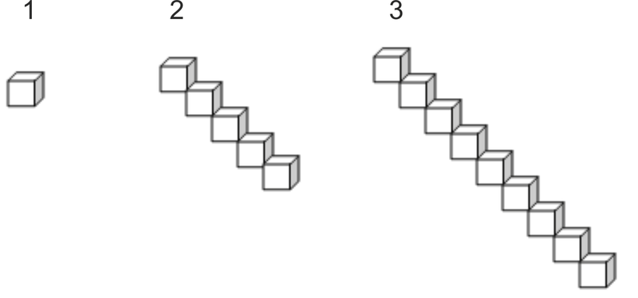
    
    \[Figure 7\]
    

| Pattern Number $(n)$ | 1   | 2   | 3   | 4   | 5   | ... | $n$ | ... | 50  |
| --- | --- | --- | --- | --- | --- | --- | --- | --- | --- |
| Number of Cubes $(c)$ |     |     |     |     |     |     |     |     |     |

8.  For the following linear graph, identify the $x$ and $y-$intercepts. 
    
    \[Figure 8\]

</article>

### 3.8 Graphing the Quadratic Function y = x²

<article>

The Graph of y = x²
-------------------

**Introduction**

In this lesson you will learn about the base function $y=x^2$. You will learn to complete a table of values for the quadratic function $y=x^2$. When the table of values has been completed, you will then plot the points on a Cartesian grid. This image of the basic quadratic function is called a parabola. You will then explore the characteristics of the parabola from the graph. Finally, you will apply your knowledge of domain and range to the parabola.

**Objectives**

The lesson objectives for Graphing the Quadratic Function $y=x^2$ are:

* Completing a table of values for $y=x^2$.
* Plotting the points on a Cartesian grid.
* Understanding the vertex, axis of symmetry, minimum and maximum values of the graph and the way the image opens.
* Writing a suitable domain and range for the graph.

**Introduction**

Until now you have been dealing with linear functions. The highest exponent of the independent variable has been one and the graphs have been straight lines. Now you will be learning about quadratic functions. A quadratic function is one of the form $y=ax^2+bx+c$ where $a, b$ and $c$ are real numbers and $a \ne 0$. The highest exponent of the independent variable is two. To classify a function as quadratic, you must have an ‘$x$’ squared term. The graph of a quadratic function is a smooth curve. You will become familiar with the graph as you proceed with the concept.

**Watch This**

[Khan Academy Quadratic Functions 1](http://www.youtube.com/watch?v=CuPgmA7ytWA)

!?[video](https://www.youtube.com/watch?v=CuPgmA7ytWA)

**Guidance**

A graph can be created by plotting the coordinates or points from a table of values. The basic quadratic function is $y=x^2$ and the domain for the base table of values is $\{x|-3 \le x \le 3, x \ \varepsilon \ R\}$.

**Example A**

For the base quadratic function $y=x^2$, complete the base table of values such that $\{x|-3 \le x \le 3, x \ \varepsilon \ R\}$.

To complete the table of values, substitute the given $x-$values into the function $y=x^2$. If you are using a calculator, insert all numbers, especially negative numbers, inside parenthesis before squaring them. The operation that needs to be done is $(-3)(-3)$ NOT $-(3)(3)$.

$$
\begin{align*}
y&=x^2 && y=x^2 && y=x^2 && y=x^2\\
y&=(-3)^2 && y=(-2)^2 && y=(-1)^2 && y=(0)^2\\
y&={\color{red}9} && y={\color{red}4} && y={\color{red}1} && y={\color{red}0}\\
\\
y&=x^2 && y=x^2 && y=x^2\\
y&=(1)^2 && y=(2)^2 && y=(3)^2\\
y&={\color{red}1} && y={\color{red}4} && y={\color{red}9}\\
\end{align*}
$$

| **$X$** | **$Y$** |
| --- | --- |
| $-3$ | ${\color{red}9}$ |
| $-2$ | ${\color{red}4}$ |
| $-1$ | ${\color{red}1}$ |
| $0$ | ${\color{red}0}$ |
| $1$ | ${\color{red}1}$ |
| $2$ | ${\color{red}4}$ |
| $3$ | ${\color{red}9}$ |

**Example B**

On a Cartesian grid, plot the points from the base table of values for $y=x^2$.

| --- | --- |
| $-3$ | ${\color{red}9}$ |
| $-2$ | ${\color{red}4}$ |
| $-1$ | ${\color{red}1}$ |
| $0$ | ${\color{red}0}$ |
| $1$ | ${\color{red}1}$ |
| $2$ | ${\color{red}4}$ |
| $3$ | ${\color{red}9}$ |

The plotted points can now be joined to form a continuous line. To join the points, begin with the point (–3, 9) or the point (3, 9) and without lifting your pencil, draw a smooth curve. The image should look like the following graph.

.")

**Example C**

What are some unique characteristics of the graph of $y=x^2$?

2.  Every red point on the left side of the image has a corresponding blue point on the right side of the image.
3.  If the image was folded left to right along the $y-$axis that passes through the green point, each red point would land on each corresponding blue point.
4.  The sides of the image extend upward.
5.  The red and the blue points are plotted to the right and to the left of the green point. The points are plotted left and right one and up one; left and right two and up four, left and right 3 and up nine.

**Example D**

Now that some characteristics have been noted, it is important to correctly name these unique features.

For the graph of $y=x^2$, the vertex is (0, 0) and the parabola has a minimum value of zero which is indicated by the $y-$value of the vertex. The parabola opens upward since the $y-$values in the table of values are 0, 1, 4 and 9. The $y-$axis for this graph is actually the axis of symmetry. The axis of symmetry is the vertical line that passes through the vertex of the parabola. The parabola is symmetrical about this line. The equation for this axis of symmetry is $x = 0$. If the parabola were to open downward, the vertex would be the highest point of the graph. Therefore the image would have a maximum value of zero.

The domain for all parabolas is $D=\{x|x \ \varepsilon \ R\}$. The range for the above parabola is $R=\{y|y \ge 0, y \ \varepsilon \ R\}$.

**Vocabulary**

__Axis of Symmetry__

The **_axis of symmetry_** of a parabola is a vertical line that passes through the vertex of the parabola. The parabola is symmetrical about this line. The **_axis of symmetry_** has the equation $x =$ the $x-$coordinate of the vertex.

__Parabola__

A **_parabola_** is the smooth curve that results from graphing a quadratic function of the form $y=ax^2+bx+c$. The curve resembles a U-shape.

__Quadratic Function__

A **_quadratic function_** is a function of the form $y=ax^2+bx+c$ where $a, b$ and $c$ are real numbers and $a \ne 0$.

__Vertex__

The **_vertex_** of a parabola is the point around which the parabola turns. The vertex is the maximum point of a parabola that opens downward and the minimum point of a parabola that opens upward.

**Guided Practice**

1. If the graph of $y=x^2$ opens downward, what changes would exist in the base table of values?

2. If the graph of $y=x^2$ opens downward, what changes would exist in the basic quadratic function?

3. Draw the image of the basic quadratic function that opens downward. State the domain and range for this parabola.

**Answers**

1. If the parabola were to open downward, the $x-$values would not change. The $y-$values would become negative values. The points would be plotted from the vertex as: right and left one and down one; right and left two and down four; right and left three and down nine. The table of values would be

| **$X$** | **$Y$** |
| --- | --- |
| $-3$ | ${\color{red}-9}$ |
| $-2$ | ${\color{red}-4}$ |
| $-1$ | ${\color{red}-1}$ |
| $0$ | ${\color{red}0}$ |
| $1$ | ${\color{red}-1}$ |
| $2$ | ${\color{red}-4}$ |
| $3$ | ${\color{red}-9}$ |

2. To match the table of values, the basic quadratic function would have to be written as $\boxed{y=-x^2}$

3. 

**Summary**

In this lesson you have learned that a quadratic function is one of the form $y=ax^2+bx=c$ where $a, b$ and $c$ are real numbers and $a \ne 0$. The basic quadratic function is $y=x^2$. You learned to create a table of values for this basic quadratic function and to plot the points on a Cartesian grid. The points were joined with a smooth curve to produce an image known as a parabola.

From the graph, you learned that a parabola has a turning point known as the vertex. The vertex represented the minimum value of the graph if it opened upward and the maximum value if it opened downward. When the graph opened downward, the $y-$values in the base table changed to negative values. This change was shown in the basic quadratic function as $\boxed{y=-x^2}$.

You also learned that the parabola has an axis of symmetry. The axis of symmetry is the vertical line that passes through the vertex of the parabola. The equation for the axis of symmetry is always $x=$ the $x-$coordinate of the vertex. You also learned to identify the domain and the range for the parabola.

**Problem Set**

**Complete the following statements in the space provided.**

1.  The name given to the graph of $y=x^2$ is \_\_\_\_\_\_\_\_\_\_\_\_\_\_\_\_\_\_\_\_.
2.  The domain of the graph of $y=x^2$ is \_\_\_\_\_\_\_\_\_\_\_\_\_\_\_\_\_\_\_\_.
3.  If the vertex of a parabola was (–3, 5), the equation of the axis of symmetry would be \_\_\_\_\_\_\_\_\_\_\_\_\_\_\_\_\_\_\_\_.
4.  A parabola has a maximum value when it opens \_\_\_\_\_\_\_\_\_\_\_\_\_\_\_\_\_\_\_\_.
5.  The point (–2, 4) on the graph of $y=x^2$ has a corresponding point at \_\_\_\_\_\_\_\_\_\_\_\_\_\_\_\_\_\_\_\_.
6.  The range of the graph of $y=-x^2$ is \_\_\_\_\_\_\_\_\_\_\_\_\_\_\_\_\_\_\_\_.
7.  If the table of values for the basic quadratic function included 4 and –4 as $x-$values, the $y-$value(s) would be \_\_\_\_\_\_\_\_\_\_\_\_\_\_\_\_\_\_\_\_.
8.  The vertical line that passes through the vertex of a parabola is called \_\_\_\_\_\_\_\_\_\_\_\_\_\_\_\_\_\_\_\_.
9.  A minimum value exists when a parabola opens \_\_\_\_\_\_\_\_\_\_\_\_\_\_\_\_\_\_\_\_.
10. The turning point of the graph of $y=x^2$ is called the \_\_\_\_\_\_\_\_\_\_\_\_\_\_\_\_\_\_\_\_.

</article>

### 3.9 Transformations of y = x²

<article>

**Introduction**

In this lesson you will learn that the graph of $y=x^2$ can undergo changes. These changes will include changing the vertex of (0, 0) and changing the $y-$values of 1, 4 and 9. These changes will be used to draw the graph of $y=x^2$ as it undergoes the various changes.

**Objectives**

The lesson objectives for The Transformations of $y=x^2$ are:

* Understanding horizontal and vertical translations.
* Understanding a vertical stretch.
* Understanding a vertical reflection.
* Understanding the identity property of addition
* Applying these transformations to graph the parabola.

Transformations of y = x²
-------------------------

**Introduction**

In this concept you will learn to apply changes to the graph of $y=x^2$ to create a new parabola that no longer has its vertex at (0, 0) and no longer has $y-$values of 1, 4 and 9. These changes are known as transformations and the transformations of $y=x^2$ can be readily detected on the graph.

**Guidance**

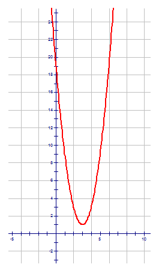

The vertex of the red parabola is (3, 1). The sides of the parabola open upward but they appear steeper and longer than those on the left. These transformations will be examined in the examples.

**Example A**

. The red graph is the graph of $y=x^2$ that has been moved four units to the right. When the graph undergoes a slide of four units to the right, it has undergone a horizontal translation of +4. The vertex of the red graph is (4, 0). A horizontal translation changes the $x-$coordinate of the vertex of the graph of $y=x^2$.")

**Example B**

. The red graph is the graph of $y=x^2$ that has been moved four units to the right and three units upward. When the graph undergoes a slide of four units to the right, it has undergone a horizontal translation of +4. When the graph undergoes a slide of three units upward, it has undergone a vertical translation of +3.The vertex of the red graph is (4, 3). A horizontal translation changes the $x-$coordinate of the vertex of the graph of $y=x^2$ while a vertical translation changes the $y-$coordinate of the vertex.")

**Example C**

**Example D**

**Vocabulary**

__Horizontal translation__

The **_horizontal translation_** is the change in the base graph $y=x^2$ that shifts the graph right or left. It changes the $x-$coordinate of the vertex.

__Transformation__

A **_transformation_** is any change in the base graph $y=x^2$. The transformations that apply to the parabola are a horizontal translation $(HT)$, a vertical translation $(VT)$, a vertical stretch $(VS)$ and a vertical reflection $(VR)$.

__Vertical Reflection__

The **_vertical reflection_** is the reflection of the image graph in the $x-$axis. The graph of the vertical reflection of $y=x^2$ opens downward and the $y-$values are negative values.

__Vertical Stretch__

The **_vertical stretch_** is the change made to the base function $y=x^2$ by stretching (or compressing) the graph vertically. The vertical stretch will produce an image graph that appears narrower (or wider) then the original base graph of $y=x^2$.

__Vertical Translation__

The **_vertical translation_** is the change in the base graph $y=x^2$ that shifts the graph up or down. It changes the $y-$coordinate of the vertex.

**Guided Practice**

1. Use the following tables of values and identify the transformations of the base graph $y=x^2$.

$$
\begin{align*}
& X \qquad -3 \qquad -2 \qquad -1 \qquad 0 \qquad 1 \qquad 2 \qquad 3\\
& Y \qquad \quad  9 \qquad \quad \ 4 \qquad \quad \ 1 \qquad \ 0 \qquad 1 \qquad 4 \qquad 9
\end{align*}
$$

$$
\begin{align*}
& X \qquad -4 \qquad -3 \qquad -2 \qquad -1 \qquad 0 \qquad 1 \qquad 2\\
& Y \qquad \ \ 15 \qquad \quad \ 5 \qquad -1 \qquad -3 \quad -1 \quad \ \ \ 5 \quad \ \ 15
\end{align*}
$$

2. Identify the transformations of the base graph $y=x^2$.

$VR: \text{YES}$

$VS: \frac{1}{2}$

$VT: +2$

$HT: \ -3$

**Answers**

1. To identify the transformations from the tables of values, determine how the table of values for $y=x^2$ compare to the table of values for the new image graph.

* The $x-$values have moved one place to the left. This means that the graph has undergone a horizontal translation of –1.
* The $y-$coordinate of the vertex is –3. This means that the graph has undergone a vertical translation of –3. The vertex is easy to pick out from the tables since it is the point around which the corresponding points appear.

$$
\begin{align*}
& X \qquad -4 \qquad -3 \qquad -2 \qquad -1 \qquad 0 \qquad 1 \qquad 2\\
& Y \qquad \ \ 15 \qquad \quad \ 5 \qquad -1 \qquad -3 \quad -1 \quad \ \ \ 5 \quad \ \ 15
\end{align*}
$$

* The points from the vertex are plotted left and right one and up two, left and right two and up eight. This means that the base graph has undergone a vertical stretch of 2.
* The $y-$values move upward so the parabola will open upward. Therefore the image is not a vertical reflection.

2. The vertex is (1, 6). The base graph has undergone a horizontal translation of +1 and a vertical translation of +6. The parabola opens downward, so the graph is a vertical reflection. The points have been plotted such that the $y-$values of 1 and 4 are now 2 and 8. It is not unusual for a parabola to be plotted with five points rather than seven. The reason for this is the vertical stretch often multiplies the $y-$values such that they are difficult to graph on a Cartesian grid. If all the points are to be plotted, a different scale must be used for the $y-$axis.

3. The vertex is the values $(HT, VT)$ which is (–3, 2). The $y-$values of 1, 4 and 9 must be multiplied by $\frac{1}{2}$ to create values of $\frac{1}{2}, 2$ and $4 \frac{1}{2}$. The graph is a vertical reflection which means the graph opens downward and the $y-$values become negative.

The base graph of the quadratic function of $y=x^2$ can undergo transformations that will change its appearance. The shape of the parabola which resembles a ‘U’ does not change but its location on the Cartesian grid can change. The vertex of (0, 0) will change if the image graph undergoes either a horizontal translation and/or a vertical translation. The transformations cause the parabola to slide left or right and up or down.

The points of the base graph are plotted from the vertex left and right one and up one, left and right two and up four, left and right three and up nine. If the image graph undergoes a vertical stretch, these values of 1, 4 and 9 can increase if the stretch is a whole number. This will produce a parabola that will appear to be narrower than the original base graph. If the vertical stretch is a fraction, the values of 1, 4 and 9 will decrease. This will produce an image graph that will appear to be wider than the original base graph.

The final transformation that may occur is a vertical reflection. The graph is reflected in the $x-$axis. The $y-$values are all plotted downward as they will all be negative values. This causes the parabola to open downward.

**Problem Set**

**The following table represents transformations to the base graph $y=x^2$. Draw an image graph for each set of transformations.**

| **Number** | $VR$ | $VS$ | $VT$ | $HT$ |
| --- | --- | --- | --- | --- |
| 1.  | **NO** | **$3$** | **$-4$** | **$-8$** |
| 2.  | **YES** | $2$ | $5$ | $6$ |
| 3.  | **YES** | $\frac{1}{2}$ | $3$ | $-2$ |
| 4.  | **NO** | $1$ | $-2$ | $4$ |
| 5.  | **NO** | $\frac{1}{4}$ | $1$ | $-3$ |

**For each of the following graphs, list the transformations of $y=x^2$.**

1.  
    
    \[Figure 9\]
    
2.  
    
    \[Figure 10\]
    
3.  
    
    \[Figure 11\]
    
4.  
    
    \[Figure 12\]
    
5.  
    
    \[Figure 13\]

</article>

### 3.10 Transformational Form of y = x²

<article>

**Introduction**

In this lesson you will learn to write the equation of the base quadratic function $y=x^2$ to reflect the transformations that the graph has undergone. The equation will include any of the transformations that have been applied to $y=x^2$. These transformations will include a vertical reflection, a vertical stretch, a vertical translation and a horizontal translation

**Objectives**

The lesson objectives for The Transformation Form of $y=x^2$ are:

* Understanding the transformational form of the equation.
* Identifying the transformations of $y=x^2$ from the equation.
* Applying the transformations to create the equation.
* Drawing the graph by using the transformations of $y=x^2$.

Transformational Form of y = x²
-------------------------------

**Introduction**

In this concept you will learn to apply transformations of the graph of $y=x^2$ to create an equation for the image graph. The equation will be written in transformational form. The transformational form of an equation is of the form  $\boxed{} \ \frac{1}{a}(y-k)=(x-h)^2$ where

* $a$ is the vertical stretch $(VS)$
* $k$ is the vertical translation $(VT)$
* $h$ is the horizontal translation $(HT)$
* is the location of a negative sign which indicates a vertical reflection $(VR)$

As the name indicates, you will be able to identify the transformations from the equation. The transformations can then be used to draw the image graph of $y=x^2$.

**Guidance**

Another way to write the transformational form of $y=x^2$ is  $\boxed{\boxed{} \ \frac{1}{VS}(y-VT)=(x-HT)^2}$

The transformations that deal with the vertical components are on the $y$ side of the equation and those that deal with the horizontal components are on the $x$ side of the equation. These apply to the $x-$ and $y-$axes of the Cartesian grid.

Given the equation $\frac{1}{3} (y-2)=(x+4)^2$, list the transformations of $y=x^2$.

&nbsp;

$$
\begin{align*}
& \boxed{\boxed{} \ \frac{1}{VS} (y-VT) = (x-HT)^2}\\
& \quad \ \ {\color{red}\updownarrow} \qquad \quad \ {\color{red}\updownarrow} \qquad \qquad \quad {\color{red}\updownarrow}\\
& \quad \ \ \frac{1}{3} \ (y \ - \ 2) \ = (x \ + \ 4)^2
\end{align*}
$$

The vertical stretch is **3**. The vertical translation is **2**. The negative sign did not change in the equation. It remained the same as it was in the general, transformational form of the equation. This indicates that the $VT$ is a positive value. The horizontal translation is **negative 4**. The negative sign given in the general, transformational form of the equation changed to a positive sign in the given equation. This change indicates that the horizontal translation was a negative value. There is no negative sign before $\frac{1}{3}$ so the image graph is not a vertical reflection.

**Example A**

Given the following function in transformational form, identify the transformations of $y=x^2$.

$-2(y+1)=(x-2)^2$

$VR$ – Is there a negative sign in front of $\frac{1}{VS}$? YES. The image graph is a **vertical reflection** in the $x-$axis.

$VS$ – Is there a number in front of ‘$y$’ or the parenthesis containing the variable ‘$y$’? YES. However, the number in front of the parenthesis containing the variable ‘$y$’ is not in the form $\frac{1}{VS}$. The vertical stretch factor is the reciprocal of the numerical coefficient of ‘$y$’. Therefore, the vertical stretch of this function is $\frac{1}{2}$.

$VT$ – Is there a number after the variable ‘$y$’? YES. The value of this number is the opposite of the sign that appears in the equation. The vertical translation is **–1**.

$HT$ – Is there a number after the variable ‘$x$’? YES. The value of this number is the opposite the sign that appears in the equation. The horizontal translation is **+2**.

**Example B**

When the transformations of $y=x^2$ were determined from the given equation, the reciprocal of the numerical coefficient of ‘$y$’ was the vertical stretch factor, and the opposite signs of the values that appeared for $VT$ and $HT$ were used to identify the vertical and horizontal translations. These same applications will be used to determine the equation in transformational form from a given list of transformations of $y=x^2$.

**Given** the following transformations, determine the equation of the image of $y=x^2$ in transformational form.

$$
\begin{align*}
VR & \rightarrow NO\\
VS & \rightarrow 3\\
VT & \rightarrow 5\\
HT & \rightarrow -4
\end{align*}
$$

&nbsp;$\boxed{\boxed{} \ \frac{1}{VS} (y-VT)=(x-HT)^2}$

$VR$ – The image is not reflected in the $x-$axis. A negative sign is not required.

$VS$ – The reciprocal of 3 is $\frac{1}{3}$.

$VT$ – The opposite of a +5 is a –5.

$HT$ – The opposite of a –4 is a +4.

The equation of the image of $y=x^2$ is $\boxed{{\color{red}\frac{1}{3}} (y {\color{red}-5})=(x {\color{red}+4})^2}$

**Example C**

If a parabola opens downward, it is reflected in the $x-$axis. To show this reflection in the equation, a negative sign is written before the vertical stretch factor in the equation.

From the vertex of the parabola, the points of $y=x^2$ are plotted left and right one and $\uparrow$ or $\downarrow$ one; left and right two and $\uparrow$ or $\downarrow$ four; left and right three and $\uparrow$ or $\downarrow$ nine. If the $y-$values of 1, 4 or 9 are changed, the vertical stretch factor is the number by which the $y-$values were multiplied to create the new values.

If the vertex of the parabola is not located at (0, 0), the new coordinates of the vertex will indicate the horizontal translation and the vertical translation of $y=x^2$.

**Using** $y=x^2$ as the base function, identify the transformations that have occurred to produce the following image graph. Use these transformations to write the equation in transformational form.

$VS$ – The $y-$values of 1 and 4 are now +3 and +12. $VS = 3$.

$VT$ – The $y-$coordinate of the vertex is –5.

$HT$ – The $x-$coordinate of the vertex is +3.

The equation is $\boxed{{\color{red}\frac{1}{3}} (y {\color{red}+5})=(x {\color{red}-3})^2}$

**Example D**

When the equation of the base quadratic function is written in transformational form, the function can also be expressed in mapping notation form. This form describes how to obtain the image of a given graph by using the changes in the ordered pairs.

The standard base table of values for the base quadratic function $y=x^2$ is given by:

$$
\begin{align*}
& X \qquad -3 \qquad -2 \qquad -1 \qquad 0 \qquad 1 \qquad 2 \qquad 3\\
& Y \qquad \quad \ 9 \qquad \quad \ 4 \qquad \quad \ 1 \qquad 0 \qquad 1 \qquad 4 \qquad 9
\end{align*}
$$

When these ordered pairs are plotted, we get the base parabola. The mapping rule used to generate the image of a quadratic function is $(x,y) \rightarrow (x^\prime,y^\prime)$ where $(x^\prime,y^\prime)$ are the coordinates of the image graph. The resulting mapping rule from the equation

&nbsp;$\boxed{} \ \frac{1}{VS} (y-VT)=(x-HT)^2$ is $(x,y) \rightarrow (x+HT,VR \cdot \ VS \cdot y+VT)$. A mapping rule details the transformations that were applied to the coordinates of the base function $y=x^2$.

**Given** the following quadratic equation, $\frac{1}{2}(y-5)=(x+3)^2$ write the mapping rule and create a table of values for the mapping rule.

The mapping rule for this function will tell exactly what changes were applied to the coordinates of the base quadratic function.

$\frac{1}{2}(y-5)=(x+3)^2 \quad (x,y) \rightarrow (x-3,2y+5)$

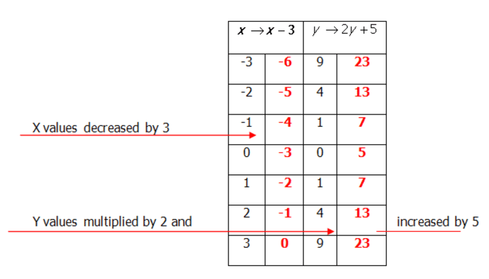

**Vocabulary**

__Horizontal translation__

The **_horizontal translation_** is the change in the base graph $y=x^2$ that shifts the graph right or left. It changes the $x-$coordinate of the vertex.

__Mapping Rule__

The **_mapping rule_** is another form used to express a quadratic function. The mapping rule defines the transformations that have occurred to the base quadratic function $y=x^2$. The mapping rule is $(x,y) \rightarrow (x^\prime,y^\prime)$ where $(x^\prime,y^\prime)$ are the coordinates of the image graph.

__Transformation__

A **_transformation_** is any change in the base graph $y=x^2$. The transformations that apply to the parabola are a horizontal translation $(HT)$, a vertical translation $(VT)$, a vertical stretch $(VS)$ and a vertical reflection $(VR)$.

__Transformational form of $y = x^2$__

The **_transformational form of_** $y = x^2$ is the form of the quadratic base function $y=x^2$ that shows the transformations of the image graph. The transformational form of the equation is  $\boxed{\boxed{} \ \frac{1}{VS} (y-VT)=(x-HT)^2}$ A negative sign in indicates a vertical reflection in the $x-$axis. The reciprocal of the number before the parenthesis containing the variable ‘$y$’ indicates the vertical stretch factor, and the opposite signed of the values for $VT$ and $HT$ indicate the coordinates of the vertex.

__Vertical Reflection__

The **_vertical reflection_** is the reflection of the image graph in the $x-$axis. The graph of the vertical reflection of $y=x^2$ opens downward and the $y-$values are negative values.

__Vertical Stretch__

The **_vertical stretch_** is the change made to the base function $y=x^2$ by stretching (or compressing) the graph vertically. The vertical stretch will produce an image graph that appears narrower (or wider) then the original base graph of $y=x^2$.

__Vertical Translation__

The **_vertical translation_** is the change in the base graph $y=x^2$ that shifts the graph up or down. It changes the $y-$coordinate of the vertex.

**Guided Practice**

1. Identify the transformations of $y=x^2$ for the quadratic function $-2(y+3)=(x-4)^2$

2. List the transformations of $y=x^2$ and graph the function $-(y-4)=(x+5)^2$

3. Graph the function $\frac{1}{2}(y-3)=(x-2)^2$ using the mapping rule method.

**Answers**

1. $VR$ – There is a negative sign in front of $\frac{1}{VS}$. The image graph is a **vertical reflection** in the $x-$axis.

$VS$ – There is a number in front of ‘$y$’ or the parenthesis containing the variable ‘$y$’. The vertical stretch factor is the reciprocal of the numerical coefficient of ‘$y$’. Therefore, the vertical stretch of this function is $\frac{1}{2}$.

$VT$ – There is a number after the variable ‘$y$’. The value of this number is the opposite of the sign that appears in the equation. The vertical translation is **–3**.

$HT$ – There is a number after the variable ‘$x$’. The value of this number is the opposite of the sign that appears in the equation. The horizontal translation is **+4**.

2. 
\begin{align*}
VR & \rightarrow YES\\
VS & \rightarrow 1\\
VT & \rightarrow +4\\
HT & \rightarrow -5
\end{align*}
$$

3. $\frac{1}{2}(y-3)=(x-2)^2$

**Mapping Rule** $(x,y) \rightarrow (x+2,2y+3)$

$$
\begin{align*}
VR & \rightarrow NO\\
VS & \rightarrow 2 \ - \ y- \text{values are multiplied by} \ 2\\
VT & \rightarrow +3- \ y- \text{values are also increased by} \ 3\\
HT & \rightarrow +2- \ x- \text{values are increased by} \ 2
\end{align*}
$$

**Make a table of values:**

| $x \rightarrow x+2$ |     | $y \rightarrow 2y+3$ |     |
| --- | --- | --- | --- |
| $-3$ | –1  | 9   | 21  |
| –2  | 0   | 4   | 11  |
| –1  | 1   | 1   | 5   |
| 0   | 2   | 0   | 3   |
| 1   | 3   | 1   | 5   |
| 2   | 4   | 4   | 11  |
| 3   | 5   | 9   | 21  |

**Draw the Graph**

In this lesson you have learned to write the equation of a parabola in transformational form. This form of the equation shows any and all changes that have been made to the base quadratic $y=x^2$. These transformations were then used to sketch the graph of the parabola.

You also learned to write a mapping rule that represented the transformations of $y=x^2$. The mapping rule was used to create a table of values that reflected the changes of the base table of values of $y=x^2$. The new table of values was then used to graph the quadratic function of the parabola.

You also learned to use the transformations of $y=x^2$ that were visible on the graph to write the equation of the quadratic function in transformational form. You had to remember to use the opposite sign for the vertical and horizontal translations as well as the reciprocal of the vertical stretch.

**Problem Set**

**Complete the following table to identify the transformations of $y=x^2$ in each of the given functions:**

| **Number** | $VR$ | $VS$ | $VT$ | $HT$ |
| --- | --- | --- | --- | --- |
| 1.  |     |     |     |     |
| 2.  |     |     |     |     |
| 3.  |     |     |     |     |
| 4.  |     |     |     |     |
| 5.  |     |     |     |     |

1.  $\frac{1}{4}(y+9)=(x-2)^2$
2.  $-6(y+7)=x^2$
3.  $-\frac{1}{3}(y+6)=(x-1)^2$
4.  $5(y-3)=(x+4)^2$
5.  $\frac{1}{5}y=(x+2)^2$

**Graph the following quadratic functions using the mapping rule method:**

1.  $\frac{1}{2}(y+5)=(x-4)^2$
2.  $-3(y-6)=(x-2)^2$
3.  $-\frac{1}{2}(y-7)=(x+3)^2$
4.  $-2(y-9)=(x+6)^2$
5.  $3y=(x-4)^2$

**Using the following mapping rules, write the equation, in transformational form, that represents the image of $y = x^2$.**

1.  $(x,y) \rightarrow \left(x+1, -\frac{1}{2}y\right)$
2.  $(x,y) \rightarrow (x+6,2y-3)$
3.  $(x,y) \rightarrow \left(x-1, \frac{2}{3}y+2\right)$
4.  $(x,y) \rightarrow (x+3,3y+1)$
5.  $(x,y) \rightarrow \left(x-5,-\frac{1}{3}y-7\right)$

Summary
-------

In this lesson you have learned how to graph the base quadratic function $y=x^2$ by creating a table of values. The points from the table were then plotted on the Cartesian grid to form a curved shape known as a parabola. You learned that a parabola has a turning point called a vertex and that it has an axis of symmetry, which is a vertical line that is parallel to the $y-$axis and that passes through the vertex. You also discovered that each point on one side of the axis of symmetry had a corresponding point on the other side of the axis of symmetry. You also learned how to determine the domain and the range for a parabola and how to write these values using interval notation.

The next section of this lesson dealt with the changes or transformations that occurred to the image graph of $y=x^2$. These transformations included a vertical reflection across the $x-$axis, a vertical stretch that caused the $y-$values of 1, 4 and 9 to either increase or to decrease, a vertical translation that caused the graph to move upward or downward and finally a horizontal translation that moved the graph to the left or the right. You learned to use these transformations to graph the image graph of $y=x^2$. In addition, you learned to recognize the transformations as they appeared in a given graph.

The final section of this lesson dealt with representing the transformations in a quadratic function that was presented in transformational form. The transformations of $y=x^2$ were extracted from the equation and used to sketch the image graph of $y=x^2$. You also learned how to express the quadratic function in the form of a mapping rule. The mapping rule method was then applied to graphing the image of $y=x^2$.

</article>

### 3.11 Chapter Test

<article>

1.  $f(x) = 4x-8$ is a function.
    1.  Find $f(-3)$
    2.  Find ‘$x$’ if $f(x) = 28$
    3.  Is the following graph a function? Why or why not? 
        
        \[Figure 1\]
        
    4.  What are the domain and range of the above graph?
2.  What are the coordinates of the points plotted on the following Cartesian plane? 
    
    \[Figure 2\]
    
3.  The cost of renting the ice surface at the local arena is shown in the table below.

| **Time (hr)** | **0** | **1** | **2** | **3** | **4** |
| --- | --- | --- | --- | --- | --- |
| **Cost ($)** | **$200** | **$250** | **$300** | **$350** | **$400** |

(a) Write a linear function to represent the cost of renting the ice surface.

(b) Draw a graph to represent the problem. Label the axis to match the problem.

(c) Write a suitable domain and range for the problem.

4.  Answer the following questions:
    1.  If the graph of $y=x^2$ undergoes a vertical stretch of $\frac{2}{3}$, what will be the $y-$values for the graph?
    2.  Write a mapping rule for the equation $-\frac{1}{2} (y-6) = (x+7)^2$.
    3.  For the above mapping rule, create a table of values.
5.  Answer the following questions with respect to this graph. 
    
    \[Figure 3\]
    
    1.  What is the vertex of the graph? \_\_\_\_\_\_\_\_\_\_\_\_\_\_\_\_\_\_\_\_
    2.  Does the graph have a max value or a min. value? \_\_\_\_\_\_\_\_\_\_Of what? \_\_\_\_\_\_\_\_\_\_
    3.  What is the equation of the axis of symmetry? \_\_\_\_\_\_\_\_\_\_\_\_\_\_\_\_\_\_\_\_
    4.  What is the domain of the graph? \_\_\_\_\_\_\_\_\_\_\_\_\_\_\_\_\_\_\_\_
    5.  What is the range of the graph? \_\_\_\_\_\_\_\_\_\_\_\_\_\_\_\_\_\_\_\_
6.  For the following graph, list the transformations of $y=x^2$ and write the equation to describe the graph. 
    
    \[Figure 4\]

</article>

## 4.0 Name That Line

<article>

**Introduction**

In this chapter you learn about relations defined by $y=mx+b$. You will learn how to rewrite an equation given in the form $Ax +By+C=0$ in the form $y=mx+b$. You will learn to graph $y=mx+b$ by using the point-slope method as well as how to write the equation of a line from the graph by determining the slope and the $y-$intercept.

To write the equation of a line, you must know the slope and the $y-$intercept of the line. In this chapter you will learn how to calculate the slope of a line from two given points on the line, from a given equation, from a point on the line and the $y-$intercept and from the relationship between special lines. In addition, you will learn how to determine the $y-$intercept of a line algebraically.

When these basic concepts have been mastered, you will learn how to determine the equation of lines that are parallel and perpendicular to the $x$ and $y$ axis or to other lines.

Finally, all of the concepts will be applied to problems that use linear functions as a model.

**Lessons**

In this chapter you will do the following lessons:

* The Slope of a Line from a Graph or from Two Points
* The Equation of a Line in Slope-Intercept Form
* Graphing the Linear Functions $y=mx+b; \ y=a; \ x=a$
* Determining the Equation of a line from the Graph
* Parallel and Perpendicular Lines
* Linear Function as a Model

</article>

### 4.1 The Slope of a Line from a Graph or from Two Points

<article>

The Slope of a Line from a Graph
--------------------------------

**Introduction**

In this lesson you will learn that the slope of a straight line is simply the slant or gradient of that line. The slope is often defined as $\frac{\text{rise}}{\text{run}}$ (rise over run), $\frac{\Delta y}{\Delta x}$ (delta $y$ over delta $x$) and $\frac{y_2-y_1}{x_2-x_1}$ (change in $y$ over change in $x$). Whatever definition of slope is used, they all mean the same. The slope of a line is represented by the letter ‘$m$’ and its value is a real number. You will learn to determine the slope of a line from a graph by counting to determine the value of $\frac{\text{rise}}{\text{run}}$. In addition, you will also learn how to calculate the slope of a line by using the coordinates of two points on the line.

**Objectives**

The lesson objectives for Slope of a Line are:

* Understanding how to determine the slope of a line from a graph
* Understanding how to determine the slope of a line from two given points
* Understanding the slope of special lines
* Understanding the role of slope in real world problems

**Introduction**

Determine the slope of the following line:

 the second indicated point. Count the number of spaces that you had to run to be below the second point and place this value in the run position in the denominator of the slope. Next count the number of spaces you have to move to reach the second point. In this case you have to rise upward which indicates a positive move. This value must be placed in the rise position in the numerator of the slope.")

$m=\frac{\text{rise}}{\text{run}}$ You had to run 5 spaces to the right which indicates moving 5 spaces in a positive direction. You now have $m=\frac{\text{rise}}{{\color{blue}5}}$. To reach the point directly above involved moving upward 6 spaces in a positive direction. You now have $m=\frac{{\color{magenta}6}}{{\color{blue}5}}$. The slope of the above line is $\frac{6}{5}$.

**Watch This**

[Khan Academy Slope and Rate of Change](http://www.youtube.com/watch?v=hXP1Gv9IMBo)

!?[video](https://www.youtube.com/watch?v=hXP1Gv9IMBo)

**Guidance**

i) 

ii) Determine the slope of the line that passes through the points $A (-6, -4)$ and $B (3, -8)$.

The slope of this line can be determined by finding the change in $y$ over the change in $x$.

The formula that is used is $m=\frac{y_2-y_1}{x_2-x_1}$ where ‘$m$’ is the slope, $(x_1,y_1)$ are the coordinates of the first point and $(x_2,y_2)$ are the coordinates of the second point. To determine the slope, the choice of the first and second point will not affect the result.

$$
\begin{align*}
& A \begin{pmatrix}  x_1, & y_1 \\  -6, & -4 \end{pmatrix} \quad B \begin{pmatrix}   x_2, & y_2 \\  3, & -8 \end{pmatrix}&& \text{Label the points to indicate the first and second points.}\\
& m=\frac{y_2-y_1}{x_2-x_1} && \text{Substitute the values into the formula.}\\
& m=\frac{-8--4}{3--6} && \text{Simplify the values (if possible)}\\
& m=\frac{-8+4}{3+6} && \text{Evaluate the numerator and the denominator}\\
& m=\frac{-4}{9} && \text{Reduce the fraction (if possible)}
\end{align*}
$$

**Example A**

What is the slope of each of the following lines.

i)  ")

\[Figure 4\]

i) Two points have been indicated. These points are exact values on the graph. From the point to the left, run one space in a positive direction and rise upward 2 spaces in a positive direction.

$$
\begin{align*}
m &=\frac{\text{rise}}{\text{run}}\\
m &= \frac{2}{{\color{blue}1}}
\end{align*}
$$

ii) Two points have been indicated. These points are exact values on the graph. From the point to the left, run two spaces in a positive direction and move upward 5 spaces in a negative direction.

$$
\begin{align*}
m &=\frac{\text{rise}}{\text{run}}\\
m &= \frac{-5}{{\color{blue}2}}
\end{align*}
$$

**Example B**

Determine the slope of the line passing through each pair of points:

i) (–3, –8) and (5, 8)

ii) (9, 5) and (–1, 6)

iii) (–2, 7) and (–3, –1)

iv) $x-$intercept 4 and $y-$intercept –3

To determine the slope of a line from two given points, the formula $m=\frac{y_2-y_1}{x_2-x_1}$ must be used.

Don’t forget to designate your choice for the first and the second point. Designating the points will reduce the risk of entering the values in the wrong location of the formula.

i) 

$$
\begin{align*}
& \begin{pmatrix}  x_1, & y_1 \\  -3, & -8 \end{pmatrix} \quad \begin{pmatrix} x_2, & y_2 \\  5, & 8 \end{pmatrix}\\
& \text{Substitute the values into the formula} && m=\frac{y_2-y_1}{x_2-x_1}\\
& && m=\frac{8--8}{5--3}\\
& \text{Simplify} && m=\frac{8+8}{5+3}\\
& \text{Calculate} && m=\frac{16}{8}\\
& \text{Simplify} && m=\frac{2}{1}
\end{align*}
$$

ii) 

$$
\begin{align*}
& \begin{pmatrix}  x_1, & y_1 \\  9, & 5 \end{pmatrix} \quad \begin{pmatrix} x_2, & y_2 \\  -1, & 6 \end{pmatrix}\\
& m =\frac{y_2-y_1}{x_2-x_1}\\
& m =\frac{6-5}{-1-9}\\
& m =\frac{1}{-10}
\end{align*}
$$

**There should never be a negative sign in the denominator of a fraction.**

$$
m =-\frac{1}{10}
$$

iii) 

$$
\begin{align*}
& \begin{pmatrix}  x_1, & y_1 \\  -2, & 7 \end{pmatrix} \quad \begin{pmatrix} x_2, & y_2 \\  -3, & -1 \end{pmatrix}\\
& m =\frac{y_2-y_1}{x_2-x_1}\\
& m =\frac{-1-7}{-3--2}\\
& m =\frac{-1-7}{-3+2}\\
& m =\frac{-8}{-1}\\
& m =\frac{8}{1}
\end{align*}
$$

iv) 

$$
\begin{align*}
& \begin{pmatrix}  x_1, & y_1 \\  4, & 0 \end{pmatrix} \quad  \begin{pmatrix} x_2, & y_2 \\  0, & -3 \end{pmatrix} && \text{Express the} \ x- \text{and} \ y- \text{intercepts as coordinates of a point.}\\
& m =\frac{y_2-y_1}{x_2-x_1}\\
& m =\frac{-3-0}{0-4}\\
& m =\frac{-3}{-4}\\
& m =\frac{3}{4}
\end{align*}
$$

**Example C**

If you look at the following graphs, a slope or gradient is not present.

(a)  and (4, 5).")

(b)  and (–3, –10).")

To determine the slope of each line from two given points, the formula $m=\frac{y_2-y_1}{x_2-x_1}$ will be used.

(a)  and (4, 5).")

$$
\begin{align*}
& \begin{pmatrix}  x_1, & y_1 \\  -5, & 5 \end{pmatrix} \quad \begin{pmatrix} x_2, & y_2 \\  4, & 5 \end{pmatrix}\\
& m =\frac{y_2-y_1}{x_2-x_1}\\
& m =\frac{5-5}{4--5}\\
& m =\frac{5-5}{4+5}\\
& m =\frac{0}{9}\\
& m=0
\end{align*}
$$

The slope of a line parallel to the $x-$axis is zero.

(b)  and (–3, –10).")

$$
\begin{align*}
& \begin{pmatrix}  x_1, & y_1 \\  -3, & 5 \end{pmatrix} \quad \begin{pmatrix} x_2, & y_2 \\  -3, & -10 \end{pmatrix}\\
& m =\frac{-10-5}{-3--3}\\
& m =\frac{-10-5}{-3+3}\\
& m =\frac{-15}{0}\\
& m=\text{undefined}
\end{align*}
$$

The slope of a line parallel to the $y-$axis is undefined.

**Example D**

Joseph drove from his summer home to his place of work. To avoid the road construction, Joseph decided to travel the gravel road. After driving for 20 minutes he was 62 miles away from work and after driving for 40 minutes he was 52 miles away from work. Represent the problem on a graph. Determine the slope of the line and tell what it means in this problem.

$$
\begin{align*}
& \begin{pmatrix}  x_1, & y_1 \\  20, & 62 \end{pmatrix} \quad \begin{pmatrix} x_2, & y_2 \\  40, & 52 \end{pmatrix} && \text{The formula can also be used to calculate the slope of the line.}\\
& m =\frac{y_2-y_1}{x_2-x_1}\\
& m =\frac{52-62}{40-20}\\
& m =\frac{-10}{20}\\
& m =\frac{-1 \ (miles)}{2 \ (minutes)}
\end{align*}
$$

Insert the units of the quantities that are represented on each of the axes. The slope means that for every two minutes that Joseph is driving, he gets one mile closer to work.

**Vocabulary**

__Slope__

The **_slope_** of a line is the ratio of the $\frac{\text{change in} \ Y}{\text{change in} \ X}$.

**Guided Practice**

1. Identify the slope for each of the following graphs by completing the formula $m=\frac{\text{rise}}{\text{run}}$.

i)  ")

\[Figure 11\]

2. Calculate the slope of the line that passes through the following pairs of points:

i) (5, –7) and (16, 3)

ii) (–6, –7) and (–1, –4)

iii) (5, –12) and (0, –6)

3. i) What is the slope of the line that passes through the point (2, 4) and is perpendicular to the $x-$axis?

ii) What is the slope of the line that passes through the point (–6, 8) and is perpendicular to the $y-$axis?

4. For the following situation, determine the slope and explain its meaning for the given situation.

The local _Wine and Dine Restaurant_ has a private room that can serve as a banquet facility for up to 200 guests. When the manager quotes a price for a banquet she includes the cost of the room rent in the price of the meal. The price of a banquet for 80 people is $900 while one for 120 people is $1300.

i) Plot a graph of cost versus the number of people.

ii) What is the slope of the line and what meaning does it have for this situation?

**Answers**

1. i)  and (16, –2). From the point to the left, run fifteen spaces in a positive direction and move downward six spaces in a negative direction.")

$$
\begin{align*}
m&=\frac{\text{rise}}{\text{run}}\\
m&=\frac{-6}{{\color{blue}16}}\\
m&=\frac{-3}{{\color{blue}8}}
\end{align*}
$$

ii)  and (8, 4). From the point to the left, run ten spaces in a positive direction and move upward six spaces in a positive direction.")

$$
\begin{align*}
m&=\frac{\text{rise}}{\text{run}}\\
m&=\frac{6}{{\color{blue}10}}\\
m&=\frac{3}{{\color{blue}5}}
\end{align*}
$$

2. i) (5, –7) and (16, 3)

$$
\begin{align*}
& \begin{pmatrix}  x_1, & y_1 \\  5, & -7 \end{pmatrix} \quad \begin{pmatrix} x_2, & y_2 \\  16, & 3 \end{pmatrix} && \text{Designate the points as to the first point and the second point.}\\
& m =\frac{y_2-y_1}{x_2-x_1}\\
& m =\frac{3--7}{16-5} && \text{Fill in the values}\\
& m =\frac{3+7}{16-5} && \text{Simplify the numerator and denominator (if possible)}\\
& m =\frac{10}{11} && \text{Calculate the value of the numerator and the denominator}
\end{align*}
$$

ii) (–6, –7) and (–1, –4)

$$
\begin{align*}
& \begin{pmatrix}  x_1, & y_1 \\  -6, & -7 \end{pmatrix} \quad \begin{pmatrix} x_2, & y_2 \\  -1, & -4 \end{pmatrix} && \text{Designate the points as to the first point and the second point.}\\
& m =\frac{y_2-y_1}{x_2-x_1}\\
& m =\frac{-4--7}{-1--6} && \text{Fill in the values}\\
& m =\frac{-4+7}{-1+6} && \text{Simplify the numerator and denominator (if possible)}\\
& m =\frac{3}{5} && \text{Calculate the value of the numerator and the denominator}
\end{align*}
$$

iii) (5, –12) and (0, –6)

$$
\begin{align*}
& \begin{pmatrix}  x_1, & y_1 \\  5, & -12 \end{pmatrix} \quad \begin{pmatrix} x_2, & y_2 \\  0, & -6 \end{pmatrix} && \text{Designate the points as to the first point and the second point.}\\
& m =\frac{y_2-y_1}{x_2-x_1}\\
& m =\frac{-6--12}{0-5} && \text{Fill in the values}\\
& m =\frac{-6+12}{0-5} && \text{Simplify the numerator and denominator (if possible)}\\
& m =\frac{6}{-5} && \text{Calculate the value of the numerator and the denominator}\\
& m =\frac{-6}{5} && \text{Do not leave the negative sign in the denominator}
\end{align*}
$$

3. i) You are not given the coordinates of two points. Sketch the graph according the information given.

ii) You are not given the coordinates of two points. Sketch the graph according the information given.

4. 

From the point to the left, run four spaces (40) in a positive direction and move upward four spaces (400) in a positive direction.

$$
\begin{align*}
m&=\frac{\text{rise}}{\text{run}}\\
m&=\frac{400}{{\color{blue}40}}\\
m &= \frac{10}{{\color{blue}1}}\\
m &= \frac{10 \ dollars}{{\color{blue}1 \ person}}
\end{align*}
$$

The slope represents the cost of the meal for each person. It will cost $10 for the meal for each person.

**Summary**

In this lesson you have learned two ways to determine the slope of a line. The first way you learned was a simple method of counting to determine the values of $\frac{\text{rise}}{\text{run}}$

This method worked well if the coordinates of exact points were available on the graph. The second method that you learned was to use a formula. To use this formula, it was not necessary to plot the points on a graph. It was necessary to designate the first and the second point to fill in the values correctly. The formula that was used was

$m=\frac{y_2-y_1}{x_2-x_1}$

You also learned that the slope of a line parallel to the $x-$axis is zero and the slope of a line that is parallel to the $y-$axis is undefined.

By determining the slope of a line, you were then able to apply one of these methods to a real life situation in order to determine the meaning of the slope.

**Problem Set**

**For each of the following graphs, complete the following $m=\frac{\text{rise}}{\text{run}}$**

1.  
    
    \[Figure 17\]
    
2.  
    
    \[Figure 18\]
    
3.  
    
    \[Figure 19\]
    
4.  
    
    \[Figure 20\]
    
5.  
    
    \[Figure 21\]
    

**Calculate the slope of the line that passes through the following pairs of points:**

1.  (3, 1) and (–3, 5)
2.  (–5, –57) and (5, –5)
3.  (–3, 2) and (7, –1)
4.  (–4, 2) and (4, 4)
5.  (–1, 5) and (4, 3)

**For each of the following real world problems, sketch a graph that would model the situation and explain the meaning of the slope for the problem.**

1.  The cost of operating a car for one month depends upon the number of miles you drive. According to a recent survey completed by drivers of mid size cars, it costs $124/month if you drive 320 miles/month and $164/month if you drive 600 miles/month.
    1.  Plot a graph of cost/month versus distance/month.
    2.  What meaning does the slope of the line represent?
2.  A Glace Bay developer has produced a new handheld computer called the **_Blueberry_**. He sold 10 computers in one location for $1950 and 15 in another for $2850. The number of computers and the cost forms a linear relationship.
    1.  Plot a graph of cost versus number of computers sold.
    2.  What meaning does the slope of the line represent?
3.  Shop Rite sells one-quart cartons of milk for $1.65 and two-quart cartons for $2.95. Assume there is a linear relationship between the volume of milk and the price.
    1.  Plot a graph of cost versus the volume of milk sold.
    2.  What meaning does the slope of the line represent?
4.  Some college students, who plan on becoming math teachers, decide to set up a tutoring service for high school math students. One student was charged $25 for 3 hours of tutoring. Another student was charged $55 for 7 hours of tutoring. The relationship between the cost and time is linear.
    1.  Plot a graph of cost versus the time spent tutoring.
    2.  What meaning does the slope of the line represent?

Summary
-------

In this lesson you have learned to determine the slope of a line, from its graph, by counting. This process involved using two exact points on the line to determine the value of $m = \frac{\text{rise}}{\text{run}}$

When you counted to determine the value of ‘run’, you counted horizontally from the left point to the right point such that you were above or below the second point. This produced a value for ‘run’ that was positive. The value of ‘rise’ was found by counting up or down the number of units to reach the right point.

This method worked well if the coordinates of these points did not have to be estimated. The second method that you learned was to apply the coordinates of the points to a formula. The formula could be used without having a graph of the line. The formula that was used was

$m=\frac{y_2-y_1}{x_2-x_1}$

When you used the formula to determine the slope of the line, you learned to begin by designating the first and the second point.

You were then able to apply one of these methods to a real life situation in order to determine the meaning of the slope.

</article>

### 4.2 The Equation of a Line in Slope – Intercept Form

<article>

The Equation of a Line from a Graph
-----------------------------------

**Introduction**

In this lesson you will learn how to use the slope and the $y-$intercept of a line to write the equation of the line. The equation will be written in the form $y=mx+b$ where ‘$m$’ is the slope, ‘$b$’ is the $y-$intercept and $(x, y)$ are the coordinates of a point on the straight line. The form $y=mx+b$ is known as the slope-intercept form of the equation. You will learn how to determine the slope of a line from an equation that is written in standard form. The standard form of an equation is $Ax+By+C=0$ where $A$ is the coefficient of ‘$x$’; $B$ is the coefficient of ‘$y$’ and ‘$C$’ is a constant. You will learn to write the equation of a line that has been graphed on a Cartesian grid as well as how to determine the slope and/or the $y-$intercept from information that is given about a line. These calculations will then be used to create the equation of the line.

**Objectives**

The lesson objectives for the equation of a line in slope-intercept form are:

* Understanding how to determine the equation of the line from a graph
* Understanding how to determine the slope and/or the $y-$intercept of a line from given information in order to write the equation of the line
* Understanding how to determine the slope of a line from an equation that is written in standard form.
* Understanding the equation of special lines

**Introduction**

 This is the $y-$intercept of the line. The slope is $m = \frac{\text{rise}}{\text{run}}$. The slope of this line is found by running to the right one unit and rising upward three units. Therefore the slope of the line is $m = \frac{3}{1}$. To write the equation of a line in slope-intercept form, the slope of the line ‘$m$’ and the $y-$intercept ‘$b$’ must be known values. Thus, the equation of the above line is $\boxed{y = 3x + 2}$")

**Watch This**

[Khan Academy Equation of a Line](https://www.youtube.com/watch?v=gvwKv6F69F0)

!?[video](https://www.youtube.com/watch?v=gvwKv6F69F0)

**Guidance**

Write the equation of the line that has the same slope as $3x+2y-8=0$ and passes through the point (–6, 7).

To determine the slope of $3x+2y-8=0$, solve the equation for the variable ‘$y$’.

$$
\begin{align*}
3x + 2y - 8 & = 0\\
3x {\color{red}-3x} + 2y - 8 & = 0 {\color{red}-3x}\\
2y - 8 & = -3x\\
2y - 8 {\color{red}+8} & = -3x {\color{red}+8}\\
2y & = -3x + 8\\
\frac{2y}{{\color{red}2}} & = \frac{-3x}{{\color{red}2}} + \frac{8}{{\color{red}2}}\\
& \boxed{y = \frac{-3}{2}x + 4}
\end{align*}
$$

The equation has been solved for the variable ‘$y$’ and is now in the form $y=mx+b$. The slope of the line is the coefficient of ‘$x$’ and in this equation $m = -\frac{3}{2}$. The line can now be sketched on the Cartesian grid.

 was plotted first and then the slope was applied – run two units to the right and then move downwards three units. The line crosses the $y-$axis at the point (0, –2). This is the $y-$intercept of the graph. The equation for the line has a slope of $-\frac{3}{2}$ and a $y-$intercept of –2.")

The equation of the line is $\boxed{y = -\frac{3}{2}x-2}$

**Example A**

Write the equation for the line that passes through the points $A (3, 4)$ and $B (8, 2)$.

The first step is to determine the slope of the line:

$$
\begin{align*}
\begin{pmatrix}
  x_1, & y_1 \\
  3, & 4 
\end{pmatrix} \qquad \begin{pmatrix}
  x_2, & y_2 \\
  8, & 2 
\end{pmatrix}
\end{align*}
$$

$$
\begin{align*}
m & = \frac{y_2 - y_1}{x_2 - x_1}\\
m & = \frac{2 - 4}{8 - 3}\\
m & = -\frac{2}{5}
\end{align*}
$$

The next step is to determine the $y-$intercept of the line. This can be done by using the slope-intercept form for the equation of the line.

$$
\begin{align*}
y & = mx + b \\
({\color{red}4}) & = {\color{red}-} \left ( {\color{red}\frac{2}{5}} \right )({\color{red}3}) + b && \text{Use one of the given points for } (x, y) \text{ and } \left( -\frac{2}{5} \right ) \text{ for } `m'.\\
4 & = -\frac{6}{5} + b && \text{Solve for } `b'.\\
4 + \frac{6}{5} & = - \frac{6}{5} + \frac{6}{5} + b\\
4 + \frac{6}{5} & = b && \text{To add these numbers, a common denominator is necessary.}\\
\left ( \frac{4}{1} \right ) \left ( \frac{5}{5} \right ) + \frac{6}{5} & = b\\
\frac{20}{5} + \frac{6}{5} & = b\\
\frac{26}{5} & = b && \text{The } y-\text{intercept is } \left ( 0, \frac{26}{5} \right )
\end{align*}
$$

The equation for the line is $\boxed{y = - \frac{2}{5} x + \frac{26}{5}}$

**Example B**

(a) Write the equation of the line passing through the point (6, –4) and parallel to the $x-$axis.

(b) Write the equation of the line passing through the point (3, –2) and parallel to the $y-$axis.

You know only one point that the line passes through. Sketch the graph of the line that passes through the given point and is parallel to the $x-$axis.

$$
\begin{align*}
y &  = mx + b && m = 0 \text{ and } (x, y) = (6, -4)\\
({\color{red}-4}) & = ({\color{red}0})({\color{red}6}) + b && \text{Solve for }`b'.\\
({\color{red}-4}) & = 0 + b\\
-4 & = b && \text{The } y-\text{intercept is } (0, -4)\\
\\
y & = mx + b && m=0 \text{ and the } y-\text{intercept is } (0, -4)\\
y & = ({\color{red}0})x + ({\color{red}-4})\\
& \boxed{y = -4} && \text{This is the equation of the line.}
\end{align*}
$$

Any line that is parallel to the $x-$axis will have $y =$ the $y-$intercept, as its equation. This is the equation of one of the special lines. If you remember this, you can simply write the equation of the line and not have to show all of the work that is shown above.

(b) You know only one point that the line passes through. Sketch the graph of the line that passes through the given point and is parallel to the $y-$axis.

**Example C**

Write the equation of the line that passes through the point (–2, 5) and has the same $y-$intercept as: $-3x +6y +18 = 0$.

$$
\begin{align*}
-3x + 6y + 18 & = 0 && \text{is written in standard form. To determine}\\
& && \text{the } y-\text{intercept, set } x = 0 \text{ and solve for }`y'\\
-3({\color{red}0}) + 6y + 18 & = 0\\
6y + 18 - 18 & = 0 - 18\\
6y & = -18\\
\frac{6y}{6} & = \frac{-18}{6}\\
y & = -3
\end{align*}
$$

The $y-$intercept is (0, –3). The line also passes through the point (–2, 5).

$$
\begin{align*}
y & = mx + b && \text{Fill in } -3 \text{ for }`b' \text{ and } (x, y) = (-2, 5)\\
({\color{red}5}) & = m({\color{red}-2}) + ({\color{red}-3})\\
5 & = -2{\color{red}m} - 3 && \text{Solve for } `m'.\\
5 + 3 & = -2m - 3 + 3\\
8 & = - 2m\\
\frac{8}{-2} & = \frac{-2m}{-2}\\
-4 & = m\\ 
& \boxed{y = -4x-3} \text{ is the equation of the line.}
\end{align*}
$$

**Vocabulary**

__Slope – Intercept Form__

The **_slope-intercept form_** is one method for writing the equation of a line. The slope-intercept form is $y = mx + b$ where $m$ refers to the slope and $b$ identifies the $y-$intercept.

__Standard Form__

The **_standard form_** is another method for writing the equation of a line. The standard form is $Ax + By + C = 0$ where $A$ is the coefficient of $x$, $B$ is the coefficient of $y$ and $C$ is a constant.

**Guided Practice**

1. Write the equation for each of the lines graphed below. Write the equation in slope-intercept form and in standard form.

i)  ")

\[Figure 6\]

2. Write the equation for the line that passes through the point (–4, 7) and is perpendicular of the $y-$axis.

3. Write the equation of the line, in standard form, that passes through the points (2, 8) and has the same $x-$intercept as the line $5x-4y+30=0$

**Answers**

1. i) Two points on the graph are (–2, 6) and (8, 0). The first step is to determine the slope of the line either by counting or by using the slope formula. Use the formula to determine the slope of this line.

**Designate the first and the second point**

$$
\begin{align*}
\begin{pmatrix}
x_1, & y_1\\
-2, & 6
\end{pmatrix} \qquad \begin{pmatrix}
x_2, & y_2\\
8, & 0
\end{pmatrix}
\end{align*}
$$

**Use the formula to calculate the slope**

$$
\begin{align*}
m & = \frac{y_2 - y_1}{x_2 - x_1}\\
m & = \frac{0-6}{8 -- 2}\\
m & = \frac{0-6}{8+2}\\
m & = -\frac{6}{10}
\end{align*}
$$

**Express the slope in simplest form.**

$$
m = -\frac{3}{5}
$$

Use the slope and one of the points to determine the $y-$intercept.

$$
\begin{align*}
y & = mx + b\\
({\color{red}0}) & = \left ( {\color{red}-\frac{3}{5}} \right ) ({\color{red}8}) + b && \text{Use one of the given points for } (x, y) \text{ and } \left ( -\frac{3}{5} \right ) \text{ for } ''m''.\\
0 & = -\frac{24}{5} + b && \text{Solve for }`b'.\\
0 + \frac{24}{5} & = -\frac{24}{5} + \frac{24}{5} + ''b''\\
\frac{24}{5} & = b
\end{align*}
$$

The $y-$intercept is $\left ( 0, \frac{24}{5} \right )$

The equation for the line in slope-intercept form is $\boxed{y =-\frac{3}{5}x + \frac{24}{5}}$

To express the equation in standard form:

**Multiply each term by 5.**

$$
\begin{align*}
y & = -\frac{3}{5}x + \frac{24}{5}\\
{\color{red}5}(y) & = {\color{red}5} \left ( -\frac{3}{5}x \right ) + {\color{red}5} \left ( \frac{24}{5} \right ) \\
{\color{red}5}(y) & = {\color{red}\cancel{5}} \left ( -\frac{3}{\cancel{5}}x \right ) + {\color{red}\cancel{5}} \left ( \frac{24}{\cancel{5}} \right ) \\
5y & = -3x + 24 && \text{Apply the zero principle to move } -3x \text{ to the left side of the equation.}\\
5y {\color{red}+3x} & = - 3x {\color{red}+3x} + 24\\
5y {\color{red}+3x} & = 24
\end{align*}
$$

**Set the equation equal to zero.**

$$
\begin{align*}
5y + 3x {\color{red}-24} & = 24 {\color{red}-24}\\
5y + 3x - 24 & = {\color{red}0}
\end{align*}
$$

**Write the equation in the form $Ax +By +C = 0$**

$\boxed{3x+5y-24=0}$

ii)  and (20, 2). The slope of the line can be calculated by counting to determine the value of $m = \frac{\text{rise}}{\text{run}}$. Remember to run to the right first. To run from –10 to +20 is 30 units. Next, rise from –8 up to +2 which is 10 units. Fill the values into the formula and express the answer in simplest form.")

$$
\begin{align*}
m & = \frac{\text{rise}}{\text{run}}\\
m & = \frac{10}{30}\\
m & = \frac{1}{3}
\end{align*}
$$

Now, use the slope and one of the points to calculate the $y-$intercept of the line.

$$
\begin{align*}
y&=mx+b && m=\frac{1}{3} \ and \begin{pmatrix} x, & y\\ 20, & 2 \end{pmatrix}\\
{\color{red}2} & = {\color{red}\frac{1}{3}(20)} + b\\
2 & = \frac{20}{3} + b && \text{Solve for } `b'.\\
2 - \frac{20}{3} & = \frac{20}{3} - \frac{20}{3} + b\\
2 - \frac{20}{3} & = b && \text{A common denominator is needed.}\\
{\color{red}\left(\frac{3}{3}\right)} \frac{2}{1} - \frac{20}{3} & = b\\
\frac{6}{3} - \frac{20}{3} & = b\\
-\frac{14}{3} & = b
\end{align*}
$$

The $y-$intercept of the line is $\left ( 0, -\frac{14}{3} \right )$. The equation of the line in slope-intercept form is $\boxed{y = \frac{1}{3}x - \frac{14}{3}}$

To write the equation in standard form, the equation $y - y_1 = m(x-x_1)$ can be used. The value of the slope and the coordinates of one point are needed to determine the equation of the line.

$$
\begin{align*}
m & = \frac{1}{3} \ and \ \begin{pmatrix}
x_1, & y_1\\
20, & 2 \end{pmatrix}\\
y- {\color{red}2} & = {\color{red}\frac{1}{3}} (x - {\color{red}20}) && \text{Multiply both sides of the equation by } 3\\
{\color{red}3} (y-2) & = {\color{red}3} \left [ \frac{1}{3} (x-20) \right ]\\
{\color{red}3} (y-2) & = {\color{red}\cancel{3}} \left [ \frac{1}{\cancel{3}} (x-20) \right ]\\
3y - 6 & = 1(x-20)\\
3y - 6 & = x - 20 && \text{Set the equation equal to zero}\\
3y - 6 + 20 & = x - 20 + 20\\
3y + 14 & = x\\
-x + 3y + 14 & = x - x\\
-x + 3y + 14 & = 0
\end{align*}
$$

The coefficient of ‘$x$’ cannot be a negative number. Multiply both sides of the equation by –1. This will change the signs of every term in the equation.

$$
\boxed{x-3y-14=0}
$$

The equation of the line in standard form is $\boxed{x-3y-14=0}$.

2. Begin by sketching the graph of the line.

3. 

$$
\begin{align*}
5x - 4y + 30 & = 0 && \text{Calculate the } x-\text{intercept of this line. Set } y = 0 \text{ and solve for }`x'.\\
5x - 4({\color{red}0}) + 30 & = 0\\
5x + 30 & = 0\\
5x + 30 - 30 & = 0-30\\
5x & = - 30\\
\frac{5x}{5} & = \frac{-30}{5}\\
x & = -6
\end{align*}
$$

The $x-$intercept of the line $5x-4y+30=0$ is (–6, 0).

Use the $y-$intercept (–6, 0) and the point (2, 8) to determine the slope of the line.

**Designate the first and the second point**

$$
\begin{align*}
\begin{pmatrix}
x_1, & y_1\\
-6, & 0 \end{pmatrix} \qquad \begin{pmatrix}
x_2, & y_2\\
2, & 8 \end{pmatrix}
\end{align*}
$$

**Use the formula to calculate the slope**

$$
\begin{align*}
m & = \frac{y_2 - y_1}{x_2 - x_1}\\
m & = \frac{8-0}{6 -- 2}\\
m & = \frac{8-0}{6+2}\\
m & = \frac{8}{8}\\
m & = 1
\end{align*}
$$

Write the equation in standard form using the point (–6, 0) and the slope of 1.

&nbsp; 

$$
\begin{align*}
& \qquad \ \ y - y_1 =m(x-x_1)\\
& \qquad \quad y - {\color{red}0} = {\color{red}1} (x - {\color{red}-6})\\
& \qquad \quad y - {\color{red}0} = {\color{red}1} (x + {\color{red}6})\\
& \qquad \qquad \ \ y = x + 6 && \text{Set the equation equal to zero.}\\
& \qquad \quad y - 6 = x + 6 - 6\\
& \qquad \quad y -6 = x\\
& -x + y -6 = x - x\\
& -x + y -6 = 0 && \text{Change all signs}\\
& \quad \boxed{x - y + 6 = 0}
\end{align*}
$$

The equation of the line, in standard form is $\boxed{x-y+6=0}$

**Summary**

In this lesson you have learned how to write the equation of a line in slope-intercept form. This form is $y = mx + b$. You also learned that the equation of a line that is parallel to the $x-$axis is $y =$ the $y-$coordinate of the point through which the line passes. In addition you have learned that the equation of a line that is parallel to the $y-$axis is $x=$ the $x-$coordinate of the point through which the line passes. Another way to write the equation of a line is to write it in standard form. Standard form is $Ax + By + C = 0$.

**Problem Set**

**For each of the following graphs, write the equation of the line in slope-intercept form.**

1.  
    
    \[Figure 9\]
    
2.  
    
    \[Figure 10\]
    
3.  
    
    \[Figure 11\]
    
4.  
    
    \[Figure 12\]
    
5.  
    
    \[Figure 13\]
    

**Determine the equation of the line that passes through the following pairs of points:**

1.  (–3, 1) and (–3, –7)
2.  (–5, –5) and (10, –5)
3.  (–8, 4) and (2, –6)
4.  (14, 8) and (4, 4)
5.  (0, 5) and (4, –3)

**For each of the following real world problems, write the linear equation in standard form that would best model the problem.**

1.  The cost of operating a car for one month depends upon the number of miles you drive. According to a recent survey completed by drivers of mid size cars, it costs $124/month if you drive 320 miles/month and $164/month if you drive 600 miles/month.
    1.  Designate two data values for this problem. State the dependent and independent variables.
    2.  Write an equation to model the situation.
2.  A Glace Bay developer has produced a new handheld computer called the **_Blueberry_**. He sold 10 computers in one location for $1950 and 15 in another for $2850. The number of computers and the cost forms a linear relationship.
    1.  Designate two data values for this problem. State the dependent and independent variables.
    2.  Write an equation to model the situation.
3.  Shop Rite sells a one-quart carton of milk for $1.65 and a two-quart carton for $2.95. Assume there is a linear relationship between the volume of milk and the price.
    1.  Designate two data values for this problem. State the dependent and independent variables.
    2.  Write an equation to model the situation.
4.  Some college students, who plan on becoming math teachers, decide to set up a tutoring service for high school math students. One student was charged $25 for 3 hours of tutoring. Another student was charged $55 for 7 hours of tutoring. The relationship between the cost and time is linear.
    1.  Designate two data values for this problem. State the dependent and independent variables.
    2.  Write an equation to model the situation.

Summary
-------

In this lesson you have learned that the slope of a line and the $y-$intercept of the line are the two facts that you must know in order to write the equation of a line. These two values can then be written into the slope-intercept form for a linear function. This form is $y = mx + b$ where ‘$m$’ is the slope of the line and ‘$b$’ is the $y-$coordinate of the $y-$intercept.

You have also learned that the equation of a line can be written in another form that is known as standard form. Standard form is $Ax + By + C = 0$, where ‘$A$’ is the coefficient of $x$, ‘$B$’ is the coefficient of $y$ and $C$ is a constant. This form can be determined by using the formula $y - y_1 = m(x-x_1)$ where $m$ is the slope of the line and $(x_1, y_1)$ are the coordinates of any point on the line. You also learned that when writing an equation in standard form, the value of ‘$A$’ cannot be a negative value.

You also learned that the equation of a line that is parallel to the $x-$axis is $y=$ the $y-$coordinate of the point through which the line passes. In addition you have learned that the equation of a line that is parallel to the $y-$axis is $x=$ the $x-$coordinate of the point through which the line passes.

</article>

### 4.3 Quiz I

<article>

**Multiple Choice – Please** _circle the letter_ **for the correct answer and then** _write that letter_ **in the blank to the left of each question.**

1.  \_\_\_\_\_\_\_\_\_\_ What is the $y-$intercept of the line that passes through the points (2, –3) and (4, 1)?
    1.  $(0, -13)$
    2.  $\left ( 0, \frac{7}{3} \right )$
    3.  $(0, -7)$
    4.  $\left ( 0, - \frac{7}{3} \right )$
2.  \_\_\_\_\_\_\_\_\_\_ What is the slope of the following linear equation? $0 = \frac{2}{3}x -4$
    1.  $m=0$
    2.  $m=\frac{2}{3}$
    3.  $m=-4$
    4.  $m = \text{undefined}$
3.  \_\_\_\_\_\_\_\_\_\_ A line is drawn parallel to the $y-$axis. Which of the following could be the equation of that line?
    1.  $x = -3$
    2.  $y = -3$
    3.  $y = x -3$
    4.  $y = x$
4.  \_\_\_\_\_\_\_\_\_\_ What is the slope-intercept form of $6x-7y-14=0$?
    1.  $-7y = 6x -14$
    2.  $y = \frac{-6}{7}x + 2$
    3.  $y = \frac{6}{-7}x - 2$
    4.  $y = \frac{6}{7}x - 2$
5.  \_\_\_\_\_\_\_\_\_\_ What is the $x-$intercept of the line $y = \frac{-2}{5}x - 6$?
    1.  $(-6,0)$
    2.  $(0,-6)$
    3.  $(-15,0)$
    4.  $\left ( \frac{-2}{5}, 0 \right )$
6.  \_\_\_\_\_\_\_\_\_\_ What is the equation of the line that passes through the point (–6, 4) and has a slope that is zero?
    1.  $y = 4$
    2.  $x = 4$
    3.  $x = -6$
    4.  $y = -6$
7.  \_\_\_\_\_\_\_\_\_\_ What is the equation of the line having a **slope** of **3** and passing through the point **(2, 1)**?
    1.  $y=3x$
    2.  $y=3x-5$
    3.  $y=3x+2$
    4.  $y=3x+1$
8.  \_\_\_\_\_\_\_\_\_\_ What is the slope of the line $4x+5y-10=0$
    1.  $4$
    2.  $-4$
    3.  $-\frac{4}{5}$
    4.  $-2$
9.  \_\_\_\_\_\_\_\_\_\_ Which of the following graphs best represents the following? $y=mx+b$ **where $m$ is negative and $b$ is positive:**
    1.  
        
        \[Figure 1\]
        
    2.  
        
        \[Figure 2\]
        
    3.  
        
        \[Figure 3\]
        
    4.  
        
        \[Figure 4\]
        
10. \_\_\_\_\_\_\_\_\_\_ If the equation $3(x-2)-2(y-4)=9$ were put in the form $y=mx+b$, which equation would be correct?
    1.  $y = -\frac{3}{2}x + \frac{7}{2}$
    2.  $y = \frac{3}{2}x + 7$
    3.  $y = -\frac{3}{2}x - \frac{7}{2}$
    4.  $y = \frac{3}{2}x - \frac{7}{2}$

</article>

### 4.4 Graphing the Linear Functions y = mx + b; y = a; x = a

<article>

The Graph of y = mx + b
-----------------------

**Introduction**

In this lesson you will learn how to graph a linear function that is written in slope-intercept form. This method of graphing will produce the same graph that you would have if you were to create a table of values. You will also learn to graph the special lines that are parallel to the $x-$axis and parallel to the $y-$axis without doing mathematical calculations.

**Objectives**

The lesson objectives for Graphing Linear Functions are:

* Understanding the process for graphing a linear function in slope-intercept form.
* Plotting the function on a Cartesian grid.
* Graphing the special lines $y = a$ and $x = a$.

**Introduction**

In previous lessons you have learned to graph linear functions by plotting the $x-$ and $y-$intercepts and by creating a table of values to generate the points to be plotted to graph the function. Now you will learn to create the graph of $y = mx+b$ by plotting only two points. The points that will be plotted are the $y-$intercept--that is the ‘$b$’ value of the linear function--and the point that results by applying the value of the slope, or the ‘$m$’ value of the linear function.

**Watch This**

[Khan Academy Slope and y-Intercept Intuition](http://www.youtube.com/watch?v=Nhn-anmubYU)

!?[video](https://www.youtube.com/watch?v=Nhn-anmubYU)

[Khan Academy Slope 2](http://www.youtube.com/watch?v=Kk9IDameJXk)

!?[video](https://www.youtube.com/watch?v=Kk9IDameJXk)

**Guidance**

A graph for a linear function in the form $y = mx+b$ can be created by plotting the $y-$intercept and then by applying the value of the slope to the $y-$intercept.

**Example A**

For the following linear function, state the $y-$intercept and the slope. $4x-3y-9=0$

The first step is to rewrite the equation in the form $y=mx+b$. To do this, solve the equation in terms of ‘$y$’.

$$
\begin{align*}
& \qquad 4x-3y-9=0 && \text{Apply the zero principle to move} \ x \ \text{to the right side of the equation.}\\
& 4x{\color{red}-4x}-3y-9=0{\color{red}-4x}\\
& \qquad \quad -3y-9=-4x && \text{Apply the zero principle to move} \ -9 \ \text{to the right of the equation.}\\
& \quad \ \ -3y-9{\color{red}+9}=-4x{\color{red}+9}\\
& \qquad \qquad \ \ -3y=-4x+9 && \text{Divide all terms by the coefficient of} \  y. \ \text{Divide by} \ -3.\\
& \qquad \qquad \quad \frac{-3y}{{\color{red}-3}}=\frac{-4x}{{\color{red}-3}}+\frac{9}{{\color{red}-3}}\\
& \qquad \qquad \quad \frac{\cancel{-3}y}{{\color{red}\cancel{-3}}}=\frac{-4x}{{\color{red}-3}}+\frac{9}{{\color{red}-3}}\\
& \qquad \qquad \qquad \boxed{y=\frac{4}{3}x-3}
\end{align*}
$$

The $y-$intercept is (0, –3) and the slope is $\frac{4}{3}$.

**Example B**

Plot the linear function $y=\frac{-3}{5}x+7$ on a Cartesian grid.

The $y-$intercept is (0, 7) and the slope is $\frac{-3}{5}$. Begin by plotting the $y-$intercept on the grid.

 5 units and then move downward (rise) 3 units. Plot a point here.")

 is below the $y-$intercept (0, 7) since the rise is –3.")

Join the points with a straight line. Use a straight edge to draw the line.

Plot the linear function $4y-5x=16$ on a Cartesian grid.

The first step is to rewrite the function in slope-intercept form.

$$
\begin{align*}
& \qquad 4y-5x=16 && \text{Apply the zero principle to move} \ 5x \ \text{to the right side of the equation.}\\
& 4y-5x{\color{red}+5x}=16{\color{red}+5x}\\
& \qquad \qquad \ 4y=16+5x && \text{Divide every term} \ 4.\\
& \qquad \qquad \frac{4y}{{\color{red}4}}=\frac{16}{{\color{red}4}}+\frac{5x}{{\color{red}4}}\\
& \qquad \qquad \ \ y=4+\frac{5}{4}x && \text{Write the equation in the form} \ y=mx+b.\\
& \qquad \qquad \ \boxed{y=\frac{5}{4}x+4}
\end{align*}
$$

The slope of the line is $\frac{5}{4}$ and the $y-$intercept is (0, 4)

. From the $y-$intercept, move to the right 4 units and then move upward 5 units. Plot the point. Using a straight edge, join the points.")

**Example D**

Plot the following linear equations on a Cartesian grid.

i) $x=-3$

ii) $y=5$

i) A line that has $x=-3$ as its equation passes through all points that have –3 as the $x-$coordinate. The line also has a slope that is undefined. This line is parallel to the $y-$axis.

 A line that $y=5$ has as its equation passes through all points that have 5 as the $y-$coordinate. The line also has a slope of zero. This line is parallel to the $x-$axis.")

__Slope-Intercept Form__

Slope-Intercept Form

The **_slope-intercept form_** is one method for writing the equation of a line. The slope-intercept form is $y=mx+b$ where $m$ refers to the slope and $b$ identifies the $y-$intercept. This form is used to plot the graph of a linear function.

**Guided Practice**

1. Using the slope-intercept method, graph the linear function $y=-\frac{3}{2}x-1$

2. Using the slope-intercept method, graph the linear function $7x-3y-15=0$

3. Graph the following lines on the same Cartesian grid. What shape is formed by the graphs?

(a) $y=-3$

(b) $x=4$

(c) $y=2$

(d) $x=-6$

**Answers**

1. $y=-\frac{3}{2}x-1$

The slope of the line is $-\frac{3}{2}$ and the $y-$intercept is (0, –1).

Plot the $y-$intercept. Apply the slope to the $y-$intercept. Use a straight edge to join the two points.

Write the equation in slope-intercept form.

&nbsp; 

$$
\begin{align*}
& \quad \ \ 7x-3y-15=0 && \text{Solve the equation in terms of the variable} \ y.\\
& 7x{\color{red}-7x}-3y-15=0{\color{red}-7x}\\
& \qquad \ \ -3y-15=-7x\\
& \quad -3y-15{\color{red}+15}=-7x{\color{red}+15}\\
& \qquad \qquad \quad -3y=-7x+15\\
& \qquad \qquad \quad \ \frac{-3y}{{\color{red}-3}}=\frac{-7x}{{\color{red}-3}}+\frac{15}{{\color{red}-3}}\\
& \qquad \qquad \qquad \ \boxed{y =\frac{7}{3}x-5}
\end{align*}
$$

The slope is $\frac{7}{3}$ and the $y-$intercept is (0, –5).

Plot the $y-$intercept. Apply the slope to the $y-$intercept. Use a straight edge to join the two points.

(a) $y=-3$

(b) $x=4$

(c) $y=2$

(d) $x=-6$

**Summary**

In this lesson you have learned that the graph of a linear function can be plotted by using the slope-intercept method. To use this method, the function must be written in the form $y=mx+b$. To plot the function, the $y-$intercept is plotted on the grid first. From the $y-$intercept, move to the right the number of units equal to the denominator of the slope and then up or down the number of units equal to the numerator of the slope. Plot the point. These two points are then joined to form the graph of the linear function. If the function is given in standard form, it must be written in slope-intercept form before the graph can be drawn.

You also learned that the graph of a line parallel to either the $x-$axis or the $y-$axis can be plotted very quickly and without doing any mathematical calculations.

**Problem Set**

**For each of the following linear functions, state the slope and the $y-$intercept:**

1.  $y=\frac{5}{8}x+3$
2.  $4x+5y-3=0$
3.  $4x-3y+21=0$
4.  $y=-7$
5.  $9y-8x=27$

**Using the slope-intercept method, graph the following linear functions:**

1.  $3x+y=4$
2.  $3x-2y=-4$
3.  $2x+6y+18=0$
4.  $3x+7y=0$
5.  $4x-5y=-30$

**Graph the following linear equations and state the slope of the line:**

1.  $x=-5$
2.  $y=8$
3.  $y=-3$
4.  $x=7$

</article>

### 4.5 Determining the Equation of a Line from the Graph

<article>

The Equation of the Line
------------------------

**Introduction**

In this lesson you will learn how to determine the equation of a line from a graph by counting. The $y-$intercept will be located first and then the denominator of the slope will be determined by counting to the right until you are above or below the second point. The numerator of the slope will be determined by next counting upward or downward to this second point. To determine these values form a given graph, the points must be exact points on the graph.

You will also learn to algebraically determine the equation of a line by using the coordinates of two points on the graph. These two points will be used to calculate the slope of the line by counting. The $y-$intercept will then be determined algebraically.

**Objectives**

The lesson objectives for Determining the Equation of a Line from the Graph are:

* Understanding the process of locating the $y-$intercept on a graph
* Counting from the $y-$intercept to a second point to determine the equation of the line.
* Using two points on the graph of the line to determine the slope of the line by counting and using the slope and one point to algebraically calculate the value of the $y-$intercept.

**Introduction**

In previous lessons you learned how to determine the slope of a line by counting between two exact points on the graph. In this lesson, you will use the $y-$intercept and one other point on the graph as the exact points.

. From the slope and counting to the right, the run of the graph is four units to the right. The rise to the second point is upward three units. The slope of the line is $\frac{3}{4}$. The equation of the line in slope-intercept form is $\boxed{y=\frac{3}{4}x-5}$")

**Watch This**

[Khan Academy Slope and y-Intercept Intuition](http://www.youtube.com/watch?v=Nhn-anmubYU)

!?[video](https://www.youtube.com/watch?v=Nhn-anmubYU)

[Khan Academy Slope 2](http://www.youtube.com/watch?v=Kk9IDameJXk)

!?[video](https://www.youtube.com/watch?v=Kk9IDameJXk)

**Guidance**

The equation for the graph of a linear function can be determined from the graph by counting. The equation can then be readily written in slope-intercept form.

**Example A**

Determine the equation of the following graph. Write the equation in slope-intercept form.

. The slope has a run of five units to the right and a rise of 2 units downward. The slope of the line is $-\frac{2}{5}$. The equation of the line in slope-intercept form is")

$$
\begin{align*}
& y=mx+b\\
& \boxed{y=-\frac{2}{5}x+4}
\end{align*}
$$

**Example B**

Determine the equation, in slope-intercept form of the line shown on the following graph:

 and (9, –6) will be used to determine the slope of the line. The slope of the line is six units to the right and five units downward. The slope is $-\frac{5}{6}$. The slope and one of the points will be used to algebraically calculate the $y-$intercept of the line.")

$$
\begin{align*}
y&=mx+b\\
-1&=\left(\frac{-5}{6}\right)(3)+b\\
{\color{red}-1}&=\left(\frac{{\color{red}-5}}{{\color{red}\cancel{6}_2}}\right)({\color{red}\cancel{3}})+b\\
-1&=\frac{-5}{2}+b\\
-1{\color{red}+\frac{5}{2}}&=\frac{-5}{2}{\color{red}+\frac{5}{2}}+b\\
-1+\frac{5}{2}&=b\\
{\color{red}\frac{-2}{2}}+\frac{5}{2}&=b\\
\frac{3}{2}&=b
\end{align*}
$$

The equation in slope-intercept form is $\boxed{y=-\frac{5}{6}x+\frac{3}{2}}$

**Example C**

Determine the equation, in standard form, for the line on the following graph:

 and (–1, –3) will be used to determine the slope of the line. The slope of the line is five units to the right and three units upward. The slope is $\frac{3}{5}$. The slope and one of the points will be used to algebraically calculate the equation of the line in standard form.")

$$
\begin{align*}
y-y_1&=m(x-x_1) && \text{Use this formula to determine the equation in standard form.}\\
y-{\color{red}0}&={\color{red}\frac{3}{5}}(x-{\color{red}4}) && \text{Fill in the value for} \ m \ \text{of} \ \frac{3}{5} \ \text{and} \ \begin{pmatrix}  x_1, & y_1 \\  4, & 0 \end{pmatrix}\\
y&=\frac{3}{5}{\color{red}x}-{\color{red}\frac{12}{5}}\\
{\color{red}5}(y)&={\color{red}5}\left(\frac{3}{5}x\right)-{\color{red}5}\left(\frac{12}{5}\right) && \text{Multiply every term by 5.}\\
{\color{red}5}(y)&={\color{red}\cancel{5}}\left(\frac{3}{\cancel{5}}x\right)-{\color{red}\cancel{5}}\left(\frac{12}{\cancel{5}}\right) && \text{Simplify and set the equation equal to zero.}\\
\\
5y&=3x-12\\
5y{\color{red}-3x}&=3x{\color{red}-3x}-12\\
5y{\color{red}-3x}&=-12\\
5y-3x{\color{red}+12}&=-12{\color{red}+12}\\
5y-3x+12&=0\\
{\color{red}-3x}+5y+12&=0 && \text{The coefficient of} \ x \ \text{cannot be a negative value.}\\
3x-5y-12&=0
\end{align*}
$$

The equation of the line in standard form is $\boxed{3x-5y-12=0}$

**Guided Practice**

1. Write the equation, in slope-intercept form, of the following graph:

1. The first step is to determine the coordinates of the $y-$intercept.

.")

The second step is to count to determine the value of the slope. The slope is 7 units to the right and 4 units upward. The slope of the line is $\frac{4}{7}$. The equation of the line in slope-intercept form is $\boxed{y=\frac{4}{7}x-3}$

2. The $y-$intercept is not an exact point on the graph. Therefore begin by determining the slope of the line by counting between two points on the line.

 and (6, –4).")

The slope is 5 units to the right and 4 units downward. The slope of the line is $-\frac{4}{5}$. The $y-$intercept of the line must be calculated by using the slope and one of the points on the line.

$$
\begin{align*}
y&=mx+b\\
{\color{red}0}&={\color{red}\frac{-4}{5}}({\color{red}1})+b\\
0&=\frac{-4}{5}+b\\
0{\color{red}+\frac{4}{5}}&=\frac{-4}{5}{\color{red}+\frac{4}{5}}+b\\
\frac{4}{5}&=b
\end{align*}
$$

The equation of the line in slope-intercept form is $\boxed{y=-\frac{4}{5}x+\frac{4}{5}}$

3. The first step is to determine the slope of the line.

The coordinates of one point on the line are (2, 5).

$$
\begin{align*}
y-y_1&=m(x-x_1)\\
y-5&=\frac{3}{4}(x-2)\\
y-5&=\frac{3}{4}x-\frac{6}{4}\\
4(y)-4(5)&=4\left(\frac{3}{4}\right)x-4\left(\frac{6}{4}\right)\\
4(y)-4(5)&=\cancel{4}\left(\frac{3}{\cancel{4}}\right)x-\cancel{4}\left(\frac{6}{\cancel{4}}\right)\\
4y-20&=3x-6\\
-3x+4y-20&=3x-3x-6\\
-3x+4y-20&=-6\\
-3x+4y-20+6&=-6+6\\
-3x+4y-14&=0\\
3x-4y+14&=0
\end{align*}
$$

The equation of the line in standard form is

$\boxed{3x-4y+14=0}$

**Summary**

In this lesson you have learned that the equation of a linear graph can be determined by counting from the $y-$intercept to determine the slope of the line. The values of both the $y-$intercept and of the slope can be filled into the equation $y=mx+b$ to write the equation in slope-intercept form. If the $y-$intercept of the line is not an exact point, two other points from the graph can be used to determine the slope of the line. The slope of the line can be found by counting. The value of the $y-$intercept can then be calculated algebraically. The equation of the line can be written in slope-intercept form using $y=mx+b$

You have also learned that to write the equation of a line in standard form, the value of the $y-$intercept is not needed. The slope can be determined by counting. The value of the slope and the coordinates of one other point on the line are used in the function $y-y_1=m(x-x_1)$ to write the equation in standard form.

**Problem Set**

**For each of the following graphs, write the equation in slope-intercept form:**

1.  
    
    \[Figure 11\]
    
2.  
    
    \[Figure 12\]
    
3.  
    
    \[Figure 13\]
    
4.  
    
    \[Figure 14\]
    

**For each of the following graphs, write the equation in slope-intercept form:**

1.  
    
    \[Figure 15\]
    
2.  
    
    \[Figure 16\]
    
3.  
    
    \[Figure 17\]
    
4.  
    
    \[Figure 18\]
    

**For each of the following graphs, write the equation standard form:**

1.  
    
    \[Figure 19\]
    
2.  
    
    \[Figure 20\]
    
3.  
    
    \[Figure 21\]
    
4.  
    
    \[Figure 22\]

</article>

### 4.6 Parallel and Perpendicular Lines

<article>

Parallel and Perpendicular Lines
--------------------------------

**Introduction**

In this lesson you will learn that parallel lines are lines in the same plane that never intersect. Parallel lines maintain the same slope, or no slope (vertical lines), and the same distance from each other. You will also learn that two lines in the same plane that intersect or cross each other at right angles are perpendicular lines. Perpendicular lines have slopes that are negative reciprocals.

The fact that parallel lines have the same slope and perpendicular lines have slopes that are negative reciprocals will be used to write the equation of a line.

**Objectives**

The lesson objectives for Parallel and Perpendicular Lines are:

* Understanding the slope of parallel lines.
* Understanding the slope of perpendicular lines.
* Using the slopes of parallel and perpendicular lines to write the equations of related lines.

**Introduction**

The following graph shows two lines with the same slope. The slope of each line is 2. Notice that the lines are the same distance apart for the entire length of the lines. The lines will never intersect. The following lines are parallel.

\left(\frac{-4}{3}\right)=\frac{-12}{12}=-1$. Notice that the lines intersect at right angles. The lines are perpendicular lines.")

[Khan Academy Parallel Lines](http://www.youtube.com/watch?v=lOWXZFP8Vuc)

!?[video](https://www.youtube.com/watch?v=lOWXZFP8Vuc)

[Khan Academy Perpendicular Lines](http://www.youtube.com/watch?v=TsEhZRT16LU)

!?[video](https://www.youtube.com/watch?v=TsEhZRT16LU)

**Guidance**

The relationship between the slopes of parallel lines (slopes are the same) and the relationship between the slopes of perpendicular lines (slopes are negative reciprocals) can be used to determine the equations of lines.

**Example A**

Given the slopes of two lines, tell whether the lines are parallel, perpendicular or neither parallel nor perpendicular.

i) $m_1=4, m_2=\frac{1}{4}$

ii) $m_1=-3, m_2=\frac{1}{3}$

iii) $m_1=\frac{3}{12}, m_2=\frac{1}{4}$

iv) $m_1=-1, m_2=1$

v) $m_1=-\frac{1}{3}, m_2=\frac{1}{3}$

**Solutions**

i) $m_1=4, m_2=\frac{1}{4}$ The slopes are reciprocals but **not** negative reciprocals. The lines are neither parallel nor perpendicular.

ii) $m_1=-3, m_2=\frac{1}{3}$ The slopes are reciprocals and are also negative reciprocals. The lines are perpendicular.

iii) $m_1=\frac{3}{12}, m_2=\frac{1}{4}$ The slopes are the same. The fractions are equivalent. The lines are parallel.

iv) $m_1=-1, m_2=1$ The slopes are reciprocals and are also negative reciprocals. The lines are perpendicular.

v) $m_1=-\frac{1}{3}, m_2=\frac{1}{3}$ The slopes are not the same. The lines are neither parallel nor perpendicular.

**Example B**

Determine the equation of the line passing through the point (–4, 6) and parallel to the graph of $3x+2y-7=0$. Write the equation in standard form.

Begin by expressing $3x+2y-7=0$ in slope-intercept form.

$$
\begin{align*}
3x+2y-7&=0\\
3x{\color{red}-3x}+2y-7&=0{\color{red}-3x}\\
2y-7&=-3x\\
2y-7{\color{red}+7}&=-3x{\color{red}+7}\\
2y&=-3x+7\\
\frac{\cancel{2}y}{\cancel{2}}&=-\frac{3x}{2}+\frac{7}{2}\\
y&=-\frac{3}{2}x+\frac{7}{2}\\
& \qquad {\color{red}\updownarrow}\\
y&= \ mx+b && \text{The slope of the line is} \ -\frac{3}{2}. \ \text{The line passes through the point} \  (-4, 6).\\
y-y_1&=m(x-x_1) && \text{Substitute the values into this equation.}\\
y-{\color{red}6}&={\color{red}\frac{-3}{2}}(x-{\color{red}-4})\\
y-6&=\frac{-3}{2}(x{\color{red}+}4)\\
y-6&=\frac{-3x}{2}-\frac{12}{2}\\
2(y)-2(6)&=\cancel{2}\left(\frac{-3x}{\cancel{2}}\right)-\cancel{2}\left(\frac{12}{\cancel{2}}\right)\\
2y-12&=-3x-12\\
2y-12{\color{red}+12}&=-3x-12{\color{red}+12}\\
2y&=-3x\\
{\color{red}3x}+2y&=-3x{\color{red}+3x}\\
3x+2y&=0
\end{align*}
$$

The equation of the line is $\boxed{3x+2y=0}$

**Example C**

Determine the equation of the line that passes through the point (6, –2) and is perpendicular to the graph of $3x=2y-4$. Write the equation in standard form.

Begin by writing the equation $3x=2y-4$ in slope-intercept form.

$$
\begin{align*}
3x&=2y-4\\
2y-4&=3x\\
2y-4{\color{red}+4}&=3x{\color{red}+4}\\
2y&=3x+4\\
\frac{\cancel{2}y}{\cancel{2}}&=\frac{3x}{2}+\frac{4}{2}\\
y&=\frac{3}{2}x+2\\
& \quad \ {\color{red}\updownarrow}\\
y&=mx+b
\end{align*}
$$

The slope of the given line is $\frac{3}{2}$. The slope of the perpendicular line is $\boxed{-\frac{2}{3}}$. The line passes through the point (6, –2).

$$
\begin{align*}
y-y_1&=m(x-x_1)\\
y-{\color{red}-2}&={\color{red}-\frac{2}{3}}(x-{\color{red}6})\\
y{\color{red}+}2&=-\frac{2}{3}(x-6)\\
y+2&=-{\color{red}\frac{2x}{3}+\frac{12}{3}}\\
3(y)+3(2)&=3\left(-\frac{2x}{3}\right)+3\left(\frac{12}{3}\right)\\
3(y)+3(2)&=\cancel{3}\left(-\frac{2x}{\cancel{3}}\right)+\cancel{3}\left(\frac{12}{\cancel{3}}\right)\\
3y+6&=-2x+12\\
3y+6{\color{red}-12}&=-2x+12{\color{red}-12}\\
3y-6&=-2x\\
{\color{red}2x}+3y-6&=-2x{\color{red}+2x}\\
2x+3y-6&=0
\end{align*}
$$

The equation of the line is $\boxed{2x+3y-6=0}$.

**Vocabulary**

__Parallel Lines__

**_Parallel lines_** are lines in the same plane that have the same slope or no slope. The lines never intersect and always maintain the same distance apart.

__Perpendicular Lines__

**_Perpendicular lines_** are lines in the same plane that intersect each other at right angles. The slopes of perpendicular lines are negative reciprocals. The product of the slopes of two perpendicular lines is –1.

**Guided Practice**

1. Determine whether the lines that pass through the two pairs of points are parallel, perpendicular or neither parallel nor perpendicular.

i) (–2, 8), (3, 7) and (4, 3), (9, 2)

ii) (2, 5), (8, 7) and (–3, 1), (–2, –2)

iii) (4, 6), (–3, –1) and (6, –3), (4, 5)

2. Write the equation for the line that passes through the point (–3, 6) and is perpendicular to the graph of $3x=5y+6$. Write the equation of the line in slope-intercept form.

3. Write the equation for the line that passes through the point (–2, –3) and is parallel to the graph of $y+2x=8$. Write the equation of the line in standard form.

**Answers**

1. i) (–2, 8), (3, 7) and (4, 3), (9, 2)

$$
\begin{align*}
& m=\frac{y_2-y_1}{x_2-x_1} && m=\frac{y_2-y_1}{x_2-x_1} && \text{Use the formula to calculate the slopes}\\
& m=\frac{7-8}{3--2} && m=\frac{2-3}{9-4} && \text{Calculate the slopes for each pair of points}\\
& m=\frac{7-8}{3+2} && \boxed{m=\frac{-1}{5}}\\
& \boxed{m=\frac{-1}{5}}
\end{align*}
$$

**The slopes of the lines are the same. The lines are parallel.**

ii) (2, 5), (8, 7) and (–3, 1), (–2, –2)

$$
\begin{align*}
& m=\frac{y_2-y_1}{x_2-x_1} && m=\frac{y_2-y_1}{x_2-x_1} && \text{Use the formula to calculate the slopes}\\
& m=\frac{7-5}{8-2} && m=\frac{-2-1}{-2--3} && \text{Calculate the slopes for each pair of points}\\
& m=\frac{2}{6} && m=\frac{-2-1}{-2+3}\\
& \boxed{m=\frac{1}{3}} && \boxed{m=\frac{-3}{1}}
\end{align*}
$$

**The slopes of the lines are negative reciprocals. The lines are perpendicular.**

iii) (4, 6), (–3, –1) and (6, –3), (4, 5)

$$
\begin{align*}
& m=\frac{y_2-y_1}{x_2-x_1} && m=\frac{y_2-y_1}{x_2-x_1} && \text{Use the formula to calculate the slopes}\\
& m=\frac{-1-6}{-3-4} && m=\frac{5--3}{4-6} && \text{Calculate the slopes for each pair of points}\\
& m=\frac{-7}{-7} && m=\frac{5+3}{4-6}\\
& \boxed{m=1} && m=\frac{8}{-2}\\
& && \boxed{m=-4}
\end{align*}
$$

**The lines are neither parallel nor perpendicular.**

2. Begin by writing the given equation in slope-intercept form. This will give the slope of this line. The slope of the perpendicular line is the negative reciprocal.

$$
\begin{align*}
3x&=5y+6\\
5y+6&=3x\\
5y+6{\color{red}-6}&=3x{\color{red}-6}\\
5y&=3x-6\\
\frac{5y}{{\color{red}5}}&=\frac{3x}{{\color{red}5}}-\frac{6}{{\color{red}5}}\\
\frac{\cancel{5}y}{\cancel{5}}&=\frac{3x}{5}-\frac{6}{5}\\
y&=\frac{3}{5}x-\frac{6}{5}
\end{align*}
$$

The slope of the given line is $\frac{3}{5}$. The slope of the perpendicular line is $\boxed{-\frac{5}{3}}$.

The equation of the perpendicular line that passes through the point (–3, 6) is:

$$
\begin{align*}
y&=mx+b\\
{\color{red}6}&={\color{red}-\frac{5}{3}}({\color{red}-3})+b\\
6&=-\frac{5}{\cancel{3}}\left(\cancel{-} \overset{{\color{red}-1}}{\cancel{3}}\right)+b\\
6&=5+b\\
6{\color{red}-5}&=5{\color{red}-5}+b\\
1&=b
\end{align*}
$$

The $y-$intercept is (0, 1) and the slope of the line is $\boxed{-\frac{5}{3}}$.

The equation of the line is $\boxed{y=-\frac{5}{3}x+1}$

3. Begin by writing the given equation in slope-intercept form. This will give the slope of this line. The slope of the parallel line is the same as the slope of the given line.

$$
\begin{align*}
y+2x&=8\\
y+2x{\color{red}-2x}&={\color{red}-2x}+8\\
y&=-2x+8
\end{align*}
$$

The slope of the given line is –2. The slope of the parallel line is also $\boxed{-2}$.

$$
\begin{align*}
y-y_1&=m(x-x_1)\\
y-{\color{red}-3}&={\color{red}-2}(x-{\color{red}-2})\\
y+3&=-2(x+2)\\
y+3&=-2x{\color{red}-4}\\
y+3&=-2x-4\\
{\color{red}2x}+y+3&=-2x{\color{red}+2x}-4\\
2x+y+3&=-4\\
2x+y+3{\color{red}+4}&=-4{\color{red}+4}\\
2x+y+7&=0
\end{align*}
$$

The equation of the line is $\boxed{2x+y+7=0}$

**Summary**

In this lesson you have learned that parallel lines are lines in the same plane that have the same slope or no slope. The lines never intersect and always maintain the same distance apart. You also learned that perpendicular lines are lines in the same plane that intersect each other at right angles. The slopes of perpendicular lines are negative reciprocals. The product of the slopes of two perpendicular lines is –1.

You have learned to use the relationship between the slopes of parallel lines and the slopes of perpendicular lines to write the equations of other lines.

**Problem Set**

**For each pair of given equations, determine if the lines are parallel, perpendicular or neither parallel nor perpendicular. Complete the table:**

| **Given Equations** | **Parallel** | **Perpendicular** | **Neither Parallel Nor Perpendicular** |
| --- | --- | --- | --- |
| (1) $y=2x-5$ $y=2x+3$ |     |     |     |
| (2) $y=\frac{1}{3}x+5$ $y=-3x-5$ |     |     |     |
| (3) $x=8$ $x=-2$ |     |     |     |
| (4) $y=4x+7$ $y=-4x-7$ |     |     |     |
| (5) $y=-x-3$ $y=x+6$ |     |     |     |
| (6) $3y=9x+8$ $y=3x-4$ |     |     |     |

**Determine the equation of the line, in slope-intercept form, satisfying the following conditions:**

1.  through the point (5, –6) and parallel to the line $y=5x+4$
2.  through the point (–1, 7) and perpendicular to the line $y=-4x+5$
3.  containing the point (–1, –5) and parallel to $3x+2y=9$
4.  containing the point (0, –6) and perpendicular to $6x-3y+8=0$

**If $D(4, -1), E(-4, 5)$ and $F(3, 6)$ are the vertices of $\Delta DEF$ determine**

1.  the equation of the line, in standard form, through $D$ and parallel to $EF$.
2.  the equation of the line, in standard form, containing the altitude from $D$ to $EF$.

</article>

### 4.7 Quiz II

<article>

**Multiple Choice – Please** _circle_ **the letter of the correct answer and** _write_ **that letter in the space provided to the left of each question.**

1.  \_\_\_\_\_\_\_\_\_\_ What is the slope of the line whose equation is $2x-5y-12=0$?
    1.  $\frac{2}{5}$
    2.  $\frac{-2}{5}$
    3.  $\frac{-5}{12}$
    4.  $\frac{12}{-5}$
2.  \_\_\_\_\_\_\_\_\_\_ What is the slope of the line that passes through the points **(–4, 7)** and **(5, 3)**?
    1.  $\frac{-9}{4}$
    2.  $\frac{3}{2}$
    3.  $\frac{-4}{9}$
    4.  $\frac{10}{1}$
3.  \_\_\_\_\_\_\_\_\_\_ Which of the following graphs best represents the following? $y=mx+b$ **where** $m < 0$ **and** $b > 0$:
    1.  
        
        \[Figure 1\]
        
    2.  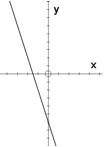
        
        \[Figure 2\]
        
    3.  
        
        \[Figure 3\]
        
    4.  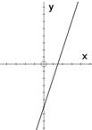
        
        \[Figure 4\]
        
4.  \_\_\_\_\_\_\_\_\_\_ What is the $y-$intercept of the line that passes through the point (4, 1) and has a slope of $-\frac{2}{3}$?
    1.  $(0, 11)$
    2.  $\left ( 0, \frac{11}{3} \right )$
    3.  $\left ( 0, \frac{5}{3} \right )$
    4.  $(0, 1)$
5.  \_\_\_\_\_\_\_\_\_\_ A line that is perpendicular to the $y-$axis has a slope that is \_\_\_\_\_\_\_\_\_\_
    1.  undefined
    2.  equal to one
    3.  equal to the $x-$intercept
    4.  equal to zero
6.  \_\_\_\_\_\_\_\_\_\_ What is the equation of the line that passes through the points $A(2, 1)$ and $B(4, 5)$?
    1.  $y = \frac{1}{2}x$
    2.  $y = 2x - 3$
    3.  $y = 2x$
    4.  $y = \frac{1}{2}x - 3$
7.  \_\_\_\_\_\_\_\_\_\_ What is the equation of the line that passes through the point (–9, 6) and is perpendicular to the $x-$axis?
    1.  $y = -9$
    2.  $x = 6$
    3.  $x = -9$
    4.  $y = 6$
8.  \_\_\_\_\_\_\_\_\_\_ When an equation of a line is written in slope-intercept form, what does the letter ‘$b$’ represent?
    1.  the $y-$intercept
    2.  the $x-$intercept
    3.  the slope
    4.  the origin
9.  \_\_\_\_\_\_\_\_\_\_ What is the equation of a line that passes through (0, 7) and is parallel to the $x-$axis?
    1.  $x = 0$
    2.  $x = 7$
    3.  $y = 0$
    4.  $y = 7$
10. \_\_\_\_\_\_\_\_\_\_ What is the equation of the line graphed below? 
    
    \[Figure 5\]
    
    1.  $4x - 7y + 28 = 0$
    2.  $4x + 7y - 28 = 0$
    3.  $7x + 4y + 16 = 0$
    4.  $7x - 4y - 16 = 0$

Answers to Quiz II
------------------

1.  A
2.  C
3.  A
4.  B
5.  D
6.  B
7.  C
8.  A
9.  D
10. B

</article>

### 4.8 Linear Function as a Model

<article>

Applications of Linear Functions
--------------------------------

**Introduction**

In this lesson you will learn that linear relationships are often used to model real-life situations. To do this, two data values related to the real-life situation must be present in the problem. These two data values in context will give you the information necessary to create a graph and an equation to model the real-life situation. The graph and the equation will be more meaningful if the axis is labelled according to the items in the problem and if variables representing these items are used in the equation. When the data values have been represented graphically and the equation of the line has been determined, questions relating to the real-life situation can be presented and answered.

**Objectives**

The lesson objectives for Linear Function as a Model:

* Understanding how to determine the equation of a line that models a real-life situation
* Understanding the meaning of the slope of a line as it applies to real-life situations
* Understanding how to use the equation to answer problems related to the real-life situation

**Introduction**

In this lesson, you will learn that linear functions can be applied to real-life problems. When equations and graphs are used to model real-life situations, the domain of the graph is often $x \epsilon N$. However, it is often more convenient to sketch the graph as though $x \epsilon R$ instead of showing the function as a series of points in the plane.

**Watch This**

[Khan Academy Basic Linear Function](https://www.youtube.com/watch?v=YB1XuQ1Pc5s)

!?[video](https://www.youtube.com/watch?v=YB1XuQ1Pc5s)

**Guidance**

Joe’s Warehouse has banquet facilities to accommodate a maximum of 250 people. When the manager quotes a price for a banquet she is including the cost of renting the room plus the cost of the meal. A banquet for 70 people costs $1300. For 120 people, the price is $2200.

(a) Plot a graph of cost versus the number of people.

(b) From the graph, estimate the cost of a banquet for 150 people.

(c) Determine the slope of the line. What quantity does the slope of the line represent?

(d) Write an equation to model this real-life situation.

(a) On the $x-$axis is the number of people and on the $y-$axis is the cost of the banquet.

 The approximate cost of a banquet for 150 people is $2700.")

(c) The two data points (70, 1300) and (120, 2200) will be used to calculate the slope of the line.

$$
\begin{align*}
m &= \frac{y_2-y_1}{x_2-x_1}\\
m &= \frac{2200-1300}{120-70}\\
m &= \frac{900}{50}\\
m &= \frac{18}{1}
\end{align*}
$$

The slope represents the cost of the banquet for each person. The cost is $18 per person.

When a linear function is used to model the real life situation, the equation can be written in the form $y=mx+b$ or in the form $Ax+By+C=0$.

(d) 

$$
\begin{align*}
y &= mx+b\\
{\color{red}1300} &= {\color{red}18}({\color{red}70})+b\\
1300 &= 1260+b\\
1300 {\color{red}-1260} &= 1260 {\color{red}-1260}+b\\
40 &=b
\end{align*}
$$

The $y-$intercept is (0, 40)

The equation to model the real-life situation is $y=18x+40$. The variables should be changed to match the labels on the axes. The equation that best models the situation is $c=18n+40$ where ‘$c$’ represents the cost and ‘$n$’ represents the number of people.

**Example A**

A cab company charges $2.00 for the first 0.6 miles and $0.50 for each additional 0.2 miles.

(a) Draw the graph of cost versus distance.

(b) Determine the equations that model this situation.

(c) What is the cost to travel 16 miles by cab?

**This example will demonstrate a real-life situation that cannot be modeled with just one equation.**

(a) On the $x-$axis is the distance in miles and on the $y-$axis is the cost in dollars. The first graph from $A$ to $B$ extends horizontally across the distance from 0 to 0.6 miles. The cost is constant at $2.00. The equation for this constant function is $y=2.00$ or $c=2.00$. The second graph from $B$ to $C$ and upward is not constant.

 The equation that models the second graph can be determined by using the data points (0.6, 2.00) and (1, 3.00). This second data point was found by locating a point on the graph that has exact coordinates.")

$$
\begin{align*}
m &= \frac{y_2-y_1}{x_2-x_1} && \text{Use the data points to calculate the slope.}\\
m &= \frac{3.00-2.00}{1-0.6}\\
m &= \frac{3.00-2.00}{1-0.6}\\
m &= \frac{1.00}{0.4}\\
m &= 2.5\\
\\
y-y_1 &= m(x-x_1) && \text{Use the slope and one point to determine the equation.}\\
y- {\color{red}2} &= {\color{red}2.5} (x- {\color{red}0.6})\\
y-2 &= 2.5x-1.5\\
y-2 {\color{red}+2} &= 2.5x-1.5 {\color{red}+2}\\
y &= 2.5x+0.5\\
c &= 2.5d+0.5
\end{align*}
$$

Therefore, the equations that model this situation are:

$$
\begin{align*}
c=\begin{Bmatrix}
2.00 & 0<d \le 0.6 \\
2.5d+0.5 & d>0.6
\end{Bmatrix}
\end{align*}
$$

(c) The cost to travel 16 miles in the cab is:

The distance is greater than 0.6 miles. The cost must be calculated using the equation $c=2.5d+0.5$. Substitute 16 in for ‘$d$’.

$$
\begin{align*}
& c = 2.5d+0.5\\
 & c = 2.5 ({\color{red}16})+0.5\\
 & c = 2.5({\color{red}16})+0.5\\
 & \boxed{c = \$ 40.50}
\end{align*}
$$

**Example B**

When a 40 gram mass was suspended from a coil spring, the length of the spring was 24 inches. When an 80 gram mass was suspended from the same coil spring, the length of the spring was 36 inches.

(a) Plot a graph of length versus mass.

(b) From the graph, estimate the length of the spring for a mass of 70 grams.

(c) Determine an equation that models this situation. Write the equation in slope-intercept form.

(d) Use the equation to determine the length of the spring for a mass of 60 grams.

(e) What is the $y-$intercept? What does the $y-$intercept represent?

(a) On the $x-$axis is the mass in grams and on the $y-$axis is the length of the spring in inches.

 The length of the coil spring for a mass of 70 grams is approximately 33 inches.")

(c) The equation of the line can be determined by using the two data values (40, 24) and (80, 36).

$$
\begin{align*}
m &= \frac{y_2-y_1}{x_2-x_1}\\
m &= \frac{36-24}{80-40}\\
m &= \frac{12}{40}\\\
m &= \frac{3}{10}\\
\\
y &= mx+b\\
{\color{red}24} &= {\color{red}\frac{3}{10}}({\color{red}40})+b\\
24 &= \frac{3}{\cancel{10}} \left(\overset{{\color{red}4}}{\cancel{40}}\right)+b\\
24 &= 12+b\\
24 {\color{red}-12} &= 12 {\color{red}-12}+b\\
12 &= b
\end{align*}
$$

The $y-$intercept is (0, 12). The equation that models the situation is

$y=\frac{3}{10}x+12$

$\boxed{l=\frac{3}{10} m+12}$

where ‘$l$’ is the length of the spring in inches and ‘$m$’ is the mass in grams.

(d) 

$$
\begin{align*}
& l = \frac{3}{10}m+12 && \text{Use the equation and substitute} \ 60 \ \text{in for} \ m.\\
& l = \frac{3}{10}({\color{red}60})+12\\
& l = \frac{3}{\cancel{10}} \left(\overset{{\color{red}6}}{\cancel{60}}\right)+12\\
& l = 18+12\\
& \boxed{l = 30 \ inches}
\end{align*}
$$

(e) The $y-$intercept is (0, 12). The $y-$intercept represents the length of the coil spring before a mass was suspended from it. The length of the coil spring was 12 inches.

**Example C**

Juan drove from his mother’s home to his sister’s home. After driving for 20 minutes he was 62 miles away from his sister’s home and after driving for 32 minutes he was only 38 miles away. The time driving and the distance away from his sister’s home form a linear relationship.

(a) What is the independent variable? What is the dependent variable?

(b) What are the two data values?

(c) Draw a graph to represent this problem. Label the axis appropriately.

(d) Write an equation expressing distance in terms of time driving.

(e) What is the slope and what is its meaning in this problem?

(f) What is the time-intercept and what does it represent?

(g) What is the distance-intercept and what does it represent?

(h) How far is Juan from his sister’s home after he has been driving for 35 minutes?

(a) The independent variable is the time driving. The dependent variable is the distance.

(b) The two data values are (20, 62) and (32, 38).

(c) On the $x-$axis is the time in minutes and on the $y-$axis is the distance in miles.

 (20, 62) and (32, 38) are the coordinates that will be used to calculate the slope of the line.")

$$
\begin{align*}
m &= \frac{y_2-y_1}{x_2-x_1}\\
m &= \frac{38-62}{32-20}\\
m &= \frac{-24}{12}\\
m &= -2\\
\\
y &= mx+b\\
{\color{red}62} &= {\color{red}-2} ({\color{red}20})+b\\
62 &= -40+b\\
62 {\color{red}+40} &= -40 {\color{red}+40}+b\\
102 &= b \qquad \text{The} \ y- \text{intercept is} \ (0, 102)
\end{align*}
$$

$$
\begin{align*}
y &= mx+b\\
y &= -2x+102\\
d &= -2t+102
\end{align*}
$$

(e) The slope is $-2=\frac{-2}{1}=\frac{-2(miles)}{1(minute)}$. The slope means that for each minute of driving, the distance that Juan has to drive to his sister’s home is reduced by 2 miles.

(f) The time-intercept is actually the $x-$intercept. This value is:

$$
\begin{align*}
d &= -2t+102 && \text{Set} \ d=0 \ \text{and solve for} \ t.\\
{\color{red}0} &= -2t+102\\
0 {\color{red}+2t} &= -2t {\color{red}+2t}+102\\
2t &= 102\\
\frac{2t}{{\color{red}2}} &= \frac{102}{{\color{red}2}}\\
\frac{\cancel{2}t}{\cancel{2}} &= \frac{102}{2}\\
t &= 51 \ minutes
\end{align*}
$$

The time-intercept is 51 minutes and this represents the time it took Juan to drive from his mother’s home to his sister’s home.

(g) The distance-intercept is the $y-$intercept. This value has been calculated as (0, 102). The distance-intercept represents the distance between his mother’s home and his sister’s home. The distance is 102 miles.

(h)

$$
\begin{align*}
d &= -2t+102 && \text{Substitute} \ 35 \ \text{into the equation for} \ t \ \text{and solve for} \ d.\\
d &= -2 ({\color{red}35})+102\\
d &= -70+102\\
d &= 32 \ miles
\end{align*}
$$

After driving for 35 minutes, Juan is 32 miles from his sister’s home.

**Guided Practice**

1. Some college students, who plan on becoming math teachers, decide to set up a tutoring service for high school math students. One student was charged $25 for 3 hours of tutoring. Another student was charged $55 for 7 hours of tutoring. The relationship between the cost and time is linear.

(a) What is the independent variable?

(b) What is the dependent variable?

(c) What are two data values for this relationship?

(d) Draw a graph of cost versus time.

(e) Determine an equation to model the situation.

(f) What is the significance of the slope?

(g) What is the cost-intercept? What does the cost-intercept represent?

2. A Glace Bay developer has produced a new handheld computer called the **_Blueberry_**. He sold 10 computers in one location for $1950 and 15 in another for $2850. The number of computers and cost forms a linear relationship

(a) State the dependent and independent variables.

(b) Sketch a graph.

(c) Find an equation expressing cost in terms of the number of computers.

(d) State the slope of the line and tell what the slope means to the problem.

(e) State the cost-intercept and tell what it means to this problem.

(f) Using your equation, calculate the number of computers you could get for $6000.

3. Handy Andy sells one quart can of paint thinner for $7.65 and a two quart can for $13.95. Assume there is a linear relationship between the volume of paint thinner and the price.

(a) What is the independent variable?

(b) What is the dependent variable?

(c) Write two data values for this relationship.

(d) Draw a graph to represent this relationship.

(e) What is the slope of the line?

(f) What does the slope represent in this problem?

(g) Write an equation to model this problem.

(h) What is the cost-intercept?

(i) What does the cost-intercept represent in this problem?

(j) How much would you pay for 6 quarts of paint thinner?

**Answers**

1. (a) The cost for tutoring depends upon the amount of time. The independent variable is the time.

(b) The dependent variable is the cost.

(c) Two data values for this relationship are (3, 25) and (7, 55).

(d) On the $x-$axis is the time in hours and on the $y-$axis is the cost in dollars.

 Use the two data values (3, 25) and (7, 55) to calculate the slope of the line.")

$$
\begin{align*}
m &= \frac{y_2-y_1}{x_2-x_1}\\
m &= \frac{55-25}{7-3}\\
m &= \frac{30}{4}\\
m &= \frac{15}{2}
\end{align*}
$$

Determine the $y-$intercept of the graph.

$$
\begin{align*}
y&=mx+b\\
{\color{red}25}&= {\color{red}\frac{15}{2}}( {\color{red}3})+b && \text{Use the slope and one of the data values to determine the value of} \ b.\\
25 &= \frac{45}{2}+b\\
25 {\color{red}-\frac{45}{2}} &= \frac{45}{2} {\color{red}-\frac{45}{2}}+b\\
{\color{red}\frac{50}{2}}-\frac{45}{2} &= b\\
\frac{5}{2} &= b
\end{align*}
$$

The $y-$intercept is $\frac{5}{2}$

The equation to model the relationship is $y=\frac{15}{2}x+\frac{5}{2}$. To match the variables of the equation with the graph the equation is $\boxed{c=\frac{15}{2}t+\frac{5}{2}}$. The relationship is cost in dollars versus time in hours. The equation could also be written as $\boxed{c=7.50t+2.50}$

(f) The slope of $\frac{15}{2}$ means that it costs $15.00 for 2 hours of tutoring. If the slope is expressed as a decimal, it means that it costs $7.50 for 1 hour of tutoring.

(g) The cost-intercept is the $y-$intercept. The $y-$intercept is (0, 2.50). This value could represent the cost of having a scheduled time or the cost that must be paid for cancelling the appointment. In a problem like this, the $y-$intercept must be represented by a meaningful quantity for the problem.

2. (a) The number of dollars in sales from the computers depends upon the number of computers sold. The dependent variable is the dollars in sales and the independent variable is the number of computers sold.

(b) On the $x-$axis is the number of computers and on the $y-$axis is the cost of the computers.

 Use the data values (10, 1950) and (15, 2850) to calculate the slope of the line.")

$$
\begin{align*}
m &= \frac{y_2-y_1}{x_2-x_1}\\
m &= \frac{2850-1950}{15-10}\\
m &= \frac{900}{5}\\
m &= 180
\end{align*}
$$

Determine the $y-$intercept of the graph.

$$
\begin{align*}
y &= mx+b\\
1950 &= 180(10)+b\\
1950 &= 1800+b\\
1950-1800 &= 1800-1800+b\\
150 &= b
\end{align*}
$$

The $y-$intercept is (0, 150).

The equation of the line that models the relationship is

$\boxed{y=180x+150}$

To make the equation match the variables of the graph the equation is

$\boxed{c=180n+150}$

(d) The slope is $\frac{180}{1}$. This means that the cost of one computer is $180.00

(e) The cost intercept is the $y-$intercept. The $y-$intercept is (0, 150). This could represent the cost of renting the location where the sales are being made or perhaps the salary for the sales person.

(f) 

$$
\begin{align*}
c &= 180n+150\\
6000 &= 180n+150\\
6000-150 &= 180n+150-150\\
5850 &= 180n\\
\frac{5850}{180} &= \frac{180n}{180}\\
\frac{5850}{180} &= \frac{\cancel{180} n}{\cancel{180}}\\
32.5 &= n
\end{align*}
$$

With $6000 you could get **32** computers.

3. (a) The independent variable is the volume of paint thinner.

(b) The dependent variable is the cost of the paint thinner.

(c) Two data values are (1, 7.65) and (2, 13.95).

(d) On the $x-$axis is the volume in quarts and on the $y-$axis is the cost in dollars.

 Use the two data values (1, 7.65) and (2, 13.95) to calculate the slope of the line.")

$$
\begin{align*}
m &= \frac{y_2-y_1}{x_2-x_1}\\
m &= \frac{13.95-7.65}{2-1}\\
m &= \frac{6.30}{1}
\end{align*}
$$

(f) The slope represents the cost of one quart of paint thinner. The cost is $6.30.

(g) 

$$
\begin{align*}
y &= mx+b\\
7.65 &= 6.30(1)+b\\
7.65 &= 6.30+b\\
7.65-6.30 &= 6.30-6.30+b\\
1.35 &= b
\end{align*}
$$

The $y-$intercept is (0, 1.35). The equation to model the relationship is

$y=6.30x+1.35$

The equation that matches the variables of the graph is $\boxed{c=6.30v+1.35}$

(h) The cost-intercept is (0, 1.35).

(i) This could represent the cost of the can that holds the paint thinner.

(j) 

$$
\begin{align*}
c &= 6.30v+1.35\\
c &= 6.30(6)+1.35\\
c &= 37.80+1.35\\
c &= \$39.15
\end{align*}
$$

The cost of 6 quarts of paint thinner is $39.15.

**Summary**

In this lesson you have learned that real-life problems can be represented by graphs and linear equations. The slope and the $y-$intercept both have significance that is reflected in the problem. The linear relationship can be modeled by a linear equation that reflects the variables of the graph. The equations can be written in either standard form or in $y-$intercept form.

Data that is discrete is represented using a linear graph instead of a set of plotted points.

**Problem Set**

**Completely answer the following problems...**

1.  Players on the school soccer team are selling candles to raise money for an upcoming trip. Each player has 24 candles to sell. If a player sells 4 candles a profit of $30 is made. If he sells 12 candles a profit of $70 is made. The profit and the number of candles sold form a linear relation.
    1.  State the dependent and the independent variables.
    2.  What are the two data values for this relation?
    3.  Draw a graph and label the axis.
    4.  Determine an equation to model this situation.
    5.  What is the slope and what does it mean in this problem?
    6.  Find the profit-intercept and explain what it represents.
    7.  Calculate the maximum profit that a player can make.
    8.  Write a suitable domain and range.
    9.  If a player makes a profit of $90, how many candles did he sell?
    10. Is this data continuous or discrete? Justify your answer.
2.  Jacob leaves his summer cottage and drives home. After driving for 5 hours, he is 112 km from home, and after 7 hours, he is 15 km from home. Assume that the distance from home and the number of hours driving form a linear relationship.
    1.  State the dependent and the independent variables.
    2.  What are the two data values for this relationship?
    3.  Represent this linear relationship graphically.
    4.  Determine the equation to model this situation.
    5.  What is the slope and what does it represent?
    6.  Find the distance-intercept and its real-life meaning in this problem.
    7.  How long did it take Jacob to drive from his summer cottage to home?
    8.  Write a suitable domain and range.
    9.  How far was Jacob from home after driving 4 hours?
    10. How long had Jacob been driving when he was 209 km from home?

Summary
-------

In this lesson you have learned to apply the equation of a linear relationship to a real-life situation. Two data values from the problem were used to determine the equation of the line. The slope of the line represented a meaningful quantity of the problem. The $y-$intercept also had significance for the real-life situation. The significance of the $y-$intercept must represent a quantity that is meaningful for the problem.

</article>

### 4.9 Chapter Test

<article>

1.  Using the slope-intercept method, graph each of the following functions in the space provided. Show all work needed to draw the graph. State the slope and the $y-$intercept.
    1.  $3x - 5y - 20 = 0$ 
        
        \[Figure 1\]
        
    2.  $0 = 2x - 10$ 
        
        \[Figure 2\]
        
2.  The cost of renting a snowboard at the local ski hill is shown on the graph below. 
    
    \[Figure 3\]
    
    1.  What is the slope of this line?
    2.  What is the significance of the slope for this problem?
    3.  What is the $y-$intercept?
    4.  What does the $y-$intercept represent?
3.  The four vertices of quadrilateral $ABCD$ are given by $A(-8, 4), B(3, 2), C(9, 10),$ and $D(-2, 12)$. Without graphing, prove that the quadrilateral is a parallelogram.
4.  Panther Patty is selling Panther Graduate figurines to the graduates of Glace Bay High. If he sells 4 figurines, he makes a profit of $30. If he sells 10, he makes a profit of $50. His profit and the number of figurines form a linear relationship. He has only 18 figurines to sell.
    1.  What is the independent variable? What is the dependent variable?
    2.  Draw a graph that models the relationship. 
        
        \[Figure 4\]
        
    3.  Write an equation to represent this relationship. (Show all work)
    4.  What is the slope and what does it represent in this problem?
    5.  What is the profit-intercept and what is its meaning in this problem?
    6.  Calculate the maximum profit that Panther Patty can make.
    7.  Write a suitable domain and range for the problem.
5.  On the graph draw the line $2x -5y + 20 = 0$ and the perpendicular line that passes through (3, –2) 
    
    \[Figure 5\]

</article>

## 5.0 More than One Solution to the Problem

<article>

**Introduction**

In this chapter you will learn about systems of equations. You will first learn what is meant by a system of linear equations and what is meant by the solution. You will learn several methods that can be used to solve a system of linear equations. The methods that you will learn are graphing, substitution (including the comparison method), and elimination (also known as the addition and subtraction method). This chapter will concentrate on $2 \times 2$ systems of linear equations.

This knowledge will then be applied to writing a system of equations for a given real-world problem and using the system to solve the problem.

You will then proceed to solving systems of linear inequalities by graphing to determine a common or feasible region. The concepts will then be applied to real-world problems to determine the best solution to the given problem.

**Lessons**

In this chapter you will do the following lessons:

* Solving Systems of Linear of Equations by Graphing
* Solving Systems of Linear Equations by Substitution
* Solving Systems of Linear Equations by Addition and Subtraction
* Real-World Applications of Systems of Linear Equations
* Solving Systems of Linear Inequalities by Graphing
* Real-World Applications of Systems of Linear Inequalities

</article>

### 5.1 Solving Systems of Linear Equations

<article>

Solving Systems of Linear Equations by Graphing
-----------------------------------------------

**Objectives**

The lesson objectives for Solving Systems of Linear Equations by Graphing are:

* Understanding what is meant by a system of linear equations
* Consistent systems of linear equations
* Independent and dependent systems of linear equations
* Equivalent systems of linear equations
* Inconsistent systems of linear equations

**Introduction**

In a previous chapter you learned how to solve linear equations with one variable. The solution was a number that belonged to the real number system. When the solution replaced the variable in the original equation and when this solution was correct, both sides of the equation were equal.

In this lesson you will learn to solve a linear equation that has two variables by using two linear equations that have two variables. This is known as a $2 \times 2$ system of linear equations. In general: 

$$
\begin{Bmatrix} a_1 {\color{red}x}+b_1{\color{blue}y}=c_1\\a_2{\color{red}x}+b_2{\color{blue}y}=c_2 \end{Bmatrix}
$$

 where ‘$a$’ is the coefficient of ‘${\color{red}x}$’; ‘$b$’ is the coefficient of ‘${\color{blue}y}$’; and ‘$c$’ is a constant. The subscripts of 1 and 2 simply refer to the first equation and the second equation.

The first method of solving a system of linear equations will be graphing.

**Watch This**

[Khan Academy Solving Systems by Graphing 3](http://www.youtube.com/watch?v=F5Nb6cIRZLU)

!?[video](https://www.youtube.com/watch?v=F5Nb6cIRZLU)

**Guidance**

When you graph two equations with two variables on the same Cartesian plane, the resulting lines may intersect. The following linear equations will be graphed by using the slope-intercept method.

$$
\begin{align*}
& \begin{Bmatrix}
2x+y = 5 \\
x-y = 1
\end{Bmatrix}\\
& 2x+y = 5\\
& 2x {\color{red}-2x}+y = 5 {\color{red}-2x}\\
& y = 5 {\color{red}-2x}\\
& \boxed{y = -2x+5}\\
& x-y = 1\\
& x {\color{red}-x}-y = 1 {\color{red}-x}\\
& -y = 1-x\\
& \frac{-y}{{\color{red}-1}} = \frac{1}{{\color{red}-1}}-\frac{x}{{\color{red}-1}}\\
& y = -1+x\\
& \boxed{y = x-1}
\end{align*}
$$

.")

**Example A**

Solve the following system of linear equations graphically:

$$
\begin{Bmatrix}
x-2y -2= 0 \\
3x+4y = 16
\end{Bmatrix}
$$

Both equations will be graphed on the same Cartesian plane using the slope-intercept method.

(NOTE): You could graph the equations using the $x$ and $y-$intercepts or the slope-intercept method. The same result will occur regardless of the method used to graph the lines.

Begin by writing each linear equation in slope-intercept form.

$$
\begin{align*}
& x-2y-2 = 0\\
& x {\color{red}-x}-2y-2 = 0 {\color{red}-x}\\
& -2y-2 = -x\\
& -2y-2 {\color{red}+2} = -x {\color{red}+2}\\
& -2y = -x+2\\
& \frac{-2y}{{\color{red}-2}} = \frac{-x}{{\color{red}-2}}+\frac{2}{{\color{red}-2}}\\
& \boxed{y = \frac{1}{2}x-1} \qquad \text{Equation One}
\end{align*}
$$

$$
\begin{align*}
& 3x+4y = 16\\
& 3x {\color{red}-3x}+4y = 16 {\color{red}-3x}\\
& 4y = 16-3x\\
& \frac{4y}{{\color{red}4}} = \frac{16}{{\color{red}4}}-\frac{3x}{{\color{red}4}}\\
& y = 4-\frac{3}{4}x\\
& \boxed{y = -\frac{3}{4}x+4} \qquad \text{Equation Two}
\end{align*}
$$

Graph both equations on the same Cartesian plane.

. When two equations place two conditions on two of the same variables at the same time, a system of simultaneous equations is formed. The solution is an ordered pair which satisfies both of the equations in the system. If an ordered pair satisfies an equation, replacement of the variables with the values will result in both sides of the equation being equal.")

Test (4, 1) in equation one:

$$
\begin{align*}
x-2y-2 &= 0 && \text{Use the original equation}\\
({\color{red}4})-2({\color{red}1})-2 &= 0 && \text{Replace} \ x \ \text{with} \ 4 \ \text{and replace} \ y \ \text{with} \ 1.\\
4-2-2 &= 0 && \text{Perform the indicated operations and simplify the result.}\\
4-{\color{red}4} &= 0\\
{\color{red}0} &= 0 && \text{Both sides of the equation are equal. The ordered pair} \ (4, 1) \ \text{satisfies the equation.}
\end{align*}
$$

Test (4, 1) in equation two:

$$
\begin{align*}
3x+4y &= 16 && \text{Use the original equation}\\
3({\color{red}4})+4({\color{red}1}) &= 16 && \text{Replace} \ x \ \text{with} \ 4 \ \text{and replace} \ y \ \text{with} \ 1.\\
12+4 &= 16 && \text{Perform the indicated operations and simplify the result.}\\
{\color{red}16} &= 16 && \text{Both sides of the equation are equal. The ordered pair} \ (4, 1) \ \text{satisfies the equation.}
\end{align*}
$$

This system of simultaneous equations has a solution and is therefore called a **consistent** system. Because it has only one ordered pair as a solution, it is called an **_independent_** system.

**Example B**

Solve the following system of linear equations graphically:

$$
\begin{Bmatrix}
2y-3x = 6 \\
4y-6x = 12
\end{Bmatrix}
$$

Both equations will be graphed on the same Cartesian plane using the intercept method.

Let $x = 0$. Solve for $y$

$$
\begin{align*}
& 2y-3x = 6\\
& 2y-3 ({\color{red}0}) = 6 \quad \text{Replace} \ x \ \text{with zero.}\\
& 2y = 6 \qquad \qquad \text{Simplify}\\
& \frac{2y}{{\color{red}2}} = \frac{6}{{\color{red}2}} \qquad \quad \ \ \text{Solve for} \ y.\\
& \boxed{y = 3} \qquad \qquad \text{The} \ y- \text{intercept is} \ (0, 3)
\end{align*}
$$

Let $y = 0$. Solve for $x$.

$$
\begin{align*}
& 2y-3x = 6\\
& 2({\color{red}0})-3x = 6 \qquad \text{Replace} \ y \ \text{with zero.}\\
& -3x = 6 \qquad \quad \ \ \text{Simplify}\\
& \frac{-3x}{{\color{red}-3}} = \frac{6}{{\color{red}-3}} \qquad \ \ \ \text{Solve for} \ x.\\
& \boxed{x = -2} \qquad \qquad \text{The} \ x- \text{intercept is} \ (-2, 0)
\end{align*}
$$

$$
\begin{align*}
& 4y-6x = 12\\
& 4y-6 ({\color{red}0}) = 12 \qquad \text{Replace} \ x \ \text{with zero.}\\
& 4y = 12 \qquad \qquad \quad \text{Simplify}\\
& \frac{4y}{{\color{red}4}} = \frac{12}{{\color{red}4}} \qquad \qquad \ \ \text{Solve for} \ y.\\
& \boxed{y = 3} \qquad \qquad \quad \ \text{The} \ y- \text{intercept is} \ (0, 3)
\end{align*}
$$

Let $y = 0$. Solve for $x$.

$$
\begin{align*}
& 4y-6x = 12\\
& 4 ({\color{red}0})-6x = 12 \qquad \text{Replace} \ y \ \text{with zero.}\\
& -6x = 12 \qquad \quad \ \ \text{Simplify}\\
& \frac{-6x}{{\color{red}-6}} = \frac{12}{{\color{red}-6}} \qquad \quad \ \text{Solve for} \ x.\\
& \boxed{x = -2} \qquad \qquad \ \text{The} \ x- \text{intercept is} \ (-2, 0)
\end{align*}
$$

$$
\begin{Bmatrix}
2y-3x = 6 \\
4y-6x = 12
\end{Bmatrix}
$$

, equation two is simply a multiple of equation one.

**Example C**

Although example A had only one ordered pair as its solution and example B had an infinite number of ordered pairs as its solution, both systems are consistent systems of equations.

Two systems of equations are **_equivalent_** if they have the same solution set. If example A is considered 

$$
\begin{Bmatrix}
x-2y-2=0 \\ 3x+4y = 16 \end{Bmatrix}
$$

 the ordered pair (4, 1) is the solution for this system.

If the equations are both set equal to zero, then they are equal to each other. (Commutative Property)

$$
\begin{Bmatrix}
x-2y-2=0 \\
3x+4y-16=0
\end{Bmatrix}
$$

If the equations are then added, $(x-2y-2)+(3x+4y-16)=0$ the result is $4x+2y-18=0$.

The graph of the three equations, on the same Cartesian grid, is shown below:

. The point (4, 1) can be tested in the equation $4x+2y-18=0$.")

$$
\begin{align*}
4x+2y-18 &=0 && \text{Use the original equation}\\
4({\color{red}4})+2({\color{red}1})-18 &= 0 && \text{Replace} \ x \ \text{with} \ 4 \ \text{and replace} \ y \ \text{with} \ 1.\\
16+2-18 &= 0 && \text{Perform the indicated operations and simplify the result.}\\
18- {\color{red}18} &= 0\\
{\color{red}0} &= 0 && \text{Both sides of the equation are equal. The ordered pair} \ (4, 1) \ \text{satisfies the equation.}
\end{align*}
$$

The ordered pair (4, 1) satisfies the three equations and is a solution for all of the equations.

Therefore: 

$$
\begin{align*}
& \begin{Bmatrix}
x-2y-2=0 \\
3x+4y-16=0
\end{Bmatrix}
\end{align*}
$$

 and 

$$
\begin{Bmatrix}
x-2y-2=0 \\
4x+2y-18=0
\end{Bmatrix}
$$

 and 

$$
\begin{Bmatrix}
3x+4y-16=0 \\
4x+2y-18=0
\end{Bmatrix}
$$

 are **_equivalent_** equations.

This same concept can be extended to include multiples of an equation.

**Example D**

Solve the following system of linear equations graphically:

$$
\begin{Bmatrix}
3x+4y=12 \\
6x+8y=-8
\end{Bmatrix}
$$

Both equations will be graphed on the same Cartesian plane using the slope-intercept method.

Begin by writing each linear equation in slope-intercept form.

$$
\begin{align*}
& 3x+4y = 12\\
& 3x {\color{red}-3x}+4y = 12 {\color{red}-3x}\\
& 4y = 12 {\color{red}-3x}\\
& \frac{4y}{{\color{red}4}} = \frac{12}{{\color{red}4}}-\frac{3x}{{\color{red}4}}\\
& y = 3-\frac{3}{4}x\\
& \boxed{y = -\frac{3}{4}x+3}
\end{align*}
$$

$$
\begin{align*}
& 6x+8y = -8\\
& 6x {\color{red}-6x}+8y = -8 {\color{red}-6x}\\
& 8y = -8 {\color{red}-6x}\\
& \frac{8y}{{\color{red}8}} = \frac{-8}{{\color{red}8}}-\frac{6x}{{\color{red}8}}\\
& y = -1-\frac{6}{{\color{red}8}}x\\
& \boxed{y = -\frac{6}{8}x-1}
\end{align*}
$$

$. A system of linear equations that has no solution is called an **_inconsistent_** system.")

**Example E**

Before technology was introduced, graphing was not considered the best way to determine the solution for a system of linear equations, especially if the solutions were not integers. However, technology has changed this outlook. In this example, technology will be used to determine the solution for 

$$
\begin{Bmatrix}
x+4y=-14 \\
2x-y=4
\end{Bmatrix}
$$

.

To use technology, the equations must be written in slope-intercept form:

$$
\begin{align*}
& x+4y = -14\\
& x {\color{red}-x}+4y = {\color{red}-x}-14\\
& 4y = {\color{red}-x}-14\\
& \frac{4y}{{\color{red}4}} = -\frac{x}{{\color{red}4}}-\frac{14}{{\color{red}4}}\\
& y = -\frac{1}{4}x-\frac{14}{4}\\
& \boxed{y = -\frac{1}{4}x-\frac{7}{2}}
\end{align*}
$$

$$
\begin{align*}
& 2x-y = 4\\
& 2x {\color{red}-2x}-y = {\color{red}-2x}+4\\
& -y = -2x+4\\
& \frac{-y}{{\color{red}-1}} = \frac{-2x}{{\color{red}-1}}+\frac{4}{{\color{red}-1}}\\
& \boxed{y = 2x-4}
\end{align*}
$$

The equations are both in slope-intercept form. Set the window on the calculator as shown below:

.")

The following represent the keys that were pressed on the calculator to obtain the above results:

__Consistent System of Linear Equations__

A **_consistent system of linear equations_** is a system of linear equations that has a solution. The solution may be one solution or an infinite number of solutions.

__Dependent System of Linear Equations__

A **_dependent system of linear equations_** is a system of linear equations that has an infinite number of solutions. The equations are multiples and the graphs of each equation are the same. Therefore, an infinite number of ordered pairs satisfy both equations.

__Equivalent Systems of Linear Equations__

**_Equivalent systems of linear equations_** are systems of linear equations that have the same solution set.

__Inconsistent System of Linear Equations__

An **_inconsistent system of linear equations_** is a system of linear equations that has no solution. The graphs of inconsistent systems of linear equations are parallel lines. The lines never intersect so there is no common point of intersection.

__Independent System of Linear Equations__

An **_independent system of linear equations_** is a system of linear equations that has one solution. There is only one ordered pair that satisfies both equations.

__System of Linear Equations__

A **_system of linear equations_** is two linear equations each having two variables. This type of system – two equations with two unknowns - is called a $2 \times 2$ system of linear equations.

**Guided Practice**

1. Solve the following system of linear equations by graphing: 

$$
\begin{Bmatrix}
-3x+4y=20 \\
x-2y=-8
\end{Bmatrix}
$$

Is the system consistent and dependent, consistent and independent, or inconsistent?

2. For the following system of consistent and independent linear equations, write equivalent systems of equations. 

$$
\begin{Bmatrix}
4x+2y=8 \\
-2x+3y=20
\end{Bmatrix}
$$

.

3. Use technology to determine whether the system is consistent and independent, consistent and dependent, or inconsistent.

i) 

$$
\begin{Bmatrix}
3x-2y=8 \\
6x-4y=20
\end{Bmatrix}
$$

ii) 

$$
\begin{Bmatrix}
x+3y=4 \\
5x-y=4
\end{Bmatrix}
$$

**Answers**

1. 

$$
\begin{Bmatrix}
-3x+4y=20 \\
x-2y=-8
\end{Bmatrix}
$$

 Begin by writing the equations in slope-intercept form.

$$
\begin{align*}
& -3x+4y = 20\\
& -3x {\color{red}+3x}+4y = 20 {\color{red}+3x}\\
& 4y = 20+3x\\
& \frac{4y}{{\color{red}4}} = \frac{20}{{\color{red}4}}+\frac{3x}{{\color{red}4}}\\
& y = {\color{red}5}+\frac{3}{4}x\\
& \boxed{y = \frac{3}{4}x+5}
\end{align*}
$$

$$
\begin{align*}
& x-2y = -8\\
& x {\color{red}-x}-2y = -8 {\color{red}-x}\\
& -2y = -8-x\\
& \frac{-2y}{{\color{red}-2}} = \frac{-8}{{\color{red}-2}}-\frac{x}{{\color{red}-2}}\\
& y = {\color{red}4}+\frac{1}{2}x\\
& \boxed{ y = \frac{1}{2}x+4 }
\end{align*}
$$

. This ordered pair is the one solution for the system of linear equations. The system is **consistent** and **independent**.")

2. 

$$
\begin{Bmatrix}
4x+2y=8 \\
-2x+3y=20
\end{Bmatrix}
$$

The system is consistent and independent. Set each equation equal to zero.

$$
\begin{align*}
& 4x+2y = 8 && -2x+3y=20\\
& 4x+2y {\color{red}-8} = 8 {\color{red}-8} && -2x+3y {\color{red}-20}=20 {\color{red}-20}\\
& \boxed{4x+2y-8 = 0} && \boxed{-2x+3y-20=0}
\end{align*}
$$

Add the equations:

$$
\begin{align*}
& (4x+2y-8)+(-2x+3y-20) = 0\\
& 4x+2y-8-2x+3y-20 = 0\\
& \boxed{2x+5y-28 = 0}
\end{align*}
$$

The equivalent systems are:

$$
\begin{align*}
& \begin{Bmatrix}
4x+2y-8=0 \\
-2x+3y-20=0
\end{Bmatrix} && \begin{Bmatrix}
4x+2y-8=0 \\
2x+5y-28=0
\end{Bmatrix} && \begin{Bmatrix}
-2x+3y-20=0 \\
2x+5y-28=0
\end{Bmatrix}
\end{align*}
$$

3. i) 

$$
\begin{Bmatrix}
3x-2y=8 \\
6x-4y=20
\end{Bmatrix}
$$

$$
\begin{align*}
& 3x-2y = 8 && 6x-4y=20\\
& 3x-3x-2y = -3x+8 && 6x-6x-4y=-6x+20\\
& -2y=-3x+8 && -4y=-6x+20\\
& \frac{-2y}{-2} = \frac{-3x}{-2}+\frac{8}{-2} && \frac{-4y}{-4}=\frac{-6x}{-4}+\frac{20}{-4}\\
& \boxed{y = \frac{3}{2}x-4} \quad \text{Slope-intercept form} && \boxed{y = \frac{6}{4}x-5}
\end{align*}
$$

ii) 

$$
\begin{align*}
& \begin{Bmatrix}
x+3y=4 \\
5x-y=4
\end{Bmatrix}
\end{align*}
$$

$$
\begin{align*}
& x+3y = 4 && 5x-y=4\\
& x-x+3y = -x+4 && 5x-5x-y=-5x+4\\
& 3y=-x+4 && -y=-5x+4\\
& \frac{3y}{3} = \frac{-x}{3}+\frac{4}{3} && \frac{-y}{-1}=\frac{-5x}{-1}+\frac{4}{-1}\\
& \boxed{y = \frac{-1}{3}x+\frac{4}{3}} && \boxed{y=5x-4}
\end{align*}
$$

. The system is consistent and independent.")

**Summary**

In this lesson you have learned that a $2 \times 2$ system of linear equations consists of two equations with two variables. You learned to solve these systems by graphing and you learned that the resulting lines may a) intersect at one point, b) coincide or c) be parallel. You also learned that a system that resulted in one point of intersection is consistent and independent. A system that resulting in lines that coincided is consistent and dependent. A system that resulted in two parallel lines is inconsistent.

You also learned that a system of equations that was consistent had equivalent systems that could be determined by adding the original equations of the system. The final concept that you learned was how to solve the systems using technology.

**Problem Set**

**Without graphing, determine whether the system is consistent and independent, consistent and dependent, or inconsistent.**

1.  .

____$$
\begin{Bmatrix}
2x+3y=6 \\
6x+9y=18
\end{Bmatrix}
$$__

$$
\begin{Bmatrix}
2x+3y=6 \\
6x+9y=18
\end{Bmatrix}
$$__

__$$
\begin{Bmatrix}
2x+3y=6 \\
6x+9y=18
\end{Bmatrix}
$$__

$$
\begin{Bmatrix}
2x+3y=6 \\
6x+9y=18
\end{Bmatrix}
$$

2.  .

____$$
\begin{Bmatrix}
2x-y=-14 \\
12x-6y=-11
\end{Bmatrix}
$$__

$$
\begin{Bmatrix}
2x-y=-14 \\
12x-6y=-11
\end{Bmatrix}
$$__

__$$
\begin{Bmatrix}
2x-y=-14 \\
12x-6y=-11
\end{Bmatrix}
$$__

$$
\begin{Bmatrix}
2x-y=-14 \\
12x-6y=-11
\end{Bmatrix}
$$

3.  .

____$$
\begin{Bmatrix}
3x+2y=14 \\
5x-y=6
\end{Bmatrix}
$$__

$$
\begin{Bmatrix}
3x+2y=14 \\
5x-y=6
\end{Bmatrix}
$$__

__$$
\begin{Bmatrix}
3x+2y=14 \\
5x-y=6
\end{Bmatrix}
$$__

$$
\begin{Bmatrix}
3x+2y=14 \\
5x-y=6
\end{Bmatrix}
$$

4.  .

____$$
\begin{Bmatrix}
2x+3y=-12 \\
3x-y=3
\end{Bmatrix}
$$__

$$
\begin{Bmatrix}
2x+3y=-12 \\
3x-y=3
\end{Bmatrix}
$$__

__$$
\begin{Bmatrix}
2x+3y=-12 \\
3x-y=3
\end{Bmatrix}
$$__

$$
\begin{Bmatrix}
2x+3y=-12 \\
3x-y=3
\end{Bmatrix}
$$

5.  .

____$$
\begin{Bmatrix}
20x+15y=-30 \\
4x+3y=18
\end{Bmatrix}
$$__

$$
\begin{Bmatrix}
20x+15y=-30 \\
4x+3y=18
\end{Bmatrix}
$$__

__$$
\begin{Bmatrix}
20x+15y=-30 \\
4x+3y=18
\end{Bmatrix}
$$__

$$
\begin{Bmatrix}
20x+15y=-30 \\
4x+3y=18
\end{Bmatrix}
$$

**For each of the following linear systems that are consistent, write equivalent systems:**

1.  .

____$$
\begin{Bmatrix}
x+2y=8 \\
3x+6y=24
\end{Bmatrix}
$$__

$$
\begin{Bmatrix}
x+2y=8 \\
3x+6y=24
\end{Bmatrix}
$$__

__$$
\begin{Bmatrix}
x+2y=8 \\
3x+6y=24
\end{Bmatrix}
$$__

$$
\begin{Bmatrix}
x+2y=8 \\
3x+6y=24
\end{Bmatrix}
$$

2.  .

____$$
\begin{Bmatrix}
4x+2y=-2 \\
2x-3y=9
\end{Bmatrix}
$$__

$$
\begin{Bmatrix}
4x+2y=-2 \\
2x-3y=9
\end{Bmatrix}
$$__

__$$
\begin{Bmatrix}
4x+2y=-2 \\
2x-3y=9
\end{Bmatrix}
$$__

$$
\begin{Bmatrix}
4x+2y=-2 \\
2x-3y=9
\end{Bmatrix}
$$

3.  .

____$$
\begin{Bmatrix}
3x+5y=11 \\
4x-2y=-20
\end{Bmatrix}
$$__

$$
\begin{Bmatrix}
3x+5y=11 \\
4x-2y=-20
\end{Bmatrix}
$$__

__$$
\begin{Bmatrix}
3x+5y=11 \\
4x-2y=-20
\end{Bmatrix}
$$__

$$
\begin{Bmatrix}
3x+5y=11 \\
4x-2y=-20
\end{Bmatrix}
$$

4.  .

____$$
\begin{Bmatrix}
2x+y=5 \\
6x=15-3y
\end{Bmatrix}
$$__

$$
\begin{Bmatrix}
2x+y=5 \\
6x=15-3y
\end{Bmatrix}
$$__

__$$
\begin{Bmatrix}
2x+y=5 \\
6x=15-3y
\end{Bmatrix}
$$__

$$
\begin{Bmatrix}
2x+y=5 \\
6x=15-3y
\end{Bmatrix}
$$

5.  .

____$$
\begin{Bmatrix}
2x-y=2 \\
4x-3y=-2
\end{Bmatrix}
$$__

$$
\begin{Bmatrix}
2x-y=2 \\
4x-3y=-2
\end{Bmatrix}
$$__

__$$
\begin{Bmatrix}
2x-y=2 \\
4x-3y=-2
\end{Bmatrix}
$$__

$$
\begin{Bmatrix}
2x-y=2 \\
4x-3y=-2
\end{Bmatrix}
$$

**Solve the following systems of linear equations by graphing. (Use technology if the solution is consistent and independent and the solution is not integers)**

1.  .

____$$
\begin{Bmatrix}
2x-3y=15 \\
4x+y=2
\end{Bmatrix}
$$__

$$
\begin{Bmatrix}
2x-3y=15 \\
4x+y=2
\end{Bmatrix}
$$__

__$$
\begin{Bmatrix}
2x-3y=15 \\
4x+y=2
\end{Bmatrix}
$$__

$$
\begin{Bmatrix}
2x-3y=15 \\
4x+y=2
\end{Bmatrix}
$$

2.  .

____$$
\begin{Bmatrix}
2x+3y=-6 \\
9y+6x+18=0
\end{Bmatrix}
$$__

$$
\begin{Bmatrix}
2x+3y=-6 \\
9y+6x+18=0
\end{Bmatrix}
$$__

__$$
\begin{Bmatrix}
2x+3y=-6 \\
9y+6x+18=0
\end{Bmatrix}
$$__

$$
\begin{Bmatrix}
2x+3y=-6 \\
9y+6x+18=0
\end{Bmatrix}
$$

3.  .

____$$
\begin{Bmatrix}
6x+12y=-24 \\
5x+10y=30
\end{Bmatrix}
$$__

$$
\begin{Bmatrix}
6x+12y=-24 \\
5x+10y=30
\end{Bmatrix}
$$__

__$$
\begin{Bmatrix}
6x+12y=-24 \\
5x+10y=30
\end{Bmatrix}
$$__

$$
\begin{Bmatrix}
6x+12y=-24 \\
5x+10y=30
\end{Bmatrix}
$$

4.  .

____$$
\begin{Bmatrix}
x-3y=7 \\
2x+5y=-19
\end{Bmatrix}
$$__

$$
\begin{Bmatrix}
x-3y=7 \\
2x+5y=-19
\end{Bmatrix}
$$__

__$$
\begin{Bmatrix}
x-3y=7 \\
2x+5y=-19
\end{Bmatrix}
$$__

$$
\begin{Bmatrix}
x-3y=7 \\
2x+5y=-19
\end{Bmatrix}
$$

5.  .

____$$
\begin{Bmatrix}
x+3y=9 \\
x-y=-3
\end{Bmatrix}
$$__

$$
\begin{Bmatrix}
x+3y=9 \\
x-y=-3
\end{Bmatrix}
$$__

__$$
\begin{Bmatrix}
x+3y=9 \\
x-y=-3
\end{Bmatrix}
$$__

$$
\begin{Bmatrix}
x+3y=9 \\
x-y=-3
\end{Bmatrix}
$$

</article>

### 5.2 Solving Systems of Linear Equations Algebraically

<article>

**Introduction**

In this lesson you will learn to solve systems of linear equations algebraically. When technology is not available, the solution to a consistent and independent system can be determined by using algebra. This is necessary if the solution is not integers.

The algebraic method that you will learn in this lesson is called substitution. A second method that you will learn is called the comparison method. This is actually a form of substitution.

Solving Systems of Linear Equations by Substitution
---------------------------------------------------

**Objectives**

The lesson objectives for Solving Systems of Linear Equations Algebraically are:

* Determining the solution by substitution
* Determining the solution by comparison

**Introduction**

In this lesson you will learn to solve a linear equation that has two variables by substitution. A $2 \times 2$ system of linear equations consists of two equations with two variables. Substitution involves solving one of the equations in terms of one of the variables. This value for the solved variable will then be substituted into the other equation for the variable. The result will be an equation with just one variable. This equation will then be solved and you will have one part of the ordered pair. The value will then be substituted into the equation that was written in terms of one of the variables. This will result in the other part of the ordered pair. The solution has been determined by using the substitution method.

Another form of substitution is known as the comparison method. If two equations are written in terms of the same variable, they can be set equal to each other. The resulting equation can then be solved. The answer for this equation will then be substituted into one of the original equations to yield the value for that variable. The two answers are the ordered pair that solves the system of linear equations.

**Watch This**

[Khan Academy Slightly More Complicated Equations](https://www.youtube.com/watch?v=0BgUKHTW37E)

!?[video](https://www.youtube.com/watch?v=0BgUKHTW37E)

**Guidance**

When you solve a system of consistent and independent equations by graphing, a single ordered pair is the solution. The ordered pair satisfies both equations and the point is the intersection of the graphs of the linear equations. The coordinates of this point of intersection are not always integers. Therefore, some method has to be used to determine the values of the coordinates. The method that will be presented here is called the substitution method.

Solve by substitution:

$$
\begin{Bmatrix}
2x+3y=13 \\
y=4x-5
\end{Bmatrix}
$$

The second equation is solved in terms of the variable ‘$y$’. The expression $(4x+5)$ can be used to replace ‘$y$’ in the first equation.

$$
\begin{align*}
2x+3y &= 13\\
2x+3({\color{red}4x-5}) &= 13
\end{align*}
$$

The equation now has one variable. Apply the distributive property.

$2x+{\color{red}12x-15}=13$

Combine like terms to simplify the equation.

${\color{red}14x}-15=13$

Solve the equation.

$$
\begin{align*}
& 14x-15 {\color{red}+15} = 13 {\color{red}+15}\\
& 14x = {\color{red}28}\\
& \frac{14x}{{\color{red}14}} =\frac{28}{{\color{red}14}}\\
& \frac{\cancel{14}x}{\cancel{14}} = \frac{\overset{{\color{red}2}}{\cancel{28}}}{\cancel{14}}\\
& \boxed{x = 2}
\end{align*}
$$

To determine the value of ‘$y$’, substitute this value into the equation $y=4x-5$.

$$
\begin{align*}
y &= 4x-5\\
y &= 4({\color{red}2})-5
\end{align*}
$$

Evaluate the equation.

&nbsp;

$$
\begin{align*}
& \ y = {\color{red}8}-5\\
& \boxed{y = 3}
\end{align*}
$$

The solution is (2, 3). This represents the intersection point of the lines if the equations were graphed on a Cartesian grid.

**Example A**

Solve the following system of linear equations by substitution:

$$
\begin{Bmatrix}
3x+y=1 \\
2x+5y=18
\end{Bmatrix}
$$

To begin, solve one of the equations in terms of one of the variables. This step is simplified if one of the equations has one variable whose coefficient is either +1 or –1. In the above system the first equation has ‘$y$’ that has a coefficient of 1.

**Solve for ‘$y$’.**

$$
\begin{align*}
& 3x+y = 1\\
& 3x {\color{red}-3x}+y = 1 {\color{red}-3x}\\
& \boxed{y = 1-3x}
\end{align*}
$$

**Substitute $(1-3x)$ into the second equation for ‘$y$’.**

$$
\begin{align*}
2x+5y &= 18\\
2x+5({\color{red}1-3x}) &= 18
\end{align*}
$$

**Apply the distributive property and solve the equation.**

$$
\begin{align*}
& 2x+{\color{red}5-15x} = 18\\
& {\color{red}-13x}+5 = 18\\
& -13x+5 {\color{red}-5} = 18 {\color{red}-5}\\
& -13x = {\color{red}13}\\
& \frac{-13x}{{\color{red}-13}} = \frac{13}{{\color{red}-13}}\\
& \frac{\cancel{-13}x}{\cancel{-13}} = \frac{\overset{{\color{red}-1}}{\cancel{13}}}{\cancel{-13}}\\
& \boxed{x = -1}
\end{align*}
$$

**Substitute –1 for $x$ into the equation $\boxed{y=1-3x}$.**

$$
\begin{align*}
y &= 1-3x\\
y &= 1-3({\color{red}-1})
\end{align*}
$$

**Evaluate the equation.**

&nbsp;

$$
\begin{align*}
& \ y = 1 {\color{red}+3}\\
& \boxed{y = 4}
\end{align*}
$$

**The solution is (–1, 4). This represents the intersection point of the lines if the equations were graphed on a Cartesian grid.**

Another way to write ‘the lines intersect at (–1, 4)’ is:

$\boxed{\text{Line1}}$ : $3x+y=1$

$\boxed{\text{Line2}}$ : $2x+5y=18$

_Line 1 intersects Line 2 at (–1, 4)_

$$
\begin{align*}
& \qquad \quad \text{at}\\
& \qquad \quad {\color{red}\uparrow}\\
& \boxed{l_1 \cap l_2 @ (-1,4)}\\
& \quad \ {\color{red}\downarrow}\\
& \text{intersects}
\end{align*}
$$

**Example B**

Solve the following system of linear equations by substitution:

$$
\begin{Bmatrix}
8x-3y=6 \\
6x+12y=-24
\end{Bmatrix}
$$

There is no variable that has a coefficient of +1 or of –1. However, the second equation has coefficients and a constant that are multiples of 6. The second equation will be solved in terms of the variable ‘$x$’.

$$
\begin{align*}
& 6x+12y =-24\\
& 6x+12y {\color{red}-12y} = -24 {\color{red}-12y}\\
& 6x = -24-12y\\
& \frac{6x}{{\color{red}6}} = \frac{-24}{{\color{red}6}}-\frac{12y}{{\color{red}6}}\\
& \frac{\cancel{6}x}{\cancel{6}} = \frac{\overset{{\color{red}-4}}{\cancel{-24}}}{\cancel{6}}-\frac{\overset{{\color{red}2}}{\cancel{12}y}}{\cancel{6}}\\
& \boxed{x = -4-2y}
\end{align*}
$$

**Substitute $(-4-2y)$ into the first equation for ‘$x$’.**

$$
\begin{align*}
8x-3y &= 6\\
8 ({\color{red}-4-2y})-3y &= 6
\end{align*}
$$

**Apply the distributive property and solve the equation.**

$$
\begin{align*}
& {\color{red}-32-16y}-3y = 6\\
& -32 {\color{red}-19y} = 6\\
& -32 {\color{red}+32}-19y = 6 {\color{red}+32}\\
& -19y = {\color{red}38}\\
& \frac{-19y}{{\color{red}-19}} = \frac{38}{{\color{red}-19}}\\
& \frac{\cancel{-19}y}{\cancel{-19}} = \frac{\overset{{\color{red}-2}}{\cancel{38}}}{\cancel{-19}}\\
& \boxed{y =- 2}
\end{align*}
$$

**Substitute –2 for $y$ into the equation $\boxed{x=-4-2y}$**

$$
\begin{align*}
x &= -4-2y\\
x &= -4-2 ({\color{red}-2})
\end{align*}
$$

**Evaluate the equation.**

$$
\begin{align*}
& x = -4 {\color{red}+4}\\
& \boxed{x = 0}\\
& \boxed{l_1 \cap l_2 @ (0,-2)}
\end{align*}
$$

**Example C**

In this example, another form of substitution will be presented. This form is called the comparison method.

Jason, who is a real computer whiz, decided to set up his own server and sell space on his computer so students could have their own web pages on the Internet. He devised two plans. One plan charges a base fee of $25.00 plus $0.50 every month. His other plan has a base fee of $5.00 plus $1 per month.

i) Write an equation to represent each plan.

ii) Solve the system of equations.

Both plans deal with the cost of buying space from Jason’s server. The cost involves a base fee and a monthly rate. The equations for the plans are:

$y=0.50x+25$ and $y=1x+5$ where ‘$y$’ represents the **cost** and ‘$x$’ represents the **number of months.**

**Both equations are equal to ‘$y$’. Therefore, the equations are equal to each other.**

$$
\begin{Bmatrix}
y=0.50x+25 \\
y=1x+5
\end{Bmatrix}
$$

$$
\begin{align*}
& 0.50x+25 = 1x+5 && \text{Set the equations equal to each other and solve the equation.}\\
& 0.50x+25 {\color{red}-25} = 1x+5 {\color{red}-25}\\
& 0.50x = 1x {\color{red}-20}\\
& 0.50x {\color{red}-1x} = 1x {\color{red}-1x}-20\\
& {\color{red}-.50x} = -20\\
& \frac{-0.50x}{{\color{red}-0.50}} = \frac{-20}{{\color{red}-0.50}}\\
& \frac{\cancel{-0.50}x}{\cancel{-0.50}} = \frac{\overset{{\color{red}40}}{\cancel{-20}}}{\cancel{-0.50}}\\
& \boxed{x = 40 \ months}
\end{align*}
$$

**Since the equations were equal, the value for ‘$x$’ can be substituted into either of the original equations. The result will be the same.**

$$
\begin{align*}
y &= 1x+5\\
y &= 1({\color{red}40})+5
\end{align*}
$$

**Evaluate the equation.**

$$
\begin{align*}
& y = {\color{red}40}+5\\
& \boxed{y = 45 \ dollars}\\
& \boxed{l_1 \cap l_2 @ (40,45)}.
\end{align*}
$$

**Vocabulary**

__Comparison Method__

The **_comparison method_** is a form of the substitution method used for solving a system of linear equations algebraically. This method is used when both equations are equal to the same variable.

__Substitution Method__

The **_substitution method_** is a way of solving a system of linear equations algebraically. The substitution method involves solving an equation for a variable and substituting that expression into the other equation.

**Guided Practice**

1. Solve the following system of linear equations by comparison: 

$$
\begin{Bmatrix}
x=2y+1 \\
x=4y-3
\end{Bmatrix}
$$

2. Solve the following system of linear equations by substitution: 

$$
\begin{Bmatrix}
2x+y=3 \\
3x+2y=12
\end{Bmatrix}
$$

.

3. Solve the following system of linear equations by substitution: 

$$
\begin{Bmatrix}
\frac{2}{5}m+\frac{3}{4}n=\frac{5}{2} \\
-\frac{2}{3}m+\frac{1}{2}n=\frac{3}{4}
\end{Bmatrix}
$$

**Answers**

1. 

$$
\begin{Bmatrix}
x=2y+1 \\
x=4y-3
\end{Bmatrix}
$$

Both equations are equal to the variable ‘$x$’. Set $(2y+1)=(4y-3)$

$2y+1=4y-3$

Solve the equation.

$$
\begin{align*}
& 2y+1 {\color{red}-1} = 4y-3 {\color{red}-1}\\
& 2y = 4y {\color{red}-4}\\
& 2y {\color{red}-4y} = 4y {\color{red}-4y}-4\\
& {\color{red}-2y} = -4\\
& \frac{-2y}{{\color{red}-2}} = \frac{-4}{{\color{red}-2}}\\
& \frac{\cancel{-2}y}{\cancel{-2}} = \frac{\overset{{\color{red}2}}{\cancel{-4}}}{\cancel{-2}}\\
& \boxed{y = 2}
\end{align*}
$$

Substitute this value for ‘$y$’ into one of the original equations.

$$
\begin{align*}
x &= 2y+1\\
x &= 2({\color{red}2})+1
\end{align*}
$$

Evaluate the equation.

&nbsp;

$$
\begin{align*}
& \ x = {\color{red}4}+1\\
& \boxed{x = 5}\\
& \boxed{l_1 \cap l_2 @ (5,2)}
\end{align*}
$$

2. 

$$
\begin{Bmatrix}
2x+y=3 \\
3x+2y=12
\end{Bmatrix}
$$

The first equation has the variable ‘$y$’ with a coefficient of 1. Solve the equation in terms of ‘$y$’.

$$
\begin{align*}
& 2x+y = 3\\
& 2x {\color{red}-2x}+y = 3 {\color{red}-2x}\\
& \boxed{y = 3-2x}
\end{align*}
$$

Substitute $(3-2x)$ into the second equation for ‘$y$’.

$$
\begin{align*}
3x+2y &= 12\\
3x+2 ({\color{red}3-2x}) &= 12
\end{align*}
$$

Apply the distributive property and solve the equation.

$$
\begin{align*}
& 3x+ {\color{red}6-4x} = 12\\
& 6 {\color{red}-x} = 12\\
& 6 {\color{red}-6}-x = 12 {\color{red}-6}\\
& -x = {\color{red}6}\\
& \frac{-x}{{\color{red}-1}} = \frac{6}{{\color{red}-1}}\\
& \frac{{\cancel{-1}}x}{{\cancel{-1}}} = \frac{\overset{{\color{red}-6}}{\cancel{6}}}{\cancel{-1}}\\
& \boxed{x = -6}
\end{align*}
$$

Substitute this value for ‘$x$’ into the equation $y=3-2x$.

$$
\begin{align*}
y &= 3-2x\\
y &= 3-2({\color{red}-6})
\end{align*}
$$

Evaluate the equation.

&nbsp;

$$
\begin{align*}
& \ y = 3 {\color{red}+12}\\
& \boxed{y = 15}\\
& \boxed{l_1 \cap l_2 @ (-6,15)}
\end{align*}
$$

3. 

$$
\begin{Bmatrix}
\frac{2}{5}m+\frac{3}{4}n=\frac{5}{2} \\
-\frac{2}{3}m+\frac{1}{2}n=\frac{3}{4}
\end{Bmatrix}
$$

Begin by multiplying each equation by the LCM of the denominators to simplify the system.

$\frac{2}{5}m+\frac{3}{4}n=\frac{5}{2}$ The LCM for the denominators is 20.

$$
\begin{align*}
{\color{red}20} \left(\frac{2}{5}\right)m+ {\color{red}20} \left(\frac{3}{4}\right)n &= {\color{red}20} \left(\frac{5}{2}\right)\\
\overset{{\color{red}4}}{\cancel{20}} \left(\frac{2}{\cancel{5}}\right)m+\overset{{\color{red}5}}{\cancel{20}} \left(\frac{3}{\cancel{4}}\right)n &= \overset{{\color{red}10}}{\cancel{20}} \left(\frac{5}{\cancel{2}}\right)\\
{\color{red}8}m+{\color{red}15}n &= {\color{red}50}\\
8m+15n &= 50
\end{align*}
$$

$-\frac{2}{3}m+\frac{1}{2}n=\frac{3}{4}$ The LCM for the denominators is 12.

$$
\begin{align*}
-{\color{red}12} \left(\frac{2}{3}\right)m+{\color{red}12} \left(\frac{1}{2}\right)n &= {\color{red}12} \left(\frac{3}{4}\right)\\
\overset{{\color{red}4}}{-\cancel{12}} \left(\frac{2}{\cancel{3}}\right)m+\overset{{\color{red}6}}{\cancel{12}} \left(\frac{1}{\cancel{2}}\right)n &= \overset{{\color{red}3}}{\cancel{12}}\left(\frac{3}{\cancel{4}}\right)\\
{\color{red}-8}m+{\color{red}6}n &= {\color{red}9}\\
-8m+6n &= 9
\end{align*}
$$

The two equations that need to be solved by substitution are: 

$$
\begin{Bmatrix}
8m+15n=50 \\
-8m+6n=9
\end{Bmatrix}
$$

Neither of the equations have a variable with a coefficient of 1 nor does one equation have coefficients that are multiples of a given coefficient. Solve the first equation in terms of ‘$m$’.

$$
\begin{align*}
& 8m+15n = 50\\
& 8m+15n {\color{red}-15n} = 50 {\color{red}-15n}\\
& 8m = 50-15n\\
& \frac{8m}{{\color{red}8}} = \frac{50}{{\color{red}8}}-\frac{15n}{{\color{red}8}}\\
& \frac{\cancel{8}m}{\cancel{8}} = \frac{50}{8}-\frac{15n}{8}\\
& m = {\color{red}\frac{25}{4}}-\frac{15}{8}n\\
& \boxed{m = \frac{25}{4}-\frac{15}{8}n}
\end{align*}
$$

Substitute this value for ‘$m$’ into the second equation.

$$
\begin{align*}
-8m+6n &= 9\\
-8 \left({\color{red}\frac{25}{4}-\frac{15}{8}n}\right)+6n &= 9
\end{align*}
$$

Apply the distributive property and solve the equation.

$$
\begin{align*}
& {\color{red}-\frac{200}{4}+\frac{120}{8}n}+6n = 9\\
& -\frac{\overset{{\color{red}50}}{\cancel{200}}}{\cancel{4}}+\frac{\overset{{\color{red}15}}{\cancel{120}}}{\cancel{8}}n+6n = 9\\
& {\color{red}-50+15n}+6n = 9\\
& -50 {\color{red}+21n} = 9\\
& -50 {\color{red}+50}+21n = 9 {\color{red}+50}\\
& 21n = {\color{red}59}\\
& \frac{21n}{{\color{red}21}} = \frac{59}{{\color{red}21}}\\
& \frac{\cancel{21}n}{\cancel{21}} = \frac{59}{21}\\
& \boxed{n = \frac{59}{21}}
\end{align*}
$$

Substitute this value into the equation that has been solved in terms of ‘$m$’ or into one of the original equations or into one of the new equations that resulted from multiplying by the LCM.

Whichever substitution is performed, the same result will occur.

$$
\begin{align*}
m &= \frac{25}{4}-\frac{15}{8}n\\
m &= \frac{25}{4}-\frac{15}{8} \left({\color{red}\frac{59}{21}}\right)\\
m &= \frac{25}{4}-{\color{red}\frac{885}{168}}
\end{align*}
$$

A common denominator is required to subtract the fractions.

$$
\begin{align*}
& \overset{ \quad \ {\color{red}42}}{4 \overline{ ) {168}}}\\
& \underline{- 16 {\color{blue}\downarrow}}\\
& \quad \ \ 8\\
& \underline{- \;\;\;8}\\
& \quad \ \ 0
\end{align*}
$$

Multiply $\frac{25}{4}$ _by_ ${\color{red}\frac{42}{42}}$ :

$$
\begin{align*}
& m = {\color{red}\frac{42}{42}} \left(\frac{25}{4}\right)-\frac{885}{168}\\
& m = {\color{red}\frac{1050}{168}}-\frac{885}{168}\\
& m= {\color{red}\frac{165}{168}}\\
& m = {\color{red}\frac{55}{56}}\\
& \boxed{m = \frac{55}{56}}\\
& \boxed{l_1 \cap l_2 @ \left(\frac{55}{56}, \frac{59}{21}\right)}
\end{align*}
$$

**Summary**

In this lesson you have learned that a $2 \times 2$ system of linear equations can be solved algebraically by the substitution method. This method involves solving one of the equations in terms of a variable and substituting that expression into the remaining equation. The result will be a linear equation, with one variable, that can be solved. The solution to this equation can be substituted into the solved equation or into the other equation to determine the value of the other variable. The solution is the intersection point of the two equations and it represents the coordinates of the ordered pair.

You have also learned another form of substitution known as the comparison method. This method is useful when both equations are expressed in terms of the same variable or expression. The equations are set equal to each other and solved.

The last exercise in the guided practice showed how involved solving a system of equations by substitution can be. In the next lesson you will learn another method for solving systems of linear equations that will reduce the difficulty of solving such a system.

**Problem Set**

**Solve the following systems of linear equations using the substitution method.**

1.  .

____$$
\begin{Bmatrix}
2x+y=5 \\
3x-4y=2
\end{Bmatrix}
$$__

$$
\begin{Bmatrix}
2x+y=5 \\
3x-4y=2
\end{Bmatrix}
$$__

__$$
\begin{Bmatrix}
2x+y=5 \\
3x-4y=2
\end{Bmatrix}
$$__

$$
\begin{Bmatrix}
2x+y=5 \\
3x-4y=2
\end{Bmatrix}
$$

2.  .

____$$
\begin{Bmatrix}
5x-2y=-4 \\
4x+y=-11
\end{Bmatrix}
$$__

$$
\begin{Bmatrix}
5x-2y=-4 \\
4x+y=-11
\end{Bmatrix}
$$__

__$$
\begin{Bmatrix}
5x-2y=-4 \\
4x+y=-11
\end{Bmatrix}
$$__

$$
\begin{Bmatrix}
5x-2y=-4 \\
4x+y=-11
\end{Bmatrix}
$$

3.  .

____$$
\begin{Bmatrix}
3y-x=-10 \\
3x+4y=-22
\end{Bmatrix}
$$__

$$
\begin{Bmatrix}
3y-x=-10 \\
3x+4y=-22
\end{Bmatrix}
$$__

__$$
\begin{Bmatrix}
3y-x=-10 \\
3x+4y=-22
\end{Bmatrix}
$$__

$$
\begin{Bmatrix}
3y-x=-10 \\
3x+4y=-22
\end{Bmatrix}
$$

4.  .

____$$
\begin{Bmatrix}
4e+2f=-2 \\
2e-3f=1
\end{Bmatrix}
$$__

$$
\begin{Bmatrix}
4e+2f=-2 \\
2e-3f=1
\end{Bmatrix}
$$__

__$$
\begin{Bmatrix}
4e+2f=-2 \\
2e-3f=1
\end{Bmatrix}
$$__

$$
\begin{Bmatrix}
4e+2f=-2 \\
2e-3f=1
\end{Bmatrix}
$$

5.  .

____$$
\begin{Bmatrix}
\frac{1}{4}x+y=-\frac{7}{2} \\
\frac{1}{2}x-\frac{1}{4}y=1
\end{Bmatrix}
$$__

$$
\begin{Bmatrix}
\frac{1}{4}x+y=-\frac{7}{2} \\
\frac{1}{2}x-\frac{1}{4}y=1
\end{Bmatrix}
$$__

__$$
\begin{Bmatrix}
\frac{1}{4}x+y=-\frac{7}{2} \\
\frac{1}{2}x-\frac{1}{4}y=1
\end{Bmatrix}
$$__

$$
\begin{Bmatrix}
\frac{1}{4}x+y=-\frac{7}{2} \\
\frac{1}{2}x-\frac{1}{4}y=1
\end{Bmatrix}
$$

**Solve each of the following linear systems using the comparison method**

1.  .

____$$
\begin{Bmatrix}
x=-4+y \\
x=3y-6
\end{Bmatrix}
$$__

$$
\begin{Bmatrix}
x=-4+y \\
x=3y-6
\end{Bmatrix}
$$__

__$$
\begin{Bmatrix}
x=-4+y \\
x=3y-6
\end{Bmatrix}
$$__

$$
\begin{Bmatrix}
x=-4+y \\
x=3y-6
\end{Bmatrix}
$$

2.  .

____$$
\begin{Bmatrix}
3y-2x=-3 \\
3x-3y=6
\end{Bmatrix}
$$__

$$
\begin{Bmatrix}
3y-2x=-3 \\
3x-3y=6
\end{Bmatrix}
$$__

__$$
\begin{Bmatrix}
3y-2x=-3 \\
3x-3y=6
\end{Bmatrix}
$$__

$$
\begin{Bmatrix}
3y-2x=-3 \\
3x-3y=6
\end{Bmatrix}
$$

3.  .

____$$
\begin{Bmatrix}
2x=5y-12 \\
3x+5y=7
\end{Bmatrix}
$$__

$$
\begin{Bmatrix}
2x=5y-12 \\
3x+5y=7
\end{Bmatrix}
$$__

__$$
\begin{Bmatrix}
2x=5y-12 \\
3x+5y=7
\end{Bmatrix}
$$__

$$
\begin{Bmatrix}
2x=5y-12 \\
3x+5y=7
\end{Bmatrix}
$$

4.  .

____$$
\begin{Bmatrix}
3y=2x-5 \\
2x=y+3
\end{Bmatrix}
$$__

$$
\begin{Bmatrix}
3y=2x-5 \\
2x=y+3
\end{Bmatrix}
$$__

__$$
\begin{Bmatrix}
3y=2x-5 \\
2x=y+3
\end{Bmatrix}
$$__

$$
\begin{Bmatrix}
3y=2x-5 \\
2x=y+3
\end{Bmatrix}
$$

5.  .

____$$
\begin{Bmatrix}
\frac{x+y}{3}+\frac{x-y}{2}=\frac{25}{6} \\
\frac{x+y-9}{2}=\frac{y-x-6}{3}
\end{Bmatrix}
$$__

$$
\begin{Bmatrix}
\frac{x+y}{3}+\frac{x-y}{2}=\frac{25}{6} \\
\frac{x+y-9}{2}=\frac{y-x-6}{3}
\end{Bmatrix}
$$__

__$$
\begin{Bmatrix}
\frac{x+y}{3}+\frac{x-y}{2}=\frac{25}{6} \\
\frac{x+y-9}{2}=\frac{y-x-6}{3}
\end{Bmatrix}
$$__

$$
\begin{Bmatrix}
\frac{x+y}{3}+\frac{x-y}{2}=\frac{25}{6} \\
\frac{x+y-9}{2}=\frac{y-x-6}{3}
\end{Bmatrix}
$$

Solving Systems of Linear Equations by Elimination
--------------------------------------------------

**Introduction**

In this lesson you will learn to solve systems of linear equations algebraically. When technology is not available, the solution to a consistent and independent system can be determined by using algebra. This is necessary if the solution is not integers.

The algebraic method that you will learn in this lesson is called elimination. This method is also referred to as the addition and subtraction method. This method involves obtaining an equivalent system of equations such that, when two of the equations are added or subtracted, one of the variables is eliminated. A variable can only be eliminated when its coefficient is zero. This method applies the zero principle.

**Objectives**

The lesson objective for Solving Systems of Linear Equations Algebraically is:

* Determining the solution by elimination

**Introduction**

In this lesson you will learn to solve a linear equation that has two variables by elimination. A $2 \times 2$ system of linear equations consists of two equations with two variables. Elimination involves multiplying one or both of the equations to create equations in which the same variable in each equation has the same numerical coefficient but opposite signs. When the equations are combined, that variable will have a coefficient of zero – in other words, that variable will be eliminated. This will result in a linear equation with one variable. The solution to this equation will then be substituted into one of original equations – again resulting in a linear equation with one variable. The solution to this equation will be the value for the variable that was eliminated. The two values together represent the $x-$ and $y-$values of the point of intersection for the system of equations.

**Watch This**

[Khan Academy Solving Systems by Elimination](http://www.youtube.com/watch?v=z1hz8-Kri1E)

!?[video](https://www.youtube.com/watch?v=z1hz8-Kri1E)

[Khan Academy Solving Systems by Elimination 2](http://www.youtube.com/watch?v=Y6JsEja15Vk)

!?[video](https://www.youtube.com/watch?v=Y6JsEja15Vk)

**Guidance**

When you solve a system of consistent and independent equations by elimination, a single ordered pair is the solution. The ordered pair satisfies both equations and the point is the intersection of the graphs of the linear equations. The coordinates of this point of intersection is not always integers. Therefore, some method has to be used to determine the values of the coordinates. The method that will be presented here is called the elimination method.

Solve by substitution:

$$
\begin{Bmatrix}
2x+3y=5\\
3x-3y=10
\end{Bmatrix}
$$

Both equations have a term that is $3y$. In the first equation the coefficient of ‘$y$’ is a positive three and in the second equation the coefficient of ‘$y$’ is a negative three. If the two equations were added, the ‘$y$’ variable would be eliminated.

$$
\begin{align*}
& 2x+3y=5\\
& \underline{3x-3y=10}\\
& 5x+{\color{red}0y}=15
\end{align*}
$$

The coefficient of ‘$y$’ is zero. The coefficient of a variable multiplies that variable. Then

$0y={\color{red}0}(y)={\color{red}0}$

Therefore the variable has been eliminated. This can be shown in the addition of the two equations as:

$$
\begin{align*}
& 2x+{\cancel{3y}}=5 && && 2x+3y=5\\
& \underline{3x-\cancel{3y}=10} && && \underline{3x-3y=10}\\
& \qquad \ 5x=15 && \text{And not} && 5x+ {\color{red}0y}=15
\end{align*}
$$

The resulting equation now has one variable. Solve this equation:

$$
\begin{align*}
& 5x = 15\\
& \frac{5x}{{\color{red}5}} = \frac{15}{{\color{red}5}}\\
& \frac{\cancel{5}x}{\cancel{5}} = \frac{\overset{{\color{red}3}}{\cancel{15}}}{\cancel{5}}\\
& \boxed{x = 3}
\end{align*}
$$

The value of ‘$x$’ is 3. This value can now be substituted into one of the original equations to determine the value of ‘$y$’. Remember ‘$y$’ is the variable that was eliminated from the system of linear equations.

$$
\begin{align*}
& 2x+3y = 5\\
& 2({\color{red}3})+3y = 5 && \text{Substitute in the value for} \ x.\\
& {\color{red}6}+3y = 5 && \text{Multiply the value of} \ x \ \text{by the coefficient} \ (2).\\
& 6 {\color{red}-6}+3y = 5 {\color{red}-6} && \text{Isolate the variable} \ y.\\
& 3y = {\color{red}-1} && \text{Solve the equation.}\\
& \frac{3y}{{\color{red}3}} = \frac{-1}{{\color{red}3}}\\
& \frac{\cancel{3}y}{\cancel{3}} = {\color{red}-\frac{1}{3}}\\
& \boxed{y = -\frac{1}{3}}
\end{align*}
$$

The solution to the system of linear equations is $x=3$ and $y=-\frac{1}{3}$. This solution means $\boxed{l_1 \cap l_2 @ \left(3,-\frac{1}{3}\right)}$

**Example A**

Solve the following system of linear equations by elimination:

$$
\begin{Bmatrix}
3y=2x-5\\
2x=y+3
\end{Bmatrix}
$$

To begin, set up the equations such that they are in the format 

$$
\begin{Bmatrix}
a_1 {\color{red}x}+b_1 {\color{blue}y}=c_1\\
a_2 {\color{red}x}+b_2 {\color{blue}y}=c_2
\end{Bmatrix}
$$

$$
\begin{align*}
3y &= 2x-5 && 2x=y+3\\
{\color{red}-2x}+3y &= 2x {\color{red}-2x}-5 && 2x {\color{red}-y} = y {\color{red}-y}+3\\
-2x+3y &= -5 && 2x-y=3
\end{align*}
$$

Solve the formatted system of equations:

$$
\begin{Bmatrix}
-2x+3y=-5\\
2x-y=3
\end{Bmatrix}
$$

Both equations have a term that is $2x$. In the first equation the coefficient of $x$ is a negative two and in the second equation the coefficient of $x$ is a positive two. If the two equations were added, the $x$ variable would be eliminated.

$$
\begin{align*}
& -\cancel{2x}+3y=-5\\
& \quad \underline{\cancel{2x}- \; y=+3 \;}\\
& \qquad \quad {\color{red}2y=-2} \quad \text{Eliminate the variable} \ x.\\
& 2y = -2 \quad \text{Solve the equation.}\\
& \frac{2y}{{\color{red}2}} = \frac{-2}{{\color{red}2}}\\
& \frac{\cancel{2}y}{\cancel{2}} = \frac{\overset{{\color{red}-1}}{\cancel{-2}}}{\cancel{2}}\\
& \boxed{y = -1}
\end{align*}
$$

The value of ‘$y$’ is 1. This value can now be substituted into one of the original equations to determine the value of ‘$x$’. Remember ‘$x$’ is the variable that was eliminated from the system of linear equations.

$$
\begin{align*}
& 2x-y = 3\\
& 2x-({\color{red}-1}) = 3 && \text{Substitute in the value for} \ y.\\
& 2x {\color{red}+1} = 3 && \text{Multiply the value of} \ x \ \text{by the coefficient} \ (-1).\\
& 2x+1 {\color{red}-1} = 3 {\color{red}-1} && \text{Isolate the variable} \ x.\\
& 2x = {\color{red}2} && \text{Solve the equation.}\\
& \frac{2x}{{\color{red}2}} = \frac{2}{{\color{red}2}}\\
& \frac{\cancel{2}x}{\cancel{2}} = \frac{\overset{{\color{red}1}}{\cancel{2}}}{\cancel{2}}\\
& \boxed{x = 1}\\
& \boxed{l_1 \cap l_2 @ (1,-1)}
\end{align*}
$$

**Example B**

Solve the following system of linear equations by elimination:

$$
\begin{Bmatrix}
2x-3y=13\\
3x+4y=-6
\end{Bmatrix}
$$

The coefficients of ‘$x$’ are 2 and 3. The coefficients of ‘$y$’ are –3 and 4. To eliminate a variable the coefficients must be the same number but with opposite signs. This can be accomplished by multiplying one or both of the equations.

The first step is to choose a variable to eliminate. If the choice is ‘$x$’, the least common multiple of 2 and 3 is 6. This means that the equations must be multiplied by 3 and 2 respectively. This will create the variable ‘$x$’ in both equations having a coefficient of 6. However, when the equations are added, the variable will not have a coefficient of zero. One of the multipliers must be a negative number so that one of the coefficients of ‘$x$’ will be a negative 6. When this is done, the coefficients of ‘$x$’ will be +6 and –6. The variable will then be eliminated when the equations are added.

Multiply the first equation by negative three.

$$
\begin{align*}
& {\color{red}-3}(2x-3y = 13)\\
& {\color{red}-6x+9y=-39}
\end{align*}
$$

Multiply the second equation by positive two.

$$
\begin{align*}
& {\color{red}2}(3x+4y=-6)\\
& {\color{red}6x+8y=-12}
\end{align*}
$$

Add the two equations.

$$
\begin{align*}
& -\cancel{6x}+9y=-39\\
& \ \ \underline{\cancel{6x}+8y=-12}\\
& \qquad \ \ {\color{red}17y=-51} \qquad \text{Solve the equation.}\\
& 17y =- 51\\
& \frac{17y}{{\color{red}17}} = \frac{-51}{{\color{red}17}}\\
& \frac{\cancel{17}y}{\cancel{17}} = \frac{\overset{{\color{red}-3}}{\cancel{-51}}}{\cancel{17}}\\
& \boxed{y = -3}
\end{align*}
$$

Substitute the value for ‘$y$ into one of the original equations.

$$
\begin{align*}
& 2x-3y = 13\\
& 2x-3({\color{red}-3}) = 13 && \text{Substitute in the value for} \ y.\\
& 2x {\color{red}+9}=13 && \text{Multiply the value of} \ y \ \text{by the coefficient} \ (-3).\\
& 2x+9 {\color{red}-9} = 13 {\color{red}-9} && \text{Isolate the variable} \ x.\\
& 2x = {\color{red}4} && \text{Solve the equation.}\\
& \frac{2x}{{\color{red}2}} = \frac{4}{{\color{red}2}}\\
& \frac{\cancel{2}x}{\cancel{2}} = \frac{\overset{{\color{red}2}}{\cancel{4}}}{\cancel{2}}\\
& \boxed{x = 2}\\
& \boxed{l_1 \cap l_2 @ (2,-3)}
\end{align*}
$$

**Example C**

Solve the following system of linear equations by elimination:

$$
\begin{Bmatrix}
\frac{3}{4}x+\frac{5}{4}y = 4\\
\frac{1}{2}x+\frac{1}{3}y = \frac{5}{3}
\end{Bmatrix}
$$

Begin by multiplying each equation by the LCD to create two equations with integers as the coefficients of the variables.

$$
\begin{align*}
\frac{3}{4}x+\frac{5}{4}y &= 4 && \frac{1}{2}x+\frac{1}{3}y=\frac{5}{3}\\
{\color{red}4} \left(\frac{3}{4}\right)x+ {\color{red}4} \left(\frac{5}{4}\right)y &= {\color{red}4} (4) && {\color{red}6} \left(\frac{1}{2}\right)x+ {\color{red}6} \left(\frac{1}{3}\right)y= {\color{red}6} \left(\frac{5}{3}\right)\\
\cancel{4} \left(\frac{3}{\cancel{4}}\right)x+\cancel{4} \left(\frac{5}{\cancel{4}}\right)y &= 4(4) && \overset{{\color{red}3}}{\cancel{6}} \left(\frac{1}{\cancel{2}} \right)x+\overset{{\color{red}2}}{\cancel{6}} \left(\frac{1}{\cancel{3}} \right)y=\overset{{\color{red}2}}{\cancel{6}}\left(\frac{5}{\cancel{3}}\right)\\
{\color{red}3}x+{\color{red}5}y &= {\color{red}16} && {\color{red}3}x+{\color{red}2}y={\color{red}10}
\end{align*}
$$

Solve the following system of equations by elimination:

$$
\begin{Bmatrix}
3x+5y=16\\
3x+2y=10
\end{Bmatrix}
$$

The coefficients of the ‘$x$’ variable are the same: positive three. To change one of them to a negative three, multiply one of the equations by a negative one.

$$
\begin{align*}
& {\color{red}-1} (3x+5y=16)\\
& {\color{red}-3x-5y=-16}
\end{align*}
$$

The two equations can now be added.

$$
\begin{align*}
& - \cancel{3x}-5y=-16\\
& \ \ \underline{\cancel{3x}+2y= \;\;\; 10}\\
& \qquad {\color{red}-3y= \ \ -6} \qquad \text{Solve the equation.}\\
& -3y = -6\\
& \frac{-3y}{{\color{red}-3}} = \frac{-6}{{\color{red}-3}}\\
& \frac{\cancel{-3}y}{{\cancel{-3}}} = \frac{\overset{{\color{red}2}}{\cancel{-6}}}{\cancel{-3}}\\
& \boxed{y = 2}
\end{align*}
$$

Substitute the value for ‘$y$’ into one of the original equations.

$$
\begin{align*}
& \frac{3}{4}x+\frac{5}{4}y = 4\\
& \frac{3}{4}x+\frac{5}{4}({\color{red}2}) = 4 && \text{Substitute in the value for} \ y.\\
& \frac{3}{4}x+\frac{{\color{red}10}}{4}=4 && \text{Multiply the value of} \ y \ \text{by the coefficient} \ \left(\frac{5}{4}\right).\\
& \frac{3}{4}x+\frac{10}{4}- {\color{red}\frac{10}{4}} = 4-{\color{red}\frac{10}{4}} && \text{Isolate the variable} \ x.\\
& \frac{3}{4}x = {\color{red}\frac{16}{4}}- {\color{red}\frac{10}{4}}\\
& \frac{3}{4}x = {\color{red}\frac{6}{4}} && \text{Multiply both sides by} \ 4.\\
& {\color{red}4} \left(\frac{3}{4}x\right) = {\color{red}4} \left(\frac{6}{4}\right)\\
& {\cancel{4}} \left(\frac{3}{\cancel{4}}x\right) = \cancel{4} \left(\frac{6}{\cancel{4}}\right)\\
& 3x = 6 && \text{Solve the equation.}\\
& \frac{3x}{{\color{red}3}} = \frac{6}{{\color{red}3}}\\
& \frac{\cancel{3}x}{\cancel{3}} = \frac{\overset{{\color{red}2}}{\cancel{6}}}{\cancel{3}}\\
& \boxed{x = 2}\\
& \boxed{l_1 \cap l_2 @ (2,2)}
\end{align*}
$$

**Vocabulary**

__Elimination Method__

The **_elimination method_** is a method used for solving a system of linear equations algebraically. This method involves obtaining an equivalent system of equations such that, when two of the equations are added or subtracted, one of the variables is eliminated.

**Guided Practice**

1. Solve the following system of linear equations by elimination:

$$
\begin{Bmatrix}
4x-15y=5\\
6x-5y=4
\end{Bmatrix}
$$

2. Solve the following system of linear equations by elimination:

$$
\begin{Bmatrix}
3x=7y+41\\
5x=3y+51
\end{Bmatrix}.
$$

3. Solve the following system of linear equations by elimination:

$$
\begin{Bmatrix}
\frac{2}{5}m+\frac{3}{4}n=\frac{5}{2}\\
-\frac{2}{3}m+\frac{1}{2}n=\frac{3}{4}
\end{Bmatrix}
$$

**Answers**

1. 

$$
\begin{Bmatrix}
4x-15y=5\\
6x-5y=4
\end{Bmatrix}
$$

Multiply the second equation by (–3) to eliminate the variable ‘$y$’.

$$
\begin{align*}
& {\color{red}-3} (6x-5y=4)\\ 
& {\color{red}-18x+15y=-12}\\
& -18x+15y=-12
\end{align*}
$$

Add the equations:

&nbsp;

$$
\begin{align*}
& \quad \ 4x - \cancel{15y}=5\\
& \underline{-18x + \cancel{15y}=-12}\\
& {\color{red}-14x=-7}
\end{align*}
$$

Solve the equation:

$$
\begin{align*}
& -14x = -7\\
& \frac{-14x}{{\color{red}-14}} = \frac{-7}{{\color{red}-14}}\\
& \frac{\cancel{-14}x}{\cancel{-14}} = \frac{-7}{-14}\\
& \boxed{x = \frac{1}{2}}
\end{align*}
$$

Substitute this value for ‘$x$’ into one of the original equations.

$$
\begin{align*}
& 4x-15y = 5\\
& 4 \left({\color{red}\frac{1}{2}}\right)-15y = 5 && \text{Substitute in the value for} \ x.\\
& {\color{red}2}-15y = 5 && \text{Multiply the value of} \ x \ \text{by the coefficient} \ (4).\\
& 2 {\color{red}-2}-15y = 5 {\color{red}-2} && \text{Isolate the variable} \ y.\\
& -15y = 3 && \text{Solve the equation.}\\
& \frac{-15y}{{\color{red}-15}} = \frac{3}{{\color{red}-15}}\\
& \frac{\cancel{-15}y}{\cancel{-15}} = \frac{3}{-15}\\
& \boxed{y = -\frac{1}{5}}\\
& \boxed{l_1 \cap l_2 @ \left(\frac{1}{2}, -\frac{1}{5}\right)}
\end{align*}
$$

2. 

$$
\begin{Bmatrix}
3x=7y+41\\
5x=3y+51
\end{Bmatrix}
$$

Arrange the equations so that they are of the form 

$$
\begin{Bmatrix}
a_1 {\color{red}x}+b_1 {\color{blue}y}=c_1\\
a_2 {\color{red}x}+b_2 {\color{blue}y}=c_2
\end{Bmatrix}
$$

.

$$
\begin{align*}
3x &= 7y+41 && 5x=3y+51\\
3x {\color{red}-7y} &= 7y {\color{red}-7y}+41 && 5x {\color{red}-3y}=3y {\color{red}-3y}+51\\
3x-7y &=41 && 5x-3y=51
\end{align*}
$$

Multiply the first equation by (–5) and the second equation by (3).

$$
\begin{align*}
& {\color{red}-5}(3x-7y=41) && {\color{red}3} (5x-3y=51)\\
& {\color{red}-15x+35y=-205} && {\color{red}15x-9y=153}\\
& -15x+35y=-205 && 15x-9y=153
\end{align*}
$$

Add the equations to eliminate ‘$x$’.

$$
\begin{align*}
& - \cancel{15x}+35y=-205\\
& \quad \underline{\;\;\; \cancel{15x}-9y=153\;\;\;}\\
& \qquad \qquad {\color{red}26y=-52}
\end{align*}
$$

Solve the equation:

$$
\begin{align*}
& 26y = 52\\
& \frac{26y}{{\color{red}26}} = \frac{-52}{{\color{red}26}}\\
& \frac{\cancel{26}y}{\cancel{26}} = \frac{\overset{{\color{red}-2}}{\cancel{-52}}}{\cancel{26}}\\
& \boxed{y =-2}\\
& 5x-3y = 51\\
& 5x-3({\color{red}-2}) = 51 && \text{Substitute in the value for} \ y.\\
& 5x {\color{red}+6}=51 && \text{Multiply the value of} \ y \ \text{by the coefficient} \ (-3).\\
& 5x+6 {\color{red}-6} = 51 {\color{red}-6} && \text{Isolate the variable} \ x.\\
& 5x = {\color{red}45} && \text{Solve the equation.}\\
& \frac{5x}{{\color{red}5}} = \frac{45}{{\color{red}5}}\\
& \frac{\cancel{5}x}{\cancel{5}} = \frac{\overset{{\color{red}9}}{\cancel{45}}}{\cancel{5}}\\
& \boxed{x = 9}\\
& \boxed{l_1 \cap l_2 @ (9,-2)}
\end{align*}
$$

3. 

$$
\begin{Bmatrix}
\frac{2}{5}m+\frac{3}{4}n=\frac{5}{2}\\
-\frac{2}{3}m+\frac{1}{2}n=\frac{3}{4}
\end{Bmatrix}
$$

This problem was done in the lesson solving systems of linear equations by substitution. Here it will be done by elimination. The difference in the two methods will be visible.

Begin by multiplying each equation by the LCM of the denominators to simplify the system.

$\frac{2}{5}m+\frac{3}{4}n=\frac{5}{2}$ The LCM for the denominators is 20.

$$
\begin{align*}
& {\color{red}20} \left(\frac{2}{5}\right)m+{\color{red}20} \left(\frac{3}{4}\right)n = {\color{red}20} \left(\frac{5}{2}\right)\\
& \overset{{\color{red}4}}{\cancel{20}} \left(\frac{2}{\cancel{5}}\right)m+\overset{{\color{red}5}}{\cancel{20}} \left(\frac{3}{\cancel{4}} \right)n = \overset{{\color{red}10}}{\cancel{20}} \left(\frac{5}{\cancel{2}}\right)\\
& {\color{red}8}m+{\color{red}15}n = {\color{red}50}\\
& \boxed{8m+15n = 50}\\
& -\frac{2}{3}m+\frac{1}{2}n = \frac{3}{4} && \text{The LCM for the denominators is} \ 12.\\
& -{\color{red}12} \left(\frac{2}{3}\right)m+{\color{red}12} \left(\frac{1}{2}\right)n = {\color{red}12} \left(\frac{3}{4}\right)\\
& -\overset{{\color{red}4}}{\cancel{12}} \left(\frac{2}{\cancel{3}}\right)m+\overset{{\color{red}6}}{\cancel{12}} \left(\frac{1}{\cancel{2}}\right)n = \overset{{\color{red}3}}{\cancel{12}} \left(\frac{3}{\cancel{4}}\right)\\
& {\color{red}-8}m+{\color{red}6}n = {\color{red}9}\\
& \boxed{-8m+6n = 9}
\end{align*}
$$

The two equations that need to be solved are: 

$$
\begin{Bmatrix}
8m+15n=50\\
-8m+6n=9
\end{Bmatrix}
$$

The equations will be solved by using the elimination method. The variable $m$ has the same numerical coefficient with opposite signs. The variable will be eliminated when the equations are added.

$$
\begin{align*}
& \cancel{8m}+15n = 50\\
& \underline{-\cancel{8m}+6n=9}\\
& \qquad {\color{red}21n=59}
\end{align*}
$$

Solve the equation:

$$
\begin{align*}
& 21n = 59\\
& \frac{21n}{{\color{red}21}} = \frac{59}{{\color{red}21}}\\
& \frac{\cancel{21}n}{\cancel{21}} = \frac{59}{21}\\
& \boxed{n = \frac{59}{21}}\\
& \frac{2}{5}m+\frac{3}{4}n = \frac{5}{2}\\
& \frac{2}{5}m+\frac{3}{4} \left({\color{red}\frac{59}{21}}\right) = \frac{5}{2} && \text{Substitute in the value for} \ n.\\
& \frac{2}{5}m+{\color{red}\frac{177}{84}} = \frac{5}{2} && \text{Multiply the value of} \ n \left(\frac{59}{21}\right) \text{by the coefficient}.\\
& \frac{2}{5}m+\frac{177}{84}-{\color{red}\frac{177}{84}} = \frac{5}{2}- {\color{red}\frac{177}{84}} && \text{Isolate the variable} \ m.\\
& \frac{2}{5}m = {\color{red}\frac{210}{84}}-{\color{red}\frac{177}{84}}\\
& \frac{2}{5}m = {\color{red}\frac{33}{84}} && \text{Solve the equation.}\\
& {\color{red}420} \left(\frac{2}{5}\right)x = {\color{red}420} \left(\frac{33}{84}\right)\\
& \overset{{\color{red}84}}{\cancel{420}} \left(\frac{2}{\cancel{5}}\right)x = \overset{{\color{red}5}}{\cancel{420}} \left(\frac{33}{\cancel{84}}\right)\\
& {\color{red}168}x = {\color{red}165}\\
& \frac{168x}{{\color{red}168}} = \frac{165}{{\color{red}168}}\\
& \frac{\cancel{168}x}{{\cancel{168}}} = \frac{165}{168}\\
& \boxed{x = \frac{55}{56}}\\
& \boxed{l_1 \cap l_2 @ \left(\frac{55}{56}, \frac{59}{21}\right)}
\end{align*}
$$

**Summary**

In this lesson you have learned that a $2 \times 2$ system of linear equations can be solved algebraically by the elimination method. This method involves obtaining an equivalent system of equations such that, when two of the equations are added or subtracted, one of the variables is eliminated. The solution is the intersection point of the two equations and it represents the coordinates of the ordered pair.

The last exercise in the guided practice of the previous lesson showed how involved solving a system of equations by substitution can become. In this lesson you have done the same problem using the elimination method. This method was not as involved as was solving the problem using the substitution method.

**Problem Set**

**Solve the following systems of linear equations using the elimination method.**

1.  .

____$$
\begin{Bmatrix}
16x-y-181=0\\
19x-y=214
\end{Bmatrix}
$$__

$$
\begin{Bmatrix}
16x-y-181=0\\
19x-y=214
\end{Bmatrix}
$$__

__$$
\begin{Bmatrix}
16x-y-181=0\\
19x-y=214
\end{Bmatrix}
$$__

$$
\begin{Bmatrix}
16x-y-181=0\\
19x-y=214
\end{Bmatrix}
$$

2.  .

____$$
\begin{Bmatrix}
3x+2y+9=0\\
4x=3y+5
\end{Bmatrix}
$$__

$$
\begin{Bmatrix}
3x+2y+9=0\\
4x=3y+5
\end{Bmatrix}
$$__

__$$
\begin{Bmatrix}
3x+2y+9=0\\
4x=3y+5
\end{Bmatrix}
$$__

$$
\begin{Bmatrix}
3x+2y+9=0\\
4x=3y+5
\end{Bmatrix}
$$

3.  .

____$$
\begin{Bmatrix}
x=7y+38\\
14y=-x-46
\end{Bmatrix}
$$__

$$
\begin{Bmatrix}
x=7y+38\\
14y=-x-46
\end{Bmatrix}
$$__

__$$
\begin{Bmatrix}
x=7y+38\\
14y=-x-46
\end{Bmatrix}
$$__

$$
\begin{Bmatrix}
x=7y+38\\
14y=-x-46
\end{Bmatrix}
$$

4.  .

____$$
\begin{Bmatrix}
2x+9y=-1\\
4x+y=15
\end{Bmatrix}
$$__

$$
\begin{Bmatrix}
2x+9y=-1\\
4x+y=15
\end{Bmatrix}
$$__

__$$
\begin{Bmatrix}
2x+9y=-1\\
4x+y=15
\end{Bmatrix}
$$__

$$
\begin{Bmatrix}
2x+9y=-1\\
4x+y=15
\end{Bmatrix}
$$

5.  .

____$$
\begin{Bmatrix}
x-\frac{3}{5}y=\frac{26}{5}\\
4y=61-7x
\end{Bmatrix}
$$__

$$
\begin{Bmatrix}
x-\frac{3}{5}y=\frac{26}{5}\\
4y=61-7x
\end{Bmatrix}
$$__

__$$
\begin{Bmatrix}
x-\frac{3}{5}y=\frac{26}{5}\\
4y=61-7x
\end{Bmatrix}
$$__

$$
\begin{Bmatrix}
x-\frac{3}{5}y=\frac{26}{5}\\
4y=61-7x
\end{Bmatrix}
$$

**Solve each of the following linear systems using the elimination method.**

1.  .

____$$
\begin{Bmatrix}
3x-5y=12\\
2x+10y=4
\end{Bmatrix}
$$__

$$
\begin{Bmatrix}
3x-5y=12\\
2x+10y=4
\end{Bmatrix}
$$__

__$$
\begin{Bmatrix}
3x-5y=12\\
2x+10y=4
\end{Bmatrix}
$$__

$$
\begin{Bmatrix}
3x-5y=12\\
2x+10y=4
\end{Bmatrix}
$$

2.  .

____$$
\begin{Bmatrix}
3x+2y+9=0\\
4x=3y+5
\end{Bmatrix}
$$__

$$
\begin{Bmatrix}
3x+2y+9=0\\
4x=3y+5
\end{Bmatrix}
$$__

__$$
\begin{Bmatrix}
3x+2y+9=0\\
4x=3y+5
\end{Bmatrix}
$$__

$$
\begin{Bmatrix}
3x+2y+9=0\\
4x=3y+5
\end{Bmatrix}
$$

3.  .

____$$
\begin{Bmatrix}
x=69+6y\\
3x=4y-45
\end{Bmatrix}
$$__

$$
\begin{Bmatrix}
x=69+6y\\
3x=4y-45
\end{Bmatrix}
$$__

__$$
\begin{Bmatrix}
x=69+6y\\
3x=4y-45
\end{Bmatrix}
$$__

$$
\begin{Bmatrix}
x=69+6y\\
3x=4y-45
\end{Bmatrix}
$$

4.  .

____$$
\begin{Bmatrix}
3(x-1)-4(y+2)=-5\\
4(x+5)-(y-1)=16
\end{Bmatrix}
$$__

$$
\begin{Bmatrix}
3(x-1)-4(y+2)=-5\\
4(x+5)-(y-1)=16
\end{Bmatrix}
$$__

__$$
\begin{Bmatrix}
3(x-1)-4(y+2)=-5\\
4(x+5)-(y-1)=16
\end{Bmatrix}
$$__

$$
\begin{Bmatrix}
3(x-1)-4(y+2)=-5\\
4(x+5)-(y-1)=16
\end{Bmatrix}
$$

5.  .

____$$
\begin{Bmatrix}
\frac{3}{4}x-\frac{2}{5}y=2\\
\frac{1}{7}x+\frac{3}{2}y=\frac{113}{7}
\end{Bmatrix}
$$__

$$
\begin{Bmatrix}
\frac{3}{4}x-\frac{2}{5}y=2\\
\frac{1}{7}x+\frac{3}{2}y=\frac{113}{7}
\end{Bmatrix}
$$__

__$$
\begin{Bmatrix}
\frac{3}{4}x-\frac{2}{5}y=2\\
\frac{1}{7}x+\frac{3}{2}y=\frac{113}{7}
\end{Bmatrix}
$$__

$$
\begin{Bmatrix}
\frac{3}{4}x-\frac{2}{5}y=2\\
\frac{1}{7}x+\frac{3}{2}y=\frac{113}{7}
\end{Bmatrix}
$$

</article>

### 5.3 Quiz I

<article>

Multiple Choice – Please **_circle_** the letter of the correct answer and **_write_** that letter in the space provided to the left of each question.

1.  \_\_\_\_\_\_\_\_\_\_ The point (1, 3) is the solution to which of the following system of equations?

(a) 

$$
\begin{Bmatrix}
x + 3y = 7 \\
-x + 4y = 7
\end{Bmatrix}
$$

(b) 

$$
\begin{align*}
\begin{Bmatrix}
x + y & = 9 \\
2x - y = -3
\end{Bmatrix}
\end{align*}
$$

(c) 

$$
\begin{Bmatrix}
5x - 7y = -16 \\
2x + 8y = 26
\end{Bmatrix}
$$

(d) 

$$
\begin{Bmatrix}
5x - 3y = 24 \\
3x + 5y = 28
\end{Bmatrix}
$$

2.  \_\_\_\_\_\_\_\_\_\_ What is the solution of the following system of equations?

$$
\begin{Bmatrix}
y = \frac{1}{2}x + 3 \\
y = \frac{1}{6}x + 9
\end{Bmatrix}
$$

(a) (3, 9)

(b) (12, 18)

(c) (–3, –9)

(d) (18, 12)

3.  \_\_\_\_\_\_\_\_\_\_ Which system of linear equations has the following solution? 
    
    \[Figure 1\]
    

(a) 

$$
\begin{Bmatrix}
2x - 5y = 5 \\
4x + 2y = 22
\end{Bmatrix}
$$

(b) 

$$
\begin{Bmatrix}
x - 4y = -16 \\
-4x + 5y = 15
\end{Bmatrix}
$$

(c) 

$$
\begin{Bmatrix}
x + 3y = -11 \\
3x + 2y = 30
\end{Bmatrix}
$$

(d) 

$$
\begin{Bmatrix}
2x + y - 7 = 0 \\
x - 2y - 1 = 0
\end{Bmatrix}
$$

4.  \_\_\_\_\_\_\_\_\_\_ What is the $x-$value for the solution in the following system of equations:

$$
\begin{Bmatrix}
y = 3x + 11 \\
y = -2x - 4
\end{Bmatrix}
$$

(a) $x = -15$

(b) $x = 15$

(c) $x = 3$

(d) $x = -3$

5.  \_\_\_\_\_\_\_\_\_\_ What is a system of linear equations that has no solution called?
    1.  independent
    2.  consistent
    3.  inconsistent
    4.  dependent
6.  \_\_\_\_\_\_\_\_\_\_ What equation would be used to write equivalent systems for the following system of linear equations?

$$
\begin{Bmatrix}
3x-6y=-7 \\
5x+9y=-18
\end{Bmatrix}
$$

(a) $-2x-15y-11=0$

(b) $8x+3y+25=0$

(c) $8x-3y = 25$

(d) $8x + 3y = 25$

7.  \_\_\_\_\_\_\_\_\_\_ What is the solution for the following system of equations? $y=\frac{5}{6}x-2$ and $y=\frac{2}{9}x+9$
    1.  $l_1 \cap l_2 @ (18,13)$
    2.  $l_1 \cap l_2 @ \left(1, - \frac{7}{6}\right)$
    3.  $l_1 \cap l_2 @ (1,13)$
    4.  $l_1 \cap l_2 @ \left(\frac{5}{6}, \frac{2}{9}\right)$
8.  \_\_\_\_\_\_\_\_\_\_ How many solutions are there for a system of linear equations that is consistent and independent?
    1.  two
    2.  infinite number
    3.  one
    4.  none

**Answer the following questions in the space provided. Show all work.**

1.  Solve by substitution:

$$
\begin{Bmatrix}
2x+y=-1 \\
3x-2y=9
\end{Bmatrix}
$$

2.  Solve by elimination:

$$
\begin{Bmatrix}
\frac{3}{4}x+\frac{5}{4}y=4 \\
\frac{1}{2}x+\frac{1}{3}y=\frac{5}{3}
\end{Bmatrix}
$$

</article>

### 5.4 Applications of 2 × 2 Systems of Linear Equations

<article>

Solving Problems Using 2 × 2 Systems of Linear Equations
--------------------------------------------------------

**Introduction**

In this lesson you will learn to apply the different methods of solving systems of linear equations to real-world problem. You will learn to represent the real-world problems with a system of linear equations. The system of equations will then be solved, using one of the algebraic methods you’ve learned, to determine the solution to the problem. The method that you will use to solve the system will be determined by the makeup of the system of equations.

**Objectives**

The lesson objectives for Applications of $2 \times 2$ Systems of Linear Equations are:

* Identifying the unknown quantities
* Representing the unknown quantities with appropriate variables
* Writing a system of linear equations to represent the problem
* Solving the linear system to determine the solution of the real-world problem

**Introduction**

Many real-world problems can be modeled as a system of linear equations in two variables. If two variables are necessary to model the problem, there must be two quantities in the problem. When the quantities have been identified, appropriate variables must be used to represent them.

The following example is a very simple problem but it will give some insight into identifying and representing quantities.

Determine two numbers such that the sum of the numbers is 763 and the difference of the same two numbers is 179.

If the sum of two numbers is 763 and their difference is 179, the numbers are different numbers. If they were the same number, the difference would be zero. Therefore, one quantity is a larger number and the other is a smaller number.

Let ‘$x$’ represent the larger number.

Let ‘$y$’ represent the smaller number.

**Guidance**

The above example showed the first step in solving a real-world problem by using a system of linear equations. Identifying the quantities and assigning a variable to each quantity was the beginning step to solving the problem. Now that the quantities have been identified and represented with variables, the equations can be written to model the problem. The system of equations can then be solved to determine the values for the variables.

Write an equation to model – _the sum of two numbers is 763._ $\rightarrow \boxed{x+y=763}$

Write an equation to model – _the difference of two numbers is 179._ $\rightarrow \boxed{x-y=179}$

The system of equations 

$$
\begin{Bmatrix}
x+y=763\\
x-y=179
\end{Bmatrix}
$$

 can be solved by a method of your choice. Choose one of the algebraic methods that you have learned to solve the system. Elimination would be a good choice since the variable ‘$y$’ has opposite numerical coefficients.

$$
\begin{align*}
& \begin{Bmatrix}
x+y=763\\
x-y=179
\end{Bmatrix}\\
\\
& x + {\cancel{y}}=763\\
& \underline{x -{\cancel{y}}=179} && \text{Add the equations to eliminate} \ y.\\
& \quad 2x=942\\
\\
& 2x=942 && \text{Solve the equation for the variable} \ x.\\
& \frac{2x}{2}=\frac{942}{2}\\
& \frac{\cancel{2}x}{\cancel{2}}=\frac{\overset{{\color{red}471}}{\cancel{942}}}{\cancel{2}}\\
& \boxed{x=471}\\
\\
& x+y=763 && \text{Substitute the value for} \ x \ \text{into one of the original equations.}\\
& ({\color{red}471})+y=763\\
& 471 {\color{red}-471}+y=763 {\color{red}-471} && \text{Solve the equation.}\\
& \boxed{y = 292}
\end{align*}
$$

**The larger number is 471 $(x)$ and the smaller number is 292 $(y)$.**

**Example A**

The length of a rectangular plot of land is 255 yards longer than the width. If the perimeter is 1206 yards, find the dimensions of the rectangle.

The perimeter of a rectangle is found by the formula $P=2l+2w$ where $P$ is the perimeter, $l$ is the length and $w$ is the width. The quantities are the length and the width of the rectangle.

Let the length of the rectangle be represented by ‘$l$’.

Let the width of the rectangle be represented by ‘$w$’.

The equations would be:

_The length is 255 yards longer than the width_ $\rightarrow \boxed{l=w+255}$

_The perimeter is 1206 yards_ $\rightarrow \boxed{2l+2w=1206}$

The system of equations can now be solved to determine the dimensions of the rectangle. In the first equation the length is expressed in terms of the width. Substitution will be used to solve the system of equations.

$$
\begin{align*}
& \begin{Bmatrix}
l=w+255\\
2l+2w=1206
\end{Bmatrix}\\
& 2l+2w = 1206 && \text{Substitute} \ (w + 255) \ \text{for} \ l \ \text{in the equation.}\\
& 2({\color{red}w+255})+2w = 1206 && \text{Apply the distributive property.}\\
& {\color{red}2w+510}+2w = 1206 && \text{Simplify}\\
& {\color{red}4w}+510 =1206 && \text{Solve the equation.}\\
& 4w+510 {\color{red}-510} = 1206 {\color{red}-510}\\
& 4w = {\color{red}696}\\
& \frac{4w}{{\color{red}4}} = \frac{696}{{\color{red}4}}\\
& \frac{\cancel{4}w}{\cancel{4}} = \frac{\overset{{\color{red}174}}{\cancel{696}}}{\cancel{4}}\\
& \boxed{w = 174}\\
\\
& l = w+255 && \text{Substitute the value for} \ w \ \text{into the equation.}\\
& l = {\color{red}174}+255 && \text{Solve the equation.}\\
& \boxed{l = 429}
\end{align*}
$$

The length of the rectangular plot of land is 429 yards and the width is 174 yards.

**Example B**

Maria had $12,100 to invest. She decided to invest her money in bonds and mutual funds. She invested a portion of the money in bonds paying 8% interest per year and the remainder in a mutual fund paying 9% per year. After one year the total income she had earned from the investments was $1043. How much had she invested at each rate?

The two quantities in this problem are the amount she had invested in bonds and the amount she had invested in mutual funds.

Let the amount invested in bonds be represented by ‘$b$’.

Let the amount invested in mutual funds be represented by ‘$m$’.

The equations would be:

_The total amount of money she had to invest was_ $\$12,100 \rightarrow \boxed{b+m=12,100}$

_The amount of money she earned from the investments was_ $\$1043 \rightarrow \boxed{0.08b+0.09m=1043}$

The system of equations will be solved using elimination.

$$
\begin{Bmatrix}
b+m=12,100\\
0.08b+0.09m=1043
\end{Bmatrix}
$$

The first equation will be multiplied by (–0.08).

$$
\begin{align*}
& {\color{red}-0.08} (b+m=12,100)\\
& {\color{red}-0.08b-0.08m=-968}\\
& -0.08b-0.08m=-968
\end{align*}
$$

The equations now have opposite, numerical coefficients for the variable ‘$b$’. Add the equations to eliminate the variable ‘$b$’.

$$
\begin{align*}
& -{\cancel{0.08b}}-0.08m=-968\\
& \underline{\;\;\;\;\cancel{0.08b}+0.09m=1043\;} && \text{Solve the equation.}\\
& {\color{red}0.01m=75}\\
& 0.01m = 75\\
& \frac{0.01m}{{\color{red}0.01}} = \frac{75}{{\color{red}0.01}}\\
& \frac{\cancel{0.01}m}{\cancel{0.01}} = \frac{\overset{{\color{red}7500}}{\cancel{75}}}{\cancel{0.01}}\\
& \boxed{m = 7500}\\
\\
& b+m = 12 \ 100 && \text{Substitute the value for} \ m \ \text{into the equation.}\\
& b+ {\color{red}7500} = 12,100 && \text{Solve the equation.}\\
& b+7500 {\color{red}-7500} = 12,100 {\color{red}-7500}\\
& \boxed{b = 4600}
\end{align*}
$$

Maria invested $4600 in bonds and $7500 in mutual funds.

**Example C**

Pedro was saving quarters and dimes to buy a new skateboard. After months of saving his coins in a bottle, he emptied its contents and counted the money. The 561 coins in the bottle had a total value of $107.85. How many of each coin were in the bottle?

The two quantities in this problem are the number of quarters and the number of dimes.

Let the number of quarters be represented by ‘$q$’.

Let the number of dimes be represented by ‘$d$’.

The equations would be:

_The total number of coins in the bottle was_ $561 \rightarrow \boxed{q+d=561}$

_The amount of money in the bottle was_ $\$ 107.85 \rightarrow \boxed{0.25q+0.10d=107.85}$

This system will be solved using the substitution method. Solve the first equation in terms of quarters.

$$
\begin{align*}
& q+d = 561\\
& q+d {\color{red}-d} = 561 {\color{red}-d}\\
& \boxed{q = 561-d}\\
\\
& 0.25q+0.10d = 107.85 && \text{Substitute the value for} \ q \ \text{into the equation.}\\
& 0.25({\color{red}561-d})+0.10d = 107.85 && \text{Apply the distributive property.}\\
& {\color{red}140.25-0.25d}+0.10d = 107.85 && \text{Solve the equation.}\\
& 140.25 {\color{red}-0.15d} = 107.85\\
& 140.25 {\color{red}-140.25}-0.15d = 107.85 {\color{red}-140.25}\\
& -0.15d = {\color{red}-32.40}\\
& \frac{-0.15d}{{\color{red}-0.15}} = \frac{-32.40}{{\color{red}-0.15}}\\
& \frac{{\cancel{-0.15}d}}{\cancel{-0.15}} = \frac{\overset{{\color{red}216}}{\cancel{-32.40}}}{\cancel{-0.15}}\\
& \boxed{d = 216}\\
\\
& q+d = 561 && \text{Substitute the value for} \ d \ \text{into the equation.}\\
& q+ {\color{red}216} = 561 && \text{Solve the equation.}\\
& q+216 {\color{red}-216} = 561 {\color{red}-216}\\
& q = {\color{red}345}\\
& \boxed{q = 345}
\end{align*}
$$

The number of quarters that Pedro had saved in the bottle was 345 and the number of dimes was 216.

**Example D**

The Bayplex and Centre 200 rent their ice out to the community whenever possible. The Bayplex charges a flat rate of $20.00 plus $15.00 for every hour rented. Centre 200 charges $50.00 for a flat rate but only asks for $10.00 for every hour rented.

a) Write an equation to model the cost of renting the ice surface for each arena.

b) Determine the intersection point of the equations. What does this intersection point represent?

c) Explain when it is best to use the Bayplex and when it is best to use Center 200.

a) Begin by writing the equations to model the cost of renting the ice surface in each arena.

_The cost of renting the ice at the Bayplex_ $\rightarrow \boxed{c=15h+20}$

_The cost of renting the ice at Centre $200 \rightarrow \boxed{c=10h+50}$_

b) The intersection point of the costs for the arenas can be determined by using the comparison method. Both equations are equal to the variable ‘$c$’.

$$
\begin{align*}
15h+20 &= 10h+50 && \text{Solve the equation.}\\
15h+20 {\color{red}-20} &= 10h+50 {\color{red}-20}\\
15h &= 10h {\color{red}+30}\\
15h {\color{red}-10h} &= 10h {\color{red}-10h}+30\\
{\color{red}5h} &= 30\\
\frac{5h}{{\color{red}5}} &= \frac{30}{{\color{red}5}}\\
\frac{\cancel{5}h}{\cancel{5}} &= \frac{\overset{{\color{red}6}}{\cancel{30}}}{\cancel{5}}\\
h &= 6
\end{align*}
$$

**Substitute the value for ‘$h$’ into one of the original equations.**

$$
\begin{align*}
& c = 15h+20\\
& c = 15 ({\color{red}6})+20 && \text{Evaluate the equation.}\\
& c = {\color{red}90}+20\\
& \boxed{c = \$ 110}
\end{align*}
$$

The intersection point of the system of linear equations is (6,110). This point is the time when the cost of renting the arena will be the same. Renting the Bayplex for six hours will cost $110 and renting Centre 200 for six hours will cost $110.

c) The flat rate to rent the Bayplex is only $20.00. Therefore, it will cost less to rent the Bayplex for less than six hours but more to rent it after six hours. If you need to rent the ice surface for more than six hours, rent the Centre 200.

**Guided Practice**

1.  The sum of Henry’s and his mother’s age is 67. Three times Henry’s age increased by 7 is his mother’s age. How old is Henry?
2.  The Sydney Schooners played a total of 41 games of hockey. The number of games lost was ten less than one-half the number of games won. How many games did the Schooners win?
3.  Tim invested $3000. A portion of the money was invested into a college fund that paid 8% interest per year and the remainder was invested into a retirement fund that paid 7 % interest per year. At the end of the first year, the interest from the college fund was $60 more than the interest from the retirement fund. How much money did Tim invest in each fund?

**Answers**

1. The two quantities in this problem are Henry’s age and his mother’s age.

Let Henry’s age be represented by ‘$h$’.

Let his mother’s age be represented by ‘$m$’.

The equations would be:

_The sum of Henry’s age and his mother’s age is 67._ $\rightarrow \boxed{h+m=67}$

_Three times Henry‘s age increased by 7 is his mother’s age_ $\rightarrow 3h+7=m$

The system of equations will be solved by substitution.

$$
\begin{align*}
& \begin{Bmatrix}
h+m=67\\
3h+7=m
\end{Bmatrix}\\
& h+m = 67 && \text{Substitute} \ 3h+7 \ \text{into the equation for} \ m.\\
& h+({\color{red}3h+7}) = 67 && \text{Apply the distributive property.}\\
& h {\color{red}+3h+7} = 67 && \text{Solve the equation.}\\
& {\color{red}4h}+7 = 67 &&\\
& 4h+7 {\color{red}-7} = 67 {\color{red}-7}\\
& 4h = {\color{red}60}\\
& \frac{4h}{{\color{red}4}} = \frac{60}{{\color{red}4}}\\
& \frac{\cancel{4}h}{\cancel{h}} = \frac{\overset{{\color{red}15}}{\cancel{60}}}{\cancel{4}}\\
& \boxed{h = 15} && \text{Henry is} \ 15 \ \text{years old. The problem asked for his mother's age.}\\
\\
& 3h+7 = m && \text{Substitute} \ 15 \ \text{into the equation for} \ h.\\
& 3({\color{red}15})+7 = m && \text{Solve the equation.}\\
& {\color{red}45}+7 = m\\
& \boxed{52 = m} && \text{Henry's mother is} \ 52 \ \text{years of age.}
\end{align*}
$$

2. The two quantities in this problem are the games won and the games lost.

Let games won be represented by ‘$w$’.

Let games lost be represented by ‘$l$’.

The equations would be:

_The total number of games played (losses and wins) is 41._ $\rightarrow \boxed{l+w=41}$

_The number of games lost was 10 less than one-half the number of games won._ $\rightarrow \boxed{l=\frac{w}{2}-10}$

The system of equations will be solved by elimination.

$$
\begin{align*}
& l = \frac{w}{2}-10 && \text{Multiply the equation by} \ 2.\\
& {\color{red}2}(l) = {\color{red}2} \left[\frac{w}{2}\right]-{\color{red}2}(10)\\
& {\color{red}2}(l) = {\color{red}\cancel{2}} \left[\frac{w}{\cancel{2}}\right]-{\color{red}2}(10)\\
& {\color{red}2l} = {\color{red}w}-{\color{red}20} && \text{Align the equations such that} \begin{Bmatrix}
 a_1 {\color{red}x}+b_1 {\color{blue}y}=c_1\\
 a_2 {\color{red}x}+b_2 {\color{blue}y}=c_2
\end{Bmatrix}\\
& 2l {\color{red}-w} = w {\color{red}-w}-20\\
& \boxed{2l-w = -20}
\end{align*}
$$

The system of linear equations to solve by elimination is:

$$
\begin{align*}
& \begin{Bmatrix}
l+w=41\\
2l-w=-20
\end{Bmatrix}\\
\\
& l + \cancel{w} = 41\\
& \underline{2l -\cancel{w}=-20} && \text{Add the equations to eliminate} \ w.\\
& {\color{red}3l = 21}\\
& 3l=21 && \text{Solve the equation.}\\
& \frac{3l}{{\color{red}3}} = \frac{21}{{\color{red}3}}\\
& \frac{\cancel{3}l}{\cancel{3}} = \frac{\overset{{\color{red}7}}{\cancel{21}}}{\cancel{3}}\\
& \boxed{l=7} && \text{The number of games the Schooners lost was seven.}\\
\\
& l+w=41 && \text{Substitute} \ 7 \ \text{into the equation for the variable} \ l.\\
& {\color{red}7}+w=41 && \text{Solve the equation.}\\
&7 {\color{red}-7}+w=41 {\color{red}-7}\\
& w = {\color{red}34}\\
& \boxed{w=34} && \text{The number of games the Schooners won was} \ 34.
\end{align*}
$$

3. The two quantities in this problem are the amount of money invested in the college fund and the amount of money invested in the retirement fund.

Let the amount of money invested in the college fund be represented by $c$.

Let the amount of money invested in the retirement fund be represented by $r$.

The equations would be:

_The total amount of money to be invested is $3000_ $\rightarrow \boxed{c+r=3000}$

_The amount of interest from the 8% college fund is $60 more than the amount of interest from the 7% retirement fund._ $\rightarrow \boxed{0.08c=0.07r+60}$

The system of equations will be solved by substitution.

$$
\begin{align*}
& c+r = 3000 && \text{Solve the equation for} \ c.\\
& c+r {\color{red}-r} = 3000 {\color{red}-r}\\
& \boxed{c = 3000-r}\\
& 0.08c = 0.07r+60 && \text{Substitute} \ 3000-r \ \text{into the equation for the variable} \ c.\\
& 0.08({\color{red}3000-r}) = 0.07r+60 && \text{Apply the distributive property. Solve the equation.}\\
& {\color{red}240-0.08r} = 0.07r+60\\
& 240 {\color{red}-240}-0.08r = 0.07r+60 {\color{red}-240}\\
& -0.08r {\color{red}-0.07r} = 0.07r {\color{red}-0.07r}-180\\
& {\color{red}-0.15r} = -180\\
& \frac{-0.15r}{{\color{red}-0.15}} = \frac{-180}{{\color{red}-0.15}}\\
& \frac{\cancel{-0.15}r}{\cancel{-0.15}} = \frac{\overset{{\color{red}1200}}{\cancel{-180}}}{\cancel{-0.15}}\\
& \boxed{r = 1200} && \text{The amount of money invested in the retirement fund was} \ \$1200.\\
\\
& c = 3000-r && \text{Substitute} \ 1200 \ \text{into the equation for} \ r.\\
& c = 3000 -{\color{red}1200} && \text{Solve the equation.}\\
& c = {\color{red}1800}\\
& \boxed{c = 1800} && \text{The amount of money invested in the college fund was} \ \$1800.
\end{align*}
$$

**Summary**

In this lesson you have learned that a system of linear equations can be used to represent a real-world problem. You have also learned that the system of equations can be solved by the substitution method or the elimination method. The solution to the system of equations is the answer to the real-world problem.

**Problem Set**

**Write each of the following statements as a linear equation in two variables.**

1.  The sum of two numbers is 100.
2.  When six times the larger of two numbers is added to 4 times the smaller, the result is 112.
3.  The length of a rectangle is 8 more than 7 times its width.
4.  Four times the number of nickels less three times the number of pennies is 56.
5.  Jason has some $5 bills and some $1 bills which have a total of $91.

**Solve each of the following real-world problems using $2 \times 2$ systems of linear equations. The solution may be determined by using a method of your choice.**

1.  At a party, there were 72 people. The hostess counted the shoes and found that there were 32 more ladies’ shoes compared to the number of males’ shoes. How many males and females were at the party?
2.  Two weight loss programs offer competitive services. Super Slim charges $33 to join and $1.50 per session whereas Think Thin charges $2.50 per session and $15 to join. Determine algebraically under what circumstances you would choose each plan.
3.  Today Sam is twice Jenny’s age. Three years ago the sum of their ages was 45. How old are Sam and Jenny today?
4.  The parking lot at a local amusement park contained 123 vehicles (cars and buses). Each car is charged $3 to park for the day and each bus is charged $10. If the total revenue for the day was $481.00, how many cars were on the parking lot?
5.  Seven times the larger of two numbers less three times the smaller is 351. Six times the larger less twice the smaller is 342. What are the numbers?

</article>

### 5.5 Solving Inequalities on the Cartesian Plane

<article>

Solving a Linear Inequality by Graphing
---------------------------------------

**Introduction**

Many graphs that you have created have involved linear equations of the form $y=mx+b$. All points on the line satisfy the linear equation and, thus, form the solution set for the equation. In this lesson you will learn to determine the solution set of an inequality by graphing the inequality on a Cartesian plane.

When an inequality is graphed on a grid, the solution will appear as a shaded area, as opposed to simply a straight line. The shaded area will contain the solution set, which consists of all the points that satisfy the inequality.

**Objectives**

The lesson objectives for Solving Inequalities on the Cartesian Plane are:

* Determining the type of line needed to graph the inequality.
* Testing to determine where the shaded area is located on the graph.
* Shading the correct region to produce the solution set for the inequality.

**Introduction**

An inequality refers to a statement that shows a relationship between two expressions that are not always equal. The general form of an inequality with two variables is $ax+by > c$ or $ax+by < c$, where $a$ and $b$ are the coefficients of the variables and are not both equal to zero. The constant is $c$. The inequality symbol $(>)$ is read “greater than” and the inequality symbol $(<)$ is read “less than”. A hint to use to help distinguish between the two symbols is L-E-S-S points L-E-F-T. However, inequalities can also be written as $ax+by \ge c$ or $ax+by \le c$. The inequality symbol $(\ge)$ is read “greater than or equal to” and the inequality symbol $(\le)$ is read “less than or equal to”. The solution set to this type of inequality includes all the points on the line as well as those in the shaded region.

Before we begin, there are a few things to consider when graphing inequalities:

* When an inequality is divided or multiplied by a negative number, the direction of the inequality sign is reversed.
* All inequalities that have the symbol $(>)$ or $(<)$ are graphed with a dashed line.
* All inequalities that have the symbol $(\ge)$ or $(\le)$ are graphed with a solid line.
* The area or region that contains the ordered pairs satisfying the inequality is indicated by shading.

**Watch This**

[Khan Academy Graphing Linear Inequalities](http://www.youtube.com/watch?v=YBYu5aZPLeg)

!?[video](https://www.youtube.com/watch?v=YBYu5aZPLeg)

**Guidance**

To better understand the things that must be considered when graphing inequalities, the inequality $2x-3y < 6$ will be graphed.

$2x-3y < 6$

The first step is to rearrange the inequality in slope-intercept form. This process is the same as it is for linear equations.

$$
\begin{align*}
& 2x-3y < 6\\
& 2x{\color{red}-2x}-3y < {\color{red}-2x}+6\\
& -3y < -2x+6\\
& \frac{-3y}{{\color{red}-3}} < \frac{-2x}{{\color{red}-3}} + \frac{6}{{\color{red}-3}}\\
& \frac{\cancel{-3}y}{\cancel{-3}} < \frac{-2x}{-3} + \frac{\overset{{\color{red}-2}}{\cancel{6}}}{\cancel{-3}}\\
& \boxed{y \ {\color{red}>} \ \frac{2}{3}x-2}
\end{align*}
$$

**The inequality was divided by negative 3 which caused the inequality sign to reverse its direction.**

The graph of the inequality is done the same as it is for a linear equation. In this case the graph will be a dashed or dotted line because the sign is greater than $(>)$.

The point (1, 1) is not on the graphed line. The point will be tested to determine if the coordinates satisfy the inequality.

$$
\begin{align*}
2x-3y &< 6\\
2({\color{red}1})-3({\color{red}1}) &< 6 && \text{Substitute} \ (1, 1) \ \text{for} \ x \ \text{and} \ y \ \text{of the original inequality.}\\
{\color{red}2}- {\color{red}3} &< 6 && \text{Evaluate the inequality.}\\
{\color{red}-1} &< 6 && \text{Is it true?}
\end{align*}
$$

Yes, negative one is less than six. The point (1, 1) satisfies the inequality. Therefore, the solution set is all of the area above the line that contains the point (1, 1). The ordered pair that satisfies the inequality will lie within the shaded region.

**Example A**

Graph the inequality $3x+4y \le 12$.

$$
\begin{align*}
& 3x+4y \le 12 && \text{Write the inequality in slope intercept form } (y=mx+b).\\
& 3x{\color{red}-3x}+4y \le {\color{red}-3x}+12\\
& 4y \le {\color{red}-3x}+12\\
& \frac{4y}{{\color{red}4}} \le \frac{-3x}{{\color{red}4}}+\frac{12}{{\color{red}4}}\\
& \frac{\cancel{4}y}{\cancel{4}} \le \frac{-3x}{4}+\frac{\overset{{\color{red}3}}{\cancel{12}}}{\cancel{4}}\\
& \boxed{y \le -\frac{3}{4}x+3}
\end{align*}
$$

$. To determine whether to shade above the line or below the line, choose a point that is not on the line and test its coordinates in the original inequality. If the coordinates of the point satisfy the inequality, then the area above or below the line containing the point will be shaded. If the coordinates of the point do not satisfy the inequality, then the area above or below the line that does not contain the test point will be shaded.")

The point (1, 1) is not on the graphed line. The point will be tested to determine if the coordinates satisfy the inequality.

$$
\begin{align*}
3x+4y &\le 12\\
3({\color{red}1})+4({\color{red}1}) &\le 12 && \text{Substitute} \ (1, 1) \ \text{for} \ x \ \text{and} \ y \ \text{of the original inequality.}\\
{\color{red}3}+{\color{red}4} &\le 12 && \text{Evaluate the inequality.}\\
{\color{red}7} &\le 12 && \text{Is it true?}
\end{align*}
$$

Yes, seven is less than 12. The point (1, 1) satisfies the inequality. Therefore, the solution set is all of the area below the line that contains the point (1, 1). The ordered pair that satisfies the inequality will lie within the shaded region.

**Example B**

Graph the inequality $2x-4y < -12$.

$$
\begin{align*}
& 2x-4y < -12 && \text{Write the inequality in slope intercept form} \ (y=mx+b).\\
& 2x{\color{red}-2x}-4y < {\color{red}-2x}-12\\
& -4y < {\color{red}-2x}-12\\
& \frac{-4y}{{\color{red}-4}} < \frac{-2x}{{\color{red}-4}} -\frac{12}{{\color{red}-4}}\\
& \frac{\cancel{-4}y}{\cancel{-4}}<\frac{-2x}{-4}-\frac{\overset{{\color{red}-3}}{\cancel{12}}}{\cancel{-4}}\\
& \boxed{y \ {\color{red}>} \ \frac{1}{2}x+3}
\end{align*}
$$

**The inequality was divided by negative 4 which caused the inequality sign to reverse its direction.**

$. To determine whether to shade above the line or below the line, choose a point that is not on the line and test its coordinates in the original inequality. If the coordinates of the point satisfy the inequality, then the area above or below the line containing the point will be shaded. If the coordinates of the point do not satisfy the inequality, then the area above or below the line that does not contain the test point will be shaded.")

The point (1, 1) is not on the graphed line. The point will be tested to determine if the coordinates satisfy the inequality.

$$
\begin{align*}
2x-4y &< -12\\
2({\color{red}1})-4({\color{red}1}) &< -12 && \text{Substitute} \ (1, 1) \ \text{for} \ `x' \ \text{and} \ `y' \ \text{of the original inequality.}\\
{\color{red}2-4} &< -12 && \text{Evaluate the inequality.}\\
{\color{red}-2} &< -12 && \text{Is it true?}
\end{align*}
$$

No, negative two is greater than negative twelve. The point (1, 1) does not satisfy the inequality. Therefore, the solution set is all of the area above the line that does not contain the point (1, 1). The ordered pair does not satisfy the inequality and will not lie within the shaded region.

**Example C**

In this example, the graph of the inequality will be given and the task will be to determine the inequality that is modeled by the graph.

For the following, determine the inequality, in slope-intercept form, that is graphed.

$m=\frac{rise}{run}={\color{red}\frac{3}{2}}$

The $y-$intercept for the line is (0, –2). The equation of the line in slope-intercept form is

$y=\frac{3}{2}x-2$

The solution set is found in the shaded region that is above the line. The line is a solid line. Therefore the inequality symbol that must be inserted is greater than or equal to. The inequality that is modeled by the above graph is:

$\boxed{y \ge \frac{3}{2}x-2}$

**Vocabulary**

__Inequality__

An **_inequality_** is a statement that shows a relationship between two expressions that are not always equal. An inequality is written using one of the following inequality symbols: greater than $(>)$; less than $(<)$; greater than or equal to $(\ge)$; less than or equal to $(\le)$. The solution to an inequality is indicated by a shaded region that contains all the ordered pairs that satisfy the inequality.

**Guided Practice**

1. Without graphing, determine if each point is in the shaded region for each inequality.

i) (2, –3) and $2y<-3x+1$

ii) (–3, 5) and $-3x > 2y+6$

2. Graph the following inequality: $5x-3y \ge 15$

3. Determine the inequality that models the following graph:

1. If the point satisfies the inequality, then the point will lie within the shaded region. Substitute the coordinates of the point into the inequality and evaluate the inequality. If the solution is true, then the point is in the shaded area.

i) 

$$
\begin{align*}
2y &< -3x+1 && \text{Substitute} \ (2, -3) \ \text{for} \ x \ \text{and} \ y \ \text{in the inequality.}\\
2({\color{red}-3}) &< -3({\color{red}2})+1 && \text{Evaluate the inequality.}\\
{\color{red}-6} &< {\color{red}-6}+1\\
-6 &< {\color{red}-5} && \text{Is it true?}
\end{align*}
$$

Yes, negative six is less than negative five. The point (2, –3) satisfies the inequality. The ordered pair will lie within the shaded region.

ii) 

$$
\begin{align*}
-3x &> 2y+6 && \text{Substitute} \ (-3, 5) \ \text{for} \ x \ \text{and} \ y \ \text{in the inequality.}\\
-3({\color{red}-3}) &> 2({\color{red}5})+6 && \text{Evaluate the inequality.}\\
{\color{red}9} &> {\color{red}10}+6\\
9 &> {\color{red}16} && \text{Is it true?}
\end{align*}
$$

No, nine is not greater than sixteen. The point (–3, 5) does not satisfy the inequality. The ordered pair does not satisfy the inequality and will not lie within the shaded region.

2. 

$$
\begin{align*}
& 5x-3y \ge 15 && \text{Write the inequality in slope intercept form} \ (y=mx+b).\\
& 5x{\color{red}-5x}-3y \ge {\color{red}-5x}+15\\
& -3y \ge -5x+15\\
& \frac{-3y}{{\color{red}-3}} \ge \frac{-5x}{{\color{red}-3}} + \frac{15}{{\color{red}-3}}\\
& \frac{\cancel{-3}y}{\cancel{-3}} \ge \frac{5}{3}x + \frac{\overset{{\color{red}-5}}{\cancel{15}}}{\cancel{-3}}\\
& \boxed{y \ {\color{red}\le} \ \frac{5}{3}x-5}
\end{align*}
$$

**The inequality was divided by negative 3 which caused the inequality sign to reverse its direction.**

The point (1, 1) is not on the graphed line. The point will be tested to determine if the coordinates satisfy the inequality.

$$
\begin{align*}
5x-3y &\ge 15\\
5({\color{red}1})-3({\color{red}1}) &\ge 15 && \text{Substitute} \ (1, 1) \ \text{for} \ x \ \text{and} \ y \ \text{of the original inequality.}\\
{\color{red}5}{\color{red}-3} &\ge 15 && \text{Evaluate the inequality.}\\
{\color{red}2} &\ge 15 && \text{Is it true?}
\end{align*}
$$

No, two is not greater than or equal to fifteen. The point (1, 1) does not satisfy the inequality. The ordered pair does not satisfy the inequality and will not lie within the shaded region. Therefore, the graph is shaded correctly.

3. 

$m=\frac{rise}{run}={\color{red}\frac{-4}{-2}}={\color{red}2}$

The $y-$intercept for the line is (0, –3). The equation of the line in slope-intercept form is $y=2x-3$

The solution set is found in the shaded region that is below the line. The line is a solid line. Therefore the inequality symbol that must be inserted is less than or equal to. The inequality that is modeled by the above graph is:

$\boxed{y \le 2x-3}$

**Summary**

In this lesson you have learned to graph a linear inequality in two variables on a Cartesian plane. The solution set was all points in the area that was in the shaded region of the graph. To determine where the shaded area should be with respect to the line, a point that was not on the line was tested in the original inequality. If the point made the inequality true, then the area containing the point was shaded. If the point did not make the inequality true, then the tested point did not lie within the shaded region.

You also learned that the inequality symbol determined whether the line was dashed or solid. A dashed line was graphed for all inequalities that had a $>$ symbol or a $<$ symbol. The dashed line indicated that the points on the line did not satisfy the inequality. A solid line was graphed for all inequalities that had a $\ge$ symbol or a $\le$symbol. The solid line indicated that the points on the line did satisfy the inequality.

In the last example, you learned to determine the inequality that was modeled by a given graph. The inequality was determined by calculating the slope and the $y-$intercept of the line in the same way that you would determine the linear equation for the graph of a straight line. The last step was to determine the inequality sign to be inserted.

**Problem Set**

**Without graphing, determine if each point is in the shaded region for each inequality.**

1.  (2, 1) and $2x+y>5$
2.  (–1, 3) and $2x-4y \le -10$
3.  (–5, –1) and $y > -2x+8$
4.  (6, 2) and $2x+3y \ge -2$
5.  (5, –6) and $2y< 3x+3$

**Determine the inequality that is modeled by each of the following graphs.**

1.  
    
    \[Figure 12\]
    
2.  
    
    \[Figure 13\]
    
3.  
    
    \[Figure 14\]
    
4.  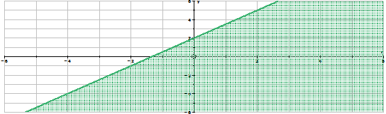
    
    \[Figure 15\]
    
5.  
    
    \[Figure 16\]
    

**Graph the following linear inequalities on a Cartesian plane.**

1.  $4x-2y>8$
2.  $4y-3x \le  -8$
3.  $x-y < -3$
4.  $3x+y > -1$
5.  $x+3y \ge 9$

</article>

### 5.6 Solving System of Inequalities on the Cartesian Plane

<article>

Solving a System of Linear Inequalities
---------------------------------------

**Introduction**

In a previous lesson you learned how to solve a system of linear equations graphically. The solution was determined by identifying the intersection point of the two linear equations. When the system of equations was solved by graphing, the system could have one point of intersection, no point of intersection (the lines were parallel), or an infinite number of intersection points (the equations were multiples of each other).

In this lesson you will learn to solve a system of linear inequalities by identifying the **_regions_** of intersection. The region of intersection or the common solution of a system of linear equation is where the shading of the inequalities overlaps. This area of overlapping is known as the feasible region and this region contains the common solution of the system of inequalities.

**Objectives**

The lesson objectives for Solving Systems of Inequalities on the Cartesian Plane are:

* Plotting two or more inequalities on the same Cartesian grid.
* Showing the overlap of the shading of the inequalities.
* Identifying the feasible region on the graph.

**Introduction**

When a linear inequality is graphed on a Cartesian plane, the region that contains the points that will satisfy the inequality is identified by shading. If two inequalities are graphed on the same grid and if they share common points that will satisfy both linear equations, an area will be created that contains shading from both inequalities. The area that contains this double shading is the region that contains the common solution for the system of inequalities.

**Watch This**

[Khan Academy Systems of Linear Inequalities](http://www.youtube.com/watch?v=YjT3QYfoy4Q)

!?[video](https://www.youtube.com/watch?v=YjT3QYfoy4Q)

**Guidance**

Graph the following system of linear inequalities on the same Cartesian grid.

$$
\begin{Bmatrix}
  y>-\frac{1}{2}x+2 \\
  y \le 2x-3
\end{Bmatrix}
$$

Both inequalities are in slope-intercept form. Begin by graphing $\boxed{y > -\frac{1}{2}x+2}$.

 is not on the graphed line. Test the point (1, 1) to determine the location of the shading.")

$$
\begin{align*}
& y > -\frac{1}{2}x+2\\
& ({\color{red}1}) > -\frac{1}{2}({\color{red}1})+2\\
&{\color{red}1} > {\color{red}-\frac{1}{2}}+2\\
& \boxed{1>1\frac{1}{2}} \quad \text{Is it true?}
\end{align*}
$$

No, one is not greater than one and one-half. Therefore, the point (1, 1) does not satisfy the inequality and will not lie in the shaded area. The shaded area is above the dashed line.

 is not on the graphed line. Test the point (1, 1) to determine the location of the shading.")

$$
\begin{align*}
& y \le 2x-3\\
& ({\color{red}1}) \le 2({\color{red}1})-3\\
& {\color{red}1} \le {\color{red}2}-3\\
& {\color{red}1} \le {\color{red}-1}\\
& \boxed{1 \le -1} \quad \text{Is it true?}
\end{align*}
$$

No, one is not less than or equal to negative one. Therefore, the point (1, 1) does not satisfy the inequality and will not lie in the shaded area. The shaded area is below the solid line.

**Example A**

Solve the following system of linear inequalities by graphing:

$$
\begin{Bmatrix}
  -2x-6y \le 12\\
  -x +2y > -4
\end{Bmatrix}
$$

Write each inequality in slope-intercept form.

$$
\begin{align*}
& -2x-6y \le 12\\
& -2x{\color{red}+2x}-6y \le {\color{red}2x}+12\\
& -6y \le {\color{red}2x}+12\\
& \frac{-6y}{{\color{red}-6}} \le \frac{2x}{{\color{red}-6}} + \frac{12}{{\color{red}-6}}\\
& \frac{\cancel{-6}y}{\cancel{-6}} \le -\frac{2}{6}x+\frac{\overset{{\color{red}-2}}{\cancel{12}}}{\cancel{-6}} \quad  \text{Simplify the slope to lowest terms.} \ \boxed{-\frac{2}{6}=-\frac{1}{3}}\\
& \boxed{y \ {\color{red}\ge} \ -\frac{1}{3}x-2}
\end{align*}
$$

$$
\begin{align*}
& -x+2y > -4\\
& -x{\color{red}+x}+2y > {\color{red}x}-4\\
& 2y > {\color{red}x}-4\\
& \frac{2y}{{\color{red}2}} > \frac{x}{{\color{red}2}} -\frac{4}{{\color{red}2}}\\
& \frac{\cancel{2}y}{\cancel{2}} > \frac{1}{2}x - \frac{\overset{{\color{red}2}}{\cancel{4}}}{\cancel{2}}\\
& \boxed{y > \frac{1}{2}x-2}
\end{align*}
$$

**Graph:** $y \ge -\frac{1}{3}x-2$.

 is not on the graphed line. Test the point (1, 1) to determine the location of the shading.")

$$
\begin{align*}
-2x-6y &\le 12\\
-2({\color{red}1})-6({\color{red}1}) &\le 12\\
{\color{red}-2-6} &\le 12\\
{\color{red}-8} &\le 12 \quad \text{Is it true?}
\end{align*}
$$

Yes, negative eight is less than or equal to twelve. The point (1, 1) satisfies the inequality and will lie within the shaded region.

 is not on the graphed line. Test the point (1, 1) to determine the location of the shading.")

$$
\begin{align*}
-x+2y &> -4\\
-({\color{red}1})+2({\color{red}1}) &> -4\\
{\color{red}-1} + {\color{red}2} &> -4\\
{\color{red}1} &> -4 \quad \text{Is it true?}
\end{align*}
$$

Yes, one is greater than negative four. The point (1, 1) satisfies the inequality and will lie within the shaded region.

**Example B**

Solve the following system of linear inequalities by graphing:

$$
\begin{Bmatrix}
  x \ge 1\\
  y > 2
\end{Bmatrix}
$$

These are the special lines that need to be graphed. The first line is a line that has an undefined slope. The graph is a vertical line parallel to the $y-$axis. The second line is a line that has a slope of zero. The graph is a line parallel to the $x-$axis.

**Graph:** $x \ge 1$.

**Example C**

More than two inequalities can be shaded on the same Cartesian plane. The solution set is all of the coordinates that lie within the shaded regions that overlap. When more than two inequalities are being shaded on the same grid, the shading must be done accurately and neatly.

Solve the following system of linear inequalities by graphing:

$$
\begin{Bmatrix}
  y < x+1\\
  y \ge -2x+4\\
  y > 0 \end{Bmatrix}
$$

**Graph:** $y<x+1$:

 is not on the graphed line. Test the point (1, 1) to determine the location of the shading.")

$$
\begin{align*}
y &< x+1\\
({\color{red}1}) &< ({\color{red}1}) +1\\
{\color{red}1} &< {\color{red}1}+1\\
1 &< {\color{red}2} \quad \text{Is it true?}
\end{align*}
$$

Yes, one is less than two. The point (1, 1) satisfies the inequality and will lie within the shaded region.

 is not on the graphed line. Test the point (1, 1) to determine the location of the shading.")

$$
\begin{align*}
y &\ge -2x+4\\
({\color{red}1}) &\ge -2({\color{red}1})+4\\
{\color{red}1} &\ge {\color{red}-2}+4\\
1 &\ge {\color{red}2} \quad \text{Is it true?}
\end{align*}
$$

No, one is not greater than or equal to two. The point (1, 1) does not satisfy the inequality and will not lie within the shaded region.

**Vocabulary**

__Feasible region__

The **_feasible region_** is the part on the graph where the shaded areas of the inequalities overlap. This area contains the all the solution sets for the system of inequalities.

**Guided Practice**

1. Solve the following system of linear inequalities by graphing:

$$
\begin{Bmatrix}
  4x+5y \le 20\\
  3x + y \le 6\\
\end{Bmatrix}
$$

2. Solve the system of linear inequalities by graphing:

$$
\begin{Bmatrix}
  2x+y \le 8\\
  2x+3y < 12\\
  x \ge 0\\
  y \ge 0\\
\end{Bmatrix}
$$

3. Determine and prove three points that satisfy the following system of linear inequalities:

$$
\begin{Bmatrix}
  y < 2x+7\\
  y \ge -3x-4\\
 \end{Bmatrix}
$$

**Answers**

1. 

$$
\begin{Bmatrix}
  4x+5y \le 20\\
  3x + y \le 6\\
\end{Bmatrix}
$$

**Write each inequality in slope-intercept form.**

$$
\begin{align*}
& 4x+5y \le 20 && 3x+y \le 6\\
&4x{\color{red}-4x}+5y \le {\color{red}-4x}+20 && 3x{\color{red}-3x}+y \le {\color{red}-3x}+6\\
&5y \le {\color{red}-4x}+20 && y \le {\color{red}-3x}+6\\
& \frac{5y}{{\color{red}5}} \le \frac{-4x}{{\color{red}5}}+\frac{20}{\color{red}5} && \boxed{y \le-3x+6}\\
& \frac{\cancel{5}y}{\cancel{5}} \le  -\frac{4}{5}x+\frac{\overset{{\color{red}4}}{\cancel{20}}}{\cancel{5}}\\
& \boxed{y \le -\frac{4}{5}x+4}
\end{align*}
$$

**Graph:** $y \le -\frac{4}{5}x+4$

 is not on the graphed line. Test the point (1, 1) to determine the location of the shading.")

$$
\begin{align*}
4x+5y &\le 20\\
4({\color{red}1})+5({\color{red}1}) &\le 20\\
{\color{red}4}+{\color{red}5} &\le 20\\
{\color{red}9} &\le 20 \quad \text{Is it true?}
\end{align*}
$$

Yes, nine is less than or equal to twenty. The point (1, 1) satisfies the inequality and will lie within the shaded region.

 is not on the graphed line. Test the point (1, 1) to determine the location of the shading.")

$$
\begin{align*}
3x+y &\le 6\\
3({\color{red}1})+({\color{red}1}) &\le 6\\
{\color{red}3}+{\color{red}1} &\le 6\\
{\color{red}4} &\le 6 \quad \text{Is it true?}
\end{align*}
$$

Yes, four is less than or equal to six. The point (1, 1) satisfies the inequality and will lie within the shaded region.

")

\[Figure 27\]

The **feasible region** is the area shaded in pink.

2. 

$$
\begin{Bmatrix}
  2x+y \le 8\\
  2x + 3y < 12 \\
  x \ge 0\\
  y \ge 0
\end{Bmatrix}
$$

**Write the first two inequalities in slope-intercept form.**

$$
\begin{align*}
& 2x+3y <12 && 2x+y \le 8\\
& 2x{\color{red}-2x}+3y < {\color{red}-2x}+12 && 2x{\color{red}-2x}+y \le {\color{red}-2x}+8\\
& 3y < {\color{red}-2x}+12 && y \le {\color{red}-2x}+8\\
& \frac{3y}{{\color{red}3}} < \frac{-2x}{{\color{red}3}} + \frac{12}{{\color{red}3}} && \boxed{y \le -2x+8}\\
& \frac{\cancel{3}y}{\cancel{3}} < -\frac{2}{3}x + \frac{\overset{{\color{red}4}}{\cancel{12}}}{\cancel{3}}\\
& \boxed{y < -\frac{2}{3}x+4}
\end{align*}
$$

**Graph:** $y<-\frac{2}{3}x+4$

 is not on the graphed line. Test the point (1, 1) to determine the location of the shading.")

$$
\begin{align*}
2x+3y &< 12\\
2({\color{red}1})+3({\color{red}1}) &< 12\\
{\color{red}2}+{\color{red}3} &< 12\\
{\color{red}5} &< 12 \quad \text{Is it true?}
\end{align*}
$$

Yes, five is less than twelve. The point (1, 1) satisfies the inequality and will lie within the shaded region.

 is not on the graphed line. Test the point (1, 1) to determine the location of the shading.")

$$
\begin{align*}
2x+y &\le 8\\
2({\color{red}1})+({\color{red}1}) &\le 8\\
{\color{red}2}+{\color{red}1} &\le 8\\
{\color{red}3} &\le 8 \quad \text{Is it true?}
\end{align*}
$$

Yes, three is less than or equal to eight. The point (1, 1) satisfies the inequality and will lie within the shaded region.

**The graph will be a vertical line that will coincide with the $y-$axis.** All $x-$values to the right of the line are greater than or equal to zero. The shaded area will be to the right of the vertical line.

**The graph will be a horizontal line that will coincide with the $x-$axis**. All $y-$values above the line are greater than or equal to zero. The shaded area will be above the horizontal line.

")

\[Figure 34\]

The **feasible region** is the area shaded in green.

3. 

$$
\begin{Bmatrix}
  y < 2x+7\\
  y \ge -3x-4 \\
\end{Bmatrix}
$$

Graph the system of inequalities to determine the feasible region.

; (4, –2); and (6, 5). These points will be tested in each of the linear inequalities. All of these points should satisfy both inequalities.")

Test (–1, 3)

$$
\begin{align*}
& y < 2x+7 \qquad \qquad \qquad and && y \ge -3x-4.  
& y < 2x+7 && y \ge -3x-4\\
& ({\color{red}3})<2({\color{red}-1})+7 && ({\color{red}3}) \ge -3({\color{red}-1})-4\\
& {\color{red}3} < {\color{red}-2}+7 && {\color{red}3} \ge {\color{red}3}-4\\
& 3 < {\color{red}5} && 3 \ge {\color{red}-1}
\end{align*}
$$

The point (–1, 3) satisfies both inequalities. In the first inequality, three is less than five. In the second inequality three is greater than or equal to negative one. Therefore, the point lies within the feasible region and is a solution for the system of linear inequalities.

Test (4, –2)

$$
\begin{align*}
& y < 2x+7 && y \ge -3x-4\\
& ({\color{red}-2}) < 2({\color{red}4})+7 && ({\color{red}-2}) \ge -3({\color{red}4})-4\\
& {\color{red}-2}<{\color{red}8}+7 && {\color{red}-2} \ge {\color{red}-12}-4\\
& -2 < {\color{red}15} && -2 \ge {\color{red}-16}
\end{align*}
$$

The point (4, –2) satisfies both inequalities. In the first inequality, negative two is less than fifteen. In the second inequality negative two is greater than or equal to negative sixteen. Therefore, the point lies within the feasible region and is a solution for the system of linear inequalities.

Test (6, 5)

$$
\begin{align*}
& y < 2x+7 && y \ge -3x-4\\
& ({\color{red}5})< 2({\color{red}6})+7 && ({\color{red}5}) \ge -3({\color{red}6}) -4\\
& {\color{red}5} < {\color{red}12}+7 && {\color{red}5} \ge {\color{red}-18}-4\\
& 5 < {\color{red}19} && 5  \ge {\color{red}-22}
\end{align*}
$$

The point (6, 5) satisfies both inequalities. In the first inequality, five is less than nineteen. In the second inequality five is greater than or equal to negative twenty-two. Therefore, the point lies within the feasible region and is a solution for the system of linear inequalities.

**Summary**

In this lesson you have learned to solve a system of linear inequalities on a Cartesian plane. The solution set was all points in the area that was in the overlapping, shaded region of the graphs. To determine where the shaded area should be with respect to each line, a point that was not on the line was tested in the original inequality. If the point made the inequality true, then the area containing the point was shaded. If the point did not make the inequality true, then the tested point did not lie within the shaded region.

**Problem Set**

**Solve the following systems of linear inequalities by graphing.**

1.  .

____$$
\begin{Bmatrix}
  3x+5y>15\\
  2x-7y \le 14\\
\end{Bmatrix}
$$__

$$
\begin{Bmatrix}
  3x+5y>15\\
  2x-7y \le 14\\
\end{Bmatrix}
$$__

__$$
\begin{Bmatrix}
  3x+5y>15\\
  2x-7y \le 14\\
\end{Bmatrix}
$$__

$$
\begin{Bmatrix}
  3x+5y>15\\
  2x-7y \le 14\\
\end{Bmatrix}
$$

2.  .

____$$
\begin{Bmatrix}
  3x+2y \ge 10\\
  x-y < -1\\
\end{Bmatrix}
$$__

$$
\begin{Bmatrix}
  3x+2y \ge 10\\
  x-y < -1\\
\end{Bmatrix}
$$__

__$$
\begin{Bmatrix}
  3x+2y \ge 10\\
  x-y < -1\\
\end{Bmatrix}
$$__

$$
\begin{Bmatrix}
  3x+2y \ge 10\\
  x-y < -1\\
\end{Bmatrix}
$$

3.  .

____$$
\begin{Bmatrix}
  x-y > 4\\
  x+y > 6\\
\end{Bmatrix}
$$__

$$
\begin{Bmatrix}
  x-y > 4\\
  x+y > 6\\
\end{Bmatrix}
$$__

__$$
\begin{Bmatrix}
  x-y > 4\\
  x+y > 6\\
\end{Bmatrix}
$$__

$$
\begin{Bmatrix}
  x-y > 4\\
  x+y > 6\\
\end{Bmatrix}
$$

4.  .

____$$
\begin{Bmatrix}
  y>3x-2\\
  y < -2x+5\\
\end{Bmatrix}
$$__

$$
\begin{Bmatrix}
  y>3x-2\\
  y < -2x+5\\
\end{Bmatrix}
$$__

__$$
\begin{Bmatrix}
  y>3x-2\\
  y < -2x+5\\
\end{Bmatrix}
$$__

$$
\begin{Bmatrix}
  y>3x-2\\
  y < -2x+5\\
\end{Bmatrix}
$$

5.  .

____$$
\begin{Bmatrix}
  3x-6y > -6\\
  5x+9y \ge -18\\
\end{Bmatrix}
$$__

$$
\begin{Bmatrix}
  3x-6y > -6\\
  5x+9y \ge -18\\
\end{Bmatrix}
$$__

__$$
\begin{Bmatrix}
  3x-6y > -6\\
  5x+9y \ge -18\\
\end{Bmatrix}
$$__

$$
\begin{Bmatrix}
  3x-6y > -6\\
  5x+9y \ge -18\\
\end{Bmatrix}
$$

**Solve the following systems of linear inequalities by graphing.**

1.  .

____$$
\begin{Bmatrix}
  2x-y<4\\
  x \ge -1\\
  y \ge -2
\end{Bmatrix}
$$__

$$
\begin{Bmatrix}
  2x-y<4\\
  x \ge -1\\
  y \ge -2
\end{Bmatrix}
$$__

__$$
\begin{Bmatrix}
  2x-y<4\\
  x \ge -1\\
  y \ge -2
\end{Bmatrix}
$$__

$$
\begin{Bmatrix}
  2x-y<4\\
  x \ge -1\\
  y \ge -2
\end{Bmatrix}
$$

2.  .

____$$
\begin{Bmatrix}
  2x+y>6\\
  x +2y \ge 6\\
  x \ge 0\\
  y \ge 0
\end{Bmatrix}
$$__

$$
\begin{Bmatrix}
  2x+y>6\\
  x +2y \ge 6\\
  x \ge 0\\
  y \ge 0
\end{Bmatrix}
$$__

__$$
\begin{Bmatrix}
  2x+y>6\\
  x +2y \ge 6\\
  x \ge 0\\
  y \ge 0
\end{Bmatrix}
$$__

$$
\begin{Bmatrix}
  2x+y>6\\
  x +2y \ge 6\\
  x \ge 0\\
  y \ge 0
\end{Bmatrix}
$$

3.  .

____$$
\begin{Bmatrix}
  x \le 3\\
  x \ge -2\\
  y \le 4\\
  y \ge -1
\end{Bmatrix}
$$__

$$
\begin{Bmatrix}
  x \le 3\\
  x \ge -2\\
  y \le 4\\
  y \ge -1
\end{Bmatrix}
$$__

__$$
\begin{Bmatrix}
  x \le 3\\
  x \ge -2\\
  y \le 4\\
  y \ge -1
\end{Bmatrix}
$$__

$$
\begin{Bmatrix}
  x \le 3\\
  x \ge -2\\
  y \le 4\\
  y \ge -1
\end{Bmatrix}
$$

4.  .

____$$
\begin{Bmatrix}
  y < x+1\\
  y \ge -2x+3\\
  y > 0
\end{Bmatrix}
$$__

$$
\begin{Bmatrix}
  y < x+1\\
  y \ge -2x+3\\
  y > 0
\end{Bmatrix}
$$__

__$$
\begin{Bmatrix}
  y < x+1\\
  y \ge -2x+3\\
  y > 0
\end{Bmatrix}
$$__

$$
\begin{Bmatrix}
  y < x+1\\
  y \ge -2x+3\\
  y > 0
\end{Bmatrix}
$$

5.  .

____$$
\begin{Bmatrix}
  x+y > -1\\
  3x -2y \ge 2\\
  x < 3\\
  y \ge 0
\end{Bmatrix}
$$__

$$
\begin{Bmatrix}
  x+y > -1\\
  3x -2y \ge 2\\
  x < 3\\
  y \ge 0
\end{Bmatrix}
$$__

__$$
\begin{Bmatrix}
  x+y > -1\\
  3x -2y \ge 2\\
  x < 3\\
  y \ge 0
\end{Bmatrix}
$$__

$$
\begin{Bmatrix}
  x+y > -1\\
  3x -2y \ge 2\\
  x < 3\\
  y \ge 0
\end{Bmatrix}
$$

</article>

### 5.7 Real-World Applications of Systems of Inequalities

<article>

The Vertex Theorem for Feasible Regions
---------------------------------------

**Introduction**

In this lesson you will learn about the vertex theorem for feasible regions and how to apply this theorem to real-world problems. You will learn to write a system of linear inequalities to model the real-world problem. This system will then be graphed to determine the solution set for the system of inequalities. Using the vertex theorem, you will then answer the real-world problem.

**Objectives**

The lesson objectives for the Vertex Theorem for Feasible Regions are:

* Understanding the vertex theorem.
* Writing a system of inequalities for a real-world problem.
* Solving the system of inequalities by graphing
* Determining the vertices algebraically by solving the linear inequalities.
* Using the vertex theorem to determine the answer to the real-world problem.

**Introduction**

A system of linear inequalities is often used to determine the best solution to a problem. This solution could be as simple as determining how many of a product should be produced to maximize a profit or as complicated as determining the correct combination of drugs to give a patient. Regardless of the problem, there is a theorem in mathematics that is used, with a system of linear inequalities, to determine the best solution to the problem.

**Guidance**

The following diagram shows a feasible region that is within a polygonal region.

To evaluate the value of ‘$z$’ substitute the coordinates of the point into the expression for ‘$x$’ and ‘$y$’.

$$
\begin{align*}
& (0, 0) && z=2x+3y \rightarrow z=2(0)+3(0) \rightarrow z=0+0 \rightarrow z=0\\
& && \text{Therefore} \ 2x+3y=0\\
\\
& (0, 4) && z=2x+3y \rightarrow z=2(0)+3(4) \rightarrow z=0+12 \rightarrow z=12\\
& && \text{Therefore} \ 2x+3y=12\\
\\
& (6, 0) && z=2x+3y \rightarrow z=2(6)+3(0) \rightarrow z=12+0 \rightarrow z=12\\
& && \text{Therefore} \ 2x+3y=12\\
\\
& (3, 6) && z=2x+3y \rightarrow z=2(3)+3(6) \rightarrow z=6+18 \rightarrow z=24\\
& && \text{Therefore} \ 2x+3y=24\\
\\
& (9, 4) && z=2x+3y \rightarrow z=2(9)+3(4) \rightarrow z=18+12 \rightarrow z=30\\
& && \text{Therefore} \ 2x+3y=30
\end{align*}
$$

The value of $z=2x+3y$, for each of the vertices, remains constant along any line with a slope of $-\frac{2}{3}$. This is obvious on the following graph.

 while the minimum value occurred at the vertex (0, 0). These statements confirm the vertex theorem for a feasible region:")

If a linear expression $\boxed{z=ax+by+c}$ is to be evaluated for all points of a convex, polygonal region, then the maximum value of $z$, if one exists, will occur at one of the vertices of the feasible region. Also, the minimum value of $z$, if one exists, will occur at one of the vertices of the feasible region.

**Example A**

Evaluate the expression $z=3x+4y$ for the given feasible region to determine the point at which ‘$z$’ has a maximum value and the point at which ‘$z$’ has a minimum value.

\begin{align*}
&(-4, 0) && z=3x+4y \rightarrow z=3(-4)+4(0) \rightarrow z=-12+0 \rightarrow z=-12\\
& && \text{Therefore} \ 3x+4y=-12\\
\\
& (0, 5) && z=3x+4y \rightarrow z=3(0)+4(5) \rightarrow z=0+20 \rightarrow z=20\\
& && \text{Therefore} \ 3x+4y=20\\
\\
& (6, 3) && z=3x+4y \rightarrow z=3(6)+4(3) \rightarrow z=18+12 \rightarrow z=30\\
& && \text{Therefore} \ 3x+4y=30\\
\\
& (8, -4) && z=3x+4y \rightarrow z=3(8)+4(-4) \rightarrow z=24-16 \rightarrow z=8\\
& && \text{Therefore} \ 3x+4y=8
\end{align*}
$$

**The maximum value of ‘$z$’ occurred at the vertex (6, 3).**

**The minimum value of ‘$z$’ occurred at the vertex (–4, 0).**

Using the vertices of the feasible region to determine the maximum or the minimum value is the branch of mathematics known as **_linear programming_**. Linear programming is a technique used by businesses to solve problems. The types of problems that usually employ linear programming are those where the profit is to be maximized and those where the expenses are to be minimized. However, linear programming can also be used to solve other types of problems. The solution provides the business with a program to follow to obtain the best results for the company. The following examples will demonstrate different types of real-world problems that use linear programming to obtain the solution.

**Example B**

")

\[Figure 5\]

A company that produces flags makes two flags for Nova Scotia-the traditional blue flag and the green flag for Cape Breton. To produce each flag, two types of material, nylon and cotton, are used. The company has 450 units of nylon in stock and 300 units of cotton. The traditional blue flag requires 6 units of nylon and 3 units of cotton. The Cape Breton flag requires 5 units of nylon and 5 units of cotton.

Each blue flag that is made realizes a profit of $12 for the company, whereas each Cape Breton flag realizes a profit of $15. For the nylon and cotton that the company currently has in stock, how many of each flag should the company make to maximize their profit?

Let ‘$x$’ represent the number of blue flags.

Let ‘$y$’ represent the number of green flags.

**Step 1:**

Transfer the information presented in the problem to a table.

|     | **Units Required per Blue Flag** | **Units Required Per Green Flag** | **Units Available** |
| --- | --- | --- | --- |
| **Nylon** | **6** | **5** | **450** |
| **Cotton** | **3** | **5** | **300** |
| **Profit(per flag)** | **$12** | **$15** |     |

The information presented in the problem identifies the restrictions or conditions on the production of the flags. These restrictions are known as **_constraints_** and are written as inequalities to represent the information presented in the problem.

**Step 2:**

From the information (now in the table), list the constraints.

The number of blue flags that are produced must be either zero or greater than zero. Therefore, the constraint is $\boxed{x \ge 0}$.

The number of green flags that are produced must be either zero or greater than zero. Therefore, the constraint is $\boxed{y \ge 0}$.

The total number of units of nylon required to make both types of flags cannot exceed 450. Therefore, the constraint is $\boxed{6x+5y \le 450}$.

The total number of units of cotton required to make both types of flags cannot exceed 300. Therefore, the constraint is $\boxed{3x+5y \le 300}$.

**Step 3:**

Write an equation to identify the profit. $\boxed{P=12x+15y}$

**Step 4:**

Graph the listed constraints to identify the feasible region.

")

\[Figure 7\]

The feasible region is the area shaded in teal blue.

**Step 5:**

Algebraically, determine the exact point of intersection between the constraints. Also, the $x-$intercept of the feasible region must be calculated.

Write the constraints as linear equations and solve the system by elimination.

$$
\begin{align*}
& 6x+5y=450 \quad \rightarrow && \qquad  6x+5y=450 \quad \rightarrow \qquad 6x+\cancel{5y}=450 && 6x+5y=450\\
& 3x+5y=300 && -1(3x+5y=300) \ \rightarrow  \quad \underline{-3x-\cancel{5y}=-300} && 6({\color{red}50})+5y=450\\
& && \qquad \qquad \qquad \qquad \qquad \qquad \qquad \ \  3x=150 \quad \rightarrow && {\color{red}300}+5y=450\\
& && \qquad \qquad \qquad \qquad \qquad \qquad \qquad \ \frac{\cancel{3}x}{\cancel{3}}=\frac{\overset{{\color{red}50}}{\cancel{150}}}{\cancel{3}} && 300{\color{red}-300}+5y=450{\color{red}-300}\\
& && \qquad \qquad \qquad \qquad \qquad \qquad \qquad \quad x=50 && 5y=150\\
& && && \frac{\cancel{5}y}{\cancel{5}}=\frac{\overset{{\color{red}30}}{\cancel{150}}}{\cancel{5}}\\
& && && y=30
\end{align*}
$$

$$
\boxed{l_1 \cap l_2 @ (50, 30)}
$$

The $x-$intercept for the inequality $6x+5y \le 450$ must be calculated.

Write the inequality as a linear equation. Set ‘$y$’ equal to zero and solve the equation for ‘$x$’.

$$
\begin{align*}
6x+5y&=450\\
6x+5({\color{red}0})&=450\\
6x&=450\\
\frac{\cancel{6}x}{\cancel{6}}&=\frac{\overset{{\color{red}75}}{\cancel{450}}}{\cancel{6}}\\
x&=75
\end{align*}
$$

**The $x-$intercept of the feasible region is (75, 0).**

**The $y-$intercept is (0, 60). This point was plotted when the inequalities were put into slope-intercept form for graphing.**

The following graph shows the vertices of the polygon than encloses the feasible region.

Calculate the profit, using the profit equation, for each vertex of the feasible region:

$$
\begin{align*}
& (0, 0) && P=12x+15y \rightarrow P=12(0)+15(0) \rightarrow P=0+0 \rightarrow P=0\\
& && \text{Therefore} \ 12x+15y=\$ 0\\
\\
& (0, 60) && P=12x+15y \rightarrow P=12(0)+15(60) \rightarrow P=0+900 \rightarrow P=900\\
& && \text{Therefore} \ 12x+15y=\$ 900\\
\\
& (50, 30) && P=12x+15y \rightarrow P=12(50)+15(30) \rightarrow P=600+450 \rightarrow P=1050\\
& && \text{Therefore} \ 12x+15y=\$ 1050\\
\\
& (75, 0) && P=12x+15y \rightarrow P=12(75)+15(0) \rightarrow P=900+0 \rightarrow P=900\\
& && \text{Therefore} \ 12x+15y=\$ 900
\end{align*}
$$

The maximum profit occurred at the vertex (50, 30). This means, with the supplies in stock, the company should make 50 blue flags and 30 green flags to maximize their profit.

**Example C**

A local smelting company is able to provide its customers with iron, lead and copper by melting down either of two ores, A or B. The ores arrive at the company in railroad cars. Each railroad car of ore A contains 3 tons of iron, 3 tons of lead and I ton of copper. Each railroad car of ore B contains 1 ton of iron, 4 tons of lead and 3 tons of copper. The smelting receives an order for 7 tons of iron, 19 tons of lead and 8 tons of copper. The cost to purchase and process a carload of ore A is $7000 while the cost for ore B is $6000. If the company wants to fill the order at a minimum cost, how many carloads of each ore must be bought?

Let ‘$x$’ represent the number of carloads of ore A to purchase.

Let ‘$y$’ represent the number of carloads of ore B to purchase.

**Step 1:**

Transfer the information presented in the problem to a table.

|     | **One Carload of ore A** | **One Carload of ore B** | **Number of tons to fill the order** |
| --- | --- | --- | --- |
| **Tons of Iron** | **3** | **1** | **7** |
| **Tons of Lead** | **3** | **4** | **19** |
| **Tons of Copper** | **1** | **3** | **8** |

**Step 2:**

From the information, list the constraints.

The number of carloads of ore A that must be bought is either zero or greater than zero. Therefore, the constraint is $\boxed{x \ge 0}$.

The number of carloads of ore B that must be bought is either zero or greater than zero. Therefore, the constraint is $\boxed{y \ge 0}$.

The total number of tons of iron from ore A and ore B must be greater than or equal to the 7 tons needed to fill the order. Therefore, the constraint is $\boxed{3x+y \ge 7}$.

The total number of tons of lead from ore A and ore B must be greater than or equal to the 19 tons needed to fill the order. Therefore, the constraint is $\boxed{3x +4y \ge 19}$.

The total number of tons of copper from ore A and ore B must be greater than or equal to the 8 tons needed to fill the order. Therefore, the constraint is $\boxed{x+3y \ge 8}$.

**Step 3:**

Write an equation to represent the cost in dollars of $x$ carloads of ore A and y carloads of ore B. $\boxed{c=7000x+6000y}$

**Step 4:**

Graph the listed constraints to identify the feasible region.

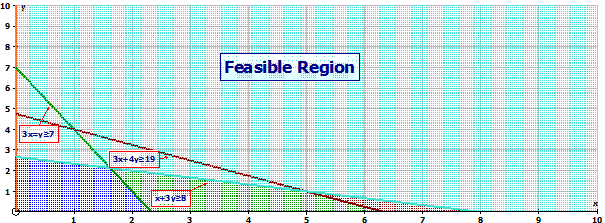

Algebraically, determine the exact point of intersection between the constraints. Also, the $x-$intercept of the feasible region must be calculated.

Write the constraints as linear equations and solve the system by elimination.

&nbsp;

$$
\begin{align*}
& \ 3x+y=7 \quad \rightarrow && -1(3x+y=7) \quad \rightarrow \quad -\cancel{3x}-y=-7 && 3x+4y=19\\
& 3x+4y=19 && \quad \ \ 3x+4y=19 \quad \rightarrow  \quad \ \underline{\cancel{3x}+4y=19} && 3x+4({\color{red}4})=19\\
& && \qquad \qquad \qquad \qquad \qquad \qquad \quad \ 3y=12 \quad \rightarrow && 3x+{\color{red}16}=19\\
& && \qquad \qquad \qquad \qquad \qquad \qquad \quad \ \frac{\cancel{3}y}{\cancel{3}}=\frac{\overset{{\color{red}4}}{\cancel{12}}}{\cancel{3}} && 3x+{\color{red}16-16}=19{\color{red}-16}\\
& && \qquad \qquad \qquad \qquad \qquad \qquad \qquad y=4 && 3x=3\\
& && && \frac{\cancel{3}x}{\cancel{3}}=\frac{\overset{{\color{red}1}}{\cancel{3}}}{\cancel{3}}\\
& && && x=1
\end{align*}
$$

$$
\boxed{l_1 \cap l_2 @ (1,4)}
$$

$$
\begin{align*}
&3x+4y=19 \quad \rightarrow && \quad \ 3x+4y=19 \quad \rightarrow \quad \cancel{3x}+4y=19 && 3x+4y=19\\
& \ x+3y=8 && -3(x+3y=8) \quad \rightarrow  \ \ \underline{\cancel{3x}-9y=-24} && 3x+4({\color{red}1})=19\\
& && \qquad \qquad \qquad \qquad \qquad \quad \ -5y=-5 \quad \rightarrow && 3x+{\color{red}4}=19\\
& && \qquad \qquad \qquad \qquad \qquad \quad \ \ \frac{\cancel{-5}y}{\cancel{-5}}=\frac{\overset{{\color{red}1}}{\cancel{-5}}}{\cancel{-5}} && 3x+{\color{red}4-4}=19{\color{red}-4}\\
& && \qquad \qquad \qquad \qquad \qquad \qquad \quad y=1 && 3x=15\\
& && && \frac{\cancel{3}x}{\cancel{3}}=\frac{\overset{{\color{red}5}}{\cancel{15}}}{\cancel{3}}\\
& && && x=5
\end{align*}
$$

$$
\boxed{l_2 \cap l_3 @ (5,1)}
$$

The $x-$intercept for the inequality $x+3y \ge 8$ must be calculated.

Write the inequality as a linear equation. Set ‘$y$’ equal to zero and solve the equation for ‘$x$’.

$$
\begin{align*}
x+3y &=8\\
x+3({\color{red}0})&=8\\
x &=8
\end{align*}
$$

**The $x-$intercept of the feasible region is (8, 0).**

**The $y-$intercept is (0, 7). This point was plotted when the inequalities were put into slope-intercept form for graphing.**

The following graph shows the vertices of the region borders the feasible region.

Calculate the cost, using the cost equation, for each vertex of the feasible region:

$$
\begin{align*}
& (0, 7) && c=7000x+6000y \rightarrow c=7000(0)+6000(7) \rightarrow c=0+42,000 \rightarrow P=42,000\\
& && \text{Therefore} \ 7000x+6000y=\$ 42,000\\
\\
& (1, 4) && c=7000x+6000y \rightarrow c=7000(1)+6000(4) \rightarrow c=7000+24,000 \rightarrow P=31,000\\
& && \text{Therefore} \ 7000x+6000y=\$ 31,000\\
\\
& (5, 1) && c=7000x+6000y \rightarrow c=7000(5)+6000(1) \rightarrow c=35,000+6000 \rightarrow P=41,000\\
& && \text{Therefore} \ 7000x+6000y=\$ 41,000\\
\\
& (8, 0) && c=7000x+6000y \rightarrow c=7000(8)+6000(0) \rightarrow c=56,000+0 \rightarrow P=56,000\\
& && \text{Therefore} \ 7000x+6000y=\$ 56,000
\end{align*}
$$

The minimum cost is located at the vertex (1, 4). Therefore the company should buy one carload of ore A and four carloads of ore B.

**Vocabulary**

__Constraint__

A **_constraint_** is a restriction or condition presented in a real-world problem. The constraints are written as inequalities and are used to solve the problem.

__Linear Programming__

**_Linear programming_** is a branch of mathematics that uses systems of linear inequalities to solve real-world problems. The vertex theorem of regions is applied to the vertices to determine the best solution to the problem.

__Vertex Theorem for Regions__

If a linear expression $z=ax+by+c$ is to be evaluated for all points of a convex, polygonal region, then the maximum value of $z$, if one exists, will occur at one of the vertices of the feasible region. Also, the minimum value of $z$, if one exists, will occur at one of the vertices of the feasible region.

**Guided Practice**

1. For the following graphed region and the expression $z=5x+7y-1$, find a point where ‘$z$’ has a maximum value and a point where ‘$z$’ has a minimum value.

|     | **Super 1** | **Super 2** | **Time Available** |
| --- | --- | --- | --- |
| **Machine A** | **1 minute** | **3 minutes** | **24 minutes** |
| **Machine B** | **3 minutes** | **2 minutes** | **36 minutes** |
| **Machine C** | **3 minutes** | **4 minutes** | **44 minutes** |

3. A local paint company has created two new paint colors. The company has 28 units of yellow tint and 22 units of red tint and intends to mix as many quarts as possible of color X and color Y. Each quart of color X requires 4 units of yellow tint and 1 unit of red tint. Each quart of color Y requires 1 unit of yellow tint and 4 units of red tint. How many quarts of each color can be mixed with the units of tint that the company has available? List the constraints, complete the graph and determine the solution using linear programming.

**Answers**

1. The vertices of the polygonal region are (–7, –1); (2, 5); (6, 1); and (0, –4).

$$
\begin{align*}
& (-7, -1) && z=5x+7y-1 \rightarrow z=5(-7)+7(-1)-1 \rightarrow z=-35-7-1 \rightarrow z=-43\\
& && \text{Therefore} \ 5x+7y-1=-43\\
\\
& (2, 5) && z=5x+7y-1 \rightarrow z=5(2)+7(5)-1 \rightarrow z=10+35-1 \rightarrow z=44\\
& && \text{Therefore} \ 5x+7y-1=44\\
\\
& (6, 1) && z=5x+7y-1 \rightarrow z=5(6)+7(1)-1 \rightarrow z=30+7-1 \rightarrow z=36\\
& && \text{Therefore} \ 5x+7y-1=36\\
\\
& (0, -4) && z=5x+7y-1 \rightarrow z=5(0)+7(-4)-1 \rightarrow z=0-28-1 \rightarrow z=-29\\
& && \text{Therefore} \ 5x+7y-1=-29
\end{align*}
$$

**The maximum value of ‘$z$’ occurred at the vertex (2, 5).**

**The minimum value of ‘$z$’ occurred at the vertex (–7, –1).**

2. Let ‘$x$’ represent the number of Super 1 coffee percolators.

Let ‘$y$’ represent the number of Super 2 coffee percolators.

The number of Super 1 coffee percolators that are made must be either zero or greater than zero. Therefore, the constraint is $\boxed{x \ge 0}$.

The number of Super 2 coffee percolators that are made must be either zero or greater than zero. Therefore, the constraint is $\boxed{y \ge 0}$.

The total amount of time that both a Super1 and a Super 2 model can be processed on Machine A is less than or equal to 24 minutes. Therefore, the constraint is $\boxed{x+3y \le 24}$.

The total amount of time that both a Super1 and a Super 2 model can be processed on Machine B is less than or equal to 36 minutes. Therefore, the constraint is $\boxed{3x+2y \le 36}$.

The total amount of time that both a Super1 and a Super 2 model can be processed on Machine C is less than or equal to 44 minutes. Therefore, the constraint is $\boxed{3x+4y \le 44}$.

The profit equation is $\boxed{P=30x+35y}$

3. **Table:**

|     | **Color X** | **Color Y** | **Units Available** |
| --- | --- | --- | --- |
| **Yellow Tint** | **4 units** | **1 unit** | **28** |
| **Red Tint** | **1 unit** | **4 units** | **22** |

**Constraints:**

Let ‘$x$’ represent the number of quarts of Color X paint to be made.

Let ‘$y$’ represent the number of quarts of Color Y paint to be made.

The number of quarts of Color X paint that are mixed must be either zero or greater than zero. Therefore, the constraint is $\boxed{x \ge 0}$.

The number of quarts of Color Y paint that are mixed must be either zero or greater than zero. Therefore, the constraint is $\boxed{y \ge 0}$.

The total amount of yellow tint that is used to mix Color X and Color Y must be less than or equal to 28. Therefore, the constraint is $\boxed{4x+y \le 28}$.

The total amount of red tint that is used to mix Color X and Color Y must be less than or equal to 22. Therefore, the constraint is $\boxed{x+4y \le 22}$.

**Graph:**

$$
\begin{align*}
& 4x+y =28 \quad \rightarrow && \qquad 4x+y=28 \quad \rightarrow \qquad \ \ \cancel{4x}+y=28 && 4x+y=28\\
& x+4y=22 && -4(x+4y=22) \ \rightarrow \quad -\underline{\cancel{4x}-16y=-88} && 4x+({\color{red}4})=28\\
& && \qquad \qquad \qquad \qquad \qquad \qquad \ \ -15y=-60 \quad \rightarrow && 4x=24\\
& && \qquad \qquad \qquad \qquad \qquad \qquad \quad \frac{\cancel{-15}y}{\cancel{-15}} = \frac{\overset{{\color{red}4}}{\cancel{-60}}}{\cancel{-15}} && \frac{\cancel{4}x}{\cancel{4}} = \frac{\overset{{\color{red}7}}{\cancel{24}}}{\cancel{4}}\\
& && \qquad \qquad \qquad \qquad \qquad \qquad \qquad \quad y=4 && x=6
\end{align*}
$$

$$
\boxed{l_1 \cap l_2 @ (6,4)}
$$

**The company wants to mix as many quarts as possible of Color X and of Color Y paint. Therefore, the $x$ and $y-$intercepts have no meaning in this problem since they would both result in 0 quarts of one of the colors.**

The company should mix **6** quarts of Color X paint and **4** quarts of Color Y paint.

**Summary**

In this lesson you have learned that a system of linear inequalities can be used to solve real-world problems. The solution to the problem is determined by graphing the system and using the vertices of the feasible region to calculate the best answer. The vertices were used since the Vertex Theorem for regions states that the maximum and minimum values, if they exist, occur at a vertex.

To ensure that the vertices were accurate, the inequalities of the intersecting lines were solved algebraically. The method that is used to solve the system of inequalities is a personal choice. Regardless of the method used, the results will not differ. In many problems it was also necessary to determine the $x-$ and $y-$intercepts for the feasible region.

**Problem Set**

**For each graphed region and corresponding equation, find a point at which ‘$z$’ has a maximum value and a point at which ‘$z$’ has a minimum value.**

1.  $\boxed{z=7x-2y}$ 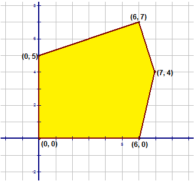
    
    \[Figure 14\]
    
2.  $\boxed{z=3y-4x}$ 
    
    \[Figure 15\]
    
3.  $\boxed{z=4x-2y}$ 
    
    \[Figure 16\]
    
4.  $\boxed{z=10x+20y}$ 
    
    \[Figure 17\]
    
5.  $\boxed{z=20x-15y+4}$ 
    
    \[Figure 18\]
    

**For each of the following problems, list the constraints, complete the graph and determine the maximum profit. Show all of your work.**

1.  A small manufacturing company makes $125 on each DVD player it produces and $100 profit on each color TV set it makes. Each DVD player and each TV must be processed by a cutting machine (A), a fitting machine (B) and a polishing machine (C). Each DVD player must be processed on Machine A for one hour, on Machine B for one hour and on Machine C for four hours. Each TV set must be processed on Machine A for two hours, on Machine B for one hour and on Machine C for one hour. Machines A, B, and C are available for 16, 9, and 24 hours per day respectively. How many DVD players and TV sets must be made each day to maximize the profit?
2.  April has a small business during the winter months making hats and scarves. A hat requires 2 hours on Machine A, 4 hours on Machine B and 2 hours on Machine C. A scarf requires 3 hours on Machine A, 3 hours on Machine B and 1 hour on Machine C. Machine A is available 36 hours each week, Machine B is available 42 hours each week and Machine C is available 20 hours each week. The profit on a hat is $7.00 and the profit on a scarf is $4.00. How many of each should be made each week to maximize the profit?
3.  Beth is knitting mittens and gloves. Each pair must be processed on three machines. Each pair of mittens requires 2 hours on Machine A, 2 hours on Machine B and 4 hours on Machine C. Each pair of gloves requires 4 hours on Machine A, 2 hours on Machine B and 1 hour on Machine C. Machine A, B, and C are available 32, 18 and 24 minutes each day respectively. The profit on a pair of mittens is $8.00 and on a pair of gloves is $10.00. How many pairs of each should be made each day to maximize the profit?
4.  A patient is prescribed a pill that contains vitamins A, B and C. These vitamins are available in two different brands of pills. The first type is called Brand X and the second type is called Brand Y. The following table shows the amount of each vitamin that a Brand X and a Brand Y pill contain. The table also shows the minimum daily requirement needed by the patient. Each Brand X pill costs 32¢ and each Brand Y pill costs 29¢. How many pills of each brand should the patient take each day to minimize the cost?

|     | **Brand X** | **Brand Y** | **Minimum Daily Requirement** |
| --- | --- | --- | --- |
| **Vitamin A** | **2mg** | **1mg** | **5mg** |
| **Vitamin B** | **3mg** | **3mg** | **12mg** |
| **Vitamin C** | **25mg** | **50mg** | **125mg** |

5.  A local smelting company is able to provide its customers with lead, copper and iron by melting down either of two ores, X or Y. The ores arrive at the company in railroad cars. Each railroad car of ore X contains 5 tons of lead, 1 ton of copper and I ton of iron. Each railroad car of ore Y contains 1 ton of lead, 1 ton of copper and 1 ton of iron. The smelting receives an order for 20 tons of lead, 12 tons of copper and 20 tons of iron. The cost to purchase and process a carload of ore X is $6000 while the cost for ore Y is $5000. If the company wants to fill the order at a minimum cost, how many carloads of each ore must be bought?

</article>

### 5.8 Quiz II

<article>

Multiple Choice – Please **_circle_** the letter of the correct answer and **_write_** that letter in the space provided to the left of each question.

1.  \_\_\_\_\_\_\_\_ **_Let There Be Light_** is a local business that installs outdoor lights for the Christmas season. They offer customers three options for payment. One option charges $200. A second option charges $100 and $0.25 per light. The third option charges $150 and $0.10 per light. Which of the following system of equations best represents this problem if $x$ is the number of lights and $y$ is the total cost?

(a) 

$$
\begin{Bmatrix}
y=200x \\
y=25x+100\\
y=10x+150
\end{Bmatrix}
$$

(b) 

$$
\begin{Bmatrix}
y=x+200 \\
y=0.25x+100\\
y=0.10x
\end{Bmatrix}
$$

(c) 

$$
\begin{Bmatrix}
y=200 \\
y=0.25x\\
y=0.10x+150
\end{Bmatrix}
$$

(d) 

$$
\begin{Bmatrix}
y=200 \\
y=0.25x+100\\
y=0.10x+150
\end{Bmatrix}
$$

2.  \_\_\_\_\_\_\_\_ Which statement is true for the following system of equations?

$$
\begin{Bmatrix}
y=\frac{2}{3}x-5 \\
y=-\frac{1}{4}x+6
\end{Bmatrix}
$$

(a) $L_1 \cap L_2 @ (-12,9)$

(b) $L_1 \cap L_2 @ \left(12, -\frac{3}{2}\right)$

(c) $L_1 \cap L_2 @ (12,3)$

(d) $L_1 \cap L_2 @ (-12,-13)$

3.  \_\_\_\_\_\_\_\_ My piggy bank contains 595 coins made up of nickels and quarters. I have a total of $109.75. What system of linear equations represents this problem?

(a) 

$$
\begin{Bmatrix}
n+q=595 \\
0.05n+0.25q=109.75
\end{Bmatrix}
$$

(b) 

$$
\begin{Bmatrix}
n+q=595 \\
0.5n+0.25q=109.75
\end{Bmatrix}
$$

(c) 

$$
\begin{Bmatrix}
n+q=595 \\
5n+25q=109.75
\end{Bmatrix}
$$

(d) 

$$
\begin{Bmatrix}
n+q=109.75 \\
n+q=595
\end{Bmatrix}
$$

4.  \_\_\_\_\_\_\_\_ Which of the following systems of linear equations best represents the solution? 
    
    \[Figure 1\]
    

(a) 

$$
\begin{Bmatrix}
x=6 \\
y=x\\
y=6x+4
\end{Bmatrix}
$$

(b) 

$$
\begin{Bmatrix}
y=6 \\
y=x\\
x-4y+16=0
\end{Bmatrix}
$$

(c) 

$$
\begin{Bmatrix}
x=6 \\
y=x\\
4x-y+4=0
\end{Bmatrix}
$$

(d) 

$$
\begin{Bmatrix}
y=6 \\
x-y=0\\
x+4y-4=0
\end{Bmatrix}
$$

5.  \_\_\_\_\_\_\_\_ **_“Bay Bye Babysitting”_** is planning to advertise its services by giving its customers three options. If two of the options must cost **$70.00** for **6** hours of service, then which of the following could be one of those options where ‘$x$’ is the time in hours and ‘$y$’ is the cost in dollars?
    1.  $y=8x$
    2.  $y=\frac{1}{8}x$
    3.  $y=5x+40$
    4.  $y=3x+20$

6.  \_\_\_\_\_\_\_\_ Which of the following inequalities is represented below? 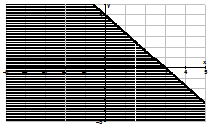
    
    \[Figure 2\]
    
    1.  $5x+3y \le 15$
    2.  $5x+3y<15$
    3.  $3x+5y<15$
    4.  $5x+3y \ge 15$

7.  \_\_\_\_\_\_\_\_ For which of the following systems of equations is (3, –4) the solution?

(a) 

$$
\begin{Bmatrix}
2x-5y=-14 \\
3x+2y=-6
\end{Bmatrix}
$$

(b) 

$$
\begin{Bmatrix}
y=2x-10 \\
3x-y=5
\end{Bmatrix}
$$

(c) 

$$
\begin{Bmatrix}
2x+3y=12 \\
3x-2y=1
\end{Bmatrix}
$$

(d) 

$$
\begin{Bmatrix}
3x-2y=17 \\
2x+3y=-6
\end{Bmatrix}
$$

8.  \_\_\_\_\_\_\_\_ Which system of linear inequalities describes the graph below? 
    
    \[Figure 3\]
    

(a) 

$$
\begin{Bmatrix}
y \ge - \frac{2}{3}x+2 \\
x \ge 1
\end{Bmatrix}
$$

(b) 

$$
\begin{Bmatrix}
y \le -\frac{2}{3}x+2 \\
x \le 1
\end{Bmatrix}
$$

(c) 

$$
\begin{Bmatrix}
y \ge - \frac{2}{3}x+2 \\
x \le 1
\end{Bmatrix}
$$

(d) 

$$
\begin{Bmatrix}
y \le - \frac{2}{3}x+2 \\
x \ge 1
\end{Bmatrix}
$$

9.  \_\_\_\_\_\_\_\_ A toy company makes two types of play hammers as an accessory for the Tots Tool Bench. They make regular hammers and sledge hammers. The company has 480 units of wood and 300 units of iron in stock. The regular hammers $(x)$ require 4 units of wood and 2 units of iron. Sledge hammers $(y)$ require 3 units of wood and 3 units of iron. Which list of constraints represents this problem?

(a) 

$$
\begin{Bmatrix}
4x+3y \ge 480 \\
2x+3y \ge 300\\
x \ge 0\\
y \ge 0
\end{Bmatrix}
$$

(b) 

$$
\begin{Bmatrix}
4x+3y \le 480 \\
2x+3y \le 300\\
x \le 0\\
y \le 0
\end{Bmatrix}
$$

(c) 

$$
\begin{Bmatrix}
4x+3y \le 480 \\
2x+3y \le 300\\
x \ge 0\\
y \ge 0
\end{Bmatrix}
$$

(d) 

$$
\begin{Bmatrix}
4x+3y<480\\
2x+3y<300\\
x<0\\
y<0
\end{Bmatrix}
$$

10. \_\_\_\_\_\_\_\_ For the following region and the equation $z=5x-3y+4$, at which point does ‘$z$’ have a maximum value? 
    
    \[Figure 4\]
    
    1.  (1, –3)
    2.  (–2, 4)
    3.  (3, 3)
    4.  (–5, –1)

</article>

### 5.9 Chapter Test

<article>

1.  Determine the point of intersection of the following pairs of lines by graphing both lines on the same set of axes.

(a) 

$$
\begin{Bmatrix}
  3x+5y = -15\\
  2x-3y = 12\\
\end{Bmatrix}
$$

 Prove this point algebraically.")

2.  If the following graph represents a linear programming problem with these constraints:

$$
\begin{Bmatrix}
  6x+5y \le 450\\
  3x+5y \le 300\\
  x \ge 0\\
  y \ge 0
\end{Bmatrix}
$$

and the **profit** statement is represented by the equation $P=12x+15y$ **determine** the maximum profit and **show** all the necessary work.

4.  Solve the following system of linear equations.

$$
\begin{Bmatrix}
  \frac{1}{2}x+\frac{3}{4}y = -2\\
  \frac{5}{3}x-\frac{2}{3}y = -\frac{1}{3}\\
\end{Bmatrix}
$$

5.  Solve the following system of linear equations by elimination.

$$
\begin{Bmatrix}
 2(1-2x)-3(1-y)=-16\\
 4(2y+1)-3(x+3)=-22\\
\end{Bmatrix}
$$

6.  A vending machine contains 694 coins made up of quarters and nickels. The total value of the coins is $131.90. How many of each coin are in the vending machine?
7.  Determine the inequality that is modeled by the following graph. 
    
    \[Figure 3\]
    
8.  Draw $\Delta ABC$. Place the following equations on the correct sides of the triangle:

$$
\begin{align*}
& BC: 3x-8y=-39\\
& AC:4x+y=18\\
& AB:x+2y=1
\end{align*}
$$

**Determine the coordinates of the vertices of the triangle.**

</article>

## 6.0 Power to the Exponent

<article>

**Introduction**

In this chapter you will learn about exponents. The lessons will include the laws of exponents – a review of some that you’ve learned previously as well as some new laws of exponents. You will learn to apply these laws to algebraic expressions, equations and to functions.

In addition you will learn to express numbers in scientific notation and how to perform operations with these numbers. These operations will then be applied to real-world problems. You will learn to express numbers written in scientific notation in standard form.

You will learn to solve exponential equations algebraically and how to graph exponential functions. These graphs will be extended to applications of real-world problems. These problems will include exponential functions that are referred to as growth curves and decay curves. Each of these curves have unique properties that will enable you to distinguish between the two types.

**Lessons**

In this chapter you will do the following lessons:

* Laws of Exponents
* Applications of the Laws of Exponents
* Solving Exponential Equations
* Scientific Notation
* Operations with Numbers written in Scientific Notation
* Applications of Scientific Notation
* Exponential Functions
* Asymptotes of Exponential Functions
* Applications of Exponential Functions – Growth and Decay Curves

</article>

### 6.1 The Laws of Exponents

<article>

Multiplying and Dividing Exponential Terms
------------------------------------------

**Objectives**

The lesson objectives for the Laws of Exponents are:

* Multiplying Exponential Terms
* Dividing Exponential Terms

**Introduction**

If $a \varepsilon R$ and $n \varepsilon N$, then the $n$ th power of ‘$a$’ is written as:

$$
\begin{align*}
& a^n = \underleftrightarrow{a \times a \times a \times \ldots \times a}\\
& \qquad \qquad \qquad {\color{red}\downarrow}\\
& \qquad \qquad \ {\color{red}n \ \text{factors}}
\end{align*}
$$

where $n$ is called the exponent and $a$ is called the base. The term $a^n$ is known as a power. In other words $\boxed{ 4^3 = 4 \times 4 \times 4 = 64}$ and $\boxed{2^6=2 \times 2 \times 2 \times 2 \times 2 \times 2=64}$.

Based on this concept, there are five laws of exponents, which will be illustrated in the following lesson.

**Watch This**

[Khan Academy Exponent Rules 1](http://www.youtube.com/watch?v=kSYJxGqOcjA)

!?[video](https://www.youtube.com/watch?v=kSYJxGqOcjA)

[Khan Academy Simplifying Expressions with Exponents](http://www.youtube.com/watch?v=xnLcxdM8OD8)

!?[video](https://www.youtube.com/watch?v=xnLcxdM8OD8)

**Guidance**

1. **To multiply two powers with the same base, add the exponents.**

$$
\begin{align*}
& a^m \times a^n = \underleftrightarrow{(a \times a \times \ldots \times a)} \ \underleftrightarrow{(a \times a \times \ldots \times a)}\\
& \qquad \qquad \qquad \qquad \ {\color{red}\downarrow} \qquad \qquad \qquad \quad \ {\color{red}\downarrow}\\
& \qquad \qquad \qquad {\color{red} m \ \text{factors}} \qquad \qquad {\color{red} n \ \text{factors}}\\
& a^m \times a^n = \underleftrightarrow{(a \times a \times a \ldots \times a)}\\
& \qquad \qquad \qquad \qquad \ {\color{red}\downarrow}\\
& \qquad \qquad \qquad {\color{red} m+n \ \text{factors}}\\
& a^m \times a^n=a^{{\color{red}m+n}}
\end{align*}
$$

2. **To divide two powers with the same base, subtract the exponents.**

&nbsp;

$$
\begin{align*}
& \qquad \qquad \ {\color{red} m \ \text{factors}}\\
& \qquad \qquad \qquad {\color{red}\uparrow}\\
& \frac{a^m}{a^n}=\frac{\overleftrightarrow{(a \times a \times \ldots \times a)}}{\underleftrightarrow{(a \times a \times \ldots \times a)}} \ m>n;a \neq 0\\
& \qquad \qquad \qquad {\color{red}\downarrow}\\
& \qquad \qquad \ {\color{red} n \ \text{factors}}\\
& \frac{a^m}{a^n}=\underleftrightarrow{(a \times a \times \ldots \times a)}\\
& \qquad \qquad \qquad {\color{red}\downarrow}\\
& \qquad \qquad \ {\color{red} m-n \ \text{factors}}\\
& \frac{a^m}{a^n}=a^{\color{red}m-n}
\end{align*}
$$

3. **To raise a power to a new power, multiply the exponents.**

$$
\begin{align*}
& (a^m)^n = \underleftrightarrow{(a \times a \times \ldots \times a)^n}\\
& \qquad \qquad \qquad \quad {\color{red}\downarrow}\\
& \qquad \qquad \quad {\color{red}m} \ \text{{\color{red} factors}}\\
& (a^m)^n=\underleftrightarrow{(a \times a \times \ldots \times a)} \times \underleftrightarrow{(a \times a \times \ldots \times a)} \ \underleftrightarrow{(a \times a \times \ldots \times a)}\\
& \qquad \qquad \qquad \quad \ {\color{red}\downarrow} \qquad \qquad \qquad \qquad {\color{red}\downarrow} \qquad \qquad \qquad \quad {\color{red}\downarrow}\\
& \qquad \quad \quad \underleftrightarrow{\quad {\color{red}m} \ \text{{\color{red}factors}} \qquad \qquad \ \ {\color{red}m} \ \text{{\color{red}factors}} \qquad \quad \ {\color{red}m} \ \text{{\color{red}factors}} \ \ }\\
& \qquad \qquad \qquad \qquad \qquad \qquad \qquad {\color{red}n \ times}\\
& (a^m)^n=\underleftrightarrow{a \times a \times a \ldots \times a}\\
& \qquad \qquad {\color{red}mn \ \text{factors}}\\
& (a^m)^n = a^{\color{red}mn}
\end{align*}
$$

4. **To raise a product to a power, raise each of the factors to the power.**

$$
\begin{align*}
&(ab)^n=\underleftrightarrow{(ab) \times (ab) \times \ldots \times (ab)}\\
& \qquad \qquad \qquad \qquad {\color{red}\downarrow}\\
& \qquad \qquad \qquad {\color{red}n} \ {\color{red}\text{factors}}\\
& (ab)^n=\underleftrightarrow{(a \times a \times \ldots \times a)} \times \underleftrightarrow{(b \times b \times \ldots \times b)}\\
& \qquad \qquad \qquad \quad {\color{red}\downarrow} \qquad \qquad \qquad \qquad {\color{red}\downarrow}\\
& \qquad \qquad \quad \ {\color{red}n} \ {\color{red}\text{factors}} \qquad \qquad \ {\color{red}n} \ {\color{red}\text{factors}}\\
& (ab)^n=a^{{\color{red}n}} b^{{\color{red}n}}
\end{align*}
$$

5. **To raise a quotient to a power, raise both the numerator and the denominator to the power.**

$$
\begin{align*}
& \left(\frac{a}{b} \right)^n= \underleftrightarrow{\frac{a}{b} \times \frac{a}{b} \times \ldots \times \frac{a}{b}}\\
& \qquad \qquad \qquad \quad \ {\color{red}\downarrow}\\
& \qquad \qquad \quad \quad {\color{red}n} \ {\color{red}\text{factors}}\\
& \qquad \qquad \quad \quad {\color{red}n} \ {\color{red}\text{factors}}\\
& \qquad \qquad \qquad \quad \ {\color{red}\uparrow}\\
& \left(\frac{a}{b}\right)^n=\frac{\overleftrightarrow{(a \times a \times \ldots \times a)}}{\underleftrightarrow{(b \times b \times \ldots \times b)}}\\
& \qquad \qquad \qquad \quad \ {\color{red}\downarrow}\\
& \qquad \qquad \quad \quad {\color{red}n} \ {\color{red}\text{factors}}\\
& \left(\frac{a}{b} \right)^n=\frac{a^{\color{red}n}}{b^{\color{red}n}} \ (b \neq 0)
\end{align*}
$$

The following table will summarize the above five laws of exponents:

Laws of Exponents

If $a \varepsilon R$ and $m, n \varepsilon N$, then

1.  $a^m \times a^n = a^{m+n}$
2.  $\frac{a^m}{a^n}=a^{m-n}$ (if $m>n, a \neq 0$)
3.  $(a^m)^n=a^{mn}$
4.  $(ab)^n=a^n b^n$
5.  $\left(\frac{a}{b}\right)^n=\frac{a^n}{b^n} \ (b \neq 0)$

**Example A**

$\boxed{a^m \times a^n=a^{m+n}}$

Use this law of exponents to evaluate each of the following expressions:

a) $3^2 \times 3^3$

b) $(x^3) (x^6)$

c) $y^5 \cdot y^2$

d) $5x^2 y^3 \cdot 3xy^2$

**Answers**

a) 

$$
\begin{align*}
& 3^2 \times 3^3 && \text{The base is} \ 3.\\
& 3^{2+3} && \text{Keep the base of} \ 3 \ \text{and add the exponents.}\\
& 3^{\color{red}5} && \text{This answer is in exponential form.}
\end{align*}
$$

The answer can be taken one step further. The base is numerical so the term can be evaluated.

$$
\begin{align*}
& 3^5=3 \times 3 \times 3 \times 3 \times 3\\
& {\color{red}3^5}={\color{red}243}\\
& \boxed{3^2 \times 3^3 = 3^5=243}
\end{align*}
$$

b) 

$$
\begin{align*}
& (x^3)(x^6) && \text{The base is} \ x.\\
& x^{3+6} && \text{Keep the base of} \ x \ \text{and add the exponents.}\\
& x^{\color{red}9} && \text{The answer is in exponential form.}\\
& \boxed{(x^3)(x^6)=x^9}
\end{align*}
$$

c) 

$$
\begin{align*}
& y^5 \cdot y^2 && \text{The base is} \ y.\\
& y^{5+2} && \text{Keep the base of} \ y \ \text{and add the exponents.}\\
& y^{\color{red}7} && \text{The answer is in exponential form.}\\
& \boxed{y^5 \cdot y^2=y^7}
\end{align*}
$$

d) 

$$
\begin{align*}
& 5x^2 y^3 \cdot 3xy^2 && \text{The bases are} \ x \ \text{and} \ y.\\
& 15(x^2 y^3)(xy^2) && \text{Multiply the coefficients -} \ 5 \times 3=15. \ \text{Keep the bases of} \ x \ \text{and} \ y \ \text{and add}\\
& && \text{the exponents of the same base. If a base does not have a written}\\
& && \text{exponent, it is understood as} \ 1.\\
& 15x^{2+1} y^{3+2}\\
& 15x^{\color{red}3} y^{\color{red}5} && \text{The answer is in exponential form.}\\
& \boxed{5x^2 y^3 \cdot 3xy^2=15x^3y^5}
\end{align*}
$$

**Example B**

$\boxed{\frac{a^m}{a^n}=a^{m-n}}$

Use this law of exponents to evaluate each of the following expressions:

a) $2^7 \div 2^3$

b) $\frac{x^8}{x^2}$

c) $\frac{y^3}{y^{-5}}$

d) $\frac{16x^2 y^5}{4x^5 y^3}$

**Answers**

a) 

$$
\begin{align*}
& 2^7 \div 2^3 && \text{The base is} \ 2.\\
& 2^{7-3} && \text{Keep the base of} \ 2 \ \text{and subtract the exponents}.\\
& 2^{\color{red}4} && \text{The answer is in exponential form}.
\end{align*}
$$

The answer can be taken one step further. The base is numerical so the term can be evaluated.

$$
\begin{align*}
& 2^4 = 2 \times 2 \times 2 \times 2\\
&{\color{red}2^4} = {\color{red}16}\\
& \boxed{2^7 \div 2^3 =2^4=16}
\end{align*}
$$

b) 

$$
\begin{align*}
& \frac{x^8}{x^2} && \text{The base is} \ x.\\
& x^{8-2} && \text{Keep the base of} \ x \ \text{and subtract the exponents.}\\
& x^{\color{red}6} && \text{The answer is in exponential form.}\\
& \boxed{\frac{x^8}{x^2}=x^6}
\end{align*}
$$

c) 

$$
\begin{align*}
& \frac{y^3}{y^{-5}} && \text{The base is} \ y.\\
& y^{3 \overset{{\color{red}+}}{--} 5} && \text{Keep the base of} \ y \ \text{and subtract the exponents.}\\
& y^{\color{red}8} && \text{The answer is in exponential form.}\\
& \boxed{\frac{y^3}{y^{-5}} = y^8}
\end{align*}
$$

d) 

$$
\begin{align*}
& \frac{16x^2 y^5}{4x^5 y^3} && \text{The bases are} \ x \ \text{and} \ y.\\
& 4 \left( \frac{x^2 y^5}{x^5 y^3} \right) && \text{Divide the coefficients -} \ 16 \div 4=4. \ \text{Keep the bases of} \ x \ \text{and} \ y \ \text{and}\\
& && \text{subtract the exponents of the same base.}\\
& 4x^{2-5}y^{5-3}\\
& 4x^{{\color{red}-3}} y^{\color{red}2} && \text{All answers must be written with positive exponents. If the base is in the}\\
& && \text{numerator with a negative exponent, write it in the denominator with a}\\ 
& && \text{positive exponent.}\\
& \frac{4y^{\color{red}2}}{x^{\color{red}3}} && \text{The answer is in exponential form.}\\
& \boxed{\frac{16x^2 y^5}{4x^5 y^3}=\frac{4y^2}{x^3}}
\end{align*}
$$

**Example C**

$\boxed{(a^m)^n=a^{mn}}$

Use this law of exponents to evaluate each of the following expressions:

a) $(2^3)^2$

b) $(x^7)^4$

c) $(3^2)^3$

d) $(y^4)^2$

**Answers**

a) 

$$
\begin{align*}
& (2^3)^2 && \text{The base is} \ 2^3.\\
& 2^{3 \times 2} && \text{Keep the base of} \ 2^3 \ \text{and multiply the exponents}.\\
& 2^{\color{red}6} && \text{The answer is in exponential form.}
\end{align*}
$$

The answer can be taken one step further. The base is numerical so the term can be evaluated.

$$
\begin{align*}
& 2^6 = 2 \times 2 \times 2 \times 2 \times 2 \times 2\\
& {\color{red}2^6}={\color{red}64}\\
& \boxed{(2^3)^2=2^6=64}
\end{align*}
$$

b) 

$$
\begin{align*}
& (x^7)^4 && \text{The base is} \ x^7.\\
& x^{7 \times 4} && \text{Keep the base of} \ x^7 \ \text{and multiply the exponents}.\\
& x^{\color{red}28} && \text{The answer is in exponential form.}\\
& \boxed{(x^7)^4 = x^{28}}
\end{align*}
$$

c) 

$$
\begin{align*}
& (3^2)^3 && \text{The base is} \ 3^2.\\
& 3^{2 \times 3} && \text{Keep the base of} \ 3^2 \ \text{and multiply the exponents}.\\
& 3^{\color{red}6} && \text{The answer is in exponential form}.
\end{align*}
$$

The answer can be taken one step further. The base is numerical so the term can be evaluated.

$$
\begin{align*}
& 3^6=3 \times 3 \times 3 \times 3 \times 3 \times 3\\
& {\color{red}3^6} = {\color{red}729}\\
& \boxed{(3^2)^3=3^6=729}
\end{align*}
$$

d) 

$$
\begin{align*}
& (y^4)^2 && \text{The base is} \ y^4.\\
& y^{4 \times 2} && \text{Keep the base of} \ y^4 \ \text{and multiply the exponents}.\\
& y^{\color{red}8} && \text{The answer is in exponential form}.\\
& \boxed{(y^4)^2=y^8}
\end{align*}
$$

**Example D**

$\boxed{(ab)^n=a^nb^n}$

Use this law of exponents to evaluate each of the following expressions:

a) $(-3x)^2$

b) $(5x^2 y^4)^3$

c) $(2^3 \times 3^2)^2$

d) $(3x^{-2} y^5)^3$

**Answers**

a) 

$$
\begin{align*}
& (-3x)^2 && \text{The base is} \ -3x.\\
& (-3)^{1 \times 2} \cdot (x)^{1 \times 2} && \text{Keep the base of} \ -3x \ \text{and raise each factor of}\\
& && \text{the base to the power of} \ 2.\\
& (-3)^{\color{red}2} \cdot (x)^{\color{red}2} && \text{Simplify. Apply the exponent to each factor of the base.}\\
& {\color{red}9}x^{\color{red}2} && \text{The answer is in exponential form.}\\
& \boxed{(-3x)^2=9x^2}
\end{align*}
$$

b) 

$$
\begin{align*}
& (5x^2 y^4)^3 && \text{The base is} \ 5x^2 y^4.\\
& (5)^{1 \times 3} \cdot (x)^{2 \times 3} \cdot (y)^{4 \times 3} && \text{Keep the base of} \ 5x^2 y^4 \ \text{and raise each}\\
& && \text{factor of the base to the power of} \ 3.\\
& (5)^{\color{red}3} \cdot (x)^{\color{red}6} \cdot (y)^{\color{red}12} && \text{Simplify. Apply the exponent to each factor of the base.}\\
& {\color{red}125} x^{\color{red}6} y^{\color{red}12} && \text{The answer is in exponential form.}\\
& \boxed{(5x^2 y^4)^3 = 125x^6 y^{12}}
\end{align*}
$$

c) 

$$
\begin{align*}
& (2^3 \times 3^2)^2 && \text{The base is} \ 2^3 \times 3^2.\\
& (2)^{3 \times 2} \cdot (3)^{2 \times 2} && \text{Keep the base of} \ 2^3 \times 3^2 \ \text{and raise each}\\
& && \text{factor of the base to the power of} \ 2.\\
& 2^{\color{red}6} \times 3^{\color{red}4} && \text{Simplify. Apply the exponent to each factor of the base.}\\
& 2^{\color{red}6} \times 3^{\color{red}4} && \text{The answer is in exponential form.}
\end{align*}
$$

The answer can be taken one step further. The base of each factor is numerical so each term can be evaluated. The final answer will be the product of the two answers.

$$
\begin{align*}
& 2^6=2 \times 2 \times 2 \times 2 \times 2 \times 2\\
& 2^6 = 64\\
& 3^4=3 \times 3 \times 3 \times 3\\
& 3^4 = 81\\
& {\color{red}64 \times 81}={\color{red}5184}\\
& \boxed{(2^3 \times 3^2)^2=2^6 \times 3^6=5184}
\end{align*}
$$

d) 

$$
\begin{align*}
& (3x^{-2} y^5)^3 && \text{The base is} \ 3x^{-2} y^5.\\
& (3)^{1 \times 3} \cdot (x)^{-2 \times 3} \cdot (y)^{5 \times 3} && \text{Keep the base of} \ 3x^{-2} y^5 \ \text{and raise each}\\
& && \text{factor of the base to the power of} \ 3.\\
& 3^{\color{red}3} \cdot x^{{\color{red}-6}} \cdot y^{{\color{red}15}} && \text{Simplify. Apply the exponent to each factor of the base.}\\
& {\color{red}27} x^{{\color{red}-6}} y^{\color{red}15} && \text{Write} \ x \ \text{in the denominator with a positive exponent.}\\
& \frac{{\color{red}27} y^{{\color{red}15}}}{x^{\color{red}6}} && \text{The answer has been simplified and is in exponential form.}\\
& \boxed{(3x^{-2} y^5)^3 = \frac{27 y^{15}}{x^6}}
\end{align*}
$$

**Example E**

$\boxed{\left(\frac{a}{b}\right)^n=\frac{a^n}{b^n}}$

Use this law of exponents to evaluate each of the following expressions:

a) $\left(\frac{2}{3}\right)^2$

b) $\left(\frac{x}{6}\right)^3$

c) $\left(\frac{3x^2}{4y^3}\right)^2$

d) $\left(\frac{4a^5b^3}{6ab}\right)^3$

**Answers**

a) 

$$
\begin{align*}
& \left(\frac{2}{3}\right)^2 && \text{The base is} \ \frac{2}{3}.\\
& \frac{2^{1 \times 2}}{3^{1 \times 2}} && \text{Keep the base of} \ \frac{2}{3} \ \text{and multiply the exponents of both the numerator and the}\\
& && \text{by} \ 2.\\
& \frac{2^{\color{red}2}}{3^{\color{red}2}} && \text{The answer is in exponential form}.
\end{align*}
$$

The answer can be taken one step further. The base is numerical so each term can be evaluated.

$$
\begin{align*}
& 2^2 = 2 \times 2 \qquad \ 3^2=3 \times 3\\
& 2^2=4 \qquad \qquad 3^2=9\\
& \frac{{\color{red}4}}{{\color{red}9}}\\
& \boxed{\left(\frac{2}{3}\right)^2=\frac{2^2}{3^2}=\frac{4}{9}}
\end{align*}
$$

b) 

$$
\begin{align*}
& \left(\frac{x}{6}\right)^3 && \text{The base is} \ \frac{x}{6}.\\
& \frac{x^{1 \times 3}}{6^{1 \times 3}} && \text{Keep the base of} \ \frac{x}{6} \ \text{and multiply the exponents of both the numerator and the}\\
& && \text{by} \ 3.\\
& \frac{x^{\color{red}3}}{6^{\color{red}3}} && \text{The answer is in exponential form.}
\end{align*}
$$

The answer can be taken one step further. The denominator is numerical so the term can be evaluated.

$$
\begin{align*}
& 6^3=6 \times 6 \times 6\\
& 6^3=216\\
& \frac{x^{\color{red}3}}{{\color{red}216}}\\
& \boxed{\left(\frac{x}{6}\right)^3=\frac{x^3}{6^3}=\frac{x^3}{216}}
\end{align*}
$$

c) 

$$
\begin{align*}
& \left(\frac{3x^2}{4y^3}\right)^2 && \text{The base is} \ \frac{3x^2}{4y^3}.\\
& \frac{3^{1 \times 2} x^{2 \times 2}}{4^{1 \times 2} y^{3 \times 2}} && \text{Keep the base of} \ \frac{3x^2}{4y^3} \ \text{and multiply the exponents of both the}\\
& && \text{numerator and the denominator by} \ 2.\\
& \frac{3^{\color{red}2} x^{\color{red}4}}{4^{\color{red}2} y^{\color{red}6}} && \text{The answer is in exponential form.}
\end{align*}
$$

The answer can be taken one step further. The denominator and the numerator both have numerical coefficients to be evaluated.

$$
\begin{align*}
& 3^2 = 3 \times 3 \qquad \ 4^2=4 \times 4\\
& 3^2=9 \qquad \qquad 4^2=16\\
& \frac{{\color{red}9}x^{\color{red}4}}{{\color{red}16}y^{\color{red}6}}\\
& \boxed{\left(\frac{3x^2}{4y^3}\right)^2=\frac{3^2x^4}{4^2y^6}=\frac{9x^4}{16y^6}}
\end{align*}
$$

d) 

$$
\begin{align*}
& \left(\frac{4a^5b^3}{6ab}\right)^3 && \text{The base is} \ \frac{4a^5b^3}{6ab}. \ \text{Begin by simplifying the base.}\\
& \frac{2}{3}a^{{\color{red}5-1}}b^{{\color{red}3-1}}=\frac{2a^{\color{red}4}b^{\color{red}2}}{3} && \text{Write the problem with the simplified base.}\\
& \left(\frac{2a^4b^2}{3}\right)^3\\
& \frac{2^{1 \times 3} a^{4 \times 3} b^{2 \times 3}}{3^{1 \times 3}} && \text{Keep the base of} \ \frac{2a^4b^2}{3} \ \text{and multiply the exponents of}\\
& && \text{both the numerator and the denominator by} \ 3.\\
& \frac{2^{\color{red}3}a^{{\color{red}12}}b^{\color{red}6}}{3^{\color{red}3}} && \text{The answer is in exponential form.}
\end{align*}
$$

The answer can be taken one step further. The denominator and the numerator both have numerical coefficients to be evaluated.

$$
\begin{align*}
& 2^3=2 \times 2 \times 2 \quad 3^3 = 3 \times 3 \times 3\\
& 2^3=8 \qquad \qquad \ \ 3^3=27\\
& \frac{{\color{red}8}a^{{\color{red}12}}b^{\color{red}6}}{{\color{red}27}}\\
& \boxed{\left(\frac{4a^5b^3}{6ab}\right)^3=\left(\frac{2a^4b^2}{3}\right)^3=\frac{2^3a^{12}b^6}{3^3}=\frac{8a^{12}b^6}{27}}
\end{align*}
$$

**Example F**

In many of the previous examples, powers with numerical bases were evaluated by expanding the power into its factors and determining the product of the factors.

$2^4$ was expanded to $2 \times 2 \times 2 \times 2$

The product was determined: $2 \times 2={\color{red}4} \times 2={\color{red}8} \times 2={\color{red}16}$

Therefore $\boxed{2^4=16}$

This concept can also be reversed. Write 32 as a power of 2.

$32={\color{red}2} \times {\color{red}2}=4 \times {\color{red}2}=8 \times {\color{red}2}=16 \times {\color{red}2}=32$

There are 5 twos. Therefore $\boxed{32=2^{\color{red}5}}$

Use the above concept to answer the following:

a) Write 81 as a power of 3.

b) Write $(9)^3$ as a power of 3.

c) Write $(4^3)^2$ as a power of 2.

**Answers**

a) $81={\color{red}3} \times {\color{red}3}=9 \times {\color{red}3}=27 \times {\color{red}3}=81$

There are 4 threes. Therefore $\boxed{81=3^{\color{red}4}}$

b) $(9)^3$

$9={\color{red}3} \times {\color{red}3}=9$

There are 2 threes. Therefore $\boxed{9=3^{\color{red}2}}$

$(3^2)^3$ Apply the law of exponents for power to a power--multiply the exponents.

$3^{2 \times 3}=3^{\color{red}6}$

Therefore $\boxed{(9)^3=3^{\color{red}6}}$

c) $(4^3)^2$

$4={\color{red}2} \times {\color{red}2}=4$

There are 2 twos. Therefore $\boxed{4=2^{\color{red}2}}$

$\left((2^2)^3\right)^2$ Apply the law of exponents for power to a power--multiply the exponents.

$\boxed{2^{2 \times 3}=2^{\color{red}6}}$

$(2^6)^2$ Apply the law of exponents for power to a power--multiply the exponents.

$\boxed{2^{6 \times 2}=2^{\color{red}12}}$

Therefore $\boxed{(4^3)^2=2^{\color{red}12}}$

**Vocabulary**

__Base__

In an algebraic expression, the **_base_** is the variable, number, product or quotient, to which the exponent refers. Some examples are: In the expression $2^5$, ‘2’ is the base. In the expression $(-3y)^4$, ‘$-3y$’ is the base.

__Exponent__

In an algebraic expression, the **_exponent_** is the number to the upper right of the base that tells how many times to multiply the base times itself. Some examples are:

__In the expression $2^5$, ‘5’ is the exponent. It means to multiply 2 times itself 5 times as shown here: $2^5=2 \times 2 \times 2 \times 2 \times 2$__

In the expression $(-3y)^4$, ‘4’ is the exponent. It means to multiply $-3y$ times itself 4 times as shown here: $(-3y)^4=-3y \times -3y \times -3y \times -3y$.

__Laws of Exponents__

The **_laws of exponents_** are the algebra rules and formulas that tell us the operation to perform on the exponents when dealing with exponential expressions.

__Power__

A **_power_** is simply the name given to an algebraic expression that is raised to an exponent. $2^5$ and $(-3y)^4$ are both examples of a power.

**Guided Practice**

1. Perform the following operations:

i) $(x^{10}) (x^{10})$

ii) $(7x^3)(3x^7)$

iii) $(x^3 y^2) (xy^3) (x^5 y)$

2. Perform the following operations:

i) $\frac{(x^3)(x^2)}{(x^4)}$

ii) $\frac{x^2}{x^{-3}}$

iii) $\frac{x^6 y^8}{x^4 y^{-2}}$

3. Perform the following operations:

i) $(2x^{12})^3$

ii) $(x^5 y^{10})^7$

iii) $\left(\frac{2x^{10}}{3y^{20}}\right)^3$

**Answers**

1. $(x^{10})(x^{10})$ Keep the base of ‘$x$’ and add the exponents.

i) $\boxed{(x^{10})(x^{10})=x^{{\color{red}10+10}}=x^{{\color{red}20}}}$

$(7x^3)(3x^7)$ Multiply the coefficients $\boxed{7 \times 3=21}$, keep the base of ‘$x$’ and add the exponents.

ii) $\boxed{(7x^3)(3x^7)={\color{red}21}x^{{\color{red}3+7}}}=21x^{{\color{red}10}}$

$(x^3 y^2) (xy^3) (x^5 y)$

iii) $\boxed{(x^3 y^2) (xy^3) (x^5 y)=x^{{\color{red}3+1+5}} y^{{\color{red}2+3+1}}=x^{\color{red}9} y^{\color{red}6}}$

2. $\frac{(x^3)(x^2)}{(x^4)}$ In the numerator, keep the base of ‘$x$’ and add the exponents.

i) $\frac{(x^3)(x^2)}{(x^4)}=\frac{(x^{{\color{red}3+2}})}{(x^4)}=\frac{x^{\color{red}5}}{x^4}$

$\frac{x^5}{x^4}$ Keep the base of ‘$x$’ and subtract the exponents.

$\frac{x^5}{x^4}=x^{{\color{red}5-4}}=x^{\color{red}1}$ or $x$

$\boxed{\frac{(x^3)(x^2)}{(x^4)}=x^1}$ or $x$

ii) $\frac{x^2}{x^{-3}}$ Keep the base of ‘$x$’ and subtract the exponents.

$\frac{x^2}{x^{-3}}=x^{{\color{red}2 \overset{\overset{+}{\leftrightarrow}}{--}3}}=x^{{\color{red}2+3}}=x^{\color{red}5}$

$\boxed{\frac{x^2}{x^{-3}}=x^5}$

iii) $\frac{x^6 y^8}{x^4 y^{-2}}$ Keep the bases of $x$ and $y$ and subtract the exponents.

$\frac{x^6 y^8}{x^4 y^{-2}}=x^{{\color{red}6-4}} y^{{\color{red}8 \overset{\overset{+}{\leftrightarrow}}{--}2}}=x^{\color{red}2}y^{{\color{red}10}}$

$\boxed{\frac{x^6 y^8}{x^4 y^{-2}}=x^2y^{10}}$

3) $(2x^{12})^3$ Keep the base of ‘$2x^{12}$’ and multiply the exponents of each factor by 3.

i) $(2x^{12})^3=2^{{\color{red}1 \times 3}} x^{{\color{red}12 \times 3}}=2^{\color{red}3} x^{\color{red}36}$ Evaluate $2^{\color{red}3}$.

$2^{\color{red}3}=2 \times 2 \times 2= {\color{red}8}$

$\boxed{2^3 x^{36}=8x^{36}}$

ii) $(x^5 y^{10})^7$ Keep the bases of $x$ and $y$ and raise each factor to the power of 7.

$(x^5 y^{10})^7=x^{{\color{red}5 \times 7}} y^{{\color{red}10 \times 7}}=x^{{\color{red}35}} y^{{\color{red}70}}$

$\boxed{(x^5y^{10})^7=x^{35}y^{70}}$

iii) $\left(\frac{2x^{10}}{3y^{20}}\right)^3$ Keep the base of ‘$\frac{2x^{10}}{3y^{20}}$’ and multiply the exponents of each factor in the numerator by 3 and the exponents of each factor in the denominator by 3.

$\left(\frac{2x^{10}}{3y^{20}}\right)^3=\frac{2^{{\color{red}1 \times 3}}x^{{\color{red}10 \times 3}}}{3^{{\color{red}1 \times 3}}y^{{\color{red}20 \times 3}}}=\frac{2^{\color{red}3}x^{{\color{red}30}}}{3^{\color{red}3}y^{{\color{red}60}}}$ Evaluate $3^{\color{red}3}$ and $2^{\color{red}3}$

$2^{\color{red}3}=2 \times 2 \times 2 = {\color{red}8} \qquad 3^{\color{red}3}=3 \times 3 \times 3={\color{red}27}$

$\boxed{\left(\frac{2x^{10}}{3y^{20}}\right)^3=\frac{8x^{30}}{27y^{60}}}$

**Summary**

In this lesson you have learned to apply five laws of exponents. These laws were:

* $\boxed{\left(\frac{a}{b}\right)^n=\frac{a^n}{b^n}}$
* $\boxed{(ab)^n=a^nb^n}$
* $\boxed{(a^m)^n=a^{mn}}$
* $\boxed{\frac{a^m}{a^n}=a^{m-n}}$
* $\boxed{a^m \times a^n=a^{m+n}}$

In addition to learning these laws of exponents you also learned to write numbers as a power of another number. For example, you learned to write 8 as a power of 2. $8=2^3$. This concept is very important in solving exponential equations. You will learn this is a future lesson in this chapter.

**Problem Set**

**Express each of the following as a power of 3. Do not evaluate.**

1.  $(3^3)^5$
2.  $(3^9)(3^3)$
3.  $(9)(3^7)$
4.  $9^4$
5.  $(9)(27^2)$

**Apply the laws of exponents to evaluate each of the following without using a calculator. (Show Your work.)**

1.  $(2^3)(2^2)$
2.  $6^6 \div 6^5$
3.  $-(3^2)^3$
4.  $(1^2)^3+(1^3)^2$
5.  $\left(\frac{1}{3}\right)^6 \div \left(\frac{1}{3}\right)^8$

**Use the laws of exponents to simplify each of the following.**

1.  $(4x)^2$
2.  $(-3x)^3$
3.  $(x^3)^4$
4.  $(3x)(x^7)$
5.  $(5x)(4x^4)$
6.  $(-3x^2)(-6x^3)$
7.  $(10x^8) \div (2x^4)$
8.  $(-2x)^5 (2x^2)$
9.  $(16x^{10}) \left(\frac{3}{4}x^5\right)$
10. $\frac{(x^{15})(x^{24})(x^{25})}{(x^7)^8}$

</article>

### 6.2 More Laws of Exponents

<article>

**Introduction**

In this lesson you will learn more laws of exponents. These laws will include algebraic expressions involving zero exponents and negative exponents.

In addition to learning these laws, you will also learn how to use them, in conjunction with the laws of exponents you’ve previously learned, to perform various operations with exponential expressions.

**Objectives**

The lesson objectives for More Laws of Exponents are:

* Understanding the Zero Exponent
* Negative Exponents
* Integrating all the Laws of Exponents

Zero and Negative Exponents
---------------------------

**Introduction**

The term $a^n$ has been defined if $a \varepsilon R$ and $n \varepsilon N$, but what meaning does $a^n$ have if $n=0$ or if $n \varepsilon I$? These possibilities must be closely examined. The second law of exponents that dealt with dividing two powers was:

$\boxed{\frac{a^m}{a^n}=a^{m-n}}$

If $m = n$, then the following would be true:

$$
\begin{align*}
\frac{a^m}{a^n}&=a^{{\color{red}m-n}}=a^{\color{red}0}\\
\frac{3^3}{3^3} &= 3^{{\color{red}3-3}}=3^{\color{red}0}
\end{align*}
$$

However, any quantity divided by itself is equal to one.

Therefore,

$\frac{3^3}{3^3}=1$ which means $3^{\color{red}0}={\color{red}1}$

Likewise,

$\boxed{a^{\color{red}0}=1 \ \text{if} \ a \neq 0.}$

However if $a=0, \ 0^{\color{red}0}$ is not defined. The reason is based on the fact that division by zero is undefined.

$$
\begin{align*}
0^{\color{red}0} &= 0^{{\color{red}1-1}}\\
\frac{0^1}{0^1} &= \frac{0}{0} \ \text{{\color{red}which is undefined}}.
\end{align*}
$$

This concept will be used to determine if the other laws of exponents are true for integral exponents.

**Watch This**

[Khan Academy Level 2 Exponents](http://www.youtube.com/watch?v=1Nt-t9YJM8k)

!?[video](https://www.youtube.com/watch?v=1Nt-t9YJM8k)

[Khan Academy Negative Exponent Intuition](http://www.youtube.com/watch?v=Tqpcku0hrPU)

!?[video](https://www.youtube.com/watch?v=Tqpcku0hrPU)

**Guidance**

$\boxed{a^{\color{red}0}=1 \ \text{if} \ a \neq 0.}$

The first law of exponents $\boxed{a^m \times a^n=a^{m+n}}$ must also be true if $a^0 = 1$ and $a \neq 0$.

$$
\begin{align*}
a^m \times a^0 &= a^{{\color{red}m+0}}=a^{\color{red}m}\\
a^m \times a^n &= a^{\color{red}m} \times {\color{red}a^0}=a^m \times {\color{red}1}=a^{\color{red}m}
\end{align*}
$$

This first law of exponents must also be true for negative exponents.

$4^2 \times 4^{-2}=4^{\color{red}2+(-2)}=4^{\color{red}0}={\color{red}1}$

Therefore,

$$
\begin{align*}
& 4^2 \times 4^{-2}=1\\
& \frac{4^2 \times 4^{-2}}{4^2}=\frac{1}{4^2} && \text{Divide both sides by} \ 4^2.\\
& \frac{\cancel{4^2} \times 4^{-2}}{\cancel{4^2}}=\frac{1}{4^2} && \text{Simplify the equation.}\\
& \boxed{4^{{\color{red}-2}}=\frac{1}{4^{\color{red}2}}}
\end{align*}
$$

This law for negative exponents can be expressed in many ways:

* If a term has a negative exponent, write it as 1 over the term with a positive exponent. For example: $a^{\color{red}-m}=\frac{1}{a^{\color{red}m}}$ and $\frac{1}{a^{\color{red}-m}}=a^{\color{red}m}$
* If a term has a negative exponent, write the reciprocal with a positive exponent. For example: $\left(\frac{2}{3}\right)^{{\color{red}-2}}=\left(\frac{3}{2}\right)^{\color{red}2}$ and $a^{{\color{red}-m}}=\frac{a^{-m}}{1}=\frac{1}{a^{\color{red}m}}$
* If the term is a factor in the numerator with a negative exponent, write it in the denominator with a positive exponent. For example: $3x^{{\color{red}-3}}y=\frac{3y}{x^{\color{red}3}}$ and $a^{{\color{red}-m}}b^n=\frac{1}{a^{\color{red}m}}(b^n)=\frac{b^n}{a^{\color{red}m}}$
* If the term is a factor in the denominator with a negative exponent, write it in the numerator with a positive exponent. For example: $\frac{2x^3}{x^{-2}}=2x^3(x^2)$ and $\frac{b^n}{a^{{\color{red}-m}}}=b^n(a^{\color{red}m})=b^na^{\color{red}m}$

These expressions for understanding negative exponents all use the rules $\boxed{a^{{\color{red}-m}}=\frac{1}{a^{\color{red}m}}}$ and $\boxed{\frac{1}{a^{{\color{red}-m}}}=a^{\color{red}m}}$ and they provide shortcuts for arriving at the solution without doing all of the tedious calculations. The results will be the same.

With these definitions, it can be shown that the five laws of exponents are true for any integer exponents. For example, the law for raising a product to a power $\boxed{(ab)^n=a^nb^n}$ is true.

$$
\begin{align*}
& (2 \times 5)^{-4}=\frac{1}{(2 \times 5)^{\color{red}4}}=\frac{1}{2^{\color{red}4}} \times \frac{1}{5^{\color{red}4}}=2^{{\color{red}-4}} \times 5^{{\color{red}-4}}\\
& \boxed{(2 \times 5)^{-4}=2^{-4} \times 5^{-4}}
\end{align*}
$$

You should be able to use these definitions to prove the remaining laws of exponents.

The following table will summarize the laws of exponents for integral exponents.

Laws of Exponents for Integral Exponents

If $a \varepsilon R, a \neq 0$ and $m, n \varepsilon I$, then

1. $a^m \times a^n=a^{m+n}$

2. $\frac{a^m}{a^n}=a^{m-n} \ (\text{if} \ m>n, a \neq 0)$

3. $(a^m)^n=a^{mn}$

4. $(ab)^n=a^nb^n$

5. $\left(\frac{a}{b}\right)^n=\frac{a^n}{b^n} \ (b \neq 0)$

6. $a^0=1 \ (a \neq 0)$

7. $a^{-m}=\frac{1}{a^m}$

**Example A**

Evaluate the following using the laws of exponents.

$\left(\frac{3}{4}\right)^{-2}$

**Answer**

There are two methods that can be used to evaluate the problem.

**Method 1: Apply the law of exponents** $\boxed{a^{-m}=\frac{1}{a^m}}$

$$
\begin{align*}
& \left(\frac{3}{4}\right)^{-2}=\frac{1}{{\color{red}\left(\frac{3}{4}\right)^2}} && \text{Write the expression with a positive exponent by applying} \ \boxed{a^{-m}=\frac{1}{a^m}}.\\
& \frac{1}{\left(\frac{3}{4}\right)^2}=\frac{1}{{\color{red}\frac{3^2}{4^2}}} && \text{Apply the law of exponents for raising a quotient to a power.} \ \boxed{\left(\frac{a}{b}\right)^n=\frac{a^n}{b^n}}\\
& \frac{1}{\frac{3^2}{4^2}}=\frac{1}{{\color{red}\frac{9}{16}}} && \text{Evaluate the powers.}\\
& \frac{1}{\frac{9}{16}}=1 \div \frac{9}{16} && \text{Divide}\\
& 1 \div \frac{9}{16}=1 \times \frac{16}{9}={\color{red}\frac{16}{9}}\\
& \boxed{\left(\frac{3}{4}\right)^{-2}=\frac{16}{9}}
\end{align*}
$$

**Method 2: Apply the shortcut and write the reciprocal with a positive exponent.**

$$
\begin{align*}
& \left(\frac{3}{4}\right)^{-2}={\color{red}\left(\frac{4}{3}\right)^2} && \text{Write the reciprocal with a positive exponent.}\\
& \left(\frac{4}{3}\right)^2={\color{red}\frac{4^2}{3^2}} && \text{Apply the law of exponents for raising a quotient to a power.} && \boxed{\left(\frac{a}{b}\right)^n=\frac{a^n}{b^n}}\\
& \frac{4^2}{3^2}={\color{red}\frac{16}{9}} && \text{Simplify.}\\
& \boxed{\left(\frac{3}{4}\right)^{-2}=\frac{16}{9}}
\end{align*}
$$

Applying the shortcut facilitates the process for obtaining the solution.

**Example B**

State the following using only positive exponents: (If possible, use shortcuts.)

i) $y^{-6}$

ii) $\left(\frac{a}{b}\right)^{-3}$

iii) $\frac{x^5}{y^{-4}}$

iv) $a^2 \times a^{-5}$

**Answers**

i) 

$$
\begin{align*}
& y^{-6} && \text{Write the expression with a positive exponent by applying} && \boxed{a^{-m}=\frac{1}{a^m}}.\\
& \boxed{y^{-6}=\frac{1}{y^6}}
\end{align*}
$$

ii) 

$$
\begin{align*}
& \left(\frac{a}{b}\right)^{-3} && \text{Write the reciprocal with a positive exponent.}\\
& \left(\frac{a}{b}\right)^{-3}={\color{red}\left(\frac{b}{a}\right)^3} && \text{Apply the law of exponents for raising a quotient to a power.} && \boxed{\left(\frac{a}{b}\right)^n=\frac{a^n}{b^n}}\\
& \left(\frac{b}{a}\right)^3={\color{red}\frac{b^3}{a^3}}\\
& \boxed{\left(\frac{a}{b}\right)^{-3}=\frac{b^3}{a^3}}
\end{align*}
$$

iii) 

$$
\begin{align*}
& \frac{x^5}{y^{-4}} && \text{Apply the law of exponents.} \ \boxed{\frac{1}{a^{{\color{red}-m}}}=a^{\color{red}m}}\\
& \frac{x^5}{y^{-4}}=x^5 \left(\frac{y^{\color{red}4}}{1}\right) && \text{Simplify}.\\
& \boxed{\frac{x^5}{y^{-4}}=x^5 y^4}
\end{align*}
$$

iv) 

$$
\begin{align*}
& a^2 \times a^{-5} && \text{Apply the law of exponents for multiplication} \ \boxed{a^m \times a^n=a^{m+n}}.\\
& a^2 \times a^{-5}=a^{{\color{red}2+(-5)}} && \text{Simplify}.\\
& a^{2+(-5)}=a^{{\color{red}-3}} && \text{Write the expression with a positive exponent by applying} \ \boxed{a^{-m}=\frac{1}{a^m}}.\\
& a^{-3}={\color{red}\frac{1}{a^3}}\\
& \boxed{a^2 \times a^{-5}=\frac{1}{a^3}}
\end{align*}
$$

**Example C**

Evaluate the following: $\frac{7^{-2}+7^{-1}}{7^{-3}+7^{-4}}$

**Answer**

There are two methods that can be used to evaluate the problem.

**Method 1: Work with the terms in the problem in exponential form.**

Numerator:

$$
\begin{align*}
& 7^{-2}=\frac{1}{7^2} \ \text{and} \ 7^{-1}=\frac{1}{7} && \text{Apply the definition} \ a^{-m}=\frac{1}{a^m}\\
& \frac{1}{7^2}+\frac{1}{7} && \text{A common denominator is needed to add the fractions.}\\
& \frac{1}{7^2}+\frac{1}{7} {\color{red}\left(\frac{7}{7}\right)} && \text{Multiply} \ \frac{1}{7} \ \text{by} \ \frac{7}{7} \ \text{to obtain the common denominator of} \ 7^2\\
& \frac{1}{7^2}+\frac{{\color{red}7}}{7^2}=\frac{1+7}{7^2}={\color{red}\frac{8}{7^2}} && \text{Add the fractions.}
\end{align*}
$$

Denominator:

$$
\begin{align*}
& 7^{-3}=\frac{1}{7^3} \ \text{and} \ 7^{-4}=\frac{1}{7^4} && \text{Apply the definition} \ a^{-m}=\frac{1}{a^m}\\
& \frac{1}{7^3}+\frac{1}{7^4} && \text{A common denominator is needed to add the fractions.}\\
& {\color{red}\left(\frac{7}{7}\right)} \frac{1}{7^3}+\frac{1}{7^4} && \text{Multiply} \ \frac{1}{7^3} \ \text{by} \ \frac{7}{7} \ \text{to obtain the common denominator of} \ 7^4\\
& \frac{{\color{red}7}}{7^4}+\frac{1}{7^4}=\frac{1+{\color{red}7}}{7^4}={\color{red}\frac{8}{7^4}} && \text{Add the fractions.}
\end{align*}
$$

Numerator and Denominator:

$$
\begin{align*}
& \frac{8}{7^2} \div \frac{8}{7^4} && \text{Divide the numerator by the denominator.}\\
& \frac{8}{7^2} \times \frac{7^4}{8} && \text{Multiply by the reciprocal.}\\
& \frac{\cancel{8}}{7^2} \times \frac{7^4}{\cancel{8}}=\frac{7^4}{7^2}=7^{\color{red}2}={\color{red}49} && \text{Simplify.}\\
& \boxed{\frac{7^{-2}+7^{-1}}{7^{-3}+7^{-4}}=49}
\end{align*}
$$

**Method 2: Multiply the numerator and the denominator by $7^4$. This will change all negative exponents to positive exponents. Apply the first law of exponents and work with the terms in exponential form.**

$$
\begin{align*}
& \frac{7^{-2}+7^{-1}}{7^{-3}+7^{-4}}\\
& {\color{red}\left(\frac{7^4}{7^4}\right)} \frac{7^{-2}+7^{-1}}{7^{-3}+7^{-4}} && \text{Apply the distributive property with the first law of exponents.}\\
& \frac{7^{\color{red}2}+7^{\color{red}3}}{7^{\color{red}1}+7^{\color{red}0}} && \text{Evaluate the numerator and the denominator.}\\
& \frac{49+343}{7+1}=\frac{392}{8}={\color{red}49}\\
& \boxed{\frac{7^{-2}+7^{-1}}{7^{-3}+7^{-4}}=49}
\end{align*}
$$

Whichever method is used, the result is the same.

**Example D**

Evaluate the following using the laws of exponents:

$$
\begin{align*}
& 2^{-1} \times 5^{-2} \times 3^0 \times 4^2 && \text{Write} \ 4 \ \text{as a power of} \ 2 \ \text{and apply the law} \ \boxed{(a^m)^n=a^{mn}}.\\
& 4^2=({\color{red}2^2})^{\color{red}2}=2^{\color{red}4} && \text{Replace} \ 4^2 \ \text{with} \ 2^4 \ \text{in the problem and apply the law} \ \boxed{a^m \times a^n=a^{m+n}}.\\
& 2^{-1} \times 5^{-2} \times 3^0 \times {\color{red}2^4}\\
& 2^{-1{\color{red}+4}} \times 5^{-2} \times 3^0\\
& 2^{\color{red}3} \times 5^{-2} \times 3^0 && \text{For} \ 5^{-2} \ \text{apply the law} \ \boxed{a^{-m}=\frac{1}{a^m}}.\\
& 2^3 \times {\color{red}\frac{1}{5^2}} \times 3^0 && \text{Evaluate the terms and apply the law} \ \boxed{a^0=1}.\\
& {\color{red}8} \times {\color{red}\frac{1}{25}} \times {\color{red}1} && \text{Simplify.}\\
& {\color{red}\frac{8}{25}}\\
& \boxed{2^{-1} \times 5^{-2} \times 3^0 \times 4^2 = \frac{8}{25}}
\end{align*}
$$

**Guided Practice**

1.  Use the laws of exponents to simplify the following: $(-3x^2)^3 (9x^4y)^{-2}$
2.  Rewrite the following using only positive exponents. $(x^2 y^{-1} -1)^2$
3.  Use the laws of exponents to evaluate the following: $[5^{-4} \times (25)^3]^2$

**Answers**

1. 

$$
\begin{align*}
& (-3x^2)^3(9x^4y)^{-2} && \text{Apply the laws of exponents} \ \boxed{(a^m)^n=a^{mn}} \ \text{and} \ \boxed{a^{-m}=\frac{1}{a^m}}\\
& (-3x^2)^3 (9x^4y)^{-2}=(-3)^{\color{red}3}(x^{\color{red}6}) \left(\frac{1}{(9x^4y)^2}\right) && \text{Simplify and apply} \ \boxed{(ab)^n=a^nb^n}\\  
& (-3)^3(x^6) \left(\frac{1}{(9x^4y)^2}\right)={\color{red}-27}x^6 \left(\frac{1}{(9^{\color{red}2} x^{\color{red}8} y^{\color{red}2})}\right) && \text{Simplify}.\\
& -27x^6 \left(\frac{1}{(9^2x^8y^2)}\right)=\frac{-27x^6}{{\color{red}81}x^8y^2} && \text{Simplify and apply the law of exponents } \boxed{\frac{a^m}{a^n}=a^{m-n}}.\\
& \frac{-27x^6}{81x^8y^2}={\color{red}-\frac{1x^{-2}}{3y^2}} && \text{Apply the law of exponents} \ \boxed{a^{-m}=\frac{1}{a^m}}\\
& \boxed{(-3x^2)^3 (9x^4y)^{-2}=-\frac{1}{3x^2y^2}}
\end{align*}
$$

2. 

$$
\begin{align*}
& (x^2y^{-1}-1)^2 && \text{Begin by expanding the binomial and using the FOIL method. Remember}\\
& && \text{to apply the law of exponents} \ \boxed{a^m \times a^n=a^{m+n}}\\
& (x^2y^{-1}-1)(x^2y^{-1}-1)= (x^{{\color{red}2+2}} y^{{\color{red}-1+(-1)}} -1x^2y^{-1}-1x^2y^{-1}+1) && \text{Simplify.}\\
& (x^{{\color{red}2+2}}y^{{\color{red}-1+(-1)}} -1x^2y^{-1}-1x^2y^{-1}+1)=(x^{\color{red}4}y^{{\color{red}-2}}-{\color{red}2}x^2y^{-1}+1) && \text{Apply the law of exponents} \ \boxed{a^{-m}=\frac{1}{a^m}}.\\
& (x^4y^{-2}-2x^2y^{-1}+1)=\left(\frac{x^4}{{\color{red}y^2}}-\frac{2x^2}{{\color{red}y}}+1 \right)\\
& \boxed{(x^2y^{-1}-1)^2=\left(\frac{x^4}{y^2}-\frac{2x^2}{y}+1\right)}
\end{align*}
$$

3. 

$$
\begin{align*}
& [5^{-4} \times (25)^3]^2 && \text{Try to do this one by applying the laws of exponents.}\\
& [5^{-4} \times (25)^3]^2=[5^{-4} \times ({\color{red}5^2})^3]^2\\
& [5^{-4} \times ({\color{red}5^2})^3]^2=[5^{-4} \times 5^{\color{red}6}]^2\\
& [5^{-4} \times 5^{\color{red}6}]^2=(5^{\color{red}2})^2\\
& (5^{\color{red}2})^2=5^{\color{red}4}\\
& 5^4={\color{red}625}\\
& \boxed{[5^{-4} \times (25)^3]^2=5^4=625}
\end{align*}
$$

**Summary**

In this lesson you have learned more laws of exponents. You have learned the laws of exponents involving exponents that belong to the integer number system. The two laws that were presented were $\boxed{a^0=1}$ if $a \neq 0$ and $\boxed{a^{{\color{red}-m}}=\frac{1}{a^{\color{red}m}} \ \text{or} \ \frac{1}{a^{{\color{red}-m}}}=a^{\color{red}m}}$. These laws were used with the laws that you previously learned to evaluate exponential expressions, to simplify exponential expressions and to perform indicated operations with exponential expressions.

**Problem Set**

**Evaluate each of the following expressions:**

1.  $-\left(\frac{2}{3}\right)^0$
2.  $\left(-\frac{2}{5}\right)^{-2}$
3.  $(-3)^{-3}$
4.  $6 \times \left(\frac{1}{2}\right)^{-2}$
5.  $7^{-4} \times 7^4$

**Simplify the following:**

1.  $(2^{-1}-2^{-2})^2$
2.  $(4^0 + 4^{-1})^{-1}$
3.  $(3^{-1}-2^{-1})^{-2}$
4.  $(x^{-1}+y^{-1})^2$
5.  $\left(\frac{1}{6^{0}}-\frac{1}{6^{-1}}\right)^{-1}$

**Rewrite the following using positive exponents only. Simplify where possible.**

1.  $(4wx^{-2}y^3z^{-4})^3$
2.  $\frac{a^2b^3c^{-2}}{d^{-2}bc^{-6}}$
3.  $(x^2-1)(x^{-2}+2)$
4.  $m^4(m^2+m-5m^{-2})$
5.  $\frac{x^{-2}-y^{-2}}{x^{-1}+y^{-1}}$

Rational Exponents
------------------

**Introduction**

In this lesson you will learn about rational exponents. So far, $a^n$ where $a \neq 0$ has been defined where $n \varepsilon N$ and where $n \varepsilon I$. Now you will learn that it is possible to define $a^n$ where the exponent is a rational number, such as $3^{\frac{1}{2}}$ or $8^{\frac{2}{3}}$.

In addition to learning this new law of exponents, you will also learn use it, in conjunction with the laws of exponents you’ve previously learned, to perform various operations with exponential expressions.

**Objectives**

The lesson objectives for More Laws of Exponents are:

* Understanding rational exponents.
* Simplifying and Evaluating expressions with rational exponents.
* Integrating all the Laws of Exponents.

**Introduction**

In the law of exponents for raising a power to a power $\boxed{(a^m)^n=a^{mn}}$, $m$ can be substituted for the rational number $\frac{1}{n}$ to give $\left(a^{{\color{red}\frac{1}{n}}}\right)^n=a^{\frac{1}{\cancel{n}} \times \cancel{n}}=a^{\color{red}1}=a$. Therefore, $\boxed{\left(a^{\frac{1}{n}}\right)^n=a}$. If $a \ge 0$, the $n$th root of both sides of the equation can be taken to give:

$$
\begin{align*}
& \left(a^{\frac{1}{n}}\right)^n=a\\
& \sqrt[{\color{red}n}]{\left(a^{\frac{1}{n}}\right)^n}=\sqrt[{\color{red}n}]{a}\\
& \boxed{a^{{\color{red}\frac{1}{n}}}=\sqrt[{\color{red}n}]{a}} \ \text{and} \ n \varepsilon N.
\end{align*}
$$

If ‘$n$’ is an even number, then the value of ‘$a$’ must be greater than or equal to zero. If ‘$n$’ is an odd number, then the value of ‘$a$’ can be any real number.

$$
\begin{align*}
& a^m \times a^{\frac{1}{n}} \rightarrow m, n \varepsilon N\\
& a^m \times a^{\frac{1}{n}}=a^{\frac{m}{n}}\\
& a^{\frac{m}{n}}=(a^m)^{{\color{red}\frac{1}{n}}} \quad \text{or} \quad a^{\frac{m}{n}}=\left(a^{{\color{red}\frac{1}{n}}}\right)^m\\
& a^{\frac{m}{n}}=\sqrt[{\color{red}n}]{a^{\color{red}m}} \qquad \quad \ a^{\frac{m}{n}}=(\sqrt[{\color{red}n}]{a})^{\color{red}m}
\end{align*}
$$

Using this concept, the following law of exponents can be written for rational exponents.

$$
\boxed{a^{\frac{m}{n}}=\sqrt[n]{a^m}=(\sqrt[n]{a})^m \ m, n \varepsilon N}
$$

**Watch This**

[Khan Academy Level 3 Exponents](http://www.youtube.com/watch?v=aYE26a5E1iU)

!?[video](https://www.youtube.com/watch?v=aYE26a5E1iU)

**Guidance**

To determine the value of $4^{\frac{3}{2}}$, there are several methods that can be applied.

These methods refer back to the concepts presented in this lesson.

i) $4^{\frac{3}{2}}$

$$
\begin{align*}
& 4^{\frac{3}{2}}=(\sqrt{4})^3
\end{align*}
$$

‘3’ is the exponent and ‘2’ is the index. Remember the index tells what root to find. The ‘2’ is understood and is never written when the operation is to take the square root of a number or term.

$$
\begin{align*}
& (\sqrt{4})^3=({\color{red}2})^3 && \text{The square root of} \ 4 \ \text{is} \ 2.\\
& (2)^3= {\color{red}8}
\end{align*}
$$

Therefore, $\boxed{4^{\frac{3}{2}}=8}$.

ii) $4^{\frac{3}{2}}$

$$
\begin{align*}
& 4^{\frac{3}{2}}=\sqrt{4^3} && \text{The first step is to evaluate} \ 4^3.\\
& \sqrt{4^3}=\sqrt{{\color{red}64}} && \text{Take the square root of} \ 64.\\
& \sqrt{64}={\color{red}8}
\end{align*}
$$

Therefore, $\boxed{4^{\frac{3}{2}}=8}$.

iii) $4^{\frac{3}{2}}$

$$
\begin{align*}
& 4^{\frac{3}{2}}=\left(4^{\color{red}\frac{1}{2}}\right)^{\color{red}3} && \text{Write the power as} \ \left(a^{\frac{1}{n}}\right)^m.\\
& \left(4^{\color{red}\frac{1}{2}}\right)^{\color{red}3}=\left({\color{red}\sqrt{4}}\right)^{3} && 4^{\frac{1}{2}} \ \text{means to take the square root of} \ 4.\\
& \left(\sqrt{4}\right)^3={\color{red}2}^3 && \text{Evaluate} \ 2^3.\\
& 2^3={\color{red}8}
\end{align*}
$$

Therefore, $\boxed{4^{\frac{3}{2}}=8}$.

iv) 

$$
\begin{align*}
& 4^{\frac{3}{2}} && \text{Write} \ 4 \ \text{as a power of} \ 2.\\
& 4^{\frac{3}{2}}=(2^2)^\frac{3}{2} && \text{Raise the power to a power by multiplying the exponents.}\\
& (2^2)^{\frac{3}{2}}=2^{{\color{red}2 \times \frac{3}{2}}} && \text{Multiply the exponents.}\\
& 2^{\cancel{2} \times \frac{3}{\cancel{2}}}=2^{\color{red}3} && \text{Evaluate} \ 2^3.\\
& 2^3={\color{red}8}
\end{align*}
$$

Therefore, $\boxed{4^{\frac{3}{2}}=8}$.

The following table will summarize the laws of exponents for rational exponents.

Laws of Exponents for Rational Exponents

If $a \varepsilon R, a \ge 0$ and $m, n \varepsilon Q$, then

1.  $a^m \times a^n=a^{m+n}$
2.  $\frac{a^m}{a^n}=a^{m-n} \ (\text{if} \ m > n, a \neq 0)$
3.  $(a^m)^n=a^{mn}$
4.  $(ab)^n=a^nb^n$
5.  $\left(\frac{a}{b}\right)^n=\frac{a^n}{b^n} \ (b \neq 0)$
6.  $a^0=1 \ (a \neq 0)$
7.  $a^{-m}=\frac{1}{a^m}$
8.  $a^{\frac{m}{n}}=\sqrt[n]{a^m}=\left(\sqrt[n]{a}\right)^m$

**Example A**

Simplify the following:

$(125)^{-\frac{2}{3}}$

**Answer**

$$
\begin{align*}
& (125)^{-\frac{2}{3}} && \text{Apply the law of exponents for negative exponents} \ \boxed{a^{-m}=\frac{1}{a^m}}.\\
& \frac{1}{125^{{\color{red}\frac{2}{3}}}} && \text{Apply the law of exponents for rational exponents} \ \boxed{a^{\frac{m}{n}}=\sqrt[n]{a^m}=\left( \sqrt[n]{a}\right)^{m} \ m,n \varepsilon N.}\\
& \frac{1}{\left(\sqrt[{\color{red}3}]{125}\right)^{\color{red}2}}
\end{align*}
$$

The cube root of 125 is ‘**5**’.

$\frac{1}{{\color{red}5}^2}$

Evaluate the denominator.

$$
\begin{align*}
& {\color{red}\frac{1}{25}}\\
& \boxed{(125)^{-\frac{2}{3}}=\frac{1}{25}}\\
& \boxed{a^{-m}=\frac{1}{a^m}}
\end{align*}
$$

**Example B**

Simplify the following:

$(2a^2b^4)^{\frac{3}{2}}$

**Answers**

$$
\begin{align*}
& (2a^2b^4)^{\frac{3}{2}} && \text{Apply the law of exponents for raising a power to a power} \ \boxed{(a^m)^n=a^{mn}}.\\
& (2a^2b^4)^{\frac{3}{2}}=2^{{\color{red}1 \times \frac{3}{2}}}(a^2)^{{\color{red}\frac{3}{2}}}(b^4)^{{\color{red}\frac{3}{2}}} && \text{Simplify the expression}.\\
& 2^{{\color{red}1 \times \frac{3}{2}}} (a^2)^{{\color{red}\frac{3}{2}}} (b^4)^{{\color{red}\frac{3}{2}}}=2^{{\color{red}\frac{3}{2}}}(a)^{{\color{red}2 \times \frac{3}{2}}}(b)^{{\color{red}4 \times \frac{3}{2}}} && \text{Simplify. Apply the rule for rational exponents} \ \boxed{a^{\frac{m}{n}}=\sqrt[n]{a^m}=\left(\sqrt[n]{a}\right)^m \ m,n \varepsilon N}.\\
& 2^{\color{red}\frac{3}{2}}(a)^{{\color{red}\cancel{2} \times \frac{3}{\cancel{2}}}} (b)^{{\color{red}\overset{2}{\cancel{4}} \times \frac{3}{\cancel{2}}}}=\sqrt{2^{{\color{red}3}}} (a)^{\color{red}3}(b)^{\color{red}6} &&  \text{Simplify}.\\
& \sqrt{2^{\color{red}3}}(a)^{\color{red}3}(b)^{\color{red}6}=\sqrt{{\color{red}8}}a^3b^6\\
& \sqrt{{\color{red}8}}a^3b^6={\color{red}2} \sqrt{{\color{red}2}} a^3b^6\\
& \boxed{(2a^2b^4)^{\frac{3}{2}}=2 \sqrt{2}a^3b^6}
\end{align*}
$$

**Example C**

The rational exponents represent the exponent and the index of the base. The numerator is the exponent and the denominator is the index.

a) State the following using radicals:

i) $2^{\frac{3}{8}}$

ii) $7^{-\frac{1}{5}}$

iii) $3^{\frac{3}{4}}$

b) State the following using exponents:

i) $\sqrt[3]{7^2}$

ii) $\frac{1}{\left(\sqrt[4]{5}\right)^3}$

iii) $\left(\sqrt[5]{a}\right)^2$

**Answers**

a) i) 

$$
\begin{align*}
& 2^{\frac{3}{8}}\\
& \boxed{2^{\frac{3}{8}}=\sqrt[{\color{red}8}]{2^{\color{red}3}}=\sqrt[{\color{red}8}]{8}}
\end{align*}
$$

ii) 

$$
\begin{align*}
& 7^{-\frac{1}{5}}\\
& 7^{-\frac{1}{5}}=\frac{1}{7^{\frac{1}{5}}}\\
& \boxed{7^{-\frac{1}{5}}=\frac{1}{\sqrt[{\color{red}5}]{7}}}
\end{align*}
$$

iii) 

$$
\begin{align*}
& 3^{\frac{3}{4}}\\
& \boxed{3^{\frac{3}{4}}=\sqrt[{\color{red}4}]{3^{\color{red}3}}=\sqrt[{\color{red}4}]{27}}
\end{align*}
$$

b) i) 

$$
\begin{align*}
& \sqrt[3]{7^2}\\
& \boxed{\sqrt[3]{7^2}=7^{\color{red}\frac{2}{3}}}
\end{align*}
$$

ii) 

$$
\begin{align*}
& \frac{1}{\left(\sqrt[4]{5}\right)^3}\\
& \frac{1}{\left(\sqrt[4]{5}\right)^3}=\frac{1}{5^{\color{red}\frac{3}{4}}}\\
& \frac{1}{5^{\color{red}\frac{3}{4}}}=5^{{\color{red}-\frac{3}{4}}}
\end{align*}
$$

iii) 

$$
\begin{align*}
& \left(\sqrt[5]{a}\right)^2\\
& \boxed{\left(\sqrt[5]{a}\right)^2=a^{\color{red}\frac{2}{5}}}
\end{align*}
$$

**Guided Practice**

1.  Use the laws of exponents to evaluate the following: $9^{\frac{3}{2}} \div 36^{-\frac{1}{2}}$
2.  Simplify the following using the laws of exponents. $(20a^2b^3c^{-1})^{\frac{3}{2}}$
3.  Use the laws of exponents to evaluate the following: $\frac{64^{\frac{2}{3}}}{216^{-\frac{1}{3}}}$

**Answers**

1. $9^{\frac{3}{2}} \div 36^{-\frac{1}{2}}$

Apply the law of exponents for rational exponents $\boxed{a^{\frac{m}{n}}=\sqrt[n]{a^m}=\left(\sqrt[n]{a}\right)^m \ m, n \varepsilon N}$ to $9^{\frac{3}{2}}$.

Apply the law of exponents for negative exponents $\boxed{a^{-m}=\frac{1}{a^m}}$ to $36^{-\frac{1}{2}}$.

$$
\begin{align*}
& 9^{\frac{3}{2}} \div 36^{-\frac{1}{2}}=\left({\color{red}\sqrt{9}}\right)^{\color{red}3} \div \frac{1}{36^{\color{red}\frac{1}{2}}} && \text{Find the square root of} \ 9. \ \text{Apply} \ \boxed{a^{\frac{m}{n}}=\sqrt[n]{a^m}=\left(\sqrt[n]{a}\right)^m \ m,n \varepsilon N} \ 36^{\frac{1}{2}}.\\
& \left(\sqrt{9}\right)^3 \div \frac{1}{36^{\frac{1}{2}}}=({\color{red}3})^3 \div \frac{1}{{\color{red}\sqrt{36}}} && \text{Simplify}.\\
& (3)^3 \div \frac{1}{\sqrt{36}}={\color{red}27} \div \frac{1}{6} && \text{Perform the indicated operation of division.}\\
&  27 \div \frac{1}{6}=27 \times \frac{6}{1}={\color{red}162}\\
& \boxed{9^{\frac{3}{2}} \div 36^{-\frac{1}{2}}=162}
\end{align*}
$$

2. 

$$
\begin{align*}
& (20a^2b^3c^{-1})^{\frac{3}{2}} && \text{Apply the law of exponents} \ \boxed{(ab)^n=a^nb^n}.\\
& (20a^2b^3c^{-1})^{\frac{3}{2}}=20^{{\color{red}1 \times \frac{3}{2}}} (a)^{{\color{red}2 \times \frac{3}{2}}} (b)^{{\color{red}3 \times \frac{3}{2}}} (c)^{{\color{red}-1 \times \frac{3}{2}}} && \text{Simplify the exponents}.\\
& 20^{1 \times \frac{3}{2}} (a)^{2 \times \frac{3}{2}} (b)^{3 \times \frac{3}{2}} (c)^{-1 \times \frac{3}{2}}=20^{\color{red}\frac{3}{2}} (a)^{\color{red}3} (b)^{\color{red}\frac{9}{2}} (c)^{\color{red}-\frac{3}{2}}
\end{align*}
$$

Apply the law of exponents for rational exponents $\boxed{a^{\frac{m}{n}}=\sqrt[n]{a^m}=\left(\sqrt[n]{a}\right)^m m, n \varepsilon N}$ to $20^{\frac{3}{2}}$ and $b^{\frac{9}{2}}$. To $c^{-\frac{3}{2}}$, apply the law for negative exponents $\boxed{a^{-m}=\frac{1}{a^m}}$ and then the law $\boxed{a^{\frac{m}{n}}=\sqrt[n]{a^m}=\left(\sqrt[n]{a}\right)^m \ m,n \varepsilon N}$ for rational exponents.

$$
\begin{align*}
& 20^{\frac{3}{2}} (a)^3 (b)^{\frac{9}{2}} (c)^{-\frac{3}{2}}=\left({\color{red}\sqrt{20}}\right)^{\color{red}3} (a)^3 {\color{red}\sqrt{b^9}} \left({\color{red}\frac{1}{c^{\frac{3}{2}}}}\right) && \text{Simplify}.\\
& 20^{\frac{3}{2}} (a)^3 (b)^{\frac{9}{2}} (c)^{-\frac{3}{2}}=\left({\color{red} 2 \sqrt{5}}\right)^{\color{red}3} {\color{red}(a^3) \left ( b^4 \sqrt{b} \right )} \left({\color{red}\frac{1}{\sqrt{c^3}}}\right) && \text{Simplify}\\
& \left(2 \sqrt{5}\right)^3 (a^3) \left ( b^4 \sqrt{b}\right) \left(\frac{1}{\sqrt{c^3}}\right)={\color{red}8\sqrt{125}} a^3b^4 \sqrt{b} \frac{1}{{\color{red}c \sqrt{c}}}\\
& 8\sqrt{125}a^3b^4 \sqrt{b}\frac{1}{c\sqrt{c}}={\color{red}40\sqrt{5}} a^3b^4 \sqrt{b} \left({\color{red}c \sqrt{c}}\right)^{{\color{red}-1}} && \text{Simplify}\\
& \boxed{(20 a^2b^3c^{-1})^{\frac{3}{2}}=40 \sqrt{5}a^3b^4 \sqrt{b} \left(c\sqrt{c}\right)^{-1}}
\end{align*}
$$

3. $\frac{64^{\frac{2}{3}}}{216^{-\frac{1}{3}}}$ Try this question yourself.

$$
\begin{align*}
& \mathbf{Numerator} && \mathbf{Denominator}\\
& 64^{\frac{2}{3}} && 216^{-\frac{1}{3}}\\
& 64^{\frac{2}{3}}=\left(\sqrt[3]{64}\right)^2 && 216^{-\frac{1}{3}}=\frac{1}{216^{\frac{1}{3}}}\\
& \left(\sqrt[3]{64}\right)^2=(4)^2 && 216^{-\frac{1}{3}}=\frac{1}{\sqrt[3]{216}}\\
& (4)^2=16 && \frac{1}{\sqrt[3]{216}}=\frac{1}{6}
\end{align*}
$$

**Numerator divided by denominator:**

$$
\begin{align*}
& 16 \div \frac{1}{6}\\
& 16 \times \frac{6}{1}=96\\
& \boxed{\frac{64^{\frac{2}{3}}}{216^{-\frac{1}{3}}}=96}
\end{align*}
$$

**Summary**

In this lesson you have learned more laws of exponents. You have learned the laws of exponents involving exponents that belong to the rational number system. The new law that was presented was the law for rational exponents: $\boxed{a^{\frac{m}{n}}=\sqrt[n]{a^m}=\left(\sqrt[n]{a}\right)^m \ m,n \varepsilon N}$ This law was used with the laws that you previously learned to evaluate exponential expressions to help you simplify exponential expressions and perform indicated operations with exponential expressions.

**Problem Set**

**Express each of the following as a radical and if possible, simplify.**

1.  $x^{\frac{1}{2}}$
2.  $5^{\frac{3}{4}}$
3.  $2^{\frac{3}{2}}$
4.  $2^{-\frac{1}{2}}$
5.  $9^{-\frac{1}{5}}$

**Express each of the following using exponents:**

1.  $\sqrt{26}$
2.  $\sqrt[3]{5^2}$
3.  $\left(\sqrt[6]{a}\right)^5$
4.  $\sqrt[4]{m}$
5.  $\left(\sqrt[3]{7}\right)^2$

**Evaluate each of the following using the laws of exponents:**

1.  $3^{\frac{2}{5}} \times 3^{\frac{3}{5}}$
2.  $(6^{0.4})^5$
3.  $2^{\frac{1}{7}} \times 4^{\frac{3}{7}}$
4.  $\left(\frac{64}{125}\right)^{-\frac{1}{2}}$
5.  $(81^{-1})^{-\frac{1}{4}}$

**Simplify each of the following using the laws of exponents:**

1.  $5^{\frac{1}{2}} \times 5^{\frac{1}{3}}$
2.  $(d^4 e^8 f^{12})^{\frac{1}{4}}$
3.  $\sqrt[4]{\frac{y^{\frac{1}{2}} \sqrt{xy}}{x^{\frac{2}{3}}}}$
4.  $(32a^{20}b^{-15})^{\frac{1}{5}}$
5.  $(729x^{12}y^{-6})^{\frac{2}{3}}$

</article>

### 6.3 Exponential Equations

<article>

**Introduction**

In this lesson you will learn to solve exponential equations with rational exponents. You will learn to solve two types of exponential equations:

* The first type of exponential equation is one in which the variable appears in the exponent.
* The second type of exponential equation is one in which the variable appears in the base.

Both types of equations will have exponents and to correctly solve for the variable, whether it appears in the exponent or in the base, the laws of exponents will be applied.

**Objectives**

The lesson objectives for Exponential Equations:

* Applying the laws of exponents.
* Solving exponential equations in which the variable appears in the exponent.
* Solving exponential equations in which the variable appears in the base.

Solving Exponential Equations Algebraically
-------------------------------------------

**Introduction**

In the exponential equation $3^x=3^3$, the bases are the same. If the bases are the same, then the exponents must be equal in order for the equation to be true. From $3^x=3^3$, the exponents can be written as equal quantities $\rightarrow x=3$. This concept will be used to solve exponential equations in which the variable appears in the exponent.

In the exponential equation $(2x-1)^{\frac{1}{2}}=9^{\frac{1}{4}}$, neither the bases nor the exponents are the same. If the exponents were the same, the bases could then be written as equal quantities. The right side of the equation can be written as a power of ‘3’. $9^{\frac{1}{4}}=({\color{red}3^2})^{{\color{red}\frac{1}{4}}}; (3^2)^{\frac{1}{4}}=3^{{\color{red}2 \times \frac{1}{4}}}; 3^{2 \times \frac{1}{4}}=3^{{\color{red}\frac{1}{2}}}$. The equation can now be written as $(2x-1)^{\frac{1}{2}}=3^{\frac{1}{2}}$. The exponents are the same which means the bases are equal $\rightarrow 2x-1=3$. This linear equation can now be solved for the variable ‘$x$’.

$$
\begin{align*}
& 2x-1=3\\
& 2x-1 {\color{red}+1}=3{\color{red}+1}\\
& 2x={\color{red}4}\\
& \frac{2x}{{\color{red}2}}=\frac{4}{{\color{red}2}}\\
& \frac{\cancel{2}x}{\cancel{2}}=\frac{\overset{{\color{red}2}}{\cancel{4}}}{\cancel{2}}\\
& x=2
\end{align*}
$$

If this is the correct value for the variable, then both sides of the equation must be equal.

$$
\begin{align*}
& (2x-1)^{\frac{1}{2}}=3^{\frac{1}{2}}\\
& (2({\color{red}2})-1)^{\frac{1}{2}}=3^{\frac{1}{2}}\\
& ({\color{red}4}-1)^{\frac{1}{2}}=3^{\frac{1}{2}}\\
& {\color{red}(3)}^{\frac{1}{2}}=3^{\frac{1}{2}}
\end{align*}
$$

$3^{\frac{1}{2}}=3^{\frac{1}{2}}$ Both sides of the equation are equal. Therefore, $\boxed{x=2.}$

**Guidance**

The following exponential equation is one in which the variable appears in the exponent.

$9^{x+1}=\sqrt{27}$

To begin, write each side of the equation with a common base. Both 9 and 27 can be written as a power of ‘3’. Therefore,

$({\color{red}3^2})^{x+1}=\sqrt{{\color{red}3^3}}$

Apply $\boxed{(a^m)^n=a^{mn}}$ to the left side of the equation.

$3^{{\color{red}2x+2}}=\sqrt{3^3}$

Express the right side of the equation in exponential form and apply $\boxed{(a^m)^n=a^{mn}}$.

$$
\begin{align*}
& 3^{2x+2}=(3^3)^{{\color{red}\frac{1}{2}}}\\
& 3^{2x+2}=3^{{\color{red}\frac{3}{2}}}
\end{align*}
$$

Now that the bases are the same, the exponents are equal quantities.

${\color{red}2x+2}={\color{red}\frac{3}{2}}$

Solve the equation.

${\color{red}2}(2x+2)={\color{red}2} \left(\frac{3}{2}\right)$ Multiply both sides of the equation by ‘2’. Simplify and solve.

$$
\begin{align*}
& {\color{red}4x+4}=\cancel{2} \left(\frac{{\color{red}3}}{\cancel{2}}\right)\\
& 4x+4=3\\
& 4x+4 {\color{red}-4}=3{\color{red}-4}\\
& \frac{\cancel{4}x}{\cancel{4}}={\color{red}\frac{-1}{4}}\\
& \boxed{x=-\frac{1}{4}}
\end{align*}
$$

The following exponential equation is one in which the variable appears in the base.

$2(3-x)^{\frac{3}{2}}=16$

The first step is to divide both sides of the equation by ‘2’.

$$
\begin{align*}
& \frac{2(3-x)^{\frac{3}{2}}}{{\color{red}2}}=\frac{16}{{\color{red}2}} && \text{Simplify}.\\
& \frac{\cancel{2}(3-x)^{\frac{3}{2}}}{\cancel{2}}=\frac{\overset{{\color{red}8}}{\cancel{16}}}{\cancel{2}}\\
& (3-x)^{\frac{3}{2}}=8 && \text{Multiply the exponents on both sides of the equation by the reciprocal of} \ \frac{3}{2}.\\
& \left[(3-x)^{\frac{3}{2}}\right]^{{\color{red}\frac{2}{3}}}=(8)^{{\color{red}\frac{2}{3}}} && \text{Simplify and apply} \ \boxed{a^{\frac{m}{n}}=\sqrt[n]{a^m}=\left(\sqrt[n]{a}\right)^m \ m,n \varepsilon N}.\\
& 3-x={\color{red}\sqrt[3]{8^2}} && \text{Simplify and solve the equation}.\\
& 3-x=\sqrt[3]{{\color{red}64}}\\
& 3-x={\color{red}4}\\
& 3{\color{red}-3}-x=4{\color{red}-3}\\
& -x={\color{red}1}\\
& \frac{-1x}{{\color{red}-1}}=\frac{1}{{\color{red}-1}}\\
& \frac{\cancel{-1}x}{\cancel{-1}}=\frac{\overset{{\color{red}-1}}{\cancel{1}}}{\cancel{-1}}\\
& \boxed{x=-1}
\end{align*}
$$

**Example A**

Solve the following exponential equation:

$25^{x-3}=\left(\frac{1}{5}\right)^{3x+18}$

**Answer**

In the above exponential equation, the variable appears in the exponent.

$({\color{red}5^2})^{x-3}=({\color{red}5^{-1}})^{3x+18}$ Write both sides of the equation as a power of 5.

Apply the law of exponents for raising a power to a power $\boxed{(a^m)^n=a^{mn}}$.

$$
\begin{align*}
& 5^{{\color{red}2(x-3)}}=5^{{\color{red}-1(3x+18)}} && \text{Simplify the exponents}.\\
& 5^{{\color{red}2x-6}}=5^{{\color{red}-3x-18}} && \text{The bases are the same so the exponents are equal quantities}.\\
& 2x-6=-3x-18 && \text{Set the exponents equal to each other and solve the equation}.\\
& 2x-6 {\color{red}+6}=-3x-18 {\color{red}+6}\\
& 2x=-3x {\color{red}-12}\\
& 2x {\color{red}+3x}=-3x {\color{red}+3x}-12\\
& {\color{red}5x}=-12\\
& \frac{5x}{{\color{red}5}}=\frac{-12}{{\color{red}5}}\\
& \frac{\cancel{5}x}{\cancel{5}}={\color{red}\frac{-12}{5}}\\
& \boxed{x=\frac{-12}{5}}
\end{align*}
$$

**Example B**

Solve the following exponential equation:

$4(x-2)^{\frac{1}{2}}=16$

**Answer**

In the above exponential equation, the variable appears in the base.

$$
\begin{align*}
& 4(x-2)^{\frac{1}{2}}=16 && \text{Divide both sides of the equation by} \ 4.\\
& \frac{4(x-2)^{\frac{1}{2}}}{{\color{red}4}}=\frac{16}{{\color{red}4}}\\
& \frac{\cancel{4}(x-2)^{\frac{1}{2}}}{\cancel{4}}=\frac{\overset{{\color{red}4}}{\cancel{16}}}{\cancel{4}}\\
& (x-2)^{\frac{1}{2}}=4 && \text{Multiply the exponents on each side of the equation by the reciprocal of} \ \frac{1}{2}.\\
& \left[(x-2)^{\frac{1}{2}}\right]^{{\color{red}2}} && \text{Apply the law of exponents} \ \boxed{(a^m)^n=a^{mn}}.\\
& (x-2)^{{\color{red}\frac{1}{2} \times 2}}=(4)^{{\color{red}1 \times 2}} && \text{Simplify the exponents}.\\
& (x-2)^{\color{red}1}={\color{red}4^2}\\
& {\color{red}x-2}={\color{red}16} && \text{Solve the equation}.\\
& x-2 {\color{red}+2}=16 {\color{red}+2}\\
& x={\color{red}18}\\
& \boxed{x=18}
\end{align*}
$$

**Example C**

Solve the following exponential equation:

$(2x-4)^{\frac{2}{3}}=\sqrt[3]{9}$

**Answer**

In the above exponential equation, the variable appears in the base.

$$
\begin{align*}
& (2x-4)^{\frac{2}{3}}=\sqrt[3]{9} && \text{Apply} \ \boxed{a^{\frac{m}{n}}=\sqrt[n]{a^m}=\left(\sqrt[n]{a}\right)^m \ m,n \varepsilon N} \ \text{to the right side of the equation}.\\
& (2x-4)^{\frac{2}{3}}=(9)^{\color{red}\frac{1}{3}} && \text{Write} \ 9 \ \text{as a power of} \ 3.\\
& (2x-4)^{\frac{2}{3}}=({\color{red}3^2})^{\frac{1}{3}} && \text{Apply the law of exponents} \ \boxed{(a^m)^n=a^{mn}} \ \text{to the right side of the equation}.\\
& (2x-4)^{\frac{2}{3}}=(3)^{\color{red}2 \times \frac{1}{3}} && \text{Simplify the exponents}.\\
& (2x-4)^{\frac{2}{3}}=(3)^{\color{red}\frac{2}{3}} && \text{The exponents are equal so the bases are equal quantities}.\\
& 2x-4=3 && \text{Solve the equation}.\\
& 2x-4 {\color{red}+4}=3 {\color{red}+4}\\
& 2x={\color{red}7}\\
& \frac{2x}{{\color{red}2}}=\frac{7}{{\color{red}2}}\\
& \frac{\cancel{2}x}{\cancel{2}}={\color{red}\frac{7}{2}}\\
& \boxed{x=\frac{7}{2}}
\end{align*}
$$

**Vocabulary**

__Exponential Equation__

An **_exponential equation_** is an equation in which the variable appears in either the exponent or in the base. The equation is solved by applying the laws of exponents.

**Guided Practice**

1.  Use the laws of exponents to solve the following exponential equation: $27^{1-x}=\left(\frac{1}{9}\right)^{2-x}$
2.  Use the laws of exponents to solve the following exponential equation: $(x-3)^{\frac{1}{2}}=(25)^{\frac{1}{4}}$
3.  Use the laws of exponents to solve $\frac{(8^{x-4})(2^x)(4^{2x+3})}{32^x}=16$.

**Answers**

1. 

$$
\begin{align*}
& 27^{1-x}=\left(\frac{1}{9}\right)^{2-x} && \text{The variable appears in the exponent}.\\
& ({\color{red}3^3})^{1-x}=({\color{red}3^{-2}})^{2-x} && \text{Write each side of the equation as a power of} \ 3.\\
& (3^3)^{1-x}=(3^{-2})^{2-x} && \text{Apply the law of exponents} \ \boxed{(a^m)^n=a^{mn}}.\\
& (3)^{{\color{red}3(1-x)}}=(3)^{{\color{red}-2(2-x)}} && \text{Simplify the exponents}.\\
& 3^{{\color{red}3-3x}}=3^{{\color{red}-4+2x}} && \text{The bases are the same so the exponents are equal quantities}.\\
& 3-3x=-4+2x && \text{Solve the equation}.\\
& 3{\color{red}-3}-3x=-4{\color{red}-3}+2x\\
& -3x={\color{red}-7}+2x\\
& -3x{\color{red}-2x}=-7+2x{\color{red}-2x}\\
& {\color{red}-5x}=-7\\
& \frac{-5x}{{\color{red}-5}}=\frac{-7}{{\color{red}-5}}\\
& \frac{\cancel{-5}x}{\cancel{-5}}={\color{red}\frac{-7}{-5}}\\
& \boxed{x=\frac{7}{5}}
\end{align*}
$$

2. 

$$
\begin{align*}
& (x-3)^{\frac{1}{2}}=(25)^{\frac{1}{4}} && \text{The variable appears in the base}.\\
& (x-3)^{\frac{1}{2}}=({\color{red}5^2})^{\frac{1}{4}} && \text{Write} \ 25 \ \text{as a power of} \ 2.\\
& (x-3)^{\frac{1}{2}}=({\color{red}5^2})^{\frac{1}{4}} && \text{Apply the law of exponents} \ \boxed{(a^m)^n=a^{mn}} \ \text{to the right side of the equation}.\\
& (x-3)^{\frac{1}{2}}=(5)^{{\color{red}2 \times \frac{1}{4}}} && \text{Simplify the exponents}.\\
& (x-3)^{\frac{1}{2}}=(5)^{{\color{red}\frac{2}{4}}}\\
& (x-3)^{\frac{1}{2}}=(5)^{{\color{red}\frac{1}{2}}} && \text{The exponents are equal so the bases are equal quantities}.\\
& x-3=5 && \text{Solve the equation}.\\
& x-3 {\color{red}+3}=5 {\color{red}+3}\\
& x={\color{red}8}\\
& \boxed{x=8}
\end{align*}
$$

3. 

$$
\begin{align*}
& \frac{(8^{x-4})(2^x)(4^{2x+3})}{32^x}=16 && \text{The variable appears in the exponent}.\\
& \frac{[({\color{red}2^3})^{x-4}](2^x)[({\color{red}2^2})^{2x+3}]}{({\color{red}2^5})^x}=2^{\color{red}4} && \text{Write all bases as a power of} \ 2. \ \text{Write} \ 16 \ \text{as a power of} \ 2.\\
& \frac{[({\color{red}2^3})^{x-4}](2^x)[({\color{red}2^2})^{2x+3}]}{({\color{red}2^5})^x}=2^{\color{red}4} && \text{Apply the law of exponents} \ \boxed{(a^m)^n=a^{mn}}.\\ 
& \frac{[(2)^{{\color{red}3(x-4)}}](2^x)[(2)^{{\color{red}2(2x+3)}}]}{(2)^{{\color{red}5(x)}}}=2^{\color{red}4}\\
& \frac{[(2)^{{\color{red}3x-12}}](2^x)[(2)^{{\color{red}4x+6}}]}{2^{\color{red}5x}}=2^{\color{red}4} && \text{Simplify the exponents}.\\
& \frac{[2^{{\color{red}3x-12}}](2^x)[2^{{\color{red}4x+6}}]}{2^{{\color{red}5x}}}=2^{{\color{red}4}} && \text{Apply the law of exponents} \ \boxed{a^m \times a^n=a^{m+n}}.\\
& \frac{[2^{{\color{red}3x+x+4x-12+6}}]}{2^{{\color{red}5x}}}=2^{\color{red}4} && \text{Simplify the exponents}.\\ 
& \frac{2^{{\color{red}8x-6}}}{2^{{\color{red}5x}}}=2^{{\color{red}4}} && \text{Apply the laws of exponents} \ \boxed{\frac{a^m}{a^n}=a^{m-n}}.\\
& 2^{{\color{red}8x-6-5x}}=2^{\color{red}4} && \text{Simplify the exponents}.\\
& 2^{{\color{red}3x-6}}=2^{\color{red}4} && \text{The bases are the same so the exponents are equal quantities}.\\
& 3x-6=4 && \text{Solve the equation}.\\
& 3x-6 {\color{red}+6}=4 {\color{red}+6}\\
& 3x={\color{red}10}\\
& \frac{3x}{{\color{red}3}}=\frac{10}{{\color{red}3}}\\
& \frac{\cancel{3}x}{\cancel{3}}={\color{red}\frac{10}{3}}
\end{align*}
$$

**Summary**

In this lesson you have learned to solve exponential equations in which the variable appeared either in the base or in the exponent. The laws of exponents were used to solve the exponential equations. Writing one number in terms of a power of another number was also used in solving exponential equations.

**Problem Set**

**Use the laws of exponents to solve the following exponential equations:**

1.  $3^{5x-1}=\sqrt[3]{9}$
2.  $9^{2x-1}=\left(\sqrt[4]{27}\right)^x$
3.  $(3x-2)^{\frac{3}{2}}=8$
4.  $(x+1)^{-\frac{5}{2}}=32$
5.  $\left(\sqrt{3}\right)^{4x}=27^{x-3}$
6.  $4^{3x-1}=\sqrt[3]{32}$
7.  $(x+2)^{\frac{2}{3}}=(27)^{\frac{2}{9}}$
8.  $(2^{x-3})(8^x)=32$
9.  $(x-2)^{\frac{1}{2}}=9^{\frac{1}{4}}$
10. $8^{x+12}=\left(\frac{1}{16}\right)^{2x-7}$

</article>

### 6.4 Quiz I

<article>

Multiple Choice – Please **_circle_** the letter of the correct answer and **_write_** that letter in the space provided to the left of each question.

1.  \_\_\_\_\_\_\_\_ Which of the following would be the result of expressing $(3)^{12}$ as a power of 9?
    1.  $(9)^{12}$
    2.  $(3^2)^{12}$
    3.  $(3^2)^6$
    4.  $(9)^6$
2.  \_\_\_\_\_\_\_\_ Which of the following would be the result of expressing $(27^n)(81^m)$as a power of 3?
    1.  $\left[(3^3)^n \right] \left[(3^4)^m \right]$
    2.  $3^{3n+4m}$
    3.  $(3^{3n})(3^{4m})$
    4.  $3^{12nm}$
3.  \_\_\_\_\_\_\_\_ What would be the result of arranging the following exponential numbers in order from least to greatest? $\boxed{\left(\frac{4}{5}\right)^{-1}; \frac{5}{3^{-2}}; (-2)^{-3}; \left(\frac{1}{3}\right)^{-3}; \frac{7^0}{2^{-3}}}$
    1.  $(-2)^{-3};\frac{7^0}{2^{-3}};\left(\frac{1}{3}\right)^{-3};\left(\frac{4}{5}\right)^{-1};\frac{5}{3^{-2}}$
    2.  $\left(\frac{4}{5}\right)^{-1};(-2)^{-3};\frac{7^0}{2^{-3}};\frac{5}{3^{-2}};\left(\frac{1}{3}\right)^{-3}$
    3.  $(-2)^{-3};\left(\frac{4}{5}\right)^{-1};\frac{7^0}{2^{-3}};\left(\frac{1}{3}\right)^{-3};\frac{5}{3^{-2}}$
    4.  $\frac{5}{3^{-2}};\left(\frac{1}{3}\right)^{-3};(-2)^{-3};\frac{7^0}{2^{-3}};\left(\frac{4}{5}\right)^{-1}$
4.  \_\_\_\_\_\_\_\_ What is the value of $\left(\frac{2^5}{3^{-2}}\right) \left(\frac{3^{-1}}{2^4}\right)$?
    1.  36
    2.  $\frac{2}{3}$
    3.  $\frac{1}{6}$
    4.  6
5.  \_\_\_\_\_\_\_\_ What is the value of $\left(\frac{81}{16}\right)^{\frac{3}{4}}$?
    1.  $\frac{27}{8}$
    2.  $\frac{3}{8}$
    3.  $\frac{8}{27}$
    4.  $\frac{8}{3}$
6.  \_\_\_\_\_\_\_\_ What is the simplified solution for $\frac{(7^3)^x(7^{4x-1})^2}{(7^4)^{2x+1}(7^{-3x-4})^3}$?
    1.  $7^{10x-6}$
    2.  $7^{12x-10}$
    3.  $7^{12x+6}$
    4.  $7^{10(x-1)}$
7.  \_\_\_\_\_\_\_\_ What is the value of $\left(\frac{9}{49}\right)^\frac{-1}{2}$?
    1.  $\frac{9}{49}$
    2.  $\frac{7}{3}$
    3.  $\frac{3}{7}$
    4.  $\frac{49}{9}$
8.  \_\_\_\_\_\_\_\_ What is the result of performing the indicated operations for $(5^{-1} w^3 x^{-2} yz^{-4})^3$ and writing the result with positive exponents?
    1.  $\frac{w^9 y^3}{125x^6 z^{12}}$
    2.  $\frac{w^9 x^6 y^3 z^{12}}{125}$
    3.  $\frac{1}{125w^9 x^6 y^3 z^{12}}$
    4.  $125w^9 x^6 y^3 z^{12}$
9.  \_\_\_\_\_\_\_\_ What is the value of $\left(3^{-4} \times (9)^3\right)^2$?
    1.  6561
    2.  3
    3.  729
    4.  81
10. \_\_\_\_\_\_\_\_ What is the value of $\left(\frac{3^{-1}-4^{-1}}{2^{-1}-3^{-1}}\right)^{-1}$?
    1.  1
    2.  \-7
    3.  2
    4.  12

</article>

### 6.5 Scientific Notation

<article>

**Introduction**

In this lesson you will learn about scientific notation. Very large and very small quantities and measures are often used to provide information in magazines, textbooks, television, newspapers and on the Internet. Some examples are:

* The distance between the sun and Neptune is 4,500,000,000 km.
* The diameter of an electron is approximately 0.00000000000022 inches.

Scientific notation is a convenient way to represent such numbers. To represent a number in scientific notation means to express the number as a product of two factors: a number between 1 and 10 (including 1 but not 10) and a power of 10.

In this lesson you will learn to express numbers written in standard form in scientific notation and to express numbers written in scientific notation in standard form. In addition, you will also learn to perform operations involving numbers in scientific notation.

**Objectives**

The lesson objectives for Scientific Notation are:

* Writing numbers in scientific notation form.
* Writing numbers that are written in scientific notation in standard form.
* Performing operations with numbers that are written in scientific notation.

Scientific Notation
-------------------

**Introduction**

* The distance between the sun and Neptune is 4,500,000,000 km.
* The diameter of an electron is approximately 0.00000000000022 inches.

Scientists who work with very large or very small numbers write the numbers in a more convenient way called scientific notation. The distance between the sun and Neptune would be written as $4.5 \times 10^9 \ km$ and the diameter of an electron would be written as $2.2 \times 10^{-13} \ in$.

A positive real number ‘$x$’ is said to be written in **scientific notation** if it is expressed as

$$
\begin{align*}
& x=a \times 10^n\\
& \text{where} \ 1 \le a < 10 \ and \ n \ \varepsilon \ I.
\end{align*}
$$

In other words, a number in scientific notation is a single nonzero digit followed by a decimal point and other digits, all multiplied by a power of 10.

**Watch This**

[Khan Academy Scientific Notation](http://www.youtube.com/watch?v=trdbaV4TaAo)

!?[video](https://www.youtube.com/watch?v=trdbaV4TaAo)

**Watch This**

[Khan Academy Scientific Notation Examples](http://www.youtube.com/watch?v=0Dd-y_apbRw)

!?[video](https://www.youtube.com/watch?v=0Dd-y_apbRw)

**Guidance**

Write the following numbers using scientific notation:

i) 2,679,000

ii) 0.00005728

**Answers**

i) 

$$
\begin{align*}
2,679,000&=2.679 \times 1,000,000\\
2.679 \times 1,000,000&=2.679 \times 10^{{\color{red}6}}
\end{align*}
$$

The exponent, $n = 6$, represents the decimal point that is 6 places to the right of the **standard position of the decimal point.**

ii) 

$$
\begin{align*}
0.00005728&=5.728 \times 0.00001\\
5.728 \times 0.00001&=5.728 \times \frac{1}{100,000}\\
5.728 \times \frac{1}{100,000}&=5.728 \times \frac{1}{10^{\color{red}5}}\\
5.728 \times \frac{1}{100,000}&=5.728 \times 10^{\color{red}-5}
\end{align*}
$$

The exponent, $n = -5$, represents the decimal point that is 5 places to the left of the **standard position of the decimal point.**

One advantage of scientific notation is that calculations with large or small numbers can be done by **applying the laws of exponents.**

**Example A**

Complete the following table.

| **Expression in Scientific Notation** | **Expression in Standard Form** | **Result in Standard Form** | **Result in Scientific Notation** |
| --- | --- | --- | --- |
| $1.3 \times 10^5+2.5 \times 10^5$ |     |     |     |
| $3.7 \times 10^{-2}+5.1 \times 10^{-2}$ |     |     |     |
| $4.6 \times 10^4-2.2 \times 10^4$ |     |     |     |
| $7.9 \times 10^{-2}-5.4 \times 10^{-2}$ |     |     |     |

**Answer**

| **Expression in Scientific Notation** | **Expression in Standard Form** | **Result in Standard Form** | **Result in Scientific Notation** |
| --- | --- | --- | --- |
| $1.3 \times 10^5+2.5 \times 10^5$ | $130,000+250,000$ | 380,000 | $3.8 \times 10^5$ |
| $3.7 \times 10^{-2}+5.1 \times 10^{-2}$ | $0.037+0.051$ | 0.088 | $8.8 \times 10^{-2}$ |
| $4.6 \times 10^4-2.2 \times 10^4$ | $46,000-22,000$ | 24,000 | $2.4 \times 10^4$ |
| $7.9 \times 10^{-2}-5.4 \times 10^{-2}$ | $0.079-0.054$ | 0.025 | $2.5 \times 10^{-2}$ |

**How are the numbers in the first column related to the numbers in the last column?**

The numbers in the last column have the same power of 10 as those in the first column.

**Write a rule that would be a shortcut for adding numbers in scientific notation written to the same power of 10.**

$$
\boxed{(A \times 10^n)+(B \times 10^n)=(A+B)\times 10^n}
$$

**Write a rule that would be a shortcut for subtracting numbers in scientific notation written to the same power of 10.**

$$
\boxed{(A \times 10^n)-(B \times 10^n)=(A-B)\times 10^n}
$$

**Example B**

Complete the following table.

| **Expression in Scientific Notation** | **Expression in Standard Form** | **Result in Standard Form** | **Result in Scientific Notation** |
| --- | --- | --- | --- |
| $(3.6 \times 10^2) \times (1.4 \times 10^3)$ |     |     |     |
| $(2.5 \times 10^3) \times (1.1 \times 10^{-6})$ |     |     |     |
| $(4.4 \times 10^4) \div (2.2 \times 10^2)$ |     |     |     |
| $(6.8 \times 10^{-4}) \div (3.2 \times 10^{-2})$ |     |     |     |

**Answer**

| **Expression in Scientific Notation** | **Expression in Standard Form** | **Result in Standard Form** | **Result in Scientific Notation** |
| --- | --- | --- | --- |
| $(3.6 \times 10^2) \times (1.4 \times 10^3)$ | $360 \times 1400$ | 504,000 | $5.04 \times 10^5$ |
| $(2.5 \times 10^3) \times (1.1 \times 10^{-6})$ | $2500 \times 0.0000011$ | 0.00275 | $2.75 \times 10^{-3}$ |
| $(4.4 \times 10^4) \div (2.2 \times 10^2)$ | $44,000 \div 220$ | 200 | $2.0 \times 10^2$ |
| $(6.8 \times 10^{-4}) \div (3.2 \times 10^{-2})$ | $0.00068 \div 0.032$ | 0.02125 | $2.125 \times 10^{-2}$ |

**How are the numbers in the first column related to the numbers in the last column?**

For multiplication, the power of 10 is the result of adding the exponents of the powers in the first column.

For division, the power of 10 is the result of subtracting the exponents of the powers in the first column.

**Write a rule that would be a shortcut for multiplying numbers in scientific notation.**

$$
\boxed{(A \times 10^m) \times (B \times 10^n)=(A \times B) \times (10^{m+n})}
$$

**Write a rule that would be a shortcut for dividing numbers in scientific notation.**

$$
\boxed{(A \times 10^m) \div (B \times 10^n)=(A \div B) \times (10^{m-n})}
$$

**Example C**

Calculate each of the following:

i) $4.6 \times 10^4+5.3 \times 10^5$

ii) $4.7 \times 10^{-3} - 2.4 \times 10^{-4}$

iii) $(7.3 \times 10^5) \times (6.8 \times 10^4)$

iv) $(4.8 \times 10^9) \div (5.79 \times 10^7)$

**Answers**

i) **Before the rule $\boxed{(A \times 10^n) + (B \times 10^n)=(A+B) \times 10^n}$ can be used, one of the numbers must be rewritten so that the powers of 10 are the same.**

Rewrite $4.6 \times 10^4$

$4.6 \times 10^4=(0.46 \times 10^{\color{red}1}) \times 10^4$ The power $10^{\color{red}1}$ indicates the number of places to the right that the decimal point must be moved to return 0.46 to the original number of 4.6.

$(0.46 \times 10^1) \times 10^4=0.46 \times 10^{\color{red}5}$ Add the exponents of the power.

Rewrite the question and substitute $4.6 \times 10^4$ with $0.46 \times 10^5$.

$0.46 \times 10^5+5.3 \times 10^5$

Apply the rule $\boxed{(A \times 10^n)+(B \times 10^n)=(A+B) \times 10^n}$.

$$
\begin{align*}
&(0.46 \times 10^5) + (5.3 \times 10^5)=(0.46+5.3) \times 10^5\\
&(0.46+5.3) \times 10^5=5.76 \times 10^5\\
&\boxed{4.6 \times 10^4 + 5.3 \times 10^5=5.76 \times 10^5}
\end{align*}
$$

ii) $4.7 \times 10^{-3} -2.4 \times 10^{-4}$

**Before the rule $\boxed{(A \times 10^n)-(B \times 10^n)=(A-B) \times 10^n}$ can be used, one of the numbers must be rewritten so that the powers of 10 are the same.**

Rewrite $4.7 \times 10^{-3}$

$4.7 \times 10^{-3}=(47 \times 10^{{\color{red}-1}}) \times 10^{-3}$ The power $10^{{\color{red}-1}}$ indicates the number of places to the left that the decimal point must be moved to return 47 to the original number of 4.7.

$(47 \times 10^{-1}) \times 10^{-3} = 47 \times 10^{{\color{red}-4}}$ Add the exponents of the power.

Rewrite the question and substitute $4.7 \times 10^{-3}$ with $47 \times 10^{-4}$.

$47 \times 10^{-4}-2.4 \times 10^{-4}$

Apply the rule $\boxed{(A \times 10^n)-(B \times 10^n)=(A-B) \times 10^n}$.

$$
\begin{align*}
(47 \times 10^{-4})-(2.4 \times 10^{-4})&=(47-2.4)\times 10^{-4}\\
(47 \times 10^{-4})-(2.4 \times 10^{-4})&=44.6 \times 10^{-4}
\end{align*}
$$

**The answer must be written in scientific notation.**

$$
\begin{align*}
&44.6 \times 10^{-4}=(4.46 \times 10^{{\color{red}1}}) \times 10^{-4} && \text{Apply the law of exponents }-\text{ add the  exponents of the power.}\\
&4.46 \times 10 \times 10^{-4}=4.46 \times 10^{{\color{red}-3}}\\
&\boxed{4.7 \times 10^{-3}-2.4 \times 10^{-4}=4.46 \times 10^{-3}}
\end{align*}
$$

iii) $(7.3 \times 10^5) \times (6.8 \times 10^4)$

$$
\begin{align*}
&7.3 \times 10^5 \times 6.8 \times 10^4 && \text{Apply the rule } \boxed{(A \times 10^m) \times (B \times 10^n)=(A \times B) \times (10^{m+n})}.\\
&(7.3 \times 10^5) \times (6.8 \times 10^4)=(7.3 \times 6.8) \times (10^{{\color{red}5+4}})\\
&(7.3 \times 6.8) \times (10^{{\color{red}5+4}})=({\color{red}49.64}) \times (10^{{\color{red}9}})\\
&({\color{red}49.64}) \times (10^{{\color{red}9}})=49.64 \times 10^9 && \text{Write the answer in scientific notation.}\\
&49.64 \times 10^9=(4.964 \times 10^{{\color{red}1}}) \times 10^9 && \text{Apply the law of exponents }-\text{ add the exponents of the power.}\\
&49.64 \times 10^9=4.964 \times 10^{{\color{red}10}}\\
&\boxed{(7.3 \times 10^5) \times (6.8 \times 10^4)=4.964 \times 10^{10}}
\end{align*}
$$

iv) $(4.8 \times 10^9) \div (5.79 \times 10^7)$

$$
\begin{align*}
&(4.8 \times 10^9) \div (5.79 \times 10^7) && \text{Apply the rule } \boxed{(A \times 10^m)\div(B \times 10^n)=(A \div B) \times (10^{m-n})}.\\
&(4.8 \times 10^9) \div (5.79 \times 10^7) = (4.8 \div 5.79) \times 10^{{\color{red}9-7}} && \text{Apply the law of exponents }- \text{subtract the exponents of the power.}\\
&(4.8 \div 5.79) \times 10^{{\color{red}9-7}}=(0.829) \times 10^{{\color{red}2}} && \text{Write the answer in scientific notation.}\\
&(0.829) \times 10^{{\color{red}2}}=(8.29 \times 10^{{\color{red}-1}}) \times 10^{{\color{red}2}} && \text{Apply the law of exponents }-\text{ add the exponents of the power.}\\
& \boxed{(8.29 \times 10^{{\color{red}-1}}) \times 10^2 = 8.29 \times 10^1}
\end{align*}
$$

**Vocabulary**

__Scientific Notation__

**_Scientific notation_** is a way of writing numbers in the form of a number between 1 and 10 multiplied by a power of 10. The number 196.5 written in scientific notation is $1.965 \times 10^2$ and the number 0.0760 written in scientific notation is $7.60 \times 10^{-2}$.

**Guided Practice**

1. Express the following product in scientific notation: $(4 \times 10^{12})(9.2 \times 10^7)$

2. Express the following quotient in scientific notation: $\frac{6,400,000}{0.008}$

3. If:

$$
\begin{align*}
a&=0.000415\\
b&=521\\
c&=71,640
\end{align*}
$$

find an approximate value for $\frac{ab}{c}$. Express the answer in scientific notation.

**Answers**

1. $(4 \times 10^{12})(9.2 \times 10^7)$

Apply the rule $\boxed{(A \times 10^m) \times (B \times 10^n) =(A \times B) \times (10^{m+n})}$

$$
\begin{align*}
&(4 \times 10^{12}) \times (9.2 \times 10^7) = (4 \times 9.2) \times (10^{12+7})\\
&(4 \times 9.2) \times (10^{{\color{red}12+7}})={\color{red}36.8} \times 10^{{\color{red}19}}
\end{align*}
$$

Express the answer in scientific notation.

$$
\begin{align*}
& 36.8 \times 10^{19}=(3.68 \times 10^{{\color{red}1}}) \times 10^{{\color{red}19}}\\
&(3.68 \times 10^{{\color{red}1}}) \times 10^{{\color{red}19}}=3.68 \times 10^{{\color{red}20}}\\
& \boxed{(4 \times 10^{12})(9.2 \times 10^7)=3.68 \times 10^{20}}
\end{align*}
$$

2. $\frac{6,400,000}{0.008}$

Begin by expressing the numerator and the denominator in scientific notation.

$\frac{6.4 \times 10^6}{8.0 \times 10^{-3}}$

Apply the rule $\boxed{(A \times 10^m) \div (B \times 10^n)=(A \div B) \times (10^{m+n})}$.

$$
\begin{align*}
&(6.4 \times 10^6) \div (8.0 \times 10^{-3})=({\color{red}6.4 \div 8.0}) \times (10^{{\color{red}6--3}}) && \text{Apply the law of exponents }-\text{ subtract the exponents of the powers.}\\
&(6.4 \div 8.0) \times (10^{6--3})=({\color{red}0.8}) \times (10^{{\color{red}9}})\\
&({\color{red}0.8}) \times (10^{\color{red}9})=0.8 \times 10^9 && \text{Express the answer in scientific notation.}\\
&0.8 \times 10^9=({\color{red}8.0} \times 10^{\color{red}-1}) \times 10^9\\
&0.8 \times 10^9=8.0 \times 10^{-1} \times 10^9 && \text{Apply the law of exponents }-\text{ add the exponents of the powers.}\\
& 8.0 \times 10^{-1} \times 10^9 =8.0 \times 10^8\\
& \boxed{\frac{6400000}{0.008}=8.0 \times 10^8} && \text{Express the answer in scientific notation.}
\end{align*}
$$

3.

$$
\begin{align*}
a&=0.000415\\
b&=521\\
c&=71640
\end{align*}
$$

Express all values in scientific notation.

$$
\begin{align*}
0.000415 &= 4.15 \times 10^{-4}\\
521 &= 5.21 \times 10^2\\
71640 &= 7.1640 \times 10^4
\end{align*}
$$

Use the values in scientific notation to determine an approximate value for $\frac{ab}{c}$.

$\frac{ab}{c}=\frac{(4.15 \times 10^{-4})(5.21 \times 10^2)}{7.1640 \times 10^4}$

In the numerator, apply the rule $\boxed{(A \times 10^m) \times (B \times 10^n)=(A \times B) \times (10^{m+n})}$

$$
\begin{align*}
&\frac{(4.15 \times 10^{-4})(5.21 \times 10^2)}{7.1640 \times 10^4}=\frac{(4.15 \times 5.21) \times (10^{-4+2})}{7.1640 \times 10^4}\\
&\frac{(4.15 \times 5.21) \times (10^{-4} \times 10^2)}{7.1640 \times 10^4}=\frac{21.6215 \times 10^{-2}}{7.1640 \times 10^4}\\
& \text{Apply the rule} \ \boxed{(A \times 10^m) \div (B \times 10^n)=(A \div B) \times (10^{m-n})}.\\
& \frac{21.6215 \times 10^{-2}}{7.1640 \times 10^4}=(21.6215 \div 7.1640) \times (10^{-2-4})\\
& \boxed{(21.6215 \div 7.1640) \times (10^{-2} \times 10^4)=3.018 \times 10^{-6}}
\end{align*}
$$

**Summary**

In this lesson you have learned to write numbers expressed in standard form as numbers expressed in scientific notation. As well, you have learned to write numbers expressed in scientific notation as numbers expressed in standard form.

You have also learned rules for performing operations with numbers in scientific notation. The rules that you have learned are:

* $\boxed{(A \times 10^n)+(B \times 10^n)=(A+B) \times 10^n}$
* $\boxed{(A \times 10^n)-(B \times 10^n)=(A-B) \times 10^n}$
* $\boxed{(A \times 10^m)\times(B \times 10^n)=(A \times B) \times (10^{m+n})}$
* $\boxed{(A \times 10^m)\div(B \times 10^n)=(A \div B) \times (10^{m-n})}$

**Problem Set**

**Express each of the following in scientific notation:**

1.  42,000
2.  0.00087
3.  150.64
4.  56,789
5.  0.00947

**Express each of the following in standard form:**

1.  $4.26 \times 10^5$
2.  $8 \times 10^4$
3.  $5.967 \times 10^{10}$
4.  $1.482 \times 10^{-6}$
5.  $7.64 \times 10^{-3}$

**Perform the indicated operations and express the answer in scientific notation**

1.  $8.9 \times 10^4+4.3 \times 10^5$
2.  $8.7 \times 10^{-4} -6.5 \times 10^{-5}$
3.  $(5.3 \times 10^6) \times (7.9 \times 10^5)$
4.  $(3.9 \times 10^8) \div (2.8 \times 10^6)$

**For the given values, perform the indicated operations for $\frac{ab}{c}$ and express the answer in scientific notation.**

1.  .

____$$
\begin{align*}
a&=76.1\\
b&=818,000,000\\
c&=0.000016
\end{align*}
$$__

$$
\begin{align*}
a&=76.1\\
b&=818,000,000\\
c&=0.000016
\end{align*}
$$__

__$$
\begin{align*}
a&=76.1\\
b&=818,000,000\\
c&=0.000016
\end{align*}
$$__

$$
\begin{align*}
a&=76.1\\
b&=818,000,000\\
c&=0.000016
\end{align*}
$$

2.  .

____$$
\begin{align*}
a &=9.13 \times 10^9\\
b &=5.45 \times 10^{-23}\\
c &=1.62
\end{align*}
$$__

$$
\begin{align*}
a &=9.13 \times 10^9\\
b &=5.45 \times 10^{-23}\\
c &=1.62
\end{align*}
$$__

__$$
\begin{align*}
a &=9.13 \times 10^9\\
b &=5.45 \times 10^{-23}\\
c &=1.62
\end{align*}
$$__

$$
\begin{align*}
a &=9.13 \times 10^9\\
b &=5.45 \times 10^{-23}\\
c &=1.62
\end{align*}
$$

</article>

### 6.6 Exponential Functions

<article>

**Introduction**

In this lesson you will learn about exponential functions. An exponential function of the form $y=b^x$ has a common ratio $(b)$ between successive $y$\-values. The lesson will then be extended to include exponential functions in the form $y=ab^x$ where $(a)$ is the initial value, $(b)$ is the common ratio and $(x)$ is the exponent. The next type of exponential function that will be presented is one of the form $y=a(b)^{\frac{x}{c}}$ where $(a)$ is the initial value, $(b)$ is the common ratio, $(x)$ is the exponent and $(c)$ is the increment in value of ‘$x$’. The final type of exponential function that will be examined is one of the form $y=a(b)^{\frac{x}{c}}+d$ where $(a)$ is the initial value, $(b)$ is the common ratio, $(x)$ is the exponent, $(c)$ is the increment in value of ‘$x$’ and $(d)$ is the horizontal asymptote.

Finally, the exponential function will be applied to real-world problems.

**Lessons**

The lessons for Exponential Functions are:

* The exponential function of the form $y=b^x$.
* The exponential function of the form $y=ab^x$.
* The properties of exponential functions.
* Understanding and recognizing exponential growth and decay curves.
* Identifying the common ratio and the $y$\-intercept of an exponential function from its equation.
* The exponential function of the form $y=a(b)^{\frac{x}{c}}$.
* The exponential function of the form $y=a(b)^{\frac{x}{c}}+d$.
* Matching the graph of an exponential function with its equation.
* Understanding the horizontal asymptote
* Using exponential functions to solve real world problems

Exponential Functions of the form $y = b^x$ and $y = ab^x$
----------------------------------------------------------

**Introduction**

Complete each table of values below and sketch the graph of each function.

$$
\begin{align*}
& && y=2^x=2^0=1\\
& && y=2^x=2^1=2\\
&\boxed{y=2^x} && y=2^x=2^2=4\\
& && y=2^x=2^3=8\\
& && y=2^x=2^4=16
\end{align*}
$$

| $x$ | $y$ |
| --- | --- |
| 0   | 1   |
| 1   | 2   |
| 2   | 4   |
| 3   | 8   |
| 4   | 16  |

$$
\begin{align*}
& && y=\left(\frac{1}{2}\right)^x=\left(\frac{1}{2}\right)^0=1\\
& && y=\left(\frac{1}{2}\right)^x=\left(\frac{1}{2}\right)^1=\frac{1}{2}\\
& \boxed{y=\left(\frac{1}{2}\right)^x} && y=\left(\frac{1}{2}\right)^x=\left(\frac{1}{2}\right)^2=\frac{1}{4}\\
& && y=\left(\frac{1}{2}\right)^x=\left(\frac{1}{2}\right)^3=\frac{1}{8}\\
& && y=\left(\frac{1}{2}\right)^x=\left(\frac{1}{2}\right)^4=\frac{1}{16}
\end{align*}
$$

| $x$ | $y$ |
| --- | --- |
| 0   | 1   |
| 1   | $\frac{1}{2}$ |
| 2   | $\frac{1}{4}$ |
| 3   | $\frac{1}{8}$ |
| 4   | $\frac{1}{16}$ |

$$
\boxed{y=2^x}
$$

\boxed{y=\left(\frac{1}{2}\right)^x}
$$

[Khan Academy Exponential Growth Functions](http://www.youtube.com/watch?v=6WMZ7J0wwMI)

[Khan Academy Exponential Decay Functions](http://www.youtube.com/watch?v=AXAMVxaxjDg)

**Guidance**

$$
\boxed{y=2^x}
$$

\boxed{y=\left(\frac{1}{2}\right)^x}
$$

1. Does the graph of the function $y=2^x$ look like a growth (increasing) curve or a decay (decreasing) curve?

**The graph looks like an increasing curve since the values of ‘$y$’ increase as the values of ‘$x$’ increase. It is a growth curve.**

2. Does the graph of the function $y=\left(\frac{1}{2}\right)^x$ look like a growth (increasing) curve or a decay (decreasing) curve?

**The graph looks like a decreasing curve since the values of ‘$y$’ decrease as the values of ‘$x$’ increase. It is a decay curve.**

3. What point do the two functions have in common?

**The two functions have the point (0,1) in common.**

4. What are the domain and the range for each function?

**The domain for each function is $D=\{x| x \varepsilon R\}$.**

**The range for each function is $R=\{y | y>0, \ y \varepsilon R \}$.**

Based on the above answers, it can be determined that an exponential function of the form $y=b^x$ where $b >0$ has the following properties:

**Properties** of an **Exponential Function** of the form $y=b^x \ (b>0)$

* ‘$b$’ is the value of the common ratio
* If $b>1$ then the curve will represent exponential growth
* If $0 < b < 1$ then the curve will represent exponential decay
* Every exponential function of the form $y=b^x$ will pass through the point (0, 1)
* Every exponential function of the form $y=b^x$ will have the domain and range:

$$
D=\{x| x \varepsilon R \} \ and \ R=\{y | y>0, \ y \varepsilon R \}
$$

**Example A**

**For the following tables of values that represent exponential functions, determine the common ratio:**

i) 

$$
\begin{align*}
& x \quad 0 \quad 1 \quad 2 \quad 3 \quad \ 4 \quad \cdots\\
& y \quad 1 \quad 2 \quad 4 \quad 8 \quad 16 \quad \cdots
\end{align*}
$$

ii) 

$$
\begin{align*}
& x \quad \  0 \qquad 1 \quad \ 2 \qquad 3 \qquad \ 4  \quad \ \cdots\\
& y \quad 100 \quad 50 \quad 25 \quad 12.5 \quad 6.25 \quad \cdots
\end{align*}
$$

**Answer**

i) The common ratio is a constant that is determined by $\frac{t_{n+1}}{t_n}$. Therefore, the common ratio is $r=\frac{t_{n+1}}{t_n}$.

$$
\begin{align*}
& r=\frac{t_{n+1}}{t_n}=\frac{2}{1}=2\\
& r=\frac{t_{n+1}}{t_n}=\frac{4}{2}=2\\
& r=\frac{t_{n+1}}{t_n}=\frac{8}{4}=2\\
& r=\frac{t_{n+1}}{t_n}=\frac{16}{8}=2\\
& \boxed{\text{The common ratio is} \ 2.}
\end{align*}
$$

ii) The common ratio is a constant that is determined by $\frac{t_{n+1}}{t_n}$. Therefore, the common ratio is $r=\frac{t_{n+1}}{t_n}$.

$$
\begin{align*}
& r=\frac{t_{n+1}}{t_n}\\
& r=\frac{50}{100}=\frac{1}{2}\\
& r=\frac{25}{50}=\frac{1}{2}\\
& r=\frac{12.5}{25}=\frac{1}{2}\\
& r=\frac{6.25}{12}=\frac{1}{2}\\
& \boxed{\text{The common ratio is } \frac{1}{2}.}
\end{align*}
$$

**Example B**

**Using the exponential function $\boxed{f(x)=3^x}$, determine the value of each of the following:**

i) $f(2)$

ii) $f(3)$

iii) $f(0)$

iv) $f(4)$

v) $f(-2)$

**Answers**

$f(x)=3^x$ is another way to express $y=3^x$. To determine the value of the function for the given values, replace the exponent with that value and evaluate the expression.

i) 

$$
\begin{align*}
& f(x)=3^x\\
& f({\color{red}2})=3^{\color{red}2}\\
& f(2)={\color{red}9}\\
& \boxed{f(2)=9}
\end{align*}
$$

ii) 

$$
\begin{align*}
& f(x)=3^x\\
& f({\color{red}3})=3^{\color{red}3}\\
& f(3)={\color{red}27}\\
& \boxed{f(3)=27}
\end{align*}
$$

iii) 

$$
\begin{align*}
& f(x)=3^x\\
& f({\color{red}0})=3^{\color{red}0}\\
& f(0)={\color{red}1}\\
& \boxed{f(0)=1}
\end{align*}
$$

iv) 

$$
\begin{align*}
& f(x)=3^x\\
& f({\color{red}4})=3^{\color{red}4}\\
& f(4)={\color{red}81}\\
& \boxed{f(4)=81}
\end{align*}
$$

v) 

$$
\begin{align*}
& f(x)=3^x\\
& f({\color{red}-2})=3^{\color{red}-2}\\
& f(-2)={\color{red}\frac{1}{3^2}}\\
& \boxed{f(-2)=\frac{1}{9}}
\end{align*}
$$

**Example C**

**On January 1, Juan invested $1.00 at his bank at a rate of 10% interest compounded daily.**

i) Create a table of values for the first 8 days of the investment.

ii) What is the common ratio?

iii) Determine the equation of the function that would best represent Juan’s investment.

iv) How much money will Juan have in his account on January 31?

v) If Juan had originally invested $100 instead of $1.00 at 10%, what exponential equation would describe the investment. How much money would he have in his account on January 31?

**Answer**

i) 

$$
\begin{align*}
&1.00(0.10)=0.10 && 1.10(0.10)=0.11 && 1.21(0.10)=0.12 && 1.33(0.10)=0.13\\
&1.00+0.10=1.10 && 1.10+0.11=1.21 && 1.21+0.12=1.33 && 1.33+0.13=1.46\\
\\
&1.46(0.10)=0.15 && 1.61(0.10)=0.16 && 1.77(0.10)=0.18 && 1.95(0.10)=0.20\\
&1.46+0.15=1.61 && 1.61+0.16=1.77 && 1.77+0.18=1.95 && 1.95+0.20=2.15
\end{align*}
$$

$$
\begin{align*}
&\# \ \text{ of days} \qquad 0 \quad \ \ 1 \qquad 2 \qquad \ 3 \qquad \ 4 \qquad \ 5 \qquad \ 6 \qquad \ 7 \qquad \ 8\\
&\text{Money } (\$) \qquad 1 \quad 1.10 \quad 1.21 \quad 1.33	\quad 1.46 \quad 1.61 \quad 1.77 \quad 1.95 \quad 2.15
\end{align*}
$$

ii) The common ratio is a constant that is determined by $\frac{t_{n+1}}{t_n}$. Therefore, the common ratio for this problem is $r=\frac{t_{n+1}}{t_n} \rightarrow \frac{1.10}{1}=1.10 \rightarrow \frac{1.21}{1.10}=1.10 \rightarrow \frac{1.33}{1.21}=1.10$.

The common ratio is $\boxed{1.10}$.

iii) The equation of the function to model Juan’s investment is $y=1.10^x$

iv) $y=1.10^x \rightarrow y=1.10^{31} \rightarrow \boxed{y=\$ 19.19}$.

On January 31, Juan will have $19.19 in his account.

v) 

$$
\begin{align*}
y&=100(1.10)^x\\
y&=100(1.10)^{31} \rightarrow y={\color{red}\$1919.43} \rightarrow \boxed{y=\$1919.43}.
\end{align*}
$$

On January 31, Juan would have $1919.43 in his account if he had invested $100 instead of $1.00.

**Example D**

**Roberta invested $600 into a mutual fund that paid 4% interest each year compounded annually.**

i) Complete the table showing the value of the mutual fund for the first five years.

$$
\begin{align*}
& 600(0.04)=24 && 624(0.04)=24.96 && 648.96(0.04)=25.96 \\
&600+24=624 && 624+24.96=648.96 && 648.96+25.96=674.92\\
\\
&674.92(0.04)=27.00 && 701.92(0.04)=28.08\\
&674.92+27.00=701.92 && 701.92+28.08=730
\end{align*}
$$

$$
\begin{align*}
&\text{Time} \ (years) \ \ 0 \qquad 1 \qquad \ \ 2 \qquad \quad \ 3 \qquad \quad \ 4 \qquad \quad \ 5\\
&\text{Value (\$)} \qquad 600 \quad 624 \quad 648.96 \quad 674.92 \quad 701.92 \quad 730
\end{align*}
$$

ii) **Write an exponential function of the form $y=ab^x$ to describe the value of the mutual fund.**

The initial value is $600.

The common ratio is 1.04 which represents the initial investment and the interest rate of 4%.

The exponent is the time in years.

The exponential function is $y=600(1.04)^x$ or $v=600(1.04)^t$.

iii) **Use the exponential function to determine the value of the mutual fund in 15 years.**

$$
\begin{align*}
& v=600(1.04)^t\\
& v=600(1.04)^{\color{red}15}\\
& v={\color{red}\$1080.57}\\
&\boxed{v=\$1080.57}
\end{align*}
$$

The value of the mutual fund in fifteen years will be $1080.57.

**Vocabulary**

__Common Ratio__

The **_common ratio_** is the constant that exists between successive terms and is determined by applying the formula $r=\frac{t_{n+1}}{t_n}$. In an exponential function of the form $y=b^x$, ‘$b$’ represents the common ratio.

__Decay Curve__

A **_decay curve_** is the name given to the graph of an exponential function in which the common ratio is such that $0 < b < 1$. The graph is decreasing since the value of the function falls as the value of ‘$x$’ increases. The following shows a decay curve:

__

\[Figure 5\]__

An **_exponential function_** is a function $(y)$ of the form $y=b^x$, where ‘$b$’ is the common ratio and ‘$x$’ is an exponent that represents the variable.

__Growth Curve__

A **_growth curve_** is the name given to the graph of an exponential function in which the common ratio is such that $b>1$. The graph is increasing since the value of the function rises as the value of ‘$x$’ increases. The following shows a growth curve:

__

\[Figure 6\]__

1. The graph below shows the change in value of two comic books purchases in the year 2000. Both comics were expected to be good investments, but one of them did not perform as expected. Use the graphs to answer the questions.

 What was the purchase price of each comic book?")

b) Which comic book shows exponential growth?

c) Which comic book shows exponential decay?

d) In what year were both comic books equal in value?

e) State the domain and range for each comic.

2. Paulette bought a Bobby Orr rookie card for $300. The value of the card appreciates (increases) by 30% each year.

a) Complete a table of values to show the first five years of the investment.

b) Determine the common ratio for the successive terms.

c) Use **technology** to determine the equation of the exponential function that models this investment.

3. Due to the closure of the pulp and paper mill, the population of the small town is decreasing at a rate of 12% annually. If there are now 2400 people living in the town, what will the town's projected population be in eight years.

**Answers**

1.  The purchase price of each comic book is the $y$\-intercept. The $y$\-intercept is the initial value of the books. The Spiderman comic book cost $30.00 and the Superman comic book cost $5.00.")

b) The Superman comic book shows exponential growth.

c) The Spiderman comic book shows exponential decay.

d) In 2005 both comic books were equal in value. The graphs intersect at approximately (5, $12.50), where 5 represents five years after the books were purchased.

e) The domain and range for each comic is $D=\{x| x \varepsilon R\}$ and $R=\{y|y>0, \ y \varepsilon R\}$

2. 

$$
\begin{align*}
&300(0.30)=90 && 390(0.30)=117 && 507(0.30)=152.10\\
&300+90=390 && 390+117=507 && 507+152.10=659.10\\
\\
&659.10(0.30)=197.73 && 856.83(0.30)=257.05\\
&659.10+197.73=856.83 && 856.83+257.05=1113.88
\end{align*}
$$

a) 

$$
\begin{align*}
&\text{Time} \ (years) \ \ 0 \qquad 1 \qquad 2 \qquad \quad 3 \qquad \quad  4 \qquad \quad \ 5\\
&\text{Value (\$)} \qquad 300 \quad 390 \quad 507 \quad 659.10 \quad 856.83 \quad 1113.88
\end{align*}
$$

b) 

$$
\begin{align*}
& r=\frac{t_{n+1}}{t_n}\\
& r=\frac{390}{300}=1.3\\
& r=\frac{507}{390}=1.3\\
& r=\frac{659.10}{507}=1.3\\
& r=\frac{856.83}{659.10}=1.3\\
& r=\frac{1113.88}{856.83}=1.3
\end{align*}
$$

c) **The first step is to enter the ordered pairs from the table of values into the calculator by pressing STAT and ENTER**

 and L2 represents the value ($).**")

**The second step is to press STAT, move the cursor over to CALC and down to EXP REG.**

^x \ or \ v=300(1.3)^t}$")

Therefore, the exponential function would consist of the present population $(a)$, the common ratio is 0.88 $(b)$ and the time in years would be the exponent $(x)$. The function is $p=2400(0.88)^t$

The population in eight years would be

$$
\begin{align*}
& p=2400(0.88)^t\\
& p=2400(0.88)^8\\
& p=863.123\\
& p \approx 863 \ people
\end{align*}
$$

**Summary**

In this lesson you have learned that an exponential function can be expressed in the form $y=b^x$ and in the form $y=ab^x$ where ‘$a$’ is the initial value, ‘$b$’ is the common ratio and ‘$x$’ is the exponent. You have learned to evaluate exponential functions for various values of the exponent and to use this skill to create tables of values.

The graph of an exponential function that is increasing is called a growth curve and one that is decreasing is called a decay curve.

In addition, you have learned that exponential functions can be readily applied to real-world problems.

**Problem Set**

**Based on what you have learned about exponential functions, list the properties of an exponential function of the form $y=ab^x$.** (Hint: Use the properties of $y=b^x$ as a guide).

**Brandon bought a car for $13,000. The value of the car depreciates by 20% each year.**

1.  Complete a table of values to show the car’s values for the first five years.
2.  Use technology to determine the exponential function that would model the depreciation of Brandon’s car.

**For each of the following exponential functions, identify the common ratio, the $y$\-intercept, and tell if the function represents a growth or decay curve.**

1.  $y=4(5)^x$
2.  $y=13(2.3)^x$
3.  $y=0.85(0.16)^x$
4.  $y=1.6(0.5)^x$
5.  $y=0.4(2.1)^x$

**Match each graph below with its corresponding equation:**

2.  $y=3^x$
3.  $y=2(3)^x$
4.  $y=3(2)^x$

* Do these graphs represent growth or decay?
* What is the $y$\-intercept of each function?

**Match each graph below with its corresponding equation:**

2.  $y=0.2^x$
3.  $y=2(0.5)^x$
4.  $y=3(0.2)^x$

* Do these graphs represent growth or decay?
* What is the $y$\-intercept of each function?

**Jolene purchased a summer home for $120,000 in 2002. If the property has consistently increased in value by 11% each year, what will be the value of her summer home in 2012?**

Exponential Functions of the form $y=a(b)^{\left ( \frac{x}{c} \right )}$ and $y=a(b)^{\left ( \frac{x}{c} \right )}+d$
-----------------------------------------------------------------------------------------------------------------------

**Introduction**

**A:** In the previous concept, you have learned of exponential functions in which the $x$\-value increased in increments of one. However, it often occurs that data is collected using other intervals such as every three months, every two hours, every fifteen minutes, and so forth. You still want to obtain the exponential function to represent such a situation, but the function must be modified to accommodate this interval change.

The exponential function will now be expressed in the form $y=a(b)^{\frac{x}{c}}$ where:

* ‘$a$’ represents the initial value
* ‘$b$’ represents the common ratio (the rate of growth or decay)
* ‘$c$’ represents the increment in value of $x$.

**B:** In all of the previous examples, the **horizontal asymptote** was the $x$\-axis. A horizontal asymptote is a horizontal line that is approached but **NOT** touched by a curve as its distance from the starting point increases. This is true for both a growth curve and a decay curve.

Look at the graph of the function $y=2^x$.

Look at the graph of the function $y=2^x+1$

**Guidance**

Andrea invested money into a mutual fund. Every three months she received a bank statement indicating the growth of her investment. Andrea recorded the following data from her bank statements:

$$
\begin{align*}
&\text{Time} \ (months) \ \ 0 \qquad \ 3 \qquad \quad 6 \qquad \qquad 9 \qquad \quad 12 \qquad \quad \ 15\\
&\text{Value (\$)} \qquad \ 1200 \quad 1224 \quad 1248.48 \quad 1273.45 \quad 1298.92 \quad 1324.90
\end{align*}
$$

i) How much was the initial investment?

**The initial investment was $1200.**

ii) What was the rate of interest the bank applied to her investment? Express this as a percent.

**The rate of interest that the bank applied to her investment was**

$$
\begin{align*}
& r=\frac{t_{n+1}}{t_n} && r=\frac{t_{n+1}}{t_n} && r=\frac{t_{n+1}}{t_n} && r=\frac{t_{n+1}}{t_n} && r=\frac{t_{n+1}}{t_n}\\
& r=\frac{1224}{1200} && r=\frac{1248.48}{1224} && r=\frac{1273.45}{1248.48} && r=\frac{1298.92}{1273.45} && r=\frac{1324.90}{1298.92}\\
& \boxed{r=1.02} && \boxed{r=1.02} && \boxed{r=1.02} && \boxed{r=1.02} && \boxed{r=1.02}
\end{align*}
$$

**The common ratio is 1.02. Therefore the interest rate was 2%.**

iii) What is the exponential function that best models the value of Andrea’s investment?

**The increment of the $x$\-value is 3. Therefore ‘$c$’ $= 3$. The exponential function to model Andrea’s investment is $\boxed{y=1200(1.02)^{\frac{x}{3}}}$**

iv) What will be the mutual fund’s value in two years?

**The value of ‘$c$’ is 3. This represents the every 3 months that the bank applies the interest to the investment. Therefore, the value of ‘$x$’ must be in months. There are 24 months in two years. The value of Andrea’s investment in two years time will be:**

$\boxed{y=1200(1.02)^{\frac{24}{3}}=\$ 1405.99}$

v) Use technology to determine the length of time it will take for the mutual fund to double in value?

**Press $y=$ and enter the equations $y=1200(1.02)^{\frac{x}{3}}$ and $y=2400$ as shown below.**

$\boxed{2^{nd} \ \text{TRACE}} \ \boxed{5} \ \boxed{\text{ENTER}} \ \boxed{\text{ENTER}} \ \boxed{\text{ENTER}}$

")

\[Figure 19\]

**The intersection point is $(105.00837, 2400)$. It will take 105 months (8 years and 9 months) for Andrea’s investment to double in value.**

**Example A**

**Write an exponential function of the form $y=a(b)^{\frac{x}{c}}$ to describe the table of values.**

$$
\begin{align*}
& X \qquad 0 \qquad 2 \qquad 4 \qquad 6 \quad \ 8 \quad \ \ 10\\
& Y \qquad 3 \qquad 6 \quad \ \ 12 \quad \ \ 24 \quad 48 \quad \ 96
\end{align*}
$$

**Answer**

The initial value ‘$a$’ is 3.

The common ratio is

$$
\begin{align*}
& \boxed{r=\frac{t_{n+1}}{t_n}=\frac{6}{3}=2} && \boxed{r=\frac{t_{n+1}}{t_n}=\frac{12}{6}=2} && \boxed{r=\frac{t_{n+1}}{t_n}=\frac{24}{12}=2}\\
&\boxed{r=\frac{t_{n+1}}{t_n}=\frac{48}{24}=2} && \boxed{r=\frac{t_{n+1}}{t_n}=\frac{96}{48}=2}
\end{align*}
$$

The increment in the $x$\-value is 2.

The exponential function to describe the table of values is $\boxed{y=3(2)^{\frac{x}{2}}}$.

**Example B**

**A radioactive isotope decays exponentially over time according to the equation $A(t)=42\left(\frac{1}{2}\right)^{\frac{t}{20}}$, where $A(t)$ is the amount of the isotope present at time $t$, in days.**

i) What is the half-life of the isotope?

ii) Explain in words what the equation represents.

iii) How much isotope will remain after 35 days?

**Answer**

i) The half life of the isotope is the increment in the $x$\-value which is ‘$c$’. The half life is 20 days.

ii) The equation represents an isotope that has a half-life of 20 days. This means that over a period of 20 days the amount of the isotope remaining will be one-half of what it was originally.

$A(t)=42\left(\frac{1}{2}\right)^{\frac{t}{20}}$

The equation represents the amount $(A)$ of a decaying isotope which remains at any time $x$, in days. There are 42 units initially present and its half-life is 20 days.

iii) 

$$
\begin{align*}
A(t)&=42\left(\frac{1}{2}\right)^{\frac{t}{20}}\\
A(t)&=42\left(\frac{1}{2}\right)^{\frac{35}{20}}=12.5 \ units
\end{align*}
$$

**Example C**

**Brian bought a cup of coffee from the cafeteria and placed it on the ground while recording its change in temperature (the temperature that day was $0^{\circ} C$). The temperature of the coffee was recorded every 3 minutes, and the results are shown in the following table:**

$$
\begin{align*}
&\text{Time } (min) \qquad 0 \qquad \ 3 \qquad \ 6 \qquad \  9 \quad \ \ 12 \quad \ \ 15\\
&\text{Temp }(0^{\circ} C) \quad 90.0 \quad 81.0 \quad 72.9 \quad 65.6 \quad 59.0 \quad 53.1
\end{align*}
$$

i) Write an exponential function to describe the temperature of the coffee after ‘$t$’ minutes.

ii) Determine the temperature of the coffee after 30 minutes.

iii) Determine the temperature of the coffee after I hour.

**Answer**

i) The initial value ‘$a$’ is 90.

The common ratio is

$$
\begin{align*}
&\boxed{r=\frac{81}{90}=0.9} && \boxed{r=\frac{t_{n+1}}{t_n}=\frac{72.9}{81}=0.9} && \boxed{r=\frac{t_{n+1}}{t_n}=\frac{65.6}{72.9}=0.899=0.9}\\
&\boxed{r=\frac{t_{n+1}}{t_n}=\frac{59.0}{65.6}=0.899=0.9} && \boxed{r=\frac{t_{n+1}}{t_n}=\frac{53.1}{59}=0.9}
\end{align*}
$$

The increment in the $x$\-value is 3.

The exponential function to describe the table of values is $\boxed{y=90(0.9)^{\frac{t}{3}}}$.

ii) **Replace ‘$t$’ in the exponent with ‘30’ and calculate the value of the function. $y=90(0.9)^{\frac{30}{3}}=31.4^{\circ} C$**

iii) One hour equals 60 minutes. **Replace ‘$t$’ in the exponent with ‘60’ and calculate the value of the function. $y=90(0.9)^{\frac{60}{3}}=10.9^{\circ} C$**

**Example D**

In the example above, the outdoor temperature was $0^{\circ} C$. This temperature was chosen to make the value of the horizontal asymptote zero. More importantly, this enabled us to determine the value of the common ratio.

Now we will investigate the same problem again with the outdoor temperature now being $15^{\circ} C$. What effect will this have on the value of the common ratio? How can the value of ‘$b$’ be determined so that an exponential function can be created to model the data?

**Brian bought a cup of coffee from the cafeteria and placed it on the ground while recording its change in temperature (the temperature that day was $15^{\circ} C$). The temperature of the coffee was recorded every 3 minutes, and the results are shown in the following table:**

$$
\begin{align*}
&\text{Time } (min) \qquad \ 0 \qquad \ \ 3 \qquad \ 6 \qquad  9 \qquad 12 \quad \ \ 15\\
&\text{Temp }(0^{\circ} C) \quad 105.0 \quad 96.0 \quad 87.9 \quad 80.6 \quad 74.0 \quad 68.1
\end{align*}
$$

i) Determine the rate at which the coffee is cooling.

ii) Write an exponential function to describe the temperature of the coffee after ‘$t$’ minutes.

iii) Determine the temperature of the coffee after 30 minutes.

iv) Determine the temperature of the coffee after I hour.

**Answer**

i) We will first determine the common ratio by using the values in the given table.

$$
\begin{align*}
&\boxed{r=\frac{96}{105}=0.914} && \boxed{r=\frac{t_{n+1}}{t_n}=\frac{87.9}{96}=0.916} && \boxed{r=\frac{t_{n+1}}{t_n}=\frac{80.6}{87.9}=0.917}\\
& \boxed{r=\frac{t_{n+1}}{t_n}=\frac{74.0}{80.6}=0.918} && \boxed{r=\frac{t_{n+1}}{t_n}=\frac{68.1}{74.0}=0.920}
\end{align*}
$$

To eliminate the difficulty with identifying the common ratio, simply subtract the value of the horizontal asymptote (15) from each of the $y$\-values.

ii) The value of the ‘$a$’ is the initial temperature less the outdoor temperature. $a=105.0^{\circ} C - 15.0^{\circ} C = 90^{\circ} C$

The initial value ‘$a$’ is 90.

The common ratio ‘$b$’ is 0.9

The increment in the $x$\-values is 3. Therefore, $c = 3$.

The coolest temperature that will be reached by the cooling coffee is that of the outdoor temperature. Therefore $d = 15$.

The exponential function that models the problem is $\boxed{y=90(0.9)^{\frac{t}{3}}+15}$

iii) **Replace ‘$t$’ in the exponent with ‘30’ and calculate the value of the function. $\boxed{y=90(0.9)^{\frac{30}{3}}+15=46.4^{\circ} C}$**

iv) One hour equals 60 minutes. **Replace ‘$t$’ in the exponent with ‘60’ and calculate the value of the function. $\boxed{y=90(0.9)^{\frac{60}{3}}+15=25.9^{\circ} C}$**

**Vocabulary**

__Horizontal Asymptote__

A **_horizontal asymptote_** is a horizontal line that is approached but **NOT** touched by a curve as its distance from the starting point increases. This is true for both a growth curve and a decay curve.

**Guided Practice**

1. A bucket of tar is heated outside to repair a roof that is leaking. Once the leak has been repaired, the remaining tar is left in the bucket to cool down to use again at a later time. Its change in temperature, $T$, measured in $^{\circ} C$, with respect to time, $t$, in minutes, can be modeled with the function $\boxed{T=95(0.72)^{\frac{t}{15}}+30}$.

i) What is the initial temperature of the tar?

ii) What is the outdoor temperature?

iii) At what rate is the temperature of the tar changing over time?

iv) Determine the temperature of the tar after 30 minutes.

v) Determine the temperature of the tar after 2 hours.

vi) Draw a sketch to show the change in temperature of the tar over time.

2. Roberto’s car radiator is always overheating. He decided to monitor its change in temperature. The outdoor temperature was $73.4^{\circ} F$, so he did not mind doing the task at hand. Roberto recorded the temperature that was determined every five minutes. The following table is the recorded temperatures.

$$
\begin{align*}
&\text{Time } (min) \qquad 0 \qquad \quad 5 \qquad \quad 10 \qquad \ 15 \qquad \ 20 \qquad \  25\\
&\text{Temp } (0^{\circ} F) \quad 224.6 \quad 197.42 \quad 175.1 \quad 156.7 \quad 141.8 \quad 129.4
\end{align*}
$$

i) Determine the rate at which the radiator is cooling.

ii) Determine the value of ‘$a$’ in $y=a(b)^{\frac{x}{c}}+d$ for this problem.

iii) What is the equation of the horizontal asymptote?

iv) Write an exponential function to indicate the temperature of the radiator after ‘$t$’ minutes.

v) What was the temperature of the radiator after one hour?

vi) Draw a sketch of the radiator’s change in temperature over time.

3. A deadly bacteria is threatening the small town of Norman. The bacteria are doubling every 3 hours. If there were initially 250 spores, how many will be present in 12 hours?

**Answers**

1. i) The initial temperature is the temperature ‘$a$’ plus the outdoor temperature of $30^{\circ} C$.

The exponential function is of the form $y=a(b)^{\frac{x}{c}}+d$. The initial temperature is $\boxed{a+d=95^{\circ} C + 30^{\circ} C=125^{\circ} C}$.

ii) The outdoor temperature is the horizontal asymptote (‘$d$’) of the function. The outdoor temperature is $\boxed{30^{\circ} C}$.

iii) The common ratio ‘$b$’ represents the rate expressed as a decimal that the tar is maintaining. Therefore the rate at which it is cooling down is 

$$
100-0.72=0.28\\
0.28 \times 100 \%=28 \%
$$

. The temperature of the tar is dropping 28% every 15 minutes.

iv) The temperature of the tar after 30 minutes is determined by replacing ‘$t$’ in the exponent with 30 and then performing the calculation.

$$
\begin{align*}
T &=95(0.72)^{\frac{t}{15}}+30\\
T &=95(0.72)^{\frac{30}{15}}+30\\
T &=79.2^{\circ} C
\end{align*}
$$

v) There are 60 minutes in one hour and 120 minutes in two hours. The temperature of the tar after 2 hours is determined by replacing ‘$t$’ in the exponent with 120 and then performing the calculation.

$$
\begin{align*}
T &=95(0.72)^{\frac{t}{15}}+30\\
T &=95(0.72)^{\frac{120}{15}}+30\\
T &=36.9^{\circ} C
\end{align*}
$$

vi) **A sketch to represent $\boxed{T=95(0.72)^{\frac{t}{15}}+30}$ is shown below:**

 The rate by which the radiator is cooling must be determined by first subtracting the outdoor temperature of $73.4^{\circ} F$ from each of the temperature values.")

$$
\begin{align*}
&\text{Time} \ (min) \qquad 0 \qquad \quad 5 \qquad \ \ 10 \qquad \ 15 \qquad \ 20 \qquad 25\\
&\text{Temp}(^{\circ} F) \qquad 224.6 \quad 197.4 \quad 175.1 \quad 156.7 \quad 141.8 \quad 129.4\\
&\text{Temp} - 73.4 \quad \ 151.2 \quad 124.0 \quad 101.7 \quad 83.3 \quad \ \ 68.4 \quad \ 56.0
\end{align*}
$$

Now, determine the common ratio using the final row of the table.

$$
\begin{align*}
& \boxed{r=\frac{t_{n+1}}{t_n}=\frac{124.0}{151.2}=0.820} && \boxed{r=\frac{t_{n+1}}{t_n}=\frac{101.7}{124.0}=0.820} && \boxed{r=\frac{t_{n+1}}{t_n}=\frac{83.3}{101.7}=0.819}\\
& \boxed{r=\frac{t_{n+1}}{t_n}=\frac{68.4}{83.3}=0.821} && \boxed{r=\frac{t_{n+1}}{t_n}=\frac{56.0}{68.4}=0.818}
\end{align*}
$$

Therefore the common ratio is 0.82. The rate at which the radiator is cooling is $\boxed{100 \% - 82 \% =18 \%}$ every five minutes.

ii) The value of ‘$a$’ in $y=a(b)^{\frac{x}{c}}+d$ is the initial temperature given in the table less the outdoor temperature. $\boxed{a=224.6^{\circ} F-73.4^{\circ} F=151.2^{\circ} F}$

iii) The equation of the horizontal asymptote is $y =$ the outdoor temperature or $\boxed{y=73.4}$

iv) The exponential function that models the change in temperature of the radiator is:

$$
\begin{align*}
a&=151.2\\
b&=0.82\\
c&=5\\
d&=73.4\\
T&=151.2(0.82)^{\frac{t}{5}}+73.4
\end{align*}
$$

v) There are 60 minutes in one hour. Therefore $\boxed{T=151.2(0.82)^{\frac{60}{5}}+73.4=87.4^{\circ} F}$

vi) 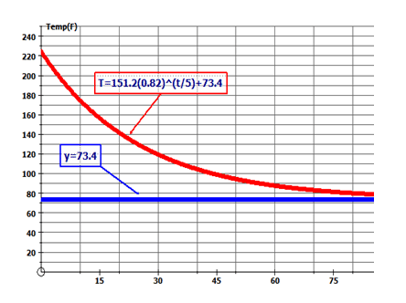

$$
\begin{align*}
a&=250\\
b&=2\\
x&=12\\
c&=3\\
y&=a(b)^{\left ( \frac{x}{c} \right )}
\end{align*}
$$

Use the exponential function to determine the number of spores present after 12 hours.

$y=250(2)^{\left ( \frac{12}{3} \right )}=250(2)^4=4000$

Therefore there are 4000 spores present after 12 hours.

**Summary**

In this lesson you have learned of exponential functions of the form $y=a(b)^{\frac{x}{c}}$ and of the form $y=a(b)^{\frac{x}{c}}+d$. You learned to use these exponential functions to solve real world problems and how to sketch a graph to model the functions. In addition, you learned that the horizontal asymptote of an exponential function of the form $y=a(b)^{\frac{x}{c}}+d$ has $y=d$ as its equation. With the horizontal asymptote shifting from $y=0$ to $y=d$, the range of the function changes to $R=\{y|y>d, \ y \varepsilon R \}$

**Problem Set**

**Based on what you have learned about exponential functions, list the properties of an exponential function of the form $y=a(b)^{\frac{x}{c}}+d$.** (Hint: Use the properties of $y=b^x$ as a guide).

**Write an exponential function in the form $y=a(b)^{\frac{x}{c}}$ to model each table of values.**

1.  .

____$$
\begin{align*}
& X \qquad 0 \qquad 5 \qquad 10 \qquad 15 \quad \ \ 20 \qquad \ 25\\
& Y \qquad 8 \qquad 4 \qquad \ 2 \qquad \ 1 \qquad 0.5 \qquad 0.25
\end{align*}
$$__

$$
\begin{align*}
& X \qquad 0 \qquad 5 \qquad 10 \qquad 15 \quad \ \ 20 \qquad \ 25\\
& Y \qquad 8 \qquad 4 \qquad \ 2 \qquad \ 1 \qquad 0.5 \qquad 0.25
\end{align*}
$$__

__$$
\begin{align*}
& X \qquad 0 \qquad 5 \qquad 10 \qquad 15 \quad \ \ 20 \qquad \ 25\\
& Y \qquad 8 \qquad 4 \qquad \ 2 \qquad \ 1 \qquad 0.5 \qquad 0.25
\end{align*}
$$__

$$
\begin{align*}
& X \qquad 0 \qquad 5 \qquad 10 \qquad 15 \quad \ \ 20 \qquad \ 25\\
& Y \qquad 8 \qquad 4 \qquad \ 2 \qquad \ 1 \qquad 0.5 \qquad 0.25
\end{align*}
$$

2.  .

____$$
\begin{align*}
& X \qquad 0 \qquad 3 \quad \ \ 6 \qquad 9 \qquad \ 12 \qquad \ 15\\
& Y \qquad 2 \quad \ \ 10 \quad \ 50 \quad \ 250 \quad \ 1250 \quad \ 6250
\end{align*}
$$__

$$
\begin{align*}
& X \qquad 0 \qquad 3 \quad \ \ 6 \qquad 9 \qquad \ 12 \qquad \ 15\\
& Y \qquad 2 \quad \ \ 10 \quad \ 50 \quad \ 250 \quad \ 1250 \quad \ 6250
\end{align*}
$$__

__$$
\begin{align*}
& X \qquad 0 \qquad 3 \quad \ \ 6 \qquad 9 \qquad \ 12 \qquad \ 15\\
& Y \qquad 2 \quad \ \ 10 \quad \ 50 \quad \ 250 \quad \ 1250 \quad \ 6250
\end{align*}
$$__

$$
\begin{align*}
& X \qquad 0 \qquad 3 \quad \ \ 6 \qquad 9 \qquad \ 12 \qquad \ 15\\
& Y \qquad 2 \quad \ \ 10 \quad \ 50 \quad \ 250 \quad \ 1250 \quad \ 6250
\end{align*}
$$

3.  .

____$$
\begin{align*}
& X \quad -4 \qquad 0 \qquad 4 \qquad \ 8 \qquad \quad 12 \qquad \quad 16\\
& Y \qquad 6 \qquad 2.4 \quad 0.96 \quad 0.384 \quad 0.1536 \quad 0.06144
\end{align*}
$$__

$$
\begin{align*}
& X \quad -4 \qquad 0 \qquad 4 \qquad \ 8 \qquad \quad 12 \qquad \quad 16\\
& Y \qquad 6 \qquad 2.4 \quad 0.96 \quad 0.384 \quad 0.1536 \quad 0.06144
\end{align*}
$$__

__$$
\begin{align*}
& X \quad -4 \qquad 0 \qquad 4 \qquad \ 8 \qquad \quad 12 \qquad \quad 16\\
& Y \qquad 6 \qquad 2.4 \quad 0.96 \quad 0.384 \quad 0.1536 \quad 0.06144
\end{align*}
$$__

$$
\begin{align*}
& X \quad -4 \qquad 0 \qquad 4 \qquad \ 8 \qquad \quad 12 \qquad \quad 16\\
& Y \qquad 6 \qquad 2.4 \quad 0.96 \quad 0.384 \quad 0.1536 \quad 0.06144
\end{align*}
$$

4.  .

____$$
\begin{align*}
& X \quad -0.6 \quad -0.3 \quad \ \ 0 \qquad 0.3 \qquad 0.6 \qquad \ \ 0.9\\
& Y \qquad \ 10 \qquad \ \ 12 \quad 14.4 \quad 17.28 \quad 20.736 \quad 24.8832
\end{align*}
$$__

$$
\begin{align*}
& X \quad -0.6 \quad -0.3 \quad \ \ 0 \qquad 0.3 \qquad 0.6 \qquad \ \ 0.9\\
& Y \qquad \ 10 \qquad \ \ 12 \quad 14.4 \quad 17.28 \quad 20.736 \quad 24.8832
\end{align*}
$$__

__$$
\begin{align*}
& X \quad -0.6 \quad -0.3 \quad \ \ 0 \qquad 0.3 \qquad 0.6 \qquad \ \ 0.9\\
& Y \qquad \ 10 \qquad \ \ 12 \quad 14.4 \quad 17.28 \quad 20.736 \quad 24.8832
\end{align*}
$$__

$$
\begin{align*}
& X \quad -0.6 \quad -0.3 \quad \ \ 0 \qquad 0.3 \qquad 0.6 \qquad \ \ 0.9\\
& Y \qquad \ 10 \qquad \ \ 12 \quad 14.4 \quad 17.28 \quad 20.736 \quad 24.8832
\end{align*}
$$

5.  .

____$$
\begin{align*}
& X \qquad 0 \qquad 0.1 \qquad 0.2 \qquad \ 0.3 \qquad \ 0.4 \qquad \ 0.5\\
& Y \qquad 5 \qquad \ 15 \qquad \ 45 \qquad \ 135 \qquad 405 \qquad 1215
\end{align*}
$$__

$$
\begin{align*}
& X \qquad 0 \qquad 0.1 \qquad 0.2 \qquad \ 0.3 \qquad \ 0.4 \qquad \ 0.5\\
& Y \qquad 5 \qquad \ 15 \qquad \ 45 \qquad \ 135 \qquad 405 \qquad 1215
\end{align*}
$$__

__$$
\begin{align*}
& X \qquad 0 \qquad 0.1 \qquad 0.2 \qquad \ 0.3 \qquad \ 0.4 \qquad \ 0.5\\
& Y \qquad 5 \qquad \ 15 \qquad \ 45 \qquad \ 135 \qquad 405 \qquad 1215
\end{align*}
$$__

$$
\begin{align*}
& X \qquad 0 \qquad 0.1 \qquad 0.2 \qquad \ 0.3 \qquad \ 0.4 \qquad \ 0.5\\
& Y \qquad 5 \qquad \ 15 \qquad \ 45 \qquad \ 135 \qquad 405 \qquad 1215
\end{align*}
$$

**A radioactive isotope decays at the rate indicated by the exponential function $A(t)=800\left(\frac{1}{2}\right)^{\frac{t}{1500}}$, where ‘$t$’ is the time in years and $A(t)$ is the amount of the isotope, in grams, remaining.**

1.  What is the initial mass of the isotope?
2.  How long will it take for the isotope to be reduced to half of its original amount?
3.  What will the mass of the isotope be after 4500 years?

**For each of the following exponential functions state the equation of the horizontal asymptote, the $y$\-intercept, the range, and whether it is a growth or decay function.**

1.  $y=2^x+5$
2.  $y=2(3)^x$
3.  $y=6\left(\frac{1}{3}\right)^x+5$
4.  $y=4(0.4)^x+1.8$
5.  $y=12(1.25)^x$

**A hot cup of coffee cools exponentially with time as it sits on the teacher’s desk. Its change in temperature, $T$, measured in $^{\circ}C$, with respect to time, $t$, in minutes, is modeled with the following function:**

$$
T=82(0.6)^{\frac{t}{12}}+20
$$

1.  What is the initial temperature of the coffee?
2.  What is the room temperature of the classroom?
3.  At what rate is the temperature of the coffee changing over time?
4.  What is the coffee’s temperature after 30 minutes?
5.  What is the temperature of the coffee after 1 hour?

</article>

### 6.7 Quiz II

<article>

Multiple Choice – Please **_circle_** the letter of the correct answer and **_write_** that letter in the space provided to the left of each question.

1.  \_\_\_\_\_\_\_\_ What is the standard form of $6.57 \times 10^{-4}$?
    1.  $\frac{1}{657}$
    2.  0.000657
    3.  65 700
    4.  \-0.000657
2.  \_\_\_\_\_\_\_\_ What is the solution for the exponential equation $4^{3x+5}=2^{4x-3}$?
    1.  8
    2.  \-10
    3.  $-\frac{2}{7}$
    4.  $-\frac{13}{2}$
3.  \_\_\_\_\_\_\_\_ If $f(x)=2(3^{-x+3})$, what is the value of ‘$x$’ if $f(x)=\frac{2}{9}$?
    1.  $x=5$
    2.  $x=9$
    3.  $x=3$
    4.  $x=2$
4.  \_\_\_\_\_\_\_\_ What is the result of expressing 37,100,000 in scientific notation?
    1.  $3.71 \times 10^2$
    2.  $3.71 \times 10^7$
    3.  $0.371 \times 10^3$
    4.  $3.71 \times 10^{-1}$
5.  \_\_\_\_\_\_\_\_ If Maria invested $200 in a savings bond that appreciates 8% compounded annually, how much money will she have at the end of 10 years?
    1.  $631.78
    2.  $216.59
    3.  $431.78
    4.  $416.59
6.  \_\_\_\_\_\_\_\_ What is the $y$\-intercept of the exponential function $y=4(0.5)^x$?
    1.  $y=0.02$
    2.  $y=0.5$
    3.  $y=6$
    4.  $y=4$
7.  \_\_\_\_\_\_\_\_ If the mean temperature in Phoenix is $94^\circ F$ and is expected to increase by 0.5% annually, what will be the predicted mean temperature in 10 years?
    1.  $98.8^\circ F$
    2.  $94.5^\circ F$
    3.  $118^\circ F$
    4.  $105^\circ F$
8.  \_\_\_\_\_\_\_\_ For the following values of an exponential function, what is the common ratio? (0, 2.5); (1, 2.97); (2, 3.54); (3, 4.2); (4, 5.01)
    1.  0.84
    2.  2.5
    3.  1.19
    4.  0.47
9.  \_\_\_\_\_\_\_\_ What is the result of $7.8 \times 10^{-3} -4.6 \times 10^{-4}$?
    1.  $3.2 \times 10^{-1}$
    2.  $3.2 \times 10^{-7}$
    3.  $73.4 \times 10^{-3}$
    4.  $7.34 \times 10^{-3}$
10. \_\_\_\_\_\_\_\_ The population of 978 students at a high school depreciates by 8% each year. If this trend continues, how many students will be in attendance 6 years from now?
    1.  256
    2.  593
    3.  722
    4.  385

</article>

### 6.8 Chapter Test

<article>

**Part A**

Multiple Choice – Please **_circle_** the letter of the correct answer and **_write_** that letter in the space provided to the left of each question.

1.  \_\_\_\_\_\_\_\_ What is the $y$\-intercept of the graph of $f(x)=4(2)^{x+2}$?
    1.  12
    2.  48
    3.  16
    4.  32
2.  \_\_\_\_\_\_\_\_ A bacteria decays such that only one-half of the original amount is present after 48 days. After 192 days, how much of the original 100 g of bacteria will remain?
    1.  25 g
    2.  6.25 g
    3.  3.175 g
    4.  12.5 g
3.  \_\_\_\_\_\_\_\_ What is the equation of the horizontal asymptote of the function $y=4(2)^x-3$?
    1.  $y=3$
    2.  $y=0$
    3.  $y=1$
    4.  $y=-3$
4.  \_\_\_\_\_\_\_\_ What is the solution for $9.6 \times 10^{-5}-5.4 \times 10^{-6}$?
    1.  $9.06 \times 10^{-5}$
    2.  $4.2 \times 10^{-5}$
    3.  $9.06 \times 10^{-6}$
    4.  $9.06 \times 10^{-4}$
5.  \_\_\_\_\_\_\_\_ If $f(x)=3^x-2x$, what is the value of $f(-1)$?
    1.  $f(-1)=-\frac{5}{3}$
    2.  $f(-1)=\frac{7}{3}$
    3.  $f(-1)=0$
    4.  $f(-1)=-1$
6.  \_\_\_\_\_\_\_\_ Which one of the following is **NOT** a growth curve?
    1.  $y=(4)^x$
    2.  $y=(3)^{-x}$
    3.  $y=\left(\frac{7}{6}\right)^x$
    4.  $y=\left(\frac{3}{4}\right)^x$
7.  \_\_\_\_\_\_\_\_ What is the solution for the exponential equation $8^{3x-4}+7=71$?
    1.  $x=0$
    2.  $x=25$
    3.  $x=2$
    4.  $x=20$
8.  \_\_\_\_\_\_\_\_ What is the simplified expression for $x^{-2}+y^{-1}$?
    1.  $\frac{y+x^2}{x^2y}$
    2.  $\frac{1}{x^2+y}$
    3.  $(x+y)^{-3}$
    4.  $y+x^2$
9.  \_\_\_\_\_\_\_\_ If you deposit $1250 into a bank account with an interest rate of 0.75% compounded annually, how much interest would be earned over a period of 15 years?
    1.  $1398.25
    2.  $16.70
    3.  $2448.60
    4.  $148.25
10. \_\_\_\_\_\_\_\_ What is the solution for $(6.8 \times 10^4)\times(7.3 \times 10^5)$?
    1.  $496.4 \times 10^{10}$
    2.  $4.964 \times 10^{10}$
    3.  $49.64 \times 10^{10}$
    4.  $4.964 \times 10^{9}$
11. \_\_\_\_\_\_\_\_ What is the value of $\left(\frac{1}{2}\right)^{-3}+9^\frac{1}{2}-64^\frac{2}{3}$?
    1.  \-27
    2.  21
    3.  \-5
    4.  73
12. \_\_\_\_\_\_\_\_ Which equation represents the exponential function graphed below? 
    
    \[Figure 1\]
    
    1.  $y=2(3)^x+4$
    2.  $y=3(2)^x+4$
    3.  $y=7(2)^x$
    4.  $y=4(2)^x+3$

**Part B**

**Answer the following questions in the space provided. Show all work.**

1.  Solve the following exponential equations for ‘$x$'.
    1.  $\sqrt[3]{\frac{9^{x+1}}{27^x}}=81$
    2.  $(x-2)^\frac{1}{2}=9^\frac{1}{4}$
2.  Simplify each of the following:
    1.  $\frac{\left(\frac{1}{3}\right)^{-2}+8^\frac{2}{3}+5^{0}}{\left(\frac{1}{49}\right)^\frac{1}{2}}$
    2.  $\frac{(16^{m-2})(8^{2m+1})}{(4^{m-1})^{-3}}$
3.  When you take an aspirin, it slowly dilutes and becomes absorbed by the body at a rate of 30% per hour. If you take a 10 mg capsule at noon, how much of the capsule still remains in your body at 4:00 pm?
4.  The new Maytag dishwasher has a digital thermometer that records the internal temperature of the machine during and following its wash cycle so as to prevent burns. The temperature display is updated and recorded every 8 minutes. On the day the company tested the dishwasher, the temperature in the kitchen was $66^\circ F$.

The following table shows the readings that were recorded during the testing of the dishwasher.

| **Time(min)** | 0   | 8   | 16  | 24  | 32  | 10  |
| --- | --- | --- | --- | --- | --- | --- |
| **Temp$(^\circ F)$** | 202 | 188.4 | 176.2 | 165.2 | 155.2 | 146.4 |

(a) Determine the rate at which the dishwasher is cooling.

(b) Determine the value of ‘$a$’ in $y=a(b)^\frac{x}{c}+d$ and write an exponential function to model the temperature of the dishwasher after ‘$t$’ minutes.

(c) Determine the equation of the horizontal asymptote.

(d) Determine the temperature of the dishwasher after 3 hours.

(e) Draw a sketch to represent the dishwasher’s change in temperature over time.

\[Figure 2\]

</article>

## 7.0 Many Terms Means Much Work

<article>

**Introduction**

In this chapter you will learn what is meant by the term polynomial and how to do the basic operations of addition, subtraction and multiplication. Multiplication will apply the distributive property and will also include special products. You will also learn how to divide polynomials. To simplify the process of division, you will also learn the remainder and factor theorems for division of polynomials.

This chapter will also include the factorization of polynomials including common factors, factoring $ax^2+bx+c$ where $a=1$ and $ax^2+bx+c$ where $a\ne1$ by using the decomposition method. Included in factoring will also be special cases. The process of factoring will be applied to solving quadratic equations and will be extended to include the factorization of cubic polynomials. The chapter will conclude with the graphing of polynomial functions.

**Lessons**

In this chapter you will do the following lessons:

* Operations with Polynomials
* Factoring Polynomials
* Quadratic Equations
* Cubic Polynomials
* Division of Polynomials
* Graphing Polynomial Functions

</article>

### 7.1 Operations with Polynomials

<article>

**Objectives**

The lesson objectives for Operations with Polynomials are:

* Addition and subtraction of polynomials
* Multiplication of polynomials
* Special products $\left [ (x+y)(x-y); (x+y)^2 \right .$ and $\left . (x-y)^2 \right ]$

Addition and Subtraction of Polynomials
---------------------------------------

**Introduction**

In this concept you will begin your study of polynomials by learning how to add and subtract polynomials. The word polynomial actually comes from the Greek word _poly_ meaning “many” and the Latin word _binomium_ meaning “binomial”. A monomial can be a number or a variable (like $x$) or it can be the product of a number and a variable. With monomials, the exponents are always in whole numbers. So $3x^2$ is a monomial but $3x^{\frac{1}{2}}$ is not. A binomial has two terms. You remember binomials from a previous chapter. They are the mathematical expressions that have the form $(x+a)$ such as $(x+1)$ or $(2x+3)$. A trinomial has three terms. The expression $2x^2+3x-4$ has three terms and therefore is a trinomial. A polynomial, by definition, is also a monomial or the sum of a number of monomials. So $3x^2$ can be considered a polynomial, $2x+3$ can be considered a polynomial, and $2x^2+3x-4$ can be considered a polynomial.

In this lesson, you are going to learn how to add and subtract polynomials. Adding and subtracting polynomials uses a strategy that is similar to the one used in the **Can You Make it True** chapter. Once you have mastered this concept, you will perform multiplication of polynomials using the distributive property. This, again, is a property you have learned in earlier chapters.

Finally in this lesson, you will have a chance to explore some special polynomials. These polynomials will have the form $(x+y)(x-y),(x+y)^2$ and $(x-y)^2$. You will have a chance to see how these polynomials differ from the ones you worked with in earlier lessons. Now let’s begin!

**Watch This**

[Khan Academy Adding and Subtracting Polynomials 1](http://www.youtube.com/watch?v=ahdKdxsTj8E)

!?[video](https://www.youtube.com/watch?v=ahdKdxsTj8E)

**Guidance**

You are going to build a rectangular garden in your back yard. The garden is 2 m more than 1.5 times as long as it is wide. Write an expression to show the area of the garden.

\begin{align*}
Area &= l \times w \\
Area &= (1.5x + 2) x \\
Area &= 1.5x^2 + 2x
\end{align*}
$$

**Example A**

Find the sum of $(3x^2+2x-7)+(5x^2-3x+3)$

Remember in earlier chapters when you used algebra tiles to solve for equations with variables on one side of the equation? Algebra tiles can also be used when adding and subtracting polynomials. Look at the example below.

First, let’s put out the algebra tiles that match your polynomials.

.")

 + (5x^2-3x+3) = 8x^2-x-4$")

**Example B**

Find the difference of $(5x^2+8x+6)-(4x^2+5x+4)$

For this one, try a different method. Let’s try the vertical method where you line up the polynomials vertically and then subtract them.

Find the sum of $(3x^2+6x^2-7x+5)+(4x^2+3x-8)$

For this one, try another method. Let’s try the horizontal method where you line up the polynomials horizontally and then add them.

$$
\begin{align*}
(3x^3+6x^2-7x+5)+(4x^2+3x-8)&=3x^3+(6x^2+{\color{blue}4x^2})+(-7x+{\color{blue}3x})+(5-{\color{blue}8}) \\
&=3x^3+10x^2-4x-3
\end{align*}
$$

**Vocabulary**

__Binomial__

A **_binomial_** has two terms that are added or subtracted from each other. Each term of a binomial is a variable $(x)$, a product of a number and a variable $(4x)$, or the product of multiple variables with or without a number $(4x^2y + 3)$. One of the terms in the binomial can be a number.

__Monomial__

A **_monomial_** can be a number or a variable (like $x$) or it can be the product of a number and a variable (like $3x$ or $3x^2$). A monomial has only one term.

__Polynomial__

A **_polynomial_**, by definition, is also a monomial or the sum of a number of monomials. So $3x^2$ can be considered a polynomial, $2x+3$ can be considered a polynomial, and $2x^2+3x-4$ can be considered a polynomial.

__Trinomial__

A **_trinomial_** has three terms $(4x^2+3x-7)$. Each term of a trinomial can be a variable $(x)$, a product of a number and a variable $(3x)$, or the product of multiple variables with or without a number $(4x^2)$. One of the terms in the trinomial can be a number $(-7)$.

__Variable__

A **_variable_** is an unknown quantity in a mathematical expression. It is represented by a letter. It is often referred to as the literal coefficient.

**Guided Practice**

1. Use algebra tiles to add the polynomials $(2x^2+4x+3) + (x^2-3x-2)$.

2. Use the vertical method to subtract the polynomials $(5x^2-9x+7) - (3x^2-5x+6)$.

3. Use the horizontal method to add the polynomial $(8x^3+5x^2-4x+2) + (4x^3+7x-5)$.

**Answers**

1. $(2x^2+4x+3) + (x^2-3x-2)$

Step 1: Set up the algebra tiles

(2x^2+4x+3) + (x^2-3x-2) = 3x^2+x+1
$$

2. $(5x^2-9x+7) - (3x^2-5x+6)$

&nbsp; 

$$
\begin{align*}
& \quad \ \ 5x^2 -9x +7 \quad \Longrightarrow \quad 5x^2-9x+7 \\
&-\underline{(3x^2-5x+6)} \qquad \quad \underline{-3x^2+5x-6} \\
& \qquad \qquad \qquad \qquad \qquad \quad \ 2x^2-4x+1
\end{align*}
$$

Therefore: $(5x^2-9x+7) - (3x^2-5x+6) = 2x^2-4x+1$

3. $(8x^3+5x^2-4x+2) + (4x^3+7x-5)$

$$
\begin{align*}
(8x^3+5x^2-4x+2) + (4x^3+7x-5) &= (8x^3+{\color{blue}4x^3}) + (5x^2) + (-4x+{\color{blue}7x}) + (2-{\color{blue}5}) \\
(8x^3+5x^2-4x+2) + ({\color{blue}4x^3}+{\color{blue}7x}-{\color{blue}5}) &= 12x^3 + 5x^2 + 3x -3
\end{align*}
$$

**Summary**

When adding and subtracting polynomials, you can use algebra tiles to help visualize the problem or you can use the vertical or horizontal methods. To use algebra tiles, simply place the tiles down that match your polynomials and eliminate the pairs that add up to zero (called the zero pairs). Whatever is left over is the answer to your problem. To use the vertical method, simply line the polynomials up in a vertical column and add or subtract like terms. To use the horizontal method, simply line the polynomials up in a horizontal row and add or subtract like terms.

**Problem Set**

**Use algebra tiles to solve the following problems.**

1.  $(x^2+4x+5) + (2x^2+3x+7)$
2.  $(2r^2+6r+7) + (3r^2+5r+8)$
3.  $(3t^2-2t+4) + (2t^2+5t-3)$
4.  $(4s^2-2s-3) + (5s^2+7s-6)$
5.  $(5y^2+7y-3) + (-2y^2-5y+6)$

**Use the vertical method to solve each of the following problems.**

1.  $(6x^2+36x+13) + (4x^2+13x+33)$
2.  $(12a^2+13a+7) + (9a^2+15a+8)$
3.  $(9y^2-17y-12) + (5y^2+12y+4)$
4.  $(11b^2+7b-12) - (15b^2-19b-21)$
5.  $(25x^2+17x-23) - (-14x^3-14x-11)$

**Use the horizontal method to solve each of the following problems.**

1.  $(-3y^2+10y-5) + (5y^2+5y+8)$
2.  $(-7x^2-5x+11) + (5x^2+4x-9)$
3.  $(9a^3-2a^2+7) + (3a^2+8a-4)$
4.  $(3x^2-2x+4) - (x^2+x-6)$
5.  $(4s^3+4s^2-5s-2) - (-2s^2-5s+6)$

Multiplication of Polynomials
-----------------------------

**Introduction**

In this second concept of lesson **Operations with Polynomials**, you will learn how to multiply polynomials. When multiplying polynomials, you will use the distributive property. Remember that the distributive property states that the product of a number and a sum is equal to the sum of the individual products of the number and the addends. In other words if you were to multiply $3 \times(5x+2)$ you would get $15x+6$. You have seen the distributive property before but in this lesson you will apply it to multiplying binomials to get larger polynomials or multiplying trinomials and binomials to get polynomials with degrees greater than 2.

**Watch This**

[Khan Academy Multiplying Polynomials](http://www.youtube.com/watch?v=gg6vUnElXqo)

!?[video](https://www.youtube.com/watch?v=gg6vUnElXqo)

**Guidance**

Jack was asked to frame a picture. He was told that the ratio of height to width of the frame was to be 5 inches longer than the glass width and 7 inches longer than the glass height. Jack measures the glass and finds the height to width ratio is 4:3. Write the expression to determine the area of the picture frame.

What is known?

The height is 7 inches longer than the glass

The glass has a height to width ratio of 4:3

The equations:

The height of the picture frame is $4x + 7$

The width of the picture frame is $3x + 5$

The formula:

$$
\begin{align*}
\text{Area} &= w \times h \\
\text{Area} &= (3x + 5) (4x + 7) \\
\text{Area} &= 12x^2 + 21x + 20x + 35 \\
\text{Area} &= 12x^2 + 41x + 35
\end{align*}
$$

**Example A**

Use the distributive property to find the product of $(x+6)(x+5)$

Remember to answer this question; you will use the distributive property. The distributive property would tell you to multiply $x$ in the first set of brackets by everything inside the second set of brackets, then multiply 6 in the first set of brackets by everything in the second set of brackets. Let's see what that looks like.

Use the distributive property to find the product of $(2x+5)(x-3)$

To answer this question; you will also use the distributive property. The distributive property would tell you to multiply $2x$ in the first set of brackets by everything inside the second set of brackets, then multiply 5 in the first set of brackets by everything in the second set of brackets. Let's see what that looks like.

Use the distributive property to find the product of $(4x+3)(2x^2+3x-5)$

At first, this question may seem different but you still use the distributive property to find the polynomial. The distributive property would tell you to multiply $4x$ in the first set of brackets by everything inside the second set of brackets, then multiply 3 in the first set of brackets by everything in the second set of brackets. Let's see what that looks like.

__Distributive Property__

The **_distributive property_** is a mathematical way of grouping terms. It states that the product of a number and a sum is equal to the sum of the individual products of the number and the addends. For example, in the expression: ${\color{red}\frac{2}{3}} ({\color{blue}x + 5})$, the distributive property states that the product of a number $\left({\color{red}\frac{2}{3}}\right)$ and a sum $({\color{blue}x+5})$ is equal to the sum of the individual products of the number $\left({\color{red}\frac{2}{3}}\right)$ and the addends $({\color{blue}x}$ and ${\color{blue}5})$.

__Like Terms__

**_Like terms_** refer to terms in which the degrees match and the variables match. For example $3x$ and $4x$ are like terms.

**Guided Practice**

1. Use the distributive property to find the product of $(x+3)(x-6)$.

2. Use the distributive property to find the product of $(2x+5)(3x^2-2x-7)$.

3. An average football field has the dimensions of 160 ft by 360 ft. If the expressions to find these dimensions were $(3x+7)$ and $(7x+3),$ what value of $x$ would give the dimensions of the football field?

**Answers**

1. $(x+3)(x-6)$

(3x^2 - 2x - 7)$")

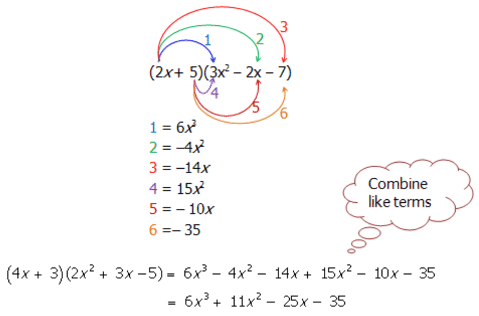

$$
\begin{align*}
\text{Area} &= 360 \times 160 \\
(7x+3) &= 360 \\
7x &= 360 - 3 \\
7x &= 357 \\
x &= 51 \\ \\
(3x +7) &= 160 \\
3x &= 160 - 7 \\
3x &= 153 \\
x &= 51
\end{align*}
$$

Therefore the value of $x$ that satisfies the expressions is 51.

**Summary**

With multiplying binomials and polynomials to get even larger polynomials, you can use the distributive property. Remember that when using the distributive property, everything in the first set of brackets must first be multiplied by everything in the second set of brackets. After you have done this, you can simply combine like terms and then you have your final answer.

**Problem Set**

**Use the distributive property to find the product of each of the following polynomials:**

1.  $(x+4)(x+6)$
2.  $(x+3)(x+5)$
3.  $(x+7)(x-8)$
4.  $(x-9)(x-5)$
5.  $(x-4)(x-7)$

**Use the distributive property to find the product of each of the following polynomials:**

1.  $(x+3)(x^2+x+5)$
2.  $(x+7)(x^2-3x+6)$
3.  $(2x+5)(x^2-8x+3)$
4.  $(2x-3)(3x^2+7x+6)$
5.  $(5x-4)(4x^2-8x+5)$

**Use the distributive property to find the product of each of the following polynomials:**

1.  $9a^2(6a^3+3a+7)$
2.  $-4s^2(3s^3+7s^2+11)$
3.  $(x+5)(5x^3+2x^2+3x+9)$
4.  $(t-3)(6t^3+11t^2+22)$
5.  $(2g-5)(3g^3+9g^2+7g+12)$

Special Cases
-------------

**Introduction**

With multiplying binomials, there are special cases that when you learn to recognize them, it makes the multiplication faster and more efficient. In this concept you are going to learn the pattern that is involved with special cases of polynomials. Once you start to see this pattern in the math you are doing, your problem-solving will most likely become quicker.

There are three different special products that will be looked at in this concept. These include the following:

1.  $(x+y)^2 = x^2 + 2xy + y^2$
2.  $(x-y)^2 = x^2 - 2xy + y^2$
3.  $(x+y)(x-y) = x^2 - y^2$

The strategy to solve these special cases is the same one we used in the previous concept. In other words, you again are going to use the distributive property. However, as you go through this concept, make sure you pay particular attention to the patterns that result when you multiply the two binomials.

**Watch This**

[Khan Academy Special Products of Binomials](http://www.youtube.com/watch?v=4GcNzvILqtM)

!?[video](https://www.youtube.com/watch?v=4GcNzvILqtM)

**Guidance**

A flower is homozygous blue (RR) and another flower is homozygous white (rr). Use a Punnett square to show that a mixture of the two can produce a white flower.

$0.5B + 0.5W$

The offspring will have the genetic makeup (the mixture produced) using the equation:

$(0.5B + 0.5W)^2$

Notice that this is one of the special products (special product numbered 1 above).

$(x+y)^2=x^2+2xy+y^2$

So you can expand the offspring genetic makeup equation to find out the percentage of offspring (or flowers) that will be blue, white, or light blue.

**Example A**

Find the product: $(x+11)^2$.

This is one of the special products similar to the previous example. The first step is to expand the binomials before applying the distributive property.

Find the product: $(x-7)^2$.

This is a second type of the special products of polynomials. Again, the first step is to expand the binomials before applying the distributive property.

Find the product: $(x+9)(x-9)$

This is the third type of the special products of polynomials. For this type, the binomials are already expanded and you just need to apply the distributive property.

Special Product: $(x+y)(x-y)= x^2 - y^2$

Example: $(x+9)(x-9)= x^2 - 81$

**Vocabulary**

__Distributive Property__

The **_distributive property_** is a mathematical way of grouping terms. It states that the product of a number and a sum is equal to the sum of the individual products of the number and the addends. For example, in the expression: ${\color{red}3}({\color{blue}x + 5})$, the distributive property states that the product of a number $({\color{red}3})$ and a sum $({\color{blue}x + 5})$ is equal to the sum of the individual products of the number $({\color{red}3})$ and the addends $({\color{blue}x}$ and ${\color{blue}5})$.

**Guided Practice**

1. Expand the following binomial: $(x+4)^2$.

2. Expand the following binomial: $(5x -3)^2$.

3. Determine whether each of the following is a difference of two squares:

a) $a^2-16$

b) $9b^2-49$

c) $c^2-60$

**Answers**

1. $(x+4)^2$.

^2$")

 ")

$$
\begin{align*}
&\qquad a^2 - 16 \\
&\quad \nearrow \qquad \ \nwarrow \\
& a^2 = a \times a \quad \text{Factors of} \ 16: \\
&\qquad \qquad \quad \ \ 1 \times 16 \\
&\qquad \qquad \quad \ \ 2 \times 8 \\
&\qquad \qquad \quad \ \ {\color{red}4 \times 4}
\end{align*}
$$

Therefore: $a^2 - 16 = (a+4)(a-4)$ Yes, $a^2 - 16$ is a difference of two squares.

b) 

$$
\begin{align*}
&\qquad 9b^2 - 49 \\
&\quad \nearrow \qquad \ \ \nwarrow \\
& b^2 = b \times b \quad \text{Factors of} \ 49: \\
& \quad \mathbf{and} \qquad \qquad 1 \times 49 \\
&\text{Factors of } 9: \quad {\color{red}7 \times 7}\\
& 1 \times 9\\
& {\color{red}3 \times 3}
\end{align*}
$$

Therefore: $9b^2 - 49 = (3b +7)(3b - 7)$

Yes, $9b^2 - 49$ is a difference of two squares.

c) 

$$
\begin{align*}
&\qquad c^2 - 60 \\
&\quad \nearrow \qquad \ \ \nwarrow \\
& c^2 = c \times c \quad \text{Factors of} \ 60: \\
&\qquad \qquad \quad \ \ 1 \times 60 \\
&\qquad \qquad \quad \ \ 2 \times 30 \\
&\qquad \qquad \quad \ \ 3 \times 20 \\
&\qquad \qquad \quad \ \ 4 \times 15 \\
&\qquad \qquad \quad \ \ 5 \times 12 \\
&\qquad \qquad \quad \ \ 6 \times 10
\end{align*}
$$

Since there are no factors of 60 that are matches (like $4 \times 4 = 16$ and $7 \times 7 = 49$), the expression $c^2 - 60$ cannot be said to be a difference of two squares.

**Summary**

The previous three lessons began your study of polynomial expansion. Specifically you have had the opportunity to add, subtract and multiply polynomials using algebra tiles, the horizontal and vertical methods, and the distributive property. In this final lesson of the section, you were working with special cases of polynomials. There are three special cases that, when learned, help you to be able to find the product of binomials a little more easily and quickly.

The three special cases involve squaring a binomial such as in $(x + y)^2$, and $(x - y)^2$, and one case involving multiplication of the sum and difference binomials $(x + y)(x - y)$. The three special cases along with an example are shown for you below.

Special Case 1: $(x+y)^2 = x^2 + 2xy + y^2$

Example: $(x+5)^2 = x^2 + 10x +25$

Special Case 2: $(x-y)^2 = x^2 - 2xy + y^2$

Example: $(2x-8)^2 = 4x^2 -32x + 64$

Special Case 3: $(x+y)(x-y) = x^2 - y^2$

Example: $(5x+10)(5x-10) =25x^2 - 100$

**Problem Set**

**Expand the following binomials:**

1.  $(t+12)^2$
2.  $(w+15)^2$
3.  $(2e+7)^2$
4.  $(3z+2)^2$
5.  $(7m+6)^2$

**Expand the following binomials:**

1.  $(g-6)^2$
2.  $(d-15)^2$
3.  $(4x-3)^2$
4.  $(2p-5)^2$
5.  $(6t-7)^2$

**Find the product of the following binomials:**

1.  $(x+13)(x-13)$
2.  $(x+6)(x-6)$
3.  $(2x+5)(2x-5)$
4.  $(3x+4)(3x-4)$
5.  $(6x+7)(6x-7)$

Summary
-------

In this first lesson of chapter **Many Terms Means Much Work** you have been introduced to operations of polynomials. You have learned to add and subtract polynomials in the first concept. In the second concept, you took a look at multiplication of polynomials. You had the opportunity to use algebra tiles once again for expanding and then simplifying polynomials. As you found out in previous chapters, algebra tiles are an effective tool for visualizing mathematical concepts. However, sometimes these tools can become cumbersome and inefficient when numbers become too large or the equations too complex. Alternate methods for adding, subtracting, and multiplying polynomials were shown, namely the vertical and horizontal methods. These two methods can be quite efficient to use when expanding and/or simplifying polynomials.

You also used the distributive property. This property you have used in many chapters throughout this text and it is a very valuable method to learn in mathematics. For expanding polynomials, the distributive property is the key to the solution process. By using the distributive property and then combining like terms, or what is known as expanding polynomials, including the special cases learned in the final concept of this lesson, the solution process becomes clear.

Remember as well that the three special cases $\{(x+y)^2,(x-y)^2,$ and $(x+y)(x-y)\}$ should be studied so that they can be easily and quickly identified. This will save you time (and energy) when solving polynomial problems because their products can be rapidly determined.

</article>

### 7.2 Factoring Polynomials

<article>

**Introduction**

In this lesson you will learn to factor polynomials by removing the greatest common factor. You will also learn to factor polynomials of the form $ax^2+bx+c$ where $a=1$. You will learn a method known as the ‘box’ method to do this factoring. You will use the same method to factor polynomials of the form $ax^2+bx+c$ where $a \neq 1$. The last polynomials that you will earn to factor are those known as the sum and difference of two squares.

**Objectives**

The lesson objectives for Factoring Polynomials are:

* Factoring a common factor
* Factoring $ax^2+bx+c$ where $a=1$
* Factoring $ax^2+bx+c$ where $a \neq 1$
* Factoring the sum and difference of two squares

Factoring a Common Factor
-------------------------

**Introduction**

In this concept you will learn how to factor polynomials by looking for a common factor. You have used common factors before in earlier courses. Common factors are numbers (numerical coefficients) or letters (literal coefficients) that are a factor in all parts of the polynomials. In earlier courses of mathematics you would have studied common factors of two numbers. Say you had the numbers 25 and 35. Two of the factors of 25 are ${\color{red}5} \times {\color{red}5}$. Two of the factors of 35 are ${\color{red}5} \times 7$. Therefore a common factor of 25 and 35 would be ${\color{red}5}$.

In this concept of Lesson **Factoring Polynomials**, you will be using the notion of common factors to factor polynomials. Sometimes simple polynomials can be factored by looking for a common factor among the terms in the polynomial. Often, for polynomials, this is referred to as the Greatest Common Factor. The Greatest Common Factor (or GCF) is the largest monomial that is a factor of (or divides into evenly) each of the terms of the polynomial. This concept will be the first explored in Lesson **Factoring Polynomials**.

**Watch This**

[Khan Academy Factoring and the Distributive Property](http://www.youtube.com/watch?v=499MvHFrqUU)

!?[video](https://www.youtube.com/watch?v=499MvHFrqUU)

**Guidance**

Factor the following polynomial: $12x^4 + 6x^3 + 3x^2$.

Step 1: Identify the GCF of the polynomial.

If you look at just the factors of the numbers you can see the following:

$$
\begin{align*}
& \quad 12x^4 + 6x^3 + 3x^2\\
& \ \swarrow \qquad \quad \downarrow \qquad \ \searrow\\
& 1 \times 12 \quad 1 \times 6 \quad 1 \times {\color{red}3}\\
& 2 \times 6 \quad \ \ 2 \times {\color{red}3}\\
& {\color{red}3} \times 4
\end{align*}
$$

Looking at the factors for each of the numbers, you can see that 12, 6, and 3 can all be divided by 3.

Also notice that each of the terms has an $x^2$ in common.

$$
\begin{align*}
12x^4 &= 12 \cdot x \cdot x \cdot {\color{red}x} \cdot {\color{red}x}\\
6x^3 &= 6 \cdot x \cdot {\color{red}x} \cdot {\color{red}x}\\
3x^2 &= 3 \cdot {\color{red}x} \cdot {\color{red}x}
\end{align*}
$$

So the GCF for this polynomial is $3x^2$

Step 2: Divide out the GCF from each term of the polynomial.

$$
\begin{align*}
& 12x^4+6x^3+3x^2=3x^2(4x^2+2x+1)\\
& \qquad \qquad \qquad \qquad \qquad \swarrow \qquad \ \downarrow \qquad \ \searrow\\
& \qquad \qquad \text{Remember the} \ \ \text{Remember the} \ \text{Remember}\\
& \qquad \qquad \text{factors of} \ 12 \quad \ \ \text{factors of} \ 6 \qquad \text{the factors of}\\
& \qquad \qquad \text{included} \ {\color{red}3} \times 4 \quad \text{included} \ 2 \times {\color{red}3} \ \ 3 \ \text{are} \ 1 \times {\color{red}3}\\
& \qquad \qquad \text{and} \ {\color{red}x^2} \cdot x^2=x^4 \ \text{and} \ {\color{red}x^2} \cdot x=x^3 \ \text{and} \ {\color{red}x^2} \cdot 1=x^2
\end{align*}
$$

**Example A**

Factor the following binomial: $5a + 15$

Step 1: Identify the GCF.

$$
\begin{align*}
& \quad 5a+15\\
& \ \ \swarrow \qquad \searrow\\
& 1 \times {\color{red}5} \qquad 1 \times 15\\
& \qquad \qquad \ 3 \times {\color{red}5}
\end{align*}
$$

Looking at the factors for each of the numbers, you can see that 5 and 15 can both be divided by 5.

So the GCF for this binomial is 5.

Step 2: Divide out the GCF from each term of the binomial.

$5a + 15 = 5(a + 3)$

**Example B**

Factor the following polynomial: $4x^2+8x-2$

Step 1: Identify the GCF.

&nbsp;

$$
\begin{align*}
& \quad \ 4x^2+8x-2\\
& \ \ \swarrow \quad \quad \ \downarrow \quad \quad \searrow\\
& 1 \times 4 \quad 1 \times 8 \quad 1 \times {\color{red}2}\\
& 2 \times {\color{red}2} \quad {\color{red}2} \times 4
\end{align*}
$$

Looking at the factors for each of the numbers, you can see that 4, 8, and 2 can all be divided by 2.

So the GCF for this polynomial is 2.

Step 2: Divide out the GCF from each term of the polynomial.

$4x^2+8x-2=2(2x^2+4x-1)$

**Example C**

Factor the following polynomial: $3x^5-9x^3-6x^2$

Step 1: Identify the GCF.

&nbsp;

$$
\begin{align*}
& \quad \ 3x^5-9x^3-6x^2\\
& \ \ \swarrow \quad \quad \ \downarrow \qquad \ \searrow\\
& 1 \times {\color{red}3} \quad 1 \times 9 \quad 1 \times 6\\
& \qquad \quad \ 3 \times {\color{red}3} \quad 2 \times {\color{red}3}
\end{align*}
$$

Looking at the factors for each of the numbers, you can see that 3, 9, and 6 can all be divided by 3.

Also notice that each of the terms has an $x^2$ in common.

$$
\begin{align*}
3x^5 &= 3 \cdot x \cdot x \cdot x \cdot {\color{red}x} \cdot {\color{red}x}\\
-9x^3 &= -9 \cdot x \cdot {\color{red}x} \cdot {\color{red}x}\\
-6x^2 &= -6 \cdot {\color{red}x} \cdot {\color{red}x}
\end{align*}
$$

So the GCF for this polynomial is $3x^2$.

Step 2: Divide out the GCF from each term of the polynomial.

$3x^5-9x^3-6x^2=3x^2(x^3-3x-2)$

**Vocabulary**

__Common Factor__

**_Common factors_** are numbers (numerical coefficients) or letters (literal coefficients) that are factors in all terms of the polynomials.

__Greatest Common Factor__

The **_Greatest Common Factor_** (or **_GCF_**) is the largest monomial that is a factor of (or divides into evenly) each of the terms of the polynomial.

**Guided Practice**

1.  Find the common factors of the following: $a^2(b+7)-6(b+7)$
2.  Factor the following polynomial: $5k^6+15k^4+10k^3+25k^2$
3.  Factor the following polynomial: $27x^3y+18x^2y^2+9xy^3$

**Answers**

1. $a^2(b+7)-6(b+7)$

Step 1: Identify the GCF.

$$
a^2(b+7)-6(b+7)
$$

This problem is a little different in that if you look at the expression you notice that $(b + 7)$ is common in both terms. Therefore $(b + 7)$ is the common factor.

So the GCF for this expression is $(b + 7)$.

Step 2: Divide out the GCF from each term of the expression.

$$
a^2 (b+7)-6(b+7)=(a^2-6)(b+7)
$$

2. $5k^6+15k^4+10k^3+25k^2$

Step 1: Identify the GCF.

$$
\begin{align*}
& \quad 5k^6+15k^4+10k^3+25k^2\\
& \swarrow \qquad \quad \downarrow \qquad \quad \downarrow \qquad \quad \searrow\\
& 1 \times {\color{red}5} \quad 1 \times 15 \quad 1 \times 10 \quad 1 \times 25\\
& \qquad \quad \ 3 \times {\color{red}5} \quad \ 2 \times {\color{red}5} \quad \ \ 5 \times {\color{red}5}
\end{align*}
$$

Looking at the factors for each of the numbers, you can see that 5, 15, 10, and 25 can all be divided by 5.

Also notice that each of the terms has an $k^2$ in common.

$$
\begin{align*}
5k^6 &= 5 \cdot k \cdot k \cdot k \cdot k \cdot {\color{red}k} \cdot {\color{red}k}\\
15k^4 &= 15 \cdot k \cdot k \cdot {\color{red}k} \cdot {\color{red}k}\\
10k^3 &= 10 \cdot k \cdot {\color{red}k} \cdot {\color{red}k}\\
25k^2 &= 25 \cdot {\color{red}k} \cdot {\color{red}k}
\end{align*}
$$

So the GCF for this polynomial is $5k^2$.

Step 2: Divide out the GCF out of each term of the polynomial.

$$
5k^6+15k^4+10k^3+25k^2=5k^2(k^4+3k^2+2k+5)
$$

3. $27x^3y+18x^2y^2+9xy^3$

Step 1: Identify the GCF.

$$
\begin{align*}
& \quad 27x^3y+18x^2y^2+9xy^3\\
& \quad \swarrow \qquad \quad \ \downarrow \qquad \quad \ \searrow\\
& 1 \times 27 \quad \ \ 1 \times 18 \qquad \ 1 \times {\color{red}9}\\
& 3 \times {\color{red}9} \ \qquad 2 \times {\color{red}9} \ \ \qquad 3 \times 3\\
& \qquad \qquad \ \ 3 \times 6
\end{align*}
$$

Looking at the factors for each of the numbers, you can see that 27, 18, and 9 can all be divided by 9.

Also notice that each of the terms has an $xy$ in common.

$$
\begin{align*}
27x^3y &= 27 \cdot x \cdot x \cdot {\color{red}x} \cdot {\color{red}y}\\
18x^2y^2 &= 18\cdot x \cdot {\color{red}x} \cdot y \cdot {\color{red}y}\\
9xy^3 &= 9 \cdot {\color{red}x} \cdot y \cdot y \cdot {\color{red}y}
\end{align*}
$$

So the GCF for this polynomial is $9xy$.

Step 2: Divide out the GCF out of each term of the polynomial

$27x^3y+18x^2y^2+9xy^3=9xy(3x^2+2xy+y^2)$

**Summary**

Remember that when you factor expressions such as polynomials by taking out a common factor, the first step is to find the greatest common factor for all of the terms in the polynomial. Once you have found this common factor, you must divide each of the terms of the polynomial by this common factor.

The common factor can be a number, a variable, or a combination of both. This means that you need to look at both the numbers in the terms of the polynomial and the variables of the polynomial.

**Problem Set**

**Find the common factors of the following:**

1.  $2x(x-5)+7(x-5)$
2.  $4x(x-3)+5(x-3)$
3.  $3x^2(e+4)-5(e+4)$
4.  $8x^2(c-3)-7(c-3)$
5.  $ax(x-b)+c(x-b)$

**Factor the following polynomial:**

1.  $7x^2 + 14$
2.  $9c^2+3$
3.  $8a^2+4a$
4.  $16x^2+24y^2$
5.  $2x^2-12x+8$

**Factor the following polynomial:**

1.  $32w^2x+16xy+8x^2$
2.  $12abc+6bcd+24acd$
3.  $20x^2y-10x^2y^2+25x^2y$
4.  $12a^2b-18ab^2-24a^2b^2$
5.  $4s^3t^2-16s^2t^3+12st^2-24st^3$

Factoring ax² + bx + c where a = 1
----------------------------------

**Introduction**

When there are no common factors, you have to have an alternate method to factor polynomials. In this concept you will begin to factor polynomials that are known as quadratic expressions. A quadratic expression is one in which one variable will have an exponent of two and all other variables will have an exponent of one. The general form of a quadratic expression is $ax^2+bx+c$ where ‘$a$’ and ‘$b$’ are the coefficients of $x^2$ and $x$, respectively, and ‘$c$’ is a constant. The term $ax^2$ is the one that is necessary to have a quadratic expression. These expressions are often the result of multiplying polynomials. In this concept, you will be working with quadratic expressions where the coefficient for ‘$a$’ is equal to 1.

Quadratic expressions of the form $ax^2+bx+c$ can be factored using algebra tiles. To do this, the tiles modeling the trinomial are laid out. Next, with the $x^2$ tile in the upper left position the remaining tiles are arranged around it to form a rectangle. By forming a rectangle, you can easily see the factors of the quadratic expression. Remember you have used algebra tiles before in previous lessons and chapters. The large square tile represents an $x^2$, the rectangular tile represents the $x$ tile, and the small squares represent the 1's. These are shown for you below.

[Khan Academy Factoring trinomials with a leading 1 coefficient](http://www.youtube.com/watch?v=nOZTe8jU2g4)

!?[video](https://www.youtube.com/watch?v=nOZTe8jU2g4)

**Guidance**

An electronic sign is used to advertise specials outside a local store. It is shaped like a rectangle. If the dimensions of the sign are known to be represented by the trinomial $x^2-5x+6$, find the binomials that represent the length and width of the electronic sign.

The first step to solving this problem is to lay out the tiles you need to represent the trinomial (or the quadratic expression).

$.")

The length of the rectangle is $(x - 3)$.

Therefore the factors of $x^2-5x+6$ are $(x-3)(x-2)$ or $(x-2)(x-3)$.

**Example A**

Factor $x^2+5x+6$

Step 1: Place the tiles that represent the trinomial in front of you.

1 : $x^2$ tile

5 : $x$ tiles

6 : 1 tiles

$.")

The length of the rectangle is $(x + 3)$.

Therefore the factors of $x^2+5x+6$ are $(x+3)(x+2)$ or $(x+2)(x+3)$.

**Example B**

Factor $x^2-3x+2$

Step 1: Place the tiles that represent the trinomial in front of you.

1 : $x^2$ tile

3 : $-x$ tiles

2 : 1 tiles

$.")

The length of the rectangle is $(x - 2)$.

Therefore the factors of $x^2-3x+2$ are $(x-2)(x-1)$ or $(x-1)(x-2)$.

**Example C**

Factor $x^2-7x+12$

Step 1: Place the tiles that represent the trinomial in front of you.

1 : $x^2$ tile

7 : $-x$ tiles

12 : 1 tiles

$.")

The length of the rectangle is $(x - 4)$.

Therefore the factors of $x^2-7x+12$ are $(x-3)(x-4)$ or $(x-4)(x-3)$.

**Vocabulary**

__Quadratic Expression__

A **_quadratic expression_** is a trinomial in which one variable will have an exponent of two and all other variables will have an exponent of one. The general form of a quadratic expression is $ax^2+bx+c$ where ‘$a$’ and ‘$b$’ are the coefficients of $x^2$ and $x$, respectively, and ‘$c$’ is a constant.

**Guided Practice**

1.  Factor $a^2+6a+8$.
2.  Factor $x^2-2x-8$.
3.  Find the binomial dimensions of a rectangle that is represented by the trinomial $h^2+10h+16$.

**Answers**

1. Factor $a^2+6a+8$.

**Step 1:** Place the tiles that represent the trinomial in front of you.

1 : $x^2$ tile

6 : $+ x$ tiles

8 : 1 tiles

$.")

The length of the rectangle is $(a + 4)$.

Therefore the factors of $a^2+6a+8$. are $(a+2)(a+4)$ or $(a+4)(a+2)$.

2. Factor $x^2-2x-8$.

**Step 1:** Place the tiles that represent the trinomial in front of you. In this polynomial you need to find the factors of 8. You can’t build a rectangle with just 2 "$-x$" tiles and 8 "–1" tiles.

The factors of 8 are $1 \times 8$, and $2 \times 4$. Notice that if you use 4 "$-x$" tiles and 2 $+x$ tiles you will end up with 2 "$-x$" tiles left over. Try to build a rectangle with these.

1 : $x^2$ tile

4 : $-x$ tiles

2 : $+x$ tiles

8 : $-1$ tiles

$")

The length of the rectangle is $(x - 4)$

Therefore the factors of $x^2-2x-8$ are $(x+2)(x-4)$ or $(x-4)(x+2)$

3. Find the binomial dimensions of a rectangle that is represented by the trinomial $h^2+10h+16$.

The first step to solving this problem is to lay out the tiles you need to represent the trinomial.

$.")

The length of the rectangle is $(h + 8)$.

Therefore the factors of $h^2+10h+16$ are $(h+8)(h+2)$ or $(h+2)(h+8)$.

**Summary**

In this concept you again used algebra tiles but you used them to factor trinomials known as quadratic expressions. These special trinomials were in the form of $ax^2 + bx + c$ where $a = 1$. Algebra tiles are useful for factoring quadratic expressions because when you lay out the tiles you need and then form your rectangle, you have the binomial factors of the quadratic. Sometimes this approach is not useful, like when the constant $(c)$ is very large. In these cases, algebra tiles become very cumbersome to use. In the next few concepts, you will begin to explore other methods for factoring quadratics.

**Problem Set**

**Factor the following trinomials.**

1.  $x^2+5x+4$
2.  $x^2+12x+20$
3.  $a^2+13a+12$
4.  $z^2+7z+10$
5.  $w^2+8w+15$

**Factor the following quadratic expressions.**

1.  $x^2-7x+10$
2.  $x^2-10x+24$
3.  $m^2-4m+3$
4.  $s^2-6s+7$
5.  $y^2-8y+12$

**Factor the following quadratic expressions.**

1.  $x^2-x-12$
2.  $x^2+x-12$
3.  $x^2-5x-14$
4.  $x^2-7x-44$
5.  $y^2+y-20$

Factoring ax² + bx + c where a ≠ 1
----------------------------------

**Introduction**

In the last concept you learned how to factor quadratics or trinomials $(ax^2+bx+c)$ where $a = 1$. You learned that algebra tiles were very useful as a tool for solving these problems and that by building rectangles, finding the factors of quadratics was a fast way to find the solution. In this lesson, you will work with quadratics, or trinomials, where the value of _a_ does not equal 1. In these problems, algebra tiles may still be useful but may, at some point, become cumbersome due to the large numbers of tiles necessary to build the rectangles. You will use algebra to solve these problems. There are a few other methods that are useful for solving quadratics where $a \neq 1$. One method you learned earlier is the **FOIL** pattern. Remember that with **FOIL**, you multiply the **F**irst two terms, the **O**utside terms, the **I**nside terms and the **L**ast terms. So for example, with the trinomial:

$$
(2x-5)(x+7)=2x^2+9x-35
$$

When you factor trinomials, you are really just using ${\color{red}\mathbf{F}}\mathbf{OI}{\color{blue}\mathbf{L}}$ in reverse. Let’s look at the example below. With the trinomial above $(2x^2+9x-35)$, you had to factor both the 2 and the –35 (both the first number and the last number). You can say then, in general terms, that with the trinomial $ax^2+bx+c$, you have to factor both “$a$” and “$c$”.

$$
\begin{align*}
& ax^2+bx+c=({\color{red}d}x+{\color{blue}e})({\color{red}f}x+{\color{blue}g})\\
& \text{where} \ a={\color{red}d} \times {\color{red}f} \ \text{and} \ c={\color{blue}e} \times {\color{blue}g}
\end{align*}
$$

The middle term $(b)$ is the sum of the outside two and the inside two terms. Therefore

$$
b = {\color{red}d} {\color{blue}g} + {\color{blue}e} {\color{red}f}
$$

In this lesson you will have the opportunity to work through a number of examples to develop mastery at factoring trinomials of the form $ax^2+bx+c$ where $a \neq 1$ using this reverse FOIL method. Now let's begin.

**Guidance**

Jack wants to construct a border around his garden. The garden measures 5 yards by 18 yards. He has enough stone to build a border with a total area of 39 square yards. The border will be twice as wide on the shorter end. What are the dimensions of the border?

\begin{align*}
\text{Area of Garden} &= 18 \times 5 = 90 \ yd^2\\
\text{Area of border} &= 39 \ yd^2\\
\text{Area of Garden} + \text{border} &= (12 + 2x)(5 + x)\\
\text{Area of border} &= (\text{Area of garden} + \text{border}) - \text{Area of garden}\\
39 &= (18 + x)(5 + x) - 90\\
39 &= 90+18x+10x+2x^2-90\\
39 &= 23x+2x^2\\
0 &= 2x^2+23x-39
\end{align*}
$$

Remember: $ax^2+bx+c=({\color{red}d}x+{\color{blue}e})({\color{red}f}x+{\color{blue}g})$

To factor this trinomial try this method:

In this trinomial, the ‘**a**’ value is 2 and the ‘**c**’ value is –39. These values are placed in a box

As shown in the illustration below

** to give the ‘$b$’ value of **+23**.")

$$
\begin{align*}
& 1 \qquad -78 \qquad -1 \qquad 74\\
& 2 \qquad -39 \qquad -2 \qquad 39\\
& 3 \qquad -26 \qquad -3 \qquad 26\\
& 6 \qquad -13 \qquad -6 \qquad 13
\end{align*}
$$

From the list, –3 and 26 will work. Put the factors in the box as shown.

Find the GCF of 2 and –3 it will be 1. Find the GCF of 26 and –39 it will be 13.

Put these numbers in the box as shown.

 (2x - 3)$")

So $2x^2+23x-39=(1x+13)(2x-3)$. To find the dimensions of the border:

&nbsp;

$$
\begin{align*}
& \ (x+13)(2x-3)=0\\
& \ \swarrow \qquad \qquad \searrow\\
& x+13=0 \ \  2x-3=0\\
& x=-13 \quad \ \ x=\frac{3}{2}
\end{align*}
$$

Since $x$ cannot be negative, $x$ must equal $\frac{3}{2}$.

Back to the question!

 = 3 \ yd$")

Length of Border: $x = \frac{3}{2} \ yd$

**Example A**

Factor: $2x^2+11x+15$

In this trinomial, the ‘$a$’ value is 2 and the ‘$c$’ value is 15. Place these values in a box.

** to give the ‘$b$’ value of **+11**.")

$$
\begin{align*}
& 1 \quad 30\\
& 2 \quad 15\\
& 3 \quad 10\\	
& 5 \quad 6
\end{align*}
$$

From the list, 5 and 6 will work. Put the factors in the box as shown.

Find the GCF of 2 and 5. It will be 1. Find the GCF of 6 and 15. It will be 3.

Put these numbers in the box as shown.

 (2x + 5)$")

So $2x^2+11x+15=(x+3)(2x+5)$

**Example B**

Factor: $3x^2-8x-3$

In this trinomial, the ‘$a$’ value is 3 and the ‘$c$’ value is –3. Place the values in a box.

** to give the ‘$b$’ value of **–8**.")

$$
\begin{align*}
& 1 \qquad -9 \qquad -1 \qquad 9\\
& 3 \qquad -3
\end{align*}
$$

From the list, 1 and –9 will work. Put the factors in the box as shown.

Find the GCF of 3 and –9. It will be 3. Find the GCF of 1 and -3. It will be 1.

Put these numbers in the box as shown.

 (1x - 3)$")

So $3x^2-8x-3=(3x+1)(x-3)$

**Example C**

Factor: $5w^2-21w+18$

In this trinomial, the ‘$a$’ value is 5 and the ‘$c$’ value is 18. Place the values in a box.

** to give the ‘$b$’ value of **–21**.")

$$
\begin{align*}
& 1 \qquad 90 \qquad -1 \qquad -90\\
& 2 \qquad 45 \qquad -2 \qquad -45\\
& 3 \qquad 30 \qquad -3 \qquad -30\\
& 5 \qquad 18 \qquad -5 \qquad -18\\
& 6 \qquad 15 \qquad -6 \qquad -15\\
& 9 \qquad 10 \qquad -9 \qquad -10
\end{align*}
$$

From the list, –6 and –15 will work. Put the factors in the box as shown.

Find the GCF of 5 and –15. It will be 5. Find the GCF of –6 and 18. It will be 6.

Put these numbers in the box as shown.

 (x - 3)$")

So $5w^2-21w+18=(5x-6)(x-3)$

**Vocabulary**

__Greatest Common Factor__

The **_Greatest Common Factor_** (or **_GCF_**) is the largest monomial that is a factor of (or divides into evenly) each of the terms of the polynomial.

__Quadratic Expression__

A **_quadratic expression_** is a trinomial in which one variable will have an exponent of two and all other variables will have an exponent of one. The general form of a quadratic expression is $ax^2 + bx + c$ where ‘$a$’ and ‘$b$’ are the coefficients of $x^2$ and $x$, respectively, and ‘$c$’ is a constant.

**Guided Practice**

1.  Factor the following trinomial: $8c^2-2c-3$
2.  Factor the following trinomial: $3m^2+3m-60$
3.  Factor the following trinomial: $5e^3+30e^2+40e$

**Answers**

**Factor...**

1. $8c^2-2c-3$

In this trinomial, the ‘$a$’ value is 8 and the ‘$c$’ value is –3. Place the values in a box.

** to give the ‘$b$’ value of –2.")

$$
\begin{align*}
& 1 \qquad -24 \qquad -1 \qquad 24\\
& 2 \qquad -12 \qquad -2 \qquad 12\\
& 3 \qquad \ -8 \qquad -3 \qquad \ \ 8\\
& 4 \qquad \ -6 \qquad -4 \qquad \ \ 6
\end{align*}
$$

From the list, 4 and –6 will work. Put the factors in the box as shown.

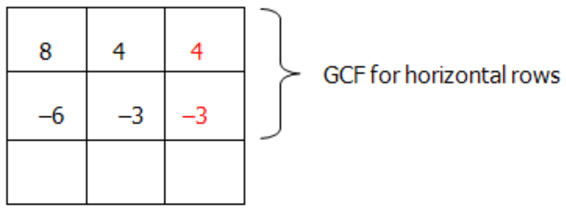

Find the GCF of 8 and –6. It will be 2. Find the GCF of 4 and –3. It will be 1.

Put these numbers in the box as shown.

(4c-3)$")

So $8c^2-2c-3=(2c+1)(4c-3)$

2. $3m^2+3m-60$

First you can factor out the 3 from the polynomial

$$
3m^2+3m-60=3(m^2+m-20)
$$

In this simpler trinomial, the ‘$a$’ value is 1 and the ‘$c$’ value is –20. Place the values in a box.

** to give the ‘$b$’ value of **1**.")

$$
\begin{align*}
& 1 \qquad -20 \qquad -1 \qquad 20\\
& 2 \qquad -10 \qquad -2 \qquad 10\\
& 4 \qquad \ -5 \qquad -4 \qquad \ \ 5
\end{align*}
$$

From the list, –4 and 5 will work. Put the factors in the box as shown.

Find the GCF of 1 and 5. It will be 1. Find the GCF of –4 and –20. It will be –4.

Put these numbers in the box as shown.

 (1m+5)$")

So $3m^2+3m-60=3(m-4)(m+5)$

3. $5e^3+30e^2+40e$

First you can factor out the 5 and one $e$ from the polynomial

$$
5e^3+30e^2+40e=5e(e^2+6e+8)
$$

**First, use the box for the simpler trinomial to factor it:**

**Need:** factors for 8 and a pair that will **combine** to give the ‘$b$’ value of **6**.

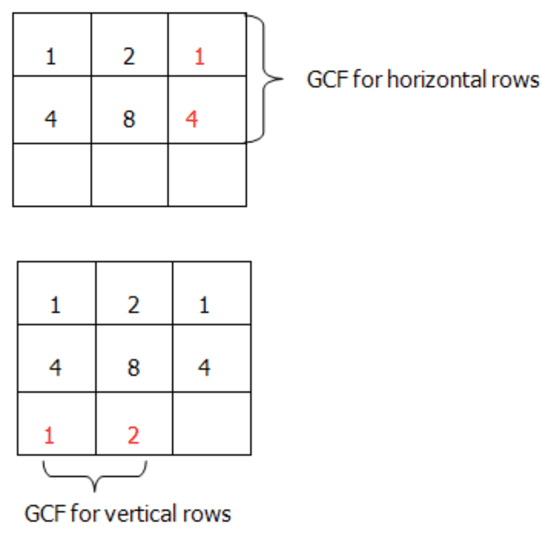

These new numbers represent your factors. $(1e+2)(1e+4)$

So $5e^3+30e^2+40e=5e(e+2)(e+4)$

**Summary**

In the first lesson of this section you learned how to take a common factor out of a polynomial. In the next section you learned to factor trinomials (or quadratics) of the form $ax^2 + bx + c$ where $a = 1$ using algebra tiles. In this lesson, you continued working with trinomials (or quadratics) but in these quadratics $a \neq 1$. As well in this lesson, you were introduced to a neat method known as the box method. With this method, any quadratic can be solved by finding the factors that multiply together to give “$ac$” and combine to give “$b$”. Using the box method and by finding GCFs, the factors of the quadratic can be found.

**Problem Set**

**Factor the following trinomials**

1.  $3x^2+5x+2$
2.  $5x^2+9x-2$
3.  $4x^2+x-3$
4.  $2x^2+7x+3$
5.  $2y^2-15y-8$

**Factor the following trinomials**

1.  $2x^2-5x-12$
2.  $2x^2+11x+12$
3.  $6w^2-7w-20$
4.  $12w^2+13w-35$
5.  $3w^2+16w+21$

**Factor the following trinomials**

1.  $16a^2-18a-9$
2.  $36a^2-7a-15$
3.  $15a^2+26a+8$
4.  $20m^2+11m-4$
5.  $3p^2+17p-20$

Factoring the Sum and Difference of Two Squares
-----------------------------------------------

**Introduction**

In lesson **Addition and Subtraction of Polynomials** you learned about three special cases where binomials can be expanded using the distributive property to make polynomials. These special cases were

1.  $(x+y)^2=x^2+2xy+y^2$
2.  $(x-y)^2=x^2-2xy+y^2$
3.  $(x+y)(x-y)=x^2-y^2$

In this lesson, you will again be working with these special cases. The first two special cases are the sum of two squares. These are often called perfect square trinomials. The third special case is called the difference of two squares. Rather than expanding the binomials to make polynomials as you did in the previous lesson, here you will be factoring the special case polynomials. Factoring is really the reverse of multiplication!

You can use algebra tiles or the box method. Recall that algebra tiles are very visual but can be cumbersome when you need to use a lot of tiles to find the factors.

**Watch This**

[Khan Academy Factoring the Sum and Difference of Squares](http://www.youtube.com/watch?v=tvnOWIoeeaU)

!?[video](https://www.youtube.com/watch?v=tvnOWIoeeaU)

**Guidance**

A box is to be designed for packaging with a side length represented by the quadratic $9b^2 - 64$. If this is the most economical box, what are the dimensions?

First: factor the quadratic to find the value for $b$.

$9b^2-64$

**First, the box:**

**Need:** factors for –576 and a pair that will **combine** to give the ‘$b$’ value of **0**. Start with taking the square root of 576 since you need to have two numbers that are the same. This way they will add to give you 0 and multiply to give 576.

These new numbers represent your factors. $(3b+8)(3b-8)$

So

$$
\begin{align*}
& 9b^2-64=(3b+8)(3b-8)\\
& \qquad \qquad \quad \swarrow \qquad \qquad \searrow\\
& \ \quad 3b+8=0 \qquad \qquad 3b-8=0\\
& \ \qquad \ \ 3b=-8 \qquad \qquad \quad 3b=8\\
& \ \qquad \quad b=\frac{-8}{3} \qquad \qquad \quad \ b=\frac{8}{3}
\end{align*}
$$

The most economical box is a cube. Therefore the dimensions are $\frac{8}{3} \times \frac{8}{3} \times \frac{8}{3}$.

**Example A**

Factor

$2x^2+28x+98$

**First, the box:**

**Need:** factors for 196 and a pair that will **combine** to give the ‘$b$’ value of **28**. Start with taking the square root of 196 since if this is a perfect square it will require two numbers that are the same. This way the middle terms would be the same and would still multiply to give 196. You could also find the factors of 196. This would give you two numbers that add up to 28 and multiply to give you 196.

These new numbers represent your factors. $(2x+14)(2x+14)$

So $2x^2+28x+98=(2x+14)(2x+14)$ Or

$2x^2+28x+98=(2x+14)^2$ SPECIAL CASE 1

**Example B**

Factor:

$8a^2-24a+18$

**First, let's factor out a 2 from this expression (the GCF!)**

$8a^2-24a+18=2(4a^2-12a+9)$

**Next the box:**

**Need:** factors for 36 and a pair that will **combine** to give the ‘$b$’ value of **–12**. Start with taking the square root of 36 since if this is a perfect square it will require two numbers that are the same. This way the middle terms would be the same and would still multiply to give 36. You could also find the factors of 36. This would give you two numbers that add up to –12 and multiply to give you 36.

These new numbers represent your factors.

(2a-3)$")

Or

$8a^2-24a+18=2(2a-3)^2$ SPECIAL CASE 2

**Example C**

Factor:

$x^2-16$

**First the box:**

**Need:** factors for 16 and a pair that will **combine** to give the ‘$b$’ value of **0**. Start with taking the square root of 16 since if this is a difference of two squares it will require two numbers that are the same. This way the middle terms would be equal and cancel each other out; plus the numbers would still multiply to give 16.

These new numbers represent your factors.

(x+4)$ SPECIAL CASE 3")

**Vocabulary**

__Difference of Two Squares__

The **_difference of two squares_** is a pattern found in polynomial expressions. It is a special case where there is no middle term found in the quadratic expression. The general equation for the difference of two squares is:

$x^2+y^2=(x+y)(x-y)$

__Sum of Two Squares__

The **_sum of two squares_** involves two special patterns found in polynomial expressions. These are special cases where the middle term is twice the product of the first and last term. For the quadratic expression $ax^2+bx+c$, the sum of two squares has a middle term $(b)$ equal to $2ac$. These trinomials are often called perfect square trinomials. The general equations for the sum of two square patterns are:

1.  $(x+y)^2=x^2+2xy+y^2$
2.  $(x-y)^2=x^2-2xy+y^2$

**Guided Practice**

1.  Factor completely $s^2-18s+81$
2.  Factor completely $50-98x^2$
3.  Factor completely $4x^2+36x+144$

**Answers**

1. $s^2-18s+81$

**First the box:**

**Need:** factors for 81 and a pair that will **combine** to give the ‘$b$’ value of **–18**. Start with taking the square root of 81 since if this is a perfect square it will require two numbers that are the same. This way the middle terms would be the same and would still multiply to give 81. You could also find the factors of 81.

These new numbers represent your factors.

(s-9)$")

Or

$s^2-18s+81=(s-9)^2$ SPECIAL CASE 2

2. $50-98x^2$

**First: let's factor out a 2 from this expression (the GCF!)**

$50-98x^2=2(25-49x^2)$

**Next the box:**

**Need:** factors for 1225 and a pair that will **combine** to give the ‘$b$’ value of **0**. Start with taking the square root of 1225 since if this is a difference of two squares it will require two numbers that are the same. This way the middle terms would equal each other and cancel each other out; plus the numbers would still multiply to give 16.

These new numbers represent your factors.

(5+7x)$ SPECIAL CASE 3")

3. $4x^2+24x+44$

**First, let's factor out a 4 from this expression (the GCF!)**

$4x^2+48x+144=4(x^2+12x+36)$

**Next the box:**

**Need:** factors for 36 and a pair that will **combine** to give the ‘$b$’ value of **12**. Start with taking the square root of 36 since if this is a perfect square it will require two numbers that are the same. This way the middle terms would be the same and would still multiply to give 36.

These new numbers represent your factors. $(1x+6)(1x+6)$

So $4x^2+48x+144=4(x+6)(x+6)$

Or

$4x^2+48x+144=4(x+6)^2$ SPECIAL CASE 1

**Summary**

In this final lesson you have had the opportunity to apply your skills of factoring to the special cases that you learned about in the previous lesson. Remember the three special cases for polynomials:

A: The Sum of Two Squares

1. $(x+y)^2=x^2+2xy+y^2$

2. $(x-y)^2=x^2-2xy+y^2$

B: The Difference of Two Squares

3. $x^2 + y^2 = (x + y)(x - y)$

It is easier if you are able to recognize the special cases in that you do not need to find all of the factors for $a$ and $b$. Rather, you simply need to find the square root of the “$ac$” term. In special cases 1 and 2, the middle term is always 2$ac$. For special case 3, there is no middle term. Both algebra tiles and the box method provide you with useful methods for factoring these special cases as they did with other polynomials.

**Problem Set**

**Factor the following: (Special Case 1 and 2)**

1.  $s^2+18s+81$
2.  $x^2+12x+36$
3.  $y^2-14y+49$
4.  $4a^2+20a+25$
5.  $9s^2-48s+64$

**Factor the following: (Special Case 3)**

1.  $s^2-81$
2.  $x^2-49$
3.  $4t^2-25$
4.  $25w^2-36$
5.  $64-81a^2$

**Factor the following and identify the case:**

1.  $y^2-22y+121$
2.  $16t^2-49$
3.  $9a^2+30a+25$
4.  $100-25b^2$
5.  $4s^2-28s+49$

Summary
-------

In this lesson, you have worked with adding and subtracting polynomials. You also worked with multiplying polynomials. Remember that when multiplying polynomials, the distributive property is the tool to use. You began your look at the special cases of polynomials and learned that the more you recognize these special cases, the quicker it is to work with them when you are factoring.

In this current lesson, you continued your learning of polynomials by working with the greatest common factor. Make the question simpler by first removing the number or letter that is common in all terms of your polynomial. You also began factoring quadratics (or trinomials) where the coefficient for $a$ in $ax^2 + bx + c$ was equal to 1 and then for cases where a was not equal to 1. Quadratics where $a$ was not equal to one seemed a bit more complex but remember the strategy for solving these remains the same.

Lastly, in this current lesson, you worked with factoring polynomials for three special cases. You may have noticed that these special cases were those you worked with in lesson **Addition and Subtraction of Polynomials**, only here you were factoring them. Again, strategies for factoring the special case polynomials remain the same. As well, if you are able to recognize a quadratic (trinomial) as a special case, factoring becomes somewhat less cumbersome.

</article>

### 7.3 Quiz I

<article>

1.  Which of the following is classified as a monomial?
    1.  $3s$
    2.  $s+3$
    3.  $s^2+3$
    4.  $s^2+s+3$
2.  Which of the following uses the distributive property correctly?
    1.  $2x(x+5)=2x^2+5$
    2.  $2x(x+5)=2x^2+10x$
    3.  $2x(x+5)=2x^2+5x$
    4.  $2x(x+5)=2x+10x=12x$
3.  Which of the following is considered a special case when multiplying polynomials?
    1.  $y^2+9$
    2.  $y^2+8y-16$
    3.  $25y^2-100$
    4.  $y^2+8y+36$
4.  What is the product of $3x(x^2-3x+1)$ ?
    1.  $3x^2-9x+3$
    2.  $3x^3-9x^2+3x$
    3.  $3x^2-3x+3$
    4.  $3x^3-9x^2+3$
5.  What is the product of $(x-8)(x+2)$ ?
    1.  $x^2-6x-16$
    2.  $x^2-10x-16$
    3.  $x^2-16$
    4.  $x^2-6x$
6.  What is the result when $(-3a^2+4a-5)$ is added to $(2a^2+3a+7)$?
    1.  $5a^2+7a+12$
    2.  $a^2+7a-2$
    3.  $-5a^2-7a+12$
    4.  $-a^2+7a+2$
7.  Expand and simplify the following: $2(5x^2-3x+3)-(3x^2+4x-1)$
8.  Multiply the following: $(5s-2)(7s-5)$
9.  Expand and simplify the following: $(x-2)(3x^3+2x^2-3x+2)$
10. Expand and simplify the following: $(4t-5)^2$

</article>

### 7.4 Test I

<article>

1.  Which of the following is the solution to $(-a^2-5a+7)+(-7a^2+5a-2)$?
    1.  $6a^2+5$
    2.  $-8a^2+10a+5$
    3.  $-8a^2+5$
    4.  $-8a^2-10a+5$
2.  Which of the following is the solution to $(5s^3+3s^2-s+1)-(2s^3+s-5)$?
    1.  $3s^3+3s^2-2s-4$
    2.  $3s^3+3s^2-2s-6$
    3.  $3s^3+3s^2-6$
    4.  $3s^3+3s^2-2s+6$
3.  When $\frac{20m^5-5m^3}{4m}$ is simplified, the result is:
    1.  $5(m^4-m^2)$
    2.  $5m^4-\frac{5m^2}{4}$
    3.  $5m^2(m^2-1)$
    4.  $\frac{5m^4-5m^2}{4}$
4.  When $\frac{9a^2b+54ab-9ab^2}{9ab}$ is simplified, the result is:
    1.  $a^2b+ab-ab^2$
    2.  $a^2+1-b^2$
    3.  $a^2-b^2+6$
    4.  $a+b+6$
5.  When $c^2+13c+30$ is factored, the result is?
    1.  $(c+10)(c+3)$
    2.  $(c-10)(c-3)$
    3.  $(c-10)(c+3)$
    4.  $(c+10)(c-3)$
6.  When $x^3-4x^2-4x+16$ is completely factored, the result is?
    1.  $(x^3-4x^2)+(-4x+1)$
    2.  $(x-4)(x-2)(x+2)$
    3.  $(x-4)(x^2-4)$
    4.  $(x-4)(x-2)(x-2)$
7.  Factor the following polynomial: $18s^5a^6-6s^3a^2+3s^2a$
8.  Factor $x^2-12x+36$.
9.  Factor completely $12x^2-28x-160$
10. A room is to be painted that has a floor space represented by the trinomial $2x^2+x-15$. The width of the room is $(x + 3)$, what is the length? If $x = 10 \ ft$, what is the area of the room?

</article>

### 7.5 Quadratic Equations

<article>

**Introduction**

In this lesson you will learn how to solve quadratic equations by factoring. To determine the answers or roots of the equation, you will use the ‘box’ method to factor the quadratic equation. You will then learn that quadratic equations and their solutions are readily applied to real-world situations.

**Objectives**

The lesson objectives for Quadratic Equations are:

* Solving by Factoring
* Real-World Applications

Solving by Factoring
--------------------

**Introduction**

In this concept you will build on your work with polynomials from the previous two lessons. Now that you know how to factor, you can go one step further and solve for the value of your unknown variable. You used this concept briefly in the previous lesson when Jack was constructing a border around his garden in the third objective of lesson **Factoring Polynomials**. When working with polynomials, more specifically trinomials, the problem solving techniques used in earlier lessons provide excellent starting points. In other words, you can use either Algebra tiles or the box method to first factor your trinomial (quadratic). From here, you then would solve for the variable in the quadratic.

Solving a quadratic in factored form uses a property known as the zero-product property. Basically the zero-product property states that if two factors are multiplied together and their product is zero, then one of the factors must equal zero. If you look at the polynomial $(x + 2)(x + 5) = 0$, a value of either –2 or –5 for $x$ will make the statement true. Any other values of $x$ will not. Therefore since these are the only solutions, the equation follows the zero-product property.

**Watch This**

[Khan Academy Factoring Special Products](http://www.youtube.com/watch?v=BI_jmI4xRus)

**Guidance**

The area of a particular rectangle was found to be $A(w)=w^2-8w-58$. Determine the width of the rectangle if the area was known to be 7 units.

In other words, you are being asked to solve the problem

$$
\begin{align*}
& w^2-8w-58=7\\
& OR\\
& w^2-8w-65=0
\end{align*}
$$

You can solve this problem using the box method as you did with quadratics (trinomials) in the previous lesson.

**First: the box!**

**Need:** factors for 65 and a pair that will **combine** to give the **‘$b$’** value of **–8**.

These new numbers represent your factors. $(w+5)(w-13)$

$$
\begin{align*}
& w^2-8w-58=A(w)\\
& OR\\
& w^2-8w-58=7\\
& OR\\
& w^2-8w-65=0\\
& OR\\
&(w+5)(w-13)=0
\end{align*}
$$

So now what are the dimensions??

$$
\begin{align*}
& \quad (w+5)(w-13)=0\\
&\qquad \swarrow \qquad \quad \searrow\\
& w + 5 = 0 \qquad \quad w - 13 = 0\\
&\quad \ \ w = -5 \quad or \qquad \ \ w = 13
\end{align*}
$$

Since you are asked for dimensions, a width of –5 units does not make sense. Therefore, the width of the rectangle would be 13 units.

**Example A**

Solve for $x$ in the following polynomial: $x^2+5x+6=0$.

In order to solve for $x$ you need to factor the polynomial.

**Step 1:** Need the box:

 to give the **‘$b$’** value of +**5.**")

$$
1 \qquad 6\\
2 \qquad 3
$$

From the list, 2 and 3 will work. Put the factors in the box as shown.

These new numbers represent your factors. $(1x+3)(1x+2)$

So $x^2+5x+6=(x+3)(x+2)$

**Step 5:** Solve for the variables.

$$
\begin{align*}
& \qquad (x+3)(x+2)=0\\
&\quad \qquad \swarrow \qquad \quad \searrow\\   
&(x + 3) = 0 \qquad \quad (x+2) = 0\\
&\qquad \ x = -3 \quad \qquad \quad \ \ x = -2
\end{align*}
$$

**Example B**

Solve for $x$ in the following polynomial: $6x^2+x-15=0$.

In order to solve for $x$ you need to factor the polynomial.

**Step 1:** Need the box:

 to give the **‘$b$’** value of +**1**.")

$$
\begin{align*}
&1 \qquad -90 \qquad -1 \qquad 90\\
&2 \qquad -45 \qquad -2 \qquad 45\\
&3 \qquad -30 \qquad -3 \qquad 30\\
&5 \qquad -18 \qquad -5 \qquad 18\\
&6 \qquad -15 \qquad -6 \qquad 15\\
&9 \qquad -10 \qquad -9 \qquad 10
\end{align*}
$$

From the list, –9 and 10 will work. Put the factors in the box as shown.

These new numbers represent your factors. $(2x-3)(3x+5)$.

So $6x^2+x-15=(2x-3)(3x+5)$

**Step 5:** Solve for the variables.

$$
\begin{align*}
& \qquad (2x-3)(3x+5)=0\\
&\quad \qquad \swarrow \qquad \quad \searrow\\
&(2x - 3) = 0 \qquad  (3x+5) = 0\\
&\qquad \ 2x = 3 \quad  \qquad \quad \ \ 3x = -5\\
&\qquad \ \ x = \frac{3}{2} \quad \qquad  \qquad x = \frac{-5}{3}
\end{align*}
$$

**Example C**

Solve for $x$ in the following polynomial: $x^2+2x-35=0$.

In order to solve for $x$ you need to factor the polynomial.

**Step 1:** Need the box:

 to give the ‘$b$’ value of +**2.**")

$$
\begin{align*}
&1 \qquad -35 \qquad -1 \qquad 35\\
&5 \qquad -7 \qquad \ -5 \qquad \ 7
\end{align*}
$$

From the list, –5 and 7 will work. Put the factors in the box as shown.

These new numbers represent your factors. $(1x-5)(x+7)$

So $x^2+2x-35=(x-5)(x+7)$

**Step 5:** Solve for the variables.

$$
\begin{align*}
& \qquad (x-5)(x+7)=0\\
&\quad \qquad \swarrow \qquad \quad \searrow\\
&(x - 5) = 0 \qquad  (x+7) = 0\\
&\qquad \ x = 5 \quad  \qquad \quad \ \ x = -7
\end{align*}
$$

**Vocabulary**

__Zero-product property__

The **_zero-product property_** states that if two factors are multiplied together and their product is zero, then one of the factors must equal zero.

**Guided Practice**

1. Solve for the variable in the polynomial: $x^2+4x-21=0$

2. Solve for the variable in the polynomial: $20m^2+11m-4=0$

3. Solve for the variable in the polynomial: $2e^2+7e+6=0$

**Answers**

1. $x^2+4x-21=0$

In order to solve for $x$ you need to factor the polynomial.

**Step 1:** Need the box:

 to give the ‘$b$’ value of +**4.**")

$$
\begin{align*}
&1 \qquad -21 \quad \ \ -1 \qquad 21\\
&3 \qquad -7 \qquad -3 \qquad 7
\end{align*}
$$

From the list, –3 and 7 will work. Put the factors in the box as shown.

These new numbers represent your factors. $(1x-3)(1x+7)$

So $x^2+4x-21=(x-3)(x+7)$

**Step 5:** Solve for the variables.

$$
\begin{align*}
& \qquad (x-3)(x+7)=0\\
&\quad \qquad \swarrow \qquad \quad \searrow\\
&(x - 3) = 0 \qquad  (x+7) = 0\\
&\qquad \ x = 3 \quad  \qquad \quad \ \ x = -7
\end{align*}
$$

2. Solve for $m$: $20m^2+11m-4=0$

In this trinomial, the ‘$a$’ value is 20 and the ‘$c$’ value is –4. Place the values in a box.

 to give the ‘$b$’ value of **11.**")

$$
\begin{align*}
&1 \qquad -80 \qquad -1 \qquad 80\\
&2 \qquad -40 \qquad -2 \qquad 40\\
&4 \qquad -20 \qquad -4 \qquad 20\\
&5 \qquad -16 \qquad -5 \qquad 16\\
&8 \qquad -10 \qquad -8 \qquad 10
\end{align*}
$$

From the list, –5 and 16 will work. Put the factors in the box as shown.

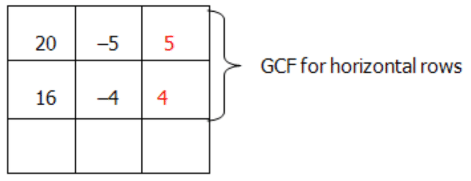

Find the GCF of 20 and 16. It will be 4. Find the GCF of –5 and –4. It will be –1.

Put these numbers in the box as shown.

(5m+4)$")

So $20m^2+11m-4=(4m-1)(5m+4)$

Now that the factoring is done, solve for the variable.

$$
\begin{align*}
& \qquad (4m-1)(5m+4)=0\\
&\quad \qquad \swarrow \qquad \quad \searrow\\
&4m - 1 = 0 \qquad  5m+4 = 0\\
&\quad \ \ 4m = 1 \quad  \qquad \ \ 5m = -4\\
&\qquad  m = \frac{1}{4} \quad  \qquad \quad  m = \frac{-4}{5}
\end{align*}
$$

3. Solve for $e$: $2e^2+7e+6=0$

**First, the box:**

**Need:** factors for 12 and a pair that will **combine** to give the ‘$b$’ value of **7**.

These new numbers represent your factors. $(2e+3)(1e+2)$

Now solve for the variable.

So $2e^2+7e+6=(2e+3)(e+2)$

$$
\begin{align*}
& \qquad (2e+3)(e+2)=0\\
&\quad \qquad \swarrow \qquad \quad \searrow\\   
& 2e+3 = 0 \qquad  \quad e+2 = 0\\
&\quad \ \ 2e = -3 \quad  \qquad \quad e = -2\\
&\qquad  e = \frac{-3}{2}
\end{align*}
$$

**Summary**

Solving for variables in quadratic expressions really involves one more step from previous lessons. When given a quadratic (trinomial) expression, the first step is to factor the expression. Once you have factored the expression, set each factor to zero and solve for the variable.

By finding the variables that make the quadratic expression equal to zero, you are essentially applying the zero-product property.

**Problem Set**

**Solve for the variable in each of the following expressions.**

1.  $(x+1)(x-3)=0$
2.  $(a+3)(a+5)=0$
3.  $(x-5)(x+4)=0$
4.  $(2t-4)(t+3)=0$
5.  $(x-8)(3x-7)=0$

**Solve for the variable in each of the following expressions.**

1.  $x^2+x-12=0$
2.  $b^2+2b-24=0$
3.  $t^2+3t-18=0$
4.  $w^2+3w-108=0$
5.  $e^2-2e-99=0$

**Solve for the variable in each of the following expressions.**

1.  $6x^2-x-2=0$
2.  $2d^2+15d-16=0$
3.  $3s^2+20s+12=0$
4.  $18x^2+12x+2=0$
5.  $3j^2-17j+10=0$

**First, the box:**

**Need:** factors for –12 and a pair that will **combine** to give the ‘$b$’ value of **1.**

These new numbers represent your factors. $(1x+4)(1x-3)$

Now solve for the variable.

So $x^2+x-12=(x+4)(x-3)$

$$
\begin{align*}
& \qquad (x+4)(x-3)=0\\
& \ \qquad \swarrow \qquad \quad \searrow\\
& x+4 = 0 \qquad \ \ x-3 = 0\\
&\quad \ \ x = -4 \quad  \qquad \ \ x = 3
\end{align*}
$$

3.  $t^2+3t-18=0$

**First, the box:**

**Need:** factors for –18 and a pair that will **combine** to give the ‘$b$’ value of **3.**

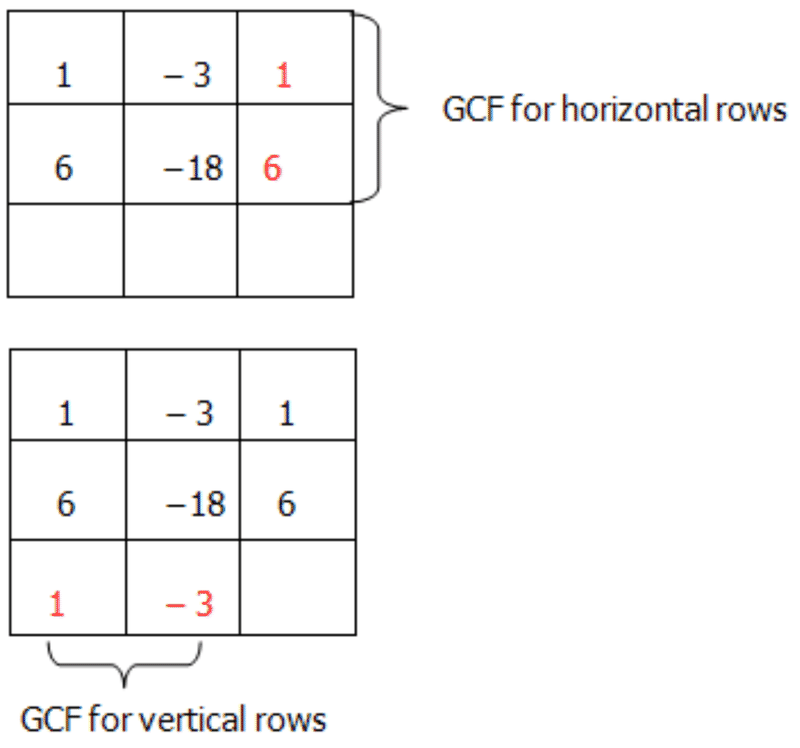

These new numbers represent your factors. $(1t+6)(1t-3)$

Now solve for the variable.

So $t^2+3t-18=(t+6)(t-3)$

$$
\begin{align*}
& \qquad (t+6)(t-3)=0\\
&\quad \qquad \swarrow \qquad \ \searrow\\
& t+6 = 0 \qquad \ \ t-3 = 0\\
&\quad \ \ t = -6 \quad  \qquad \ \ t = 3
\end{align*}
$$

5.  $e^2-2e-99=0$

**First, the box:**

**Need:** factors for –99 and a pair that will **combine** to give the ‘$b$’ value of **–2.**

These new numbers represent your factors. $(1e+9)(1e-11)$

Now solve for the variable.

So $e^2-2e-99=(e+9)(e-11)$

$$
\begin{align*}
& \qquad (e+9)(e-11)=0\\
&\quad \qquad \swarrow \qquad \quad \searrow\\
& e+9 = 0 \qquad \ \ e-11 = 0\\
&\quad \ \ e = -9 \quad  \qquad \quad e = 11
\end{align*}
$$

**Solve...**

1.  $6x^2-x-2=0$

**First, the box:**

**Need:** factors for –12 and a pair that will **combine** to give the ‘$b$’ value of **–1.**

These new numbers represent your factors. $(3x-2)(2x+1)$

Now solve for the variable.

So $6x^2-x-2=(3x-2)(2x+1)$

$$
\begin{align*}
& \qquad (3x-2)(2x+1)=0\\
&\quad \qquad \swarrow \qquad \quad \searrow\\
& 3x-2 = 0 \qquad \ \ 2x+1 = 0\\
&\quad \ \ 3x = 2 \quad  \qquad \quad \ 2x = -1\\
&\quad \ \ \ x = \frac{2}{3} \quad  \qquad \quad \ \ x = \frac{-1}{2}
\end{align*}
$$

3.  $3s^2+20s+12=0$

**First, the box:**

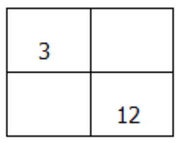

**Need:** factors for 36 and a pair that will **combine** to give the ‘$b$’ value of **20.**

These new numbers represent your factors. $(3s+2)(1s+6)$

Now solve for the variable.

So $3s^2+20s+12=(3s+2)(s+6)$

$$
\begin{align*}
& \qquad (3s+2)(s+6)=0\\
& \ \qquad \swarrow \qquad \quad \searrow\\   
& 3s+2 = 0 \qquad \ \ s+6 = 0\\
&\quad \ \ 3s = -2 \quad  \qquad \ \  s = -6\\
&\quad \ \ \ s = \frac{-2}{3}
\end{align*}
$$

5.  $3j^2-17j+10=0$

**First, the box:**

**Need:** factors for 30 and a pair that will **combine** to give the ‘$b$’ value of **–17.**

These new numbers represent your factors.

So $3j^2-17j+10=(3j-2)(j-5)$

$$
\begin{align*}
& \qquad (3j-2)(j-5)=0\\
&\quad \qquad \swarrow \qquad \quad \searrow\\
& 3j-2 = 0 \qquad \ \ j-5 = 0\\
&\quad \ \ 3j = 2 \quad  \qquad \quad \ j = 5\\
&\quad \ \ \ j = \frac{2}{3}
\end{align*}
$$

Real World Applications
-----------------------

**Introduction**

When working with quadratics, the whole purpose of learning about factoring and solving for roots is to apply these rules in solving real world problems. Quadratic equations appear to you in many forms. The shape of a rainbow is a parabola. A parabola is a quadratic function. The golden gate bridge in San Francisco has the shape of a parabola, again the function of a parabola. If you were to look at an aerial image of the Hoover dam, you would see the shape of a parabola. In business, maximum profits are often calculated using a quadratic equation. Team schedules when designing league schedules are a result of quadratic functions. The list is endless. So you see, whether you realize it or not, the quadratic is a hidden treasure. It is one of those mathematical necessities in life!

In this final concept of lesson **Quadratic Equations**, you will use your knowledge of quadratics to solve some real world problems in quadratics. Here you will see how to pull out the information you need from the problem to find the solution. In an earlier chapter you learned about reading math problems. Combine this knowledge with your knowledge of quadratics and have some fun.

**Watch This**

[Khan Academy Applying Quadratic Equations](http://www.youtube.com/watch?v=Zoa485PqK_M)

!?[video](https://www.youtube.com/watch?v=Zoa485PqK_M)

**Guidance**

Two cars leave an intersection at the same time. One car travels north and the other car travels west. When the car traveling north had gone 24 miles the distance between the cars was four miles more than three times the distance traveled by the car heading west. Find the distance between the cars at that time.

**First** let’s draw a diagram. Since the cars are traveling north and west from the same starting position, the triangle made to connect the distance between them is a right angled triangle.

If you have a right angled triangle, you can use the Pythagorean Theorem.

$$
\begin{align*}
x^2+24^2&=(3x+4)^2\\
x^2+576&=(3x+4)(3x+4)\\
x^2+576&=9x^2+24x+16
\end{align*}
$$

Now simplify the equation so you can solve for the variable, $x$.

$$
\begin{align*}
x^2+576&=9x^2+24x+16\\
0&=8x^2+24x-560\\
0&=8(x^2+3x-70)
\end{align*}
$$

These new numbers represent your factors. $(1x-7)(1x+10)$

Now solve for the variable.

So $8(x^2+3x-70)=8(x-7)(x+10)$

$$
\begin{align*}
3x+4&=3(7)+4\\
&=21+4\\
&=25 \ miles
\end{align*}
$$

**Example A**

The number of softball games that must be scheduled in a league with $n$ teams is given by $G(n)= \frac{n^2 - n}{2}$. Each team can only play every other team exactly once. A league schedules 21 games. How many softball teams are in the league?

The equation you need to use is $G(n)= \frac{n^2-n}{2}$.

You are asked to find $n$ when $G(n)=21$.

So... $21=\frac{n^2-n}{2}$

Simplifying, you get...

$$
\begin{align*}
42&=n^2-n\\
0&=n^2-n-42
\end{align*}
$$

Now solve for $n$ to find the number of teams $(n)$ in the league.

These new numbers represent your factors. $(1n-7)(1n+6)$

Now solve for the variable.

So $(n^2-n-42)=(n-7)(n+6)$

**Example B**

When a home-made rocket is launched from the ground, it goes up and falls in the pattern of a parabola. The height, in feet, of a home-made rocket is given by the equation $h(t) = 160t - 16t^2$ where $t$ is the time in seconds. How long will it take for the rocket to return to the ground?

$h(t)=160t-16t^2$

You are asked to find $t$ when $h(t)=0$, or when the rocket hits the ground and no longer has height.

$$
\begin{align*}
0 &= 160t-16t^2\\
0&=16t(10-t)\\
10-t&=0\\
10&=t
\end{align*}
$$

Therefore the rocket will hit the ground after 10 seconds.

**Example C**

For the question in **Example B**, what would be the height after $t = 2s$?

To solve this problem, you will need to replace $t$ with 2 in the quadratic expression.

$$
\begin{align*}
h(t)&=160t-16t^2\\
h(2)&=160(2)-16(2)^2\\
h(2)&=320-64\\
h(2)&=256.
\end{align*}
$$

Therefore, after 2 seconds, the height of the rocket is 256 feet.

**Vocabulary**

__Pythagorean Theorem__

The **_Pythagorean Theorem_** is a right angled triangle theorem that relates all three sides of a right angled triangle according to the equation $a^2 + b^2 = c^2$, where $a$ and $b$ are the sides (legs) of the triangle and $c$ is the hypotenuse.

1. A rectangle is known to have an area of 520 square inches. The lengths of the sides are shown in the diagram below. Solve for both the length and the width.

=-16t^2+80t+5$ where $t$ is the time in seconds that the ball is in the air.")

Determine the time(s) that the ball is 69 feet high.

3. A manufacturer measures the number of cell phones sold using the binomial $0.015c + 2.81$. She also measures the wholesale price on these phones using a binomial $0.011c +3.52$. Calculate her revenue if she sells 100,000 cell phones.

**Answers**

1. The rectangle has an area of 520 square inches and you know that the area of a rectangle has the formula: $A = l \times w$.

$$
\begin{align*}
520&=(x+7)(2x)\\
520&=2x^2+14x\\
0&=2x^2+14x-520\\
0&=2(x^2+7x-260)
\end{align*}
$$

Now, solve for $x$ so you can use this value to find the length and the width.

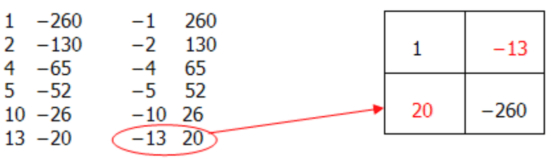

These new numbers represent your factors. $(1x-13)(1x+20)$

Now solve for the variable.

So $2(x^2+7x-260)=2(x-13)(x+20)$

 = 26 \ inches$. As well, the length is $x + 7 = 13 + 7 = 20 \ inches$.")

2. The equation for the ball being thrown is $h(t)=-16t^2+80t+5$. If you were to draw the path of the ball throw, you would see something like that shown below.

 when the ball hits a height of 69 feet. In other words, solve for:")

$$
69=-16t^2+80t+5
$$

To solve for $t$, you have to factor the quadratic and then solve for the value(s) of $t$.

$$
\begin{align*}
&\quad \qquad 0=-16t^2+80t-64\\
&\quad \qquad 0=-16(t^2-5t+4)\\
&\quad \qquad 0=-16(t-1)(t-4)\\
&\qquad \quad \qquad \swarrow \qquad \qquad \searrow\\  
& \quad t - 1 = 0 \qquad  \qquad t-4 = 0\\
&\qquad \ \ t = 1 \quad  \qquad \qquad \ \ t = 4
\end{align*}
$$

Since both values are positive, you can conclude that there are two times when the ball hits a height of 69 feet. These times are at 1 second and at 4 seconds.

3. The number of cell phones sold is the binomial $0.015c + 2.81$.

The wholesale price on these phones is the binomial $0.011c +3.52$.

The revenue she takes in is the wholesale price times the number that she sells.

Therefore: $R(c)=(0.015c+2.81)(0.011c+3.52)$

First, let’s expand the expression for $R$ to get the quadratic expression. Therefore:

$$
\begin{align*}
R(c)&=(0.015c+2.81)(0.011c+3.52)\\
R(c)&=0.000165c^2+0.08371c+9.8912
\end{align*}
$$

The question then asks if she sold 100,000 cell phones, what would her revenue be. Therefore what is $R(c)$ when $c = 100,000$.

$$
\begin{align*}
R(c)&=0.000165c^2+0.08371c+9.8912\\
R(c)&=0.000165(100,000)^2+0.08371(100,000)+9.8912\\
R(c)&=1,658.380.89
\end{align*}
$$

Therefore she would make $1,658,380.89 in revenue.

**Summary**

As you have learned in this lesson, quadratic functions are used in solving many different real world problems. As such, knowing how to factor quadratics and solve for variables is an important skill in mathematics. It is often helpful with these real world problems in quadratics, as with all real world problems in mathematics, to draw a picture in order to visualize what you are asked to solve. In addition, when solving for variables, often you need to use logic to determine if all the values of the variables are actually solutions. For example when factoring the quadratic $x^2-5x+6=0$, you get the solutions for $x$ as $x = 6$ and $x = -1$. If $x$ represents a distance, you can eliminate $x = -1$ as a possible solution.

**Problem Set**

1.  A rectangle is known to have an area of 234 square feet. The lengths of the sides are shown in the diagram below. Solve for both the length and the width. 
    
    \[Figure 60\]
    
2.  Find the measure of $x$ for the rectangle below given that the area is 9 units. 
    
    \[Figure 61\]
    
3.  A pool is treated with a chemical to reduce the amount of algae. The amount of algae in the pool $t$ days after the treatment can be approximated by the function $A(t)=40t^2-300t+500$. How many days after treatments will the pool have the no algae?
4.  Find the measure of $x$ for the rectangle below given that the area is 9 units. 
    
    \[Figure 62\]
    
5.  Kim is drafting the windows for a new building. Their shape can be modelled by the relation $h(w)=-w^2+4$, where $h$ is the height and $w$ is the width of points on the window frame, measured in metres. Find the width of each window at its base.

Summary
-------

In this lesson, you have worked with factoring quadratics with the purpose of solving for the variable. You have used your knowledge gained in the previous lessons (using common factors and factoring techniques) to find the values for the variables in quadratic expressions that follow the zero-product property. You have also used this knowledge to solve quadratic functions that are used in the real world. Applications of quadratics are tremendous in the world from building bridges, to gardens, playing baseball, launching a rocket, and the list goes on.

Quadratic functions can be seen all around you. Now that you have some experience with factoring and solving, your analysis when you see them might be more detailed than before!

</article>

### 7.6 Cubic Polynomials

<article>

**Introduction**

In this lesson you will learn to factor cubic polynomials by removing a common factor. You will also learn to factor these polynomials by grouping. The final concept that you will learn will be to apply factoring by grouping to special products.

**Objectives**

The lesson objectives for Factoring Polynomials are:

* Factoring by Removing a Common Factor
* Factoring by Grouping
* Factoring Special Products

Factoring a Common Factor
-------------------------

**Introduction**

In this concept you will be working with polynomials of the third degree. Polynomials where the largest exponent on the variable is three (3) are known as cubics. Therefore a cubic polynomial is a polynomial of degree equal to 3. An example could include $9x^3+10x-5$. Another example is $8x^3+2x^2-5x-7$. In this first concept of lesson **Cubic Polynomials**, you will be factoring cubics by removing a common factor. Recall in lesson **Factoring Polynomials** when you removed common factors from quadratic (trinomial) functions. The same skills will be applied here. You use the distributive property to factor out the greatest common factor (GCF) when factoring cubics that have common terms in the polynomials.

**Watch This**

[Khan Academy Factoring and the Distributive Property](http://www.youtube.com/watch?v=499MvHFrqUU)

!?[video](https://www.youtube.com/watch?v=499MvHFrqUU)

**Guidance**

Factor completely the following polynomial: $8x^3+24x^2-32x$.

Look for the common factors in each of the terms.

$$
\begin{align*}
8x^3 &= {\color{red}8} \cdot x \cdot x \cdot {\color{red}x} \\
24x^2 &= {\color{red}8} \cdot 3 \cdot x \cdot {\color{red}x} \\
-32x &= {\color{red}8} \cdot -4 \cdot {\color{red}x}
\end{align*}
$$

Therefore:

$$
\begin{align*}
8x^3 +24x^2 + 32x &= 8x(x^2+3x-4) \\
&= 8x(x+4)(x-1)
\end{align*}
$$

**Example A**

Factor completely the following polynomial: $3x^3-15x$.

Look for the common factors in each of the terms.

$$
\begin{align*}
3x^3 &= {\color{red}3} \cdot x \cdot x \cdot {\color{red}x} \\
-15x &= {\color{red}3} \cdot -5 \cdot {\color{red}x}
\end{align*}
$$

Therefore:

$3x^3-15x=3x(x^2-5)$

**Example B**

Factor completely the following polynomial: $2a^3+16a^2+8a$.

Look for the common factors in each of the terms.

$$
\begin{align*}
2a^3 &= {\color{red}2} \cdot a \cdot a \cdot {\color{red}a} \\
16a^2 &= {\color{red}2} \cdot 8 \cdot a \cdot {\color{red}a} \\
8a &= {\color{red}2} \cdot 4 \cdot {\color{red}a}
\end{align*}
$$

Therefore:

$2a^3+16a^2+8a=2a(a^2+8a+4)$

**Example C**

Factor completely the following polynomial: $6s^3+36s^2-18s-42$.

Look for the common factors in each of the terms.

$$
\begin{align*}
6s^3 &= {\color{red}6} \cdot s \cdot s \cdot s \\
36s^2 &= {\color{red}6} \cdot 6 \cdot s \cdot s \\
-18s &= {\color{red}6} \cdot -3 \cdot s \\
-42 &= {\color{red}6} \cdot -7
\end{align*}
$$

Therefore:

$6s^3+36s^2-18s-42=6(s^3+6s^2-3s-7)$.

**Vocabulary**

__Cubic Polynomial__

A **_cubic polynomial_** is a polynomial of degree equal to 3. For example $8x^3+2x^2-5x-7$ is a cubic polynomial.

__Distributive Property__

The **_distributive property_** is a mathematical way of grouping terms. It states that the product of a number and a sum is equal to the sum of the individual products of the number and the addends. For example, in the expression: ${\color{red}\frac{2}{3}}({\color{blue}x + 5})$, the distributive property states that the product of a number $\left({\color{red}\frac{2}{3}}\right)$ and a sum $({\color{blue}x + 5})$ is equal to the sum of the individual products of the number $\left({\color{red}\frac{2}{3}}\right)$ and the addends $({\color{blue}x}$ and ${\color{blue}5})$.

__Greatest Common Factor__

The **_Greatest Common Factor_** (or **_GCF_**) is the largest monomial that is a factor of (or divides into evenly) each of the terms of the polynomial.

**Guided Practice**

1. Factor completely the following polynomial: $9w^3+12w$.

2. Factor completely the following polynomial: $y^3+4y^2+4y$.

3. Factor completely the following polynomial: $2t^3-10t^2+8t$.

**Answers**

1. $9w^3+12w$

Look for the common factors in each of the terms.

$$
\begin{align*}
9w^3 &= {\color{red}3} \cdot 3 \cdot w \cdot w \cdot {\color{red}w} \\
12w &= {\color{red}3} \cdot 4 \cdot {\color{red}w}
\end{align*}
$$

Therefore:

$9w^3+12w=3w(3w^2+4)$

2. $y^3+4y^2+4y$

Look for the common factors in each of the terms.

$$
\begin{align*}
y^3 &= y \cdot y \cdot {\color{red}y} \\
4y^2 &= 4 \cdot y \cdot {\color{red}y} \\
4y &= 4 \cdot {\color{red}y}
\end{align*}
$$

Therefore:

$y^3+4y^2+4y=y(y^2+4y+4)$

3. $2t^3-10t^2+8t$

Look for the common factors in each of the terms.

$$
\begin{align*}
2t^3 &= {\color{red}2} \cdot t \cdot t \cdot {\color{red}t} \\
-10t^2 &= {\color{red}2} \cdot -5 \cdot t \cdot {\color{red}t} \\
8t &= {\color{red}2} \cdot 4 \cdot {\color{red}t}
\end{align*}
$$

Therefore:

$$
\begin{align*}
2t^3 -10t^2 +8t &= 2t(t^2-5t+4) \\
&= 2t(t-4)(t-1)
\end{align*}
$$

**Summary**

In this concept you may have noticed that you used similar problem solving strategies to those you used in lesson **Factoring Polynomials**. You began your study of cubic polynomials by factoring out the greatest common factor (the GCF). This strategy you learned earlier.

One of the easiest ways to visualize the greatest common factor is to isolate each term and break each term down into its smallest parts. In this way, you can quickly see which factors are common to all terms in the polynomial and therefore factor them out of the cubic.

**Problem Set**

**Factor completely each of the following polynomials:**

1.  $6x^3-12$
2.  $4x^3-12x^2$
3.  $8y^3+32y$
4.  $15a^3+30a^2$
5.  $21q^3+63q$

**Factor completely each of the following polynomials:**

1.  $4x^3-12x^2-8$
2.  $12e^3+24e^2-6$
3.  $15s^3-30s+45$
4.  $22r^3-11r^2+44$
5.  $32d^3-16d^2+12d$

**Factor completely each of the following polynomials:**

1.  $5x^3+15x^2+25x-30$
2.  $3y^3-9y^2+27y+36$
3.  $12s^3-24s^2+36s-48$
4.  $8x^3+24x^2+80x$
5.  $5x^3-25x^2-70x$

Factoring by Grouping
---------------------

**Introduction**

Another way that you can use the distributive property to factor polynomials is to factor by grouping. Factoring by grouping is used when you have polynomials with four terms. It cannot be used all of the time but when it can, finding the greatest common factor is possible. In factoring by grouping you factor the terms into two groups and then take the greatest common factor out of one of them.

In this concept you will learn to work with finding the greatest common factor of cubic polynomials using the concept of factoring by grouping. In factoring by grouping, which is different from what you have just learned, you have to first group the terms into two groups. You then factor each group, use your distributive property, then factor any quadratics that remain (and are possible). Let’s begin exploring factoring by grouping cubic polynomials!

**Watch This**

[Khan Academy Factoring by Grouping](http://www.youtube.com/watch?v=X7B_tH4O-_s)

Note: The above video shows factoring by grouping of quadratic (trinomial) expressions. The same problem solving concept will be developed in this lesson for cubic polynomials.

**Guidance**

A tank is bought at the pet store and is known to have a volume of 12 cubic feet. The dimensions are shown in the diagram below. If your new pet requires the tank to be at least 3 feet high, did you buy a big enough tank?

$$
\begin{align*}
V &= l\times w\times h \\
12 &= (x+4) \times (x-1) \times (x) \\
12 &= (x^2 +3x -4) \times (x) \\
12 &= x^3 + 3x^2 -4x \\
0 &= x^3 + 3x^2 -4x -12
\end{align*}
$$

Now you need to factor by grouping.

$0 = (x^3 + 3x^2) - (4x + 12)$

Factor out the common terms in each of the sets of brackets.

$0 = x^2 (x+3) - 4(x + 3)$

Factor out the group of terms $(x + 3)$ from the expression.

$0 = (x+3)(x^2-4)$

Completely factor the remaining quadratic expression.

$0 = (x+3)(x-2)(x+2)$

Now solve for the variable $x$.

$$
\begin{align*}
& \qquad 0 = (x+3) \ (x-2) \ (x+2) \\
& \qquad \qquad \swarrow \qquad \quad \ \downarrow \qquad \quad \ \searrow \\
& \quad \ \ x+3=0 \quad x-2=0 \quad x+2=0 \\
& \qquad \quad \ x=-3 \qquad x=2 \qquad \ \ x=-2
\end{align*}
$$

Since you are looking for a length, only $x = 2$ is a good solution. But since you need a tank 3 feet high and this one is only 2 feet high, you need to go back to the pet shop and buy a bigger one.

**Example A**

Factor the following polynomial by grouping:

$w^3-2w^2-9w+18$.

**Step 1:** Group the terms into two groups. Notice the sign change on the second group because of the negative sign.

$w^3-2w^2-9w+18=(w^3-2w^2)-(9w-18)$

**Step 2:** Factor out the common terms in each of the sets of brackets.

$(w^3-2w^2)-(9w-18) = w^2(w-2)-9(w-2)$

**Step 3:** Use the distributive property to factor out the common group $(w - 2)$.

$w^2(w-2)-9(w-2) = (w-2)(w^2-9)$

**Step 4:** Completely factor the remaining quadratic expression $(w^2-9)$.

$(w-2)(w^2-9) = (w-2)(w+3)(w-3)$

Therefore:

$w^3-2w^2-9w+18 = (w-2)(w+3)(w-3)$

**Example B**

Factor the following polynomial by grouping:

$2s^3-8s^2+3s-12$

**Step 1:** Group the terms into two groups.

$2s^3-8s^2+3s-12 = (2s^3-8s^2)+(3s-12)$

**Step 2:** Factor out the common terms in each of the sets of brackets.

$(2s^3-8s^2) + (3s-12) = 2s^2(s-4)+3(s-4)$

**Step 3:** Use the distributive property to factor out the common group $(s-4)$.

$2s^2(s-4) + 3(s-4) = (s-4) (2s^2+3)$

**Step 4:** The expression $(2s^3+3)$ cannot be factored.

Therefore:

$2s^3-8s^2+3s-12 = (s-4)(2s^2+3)$

**Example C**

Factor the following polynomial by grouping: $y^3+5y^2-4y-20$.

**Step 1:** Group the terms into two groups. Notice the sign change on the second group because of the negative sign.

$y^3+5y^2-4y-20=(y^3+5y^2)-(4y+20)$

**Step 2:** Factor out the common terms in each of the sets of brackets.

$(y^3+5y^2)-(4y+20) = y^2(y+5)-4(y+5)$

**Step 3:** Use the distributive property to factor out the common group $(y + 5)$.

$y^2(y+5)-4(y+5)=(y+5)(y^2-4)$

**Step 4:** Completely factor the remaining quadratic expression $(y^2-4)$.

$(y+5)(y^2-4)=(y+5)(y+2)(y-2)$

Therefore:

$y^3+5y^2-4y-20=(y+5)(y+y)(y-2)$

**Vocabulary**

__Distributive Property__

The **_distributive property_** is a mathematical way of grouping terms. It states that the product of a number and a sum is equal to the sum of the individual products of the number and the addends. For example, in the expression: ${\color{red}\frac{2}{3}}({\color{blue}x + 5})$, the distributive property states that the product of a number $\left({\color{red}\frac{2}{3}}\right)$ and a sum $({\color{blue}x + 5})$ is equal to the sum of the individual products of the number $\left({\color{red}\frac{2}{3}}\right)$ and the addends $({\color{blue}x}$ and ${\color{blue}5})$.

__Greatest Common Factor__

The **_Greatest Common Factor_** (or **_GCF_**) is the largest monomial that is a factor of (or divides into evenly) each of the terms of the polynomial.

**_Guided Practice_**

1. Factor the following polynomial by grouping: $y^3-4y^2-4y+16$.

2. Factor the following polynomial by grouping: $3x^3-4x^2-3x+4$.

3. Factor the following polynomial by grouping: $e^3+3e-4e-12$.

**Answers**

1. $y^3-4y^2-4y+16$

**Step 1:** Group the terms into two groups. Notice the sign change on the second group because of the negative sign.

$y^3-4y^2-4y+12=(y^3-4y^2)-(4y-16)$

**Step 2:** Factor out the common terms in each of the sets of brackets.

$(y^3-4y^2)-(4y-12)=y^2(y-4)-4(y-4)$

**Step 3:** Use the distributive property to factor out the common group $(y - 4)$.

$y^2(y-4)-4(y-4)=(y-4)(y^2-4)$

**Step 4:** Completely factor the remaining quadratic expression $(y^2-4)$.

$(y-4)(y^2-4)=(y-4)(y+2)(y-2)$

Therefore:

$y^3-4y^2-4y+16 = (y-4)(y+2)(y-2)$

2. $3x^3-4x^2-3x+4$

**Step 1:** Group the terms into two groups. Notice the sign change on the second group because of the negative sign.

$3x^3-4x^2-3x+4=(3x^3-4x^2)-(3x-4)$

**Step 2:** Factor out the common terms in each of the sets of brackets.

$(3x^3-4x^2)-(3x-4)=x^2(3x-4)-1(3x-4)$

**Step 3:** Use the distributive property to factor out the common group $(3x-4)$.

$x^2(3x-4)-1(3x-4)=(3x-4)(x^2-1)$

**Step 4:** Completely factor the remaining quadratic expression $(x^2-1)$.

$(3x-4)(x^2-1)=(3x-4)(x+1)(x-1)$

Therefore:

$3x^3-4x^2-3x+4=(3x-4)(x+1)(x-1)$

3. $e^3+3e-4e-12$

**Step 1:** Group the terms into two groups. Notice the sign change on the second group because of the negative sign.

$e^3+3e^2-4e-12 = (e^3+3e^2) - (4e+12)$

**Step 2:** Factor out the common terms in each of the sets of brackets.

$(e^3+3e^2)-(4e+12) = e^2(e+3) -4(e+3)$

**Step 3:** Use the distributive property to factor out the common group $(e + 3)$.

$e^2(e+3)-4(e+3) = (e+3)(e^2-4)$

**Step 4:** Completely factor the remaining quadratic expression $(e^2-4)$.

$(e+3)(e^2-4)=(e+3)(e+2)(e-2)$

Therefore:

$e^3+3e^2-4e-12=(e+3)(e+2)(e-2)$

**Summary**

To factor cubic polynomials by grouping involves four steps, one of which is the distributive property. The distributive property is something you have been learning for a long time in Algebra, and its application in cubic polynomials is just one more way it shows its usefulness. Factoring cubic polynomials involves problem solving skills that you have learned in previous lessons such as factoring quadratics, finding greatest common factors, and combining like terms. For these problems, however, you have the opportunity to combine all of these skills in one problem solving experience!

To solve cubic polynomials by grouping remember the four steps:

**Step 1:** Group the terms into two groups. Remember to watch for the sign change when you are grouping the second set of terms. Placing the negative outside a bracket will change the signs inside the bracket.

**Step 2:** Factor out the common terms in each of the sets of brackets.

**Step 3:** Use the distributive property to factor out the common group (the binomial).

**Step 4:** Completely factor the remaining quadratic expression.

**Problem Set**

**Factor the following cubic polynomials by grouping:**

1.  $x^3-3x^2-36x+108$
2.  $e^3-3e^2-81e+243$
3.  $x^3-10x^2-49x+490$
4.  $y^3-7y^2-5y+35$
5.  $x^3+9x^2+3x+27$

**Factor the following cubic polynomials by grouping:**

1.  $3x^3+x^2-3x-1$
2.  $5s^3-6s^2-45s+54$
3.  $4a^3-7a^2+4a-7$
4.  $5y^2+15y^2-45y-135$
5.  $3x^3+15x^2-12x-60$

**Factor the following cubic polynomials by grouping:**

1.  $2e^3+14e^2+7e+49$
2.  $2k^3+16k^2+38k+24$
3.  $-6x^3+3x^2+54x-27$
4.  $-5m^3-6m^2+20m+24$
5.  $-2x^3-8x^2+14x+56$

Factoring Special Products
--------------------------

**Introduction**

Just as you learned the special products for quadratic (trinomial) expressions, there are special products for cubic polynomials. Remember there were three special products for quadratic (trinomial) expressions. For cubic polynomials, there are two special products. The first is the sum of two cubes. The second is the difference of two cubes. These two special products are shown in the box below.

The sum of two cubes

$$
x^3+y^3=(x+y)(x^2-xy+y^2)
$$

The difference of two cubes

$$
x^3-y^3=(x-y)(x^2+xy+y^2)
$$

In this concept you will learn to factor the two types of special products in cubic polynomials. As it was with the quadratic expressions, being able to recognize that the cubic polynomial is indeed a special product means that you can quickly factor the polynomial. Take a moment to commit these two special cases to memory so that solving these types of cubic polynomials will be more efficient.

**Guidance**

Factor the following cubic polynomial: $375x^3+648$.

To solve this problem you need to first recognize that this is a special case cubic polynomial, namely $x^3+y^3=(x+y)(x^2-xy+y^2)$.

Next if you look at this polynomial, you see that first you can factor out the greatest common factor.

$$
\begin{align*}
& 375x^3+648: \\
& 375x^3 = {\color{red}3} \cdot 125x^3 \\
& 648 = {\color{red}3} \cdot 216
\end{align*}
$$

Therefore $375x^3+648=3(125x^3+216)$

Now let’s factor the special case polynomial. Remember that you have a number (numerical coefficient) attached to the $x$ variable. This means that you have to include it in the factoring. In other words for now becomes $(x+y)=(ax+y)$, and $(x^2-xy+y^2)$ now becomes $(a^2x^2-axy+y^2)$.

$375x^3 +648 = 3(125x^3+216)$

$375x^3 +648 = 3(5x+6)(25x^2-30x+36)$

**Example A**

$x^3+27$

This is the sum of two cubes or $x^3+y^3=(x+y)(x^2-xy+y^2)$.

**Step 1:** Put the cubic polynomial into the sum of two cubes form:

$x^3+27=x^3+y^3$

**Step 2:** Factor out the sum of two cubes

$x^3+3^3=(x+3)(x^2-3x+9)$.

**Example B**

$x^3-343$

This is the difference of two cubes or $x^3-y^3=(x-y)(x^2+xy+y^2)$.

**Step 1:** Put the cubic polynomial into the sum of two cubes form:

$x^3-343=x^3-7^3$

**Step 2:** Factor out the sum of two cubes

$x^3-343=(x-7)(x^2+7x+49)$.

**Example C**

$64x^3-1$

This is the difference of two cubes or $x^3-y^3=(x-y)(x^2+xy+y^2)$.

**Step 1:** Put the cubic polynomial into the sum of two cubes form:

$64x^3-1=4^3x^3-1^3$

**Step 2:** Factor out the sum of two cubes

$64x^3-1=(4x-1)(4^2x^2+4x+1^2)$.

$64x^3-1=(4x-1)(16x^2+4x+1)$.

**Vocabulary**

__Distributive Property__

The **_distributive property_** is a mathematical way of grouping terms. It states that the product of a number and a sum is equal to the sum of the individual products of the number and the addends. For example, in the expression: ${\color{red}3}({\color{blue}x + 5})$, the distributive property states that the product of a number $({\color{red}3})$ and a sum $({\color{blue}x + 5})$ is equal to the sum of the individual products of the number $({\color{red}3})$ and the addends $({\color{blue}x}$ and ${\color{blue}5})$.

__Difference of Two Cubes__

The **_difference of two cubes_** is a special product cubic polynomial in the form of $x^3-y^3$. This type of polynomial can be quickly factored using the expression:

$$
(x^3-y^3)=(x-y)(x^2+xy+y^2)
$$

__Sum of Two Cubes__

The **_sum of two cubes_** is a special product cubic polynomial in the form of $x^3+y^3$. This type of polynomial can be quickly factored using the expression:

$$
(x^3+y^3)=(x+y)(x^2-xy+y^2)
$$

**Guided Practice**

1. Factor the following special product cubic polynomial: $x^3+512$

2. Factor the following special product cubic polynomial: $8x^3+125$

3. Factor the following special product cubic polynomial: $x^3-216$

**Answers**

1. $x^3+512$

This is the sum of two cubes or $x^3+y^3=(x+y)(x^2-xy+y^2)$.

**Step 1:** Put the cubic polynomial into the sum of two cubes form: $x^3+512=x^3+8^3$

**Step 2:** Factor out the sum of two cubes $x^3+8^3=(x+8)(x^2-8x+64)$.

2. $8x^3+125$

This is the sum of two cubes or $x^3+y^3=(x+y)(x^2-xy+y^2)$

**Step 1:** Put the cubic polynomial into the sum of two cubes form: $8x^3+125=2^3x^3+5^3$

**Step 2:** Factor out the sum of two cubes $2^3x^3+5^3=(2x+5)(4x^2-10x+25)$.

3. $x^3-216$

This is the difference of two cubes or $x^3-y^3=(x-y)(x^2+xy+y^2)$.

**Step 1:** Put the cubic polynomial into the sum of two cubes form: $x^3-216=x^3-6^3$

**Step 2:** Factor out the sum of two cubes $x^3-6^3=(x-6)(x^2+6x+36)$.

**Summary**

In lesson **Operations with Polynomials** you learned about special cases in quadratic expressions or polynomials with a degree of two. In this final concept of lesson **Cubic Polynomials**, you learned about the special cases for polynomials with a degree of 3. The box below summarizes the special cases for both quadratic and cubic polynomials.

Special Case 1: $(x+y)^2=x^2+2xy+y^2$

Example: $(x+5)^2=x^2+10x+25$

Special Case 2: $(x-y)^2=x^2-2xy+y^2$

Example: $(2x-8)^2=4x^2-32x+64$

Special Case 3: $(x+y)(x-y)=x^2-y^2$

Example: $(5x+10)(5x-10)=25x^2-100$

Sum of two cubes: $(x^3+y^3)=(x+y)(x^2-xy+y^2)$

Example: $(x^3+125)=(x+5)(x^2-5x+25)$

Difference of two cubes: $(x^3-y^3)=(x-y)(x^2+xy+y^2)$

Example: $(x^3-125)=(x-5)(x^2+5x+25)$

Learning these special cases and being able to recognize them allows you to quickly factor such polynomials in problem solving situations.

**Problem Set**

**Factor the following special product cubic polynomials:**

1.  $x^3+h^3$
2.  $a^3+125$
3.  $8x^3+64$
4.  $x^3+1728$
5.  $2x^3+6750$

**Factor the following special product cubic polynomials:**

1.  $h^3-64$
2.  $s^3-216$
3.  $p^3-512$
4.  $4e^3-32$
5.  $2w^3-250$

**Factor the following special product cubic polynomials:**

1.  $x^3+8$
2.  $y^3-1$
3.  $125e^3-8$
4.  $64a^3+2197$
5.  $54z^3+3456$

Summary
-------

In this lesson, you have worked with cubic polynomials. Cubic polynomials are polynomials of degree three. Examples include $x^3+8, x^3-4x^2+3x-5$, and so on. Notice in these examples, the largest exponent for the variable is three (3). They are all cubics. You worked with three concepts in this lesson. The first concept involved factoring a common factor. You worked on this problem solving strategy earlier with quadratic (trinomial) expressions, and the same procedure is involved with cubic polynomials.

The second concept required you to factor by grouping. This concept can be done with quadratics as well as cubics. It allows you to quickly factor a cubic by grouping the four terms into two groups and then factoring out a common binomial from each group.

The last concept introduced you to the two special products of cubic polynomials. You learned three special cases for quadratics and now you have two special cases for cubics. What is beneficial about these special cases is that they allow you to quickly factor the cubic polynomials by following the associated rule. Knowing how to identify polynomials in these special cases will allow you to quickly factor both quadratic and cubic polynomials.

</article>

### 7.7 Quiz II

<article>

Multiple Choice – Please **_circle_** the letter of the correct answer and **_write_** that letter in the space provided to the left of each question.

1.  \_\_\_\_\_\_\_\_ What are the solutions to the trinomial $x^2-2x-120$?
    1.  –12 and 10
    2.  –10 and 12
    3.  8 and –15
    4.  –8 and 15
2.  \_\_\_\_\_\_\_\_ What are the solutions to the trinomial $2x^2+x-3$?
    1.  –3 and 1
    2.  –1 and 3
    3.  $\frac{3}{2}$ and –1
    4.  $-\frac{3}{2}$ and 1
3.  \_\_\_\_\_\_\_\_ What are the solutions to the trinomial $20x^2-13x+2$?
    1.  $\frac{1}{5}$ and $\frac{1}{2}$
    2.  $-\frac{1}{5}$ and $-\frac{1}{2}$
    3.  $-\frac{1}{4}$ and $-\frac{2}{5}$
    4.  $\frac{1}{4}$ and $\frac{2}{5}$
4.  \_\_\_\_\_\_\_\_ Which of the following is the correct factorization of $5x^2+25x-30$?
    1.  $5(x^2+5x-6)$
    2.  $-5(x^2-5x+6)$
    3.  $5(x+6)(x-1)$
    4.  $5(x-6)(x+1)$
5.  \_\_\_\_\_\_\_\_ Which of the following is the correct factorization of $-36x^2+72x-90$?
    1.  $-18(2x^2-4x+5)$
    2.  $-6(6x^2-12x+15)$
    3.  $18(-2x^2+4x-5)$
    4.  $6(-6x^2+12x-15)$
6.  \_\_\_\_\_\_\_\_ Which of the following is equal to $(2a-9)^2$?
    1.  $4a^2+81$
    2.  $4a^2-36a+81$
    3.  $4a^2-36a-81$
    4.  $4a^2-18a+81$
7.  \_\_\_\_\_\_\_\_ Which of the following is equal to $3x^2-18x+15$?
    1.  $(3x-3)(x-5)$
    2.  $(3x-3)(x+5)$
    3.  $(3x+3)(x-5)$
    4.  $(3x+3)(x+5)$
8.  \_\_\_\_\_\_\_\_ What are the correct factors of $100x^2-81$?
    1.  $(10x-9)(10x-9)$
    2.  $(10x-9)(10x+9)$
    3.  $(10x+9)(10x+9)$
    4.  $(50x-9)(50x+9)$
9.  \_\_\_\_\_\_\_\_ Which of the following is one of the correct solutions for $20+13x+2x^2=0$?
    1.  –5
    2.  4
    3.  –4
    4.  2.5
10. \_\_\_\_\_\_\_\_ Which of the following are the correct solutions for $-24+x^2-5x=0$?
    1.  8 and 3
    2.  –8 and 3
    3.  –8 and –3
    4.  8 and –3

</article>

### 7.8 Division of Polynomials

<article>

**Introduction**

In this lesson you will learn how to divide a polynomial by a monomial. This process is like removing a common factor. The second concept will show you how to divide a polynomial by a binomial. This problem solving process involves factoring the polynomial in the numerator and then cancelling the common binomial found in both the numerator and the denominator in order to simplify the expression.

The next concept that you will learn will involve two other methods of dividing polynomials by binomials. Long division and synthetic division represent two of these ways.

The last two concepts that you will learn are the remainder theorem and the factor theorem.

**Objectives**

The lesson objectives for Factoring Polynomials are:

* Dividing a Polynomial by a Monomial
* Dividing a Polynomial by a Binomial
* Long Division and Synthetic Division
* The Remainder Theorem
* The Factor Theorem

Dividing a Polynomial by a Monomial
-----------------------------------

**Introduction**

In this first concept of lesson **Division of Polynomials** you will use your knowledge of greatest common factors and factoring polynomials to divide polynomials by monomials. Remember from your earlier learning that a monomial is an algebraic expression that has only one term. So, for example, $x$, 8, –2, or $3ac$ are all monomials because they have only one term. The term can be a number, a variable, or a combination of a number and a variable. A polynomial is an algebraic expression that has more than one term. For example $3x + 5$ is a binomial because it has two terms, $4x^2+3x-7$ is a trinomial because it has three terms.

When dividing polynomials by monomials, it is often easiest to divide each term in the polynomial by the monomial divisor. The divisor is simply the number in the denominator. In this concept you will learn how to divide polynomials by monomials by dividing each term in the polynomial numerator by the monomial term in the denominator. This strategy will allow you to simplify the polynomial expression.

**Watch This**

[Khan Academy Polynomial Division](http://www.youtube.com/watch?v=FXgV9ySNusc)

!?[video](https://www.youtube.com/watch?v=FXgV9ySNusc)

**Guidance**

Complete: $4e^4+6e^3-10e^2 \div 2e$

Remember that to solve these types of problems you want to divide each term in the numerator by the term in the denominator. So let’s separate out the terms in the numerator and do this. You have three terms in the numerator so you have three calculations to do.

**Step 1:** $\frac{4 e^4}{2e}=2e^3$

When you divide you need to divide the numbers and the variables. So: $4 \div 2 = 2$. Notice though when you are dividing the variables, the numbers on the exponents subtract.

So: $e^{\color{red}4} \div e^{\color{red}1} = e^{\color{red}4-1} = e^{\color{red}3}$

**Step 2:** $\frac{6e^3}{2e}=3e^2$

**Step 3:** $\frac{-10e^2}{2e}=-5e$

Your last step before finishing would be to put these three answers to your divisions together.

Therefore

$4e^4+6e^3-10e^2 \div 2e=2e^3+3e^2-5e$

**Example A**

Complete: $(14s^2-21s+42)\div(7)$

**Step 1:** $\frac{14s^2}{7}=2s^2$

Remember, when you divide you need to divide the numbers and the variables. In this problem, the denominator only has a number. So: $14 \div 7 = 2$. There is no variable in the denominator so the $s^2$ stays as is.

**Step 2:** $\frac{-21s}{7}=-3s$

**Step 3:** $\frac{42}{7}=6$

Therefore

$(14s^2-21s+42)\div(7)=2s^2-3s+6$

**Example B**

Complete: $\frac{3w^3-18w^2-24w}{6w}$

**Step 1:** $\frac{3w^3}{6w}=\frac{w^2}{2}$

Here you divide the numbers and the variables. So: $3 \div 6 = \frac{1}{2}$ Dividing the variables means you subtract the exponents. So: $w^{\color{red}3} \div w^{\color{red}1}=w^{\color{red}3-1}=w^{\color{red}2}$

**Step 2:** $\frac{-18w^2}{6w}=-3w$

In Step 2, you divide the numbers and the variables. So: $-18 \div 6 = -3$. Dividing the variables means you subtract the exponents. So: $w^{\color{red}2} \div w^{\color{red}1}=w^{\color{red}2-1}=w^{\color{red}1}$

**Step 3:** $\frac{-24w}{6w}=-4$

In Step 3, you divide the numbers and the variables. So: $-24 \div 6 = -4$. Dividing the variables means you subtract the exponents. So: $w^{\color{red}1} \div w^{\color{red}1}=w^{\color{red}1-1}=w^{\color{red}0}=1$

Therefore

$\frac{3w^3-18w^2-24w}{6w}=\frac{w^2}{2}-3w-4$

**Example C**

Complete:

$(-27a^4b^5+81a^3b^4-18a^2b^3)\div(-9a^2b)$

**Step 1:** $\frac{-27a^4b^5}{-9a^2b}=3a^2b^4$

Here you divide the numbers and the variables. So: $-27 \div -9 = 3$. Dividing the variables means you subtract the exponents. Here we have two variables to divide. So: $a^{\color{red}4} \div a^{\color{red}2}=a^{\color{red}4-2}=a^{\color{red}2}$, and $b^{\color{red}5} \div b^{\color{red}1}=b^{\color{red}5-1}=b^{\color{red}4}$.

**Step 2:** $\frac{81 a^3b^4}{-9a^2b}=-9ab^3$

In Step 2, you divide the numbers and the variables. So: $81 \div -9 = -9$. Dividing the variables means you subtract the exponents. Here we have two variables to divide. So: $a^{\color{red}3} \div a^{\color{red}2}=a^{\color{red}3-2}=a^{\color{red}1}$, and $b^{\color{red}4} \div b^{\color{red}1}=b^{\color{red}4-1}=b^{\color{red}3}$.

**Step 3:** $\frac{-18a^2b^3}{-9a^2b}=2b^2$

In Step 3, you divide the numbers and the variables. So: $-18 \div -9 = 2$. Dividing the variables means you subtract the exponents. Here we have two variables to divide. So: $a^{\color{red}2} \div a^{\color{red}2}=a^{\color{red}2-2}=a^{\color{red}0}=1$, and $b^{\color{red}3} \div b^{\color{red}1}=b^{\color{red}3-1}=b^{\color{red}2}$.

Therefore

$(-27a^4b^5+81a^3b^4-18a^2b^3) \div (-9a^2b)=3a^2b^4-9ab^3+2b^2$

**Vocabulary**

__Divisor__

A **_divisor_** is the number in the denominator of a fraction.

__Monomial__

A **_monomial_** is an algebraic expression that has only one term. So, for example, $x$, 8, –2, or $3ac$ are all monomials because they have only one term.

__Polynomial__

A polynomial is an algebraic expression that has more than one term. For example $3x + 5$ is a binomial because it has two terms, $4x^2+3x-7$ is a trinomial because it has three terms.

**Guided Practice**

1. Complete: $(3a^5-5a^4+17a^3-9a^2)\div(a)$

2. Complete: $(-40n^3-32n^7+88n^{11}+8n^2)\div(8n^2)$

3. Complete: $\frac{16m^6-12m^4+4m^2}{4m^2}$

**Answers**

1. $(3a^5-5a^4+17a^3-9a^2)\div(a)$

**Step 1:** $\frac{3a^5}{a}=3a^4$

Here you divide just variables. So: $a^{\color{red}5} \div a^{\color{red}1}=a^{\color{red}5-1}=a^{\color{red}4}$.

**Step 2:** $\frac{-5a^4}{a}=-5a^3$

In Step 2, you divide the variables. So: $a^{\color{red}4} \div a^{\color{red}1}=a^{\color{red}4-1}=a^{\color{red}3}$.

**Step 3:** $\frac{17a^3}{a}=17a^2$

In Step 3, you divide the variables. So: $a^{\color{red}3} \div a^{\color{red}1}=a^{\color{red}3-1}=a^{\color{red}2}$.

**Step 4:** $\frac{-9a^2}{a}=-9a$

In Step 4, you divide the variables. So: $a^{\color{red}2} \div a^{\color{red}1}=a^{\color{red}2-1}=a^{\color{red}1}$.

Therefore

$(3a^5-5a^4+17a^3-9a^2) \div (a)=3a^4-5a^3+17a^2-9a$

2. $(-40n^3-32n^7+88n^{11}+8n^2)\div(8n^2)$

**Step 1:** $\frac{-40n^3}{8n^2}=-5n$

Here you divide the numbers and the variables. So: $-40 \div 8 = -5$. Dividing the variables means you subtract the exponents. Here we have to divide. So: $n^{\color{red}3} \div n^{\color{red}2}=n^{\color{red}3-2}=n^{\color{red}1}$

**Step 2:** $\frac{-32n^7}{8n^2}=-4n^5$

In step 2, you divide the numbers and the variables. So: $-32 \div 8 = -4$. Dividing the variables means you subtract the exponents. Here we have to divide. So: $n^{\color{red}7} \div n^{\color{red}2}=n^{\color{red}7-2}=n^{\color{red}5}$.

**Step 3:** $\frac{88n^{11}}{8n^2}=11n^9$

In step 3, you divide the numbers and the variables. So: $88 \div 8 = 11$. Dividing the variables means you subtract the exponents. Here we have to divide. So: $n^{\color{red}11} \div n^{\color{red}2}=n^{\color{red}11-2}=n^{\color{red}9}$.

**Step 4:** $\frac{8n^2}{8n^2}=1$

In step 4, you divide the numbers and the variables. So: $8 \div 8 = 1$. Dividing the variables means you subtract the exponents. Here we have to divide. So: $n^{\color{red}2} \div n^{\color{red}2}=n^{\color{red}2-2}=n^{\color{red}1}=1$.

Therefore

$(-40n^3-32n^7+88n^{11}+8n^2)\div(8n^2)=-5n-4n^5+11n^9+1$

3. $\frac{16m^6-12m^4+4m^2}{4m^2}$

**Step 1:** $\frac{16m^6}{4m^2}=4m^4$

Here you divide the numbers and the variables. So: $16 \div 4 = 4$. Dividing the variables means you subtract the exponents. Here we have to divide. So: $m^{\color{red}6} \div m^{\color{red}2}=m^{\color{red}6-2}=m^{\color{red}4}$.

**Step 2:** $\frac{-12m^4}{4m^2}=-3m^2$

In Step 2, you divide the numbers and the variables. So: $-12 \div 4 = -3$. Dividing the variables means you subtract the exponents. Here we have to divide. So: $m^{\color{red}4} \div m^{\color{red}2}=m^{\color{red}4-2}=m^{\color{red}2}$.

**Step 3:** $\frac{4m^2}{4m^2}=1$

In Step 3, you divide the numbers and the variables. So: $4 \div 4 = 1$. Dividing the variables means you subtract the exponents. Here we have to divide. So: $m^{\color{red}2} \div m^{\color{red}2}=m^{\color{red}2-2}=m^{\color{red}0}=1$.

Therefore

$\frac{(16m^6-12m^4+4m^2)}{(4m^2)}=4m^4-3m^2+1$

**Summary**

In this first concept of lesson **Division of Polynomials** you have learned how to divide polynomials by monomials. Sometimes it is easiest to separate each of the terms in the polynomial and then divide each of these terms by the denominator. Then as a final step, put the individual quotients back together. This will add some simplicity to what could be complicated calculations. Remember though that when you divide a polynomial by a monomial, the number of terms in the answer **_must equal_** the number of terms in your original polynomial. Lastly, remember the rules for dividing polynomials by monomials. The rules include that you need to divide the coefficients and then you have to subtract the exponents. As well, when you divide a number by itself (for example $8x \div 8x$) the result is 1.

**Problem Set**

**Completely factor the following:**

1.  $(6a^3+30a^2+24a) \div 6$
2.  $(15b^3+20b^2+5b) \div 5$
3.  $(12c^4+18c^2+6c) \div 6c$
4.  $(60d^{12}+90d^{11}+30d^8) \div 30d$
5.  $(33e^7+99e^3+22e^2) \div 11e$

**Completely factor the following:**

1.  $(-8a^4+8a^2) \div (-4a)$
2.  $(-3b^4+6b^3-30b^2+15b) \div (-3b)$
3.  $(-40c^{12}-20c^{11}-25c^9-30c^3) \div 5c^2$
4.  $(32d^{11}+16d^7+24d^4-64d^2) \div 8d^2$
5.  $(14e^{12}-18e^{11}-12e^{10}-18e^7) \div -2e^5$

**Completely factor the following:**

1.  $(18a^{10}-9a^8+72a^7+9a^5+3a^2) \div 3a^2$
2.  $(-24b^9+42b^7+42b^6) \div -6b^3$
3.  $(24c^{12}-42c^7-18c^6) \div -2c^5$
4.  $(14d^{12}+21d^9+42d^7) \div -7d^4$
5.  $(-40e^{12}+30e^{10}-10e^4+30e^3+80e) \div -10e^2$

Dividing a Polynomial by a Binomial
-----------------------------------

**Introduction**

In the second concept of lesson **Division of Polynomials** you will expand on the problem solving of the previous lesson. In the previous concept, you divided polynomials by monomials. Remember that monomials only have one term whereas polynomials have more than one term. In this lesson, you are going to learn to divide polynomials by binomials. Binomials are algebraic expressions that have only two terms.

The steps for dividing a polynomial by a binomial are slightly different from the last concept. One big point to remember when dividing in this section is that you cannot separate the parts of the binomial. In other words, if you are dividing a polynomial by the binomial $(4x + 3)$ then you have to divide by the whole binomial not by $4x$ then by 3. So knowing that you cannot reduce the binomial on the denominator, one way to divide a polynomial by a binomial is to factor the binomial and then cancel expressions that are similar on the top and the bottom. Let’s see how this works.

**Watch This**

[Khan Academy Polynomial Division](http://www.youtube.com/watch?v=FXgV9ySNusc)

!?[video](https://www.youtube.com/watch?v=FXgV9ySNusc)

**Guidance**

Simplify: $\frac{(x^2+9x+8)}{(x+1)}$

**Step 1:** Factor the numerator

$\frac{(x+1)(x+8)}{(x+1)}$

**Step 2:** Remove binomial expressions that appear in both the numerator and the denominator.

$\frac{\cancel{(x+1)}(x+8)}{\cancel{(x+1)}}$

**Step 3:** Simplify

$\frac{x^2+9x+8}{(x+1)}=(x+8)$

**Example A**

Simplify: $\frac{(x^2+2x-15)}{(x-3)}$

**Step 1:** Factor the numerator

$\frac{(x-3)(x+5)}{(x-3)}$

**Step 2:** Remove binomial expressions that appear in both the numerator and the denominator.

$\frac{\cancel{(x-3)}(x+5)}{\cancel{(x-3)}}$

**Step 3:** Simplify

$\frac{(x^2+2x-15)}{(x-3)}=(x+5)$

**Example B**

Simplify: $\frac{(x^2+2x-8)}{(x-2)}$

**Step 1:** Factor the numerator

$\frac{(x+4)(x-2)}{(x-2)}$

**Step 2:** Remove binomial expressions that appear in both the numerator and the denominator.

$\frac{(x+4)\cancel{(x-2)}}{\cancel{(x-2)}}$

**Step 3:** Simplify

$\frac{(x^2+2x-8)}{(x-2)}=(x+4)$

**Example C**

Simplify: $\frac{(x^2-7x+12)}{(x-3)}$

**Step 1:** Factor the numerator

$\frac{(x-4)(x-3)}{(x-3)}$

**Step 2:** Remove binomial expressions that appear in both the numerator and the denominator.

$\frac{(x-4)\cancel{(x-3)}}{\cancel{(x-3)}}$

**Step 3:** Simplify

$\frac{(x^2-7x+12)}{(x-3)}=(x-4)$

**Vocabulary**

__Binomials__

**_Binomials_** are algebraic expressions that have only two terms. For example $4x + 3$ is a binomial.

**Guided Practice**

1. Simplify: $\frac{x^2+6x-55}{(x+11)}$

2. Simplify: $\frac{m^2-3m-18}{(m-6)}$

3. Simplify: $\frac{x^2-15x+54}{(x^2-36)}$

**Answers**

1. $\frac{x^2+6x-55}{(x+11)}$

**Step 1:** Factor the numerator

$\frac{(x+11)(x-5)}{(x+11)}$

**Step 2:** Remove binomial expressions that appear in both the numerator and the denominator.

$\frac{\cancel{(x+11)}(x-5)}{\cancel{(x+11)}}$

**Step 3:** Simplify

$\frac{x^2+6x-55}{(x+11)}=(x-5)$

2. $\frac{m^2-3m-18}{(m-6)}$

**Step 1:** Factor the numerator

$\frac{(m-6)(m+3)}{(m-6)}$

**Step 2:** Remove binomial expressions that appear in both the numerator and the denominator.

$\frac{\cancel{(m-6)}(m+3)}{\cancel{(m-6)}}$

**Step 3:** Simplify

$\frac{m^2-3m-18}{(m-6)}=(m+3)$

3. $\frac{x^2-15x+54}{(x^2-36)}$

**Step 1:** Factor the numerator and denominator!

$\frac{(x-9)(x-6)}{(x+6)(x-6)}$

**Step 2:** Remove binomial expressions that appear in both the numerator and the denominator.

$\frac{(x-9)\cancel{(x-6)}}{(x+6)\cancel{(x-6)}}$

**Step 3:** Simplify

$\frac{x^2-15x+54}{(x^2-36)}=\frac{(x-9)}{(x+6)}$

**Summary**

In this concept you learned how to divide polynomials by binomials. This problem solving process involved factoring the polynomial in the numerator and then cancelling the common binomial found in both the numerator and the denominator in order to simplify the expression. It is important to note that the binomial expression in the denominator cannot be separated into its parts but must be treated like a single expression. In other words a binomial $(5x + 2)$ is to be divided into the numerator not $5x$ divided into the numerator and then 2 divided into the numerator.

**Problem Set**

**Simplify the following expressions:**

1.  $\frac{(x^2-6x-27)}{(x-9)}$
2.  $\frac{(x^2+x-90)}{(x-1)}$
3.  $\frac{(a^2+15a+50)}{(a+10)}$
4.  $\frac{(m^2-8m+12)}{(m-2)}$
5.  $\frac{(c^2+10c-11)}{(c-1)}$

**Simplify the following expressions:**

1.  $\frac{(2x^2+5x-3)}{(x+3)}$
2.  $\frac{(3d^2+13d+12)}{(3d+4)}$
3.  $\frac{(3x^2+7x+4)}{(x+1)}$
4.  $\frac{(2x^2+7x-4)}{(x-4)}$
5.  $\frac{(6a^2+a-2)}{(2a-1)}$

**Simplify the following expressions:**

1.  $\frac{(5x^2+32x+12)}{(x+6)}$
2.  $\frac{(9x^2-46x+5)}{(x-5)}$
3.  $\frac{(3c^2+14c-24)}{(c+6)}$
4.  $\frac{(9a^2+26a-3)}{(a+3)}$
5.  $\frac{(15y^2-14y-8)}{(3y-4)}$

Long Division and Synthetic Division
------------------------------------

**Introduction**

There are other methods of dividing polynomials by binomials. Long division and synthetic division represent two of these ways. Long division is a mathematical process where the largest number (the dividend) is divided by the smaller number (the divisor) and each step is written out. In long division for polynomials, you divide the first term in the numerator by the first term in the denominator and put this in your answer. Secondly, you would multiply the denominator by that answer and put it below the numerator, subtract and create your new polynomial. Continue to do this until you cannot anymore. Look at the example below:

$$
\frac{(x^2+3x+2)}{(x+1)} \text{ becomes } (x+1) \sqrt{x^2+3x+2}
$$

**Step 1:** Divide the first term in the numerator by the first term in the denominator, put this in your answer. Therefore $\frac{x^2}{x} = x$.

$$
(x+1) \overset{{\color{red}x}}{\sqrt{x^2+3x+2}}
$$

**Step 2:** Multiply the denominator by this number (variable) and put it below your numerator, subtract and get your new polynomial.

$$
\begin{align*}
&(x+1)\overset{{\color{red}x}}{\sqrt{x^2+3x+2}}\\
&\qquad \quad \underline{\;\;\;x^2+x \;\;\;\;\;\;\;\;\;\;}\\
& \qquad \qquad \qquad 2x
\end{align*}
$$

**Step 3:** Repeat the process until you cannot repeat it anymore.

$$
\begin{align*}
&(x+1)\overset{{x\color{red}+2}}{\sqrt{x^2+3x+2}}\\
&\qquad \quad \underline{\;\;\;x^2+x \;\;\;\; \downarrow \;}\\
& \qquad \qquad \qquad 2x+2\\
&\qquad \quad \underline{\;\;\;\;\;\;\;\;\;\; 2x+2 \;}\\
&\qquad \qquad \qquad \qquad \ 0
\end{align*}
$$

Therefore: $\frac{(x^2+3x+2)}{(x+1)}=(x+2)$

Synthetic division is another method of dividing polynomials but synthetic division is considered to be a shorthand method of dividing. In synthetic division, unlike long division, you are only concerned with the coefficients in the polynomials. Since synthetic division is a shorthand method, the divisor is normally in the form $(x - a)$. Let’s use the same problem above and follow through with the steps rather than list them out first. Divide the following polynomial using synthetic division.

$$
(x+1) \sqrt{x^2+3x+2}
$$

**Step 1:** Write the coefficients in an upside down division sign.

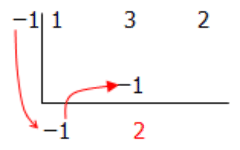

}{(x+1)}=(x+2)$")

In this concept you will work on polynomial division but using the methods of long division and synthetic division.

**Guidance**

Divide the following using both long division and synthetic division.

$$
\frac{x^2-5x+6}{x-2}
$$

**Long Division:**

**Step 1:** Divide the first term in the numerator by the first term in the denominator. Put this in your answer. Therefore $\frac{x^2}{x} = x$.

$$
(x-2) \overset{{\color{red}x}}{\sqrt{x^2-5x+6}}
$$

**Step 2:** Multiply the denominator by this number (variable) and put it below your numerator, subtract and get your new polynomial.

$$
\begin{align*}
&(x-2)\overset{{\color{red}x}}{\sqrt{x^2-5x+6}}\\
&\qquad \quad \underline{\;\;\; x^2-2x \;\;\;\;\;\;}\\
& \qquad \qquad \qquad \ -3x
\end{align*}
$$

**Step 3:** Repeat the process until you cannot repeat it anymore.

$$
\begin{align*}
&(x-2)\overset{{x\color{red}-3}}{\sqrt{x^2-5x+6}}\\
&\qquad \quad \underline{\;\;\;x^2-2x \;\;\; \downarrow \;}\\
& \qquad \qquad \qquad -3x+6\\
&\qquad \quad \underline{\;\;\;\;\;\;\;\;\;\; -3x+6 \;\;}\\
&\qquad \qquad \qquad \qquad \ 0
\end{align*}
$$

Therefore: $\frac{x^2-5x+6}{x-2} = (x - 3)$

**Synthetic Division:**

**Step 1:** Write the coefficients in an upside down division sign.

 and bring it down below the division sign.")

 by the test zero number and place it into the column #2. Add the two numbers together and place this number below the division sign.")

$")

**Example A**

Use long division to divide

$$
\frac{x^2+6x-7}{x-1}
$$

**Long Division:**

**Step 1:** Divide the first term in the numerator by the first term in the denominator, put this in your answer. Therefore $\frac{x^2}{x} = x$.

$$
(x-1) \overset{{\color{red}x}}{\sqrt{x^2+6x-7}}
$$

**Step 2:** Multiply the denominator by this number (variable) and put it below your numerator, subtract and get your new polynomial.

$$
\begin{align*}
&(x-1)\overset{{\color{red}x}}{\sqrt{x^2+6x-7}}\\
&\qquad \quad \underline{\;\;\; x^2-x \;\;\;\;\;\;\;\;}\\
& \qquad \qquad \qquad \ 7x
\end{align*}
$$

**Step 3:** Repeat the process until you cannot repeat it anymore.

$$
\begin{align*}
&(x-1)\overset{{x\color{red}+7}}{\sqrt{x^2+6x-7}}\\
&\qquad \quad \underline{\;\;\; x^2-x \;\;\;\; \downarrow \;}\\
& \qquad \qquad \qquad 7x-7\\
&\qquad \quad \underline{\;\;\;\;\;\;\;\;\;\; 7x-7 \;}\\
&\qquad \qquad \qquad \qquad \ 0
\end{align*}
$$

Therefore: $\frac{x^2+6x-7}{x-1} = (x + 7)$

**Example B**

Use long division to divide

$$
\frac{2x^2+7x+5}{2x+5}
$$

**Step 1:** Divide the first term in the numerator by the first term in the denominator; put this in your answer. Therefore $\frac{2x^2}{2x} = x$.

$$
(2x+5) \overset{{\color{red}x}}{\sqrt{2x^2+7x+5}}
$$

**Step 2:** Multiply the denominator by this number (variable) and put it below your numerator, subtract and get your new polynomial.

$$
\begin{align*}
&(2x+5)\overset{{\color{red}x}}{\sqrt{2x^2+7x+5}}\\
&\qquad \quad \ \underline{\;\;\; 2x^2+5x \;\;\;\;\;\;}\\
& \qquad \qquad \qquad \quad 2x
\end{align*}
$$

**Step 3:** Repeat the process until you cannot repeat it anymore.

$$
\begin{align*}
&(2x+5)\overset{{x\color{red}+1}}{\sqrt{2x^2+7x+5}}\\
&\qquad \quad \ \underline{\;\;\; 2x^2+5x \;\;\; \downarrow \;}\\
& \qquad \qquad \qquad \quad  2x+5\\
&\qquad \quad \underline{\;\;\;\;\;\;\;\;\;\;\;\;\;\; 2x+5 \;\;}\\
&\qquad \qquad \qquad \qquad \quad \ 0
\end{align*}
$$

Therefore: $\frac{2x^2+7x+5}{2x+5}=(x+1)$

**Example C**

Use synthetic division to divide

$$
(x-1) \sqrt{3x^2+x-4}
$$

**Step 1:** Write the coefficients in an upside down division sign.

$")

**Vocabulary**

__Dividend__

The **_dividend_** is the number, variable, or expression you are dividing in a mathematical expression. In the expression $\frac{15}{4x}$, 15 is the dividend.

__Divisor__

The **_divisor_** is the number, variable, or expression you are dividing by in a mathematical expression. In the expression $\frac{15}{4x}$, $4x$ is the divisor.

__Long Division__

**_Long division_** is a mathematical process where the largest number (the dividend) is divided by the smaller number (the divisor) and each step is written out.

__Synthetic Division__

**_Synthetic division_** is a mathematical process of dividing polynomials and considered to be a shorthand method of dividing since it uses only the coefficients of the polynomial and the test zero.

**Guided Practice**

1. Use long division to divide $5x^2+4x-1$ by $x+1$.

2. Use synthetic division to divide $3x^2-2x-1$ by $x-1$.

3. Use synthetic division to divide $3x^3+11x^2+4x-4$ by $x+1$.

**Answers**

1. $5x^2+4x-1$ by $x+1$

**Step 1:** Divide the first term in the numerator by the first term in the denominator, put this in your answer. Therefore $\frac{5x^2}{x} = 5x$.

$$
(x+1) \overset{{\color{red}5x}}{\sqrt{5x^2+4x-1}}
$$

**Step 2:** Multiply the denominator by this number (variable) and put it below your numerator, subtract and get your new polynomial.

$$
\begin{align*}
&(x+1)\overset{{\color{red}5x}}{\sqrt{5x^2+4x-1}}\\
&\qquad \quad \underline{\;\;\; 5x^2+5x \;\;\;\;\;\;}\\
& \qquad \qquad \quad \ \ -x
\end{align*}
$$

**Step 3:** Repeat the process until you cannot repeat it anymore.

$$
\begin{align*}
&(x+1)\overset{{5x\color{red}-1}}{\sqrt{5x^2+4x-1}}\\
&\qquad \qquad \underline{5x^2+5x \;\; \downarrow \;}\\
& \qquad \qquad \quad \ \ -x-1\\
&\qquad \qquad \underline{\;\;\;\;\;\;\; -x-1 \;}\\
&\qquad \qquad \qquad \qquad \ \  0
\end{align*}
$$

Therefore: $\frac{5x^2+4x-1}{x+1}=(5x - 1)$

2. $3x^2-2x+1$ by $x-1$

**Step 1:** Write the coefficients in an upside down division sign.

$")

3. $3x^3+11x^2+4x-4$ by $x+1$.

**Step 1:** Write the coefficients in an upside down division sign.

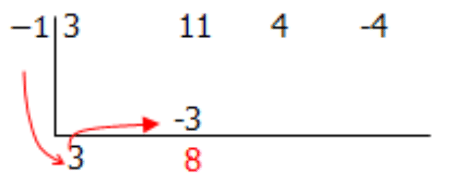

$")

**Summary**

In this chapter you have been learning about dividing polynomials first by a monomial and then by a binomial. In this lesson you learned to use two more methods for dividing polynomials by binomials. The first method is long division. Long division is typically used in mathematics where the divisor is a large number. So if you were dividing 5184 by 216 you would probably use long division to get your answer of 24. Long division requires you to place your divisor outside the division symbol with the dividend inside and each step in the division is written out. It is a long process and hence is long division. Synthetic division is a shorthand method and is the second of the two methods learned in this lesson. Synthetic division is concerned only with the coefficients of the polynomials in the expression and its steps, although many, prove to be quick in solving the polynomial division problem.

**Problem Set**

**Use long division to divide each of the following:**

1.  $(x^2+7x+12)\div(x+3)$
2.  $(x^2+4x+3)\div(x+3)$
3.  $(a^2-4a-45)\div(a-9)$
4.  $(3x^2+5x-2)\div(3x-1)$
5.  $(2x^2-5x+2)\div(2x-1)$

**Use synthetic division to divide each of the following:**

1.  $(b^2-5b+6)\div(b-3)$
2.  $(x^2-6x+6)\div(x-4)$
3.  $(a^2-1)\div(a+1)$
4.  $(c^2-9)\div(c-3)$
5.  $(5r^2+4r-1)\div(r+1)$

The Remainder Theorem
---------------------

**Introduction**

In the previous concept you learned about long division and synthetic division for dividing polynomials by binomials. In this concept you will use these rules to learn about the remainder theorem. The remainder theorem states that if a polynomial, $f(x)$, is divided by a binomial $(x - a)$, the result will be the quotient polynomial, $q(x)$, and a remainder, $R$. The remainder is a constant. Remember, the same rules apply for dividing as in the last concept except now you will not end up with zero in the end.

**Guidance**

Scott hit a golf ball from a tee with a function represented by $p(t)=-5t^2+32t-40$. What is the remainder when the polynomial that represents the height of the golf ball, $p(t)$, is divided by $(t - 5)$?

First let’s write down what we know:

Polynomial that represents the height of the golf ball: $p(t)=-5t^2+32t-40$

Divisor: $t - 5$

**Step 1:** Divide the first term in the numerator by the first term in the denominator. Put this in your answer. Therefore $\frac{-5t^2}{t} = -5t$.

$$
(t-5) \overset{{\color{red}-5t}}{\sqrt{-5t^2+32t-40}}
$$

**Step 2:** Multiply the denominator by this number (variable) and put it below your numerator. Subtract and get your new polynomial.

$$
\begin{align*}
&(t-5)\overset{{\color{red}-5t}}{\sqrt{-5t^2+32t-40}}\\
&\qquad \quad \ \underline{\; -5t^2+25t \;\;\;\;\;\;\;\;\;}\\
& \qquad \qquad \quad \ \ 7t
\end{align*}
$$

**Step 3:** Repeat the process until you cannot repeat it anymore.

$$
\begin{align*}
&(t-5)\overset{{-5t\color{red}+7}}{\sqrt{-5t^2+32t-40}}\\
&\qquad \quad \ \underline{\; -5t^2+25t \;\;\;\; \downarrow \;}\\
& \qquad \qquad \qquad \quad \ 7t-40\\
&\qquad \quad \underline{\;\;\;\;\;\;\;\;\;\;\;\;\;\;\;\; 7t-35 \;}\\
&\qquad \qquad \qquad \qquad \ -5
\end{align*}
$$

Therefore: $\frac{(-5t^2+32t-40)}{(t-5)} = (-5t + 7) + \frac{-5}{t-5}$

So the remainder is $\frac{-5}{t-5}$

**Example A**

Divide the polynomial $x^2-7x+16$ by $(x-3)$.

**Step 1:** Divide the first term in the numerator by the first term in the denominator; put this in your answer. Therefore $\frac{x^2}{x} = x$.

$$
(x-3) \overset{{\color{red}x}}{\sqrt{x^2-7x+16}}
$$

**Step 2:** Multiply the denominator by this number (variable) and put it below your numerator. Subtract and get your new polynomial.

$$
\begin{align*}
&(x-3)\overset{{\color{red}x}}{\sqrt{x^2-7x+16}}\\
&\qquad \quad \ \underline{\; x^2-3x \;\;\; \;\;\;\;\;\;}\\
& \qquad \qquad \ \ -4x
\end{align*}
$$

**Step 3:** Repeat the process until you cannot repeat it anymore.

$$
\begin{align*}
&(x-3)\overset{{x\color{red}-4}}{\sqrt{x^2-7x+16}}\\
&\qquad \quad \underline{\;\;\; x^2-3x \;\;\;\; \downarrow \;\;}\\
& \qquad \qquad \ \ -4x+16\\
&\qquad \quad \underline{\;\;\;\;\;\;\; -4x+12 \;\;}\\
&\qquad \qquad \qquad \qquad \ \ 4
\end{align*}
$$

Therefore: $\frac{(x^2-7x+16)}{(x-3)}=(x-10)+\frac{4}{x-3}$

**Example B**

Solve: $\frac{2a^2+3a-8}{a-2}$

**Step 1:** Divide the first term in the numerator by the first term in the denominator; put this in your answer. Therefore $\frac{2a^2}{a}=2a$

$$
(a-2) \overset{{\color{red}2a}}{\sqrt{2a^2+3a-8}}
$$

**Step 2:** Multiply the denominator by this number (variable) and put it below your numerator. Subtract and get your new polynomial.

$$
\begin{align*}
&(a-2)\overset{{\color{red}2a}}{\sqrt{2a^2+3a-8}}\\
&\qquad \quad \ \ \underline{2a^2-4a \;\;\; \;\;\;\;}\\
& \qquad \qquad \quad \ 7a
\end{align*}
$$

**Step 3:** Repeat the process until you cannot repeat it anymore.

$$
\begin{align*}
&(a-2)\overset{2a{\color{red}+7}}{\sqrt{2a^2+3a-8}}\\
&\qquad \quad \underline{\;\;\; 2a^2-4a \;\; \downarrow \;\;}\\
& \qquad \qquad \quad \ \ 7a-8\\
&\qquad \quad \underline{\;\;\;\;\;\;\;\;\;\; 7a-14 \;\;\;}\\
&\qquad \qquad \qquad \quad \ 6
\end{align*}
$$

Therefore: $\frac{2a^2+3a-8}{a-2}=(2a+7)+\frac{6}{a-2}$

**Example C**

Divide $\frac{b^3+3b^2-3b-2}{b-1}$

**Step 1:** Divide the first term in the numerator by the first term in the denominator; put this in your answer. Therefore $\frac{b^3}{b} = b^2$.

$$
(b-1) \overset{{\color{red}b^2}}{\sqrt{b^3+3b^2-3b-2}}
$$

**Step 2:** Multiply the denominator by this number (variable) and put it below your numerator. Subtract and get your new polynomial.

$$
\begin{align*}
&(b-1)\overset{{\color{red}b^2}}{\sqrt{b^3+3b^2-3b-2}}\\
&\qquad \quad \ \ \underline{b^3-b^2 \;\;\; \;\;\;\;\;\;\;\;\;\;\;\;}\\
& \qquad \qquad \quad \ \ 4b^2
\end{align*}
$$

**Step 3:** Repeat the process until you cannot repeat it anymore.

$$
\begin{align*}
&(b-1)\overset{{\color{red}b^2+4b}}{\sqrt{b^3+3b^2-3b-2}}\\
&\qquad \quad \underline{\;\;\; b^3-b^2 \;\;\;\; \downarrow \;\;\;\;\;\;\;\;}\\
& \qquad \qquad \quad \ \ 4b^2-3b\\
&\qquad \quad \underline{\;\;\;\;\;\;\;\;\;  4b^2-4b \;\;\;\;\;\;\;}\\
&\qquad \qquad \qquad \qquad \ \ b
\end{align*}
$$

**Step 4:** Repeat...

$$
\begin{align*}
&(b-1)\overset{{\color{red}b^2+4b+1}}{\sqrt{b^3+3b^2-3b-2}}\\
&\qquad \quad \underline{\;\;\; b^3-b^2 \;\;\;\;\;\;\;\;\;\;\;\;\downarrow }\\
& \qquad \qquad \quad \ \ 4b^2-3b\\
&\qquad \quad \underline{\;\;\;\;\;\;\;\;\;  4b^2-4b \;\;\;\;\;\;\;}\\
&\qquad \qquad \qquad \qquad \ b-2\\
&\qquad \quad \underline{\;\;\;\;\;\;\;\;\;\;\;\;\;\;\;\;\;\;\;  b-1 \;\;}\\
&\qquad \qquad \qquad \qquad \qquad \ -1
\end{align*}
$$

Therefore $\frac{b^3+3b^2-3b-2}{b-1}=(b^2+4b+1)+\frac{-1}{b-1}$

**Vocabulary**

__Quotient__

The **_quotient_** is the result of dividing one quantity by another.

__Remainder Theorem__

The **_remainder theorem_** states that if a polynomial, $f(x)$, is divided by a binomial $(x - a)$, the result will be the quotient $q(x)$ and a remainder $R$. The remainder is a constant.

**Guided Practice**

1. Find the remainder: $\frac{x^2+6x-6}{x-2}$

2. Divide: $\frac{4b^2-12b+9}{2b-3}$

3. A football is thrown in the air. The height of the football is represented by the polynomial $p(t)=-8t^2+3t+12$. Find the remainder when the polynomial is divided by $(t - 2)$.

**Answers**

1. Find the remainder: $\frac{x^2+6x-6}{x-2}$

**Step 1:** Divide the first term in the numerator by the first term in the denominator; put this in your answer. Therefore $\frac{x^2}{x} = x$.

$$
(x-2) \overset{{\color{red}x}}{\sqrt{x^2+6x-6}}
$$

**Step 2:** Multiply the denominator by this number (variable) and put it below your numerator. Subtract and get your new polynomial.

$$
\begin{align*}
&(x-2) \overset{{\color{red}x}}{\sqrt{x^2+6x-6}}\\
&\qquad \ \ \ \underline{\;\;\; x^2-2x \;\;\; \;\;\;\;\;\;\;\;}\\
& \qquad \qquad \qquad 8x
\end{align*}
$$

**Step 3:** Repeat the process until you cannot repeat it anymore.

$$
\begin{align*}
&(x-2)\overset{x{\color{red}+8}}{\sqrt{x^2+6x-6\ \ }}\\
&\qquad \quad \underline{\;\;\; x^2-2x \;\;\; \downarrow \;\;\;\;}\\
& \qquad \qquad \qquad \ 8x-6\\
&\qquad \quad \underline{\;\;\;\;\;\;\;\;\;\;\; 8x-16 \;\;}\\
&\qquad \qquad \qquad \qquad \ \ 10
\end{align*}
$$

Therefore: $\frac{x^2+6x-6}{x-2}=(x+8)+\frac{10}{x-2}$

And the remainder is $\frac{10}{x-2}$.

2. Divide: $\frac{4b^2-12b+9}{2b-3}$

**Step 1:** Divide the first term:

$$
(2b-3) \overset{{\color{red}2b}}{\sqrt{4b^2-12b+9}}
$$

**Step 2:** Multiply through this first part of the quotient by the divisor:

$$
\begin{align*}
&(2b-3) \overset{{\color{red}2b}}{\sqrt{4b^2-12b+9}}\\
&\qquad \quad \ \underline{\;\;\; 4b^2-6b \;\;\; \;\;\;\;\;\;}\\
& \qquad \qquad \quad \ \ -6b
\end{align*}
$$

**Step 3:** Repeat...

$$
\begin{align*}
&(2b-3)\overset{2b{\color{red}-3}}{\sqrt{4b^2-12b+9 \ \ }}\\
&\qquad \quad \ \underline{\;\;\;4b^2-6b \;\;\;\; \downarrow \;\;\;\;}\\
& \qquad \qquad \quad \ \ \ -6b+9\\
&\qquad \quad \ \underline{\;\;\;\;\;\;\;\;\;\;\;-6b+9 \;\;}\\
&\qquad \qquad \qquad \qquad 0
\end{align*}
$$

Therefore there is no remainder and: $\frac{4b^2-12b+9}{2b-3}=(2b-3)$

3. First list what you know:

Polynomial that represents the height of the football: $p(t)=-8t^2+3t+12$

Divisor: $t - 2$

**Step 1:** Divide the first term in the numerator by the first term in the denominator; put this in your answer. Therefore $\frac{-8t^2}{t} = -8t$.

$$
(t-2) \overset{{\color{red}-8t}}{\sqrt{-8t^2+3t+12}}
$$

**Step 2:** Multiply the denominator by this number (variable) and put it below your numerator. Subtract and get your new polynomial.

$$
\begin{align*}
&(t-2) \overset{{\color{red}-8t}}{\sqrt{-8t^2+3t+12}}\\
&\qquad \ \ \underline{\;\;\; -8t^2+16t \;\;\;\;\;\;\;}\\
& \qquad \qquad \quad \ \ -13t
\end{align*}
$$

**Step 3:** Repeat the process until you cannot repeat it anymore.

$$
\begin{align*}
&(t-2)\overset{-8t{\color{red}-13}}{\sqrt{-8t^2+3t+12\quad }}\\
&\qquad \ \ \underline{\;\;\; -8t^2+16t \;\;\; \downarrow \;\;\;\;\;}\\
& \qquad \qquad \quad \ \ -13t+12\\
&\qquad \ \ \underline{\;\;\;\;\;\;\;\;\;\;\;\;\;  -13t+26 \;\;}\\
&\qquad \qquad \qquad \qquad \ -14
\end{align*}
$$

Therefore: $\frac{(-8t^2+3t+12)}{(t-2)}=(-8t-13)+\frac{-14}{t-2}$

So the remainder is $\frac{-14}{t-2}$.

**Summary**

As you learned in this concept, not all polynomials can be divided by binomials evenly. In other words, sometimes you are left with a remainder. When using long division or synthetic division, the remainder theorem is used to find the remainder of the division between a polynomial, $f(x)$, and the divisor. The rules for dividing using the remainder theorem are the same as those used in the previous lesson. The only difference for you in this lesson is that you have a remainder, $R$, along with your quotient polynomial, $q(x)$. In other words $f(x) = (x - a) \times q(x) + R$, where $R$ is a constant and $(x - a)$ is a factor of the polynomial.

It should be noted as well the way the remainder is written. If you noticed in the examples and guided practice problems, the remainder is represented as $\frac{R}{(x-a)}$.

**Problem Set**

**Find the remainders for each of the following:**

1.  $\frac{(x^2-2x-24)}{(x-1)}$
2.  $\frac{(x^2+2x-15)}{(x+5)}$
3.  $\frac{t^2-7t-6}{t+2}$
4.  $\frac{(x^2-6x-4)}{(x-2)}$
5.  $\frac{c^3+4c^2-5c+5}{c-3}$

**Divide the following:**

1.  $\frac{\left(\frac{2}{3}a^2-3a+2\right)}{(a+1)}$
2.  $\frac{(5x^2-6x+20)}{(x+2)}$
3.  $\frac{4t^2+6t+1}{2t-1}$
4.  $\frac{(2c^2+3c-9)}{(2c-3)}$
5.  $\frac{5d^3+8d^2-15d+25}{d-5}$

The Factor Theorem
------------------

**Introduction**

In this last concept of lesson **Division of Polynomials** you will learn another important theorem in your study of polynomials. In the previous lesson you learned about the remainder theorem. The remainder theorem has, as an important use, to produce the factor theorem. The point of the factor theorem, however, is the reverse of the remainder theorem. According to the factor theorem, if you divide a polynomial by a binomial $(x - a)$ and the remainder is zero, then the divisor $x-a$ represents a factor of the polynomial.

Remember in the last concept, where you learned the remainder theorem, that if a polynomial, $f(x)$, is divided by a binomial $(x - a)$, then the result will be the quotient $q(x)$ and a remainder $R$. In other words $(x)=(x-a) \times q(x)+R$. Well, if $R = 0$, then $(x - a)$ factors fully into the polynomial $f(x)$, and you have the factor theorem!

So the factor theorem states that if $f(x)=(x-a) \times q(x)+R$ and $R = 0$, then $(x - a)$ is a factor of $f(x)$ and you can write $f(x)=(x-a)\times q(x)$. Let’s explore how the factor theorem works in this last concept of lesson **Division of Polynomials**. Remember to use the same rules for division as you have used in the previous two concepts.

**Guidance**

A rectangular shaped container is built in such a way that its volume can be represented by the polynomial $V(w)=w^3+7w^2+16w+12$, where $w$ is the width of the container.

a) Factor the polynomial.

b) If $w = 2 \ ft$, what are the dimensions of the container?

a) In order to begin to find the factors, you look at the number 12 and find the factors of this number. The factors of 12 are:

$1 \times 12$ or $-1 \times -12$

$2 \times 6$ or $-2 \times -6$

$3 \times 4$ or $-3 \times -4$

Therefore the factors of 12 are $\pm 1, \pm 2, \pm 3, \pm 4, \pm 6$, and $\pm 12$.

Next you can start testing the factors to see if you get a remainder of zero.

$$
\begin{align*}
V(w)&=w^3+7w^2+16w+12\\
w=-1: V(-1)&=(-1)^3+7(-1)^2+16(-1)+12\\
V(-1) &= 2 \quad (NOT \ A \ FACTOR)\\
\\
w=-2: V(-2)&=(-2)^3+7(-2)^2+16(-2)+12\\
V(-2) &= 0 \quad (Therefore \ w+2 \ is \ a \ factor)
\end{align*}
$$

Now that you have one of the factors, use division to find the others.

**Step 1:**

$$
\begin{align*}
V(w)&=w^3+7w^2+16w+12\\
V(w)&=(w+2)(w^2+5w+6)
\end{align*}
$$

=(w+2)(w+2)(w+3)$")

b) If $w = 2$, what are the dimensions of the container?

$$
\begin{align*}
(w + 2) &= 2 + 2 = 4 \\
(w + 2) &= 2 + 2 = 4 \\
(w + 3) &= 2 + 3 = 5
\end{align*}
$$

Therefore the dimensions of the container are $4 \ ft \times 4 \ ft \times 5 \ ft$.

**Examples**

**Example A**

Use the factor theorem to determine if $x + 1$ is a factor of $p(x) =2x^3+3x^2-5x-6 \ p(x)=2x^3+3x^2-5x-6$. If so, find the other factors.

$$
\begin{align*}
p(x)&= 2x^3+3x^2-5x-6 \\
x = -1: p(-1) & = 2(-1)^3+3(-1)^2-5(-1)-6 \\
p(-1)&= -2+3+5-6 \\
p(-1)&= 0 \quad (Therefore \ A \ FACTOR)
\end{align*}
$$

Now that you have one of the factors, use division to find the others.

**Step 1:**

$$
\begin{align*}
p(x)&=2x^3+3x^2-5x-6 \\
p(x) &=(x+1)(2x^2+x-6)
\end{align*}
$$

=(x+1)(2x-3)(x+2)$")

**Example B**

Use the factor theorem to determine if $x + 3$ is a factor of $s(x)=5x^2-13x-84$. If so, find the other factors.

$$
\begin{align*}
s(x) &= 5x^2-13x-84 \\ \\
x = -3: s(-3)& =5(-3)^2-13(-3)-84 \\
s(-3)&= 45+39-84 \\
s(-3)&= 0 \quad (Therefore \ A \ FACTOR)
\end{align*}
$$

Now that you have one of the factors, use division to find the other factor.

**Step 1**: Divide the first term in the numerator by the first term in the denominator; put this in your answer. Therefore $\frac{5x^2}{x}=5x$.

$$
(x+3) \overset{{\color{red}5x}}{\sqrt{5x^2-13x-84}}
$$

**Step 2**: Multiply the denominator by this number (variable) and put it below your numerator. Subtract and get your new polynomial.

$$
\begin{align*}
&(x+3) \overset{{\color{red}5x}}{\sqrt{5x^2-13x-84}}\\
&\qquad \quad \underline{\;\;\; 5x^2+15x \;\;\;\;\;\;\;}\\
& \qquad \qquad \quad \ -28x
\end{align*}
$$

Step 3: Repeat the process until you cannot repeat it anymore.

$$
\begin{align*}
&(x+3)\overset{5x{\color{red}-28}}{\sqrt{5x^2-13x-84}}\\
&\qquad \quad \underline{\;\;\; 5x^2+13x \;\;\;\;\downarrow \;\;\;\;}\\
& \qquad \qquad \qquad \ -28x-84\\
&\qquad \quad \underline{\;\;\;\;\;\;\;\;\;\;\;\;\;  -28x-84 \;}\\
& \qquad \qquad \qquad \qquad \quad \ 0 \\
\end{align*}
$$

Therefore: $\frac{(5x^2-13x-84)}{(x+3)}=(5x-28)$

So: 

$$
\begin{align*}
s(x)&=5x^3-13x-84\\
s(x)&=(x+3)(5x-28)
\end{align*}
$$

**Example C**

Factor: $f(t)=t^3-8t^2+17t-10$.

In order to begin to find the factors, you look at the number –10 and find the factors of this number. The factors of –10 are:

$1 \times -10$ or $-1 \times 10$

$2 \times -5$ or $-2 \times 5$

Therefore the factors of –10 are $\pm 1, \pm 2, \pm 5,$ and $\pm 10$.

Next you can start testing the factors to see if you get a remainder of zero.

$$
\begin{align*}
f(t)&=t^3-8t^2+17t-10\\
t=-1:f(-1)&=(-1)^3-8(-1)^2+17(-1)-10\\
f(-1)&=-36 \quad (NOT \ A \ FACTOR)\\
\\
t=1:f(1)&=(1)^3-8(1)^2+17(1)-10\\
f(1)&=0 \quad (Therefore \ t-1 \ is \ a \ factor)
\end{align*}
$$

Now that you have one of the factors, use division to find the others.

**Step 1:**

$$
\begin{align*}
f(t)&=t^3-8t^2+17t-10\\
f(t)&=(t-1)(t^2-7t+10)
\end{align*}
$$

=(t-1)(t-5)(t-2)$")

**Vocabulary**

__The Factor theorem__

The **_factor theorem_** states that if $f(x)=(x-a) \times q(x)+R$ and $R=0$, then $(x - a)$ is a factor of $f(x)$ and you can write $f(x)=(x-a) \times q(x)$.

**Guided Practice**

1. Determine if $e + 3$ is a factor of $2e^3-e^2+e-1$.

2. Factor: $x^3+4x^2+x-6$.

3. A tennis court is being built where the volume is represented by the polynomial $p(L)=3L^3+8L^2+3L-2$ and where $L$ represents the length of the court. Determine if $L + 1$ is a factor and if so, find the other factors. If $L = 5ft$, what are the dimensions of the court.

**Answers**

1. $2e^3-e^2+e-1$

$e=-3:2(-3)^3-(-3)^2+(-3)-1=-67$

Therefore $(e+3)$ is not a factor of $2e^3-e^2+e-1$

2. $x^3+4x^2+x-6$

In order to begin to find the factors, you look at the number –6 and find the factors of this number. The factors of –6 are:

$1 \times -6$ or $-1 \times 6$

$2 \times -3$ or $-2 \times 3$

Therefore the factors of –6 are $\pm 1, \pm 2, \pm 3,$ and $\pm 6$.

Next you can start testing the factors to see if you get a remainder of zero.

$$
\begin{align*}
& x^2+4x+x-6\\
& x=-1:(-1)^3+4(-1)^2+(-1)-6=-4 \quad (NOT \ A \ FACTOR)\\
& x=1:(1)^3+4(1)^2+(1)-6=0 \quad (Therefore \ x-1 \ is \ a \ factor)
\end{align*}
$$

Now that you have one of the factors, use division to find the others.

**Step 1:**

")

\[Figure 54\]

Therefore: $x^3+4x^2+x-6=(x-1)(x+2)(x+3)$

3. $p(L)=3L^3+8L^2+3L-2$

Start by testing the factor $L + 1$ to see if you get a remainder of zero.

$$
\begin{align*}
p(L)&=3L^3+8L^2+3L-2L=-1:\\
p(L)&=3(-1)^3+8(-1)^2+3(-1)-2\\
p(1)&=0 \quad (Therefore \ L+1 \ is \ a \ factor)
\end{align*}
$$

Now that you have one of the factors, use division to find the others.

**Step 1:**

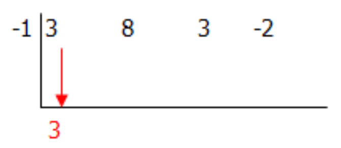

$$
\begin{align*}
p(L)&=3L^3+8L^2+3L-2\\
p(L)&=(L+1)(3L^2+5L-2)
\end{align*}
$$

=(L+1)(3L-1)(L+2)$")

If $L = 5 \ ft$, what are the dimensions of the container?

$$
\begin{align*}
(L+1)&=5+1=6\\
(3L-1)&=3(5)-1=14\\
(L+2)&=5+2=7
\end{align*}
$$

Therefore the dimensions of the container are $6 \ ft \times 14 \ ft \times 7 \ ft$.

**Summary**

In this last concept of lesson **Division of Polynomials**, you worked with the factor theorem. The factor theorem states that for a polynomial $f(x)$ with factor $(x - a)$, it can be concluded that $f(x) = (x - a) \times q(x)$, where $q(x)$ is the quotient polynomial. Remember that the factor theorem is the opposite of the remainder theorem in that it seeks to find the factors of the polynomial and therefore there is no remainder. The rules for dividing to find the factors remain the same as those you have learned in the previous few lessons for long division and synthetic division.

**Problem Set**

**Determine if $a - 4$ is a factor of each of the following.**

1.  $a^3-5a^2+3a+4$
2.  $3a^2-7a-20$
3.  $-a^4+3a^3+5a^2-16$
4.  $a^4-2a^3-8a^2+3a-4$
5.  $2a^4-5a^3-7a^2-21a+4$

**Factor each of the following:**

1.  $x^3+2x^2+2x+1$
2.  $x^3+x^2-x-1$
3.  $2x^3-5x^2+2x+1$
4.  $2b^3+4b^2-3b-6$
5.  $3c^3-4c^2-c+2$

Summary
-------

In this lesson, you have worked with dividing polynomials. You learned to divide polynomials first by monomials. Remember here that you had to divide each of the parts of the polynomial numerator by the monomial denominator. It is important to remember for these and all the remaining concepts of this lesson that when you divide exponents, you actually subtract the exponent numbers. In other words $\frac{x^5}{x^3}=x^5 \div x^3=x^{5-3}=x^2$. In the second concept, you built on this knowledge by dividing polynomials by binomials. In this concept you had to factor the polynomial numerator and then find if there was a common binomial in both the numerator and the denominator. Then you could divide.

When a polynomial is not easily divided, you can use long division and synthetic division. This was your third lesson. Long division uses the same concepts for polynomial division as it does for simple numerical long division. First you need to divide the first term in the numerator by the first term in the denominator. You then multiply the denominator by this variable (number) and put it below the numerator under the division symbol. You subtract and then keep repeating this process until done. Synthetic division is similar but considered a shorthand method of division due to the fact that you are only using the polynomial's coefficients.

The last two sections of this lesson introduced you to the remainder theorem and the factor theorem. For divisions completed in concept 3, the remainders were always zero. This is not always the case, obviously. All polynomial division problems will not work to give you a zero in the end. Sometimes you get a remainder. This is exactly what the remainder theorem tells you. If a polynomial $p(x)$ is divided by a factor $(x - a)$, then $p(x)=(x-a) \times q(x)+R$ where $q(x)$ is the quotient polynomial and $R$ is the remainder. When there is no remainder then $p(x)=(x-a) \times q(x)$ and you can say that $(x - a)$ is a factor of polynomial $p(x)$. This last statement is the factor theorem. The factor theorem and the remainder theorem are considered opposites but both use the same rules for long division and synthetic division in problem solving.

</article>

### 7.9 Graphing Polynomial Functions

<article>

**Introduction**

In this lesson you will learn to graph functions that are both cubic and quartic. You will learn that the roots are the zeros of the function (where the graph crosses the $x$\-axis). The graphs of these functions can be done using technology.

**Objectives**

The lesson objectives for Graphing Polynomial Functions are:

* Graphing a Cubic Function
* Graphing a Quartic Function

Graphing a Cubic Function
-------------------------

**Introduction**

In this first concept of the last lesson in chapter seven, you are going to do a little graphing. You have done a lot of work with polynomials and you have learned to recognize the different degrees of polynomials as well as divide polynomials by monomials and binomials using a variety of strategies. In this concept you will graph cubic polynomials. Remember that cubic polynomials are polynomials where the largest degree is 3. So, for example, $2x^3+13x^2-8x+5$ is a cubic polynomial.

When you graph cubic polynomials, some interesting things happen. When solving quadratics, there were some cases when there was no factor for the quadratic. One example is $x^2+3x+5$. Unlike quadratics, cubic have at least one factor. In graphing you can see this clearly because it will cross the $x$\-axis at least once. These factors are called roots or zeros of the polynomial. The root or the zero is the point where the graph crosses the $x$\-axis so the root is $(x, 0)$. In the graph below you can see one of the roots (zeros) at the point (–3, 0).

| **$x$** | **$x^3$** |
| --- | --- |
| –2  | –8  |
| –4  | –64 |
| –6  | –216 |
| –8  | –512 |
| –10 | –1000 |

In the table, you can see that as $x$ gets more negative (number gets larger with a negative sign), the value of $x^3$ also gets large and negative. So the graph starts down low and rises up. The reverse is true when the number in front of $x^3$ is negative. Also, in the graph shown above there are three times when the curve crosses the $x$\-axis, representing three roots. A cubic $(x^3)$ can have as many as three roots and as few as one.

Let's begin graphing cubic polynomials.

**Guidance**

Graph the function $f(x)=x^3-6x^2+11x-6$ and indicate the roots.

**Example A**

Graph the function $x^3+x^2+x-3$ to determine the number of roots.

 at (1, 0).")

**Example B**

Since (1, 0) is a zero for the polynomial $x^3-5x^2+8x-4$, one possible root for the polynomial is $x = 1$, therefore $(x - 1)$ would be a factor of this cubic.

**Example C**

How many roots (zeros) are there for the polynomial $-x^3-5x^2-2x+24$?

__Cubic Polynomial__

A **_cubic polynomial_** is a polynomial where the largest degree is 3. So, for example, $2x^3+13x^2-8x+5$ is a cubic polynomial.

__Root (Zero)__

The **_root_** or the **_zero_** is the point where the graph crosses the $x$\-axis so the root is $(x, 0)$.

__Turning Point__

The point where the graph changes from increasing to decreasing or vice versa is called the **_turning point_**. If the turning point changes from increasing to decreasing it is called a _maximum point_. If the turning point changes from decreasing to increasing it is called a _minimum point_.

**Guided Practice**

1. Find the roots for the cubic $y=x^3+3x-4$ using a graph.

2. Graph the function $g(x)=3x^3+8x^2+3x-2$ and determine the number of roots. Is $(x - 2)$ one of the factors of this polynomial?

3. Graph the function $-2x^3+10x^2+8x-1$ to determine if $x - 1$ is a factor of the polynomial.

**Answers**

1. ")

\[Figure 7\]

Since one of these root values is (–2, 0), the factor for the polynomial would be $(x + 2)$ and not $(x - 2)$.

3. $ was one of the factors then one of the roots would have to be (1, 0). This is not the case.")

**Summary**

You learned to divide polynomials and find factors in the previous lesson. In this concept you learned to graph them and find the factors by finding the roots. Remember the roots are where the graphs cross the $x$\-axis. Graphing a cubic is done the same way you graph a quadratic. It just requires more algebra if you are doing it manually using a table of values. In this lesson, graphing technology was used to graph the cubic polynomial. Your graphing calculator can also be used.

**Problem Set**

**Find the roots for the following cubic polynomials using a graph.**

1.  $x^3-2x^2-9x+18$
2.  $a^3+5a^2-4a-20$
3.  $3n^3-6n^2+8n-5$
4.  $2p^3-8p^2+3p-12$
5.  $-2y^3-3y^2-5y+10$

**Graph the functions below and determine the number of roots. Give at least one factor of each polynomial from the graphed solution.**

1.  $x^3-3x^2-2x+6$
2.  $x^3+x^2-3x-3$
3.  $x^3+2x^2-16x-32$
4.  $2x^3+13x^2+9x+6$
5.  $2x^3+15x^2+4x-21$

**Graph the functions below to determine if $x - 1$ is a factor of the polynomial.**

1.  $x^3-2x^2+3x-6$
2.  $x^3+3x^2-2x-2$
3.  $3w^3+8w^2-5w-6$
4.  $t^3+t^2-10t+8$
5.  $2s^3-s^2-3s+2$

Graphing a Quadratic Function
-----------------------------

**Introduction**

In the previous concept you graphed cubic polynomials or polynomials where the highest degree was equal to 3. In this last concept of chapter **Many Terms Means Much Work**, you will use the same graphing technology or manual graphing techniques to graph quartic polynomials. Quartic polynomials have a degree of 4. So for example $x^4+3x^3-x^2-3x-6$ is a quartic because it has a degree of $4(x^4)$.

Quartic polynomials are continuous curves like the cubic polynomials. This means that you can draw the graph of the quartic without lifting your pencil from the page. There are no holes or jumps in the curve but, unlike the cubic graph, a graph of the quartic looks like a W or an M. If the coefficient in front of the $x^4$ is positive, your graph will look like a W. If the coefficient in front of the is $x^4$ negative, your graph will look like an M. Lastly, the graph of the quartic will have either one or three turning points.

Look at the graph below for the quartic $x^4+3x^3-x^2-3x-6$. Notice that it has three turning points and since the coefficient in front of the $x^4$ is +1 (positive) it does look like a W.

Graph the following polynomial to determine the roots. Describe the shape.

$$
2x^4-4x^3-3x^2+12x-8
$$

**Examples**

**Example A**

Find one zero or root for the following quartic. How many turning points are there in the graph?

$$
x^4-3x^3+2x^2-x+1
$$

. There are three turning points for this quadratic as it looks like a W.")

**Example B**

Find the zero(s) or root(s) for the following quartic. How many turning points are there in the graph?

$$
x^4-2x^3-13x^2-14x+24
$$

.")

**Example C**

Find the zero(s) or root(s) for the following quartic. How many turning points are there in the graph?

$$
x^4-x^3-7x^2+x+6
$$

 are located at (–2, 0), (–1, 0), (1, 0), and (3, 0). From here you could get the factors of the quartic.")

(–2, 0): therefore $x + 2$ is a factor.

(–1, 0): therefore $x + 1$ is a factor.

(1, 0): therefore $x - 1$ is a factor.

(3, 0): therefore $x - 3$ is a factor.

So: $x^4-x^3-7x^2+x+6=(x+2)(x+1)(x-1)(x-3)$

**Vocabulary**

__Quartic Polynomials__

**_Quartic polynomials_** have a degree of 4. So for example $x^4-2x^3-13x^2-14x+24$ is a quartic because it has a degree of $4(x^4)$.

**Guided Practice**

1. Indicate the zero(s) or root(s) on the graph of the following quartic: $x^4-3$.

2. Describe the graph of the following quartic: $x^4-3x^2-2x-2$.

3. Describe the graph of the following quartic: $-x^4-3x^3+2x^2+x-6$.

**Answers**

1. . The zeros are located at approximately (2.1, 0) and (–1.6, 0)")

")

\[Figure 16\]

The graph looks like an M and has three turning points. It looks like an M because of the –1 coefficient before $x^4$. There are two roots (zeros). The zeros are located at approximately (–3.35, 0) and (–1.32, 0).

**Summary**

This concept involved graphing quartic functions. The quartic is similar to the cubic in that it is a continuous curve but has one or three turning points. The quartic will also have up to four roots or zeros. Remember the roots are where the graphs cross the $x$\-axis. Graphing a quartic is done the same way you graph a quadratic; it just requires more algebra if you are doing it manually using a table of values. In this lesson, graphing technology was used to graph the quartic polynomial, but your graphing calculator can also be used.

**Problem Set**

**Indicate the zero(s) or root(s) on the following quartic graphs:**

1.  $x^4-3x^3-6x^2-3$
2.  $x^4-8x^2-8$
3.  $2x^4+2x^3+x^2-x-8$
4.  $x^4-6x^2-x+3$
5.  $x^4+x^3-7x^2-x+6$

**Describe the following graphs:**

1.  $x^4-5x^2+2x+2$
2.  $x^4+3x^3-x-3$
3.  $-x^4+x^3+4x^2-x+6$
4.  $-x^4-5x^3-5x^2+5x+6$
5.  $-2x^4-4x^3-5x^2-4x-4$

Summary
-------

In this lesson, you drew cubic and quartic graphs. Cubic polynomials have a degree of 3 whereas quartic polynomials have a degree of 4. Both types of graphs are continuous graphs meaning that they have no jumps or holes and you can draw them with your pencil without lifting your pencil off the page. Cubic and quartic graphs always cross the $x$\-axis at least once and therefore will have at least one factor. Both of these graphs have turning points. Turning points are points where the graph changes from increasing to decreasing. Cubic graphs will have zero or two turning points. Quartic graphs will have one or three turning points. The graphs below show a cubic (top) and a quartic (bottom) polynomial.

")

\[Figure 18\]

</article>

### 7.10 Test II

<article>

1.  The solution(s) to the trinomial $x^2-6x+9=0$ are?
    1.  $x=9$ and $x=1$
    2.  $x=-9$ and $x=-1$
    3.  $x=3$
    4.  $x=-3$ and $x=3$
2.  The solution(s) to the trinomial $3x^2-5x-2=0$ are?
    1.  $x=2$ and $x= -\frac{1}{3}$
    2.  $x=-2$ and $x= \frac{1}{3}$
    3.  $x=-2$ and $x= -1$
    4.  $x=2$ and $x= -1$
3.  When $\frac{1}{4} x^2 -\frac{4}{9} y^2$ is factored, the result is?
    1.  $\left(\frac{1}{4}x - \frac{2}{3} y \right) \left(\frac{1}{4}x - \frac{2}{3} y \right)$
    2.  $\left(\frac{1}{2}x - \frac{2}{3} y \right) \left(\frac{1}{2}x - \frac{2}{3} y \right)$
    3.  $\left(\frac{1}{2}x + \frac{2}{3} y \right) \left(\frac{1}{2}x + \frac{2}{3} y \right)$
    4.  $\left(\frac{1}{2}x + \frac{2}{3} y \right) \left(\frac{1}{2}x - \frac{2}{3} y \right)$
4.  What is the positive solution to the trinomial $e^2+6e+9=49$?
    1.  $e=4$
    2.  $e=3$
    3.  $e=-4$
    4.  $e=10$
5.  What is the solution to $-3a^2+5a+12=0$?
    1.  $\left(-\frac{3}{4}, 3 \right)$
    2.  $\left(-\frac{4}{3}, 3 \right)$
    3.  $\left(\frac{3}{4}, 3 \right)$
    4.  $\left(\frac{4}{3}, 3 \right)$
6.  What is the solution to $\frac{x^2+2x-63}{x+9}$?
    1.  $(x-7)$
    2.  $(x+7)$
    3.  $(x^2-7)$
    4.  $(x^3+3x-5)$
7.  In the triangle below, what is the measure of the perimeter? 
    
    \[Figure 1\]
    
8.  Simplify completely: $\frac{x^3+12x^2+20x-96}{(x-2)}$
9.  Divide $2x^3-5x^2-4x-25$ by $(x - 4)$.
10. What are the factors for the cubic shown in the graph below: 
    
    \[Figure 2\]

</article>

## 8.0 Rational Can Be Over the Top

<article>

**Introduction**

In this chapter you will learn about rational expressions. You will learn how to simplify a rational expression and how to recognize all restrictions on the denominator. In addition, you will learn to perform the basic operations of addition and subtraction of rational expressions as well as how to determine the least common multiple for the given expressions. The operations of multiplication will also be included in this chapter. The chapter will conclude with the graphing of rational expressions.

**Lessons**

In this chapter you will do the following lessons:

* Simplifying a rational expression
* Stating the restrictions on the denominator
* A review of adding and subtracting fractions
* The least common multiple for a rational expression
* Addition and subtraction of rational expressions
* A review of multiplication and division of fractions
* Multiplication and division of rational expressions
* Understanding a rational function
* Graphing rational functions

</article>

### 8.1 Introduction to Rational Expressions

<article>

**Objectives**

The lesson objectives for Simplifying Rational Expressions are:

* A review of factoring
* Understanding what is meant by a rational expression
* Simplifying a rational expression
* Restrictions on the values of the variables of a rational expression's denominator

Simplifying Rational Expressions
--------------------------------

**Introduction**

In previous lessons, you have learned to factor algebraic expressions. These skills are essential for completing this lesson successfully. Many of the problems that will be presented in this lesson will involve applying the various types of factoring to simplify the given expression.

There are four main types of factoring with which you should be familiar:

1.  Removing the greatest common factor (GCF)
2.  Difference of squares $(x^2-y^2)$
3.  Trinomials of the form $x^2+bx+c$
4.  Trinomials of the form $ax^2+bx+c \ (a \ne 1)$

The four types of factoring will now be briefly reviewed to improve your success with rational expressions.

1. Removing the greatest common factor (GCF)

The greatest common factor that is removed is a common monomial factor. This common factor may be just a number or it may contain a variable(s). By removing the greatest common factor, no other factors, other than 1 or –1, can be removed from the polynomial.

**Examples**

Factor each of the following polynomials:

a) $5y-20$

b) $3a^2b^5+5a^3b^4-7a^6b^3$

c) $12x^4-16x^3+8x^2$

Solution

a) 

$$
\begin{align*}
& 5y-20 \\
& GCF=5 \\
&= 5(y-4)
\end{align*}
$$

b) 

$$
\begin{align*}
& 3a^2b^5+5a^3b^4-7a^6b^3 \\
& GCF=a^2b^3 \\
&= a^2b^3(3b^2+5ab-7a^4)
\end{align*}
$$

c) 

$$
\begin{align*}
& 12x^4-16x^3+8x^2 \\
& GCF=4x^2 \\
&= 4x^2(3x^2-4x+2)
\end{align*}
$$

2. Difference of squares $(x^2-y^2)$

This type of factoring occurs when the binomial is the difference of two perfect squares. The factors will be two binomial products of the form $(x+y)(x-y)$. To determine the factors of the two binomial products, take the square root of each of the perfect squares in the given binomial. For example $4x^2-25=\left(\sqrt{4x^2}+\sqrt{25}\right) \left(\sqrt{4x^2}-\sqrt{25}\right)=(2x+5)(2x-5)$.

Factor each of the following binomials:

a) $x^2-81$

b) $9x^2-16y^2$

c) $8a-32a^3$

Solution

a) 

$$
\begin{align*}
& x^2-81 \\
&(x+9)(x-9)
\end{align*}
$$

b) 

$$
\begin{align*}
& 9x^2-16y^2 \\
& (3x+4y)(3x-4y)
\end{align*}
$$

c) 

$$
\begin{align*}
& 8a-32a^3 \\
& 8a(1-4a^2) \\
& =8a(1+2a)(1-2a)
\end{align*}
$$

3. Trinomials of the form $x^2+bx+c$

When factoring trinomials of this type, there must be two numbers that multiply to give ‘$c$’ and those same two numbers must add to give ‘$b$’. If the sign of ‘$c$’ is positive, the two numbers must have the same signs – the same sign as ‘$b$’. If the sign of ‘$c$’ is negative, the two numbers must have opposite signs – the sign of the larger number must have the same sign as ‘$b$’.

Factor each of the following trinomials:

a) $x^2+10x+16$

b) $x^2-13x+40$

c) $x^2-16x-36$

Solution

a) 

$$
\begin{align*}
& x^2+10x+16 \qquad \text{TEST} \rightarrow (8)(2)=16 \ and \ (8)+(2)=10 \\
&= (x+8)(x+2)
\end{align*}
$$

b) 

$$
\begin{align*}
& x^2-13x+40 \qquad \text{TEST} \rightarrow (-8)+(-5)=-13 \ and \ (-8)(-5)=40 \\
&= (x-8)(x-5)
\end{align*}
$$

c) 

$$
\begin{align*}
& x^2-16x-36 \qquad \text{TEST} \rightarrow (-18)+(2)=-16 \ and \ (-18)(+2)=-36 \\
&= (x-18)(x+2)
\end{align*}
$$

Trinomials of the form $ax^2+bx+c$

Factoring of this type of trinomial can be thought of in a similar way as the examples above. When factoring trinomials of this type, there must be two numbers that multiply to give the product of ‘$ac$’ and those same two numbers must add to give ‘$b$’. If the sign of ‘$c$’ is positive, the two numbers must have the same sign – the same sign as ‘$b$’. If the sign of ‘$c$’ is negative, the two numbers must have opposite signs – the sign of the larger number must have the same sign as ‘$b$’.

Factor each of the following trinomials:

a) $4x^2+8x+3$

b) $6m^2-5m-21$

c) $2a^2-11a+12$

Solution

a)  

$$
\begin{align*}
& \qquad \quad \ 4x^2+8x+3 \qquad \qquad \text{TEST} \rightarrow (6)(2)=12 \ and \ (6)+(2)=8 \\
& \qquad \qquad \quad {\color{red}\swarrow \ \ \searrow}  \\
& (4x^2+6x)+(2x+3) \qquad \quad \ \text{The factors are used to rewrite the} \ `bx' \ \text{term.} \\
& 2x(2x+3)+1(2x+3) \qquad \ \ \ \text{Remove the common factor from each binomial.} \\
& =(2x+3)(2x+1) \qquad \qquad \ \text{Remove the common factor} \ (2x+3)
\end{align*}
$$

b) 

$$
\begin{align*}
& 6m^2-5m-21 \qquad \qquad \qquad \qquad \text{TEST} \rightarrow (-14)(9)= -126 \ and \ (-14)+(9)= 5  \\
& (6m^2-14m)+(9m-21) \\
& 2m(3m-7)+3(3m-7) \\
& =(3m-7)(2m+3)
\end{align*}
$$

c) 

$$
\begin{align*}
& 2a^2-11a+12 \qquad \qquad \qquad \qquad \ \text{TEST} \rightarrow (-8)(-3)= 24 \ and \ (-8)+(-3)= -11 \\
& (2a^2-8a)+(-3a+12) \\
& 2a(a-4)+ -3(a-4)
& = (sa-3)(a-4)
\end{align*}
$$

**Watch This**

[Khan Acadamy Simplifying Rationals Expressions](http://www.youtube.com/watch?v=dstNU7It-Ro)

!?[video](https://www.youtube.com/watch?v=dstNU7It-Ro)

**Guidance**

A rational number is any number of the form $\frac{a}{b}$, where $b \ne 0$. In algebra, a **_rational expression_** is any algebraic expression of the form $\frac{a(x)}{b(x)}$, where $b \ne 0$. Some examples of rational expressions are: $\frac{5}{x};\frac{x-5}{3x-7};\frac{(x-4)(x-2)}{(x+3)}$. All of these rational expressions can be evaluated by substituting a value for the variable. However, the expression is like any other fraction in the fact that it is said to be undefined for all values of the variable that result in a denominator equal to zero. Those values are referred to as **_restrictions_** and must be excluded from the set of possible values for the variable.

**Example A**

Simplify the following and state any restrictions on the denominator.

$\frac{x-2}{x^2-10x+16}$

Simplifying the rational expression means to reduce it to its lowest terms – like reducing a fraction to its lowest terms. This is done by dividing both the numerator and the denominator by a common factor. To begin, factor both the numerator and the denominator, if possible, and cancel any common factors.

$$
\begin{align*}
& \frac{x-2}{x^2-10x+16} && x^2-10x+16 \qquad \quad \text{TEST} \rightarrow ({\color{red}-8})({\color{red}-2})=16 \ and \ ({\color{red}-8}) +({\color{red}-2})=-10 \\
& && =(x-8)(x-2) \\
& \frac{x-2}{(x-8)(x-2)}
\end{align*}
$$

Now that the denominator has been factored and replaced with the factors, determine the values for ‘$x$’ that would result in a zero denominator.

$$
\begin{align*}
& x-8=0 \\
& x-8+8=0+8 \\
& x=8 \ \ 8 \ \text{would make the factor} \ (x-8)=0. \ \text{Therefore,} \\
& {\color{red}x \ne 8} \\ \\
& x-2=0 \\
& x-2+2=0+2 \\
& x=2 \ \ 2 \ \text{would make the factor} \ (x-2)=0. \ \text{Therefore,} \\
& {\color{red}x \ne 2} \\ \\
& \frac{\overset{{\color{red}1}}{\cancel{x-2}}}{(x-8)\cancel{(x-2)}} \qquad \text{Cancel the common factor of} \ (x-2) \ \text{from the numerator and the denominator.} \\
& \boxed{= \frac{1}{(x-8)}, x \ne 8,x \ne 2}
\end{align*}
$$

**Example B**

Simplify the following and state any restrictions on the denominator.

$\frac{x^2+7x+12}{x^2-16}$

Factor both the numerator and the denominator.

$$
\begin{align*}
& \frac{x^2+7x+12}{x^2-16} && x^2+7x+12 \qquad \text{TEST} \rightarrow ({\color{red}3})({\color{red}4})=12 \ and \ ({\color{red}3})+({\color{red}4})=7 \\
& && =(x+3)(x+4) \\ \\
& && x^2-16 \qquad \text{Difference of squares} \ \sqrt{x^2} = {\color{red}x} \ and \ \sqrt{16} = {\color{red}4} \\
& && =(x+4)(x-4) \\ \\
& \frac{(x+3)(x+4)}{(x+4)(x-4)}
\end{align*}
$$

Now that the numerator and the denominator have been factored and replaced with the factors, determine the values for ‘$x$’ that would result in a zero denominator.

$$
\begin{align*}
& x+4=0 \\
& x+4-4=0-4 \\
& x=-4 \ \ -4 \ \text{would make the factor} \ (x+4)=0. \ \text{Therefore,} \\
& {\color{red}x \ne -4} \\ \\
& x-4=0 \\
& x-4+4=0+4 \\
& x=4 \ \ 4 \ \text{would make the factor} \ (x-4)=0. \ \text{Therefore,} \\
& {\color{red}x \ne 4} \\ \\
& \frac{(x+3)\cancel{(x+4)}}{\cancel{(x+4)}(x-4)} \qquad \text{Cancel the common factor of} \ (x+4) \ \text{from the numerator and the denominator.} \\
& \boxed{= \frac{(x+3)}{(x-4)}, x \ne \pm4}
\end{align*}
$$

**Example C**

Simplify the following and state any restrictions on the denominator.

$\frac{3x^2-7x-6}{4x^2-13x+3}$

Factor both the numerator and the denominator.

$$
\begin{align*}
& 3x^2-7x-6 \qquad \qquad \text{TEST} \rightarrow ({\color{red}-9})({\color{red}2})=-18 \ and \ ({\color{red}-9})+({\color{red}2})=-7 \\
& (3x^2-9x)+(2x-6) \\
& 3x(x-3)+2(x-3) \\
& =(x-3)(3x+2) \\ \\
& 4x^2-13x+3 \qquad \qquad \text{TEST} \rightarrow ({\color{red}-12})({\color{red}-1})=12 \ and \ ({\color{red}-12})+({\color{red}-1})=-13 \\
& (4x^2-12x)+(-x+3) \\
& 4x(x-3)+ -1(x-3) \\
& =(x-3)(4x-1) \\ \\
& \frac{(x-3)(3x+2)}{(x-3)(4x-1)}
\end{align*}
$$

Now that the numerator and the denominator have been factored and replaced with the factors, determine the values for ‘$x$’ that would result in a zero denominator.

$$
\begin{align*}
& x-3=0 \\
& x-3+3=0+3 \\
& x=3 \ \ 3 \ \text{would make the factor} \ (x-3)=0. \ \text{Therefore,} \\
& {\color{red}x \ne 3} \\ \\
& 4x-1=0 \\
& 4x-1+1=0+1 \\
& 4x=1 \\
& \frac{\cancel{4}x}{\cancel{4}}=\frac{1}{4} \ \ \frac{1}{4} \ \text{would make the factor} \ (4x-1)=0. \ \text{Therefore,} \\
& {\color{red}x \ne \frac{1}{4}} \\ \\
& \frac{\cancel{(x-3)}}{\cancel{(x-3)}}\frac{(3x+2)}{(4x-1)} \qquad \text{Cancel the common factor of} \ (x-3) \ \text{from the numerator and the denominator.} \\
& \boxed{= \frac{(3x+2)}{(4x-1)}, x \ne 3;x \ne \frac{1}{4}}
\end{align*}
$$

**Vocabulary**

__Rational Expression__

A **_rational expression_** is an algebraic expression that can be written in the form $\frac{a(x)}{b(x)}$ where $b \ne 0$.

__Restriction__

Any value of the variable in a rational expression that would result in a zero denominator is called a **_restriction_** on the denominator.

**Guided Practice**

1. Simplify the following and state the restrictions.

$\frac{m^2-9m+18}{4m^2-24m}$

2. Simplify the following and state the restrictions.

$\frac{2x^2-8}{4x+8}$

3. Simplify the following and state the restrictions.

$\frac{c^2+4c-5}{c^2-2c-35}$

**Answers**

1. $\frac{m^2-9m+18}{4m^2-24m}$

Factor both the numerator and the denominator.

$$
\begin{align*}
& \frac{m^2-9m+18}{4m^2-24m} && m^2-9m+18 \qquad \text{TEST} \rightarrow ({\color{red}-6})({\color{red}-3})=18 \ and \ ({\color{red}-6})+({\color{red}-3})=-9 \\
& && =(m-6)(m-3) \\ \\
& && 4m^2-24m \ \ {\color{red}4}m(m-{\color{red}6}) \\
& && =4m(m-6) \\ \\
& \frac{(m-6)(m-3)}{4m(m-6)}
\end{align*}
$$

Now that the numerator and the denominator have been factored and replaced with the factors, determine the values for ‘$x$’ that would result in a zero denominator.

$$
\begin{align*}
& 4m=0 \\
& \frac{4m}{4}=\frac{0}{4} \\
& m=0 \ \ 0 \ \text{would make the factor} \ 4m=0. \ \text{Therefore,} \\
& {\color{red}m \ne 0} \\ \\
& m-6=0 \\
& m-6+6=0+6 \\
& m=6 \ \ 6 \ \text{would make the factor} \ (m-6)=0. \ \text{Therefore,} \\
& {\color{red}m \ne 6} \\ \\
& \frac{\cancel{(m-6)}(m-3)}{4m \cancel{(m-6)}} \qquad \text{Cancel the common factor of} \ (m-6) \ \text{from the numerator and the denominator.} \\
& \boxed{= \frac{(m-3)}{4m}, m \ne 0;m \ne 6}
\end{align*}
$$

2. $\frac{2x^2-8}{4x+8}$

Factor both the numerator and the denominator.

$$
\begin{align*}
& \frac{2x^2-8}{4x+8} && 2x^2-8 \rightarrow 2(x^2-4) \qquad \text{Difference of squares} \rightarrow \sqrt{x^2} = {\color{red}x} \ and \ \sqrt{4} = {\color{red}2} \\
& && =2(x+2)(x-2) \\ \\
& && =4x+8 \rightarrow \quad{\color{red}4}(x+{\color{red}2}) \\
& && =4(x+2) \\ \\
& \frac{2(x+2)(x-2)}{4(x+2)}
\end{align*}
$$

Now that the numerator and the denominator have been factored and replaced with the factors, determine the values for ‘$x$’ that would result in a zero denominator.

$$
\begin{align*}
& x+2=0 \\
& x+2-2=0-2 \\
& x=-2 \ \ -2 \ \text{would make the factor} \ (x+2)=0. \ \text{Therefore,} \\
& {\color{red}x \ne -2} \\ \\
& \frac{\cancel{2} \cancel{(x+2)}(x-2)}{\underset{{\color{red}2}}{\cancel{4}} \cancel{(x+2)}} \ \qquad \text{Cancel the common factor of} \ (x+2) \ \text{from the numerator and the denominator.} \\ \\
& \boxed{=\frac{(x-2)}{2}, x \ne -2}
\end{align*}
$$

3. $\frac{c^2+4c-5}{c^2-2c-35}$

Factor both the numerator and the denominator.

$$
\begin{align*}
& \frac{c^2+4c-5}{c^2-2c-35} && c^2+4c-5 \qquad \text{TEST} \rightarrow ({\color{red}5})({\color{red}-1}) = -5 \ and \ ({\color{red}5}) + ({\color{red}-1}) = 4 \\
& && =(c+5)(c-1) \\ \\
& && c^2-2c-35 \qquad \text{TEST} \rightarrow ({\color{red}-7})({\color{red}5}) = -35 \ and \ ({\color{red}-7}) + ({\color{red}5}) = -2\\
& && =(c-7)(c+5)\\
& \frac{(c+5)(c-1)}{(c-7)(c+5)}
\end{align*}
$$

Now that the numerator and the denominator have been factored and replaced with the factors, determine the values for ‘$x$’ that would result in a zero denominator.

$$
\begin{align*}
& c-7=0 \\
& c-7+7=0+7 \\
& c=7 \ \ 7 \ \text{would make the factor} \ (c-7)=0. \ \text{Therefore,} \\
& {\color{red}c \ne 7} \\ \\
& c+5=0 \\
& c+5-5=0-5 \\
& c=-5 \ \ -5 \ \text{would make the factor} \ (c+5)=0. \ \text{Therefore,} \\
& {\color{red}c \ne -5} \\ \\
& \frac{\cancel{(c+5)}(c-1)}{(c-7)\cancel{(c+5)}} \qquad \text{Cancel the common factor of} \ (c+5) \ \text{from the numerator and the denominator.} \\ \\
& \boxed{=\frac{(c-1)}{(c-7)}, c \ne -5,c \ne 7}
\end{align*}
$$

**Summary**

In this lesson you have learned that a rational expression is any algebraic expression that can be written in the form $\frac{a(x)}{b(x)}$ where $b \ne 0$. You have also learned that any values of the variable that would result in a zero denominator of a rational expression are known as restrictions. The restricted values were based on the denominator only, even those factors which had cancelled. These restrictions must be stated in the solution since they cannot be included in the set of possible values.

In addition, you reviewed the four types of factoring that you had learned in previous lessons. These types of factoring were used to simplify rational expressions.

**Problem Set**

**Factor completely each of the following:**

1.  $6x-18$
2.  $a^4+7a^2$
3.  $y^2+2y-15$
4.  $3x^2+15x+12$
5.  $36c^2-1$
6.  $m^2+16m+64$
7.  $8x^3-16x^2+8x$
8.  $b^2-5b-6$
9.  $2n^2+17n+21$
10. $30f^2+21f-36$

**For each of the following rational expressions, state the restrictions.**

1.  $\frac{7}{x+4}$
2.  $\frac{-3}{x-5}$
3.  $\frac{5x+1}{5x-1}$
4.  $\frac{6}{4x-3}$
5.  $\frac{(x+1)}{x^2-4}$
6.  $\frac{x-8}{x^2+3x+2}$
7.  $\frac{x+6}{x^2-5x-24}$
8.  $\frac{5x+2}{2x^2+5x+2}$

**Simplify each of the following rational expressions and state the restrictions.**

1.  $\frac{4}{4x+12}$
2.  $\frac{4c^2}{8c^2-4c}$
3.  $\frac{10x+5}{2x+1}$
4.  $\frac{x-4}{x^2-16}$
5.  $\frac{y+1}{y^2+5y+4}$
6.  $\frac{c+2}{c^2-5c-14}$
7.  $\frac{(b-3)^2}{b^2-6b+9}$
8.  $\frac{3n^2-27}{6n+18}$
9.  $\frac{6k^2+7k-20}{12k^2-19k+4}$
10. $\frac{4x^2-4x-3}{2x^2+3x-9}$

</article>

### 8.2 Adding and Subtracting Rational Expressions

<article>

**Introduction**

In this lesson you will revisit adding and subtracting fractions. After this brief review, you will then apply these concepts to adding and subtracting rational expressions. You will learn to determine a common denominator for the expressions in order to add and subtract. You will then apply what you’ve learned in the previous lesson to ensure that the final answer is expressed in simplest (lowest) terms.

**Objectives**

The lesson objectives for Adding and Subtracting Rational Expressions are:

* A review of adding and subtracting fractions
* Understanding a common denominator for rational expressions
* Adding rational expressions
* Subtracting rational expressions
* Simplifying the sum or difference

Adding and Subtracting Rational Expressions
-------------------------------------------

**Introduction**

Following the same procedure as with rational numbers, you can add and subtract rational expressions by first determining the lowest common denominator (LCD) and then adding or subtracting the numerators.

As an example, when adding or subtracting rational numbers:

$\frac{3}{5} + \frac{2}{7} \rightarrow$ Identify the LCD $\rightarrow 5 \times 7 =35$

$\left(\frac{7}{7}\right)\frac{3}{5} + \left(\frac{5}{5}\right)\frac{2}{7} \rightarrow$ Multiply each fraction to express both with the LCD.

$\frac{21}{35} + \frac{10}{35} \rightarrow$ Simplify. Put the numerators over the LCD.

$\frac{21+10}{35} \rightarrow$ Write as one common fraction.

$\frac{31}{35} \rightarrow$ Simplify. Add the numerators.

The sum of the fractions cannot be further simplified.

**Watch This**

[Khan Academy Adding and Subtracting Rational Expressions](http://www.youtube.com/watch?v=c_N9G3N9Ubc)

!?[video](https://www.youtube.com/watch?v=c_N9G3N9Ubc)

[Khan Academy Adding and Subtracting Rational Expressions](http://www.youtube.com/watch?v=3tmFTHOP6Pc)

!?[video](https://www.youtube.com/watch?v=3tmFTHOP6Pc)

[Khan Academy Adding and Subtracting Rational Expressions](http://www.youtube.com/watch?v=IKsi-DQU2zo)

!?[video](https://www.youtube.com/watch?v=IKsi-DQU2zo)

**Guidance**

Add the following rational expressions and state the restrictions.

$\frac{3x}{x^2+6x-16}+\frac{2x}{x-2}$

Factor the denominator of the first fraction.

$$
\begin{align*}
& x^2+6x-16 \quad \ \text{TEST} \rightarrow ({\color{red}8})({\color{red}-2}) = -16 \ and \ ({\color{red}8})+({\color{red}-2})=6 \\
& =(x+8)(x-2)
\end{align*}
$$

Replace the denominator with the factors.

$\frac{3x}{(x+8)(x-2)}+\frac{2x}{x-2}$

The LCD will consist of one of each factor from the denominators. If any factor is repeated in a single denominator, then the LCD must have as many of that factor as repeats. In this example there are no repeated factors in a single denominator so the LCD will be $(x+8)(x-2)$.

**What is different?** On the right side, there is a difference between the two denominators. The bottom denominator has $(x+8)$ but the top denominator does not have this binomial. This indicates that the rational expression $\frac{2x}{x-2}$ must be multiplied by $(x+8)$ to get the common denominator of $(x+8)(x-2)$.

$\frac{3x}{(x+8)(x-2)}+\frac{2x}{x-2} \left( {\color{red}\frac{x+8}{x+8}}\right)$

Apply the distributive property to the numerator of the right side. Keep the LCD as factors.

$\frac{3x}{(x+8)(x-2)}+\frac{{\color{red}2x^2+16x}}{(x-2)(x+8)}$

Write the two expressions a one common rational expression.

$\frac{3x+2x^2+16x}{(x+8)(x-2)}$

Simplify the numerator by combining like terms.

$\frac{2x^2+{\color{red}19x}}{(x+8)(x-2)}$

Identify the restrictions.

$$
\begin{align*}
& x+8=0 \\
& x+8-8=0-8 \\
& x=-8 \ \ -8 \ \ \text{would make the factor} \ (x+8)=0. \ \text{Therefore}, \\
& {\color{red}x \ne -8} \\ \\
& x-2=0 \\
& x-2+2=0+2 \\
& x=2 \ \ 2 \ \text{would make the factor} \ (x-2)=0. \ \text{Therefore}, \\
& {\color{red}x \ne 2} \\ \\
& \boxed{\frac{2x^2+19x}{(x+8)(x-2)};x \ne -8; x \ne 2}
\end{align*}
$$

**Example A**

Identify the lowest common denominator (LCD) in factored form.

i) $\frac{2x-3}{x^2-7x+10}-\frac{x-5}{x^2-2x-15}$

ii) $\frac{2x+1}{x^2+6x+9}+\frac{3x-2}{x^2+x-6}$

**To determine the LCD, begin by factoring the denominators.**

i) $\frac{2x-3}{x^2-7x+10}-\frac{x-5}{x^2-2x-15}$

$$
\begin{align*}
& x^2-7x+10 \quad \ \text{TEST} \rightarrow ({\color{red}-5})({\color{red}-2})=10 \ and \ ({\color{red}-5})+({\color{red}-2})=-7 \\
& \boxed{=(x-5)(x-2)} \\
& x^2-2x-15 \quad \ \text{TEST} \rightarrow ({\color{red}-5})({\color{red}3})=-15 \ and \ ({\color{red}-5})+({\color{red}3})=-2 \\
& \boxed{=(x-5)(x+3)}
\end{align*}
$$

**Rewrite the expressions with the factored denominators.**

$\frac{2x-3}{(x-5)(x-2)}-\frac{x-5}{(x-5)(x+3)}$

**The LCD must consist of one of each factor – no factor is repeated in a single denominator.**

**The LCD is** $\boxed{(x-5)(x-2)(x+3)}$

**ii) To determine the LCD, begin by factoring the denominators.**

$\frac{2x+1}{x^2+6x+9}+\frac{3x-2}{x^2+x-6}$

$$
\begin{align*}
& x^2+6x+9 \quad \ \text{TEST} \rightarrow ({\color{red}3})({\color{red}3})=9 \ and \ ({\color{red}3})+({\color{red}3})=6\\
& \boxed{=(x+3)(x+3)} \\
& x^2+x-6 \quad \ \text{TEST} \rightarrow ({\color{red}3})({\color{red}-2})=-6 \ and \ ({\color{red}3})+{\color{red}-2}=1\\
& \boxed{=(x+3)(x-2)}
\end{align*}
$$

**Rewrite the expressions with the factored denominators.**

$\frac{2x+1}{(x+3)(x+3)}+\frac{3x-2}{(x+3)(x-2)}$

**The LCD must consist of the two factors in the first denominator since the factor $(x+3)$ is repeated in this denominator and the factor $(x-2)$ from the second denominator.**

**The LCD is** $\boxed{(x+3)(x+3)(x-2)}$

**Example B**

Perform the indicated operations and state the restrictions.

i) $\frac{3x+1}{x^2+8x+16}+\frac{2x-3}{x^2+x-12}$

ii) $\frac{x-3}{x^2-5x+6}-\frac{x-4}{x^2-x-12}$

**Begin by determining the LCD. Factor the denominators of each expression.**

i) $\frac{3x+1}{x^2+8x+16}+\frac{2x-3}{x^2+x-12}$

$$
\begin{align*}
& x^2+8x+16 \quad \ \text{TEST} \rightarrow ({\color{red}4})({\color{red}4})=16 \ and \ ({\color{red}4})+({\color{red}4})=8\\
& \boxed{=(x+4)(x+4)} \\
& x^2+x-12 \quad \ \text{TEST} \rightarrow ({\color{red}4})({\color{red}-3})=-12 \ and \ ({\color{red}4})+({\color{red}-3})=1 \\
& \boxed{=(x+4)(x-3)}
\end{align*}
$$

**Rewrite the expressions with the factored denominators.**

$\frac{3x+1}{(x+4)(x+4)}+\frac{2x-3}{(x+4)(x-3)}$

**The LCD must consist of the two factors in the first denominator since the factor $(x+4)$ is repeated in this denominator and the factor $(x-3)$ from the second denominator.**

**The LCD is** $\boxed{(x+4)(x+4)(x+3)}$

**Rewrite the two expressions with the LCD to compare them in order to determine the term(s) by which one or both of the fractions must be multiplied.**

$ is different. This indicates that the numerator and the denominator of $\frac{3x+1}{(x+4)(x+4)}$ must be multiplied by $(x-3)$ to get the LCD of $\boxed{(x+4)(x+4)(x-3)}$.")

**What is different?** On the right side, the term $(x+4)$ is different. This indicates that the numerator and the denominator of $\frac{2x-3}{(x+4)(x-3)}$ must be multiplied by $(x+4)$ to get the LCD of $\boxed{(x+4)(x+4)(x+3)}$.

$\frac{3x+1}{(x+4)(x+4)} {\color{red}\left(\frac{x-3}{x-3}\right)} + \frac{2x-3}{(x+4)(x-3)} {\color{red}\left(\frac{x+4}{x+4}\right)}$

**Apply the distributive property (FOIL) to the numerators. Keep the LCD as factors.**

$\frac{3x^2-8x-3}{(x+4)(x+4)(x-3)}+\frac{2x^2+5x-12}{(x+4)(x+4)(x-3)}$

**Write the two expressions as one common rational expression.**

$\frac{3x^2-8x-3+2x^2+5x-12}{(x+4)(x+4)(x-3)}$

**Simplify the numerator by combining like terms.**

$\frac{5x^2-3x-15}{(x+4)(x+4)(x-3)}$

**Identify the restrictions.**

$$
\begin{align*}
& x+4=0 \\
& x+4-4=0-4 \\
& x=-4 \ \ -4 \ \ \text{would make the factor} \ (X+4)=0. \ \text{Therefore}, \\
& {\color{red}x \ne -4} \\ \\
& x-3=0 \\
& x-3+3=0+3 \\
& x=3 \ \ 3 \ \ \text{would make the factor} \ (x-3)=0. \ \text{Therefore}, \\
& {\color{red}x \ne 3} \\ \\
\end{align*}
$$

**The numerator cannot be factored – it is prime. The answer in lowest terms is:**

$\boxed{\frac{5x^2-3x-15}{(x+4)(x+4)(x-3)}; x \ne -4; x \ne 3}$

**Determine the LCD.**

ii) $\frac{x-3}{x^2-5x+6}-\frac{x-4}{x^2-x-12}$

$$
\begin{align*}
& \boxed{x^2-5x+6 \quad \ \text{TEST} \rightarrow ({\color{red}-3})({\color{red}-2})=6 \ and \ ({\color{red}-3})+({\color{red}-2})=-5} \\
& \boxed{=(x-3)(x-2)} \\
& \boxed{x^2-x-12 \quad \ \text{TEST} \rightarrow ({\color{red}-4})({\color{red}3})=-12 \ and \ ({\color{red}-4})+({\color{red}3})=-1} \\
& \boxed{=(x-4)(x+3)}
\end{align*}
$$

**Rewrite each expression with its factored denominator.**

$\frac{x-3}{(x-3)(x-2)}-\frac{x-4}{(x-4)(x+3)}$

**There is a common factor $(x-3)$ in both the numerator and the denominator of the first expression. In the second expression, there is a common factor of $(x-4)$ in both the numerator and the denominator. These factors can be cancelled.**

$$
\begin{align*}
& \frac{\overset{{\color{red}1}}{\cancel{x-3}}}{(\cancel{x-3})({x-2})}-\frac{\overset{{\color{red}1}}{\cancel{x-4}}}{\cancel{x-4}(x+3)} \\
& \frac{1}{(x-2)}-\frac{1}{(x+3)}
\end{align*}
$$

**The LCD is** $\boxed{(x-2)(x+3)}$

**Write the expressions with the LCD and determine the multiplier for one or both of the expressions.**

$ is different. This indicates that the numerator and the denominator of $\frac{1}{(x-2)}$ must be multiplied by $(x+3)$ to get the LCD of $\boxed{(x+3)(x-2)}$.")

**What is different?** On the right side, the term $(x-2)$ is different. This indicates that the numerator and the denominator of $\frac{1}{(x+3)}$ must be multiplied by $(x-2)$ to get the LCD of $\boxed{(x+3)(x-2)}$.

$\frac{1}{(x-2)} {\color{red}\left(\frac{x+3}{x+3}\right)} - \frac{1}{(x+3)} {\color{red}\left(\frac{x-2}{x-2}\right)}$

**Apply the distributive property to the numerators. Keep the LCD as factors.**

$\frac{x+3}{(x-2)(x+3)}-\frac{x-2}{(x-2)(x+3)}$

**Write the two expressions as one common rational expression.**

$\frac{x+3-(x-2)}{(x-2)(x+3)}$

**Multiply $(x-2)$ by –1.**

$\frac{x+3-x+2}{(x-2)(x+3)}$

**Simplify the numerator by combining like terms.**

$\frac{5}{(x-2)(x+3)}$

**Identify the restrictions.**

$$
\begin{align*}
& x-2=0 \\
& x-2+2=0+2 \\
& x=2 \ \ 2 \ \text{would make the factor} \ (x-2)=0. \ \text{Therefore}, \\
& {\color{red}x \ne 2} \\ \\
& x+3=0 \\
& x+3-3=0-3 \\
& x=-3 \ \ -3 \ \text{would make the factor} \ (x+3)=0. \ \text{Therefore}, \\
& {\color{red}x \ne -3}
\end{align*}
$$

But don't forget about the denominator terms you cancelled earlier.

$$
\begin{align*}
& x-3=0 \\
& x-3+3=0+3 \\
& x=3 \ \ 3 \ \text{would make the factor} \ (x-3)=0. \ \text{Therefore}, \\
& {\color{red}x \ne 3} \\ \\
& x-4=0 \\
& x-4+4=0+4 \\
& x=4 \ \ 4 \ \text{would make the factor} \ (x-4)=0. \ \text{Therefore}, \\
& {\color{red}x \ne 4}
\end{align*}
$$

**The solution is:**

$\boxed{\frac{5}{(x-2)(x+3)}; x \ne2; x \ne -3; x \ne3; x \ne4}$

**Example C**

Simplify the following rational expressions and state the restrictions.

$\frac{x}{x^2-9x+18}-\frac{x-2}{x^2-10x+24}$

**Determine the LCD.**

$$
\begin{align*}
& x^2-9x+18 \quad \ \text{TEST} \rightarrow ({\color{red}-3})({\color{red}-6})=18 \ and \ ({\color{red}-3})+({\color{red}-6})=-9 \\
& \boxed{=(x-3)(x-6)} \\
& x^2-10x+24 \quad \ \text{TEST} \rightarrow ({\color{red}-4})({\color{red}-6})=24 \ and \ ({\color{red}-4})+({\color{red}-6})=-10\\
& \boxed{=(x-4)(x-6)}
\end{align*}
$$

**Write the expressions with the factored denominators.**

$\frac{x}{(x-6)(x-3)}-\frac{x-2}{(x-6)(x-4)}$

**The LCD must consist of one of each factor. The LCD is** $\boxed{(x-6)(x-3)(x-4)}$

$$
\begin{align*}
& (x-6)(x-3)(x-4) \qquad \qquad (x-6)(x-3)(x-4) \\
& \quad \ \ \underbrace{(x-6)(x-3)}_{multiply \ by \ (x-4)} \qquad \qquad \qquad \quad \underbrace{(x-6)(x-4)}_{multiply \ by \ (x-3)}
\end{align*}
$$

**Multiply each expression by the indicated term to get the LCD.**

$\frac{x}{(x-6)(x-3)} {\color{red}\left(\frac{x-4}{x-4}\right)} - \frac{x-2}{(x-6)(x-4)} {\color{red}\left(\frac{x-3}{x-3}\right)}$

**Apply the distributive property to the numerators.**

$\frac{x^2-4x}{(x-6)(x-3)(x-4)} - \frac{x^2-5x+6}{(x-6)(x-3)(x-4)}$

**Write the expressions as one common rational expression.**

$\frac{x^2-4x-(x^2-5x+6)}{(x-6)(x-3)(x-4)}$

**Multiply $(x^2-5x+6)$ by –1.**

$\frac{x^2-4x-x^2+5x-6}{(x-6)(x-3)(x-4)}$

**Simplify the numerator by combining like terms.**

$\frac{x-6}{(x-6)(x-3)(x-4)}$

**The term $(x-6)$ is common to both the numerator and the denominator. This term can be cancelled.**

$$
\begin{align*}
& \frac{\overset{{\color{red}1}}{\cancel{x-6}}}{(\cancel{x-6})(x-3)(x-4)} \\
& \frac{1}{(x-3)(x-4)}
\end{align*}
$$

**Identify the restrictions.**

$$
\begin{align*}
& x-3=0 \\
& x-3+3=0+3 \\
& x=3 \ \ 3 \ \text{would make the factor} \ (x-3)=0. \ \text{Therefore}, \\
& {\color{red}x \ne 3} \\ \\
& x-4=0 \\
& x-4+4=0+4 \\
& x=4 \ \ 4 \ \text{would make the factor} \ (x-4)=0. \ \text{Therefore}, \\
& {\color{red}x \ne 4}
\end{align*}
$$

But don't forget about the denominator term you cancelled.

$$
\begin{align*}
& x-6=0 \\
& x-6+6=0+6 \\
& x=6 \ \ 6 \ \text{would make the factor} \ (x-6)=0. \ \text{Therefore}, \\
& {\color{red}x \ne 6}
\end{align*}
$$

**The solution is:**

$\boxed{\frac{1}{(x-3)(x-4)};x \ne 3; x \ne 4; x \ne6}$

**Vocabulary**

__Rational Expression__

A **_rational expression_** is an algebraic expression that can be written in the form $\frac{a(x)}{b(x)}$ where $b \ne 0$.

__Restriction__

Any value of the variable in a rational expression that would result in a zero denominator is called a **_restriction_** on the denominator.

**Guided Practice**

1. Simplify the following and state the restrictions. $\frac{2x}{x^2-4}-\frac{1}{x-2}$

2. Simplify the following and state the restrictions. $\frac{-2}{3y^2+5y+2}+\frac{3}{y^2-7y-8}$

3. Simplify the following and state the restrictions. $\frac{3m-1}{9m^3-36m^2} + \frac{2m+1}{2m^2-5m-12}$

**Answers**

1. $\frac{2x}{x^2-4}-\frac{1}{x-2}$

**Determine the LCD.**

$$
\begin{align*}
& x^2-4 \qquad \text{Difference of squares} \ \sqrt{x^2} = {\color{red}x} \ and \ \sqrt{4} = {\color{red}2} \\
& =(x+2)(x-2)
\end{align*}
$$

**Write the expressions with the factored denominators.**

$\frac{2x}{(x+2)(x-2)} - \frac{1}{x-2}$

**The LCD must consist of one of each factor. The LCD is** $\boxed{(x+2)(x-2)}$

$$
\begin{align*}
& (x+2)(x-2) \qquad (x+2)(x-2) \\
& \underbrace{(x+2)(x-2)}_{no \ need \ to \ multiply} \qquad \underbrace{(x-2)}_{multiply \ by \ (x+2)}
\end{align*}
$$

**Multiply the numerator and denominator of each expression by the indicated term to get the LCD.**

$\frac{2x}{(x+2)(x-2)} - \frac{1}{(x-2)} {\color{red}\left(\frac{x+2}{x+2}\right)}$

**Apply the distributive property to the numerator on the right side.**

$\frac{2x}{(x+2)(x-2)} - \frac{x+2}{(x+2)(x-2)}$

**Write the expressions as one common rational expression.**

$\frac{2x-(x+2)}{(x+2)(x-2)}$

**Multiply $(x+2)$ by –1.**

$\frac{2x-x-2}{(x+2)(x-2)}$

**Simplify the numerator by combining like terms.**

$\frac{x-2}{(x+2)(x-2)}$

**The term $(x-2)$ is common to both the numerator and the denominator. This term can be cancelled.**

$$
\begin{align*}
& \frac{\overset{{\color{red}1}}{\cancel{x-2}}}{(x+2)(\cancel{x-2})} \\
& \frac{1}{(x+2)}
\end{align*}
$$

**Identify the restrictions.**

$$
\begin{align*}
& x+2=0 \\
& x+2-2=0-2 \\
& x=-2 \ \ -2 \ \text{would make the factor} \ (x+2)=0. \ \text{Therefore}, \\
& {\color{red}x \ne -2}
\end{align*}
$$

Don't forget the denominator term you cancelled. 

$$
\begin{align*}
& x-2=0 \\
& x-2+2=0+2 \\
& x=2 \ \ 2 \ \text{would make the factor} \ (x-2)=0. \ \text{Therefore}, \\
& {\color{red}x \ne 2}
\end{align*}
$$

**The solution is:**

$\boxed{\frac{1}{(x+2)}; x \ne -2; x \ne 2}$

2. $\frac{-2}{3y^2+5y+2} + \frac{3}{y^2-7y-8}$

**Determine the LCD.**

$$
\begin{align*}
& 3y^2+5y+2 \qquad \qquad \quad \text{TEST} \rightarrow ({\color{red}3})({\color{red}2})=6 \ and \ ({\color{red}3})+({\color{red}2})=5 \\
& (3y^2+3y)+(2y+2) \\
& 3y(y+1)+2(y+1) \\
& \boxed{=(3y+2)(y+1)} \\ \\
& y^2-7y-8 \quad \ \text{TEST} \rightarrow ({\color{red}-8})({\color{red}1})=-8 \ and \ ({\color{red}-8})+({\color{red}1})=-7\\
& \boxed{=(y-8)(y+1)}
\end{align*}
$$

**Write the expressions with the factored denominators.**

$\frac{-2}{(3y+2)(y+1)} + \frac{3}{(y-8)(y-1)}$

**The LCD must consist of one of each factor. The LCD is** $\boxed{(3y+2)(y-8)(y+1)}$

$$
\begin{align*}
& (3y+2)(y-8)(y+1) \qquad \qquad (3y+2)(y-8)(y+1) \\
& \quad \ \ \underbrace{(3y+2)(y+1)}_{multiply \ by \ (y-8)} \qquad \qquad \qquad \quad \underbrace{(y-8)(y+1)}_{multiply \ by \ (3y+2)}
\end{align*}
$$

**Multiply the numerator and denominator of each expression by the indicated term to get the LCD.**

$\frac{-2}{(3y+2)(y+1)} {\color{red}\left(\frac{y-8}{y-8}\right)} + \frac{3}{(y-8)(y+1)} {\color{red}\left(\frac{3y+2}{3y+2}\right)}$

**Apply the distributive property to the numerators.**

$\frac{-2y+16}{(3y+2)(y-8)(y+1)} + \frac{9y+6}{(3y+2)(y-8)(y+1)}$

**Write the expressions as one common rational expression.**

$\frac{-2y+16+9y+6}{(3y+2)(y-8)(y+1)}$

**Simplify the numerator by combining like terms.**

$\frac{7y+22}{(3y+2)(y-8)(y+1)}$

**The expression cannot be simplified. There are no common factors.**

$\frac{7y+22}{(3y+2)(y-8)(y+1)}$

**Identify the restrictions.**

$$
\begin{align*}
& 3y+2=0 \\
& 3y+2-2=0-2 \\
& 3y=-2 \\
& \frac{\cancel{3}y}{\cancel{3}} = \frac{-2}{3} \quad -\frac{2}{3} \ \text{would make the factor} \ (3y+2)=0. \ \text{Therefore}, \\
& {\color{red}y \ne -\frac{2}{3}}
\end{align*}
$$

$$
\begin{align*}
& y-8=0 \\
& y-8+8=0+8 \\
& y=8 \quad 8 \ \text{would make the factor} \ (y-8)=0. \ \text{Therefore}, \\
& {\color{red}y \ne 8} \\ \\
& y+1=0 \\
& y+1-1=0-1 \\
& y=-1  \quad -1 \ \text{would make the factor} \ (y+1)=0. \ \text{Therefore}, \\
& {\color{red}y \ne -1}
\end{align*}
$$

**The solution is:**

$\boxed{\frac{7y+22}{(3y+2)(y-8)(y+1)}; y \ne -\frac{2}{3}; y \ne 8; y \ne -1}$

3. $\frac{3m-1}{9m^3-36m^2} + \frac{2m+1}{2m^2-5m-12}$

**Determine the LCD.**

$$
\begin{align*}
& 9m^3-36m^2 \\
& 9m^3-36m^2 \rightarrow \text{GCF} = ({\color{red}9m^2}) = 9m^2(m-4) \\ \\
& 2m^2-5m-12 \qquad \text{TEST} \rightarrow ({\color{red}-8})({\color{red}3})=-24
\end{align*}
$$

which when divided by the _a_ value of 2 equals –12 and...

&nbsp;

$$
\begin{align*}
\ ({\color{red}-8})+({\color{red}3})=-5 \\
& (2m^2-8m)+(3m-12) \\
& 2m(m-4)+3(m-4) \\
& \boxed{=(2m+3)(m-4)}
\end{align*}
$$

**Write the expressions with the factored denominators.**

$\frac{3m-1}{9m^2(m-4)} + \frac{2m+1}{(2m+3)(m-4)}$

**The LCD must consist of one of each factor. The LCD is** $\boxed{9m^2(m-4)(2m+3)}$

$$
\begin{align*}
& 9m^2(m-4)(2m+3) \qquad \qquad 9m^2(m-4)(2m+3) \\
& \quad \ \ \underbrace{9m^2(m-4)}_{multiply \ by \ (2m+3)} \qquad \qquad \qquad \ \underbrace{(2m+3)(m-4)}_{multiply \ by \ (9m^2)}
\end{align*}
$$

**Multiply the numerator and denominator of each expression by the indicated term to get the LCD.**

$\frac{3m-1}{9m^2(m-4)} {\color{red}\left(\frac{2m+3}{2m+3}\right)} + \frac{2m+1}{(2m+3)(m-4)} {\color{red}\left(\frac{9m^2}{9m^2}\right)}$

**Apply the distributive property to the numerators.**

$\frac{6m^2+9m-2m-3}{9m^2(m-4)(2m+3)} + \frac{18m^3+9m^2}{9m^2(2m+3)(m-4)}$

**Write the expressions as one common rational expression.**

$\frac{6m^2+9m-2m-3+18m^3+9m^2}{9m^2(m-4)(2m+3)}$

**Simplify the numerator by combining like terms.**

$\frac{18m^3+15m^2+7m-3}{9m^2(m-4)(2m+3)}$

**The expression cannot be simplified. There are no common factors.**

$\frac{18m^3+15m^2+7m-3}{9m^2(m-4)(2m+3)}$

**Identify the restrictions.**

$$
\begin{align*}
& 2m+3=0 \\
& 2m+3-3=0-3 \\
& 2m=-3 \\
& \frac{\cancel{2}m}{\cancel{2}} = \frac{-3}{2} \quad -\frac{3}{2} \ \text{would make the factor} \ (2m+3)=0. \ \text{Therefore}, \\
& {\color{red}m \ne -\frac{3}{2}} \\ \\
& m-4=0 \\
& m-4+4=0+4 \\
& m=4  \quad 4 \ \text{would make the factor} \ (m-4)=0. \ \text{Therefore}, \\
& {\color{red}m \ne 4}\\ \\
& 9m^2=0 \\
& \frac{9m^2}{9}=\frac{0}{9} \\
& m^2=0  \quad 0 \ \text{would make the factor} \ (9m^2)=0. \ \text{Therefore}, \\
& \sqrt{m^2} = \sqrt{0} \\
& m=0 \\
& {\color{red}m \ne 0}
\end{align*}
$$

**The solution is:**

$\boxed{\frac{18m^3+15m^2+7m-3}{9m^2(m-4)(2m+3)}; m \ne -\frac{3}{2}; m \ne 4; m \ne 0}$

**Summary**

In this lesson you have learned to add and to subtract rational expressions. The method applied was the same as that used for adding and subtracting fractions. The LCD of the rational expressions consisted of one of each of the factors of each denominator unless a factor was repeated in a single denominator. If there were repeats in a single denominator, then the repeats were included in the LCD.

Reducing the rational expressions was done once the denominators of the given expressions were factored and/or at the end when the numerators were simplified and written as a one common rational expression. The restrictions on the denominator were also stated.

**Problem Set**

**For each of the following rational expressions, determine the LCD.**

1.  $\frac{2a-3}{4} + \frac{3a-1}{5} - \frac{a-5}{2}$
2.  $\frac{5}{3x^2} - \frac{1}{2x} + \frac{3}{5x^3}$
3.  $\frac{x}{a^2b} - \frac{y}{ab^2} + \frac{z}{3a^3b^2}$
4.  $\frac{2w}{w^2-6w+5} - \frac{3w}{w^2-11w+30}$
5.  $\frac{1}{y^2+5y} - \frac{2}{y^2+12y+35} - \frac{3}{y^3+7y^2}$

**For each of the following rational expressions, state the restrictions.**

1.  $\frac{3}{x^2-5x+4} + \frac{4}{x^2-16}$
2.  $\frac{5}{a^2+a} - \frac{2}{a^2+3a+2}$
3.  $\frac{6}{m^2-5m} + \frac{7}{m^2-4m-5}$
4.  $\frac{3n}{n^2+2n-3} - \frac{4n}{n^2+n-6}$
5.  $\frac{6}{y^2-4} + \frac{4}{y^2+4y+4}$

**Simplify each of the following rational expressions and state the restrictions.**

1.  $\frac{2a-3}{4} + \frac{3a-1}{5} - \frac{a-5}{2}$
2.  $\frac{5}{3x^2} - \frac{1}{2x} + \frac{3}{5x^3}$
3.  $\frac{x}{a^2b} - \frac{y}{ab^2} + \frac{z}{3a^3b^2}$
4.  $\frac{2w}{w^2-6w+5} - \frac{3w}{w^2-11w+30}$
5.  $\frac{1}{y^2+5y} - \frac{2}{y^2+12y+35} - \frac{3}{y^3+7y^2}$

</article>

### 8.3 Multiplying and Dividing Rational Expressions

<article>

**Introduction**

In this lesson you will revisit multiplying and dividing fractions. After this brief review, you will then apply these concepts to multiplying and dividing rational expressions. To express the answer in simplest form, the rational expressions will be factored and then the common factors will be cancelled. The restrictions on the denominator will also be stated.

**Objectives**

The lesson objectives for Multiplying and Dividing Rational Expressions are:

* A review of multiplying and dividing fractions
* Applying this same method to multiplying and dividing rational expressions
* Simplifying the answer
* Stating the restrictions

Multiplying and Dividing Rational Expressions
---------------------------------------------

**Introduction**

Following the same procedure as with rational numbers, you can multiply and divide rational expressions. The process of dividing fractions is simply multiplying by the reciprocal of the divisor. The following example will demonstrate two methods for multiplying rational numbers.

$\frac{2}{21} \times \frac{35}{11}$

A common denominator is not necessary for multiplying fractions. Multiply the numerators and multiply the denominators.

$$
\begin{align*}
&\frac{2 \times 35}{21 \times 11}\\
&\frac{70}{231}
\end{align*}
$$

Reduce the fraction to lowest terms by dividing both the numerator and the denominator by 7.

$$
\begin{align*}
&\frac{70 \div 7}{231 \div 7}\\
&\boxed{=\frac{10}{33}}
\end{align*}
$$

OR

$\frac{2}{21} \times \frac{35}{11}$

Factor the numerator and the denominator of each fraction.

$\frac{2}{3 \times 7} \times \frac{5 \times 7}{11}$

Express the factored fractions as one common fraction.

$\frac{2 \times 5 \times 7}{3 \times 7 \times 11}$

Cancel, one for one, all factors that are common to both the numerator and the denominator.

$\frac{2 \times 5 \times \cancel{7}}{3 \times \cancel{7} \times 11}$

Multiply the remaining factors in both the numerator and the denominator.

$\boxed{=\frac{10}{33}}$

**Watch This**

[Khan Academy Multiplying and Dividing Rational Expressions](http://www.youtube.com/watch?v=f-wz_ZzSDdg)

!?[video](https://www.youtube.com/watch?v=f-wz_ZzSDdg)

**Guidance**

Multiply each of the following and state the restrictions.

$\frac{10y+20}{5y-15} \times \frac{y-3}{y^2+10y+16}$

Begin by factoring the numerator and denominator of each expression.

$$
\begin{align*}
&\frac{10y+20}{5y-15} \times \frac{y-3}{y^2+10y+16}\\
& 10y+20 \quad \text{GCF}={\color{red}10} \rightarrow {\color{red}10}(y+2)\\
& 5y-15 \quad \text{GCF} ={\color{red}5} \rightarrow {\color{red}5}(y-3)\\
& y^2+10y+16 \quad \text{TEST} \rightarrow ({\color{red}8})({\color{red}2})=16 \ and \ ({\color{red}8})+({\color{red}2})=10\\
&\boxed{=(y+8)(y+2)}
\end{align*}
$$

Rewrite the rational expressions with the factors.

$\frac{10(y+2)}{5(y-3)} \times \frac{y-3}{(y+8)(y+2)}$

Express the factored rational expressions as a single rational expression.

$\frac{10(y+2)(y-3)}{5(y-3)(y+8)(y+2)}$

Cancel the common factors that exist in the numerator and the denominator.

$\frac{\overset{{\color{red}2}}{\cancel{10}}\cancel{(y+2)}\cancel{(y-3)}}{\cancel{5}\cancel{(y-3)}(y+8)\cancel{(y+2)}}$

The result of cancelling the common factors is the answer.

$\boxed{=\frac{2}{y+8}}$

The restrictions on the denominator apply to all the factors of the denominator.

Identify the restrictions.

$$
\begin{align*}
& y-3=0\\
& y-3+3=0+3\\
& y=3 \quad 3 \text{ would make the factor }(y-3)=0. \ \text{Therefore},\\
&{\color{red}y \ne 3}\\
\end{align*}
$$

$$
\begin{align*}
& y+8=0\\
& y+8-8=0-8\\
& y=-8 \quad -8 \text{ would make the factor }(y+8)=0. \ \text{Therefore},\\
&{\color{red}y \ne -8}\\
\end{align*}
$$

$$
\begin{align*}
& y+2=0\\
& y+2-2=0-2\\
& y=-2 \quad -2 \text{ would make the factor }(y+2)=0. \ \text{Therefore},\\
&{\color{red}y \ne -2}\\
\end{align*}
$$

The solution is:

$\boxed{\frac{2}{y+8}; y \ne 3; y \ne -8; y \ne -2}$

**Example A**

Multiply the following rational expressions and state the restrictions.

$\frac{4x-8}{x^2-7x+10} \times \frac{x^2-3x-10}{x^2-4}$

Begin by factoring the numerator and denominator of each expression.

$\frac{4x-8}{x^2-7x+10} \times \frac{x^2-3x-10}{x^2-4}$

$$
\begin{align*}
& 4x-8 \quad \text{GCF}={\color{red}4} \rightarrow {\color{red}4}(x-2)\\
& x^2-7x+10 \quad \text{TEST} \rightarrow ({\color{red}-5})({\color{red}-2})=10 \ and \ ({\color{red}-5})+({\color{red}-2})=-7\\
& \boxed{=(x-5)(x-2)}\\
& x^2-3x-10 \quad \text{TEST} \rightarrow ({\color{red}-5})({\color{red}2})=-10 \ and \ ({\color{red}-5})+({\color{red}2})=-3\\
& \boxed{=(x-5)(x+2)}\\
& x^2-4 \quad \text{Difference of squares } \sqrt{x^2}={\color{red}x} \ and \ \sqrt{4}={\color{red}2}\\
& \boxed{=(x+2)(x-2)}
\end{align*}
$$

Rewrite the rational expressions with the factors.

$\frac{4(x-2)}{(x-5)(x-2)} \times \frac{(x-5)(x+2)}{(x+2)(x-2)}$

Express the factored rational expressions as a single rational expression.

$\frac{4(x-2)(x-5)(x+2)}{(x-5)(x-2)(x+2)(x-2)}$

Cancel the common factors that exist in the numerator and the denominator.

$\frac{4\cancel{(x-2)}\cancel{(x-5)}\cancel{(x+2)}}{\cancel{(x-5)}\cancel{(x-2)}\cancel{(x+2)}(x-2)}$

The result of cancelling the common factors is the answer.

$\frac{4}{(x-2)}$

The restrictions on the denominator apply to all the factors of the denominator.

Identify the restrictions.

$$
\begin{align*}
& x-5=0\\
& x-5+5=0+5\\
& x=5 \quad 5 \text{ would make the factor }(x-5)=0. \ \text{Therefore},\\
&{\color{red}x \ne 5}\\
\end{align*}
$$

$$
\begin{align*}
& x-2=0\\
& x-2+2=0+2\\
& x=2 \quad 2 \text{ would make the factor }(x-2)=0. \ \text{Therefore},\\
&{\color{red}x \ne 2}\\
\end{align*}
$$

$$
\begin{align*}
& x+2=0\\
& x+2-2=0-2\\
& x=-2 \quad -2 \text{ would make the factor }(x+2)=0. \ \text{Therefore},\\
&{\color{red}x \ne -2}\\
\end{align*}
$$

The solution is:

$\boxed{=\frac{4}{(x-2)};x \ne 5; x \ne 2; x \ne -2}$

**Example B**

Divide the following rational expressions and state the restrictions.

$\frac{m^2-4}{m^2+9m+14} \div \frac{3m^2-6m}{m^2-49}$

To divide rational expressions, multiply by the reciprocal of the divisor. Then, follow the process for multiplying rational expressions.

$\frac{m^2-4}{m^2+9m+14} {\color{red}\times \frac{m^2-49}{3m^2-6m}}$

Begin by factoring the numerator and denominator of each expression.

$\frac{m^2-4}{m^2+9m+14} \times \frac{m^2-49}{3m^2-6m}$

$$
\begin{align*}
& m^2-4 \quad \text{Difference of squares } \sqrt{m^2}={\color{red}m} \ and \ \sqrt{4}={\color{red}2}\\
& \boxed{(m+2)(m-2)}\\
& m^2+9m+14 \quad \text{TEST} \rightarrow ({\color{red}7})({\color{red}2})=14 \ and \ ({\color{red}7})+({\color{red}2})=9\\
& \boxed{=(m+7)(m+2)}\\
& m^2-49 \quad \text{Difference of squares } \sqrt{m^2}={\color{red}m} \ and \ \sqrt{49}={\color{red}7}\\
& =(m+7)(m-7)\\
& 3m^2-6m \quad \text{GCF}={\color{red}3m} \rightarrow {\color{red}3m}(m-2)
\end{align*}
$$

Rewrite the rational expressions with the factors.

$\frac{(m+2)(m-2)}{(m+7)(m+2)} \times \frac{(m+7)(m-7)}{3m(m-2)}$

Express the factored rational expressions as a single rational expression.

$\frac{(m+2)(m-2)(m+7)(m-7)}{3m(m-2)(m+7)(m+2)}$

Cancel the common factors that exist in the numerator and the denominator.

$\frac{\cancel{(m+2)}\cancel{(m-2)}\cancel{(m+7)}(m-7)}{3m \cancel{(m-2)} \cancel{(m+7)} \cancel{(m+2)}}$

The result of cancelling the common factors is the answer.

$\frac{(m-7)}{3m}$

The restrictions on the denominator apply to all the factors of the denominator.

Identify the restrictions.

$$
\begin{align*}
& m+7=0\\
& m+7-7=0-7\\
& m=-7 \quad -7 \ \text{ would make the factor }(m+7)=0. \ \text{Therefore},\\
&{\color{red}m \ne -7}
\end{align*}
$$

$$
\begin{align*}
& m-2=0\\
& m-2+2=0+2\\
& m=2 \quad 2  \text{ would make the factor }(m-2)=0. \ \text{Therefore},\\
&{\color{red}m \ne 2}
\end{align*}
$$

$$
\begin{align*}
& m+2=0\\
& m+2-2=0-2\\
& m=-2 \quad -2  \text{ would make the factor }(m+2)=0. \ \text{Therefore},\\
&{\color{red}m \ne -2}
\end{align*}
$$

$$
\begin{align*}
&3m=0\\
&\frac{\cancel{3}m}{\cancel{3}}=\frac{0}{3}\\
& m=0 \quad 0  \text{ would make the factor }(3m)=0. \ \text{Therefore},\\
&{\color{red}m \ne 0}
\end{align*}
$$

The solution is:

$\boxed{=\frac{m-7}{3m}; m \ne -7; m \ne 2; x \ne -2; m \ne 0}$

**Example C**

Simplify the following rational expression and state the restrictions.

$\frac{12x^2+13x-35}{5x^2-21x+18} \div \frac{3x^2+16x+21}{5x^2+9x-18}$

To divide rational expressions, multiply by the reciprocal of the divisor. Then, follow the process for multiplying rational expressions.

$\frac{12x^2+13x-35}{5x^2-21x+18} {\color{red}\times \frac{5x^2+9x-18}{3x^2+16x+21}}$

Begin by factoring the numerator and denominator of each expression.

$\frac{12x^2+13x-35}{5x^2-21x+18} \times \frac{5x^2+9x-18}{3x^2+16x+21}$

$$
\begin{align*}
& \text{TEST} \rightarrow ({\color{red}28}) ({\color{red}-15}) = -420
\end{align*}
$$

,

which when divided by the _a_ value of 12 equals 35 and

$$
\begin{align*}
({\color{red}28}) + ({\color{red}-15}) =13\\
&12x^2+13x-35\\
&(12x^2+28x)+(-15x-35)\\
&4x(3x+7)+-5(3x+7)\\
&\boxed{=(4x-5)(3x+7)}
\end{align*}
$$

$$
\begin{align*}
& \text{TEST} \rightarrow ({\color{red}-15}) ({\color{red}-6}) = 90
\end{align*}
$$

,

which when divided by the _a_ value of 5 equals 18 and

$$
\begin{align*}
({\color{red}-15}) + ({\color{red}-6}) =-21\\
&5x^2-21x+18\\
&(5x^2-15x)+(-6x+18)\\
&5x(x-3)+-6(x-3)\\
&\boxed{=(5x-6)(x-3)}
\end{align*}
$$

$$
\begin{align*}
& \text{TEST} \rightarrow ({\color{red}15}) ({\color{red}-6}) = -90
\end{align*}
$$

, which when divided by the _a_ value of 5 equals 18 and

$$
\begin{align*}
and \ ({\color{red}15}) + ({\color{red}-6}) =9\\
&5x^2+9x-18\\
&(5x^2+15x)+(-6x-18)\\
&5x(x+3)+-6(x+3)\\
&\boxed{=(5x-6)(x+3)}
\end{align*}
$$

$$
\begin{align*}
& \text{TEST} \rightarrow ({\color{red}9}) ({\color{red}7}) = 63
\end{align*}
$$

,

which when divided by the _a_ value of 3 equals 21 and

$$
\begin{align*}
({\color{red}9}) + ({\color{red}7}) =16\\
&3x^2+16x+21\\
&(3x^2+9x)+(7x+21)\\
&3x(x+3)+7(x+3)\\
&\boxed{=(3x+7)(x+3)}
\end{align*}
$$

Rewrite the rational expressions with the factors.

$\frac{(4x-5)(3x+7)}{(5x-6)(x-3)} \times \frac{(5x-6)(x+3)}{(3x+7)(x+3)}$

Express the factored rational expressions as a single rational expression.

$\frac{(4x-5)(3x+7)(5x-6)(x+3)}{(5x-6)(x-3)(3x+7)(x+3)}$

Cancel the common factors that exist in the numerator and the denominator.

$\frac{(4x-5)\cancel{(3x+7)}\cancel{(5x-6)}\cancel{(x+3)}}{\cancel{(5x-6)}(x-3)\cancel{(3x+7)}\cancel{(x+3)}}$

The result of cancelling the common factors is the answer.

$\frac{(4x-5)}{(x-3)}$

The restrictions on the denominator apply to all the factors of the denominator.

Identify the restrictions.

$$
\begin{align*}
&5x-6=0\\
&5x-6+6=0+6\\
&\frac{\cancel{5}x}{\cancel{5}}=\frac{6}{5} \quad \frac{6}{5} \text{ would make the factor } (5x-6)=0. \text{ Therefore},\\
&{\color{red}x \ne \frac{6}{5}}
\end{align*}
$$

$$
\begin{align*}
& x-3=0\\
& x-3+3=0+3\\
& x=3 \quad 3 \text{ would make the factor } (x-3)=0. \text{ Therefore},\\
&{\color{red}x \ne 3}
\end{align*}
$$

$$
\begin{align*}
&3x+7=0\\
&3x+7-7=0-7\\
&\frac{\cancel{3}x}{\cancel{3}}=\frac{-7}{3} \quad \frac{-7}{3} \text{ would make the factor } (3x+7)=0. \text{ Therefore},\\
&{\color{red}x \ne \frac{-7}{3}}
\end{align*}
$$

$$
\begin{align*}
& x+3=0\\
& x+3-3=0-3\\
& x=-3 \quad -3 \text{ would make the factor } (x+3)=0. \text{ Therefore},\\
&{\color{red}x \ne -3}
\end{align*}
$$

The solution is:

$\boxed{=\frac{4x-5}{x-3}; x \ne \frac{6}{5}; m \ne 3; x \ne -\frac{7}{3}; m \ne -3}$

**Vocabulary**

__Rational Expression__

A **_rational expression_** is an algebraic expression that can be written in the form $\frac{a(x)}{b(x)}$ where $b \ne 0$.

__Restriction__

Any value of the variable in a rational expression that would result in a zero denominator is called a **_restriction_** on the denominator.

**Guided Practice**

1. Simplify the following and state the restrictions.

$\frac{x+7}{x^2-5x-36} \div \frac{x^2-2x-63}{x+4} \cdot \frac{x^2-15x+54}{x^2-36}$

2. Simplify the following and state the restrictions.

$\frac{y^2-25}{y^2-6y} \cdot \frac{y^2-12y+36}{y^2+2y-15} \div \frac{y^2-11y+30}{y^2+4y-21}$

3. Simplify the following and state the restrictions.

$\frac{2x^2+7x-4}{6x^2+x-2} \cdot \frac{15x^2+7x-2}{5x^2+19x-4}$

**Answers**

1. $\frac{x+7}{x^2-5x-36} \div \frac{x^2-2x-63}{x+4} \cdot \frac{x^2-15x+54}{x^2-36}$

Write the term after the division sign as a reciprocal and multiply.

$\frac{x+7}{x^2-5x-36} {\color{red}\times \frac{x+4}{x^2-2x-63}} \cdot \frac{x^2-15x+54}{x^2-36}$

Factor the numerator and denominator of each expression.

$\frac{x+7}{x^2-5x-36} \times \frac{x+4}{x^2-2x-63} \cdot \frac{x^2-15x+54}{x^2-36}$

$$
\begin{align*}
& x^2-5x-36 \quad \text{TEST} \rightarrow ({\color{red}-9})({\color{red}4}) = -36 \ and \ ({\color{red}-9})+({\color{red}4})=-5\\
&\boxed{=(x-9)(x+4)}\\
& x^2-2x-63 \quad \text{TEST} \rightarrow ({\color{red}-9})({\color{red}7}) = -63 \ and \ ({\color{red}-9})+({\color{red}7})=-2\\
&\boxed{=(x-9)(x+7)}\\
& x^2-15x+54 \quad \text{TEST} \rightarrow ({\color{red}-6})({\color{red}-9}) = 54 \ and \ ({\color{red}-6})+({\color{red}-9})=-15\\
&\boxed{=(x-6)(x-9)}\\
& x^2-36 \quad \text{Difference of squares } \sqrt{x^2}={\color{red}x} \ and \ \sqrt{36}={\color{red}6}\\
&\boxed{=(x+6)(x-6)}
\end{align*}
$$

Rewrite the rational expressions with the factors.

$\frac{x+7}{(x-9)(x+4)} \times \frac{x+4}{(x-9)(x+7)} \cdot \frac{(x-9)(x-6)}{(x+6)(x-6)}$

Express the factored rational expressions as a single rational expression.

$\frac{(x+7)(x+4)(x-9)(x-6)}{(x-9)(x+4)(x-9)(x+7)(x+6)(x-6)}$

Cancel the common factors that exist in the numerator and the denominator.

$\frac{\overbrace{\cancel{(x+7)}\cancel{(x+4)}\cancel{(x-9)}\cancel{(x-6)}}^{{\color{red}1}}}{\cancel{(x-9)}\cancel{(x+4)}(x-9)\cancel{(x+7)}(x+6)\cancel{(x-6)}}$

The result of cancelling the common factors is the answer.

$\frac{1}{(x-9)(x+6)}$

The restrictions on the denominator apply to all the factors of the denominator.

Identify the restrictions.

$$
\begin{align*}
& x-9=0\\
& x-9+9=0+9\\
& x = 9 \quad 9 \text{ would make the factor } (x-9)=0. \text{ Therefore},\\
&{\color{red} x \ne 9}
\end{align*}
$$

$$
\begin{align*}
& x+4=0\\
& x+4-4=0-4\\
& x = -4 \quad -4 \text{ would make the factor } (x+4)=0. \text{ Therefore},\\
&{\color{red} x \ne -4}
\end{align*}
$$

$$
\begin{align*}
& x+7=0\\
& x+7-7=0-7\\
& x = -7 \quad -7 \text{ would make the factor } (x+7)=0. \text{ Therefore},\\
&{\color{red} x \ne -7}
\end{align*}
$$

$$
\begin{align*}
& x+6=0\\
& x+6-6=0-6\\
& x = -6 \quad -6 \text{ would make the factor } (x+6)=0. \text{ Therefore},\\
&{\color{red} x \ne -6}
\end{align*}
$$

$$
\begin{align*}
& x-6=0\\
& x-6+6=0+6\\
& x = 6 \quad 6 \text{ would make the factor } (x-6)=0. \text{ Therefore},\\
&{\color{red} x \ne 6}
\end{align*}
$$

The solution is:

$\boxed{=\frac{1}{(x-9)(x-6)};x \ne 9;x \ne -4;x \ne -7;x \ne -6;x \ne 6}$

2. $\frac{y^2-25}{y^2-6y} \cdot \frac{y^2-12y+36}{y^2+2y-15} \div \frac{y^2-11y+30}{y^2+4y-21}$

Write the term after the division sign as a reciprocal and multiply.

$\frac{y^2-25}{y^2-6y} \cdot \frac{y^2-12y+36}{y^2+2y-15} {\color{red}\times \frac{y^2+4y-21}{y^2-11y+30}}$

Factor the numerator and denominator of each expression.

$\frac{y^2-25}{y^2-6y} \cdot \frac{y^2-12y+36}{y^2+2y-15} \times \frac{y^2+4y-21}{y^2-11y+30}$

$$
\begin{align*}
& y^2-25 \quad \text{Difference of squares } \sqrt{y^2}={\color{red}y} \ and \ \sqrt{25}={\color{red}5}\\
&\boxed{=(y+5)(y-5)}\\
& y^2-6y \rightarrow \text{GCF}={\color{red}y} \rightarrow {\color{red}y}(y-6)\\
& y^2-12y+36 \quad \text{TEST} \rightarrow ({\color{red}-6}) ({\color{red}-6})=36 \ and \ ({\color{red}-6}) +({\color{red}-6})=-12\\
&\boxed{=(y-6)(y-6)}\\
& y^2+2y-15 \quad \text{TEST} \rightarrow ({\color{red}5}) ({\color{red}-3})=-15 \ and \ ({\color{red}5}) +({\color{red}-3})=2\\
&\boxed{=(y+5)(y-3)}\\
& y^2+4y-21 \quad \text{TEST} \rightarrow ({\color{red}7}) ({\color{red}-3})=-21 \ and \ ({\color{red}7}) +({\color{red}-3})=4\\
&\boxed{=(y+7)(y-3)}\\
& y^2-11y+30 \quad \text{TEST} \rightarrow ({\color{red}-6}) ({\color{red}-5})=30 \ and \ ({\color{red}-6}) +({\color{red}-5})=-11\\
&\boxed{=(y-6)(y-5)}\\
\end{align*}
$$

Rewrite the rational expressions with the factors.

$\frac{(y+5)(y-5)}{y(y-6)} \cdot \frac{(y-6)(y-6)}{(y+5)(y-3)}\times \frac{(y+7)(y-3)}{(y-6)(y-5)}$

Express the factored rational expressions as a single rational expression.

$\frac{(y+5)(y-5)(y-6)(y-6)(y+7)(y-3)}{y(y-6)(y+5)(y-3)(y-6)(y-5)}$

Cancel the common factors that exist in the numerator and the denominator.

$\frac{\cancel{(y+5)}\cancel{(y-5)}\cancel{(y-6)}\cancel{(y-6)}(y+7)\cancel{(y-3)}}{y\cancel{(y-6)}\cancel{(y+5)}\cancel{(y-3)}\cancel{(y-6)}\cancel{(y-5)}}$

The result of cancelling the common factors is the answer.

$\frac{(y+7)}{y}$

The restrictions on the denominator apply to all the factors of the denominator.

Identify the restrictions.

$$
\begin{align*}
& y=0 \quad 0 \text{ would make the factor }(y)=0. \ \text{Therefore},\\
&{\color{red}y \ne 0}
\end{align*}
$$

$$
\begin{align*}
& y-6=0\\
& y-6+6=0+6\\
& y=6 \quad 6 \text{ would make the factor }(y-6)=0. \ \text{Therefore},\\
&{\color{red}y \ne 6}
\end{align*}
$$

$$
\begin{align*}
& y+5=0\\
& y+5-5=0-5\\
& y=-5 \quad -5 \text{ would make the factor }(y+5)=0. \ \text{Therefore},\\
&{\color{red}y \ne -5}
\end{align*}
$$

$$
\begin{align*}
& y-3=0\\
& y-3+3=0+3\\
& y=3 \quad 3 \text{ would make the factor }(y-3)=0. \ \text{Therefore},\\
&{\color{red}y \ne 3}
\end{align*}
$$

$$
\begin{align*}
& y-5=0\\
& y-5+5=0+5\\
& y=5 \quad 5 \text{ would make the factor }(y-5)=0. \ \text{Therefore},\\
&{\color{red}y \ne 5}
\end{align*}
$$

The solution is:

$\boxed{=\frac{y+7}{y}; y \ne 0;y \ne 6;y \ne -5;y \ne 3;y \ne 5}$

3. $\frac{2x^2+7x-4}{6x^2+x-2} \cdot \frac{15x^2+7x-2}{5x^2+19x-4}$

Factor the numerator and denominator of each expression.

$\frac{2x^2+7x-4}{6x^2+x-2} \cdot \frac{15x^2+7x-2}{5x^2+19x-4}$

$$
\begin{align*}
& \text{TEST} \rightarrow ({\color{red}8})({\color{red}-1})=-8
\end{align*}
$$

, which when divided by the _a_ value of 2 equals –4 and

$$
\begin{align*}
({\color{red}8})+({\color{red}-1})=7\\
&2x^2+7x-4\\
&(2x^2+8x)+(-x-4)\\
&2x(x+4)+-1(x+4)\\
&\boxed{=(2x-1)((x+4))}
\end{align*}
$$

$$
\begin{align*}
& \text{TEST} \rightarrow ({\color{red}4})({\color{red}-3})=-12
\end{align*}
$$

, which when divided by the _a_ value of 6 equals –2 and

$$
\begin{align*}
({\color{red}4})+({\color{red}-3})=1\\
&6x^2+x-2\\
&(6x^2+4x)+(-3x-2)\\
&2x(3x+2)+-1(3x+2)\\
&\boxed{=(2x-1)(3x+2)}
\end{align*}
$$

$$
\begin{align*}
&\text{TEST} \rightarrow ({\color{red}10})({\color{red}-3})=-30
\end{align*}
$$

,

which when divided by the _a_ value of 15 equals –2 and

$$
\begin{align*}
({\color{red}10})+({\color{red}-3})=7\\
&15x^2+7x-2\\
&(15x^2+10x)+(-3x-2)\\
&5x(3x+2)+-1(3x+2)\\
&\boxed{=(5x-1)(3x+2)}
\end{align*}
$$

$$
\begin{align*}
& \text{TEST} \rightarrow ({\color{red}20})({\color{red}-1})=-20
\end{align*}
$$

, which when divided by the _a_ value of 5 equals –4 and

$$
\begin{align*}
({\color{red}20})+({\color{red}-1})=19\\
&5x^2+19x-4\\
&(5x^2+20x)+(-x-4)\\
&5x(x+4)+-1(x+4)\\
&\boxed{=(5x-1)(x+4)}
\end{align*}
$$

Rewrite the rational expressions with the factors.

$\frac{(2x-1)(x+4)}{(2x-1)(3x+2)} \cdot \frac{(5x-1)(3x+2)}{(5x-1)(x+4)}$

Express the factored rational expressions as a single rational expression.

$\frac{(2x-1)(x+4)(5x-1)(3x+2)}{(2x-1)(3x+2)(5x-1)(x+4)}$

Cancel the common factors that exist in the numerator and the denominator.

$\frac{\overbrace{\cancel{(2x-1)}\cancel{(x+4)}\cancel{(5x-1)}\cancel{(3x+2)}}^{{\color{red}1}}}{\cancel{(2x-1)}\cancel{(3x+2)}\cancel{(5x-1)}\cancel{(x+4)}}$

The result of cancelling the common factors is the answer.

**1**

The restrictions on the denominator apply to all the factors of the denominator.

Identify the restrictions.

$$
\begin{align*}
&2x-1=0\\
&2x-1+1=0+1\\
&\frac{\cancel{2}x}{\cancel{2}}=\frac{1}{2} \quad \frac{1}{2} \text{ would make the factor }(2x-1)=0. \ \text{Therefore},\\
&{\color{red} x \ne \frac{1}{2}}
\end{align*}
$$

$$
\begin{align*}
&3x+2=0\\
&3x+2-2=0-2\\
&\frac{\cancel{3}x}{\cancel{3}}=\frac{-2}{3} \quad -\frac{2}{3} \text{ would make the factor }(3x+2)=0. \ \text{Therefore},\\
&{\color{red} x \ne -\frac{2}{3}}
\end{align*}
$$

$$
\begin{align*}
&5x-1=0\\
&5x-1+1=0+1\\
&\frac{\cancel{5}x}{\cancel{5}}=\frac{1}{5} \quad \frac{1}{5} \text{ would make the factor }(5x-1)=0. \ \text{Therefore},\\
&{\color{red} x \ne \frac{1}{5}}
\end{align*}
$$

$$
\begin{align*}
& x+4=0\\
& x+4-4=0-4\\
& x=-4  \quad -4 \text{ would make the factor }(x+4)=0. \ \text{Therefore},\\
&{\color{red} x \ne -4}
\end{align*}
$$

The solution is:

$\boxed{=1; x \ne \frac{1}{2}; x \ne -\frac{2}{3}; x \ne \frac{1}{5}; x \ne -4}$

**Summary**

In this lesson you have learned to multiply and to divide rational expressions. The method applied was the same as that used for multiplying and dividing fractions. The numerators and the denominators were all factored and expressed as a single rational expression. The factors that were common to both the numerator and the denominator were cancelled. The remaining factor(s) were the solution to the problem. The restrictions on the denominator must be stated for all factors--even the factors that cancelled.

**Problem Set**

**Simplify each of the following and state the restrictions for each.**

1.  $\frac{3x+9}{6x} \times \frac{x^2}{x^2-9}$
2.  $\frac{c^2+5c+6}{c-1} \times \frac{c^2-1}{c+3}$
3.  $\frac{a^2+3a}{3a-9} \times \frac{a^2-a-6}{2a^2+6a}$
4.  $\frac{y-3}{y+3} \times \frac{y^2-9}{y+3} \times \frac{y^2+6y+9}{y^2-6y+9}$
5.  $\frac{m^2-4m-5}{m^2-5m} \times \frac{m^2-6m+5}{m^2-1} \times \frac{m}{m-5}$

**Simplify each of the following and state the restrictions for each.**

1.  $\frac{x^2-x-20}{x^2-25} \div \frac{3x+12}{x+5}$
2.  $\frac{d^2-9}{3-3d} \div \frac{d^2+5d+6}{d^2+3d-4}$
3.  $\frac{4x^2-20x}{3x+6} \div \frac{x-5}{x^2-x-6}$
4.  $\frac{4n^2-9}{2n^3+2n^2-4n} \div \frac{2n^2-n-3}{3n^2-6n+3}$
5.  $\frac{e^2+10e+21}{2e^2+7e-15} \div \frac{e^2+8e+15}{e^2+10e+25}$

**Simplify each of the following rational expressions and state the restrictions.**

1.  $\frac{x^2+2x-15}{x^2-6x+8} \cdot \frac{x^2+2x-8}{x^2-6x+9} \cdot \frac{x^2-7x+12}{x^2-x-30}$
2.  $\frac{2x^2+5x-3}{4x^2-12x+5} \div \frac{3x^2+13x+12}{6x^2-7x-20}$
3.  $\frac{5m^2-20}{m^2+14m+33} \cdot \frac{m^2+10m-11}{m^2-8m+12} \cdot \frac{m^2-3m-18}{m^2+m-2}$
4.  $\frac{2y^2+5y-12}{y^2+9y+14} \div \frac{6y^2-7y-3}{3y^2+25y+8} \cdot \frac{y^2+3y-28}{y^2-16}$
5.  $\frac{x^2-49}{x^2+3x-88} \cdot \frac{x^2+6x-55}{x^2-11x+28} \div \frac{x^2+2x-35}{x^2-12x+32}$

</article>

### 8.4 Quiz

<article>

Multiple Choice – Please **_circle_** the letter of the correct answer and **_write_** that letter in the space provided to the left of each question.

1.  \_\_\_\_\_\_\_\_ What are the correct factors of $3n^2-14n-5$?
    1.  $(3n-5)(n+1)$
    2.  $(3n+1)(n-5)$
    3.  $(3n+5)(n-1)$
    4.  $(3n-1)(n+5)$
2.  \_\_\_\_\_\_\_\_ What is the simplified form of completely factoring $3y^2+6y-24$?
    1.  $(3y-12)(y-2)$
    2.  $(y-4)(3y+6)$
    3.  $3(y-4)(y+2)$
    4.  $3(y+4)(y-2)$
3.  \_\_\_\_\_\_\_\_ What is the simplified form of $\frac{6x^2+12x}{x^2-4}$?
    1.  $\frac{6x}{x-2}$
    2.  $6-3x$
    3.  $\frac{6x}{x+2}$
    4.  $6x(x+2)$
4.  \_\_\_\_\_\_\_\_ What is the result of performing the following division $\frac{x^2+10x+16}{8} \div \frac{x+2}{4}$?
    1.  $2(x+8)$
    2.  $\frac{x+8}{2}$
    3.  $\frac{x+8}{32}$
    4.  $\frac{(x+8)(x+2)}{2}$
5.  \_\_\_\_\_\_\_\_ What is the LCD for the expression $\frac{a-3}{(a+2)}+ \frac{4}{(a-3)(a+2)}$?
    1.  $(a-3)$
    2.  $(a+2)$
    3.  $(a-3)(a+2)$
    4.  $(a-3)(a+2)(a+2)$
6.  \_\_\_\_\_\_\_\_ What are the restrictions for the following rational expression $\frac{x^2+2x-35}{x^2-25}$?
    1.  $x \ne -5; x \ne 7$
    2.  $x \ne 5; x \ne -5; x \ne -7$
    3.  $x \ne 5; x \ne -7$
    4.  $x \ne 5; x \ne -5$
7.  \_\_\_\_\_\_\_\_ What is the LCD for the expression $\frac{n+3}{n^2-4}-\frac{7}{n^2+7n+10}$?
    1.  $(n+2)(n-2)(n+5)$
    2.  $(n+2)(n-2)$
    3.  $(n+2)(n+5)$
    4.  $(n+2)(n-2)(n+2)(n+5)$
8.  \_\_\_\_\_\_\_\_ What is the simplified result of performing the indicated operation for $\frac{x^2+2}{x+4}-\frac{18}{x+4}$?
    1.  $\frac{x^2-16}{2x+8}$
    2.  $\frac{x-4}{2}$
    3.  $x-4$
    4.  $\frac{x-4}{x+4}$
9.  \_\_\_\_\_\_\_\_ What is the simplified form of the product $\frac{x^2+8x+15}{x^2+3x-10} \cdot \frac{2x^2-10x+12}{10x^2-90}$?
    1.  $\frac{2(x+2)}{(x-2)}$
    2.  $\frac{1}{5}$
    3.  $\frac{(x+5)}{5(x-5)}$
    4.  5
10. \_\_\_\_\_\_\_\_ What is the GCF of $8x^6y^4-48x^3y^3+32x^5y$?
    1.  $4x^6y^4$
    2.  $16xy$
    3.  $4x^3y^4$
    4.  $8x^3y$

</article>

### 8.5 Graphing Rational Functions

<article>

**Introduction**

In this lesson you will learn to graph a rational function. A rational function is the quotient of two polynomial functions. Some examples of rational functions are:

$$
\boxed{y=\frac{x+2}{x-2}; y=\frac{1}{x^2}; y =\frac{x}{x-3}}
$$

Two important properties of rational functions are:

* The zeros of the function are the zeros of the numerator. These values cannot be the zeros of the denominator.
* The vertical asymptotes of the graph are determined by calculating the zeros of the denominator.

**Objectives**

The lesson objectives for Graphing Rational Functions are:

* Understanding what is meant by a rational function
* Graphing a rational function
* Understanding the asymptotes of the graph of a rational function
* Determining the zeros of a rational function

Graphing Rational Functions
---------------------------

**Introduction**

A rational function is the quotient of two polynomial functions. In general,

$f(x)=\frac{A(x)}{B(x)}$

where $A$ and $B$ are polynomials and $B \ne 0$. In this lesson, the graphs of such functions will be presented.

**Sketch the graph of the rational function.** $y=\frac{x}{x-3}$

A table of values can be created to sketch the graph of the function.

$$
\begin{align*}
& x \quad 6 \quad \ 5 \quad \ 4 \quad \ \ 2 \quad \ \ 1 \quad \ \ 0 \ \  -1 \ \ -2\\
& y\quad 2\quad 2.5 \quad 4 \ -2 \  -0.5 \quad 0 \ \ 0.25 \quad 0.4
\end{align*}
$$

2.  The zero of the denominator is 3. This value is not shown in the table because it is the number that would make the function undefined. Therefore, 3 is not in the domain of the function. The graph will approach the vertical line $x = 3$, as $x$ approaches 3 from above and below. This line is called the vertical asymptote of the graph.
3.  From the table, if $x = 0$ the $y$\-intercept of the graph is also 0.
4.  Solving the equation for $x$:

$$
\begin{align*}
& y=\frac{x}{x-3}\\
&(x-3)(y)=(x-3)\left(\frac{x}{x-3}\right)\\
& xy-3y=\cancel{(x-3)}\left(\frac{x}{\cancel{x-3}}\right)\\
& xy-3y=x\\
& xy-3y+3y=x+3y\\
& xy=x+3y\\
& xy-x=x-x+3y\\
& x(y-1)=3y\\
&\frac{x(y-1)}{(y-1)}=\frac{3y}{(y-1)}\\
&\frac{x\cancel{(y-1)}}{\cancel{(y-1)}}=\frac{3y}{(y-1)}\\
&\boxed{x=\frac{3y}{y-1}}
\end{align*}
$$

Thus, $y \ne 1$ and a horizontal asymptote is drawn at $y = 1$. The graph approaches 1 as $|x|$ increases.

**Watch This**

[Khan Academy Another Rational Function Graph Example](http://www.youtube.com/watch?v=ReEMqdZEEX0)

!?[video](https://www.youtube.com/watch?v=ReEMqdZEEX0)

[Khan Academy A Third Example of Graphing A Rational Function](http://www.youtube.com/watch?v=p7ycTWq6BFk)

!?[video](https://www.youtube.com/watch?v=p7ycTWq6BFk)

**Guidance**

**Sketch the graph of the rational function:**

$y=\frac{4}{x^2+1}$

Create a table of values:

$$
\begin{align*}
& x \quad \ -3 \quad \ -2 \quad \ -1 \quad \ 0 \quad \ 1 \quad \ \ 2 \quad \ \ 3\\
& y \qquad 0.4 \quad \ \ 0.8 \qquad \ 2 \quad \ \ 4 \quad \ 2 \quad \ 0.8 \quad 0.4
\end{align*}
$$

2.  There are no zeros for the denominator. Therefore, there are no vertical asymptotes.
3.  From the table, the $y$\-intercept is 4.
4.  As $|x|$ increases, the value of the function decreases. Also, the value of the function approaches zero but never reaches zero. The $x$\-axis is the horizontal asymptote.
5.  The range of this function is $0 <y \le 4$.

**Example A**

**Sketch the graph of the rational function:**

$y=\frac{1}{x^2-9}=\frac{1}{(x+3)(x-3)}$

Create a table of values: **USE TECHNOLOGY**

2.  The zeros of the denominator are 3 and –3. This means that there are two vertical asymptotes. One vertical asymptote is the line $x = 3$ and the other is the line $x = -3$.
3.  When $x = 0$. The $y$\-intercept is –0.1111 or $-\frac{1}{9}$.
4.  The function is negative for values of $x$ between 3 and –3.
5.  For values of $x$ less than –3 and greater than 3, the function is positive.

**Example B**

**Sketch the graph of the rational function:**

$y=-\frac{1}{x}$

Create a table of values: **USE TECHNOLOGY**

")

\[Figure 6\]

1.  There are no zeros for the numerator so there are no zeros for the function.
2.  The zero of the denominator is 0. This value is not in the domain of the function. The graph approaches the horizontal line $x = 0$. The vertical asymptote is the $x$\-axis.
3.  Solving the equation for $x$:

$$
\begin{align*}
& y=-\frac{1}{x}\\
& x(y)=\left(-\frac{1}{x}\right)x\\
& xy=\left(-\frac{1}{\cancel{x}}\right)\cancel{x}\\
& xy=-1\\
&\frac{xy}{y}=\frac{-1}{y}\\
&\frac{x\cancel{y}}{\cancel{y}}=\frac{-1}{y}\\
&\boxed{x=-\frac{1}{y}}
\end{align*}
$$

The horizontal asymptote is drawn at $y = 0$.

**Example C**

**Sketch the graph of the rational function:**

$y=\frac{x+2}{x-3}$

Create a table of values: **USE TECHNOLOGY**

")

\[Figure 8\]

1.  **The zero of the numerator is –2 so the zero of the function is –2**.
2.  The zero of the denominator is 3. Three is not in the domain of the function but the graph approaches the vertical line $x = 3$ from above and below. Therefore, the vertical asymptote is the line $x = 3$.
3.  From the table, when $x = 0$, the $y$\-intercept is –0.6667.
4.  Solving the function for $x$ reveals that $y \ne 1$. The horizontal asymptote is drawn at $y = 1$.

$$
\begin{align*}
& y=\frac{x+2}{x-3}\\
&(x-3)(y)=\left(\frac{x+2}{x-3}\right)(x-3)\\
& xy-3y=\left(\frac{x+2}{\cancel{x-3}}\right)\cancel{(x-3)}\\
& xy-3y=x+2\\
& xy-3y+3y=x+2+3y\\
& xy=x+2+3y\\
& xy-x=x-x+2+3y\\
& xy-x=2+3y\\
& x(y-1)=2+3y\\
&\frac{x(y-1)}{(y-1)}=\frac{2+3y}{(y-1)}\\
&\frac{x\cancel{(y-1)}}{\cancel{(y-1)}}=\frac{2+3y}{(y-1)}\\
&\boxed{x=\frac{3y+2}{y-1}}
\end{align*}
$$

The horizontal asymptote is drawn at $y = 1$.

**Vocabulary**

__Rational Function__

A **_rational function_** is the quotient of two polynomial functions. In general,

$f(x)=\frac{A(x)}{B(x)}$

where $A$ and $B$ are polynomials and $B \ne 0$.

**Guided Practice**

1. Sketch the graph of the rational function:

$y=\frac{x+1}{x}$

2. Sketch the graph of the rational function:

$y=\frac{x^2}{x-3}$

3. a) Without graphing, state the properties that the graph of the following rational function would display.

$y=\frac{1}{x^2-16}$

b) Confirm the properties that you have listed by sketching the graph of the function.

**Answers**

1. $y=\frac{x+1}{x}$

Create a table of values. **USE TECHNOLOGY.**

")

\[Figure 10\]

2. $y=\frac{x^2}{x-3}$

Create a table of values. **USE TECHNOLOGY.**

")

\[Figure 12\]

3. a) Three properties of the graph are:

1.  There are no zeros for the numerator. Therefore, there will be no zeros for the function.
2.  The zeros of the denominator are 4 and –4. This means that there will be two vertical asymptotes. One vertical asymptote will be the line $x = 4$ and the other will be the line $x = -4$
3.  The function will be negative for values of $x$ between 4 and –4.
4.  For values of $x$ less than –4 and greater than 4, the function will be positive.

b) The graph of the function is:

In this lesson you have learned that a rational function is the quotient of two polynomial functions. In general,

$f(x)=\frac{A(x)}{B(x)}$ where $A$ and $B$ are polynomials and $B \ne 0$.

You have also learned two important properties of rational functions.

* The zeros of the function are the zeros of the numerator. These values cannot be the zeros of the denominator.
* The vertical asymptotes of the graph are determined by calculating the zeros of the denominator.

In addition to learning these concepts, you have also learned to graph rational functions. In the process of graphing the functions, you have learned to apply technology to create tables of values for the given function. As well, you have learned to recognize both the vertical and horizontal asymptotes of the graph.

**Problem Set**

**Sketch the graph of each of the following rational functions.**

1.  $y=\frac{2}{x+3}$
2.  $y=\frac{x}{x-1}$
3.  $y=\frac{1}{x^2-4}$
4.  $y=\frac{x+2}{x}$
5.  $y=\frac{1}{x^2+2}$
6.  $y=\frac{x}{x+2}$
7.  $y=\frac{1}{x^2-x-12}$
8.  $y=\frac{x-1}{x+3}$
9.  $y=\frac{x-1}{x+4}$
10. $y=\frac{5}{x^2+1}$

**Without graphing the following rational functions, state three characteristics of each graph.**

1.  $y=\frac{1}{x^2-x-2}$
2.  $y=-\frac{2}{x-4}$
3.  $y=-\frac{2}{x^2+1}$
4.  $y=\frac{6}{x^2+1}$
5.  $y=\frac{x-1}{x+3}$

</article>

## 9.0 Two Solutions Are Better Than One?

<article>

**Introduction**

In this chapter you will extend your knowledge about quadratic equations and functions. You will learn to solve a quadratic equation by graphing, by using the quadratic formula and by completing the square. These methods will then be applied to solving real world problems dealing with quadratic equations. The solutions of quadratic equations will go beyond the real numbers to include imaginary roots. The discriminant will also be used to determine the nature of the roots of a quadratic equation. The sum and the product of the roots will be used to determine a quadratic equation.

This chapter will also conclude with solving quadratic inequalities and solving radical equations.

**Lessons**

In this chapter you will do the following lessons:

* Solving quadratic equations by graphing
* The zeros of the quadratic function
* Solving a quadratic equation using the quadratic formula
* Solving quadratic equations by completing the square
* Real-world applications of quadratic equations
* Imaginary roots of a quadratic equation
* Using the discriminant to determine the nature of the roots of the quadratic equation
* Solving radical equations
* Determining the solution of a quadratic inequality

</article>

### 9.1 Solving Quadratic Equations by Graphing

<article>

**Objectives**

The lesson objectives for Solving Quadratic Equations by Graphing are:

* Determining the roots of a quadratic equation by graphing
* Understanding the zeros of a quadratic function

Solving Quadratic Equations by Graphing
---------------------------------------

**Introduction**

In a previous chapter you learned to solve a system of linear equations by graphing. The solution was the intersection point of the two lines. A linear-quadratic system such as

$$
\begin{Bmatrix}
y= x^2 -2x -3 \\
y= 5
\end{Bmatrix}
$$

can also be solved by graphing each function on the same Cartesian grid. The parabola can be graphed by creating a table of values.

$$
\begin{align*}
& x \ -4 \ -3 \ -2 \ -1 \quad \ \ 0 \quad \ \ 1 \quad \ 2 \quad 3 \quad 4 \\
& y \ \quad 21 \quad 12 \quad \ 5 \quad \ \ 0 \ -3 \ -4 \ -3 \quad 0 \quad 5
\end{align*}
$$

The line $y = 5$ is a horizontal line that is parallel to the $x$\-axis and passes through the point (0, 5).

 and (4, 5).")

**Watch This**

[Khan Academy Quadratic Functions 3](http://www.youtube.com/watch?v=TgKBc3Igx1I)

!?[video](https://www.youtube.com/watch?v=TgKBc3Igx1I)

**Guidance**

$\boxed{y=ax^2+bx+c}$

A quadratic equation of this nature is said to be in general form. If we wish to solve the equation, we would have to replace ‘$y$’ with zero. This will allow us to determine the values of ‘$x$’ that would result in ‘$y$’ being equal to zero.

The following linear-quadratic system can also be solved graphically.

$$
\begin{Bmatrix}
y= x^2 -2x -3 \\
y= 0
\end{Bmatrix}
$$

Once again, create a table of values and plot the points to sketch the graph of the parabola.

$$
\begin{align*}
& x \ -4 \ -3 \ -2 \ -1 \quad \ \ 0 \quad \ \ 1 \quad \ 2 \quad 3 \quad 4 \\
& y \ \quad 21 \quad 12 \quad \ 5 \quad \ \ 0 \ -3 \ -4 \ -3 \quad 0 \quad 5
\end{align*}
$$

The line $y = 0$ is a horizontal line that coincides with the $x$\-axis.

 and (3, 0). The $x$\-intercepts of the quadratic function")

$y=x^2-2x-3$ are -1 and 3. The $x$\-intercepts of a quadratic function are referred to as the roots or zeros of the function.

**Example A**

Sketch the graph of the following quadratic function and state the solutions:

$y=x^2-2x-8$

Begin by creating a table of values. USE TECHNOLOGY.

")

\[Figure 4\]

From the table, the $x$\-intercepts are (–2, 0) and (4, 0). The $x$\-intercepts are the values for $x$ that result in $y = 0$. The intercepts will be seen in the graph of the quadratic function.

**Example B**

Sketch the graph of the following quadratic function and state the zeros of the function:

$y=x^2+4x+4$

Create a table of values for the function. USE TECHNOLOGY

. This means that the graph crosses the $x$\-axis at only one point. The quadratic function is a perfect square trinomial. The single point will be seen on the graph of the parabola.")

. The solution is $x = -2$.")

**Example C**

Use technology to graph the following quadratic function and to determine the solutions:

$$
\boxed{y=x^2+3x-10}
$$

**Press the following keys to enter the function into the calculator.**

")

\[Figure 10\]

**to display the graph of the function. There are two $x$\-intercepts.**

")

\[Figure 14\]

The calculator will now display “Right Bound?” Use the arrows to position the cursor so that it is to the right and below the $x$\-axis.

")

\[Figure 16\]

The calculator will now display “Guess?”

")

\[Figure 18\]

 which means that one of the solutions is $x = - 5$.**")

**Repeat this same process to determine the value of the $x$\-intercept on the right.**

 which means that the second solution is $x = 2$.")

**Vocabulary**

__Zeros of a Quadratic Function__

The **_zeros of a quadratic function_** are the $x$\-intercepts of the function. These are the values for the variable $x$ that will result in $y = 0$.

__Roots of a Quadratic Function__

The **_roots of a quadratic function_** are also the $x$\-intercepts of the function. These are the values for the variable $x$ that will result in $y = 0$.

**Guided Practice**

1. Graph the following quadratic function and state the roots of the function:

$$
y=x^2-3x-10
$$

2. Use technology to graph the following quadratic function and to determine the solutions:

$$
y=2x^2-5x+2
$$

3. Graph the following quadratic function and state the zeros of the function:

$$
y=x^2+5x+6
$$

**Answers**

1. To begin, create a table of values for the function by using technology to generate the table:

$$
y=x^2-3x-10
$$

")

\[Figure 22\]

From the table, the $x$\-intercepts are (–2, 0) and (5, 0). The $x$\-intercepts are the values for $x$ that result in $y = 0$. The intercepts will be seen in the graph of the quadratic function.

2. Technology will be used to graph the following quadratic function and to determine the zeros of the function.

$y=2x^2-5x+2$

**Key Press History**

Press the following keys to enter the function in the calculator:

")

\[Figure 26\]

Press ")

\[Figure 28\]

**Key Press History**

Press the following keys to determine the $x$\-intercept to the left:

Press the following keys to determine the $x$\-intercept to the right:

 and (2, 0). The solutions of the function are $x = 0.5$ and $x = 2$.**")

3. To begin, create a table of values for the function by using technology to generate the table:

$y=x^2+5x+6$

 and (–2, 0). The zeros of the function are $x = -3$ and $x = -2$.**")

**Summary**

In this lesson you have learned that a quadratic equation can be solved by graphing the quadratic function. The solutions of the equation are the $x$\-intercepts of the graph. The $x$\-intercepts are the values of the variable $x$ that result in $y = 0$. These values are referred to as the solutions, the zeros, or the roots of the quadratic function.

The graphs of the quadratic function can be sketched by plotting the points from a table of values or by using technology. Technology can also be used to determine the $x$\-intercepts of the graph. Using technology can be very beneficial when the $x$\-intercepts are integers. The graphing calculator can determine the $x$\-intercepts when the values are rational numbers.

**Problem Set**

**Use technology to determine the zeros of each of the following quadratic equations:**

1.  $y=2x^2+9x-18$
2.  $y=3x^2+8x-3$
3.  $y=-5x^2+13x+6$
4.  $y=2x^2-11x+5$
5.  $y=3x^2+8x-3$
6.  $y=x^2-x-20$
7.  $y=2x^2-7x+5$
8.  $y=3x^2+7x+2$
9.  $y=2x^2+x-15$
10. $y=3x^2-10x-8$

</article>

### 9.2 Solving Quadratic Equations by Completing the Square

<article>

**Introduction**

In this lesson you will learn to solve a quadratic function by using a method known as ‘completing the square’. As in graphing, the zeros of the function or the $y$\-intercepts occur when $y = 0$.

In this lesson, you will learn to solve quadratic equations written in the form

$$
\boxed{ax^2+bx+c=0}
$$

where $a = 1$ and where $a \ne 1$. The concept of a perfect square trinomial is applied when solving a quadratic equation by completing the square.

Solving Quadratic Equations by Completing the Square
----------------------------------------------------

**Objectives**

The lesson objectives for Solving Quadratic Equations by Completing the Square are:

* Understanding the composition of a perfect square trinomial
* Writing an algebraic expression as a perfect square trinomial
* Solving a quadratic equation using the method known as completing the square.

**Introduction**

The trinomial $x^2+6x+9$ is a perfect square trinomial.

The first term is a perfect square: $x^2$

The last term is a perfect square: $9=3^2$

The middle term is twice the product of the square root of the first term and the square root of the second term: $(2)(x)(3) = 6x$

The trinomial is of the form $(ax)^2 + 2abx + b^2$

$x^2+6x+9 = (x+3)(x+3) = (x+3)^2$

These concepts can be used to complete the square of an algebraic expression.

$x^2+8x$

The above expression is a binomial which can be expresses as a perfect square binomial by performing the following steps:

$$
\begin{align*}
& {\color{red}b}=8 \\
& {\color{red}\frac{b}{2}} = \frac{8}{2} = 4 \\
& {\color{red}\left(\frac{b}{2} \right)^2} = (4)^2 = 16
\end{align*}
$$

The value of $\left(\frac{b}{2}\right)^2$ must be added to the given expression to create the perfect square trinomial.

$$
\begin{align*}
& \left(\frac{b}{2}\right)^2 = (4)^2 = 16 \\
& x^2 + 8x \ {\color{red} + 16} \\
& \boxed{=x^2 + 8x + 16}
\end{align*}
$$

The value of $\left(\frac{b}{2}\right)^2$ will always be a positive value (even when the value of $b$ is negative) and therefore will always be added to the algebraic expression.

**Watch This**

[Khan Academy Completing the Square](http://www.youtube.com/watch?v=gzm-uhj06q8)

!?[video](https://www.youtube.com/watch?v=gzm-uhj06q8)

**Guidance**

$\boxed{y=ax^2+bx+c}$

The zeros of a quadratic function occur when $y = 0$. Therefore, the quadratic function becomes a quadratic equation that is set equal to zero.

$$
\boxed{ax^2+bx+c=0}
$$

The steps to solving a quadratic equation by completing the square will be demonstrated by solving the equation:

$x^2-12x+20=0$

**Step 1:** Move 20 to the right side of the equation. In other words, set the equation equal to **_$c$_**.

$$
\begin{align*}
& x^2-12x+20{\color{red}-20}=0{\color{red}-20} \\
& x^2-12x=-20
\end{align*}
$$

**Step 2:** Complete the square on the left side of the equation. The value of $b$ is –12.

$$
\begin{align*}
& {\color{red}b}=-12 \\
& {\color{red}\frac{b}{2}} = \frac{-12}{2} = -6 \\
& {\color{red}\left(\frac{b}{2} \right)^2} = (-6)^2 = 36 \\
& x^2-12x+{\color{red}36}=-20
\end{align*}
$$

**This is an equation. Both sides of the equation must be balanced. Therefore, what is added to one side of the equation must be added to the other side of the equation.**

$x^2-12x \ {\color{red} + 36}=-20 \ {\color{red} + 36}$

**The result is:**

$x^2-12x+36=16$

**Step 3:** Rewrite the left side of the equation as a binomial squared. In other words, write it as $\left( x \right .$ and $\left . \frac{b}{2}\right)^2$.

$$
\begin{align*}
& \boxed{\frac{b}{2} = \frac{-12}{2} = -6}\\
& (x-6)^2 = 16
\end{align*}
$$

**Step 4:** Take the square root of both sides of the equation.

$$
\begin{align*}
\sqrt{(x-6)^2} & = \sqrt{16} \\
x-6 & = \pm 4
\end{align*}
$$

**Step 5:** Set the left side of the equation equal to each of the roots on the right side and solve each linear equation.

$x-6=4$ and $x-6=-4$

$x-6 {\color{red}+6} = 4 {\color{red}+6}$ and $x-6 {\color{red}+6} = -4 {\color{red}+6}$

$x={\color{red}10}$ and $x={\color{red}2}$

The zeros of the equation are:

$\boxed{x=10 \ and \ x=2}$

**Example A**

Write the following algebraic expression as a binomial squared:

$x^2+16x$

**Perform the indicated steps:**

$$
\begin{align*}
& {\color{red}b}=16 \\
& {\color{red}\frac{b}{2}} = \frac{16}{2} = 8 \\
& {\color{red}\left(\frac{b}{2} \right)^2} = (8)^2 = 64
\end{align*}
$$

**The value of $\left(\frac{b}{2}\right)^2$ must be added to the given expression to create the perfect square trinomial.**

$$
\begin{align*}
& {\color{red}\left(\frac{b}{2}\right)^2} = (8)^2 =64 \\
& y^2+16x \ {\color{red} + 64} \\
& \boxed{=y^2+16x+64}
\end{align*}
$$

The perfect square trinomial can now be written as $\left(x \right .$ and $\left . \frac{b}{2}\right)^2$.

$$
\begin{align*}
& {\color{red}\left(\frac{b}{2}\right)} = \frac{16}{2} = 8 \\
& \boxed{=(x+8)^2}
\end{align*}
$$

**Example B**

Solve the following quadratic equation by completing the square:

$x^2+2x-35=0$

**Step 1:** Move -35 to the right side of the equation. Set the equation equal to $c$.

$$
\begin{align*}
& x^2-2x-35{\color{red}+35}=0{\color{red}+35} \\
& x^2+2x=35
\end{align*}
$$

**Step 2:** Complete the square on the left side of the equation. The value of $b$ is 2.

$$
\begin{align*}
& {\color{red}b}=2 \\
& {\color{red}\frac{b}{2}} = \frac{2}{2} = 1 \\
& {\color{red}\left(\frac{b}{2} \right)^2} = (1)^2 = 1 \\
& x^2+2x{\color{red}+1}=35
\end{align*}
$$

**This is an equation. Both sides of the equation must be balanced. Therefore, what is added to one side of the equation must be added to the other side of the equation.**

$x^2+2x{\color{red}+1}=35{\color{red}+1}$

**The result is:**

$x^2+2x+1=36$

**Step 3:** Rewrite the left side of the equation as a binomial squared. In other words, write it as $\left(x \right .$ and $\left . \frac{b}{2}\right)^2$.

$$
\begin{align*}
& \frac{b}{2} = \frac{2}{2} = 1 \\
& (x+1)^2 = 36
\end{align*}
$$

**Step 4:** Take the square root of both sides of the equation.

$$
\begin{align*}
\sqrt{(x+1)^2} & = \sqrt{36} \\
x+1 & = \pm 6
\end{align*}
$$

**Step 5:** Set the left side of the equation equal to each of the roots on the right side and solve each linear equation.

$x+1=6$ and $x+1=-6$

$x+1 {\color{red}-1} = 6{\color{red}-1}$ and $x+1{\color{red}-1} = -6{\color{red}-1}$

$x={\color{red}5}$ and $x={\color{red}-7}$

The zeros of the equation are:

$\boxed{x=5 \ and \ x=-7}$

**Example C**

Solve the following quadratic equation by completing the square:

$\boxed{2x^2-5x+2=0}$

In this quadratic equation, the value of ‘$a$’ is not one.

**Step 1:** Divide all terms of the equation by the value of ‘$a$’. Divide by ‘2’.

$$
\begin{align*}
& \frac{2x^2}{{\color{red}2}} - \frac{5x}{{\color{red}2}} + \frac{2}{{\color{red}2}} = \frac{0}{{\color{red}2}} \\
& \frac{\cancel{2}x^2}{\cancel{2}} - \frac{5x}{2} + \frac{\overset{{\color{red}1}}{\cancel{2}}}{\cancel{2}} = \frac{0}{2} \\
& x^2 - \frac{5}{2}x +1 =0
\end{align*}
$$

**Step 2:** Move 1 to the right side of the equation. Set the equation equal to $c$.

$$
\begin{align*}
& x^2 - \frac{5}{2}x +1 {\color{red}-1}=0{\color{red}-1} \\
& x^2 - \frac{5}{2}x =-1
\end{align*}
$$

**Step 3:** Complete the square on the left side of the equation.

$$
\begin{align*}
& {\color{red}b}=-\frac{5}{2} \\
& {\color{red}\frac{b}{2}} = -\frac{5}{2} \div 2 = -\frac{5}{2} \left(\frac{1}{2}\right)=-\frac{5}{4} \\
& {\color{red}\left(\frac{b}{2}\right)^2} = \left(-\frac{5}{4}\right)^2 = \frac{25}{16} \\
& x^2-\frac{5}{2}x \ {\color{red} + \frac{25}{16}} = -1 {\color{red} + \frac{25}{16}}
\end{align*}
$$

**This is an equation. Both sides of the equation must be balanced. Therefore, what is added to one side of the equation must be added to the other side of the equation. To simplify the right side of the equation, a common denominator is needed.**

$$
\begin{align*}
& x^2 - \frac{5}{2}x \ + \frac{25}{16} = -1 \left({\color{red} \frac{16}{16}}\right) + \frac{25}{16} \\
& x^2 - \frac{5}{2}x \ + \frac{25}{16} = {\color{red} \frac{-16}{16}} + \frac{25}{16} \\
& x^2 - \frac{5}{2}x \ + \frac{25}{16} = \frac{9}{16}
\end{align*}
$$

The result is:

$x^2 - \frac{5}{2}x \ + \frac{25}{16} = \frac{9}{16}$

**Step 4:** Rewrite the perfect square trinomial on the left side of the equation as a binomial squared $\left(x \right .$ and $\left .\frac{b}{2}\right)^2$.

$$
\begin{align*}
&\frac{b}{2} = \frac{-5}{2} = -\frac{5}{4} \\
&\left(x-\frac{5}{4}\right)^2 = \frac{9}{16}
\end{align*}
$$

**Step 4:** Take the square root of both sides of the equation.

$$
\begin{align*}
\sqrt{\left(x -\frac{5}{4}\right)^2} & = \sqrt{\frac{9}{16}} \\
x-\frac{5}{4} &= \pm \frac{3}{4}
\end{align*}
$$

**Step 5:** Set the left side of the equation equal to each of the roots on the right side and solve each linear equation.

$x-\frac{5}{4} = \frac{3}{4}$ and $x-\frac{5}{4} = -\frac{3}{4}$

$x-\frac{5}{4} \ {\color{red}+ \frac{5}{4}} = \frac{3}{4} \ {\color{red}+ \frac{5}{4}}$ and $x- \frac{5}{4} \ {\color{red}+ \frac{5}{4}} = -\frac{3}{4} \ {\color{red}+ \frac{5}{4}}$

$x=\frac{8}{4}$ and $x=\frac{2}{4}$

$x=2$ and $x=\frac{1}{2}$

The zeros of the equation are:

$\boxed{x=2 \ and \ x=\frac{1}{2}}$

**Vocabulary**

__Completing the Square__

**_Completing the square_** is a method used for solving quadratic equations. This method uses the principle of **_completing the square_** of an algebraic expression to make it a perfect square trinomial.

__Perfect Square Trinomial__

A **_perfect square trinomial_** is one of the form $(ax)^2 + 2abx + b^2$ where the first and last terms are perfect squares and the middle term is twice the product of the square root of the first term and the square root of the third term

__Roots of a Quadratic Function__

The **_roots of a quadratic function_** are the $x$\-intercepts of the function. These are the values for the variable $x$ that will result in $y = 0$.

__Zeros of a Quadratic Function__

The **_zeros of a quadratic function_** are also the $x$\-intercepts of the function. These are the values for the variable $x$ that will result in $y = 0$.

**Guided Practice**

1. Write the following algebraic expression as a single binomial squared.

$$
x^2-7x
$$

2. Solve the following quadratic equation by completing the square.

$$
x^2-4x+1=0
$$

3. Solve the following quadratic equation by completing the square.

$$
7x^2-2x-2=0
$$

State:

i) the exact roots of the quadratic equation

ii) the roots to the nearest hundredth

**Answers**

1. $x^2-7x$

$$
\begin{align*}
& {\color{red}b}=-7 \\
& {\color{red}\frac{b}{2}} = \frac{-7}{2} = -\frac{7}{2} \\
& {\color{red}\left(\frac{b}{2} \right)^2} = \left(-\frac{7}{2}\right)^2 = \frac{49}{4} \\
& x^2-7x+{\color{red}\frac{49}{4}} \\
\\
& \left(x \ and \ \frac{b}{2}\right)^2 \\
& \frac{b}{2} = -\frac{7}{2} \\
& \boxed{=\left(x-\frac{7}{2}\right)^2}
\end{align*}
$$

2. $x^2-4x+1=0$

$$
\begin{align*}
& x^2-4x+1{\color{red}-1}=0{\color{red}-1} \\
& x^2-4x=-1 \\
\\
& {\color{red}b}=-4 \\
& {\color{red}\frac{b}{2}} = \frac{-4}{2} = -2 \\
& {\color{red}\left(\frac{b}{2} \right)^2} = (-2)^2 = 4
\end{align*}
$$

$$
\begin{align*}
& x^2-4x{\color{red}+4}=-1{\color{red}+4} \\
& x^2-4x+4=3 \\
\\
& \left(x \ and \ \frac{b}{2}\right)^2 \\
& \boxed{\frac{b}{2} = -2}
\end{align*}
$$

$$
\begin{align*}
& (x-2)^2=3 \\
& \sqrt{(x-2)^2} = \sqrt{3} \\
& x-2= \pm \sqrt{3}
\end{align*}
$$

$$
\begin{align*}
& x-2 = \sqrt{3} \ and \ x-2= -\sqrt{3} \\
& x-2{\color{red}+2} = \sqrt{3}{\color{red}+2} \ and \ x-2{\color{red}+2}= -\sqrt{3}{\color{red}+2} \\
& x=2+\sqrt{3} \ and \ x=2-\sqrt{3}
\end{align*}
$$

The roots of the equation are:

$\boxed{x=2+\sqrt{3} \ and \ x=2-\sqrt{3}}$ OR $\boxed{x=2 \pm \sqrt{3}}$

3. $7x^2-2x-2=0$

i) 

$$
\begin{align*}
& \frac{7x^2}{7} - \frac{2x}{7} -\frac{2}{7} = \frac{0}{7} \\
& \frac{\cancel{7}x^2}{\cancel{7}} - \frac{2x}{7} -\frac{2}{7} = 0 \\
& x^2 - \frac{2}{7}x - \frac{2}{7} = 0 \\
& x^2 - \frac{2}{7}x - \frac{2}{7} \ {\color{red} + \frac{2}{7}} = 0 \ {\color{red} + \frac{2}{7}} \\
& x^2 - \frac{2}{7}x = \frac{2}{7}
\end{align*}
$$

$$
\begin{align*}
& {\color{red}b}=\frac{-2}{7}\\
& {\color{red}\frac{b}{2}} = \frac{-2}{7} \left(\frac{1}{2}\right) = \frac{-2}{14} = -\frac{1}{7} \\
& {\color{red}\left(\frac{b}{2} \right)^2} = \left(-\frac{1}{7}\right)^2 = \frac{1}{49}
\end{align*}
$$

$$
\begin{align*}
& x^2 - \frac{2}{7}x \ {\color{red} + \frac{1}{49}} = \frac{2}{7} \ {\color{red} + \frac{1}{49}}\\
& x^2 - \frac{2}{7}x \ {\color{red} + \frac{1}{49}} = \frac{2}{7} \left(\frac{7}{7}\right){\color{red} + \frac{1}{49}} \\
& x^2 - \frac{2}{7}x + \frac{1}{49} = \frac{14}{49} + \frac{1}{49} \\
& x^2 - \frac{2}{7}x + \frac{1}{49} = \frac{15}{49} \\
\\
& \left(x \ and \ \frac{b}{2}\right)^2 \\
& \boxed{\frac{b}{2} = -\frac{1}{7}}
\end{align*}
$$

$$
\begin{align*}
& \left(x - \frac{1}{7}\right)^2 = \frac{15}{49} \\
& \sqrt{\left(x - \frac{1}{7}\right)^2} = \sqrt{\frac{15}{49}} \\
& x - \frac{1}{7} = \pm \frac{\sqrt{15}}{7} \\
& x - \frac{1}{7} = \frac{\sqrt{15}}{7} \ and \ x - \frac{1}{7} = -\frac{\sqrt{15}}{7} \\
& x - \frac{1}{7} \ {\color{red} + \frac{1}{7}} = \frac{\sqrt{15}}{7} \ {\color{red} + \frac{1}{7}} \ and \ x-1 = -\frac{\sqrt{15}}{7} \ {\color{red} + \frac{1}{7}} \\
& x={\color{red} \frac{\sqrt{15}+1}{7}} \ and \ x={\color{red}\frac{-\sqrt{15}+1}{7}}
\end{align*}
$$

The roots of the equation are:

$\boxed{x=\frac{\sqrt{15}+1}{7} \ and \ x=\frac{-\sqrt{15}+1}{7}}$ OR $\boxed{x=\frac{1 \pm \sqrt{15}}{7}}$

**These are the exact roots of the quadratic equation.**

ii) $x={\color{red}\frac{\sqrt{15}+1}{7}} \ and \ x={\color{red}\frac{-\sqrt{15}+1}{7}}$

$$
\begin{align*}
& x={\color{red}\frac{3.87+1}{7}} \ and \ x={\color{red}\frac{-3.87+1}{7}} \\
& x={\color{red}\frac{4.87}{7}} \ and \ x={\color{red}\frac{-2.87}{7}} \\
& x={\color{red}0.70} \ and \ x={\color{red}-0.41}
\end{align*}
$$

The roots of the equation are:

$\boxed{x=0.70 \ and \ x=-0.41}$

**These are not the exact roots of the quadratic equation.**

Fifteen is not a perfect square. The square root of 15 has been rounded to the nearest hundredth.

**Summary**

In this lesson you have learned that an algebraic expression can be written as a perfect square trinomial by adding the square of one-half the coefficient of $x$. You also learned to take this one step further to express the perfect square trinomial as a perfect square binomial. This step was completed when the perfect square trinomial was written as $\left(x \right .$ and $\left . \frac{b}{2}\right)^2$, where $b$ is the coefficient of $x$.

Using these concepts, you learned to solve a quadratic equation by completing the square. When the value of $a$ was not one, a preliminary step of dividing the equation by the value of $a$, was introduced.

**Problem Set**

**State the value of $m$ that makes each trinomial a perfect square:**

1.  $x^2-10x+m$
2.  $x^2-22x+m$
3.  $x^2+\frac{1}{2}x+m$
4.  $x^2+9x+m$
5.  $x^2+x+m$

**Write each of the following algebraic expressions as a binomial squared:**

1.  $x^2+18x$
2.  $x^2-\frac{2}{3}x$
3.  $x^2-7x$
4.  $x^2+\frac{1}{5}x$
5.  $x^2-\frac{2}{3}x$

**Solve each of the following quadratic equations by completing the square:**

1.  $x^2-2x-8=0$
2.  $2x^2+8x+5=0$
3.  $3x^2-6x-2=0$
4.  $2x^2-3x-5=0$
5.  $3x^2+4x-2=0$

</article>

### 9.3 Solving Quadratic Equations Using the Quadratic Formula

<article>

**Introduction**

In this lesson you will learn to solve a quadratic equation by using the quadratic formula. The formula will be derived by solving the general form of the quadratic equation when $a \ne 0$ by completing the square. This formula is often used in algebra for determining the roots of a quadratic equation – especially when the quadratic does not factor or when the graph does not produce $x$\-intercepts that are integers.

**Objectives**

The lesson objectives for Using the Quadratic Formula to Solve Quadratic Equations are:

* To derive the quadratic formula
* To use the quadratic formula to solve quadratic equations

Solving Quadratic Equations Using the Quadratic Formula
-------------------------------------------------------

**Introduction**

$\boxed{ax^2+bx+c=0 \text{ when } a \ne 0}$

The method of completing the square can be used to solve the general quadratic equation.

$$
\begin{align*}
& ax^2+bx+c=0\\
&\frac{ax^2}{{\color{red}a}}+\frac{bx}{{\color{red}a}}+\frac{c}{{\color{red}a}}=0 \rightarrow \text{Divide by } {\color{red}a}.\\
&\frac{\cancel{a}x^2}{\cancel{a}}+\frac{b}{{\color{red}a}}+\frac{c}{{\color{red}a}}=0\\
& x^2+\frac{b}{{\color{red}a}}x+\frac{c}{{\color{red}a}}=0\\
& x^2+\frac{b}{a}x+\frac{c}{a}{\color{red}-\frac{c}{a}}=0{\color{red}-\frac{c}{a}} \rightarrow \text{ Subtract } \frac{c}{a}\\
& x^2+\frac{b}{a}x=-\frac{c}{a}
\end{align*}
$$

$$
\begin{align*}
&{\color{red}b}=\frac{b}{a}\\
&{\color{red}\frac{b}{2}}=\frac{b}{a} \div 2=\frac{b}{a}\left(\frac{1}{2}\right)=\frac{b}{2a}\\
&{\color{red}\left(\frac{b}{2}\right)^2}=\left(\frac{b}{2a}\right)^2=\frac{b^2}{4a^2}
\end{align*}
$$

$$
\begin{align*}
& x^2+\frac{b}{a}x{\color{red}+\frac{b^2}{4a^2}}={\color{red}\frac{b^2}{4a^2}}-\frac{c}{a} \rightarrow \text{Complete the square}\\
& x^2+\frac{b}{a}x{\color{red}+\frac{b^2}{4a^2}}={\color{red}\frac{b^2}{4a^2}}-\frac{c}{a}\left(\frac{4a}{4a}\right) \rightarrow \text{Simplify}\\
& x^2+\frac{b}{a}x{\color{red}+\frac{b^2}{4a^2}}={\color{red}\frac{b^2}{4a^2}}-\frac{4ac}{4a^2}\\
& x^2+\frac{b}{a}x+\frac{b^2}{4a^2}=\frac{b^2-4ac}{4a^2}\\
&\left(x \ and \ \frac{b}{2}\right)^2.\\
&\boxed{\frac{b}{2}=\frac{b}{2a}}
\end{align*}
$$

$$
\begin{align*}
&\left(x+\frac{b}{2a}\right)^2=\frac{b^2-4ac}{4a^2}\\
&\sqrt{\left(x+\frac{b}{2a}\right)^2}=\sqrt{\frac{b^2-4ac}{4a^2}} \rightarrow \text{Square Root}\\
& x+\frac{b}{2a}=\pm \frac{\sqrt{b^2-4ac}}{2a}\\
& x+\frac{b}{2a}{\color{red}-\frac{b}{2a}}={\color{red}-\frac{b}{2a}} \pm \frac{\sqrt{b^2-4ac}}{2a} \rightarrow \text{Subtract } \frac{b}{2a}\\
& x=-\frac{b}{2a} \pm \frac{\sqrt{b^2-4ac}}{2a} \rightarrow \text{ Simplify}\\
& x=\frac{-b\pm\sqrt{b^2-4ac}}{2a}
\end{align*}
$$

**The solution for a quadratic equation $\boxed{ax^2+bx+c=0}$ is given by the quadratic formula:**

$$
{\color{red}x=\frac{-b \pm \sqrt{b^2-4ac}}{2a}}
$$

**Watch This**

[Khan Academy Quadratic Equation Part2](http://www.youtube.com/watch?v=y19jYxzY8Y8)

**Guidance**

Solve the following quadratic equation using the quadratic formula:

$$
\boxed{3x^2-5x+2=0}
$$

For this quadratic equation, 

$$
\begin{align*}
a&=3\\
b&=-5\\
c&=2
\end{align*}
$$

$$
\begin{align*}
& x=\frac{-b \pm \sqrt{b^2-4ac}}{2a} && \text{Substitute the given values into the formula.}\\
& x=\frac{-({\color{red}-5}) \pm \sqrt{({\color{red}-5})^2-4({\color{red}3})({\color{red}2})}}{2({\color{red}3})} && \text{ Simplify.}\\
& x=\frac{5 \pm \sqrt{25-24}}{6}\\
& x=\frac{5 \pm \sqrt{1}}{6} \quad \sqrt{1}=1\\
& x=\frac{5 \pm 1}{6} && \text{Express the values for } x \text{ as two linear equations.}\\
& x=\frac{5+1}{6} \ and \ x=\frac{5-1}{6} && \text{Simplify, if possible.}\\
& x=\frac{6}{6} \ and \ x=\frac{4}{6}\\
& x=1 \ and \ x=\frac{2}{3}
\end{align*}
$$

**The solution set is $\boxed{\left\{1, \frac{2}{3}\right\}}$.**

**Example A**

Solve for the exact roots of the following quadratic equation using the quadratic formula:

$$
\boxed{5m^2+2m-2=0}
$$

For this quadratic equation, 

$$
\begin{align*}
a&=5\\
b&=2\\
c&=-2
\end{align*}
$$

$$
\begin{align*}
& m=\frac{-b \pm \sqrt{b^2-4ac}}{2a} && \text{Substitute the given values into the formula.}\\
& m=\frac{-({\color{red}2}) \pm \sqrt{({\color{red}2})^2-4({\color{red}5})({\color{red}-2})}}{2({\color{red}5})} && \text{ Simplify.}\\
& m=\frac{-2 \pm \sqrt{4+40}}{10}\\
& m=\frac{-2 \pm \sqrt{44}}{10} && \sqrt{44}=\sqrt{4 \cdot 11}=2\sqrt{11}\\
& m =\frac{-2 \pm 2 \sqrt{11}}{10} && \text{Reduce}.\\
& m=\frac{-1 \pm \sqrt{11}}{5} && \text{Express the values for } m \text{ as two linear equations.}\\
& m=\frac{-1 + \sqrt{11}}{5} \ and \ m= \frac{-1-\sqrt{11}}{5} && \text{ Simplify, if possible.}\\
& \qquad \qquad OR\\
& m=\frac{-1 \pm \sqrt{11}}{5}
\end{align*}
$$

**The exact roots of the quadratic equation are** $\boxed{\frac{-1 + \sqrt{11}}{5} \ and \ \frac{-1-\sqrt{11}}{5}}$

**Example B**

Use the quadratic formula to determine the roots (to the nearest tenth) of the equation:

$$
\boxed{2x^2-3x=3}
$$

$$
\begin{align*}
&2x^2-3x=3\\
&2x^2-3x{\color{red}-3}=3{\color{red}-3} && \text{Set the equation equal to zero.}\\
&2x^2-3x-3=0
\end{align*}
$$

For this quadratic equation, 

$$
\begin{align*}
a&=2\\
b&=-3\\
c&=-3
\end{align*}
$$

$$
\begin{align*}
& m=\frac{-b \pm \sqrt{b^2-4ac}}{2a} && \text{Substitute the given values into the formula.}\\
& m=\frac{-({\color{red}-3}) \pm \sqrt{({\color{red}-3})^2-4({\color{red}2})({\color{red}-3})}}{2({\color{red}2})} && \text{ Simplify}.\\
& x=\frac{3 \pm \sqrt{9+24}}{4}\\
& x=\frac{3 \pm \sqrt{33}}{4} \quad \sqrt{33}=5.74\\
& x=\frac{3 \pm 5.74}{4} && \text{Express the values for } x \text{ as two linear equations.}\\
& x=\frac{3+5.74}{4} \ and \ x=\frac{3-5.74}{4} && \text{Simplify, if possible.}\\
& x=\frac{8.74}{4} \ and \ x=\frac{-2.74}{4}\\
& x=2.2 \ and \ x=-0.7
\end{align*}
$$

**The roots of the quadratic equation to the nearest tenth are $\boxed{2.2 \ and \ -0.7}$**

**Example C**

Solve the following quadratic equation by using the quadratic formula:

$$
\boxed{\frac{2}{y}-\frac{3}{y+1}=1}
$$

Express the roots as exact values and then express the roots to the nearest tenth.

$$
\begin{align*}
&\frac{2}{y}-\frac{3}{y+1}=1 && \text{Begin by multiplying each term by } y(y+1) \text{ to clear the fractions.}\\
&\frac{2}{y}(y)(y+1)-\frac{3}{y+1}(y)(y+1)=1(y)(y+1)\\
&\frac{2}{\cancel{y}}(\cancel{y})(y+1)-\frac{3}{\cancel{y+1}}(y)(\cancel{y+1})=1(y)(y+1)\\
&2(y+1)-3(y)=1(y^2+y) && \text{Expand and simplify.}\\
&2y+2-3y=y^2+y\\
&2-y=y^2+y\\
& y^2+y=2-y && \text{Set the equation equal to zero.}\\
& y^2+y{\color{red}+y}=2-y{\color{red}+y}\\
& y^2+2y=2\\
& y^2+2y{\color{red}-2}=2{\color{red}-2}\\
& y^2+2y-2=0
\end{align*}
$$

For this quadratic equation, 

$$
\begin{align*}
a&=1\\
b&=2\\
c&=-2
\end{align*}
$$

$$
\begin{align*}
& y=\frac{-b \pm \sqrt{b^2-4ac}}{2a} && \text{Substitute the given values into the formula.}\\
& y=\frac{-({\color{red}2}) \pm \sqrt{({\color{red}2})^2-4({\color{red}1})({\color{red}-2})}}{2({\color{red}1})} && \text{Simplify.}\\
& y=\frac{-2 \pm \sqrt{4+8}}{2}\\
& y=\frac{-2 \pm \sqrt{12}}{2} \quad \sqrt{12}=\sqrt{4 \cdot 3}=2\sqrt{3}\\
& y=\frac{-2 \pm 2 \sqrt{3}}{2} && \text{Reduce.}\\
& y=-1 \pm \sqrt{3} && \text{Express the values for } x \text{ as two linear equations.}\\
& y=-1 + \sqrt{3} \ and \ y=-1-\sqrt{3} && \text{Simplify, if possible.}
\end{align*}
$$

**The exact roots of the quadratic equation are $\boxed{-1+\sqrt{3} \ and \ -1-\sqrt{3}}$**

$$
\begin{align*}
& y=-1+\sqrt{3} \ and \ y=-1-\sqrt{3} \quad \sqrt{3}=1.73\\
& y=-1+1.73 \ and \ y=-1-1.73\\
& y=0.73 \ and \ y=-2.73\\
& y=0.7 \ and \ y=-2.7
\end{align*}
$$

**The roots of the quadratic equation to the nearest tenth are $\boxed{0.7 \ and \ -2.7}$**

**Vocabulary**

__Quadratic Formula__

The **_quadratic formula_** is the formula $\frac{-b \pm \sqrt{b^2-4ac}}{2a}$ used to determine the roots of a quadratic equation.

**Guided Practice**

1. For the following quadratic equation, state the values for $a, b$ and $c$:

$$
\frac{2}{x-1}+\frac{3}{x+2}=1
$$

2. Solve the following quadratic equation for its exact roots, using the quadratic formula:

$$
6x^2-8x=0
$$

3. Use the quadratic formula to find the roots (to the nearest tenth) of the following equation:

$$
\frac{x+3}{2x-1}=\frac{2x+3}{x+5}
$$

**Answers**

1. $\frac{2}{x-1}+\frac{3}{x+2}=1$

$$
\begin{align*}
&\frac{2}{x-1}+\frac{3}{x+2}=1 && \text{Multiply by } (x-1)(x+2) \text{ to clear the fractions.}\\
&\frac{2}{x-1}(x-1)(x+2)+\frac{3}{x+2}(x-1)(x+2)=1(x-1)(x+2)\\
&\frac{2}{\cancel{x-1}}(\cancel{x-1})(x+2)+\frac{3}{\cancel{x+2}}(x-1)({\cancel{x+2}})=1(x^2+2x-1x-2)\\
&2(x+2)+3(x-1)=1(x^2+x-2) && \text{Expand and Simplify.}\\
&2x+4+3x-3=x^2+x-2\\
& x^2+x-2=5x+1 && \text{Set the equation equal to zero.}\\
& x^2+x-2{\color{red}-5x}=5x{\color{red}-5x}+1\\
& x^2-4x-2=1\\
& x^2-4x-2{\color{red}-1}=1{\color{red}-1}\\
& x^2-4x-3=0
\end{align*}
$$

**For this equation,** 

$$
\begin{align*}
a&=1\\
b&=-4\\
c&=-3
\end{align*}
$$

2. $6x^2-8x=0$

**This equation does not have a ‘$c$’ term. The value of ‘$c$’ for the quadratic formula is 0.**

**For this equation,** 

$$
\begin{align*}
a&=6\\
b&=-8\\
c&=0
\end{align*}
$$

$x=\frac{-b \pm \sqrt{b^2-4ac}}{2a}$

**Substitute the values for $a, b$ and $c$ into the formula.**

$$
x=\frac{-({\color{red}-8}) \pm \sqrt{({\color{red}-8})^2-4({\color{red}6})({\color{red}0})}}{2({\color{red}6})}
$$

**Simplify the formula.**

$$
\begin{align*}
& x=\frac{8 \pm \sqrt{64-0}}{12}\\
& x=\frac{8 \pm \sqrt{64}}{12} \quad \sqrt{64}=8\\
& x=\frac{-8 \pm 8}{12} && \text{Write two linear equations.}\\
& x=\frac{8+8}{12} \ and \ x=\frac{8-8}{12} && \text{Solve.}\\
& x=\frac{16}{12} \ and \ x=\frac{0}{12} && \text{Simplify.}\\
& x=\frac{4}{3} \ and \ x=0\\
&\boxed{x=\frac{4}{3} \ and \ x=0}
\end{align*}
$$

**The exact roots of the quadratic equation are $\boxed{\frac{4}{3} \ and \ 0}$**

3. $\frac{x+3}{2x-1}=\frac{2x+3}{x+5}$

**Multiply by $(2x-1)(x+5)$ to clear the fractions.**

$$
\begin{align*}
&\frac{x+3}{2x-1}=\frac{2x+3}{x+5}\\
&\frac{x+3}{2x-1}(2x-1)(x+5)=\frac{2x+3}{x+5}(2x-1)(x+5)\\
&\frac{x+3}{\cancel{2x-1}}(\cancel{2x-1})(x+5)=\frac{2x+3}{\cancel{x+5}}(2x-1)(\cancel{x+5})\\
&(x+3)(x+5)=(2x+3)(2x-1)
\end{align*}
$$

**Expand and Simplify.**

$$
\begin{align*}
x^2+5x+3x+15&=4x^2-2x+6x-3\\
x^2+8x+15&=4x^2+4x-3
\end{align*}
$$

**Set the equation equal to zero.**

$$
\begin{align*}
& x^2+8x+15{\color{red}-4x^2}=4x^2{\color{red}-4x^2}+4x-3\\
&-3x^2+8x+15=4x-3\\
&-3x^2+8x{\color{red}-4x}+15=4x{\color{red}-4x}-3\\
&-3x^2+4x+15=-3\\
&-3x^2+4x+15{\color{red}+3}=-3{\color{red}+3}\\
&-3x^2+4x+18=0
\end{align*}
$$

**For this equation,** 

$$
\begin{align*}
a&=-3\\
b&=4\\
c&=18
\end{align*}
$$

$x=\frac{-b \pm \sqrt{b^2-4ac}}{2a}$

**Substitute the values for $a, b$ and $c$ into the formula.**

$$
x=\frac{-({\color{red}4}) \pm \sqrt{({\color{red}4})^2-4({\color{red}-3})({\color{red}18})}}{2({\color{red}-3})}
$$

**Simplify the formula.**

$$
\begin{align*}
& x=\frac{-4 \pm \sqrt{16+216}}{-6}\\
& x=\frac{-4 \pm \sqrt{232}}{-6} \quad \sqrt{232}=\sqrt{4 \cdot 58}=2\sqrt{58}\\
& x=\frac{-4 \pm 2\sqrt{58}}{-6} && \text{Simplify}\\
& x=\frac{2 \pm \sqrt{58}}{3} && \text{Write two linear equations to represent the roots.}\\
& x=\frac{2+\sqrt{58}}{3} \ and \ x=\frac{2-\sqrt{58}}{3} \quad \sqrt{58}=7.62\\
& x=\frac{2+7.62}{3} \ and \ x=\frac{2-7.62}{3} && \text{Simplify.}\\
& x=\frac{9.62}{3} \ and \ x=\frac{-5.62}{3}\\
& x=3.21 \ and \ x=-1.87\\
&\boxed{x=3.2 \ and \ x=-1.9}
\end{align*}
$$

**The roots of the quadratic equation to the nearest tenth are $\boxed{3.2 \ and \ -1.9}$**

**Summary**

In this lesson you have learned to derive the quadratic formula from the general form of a quadratic equation by applying the method of completing the square to solve the equation. You then learned to recognize the values of the variables $a, b$ and $c$ from a quadratic equation written in general form.

These values were then used in the quadratic formula to determine the roots of the equation. You also learned to write the roots of the quadratic equation as exact values or as values rounded to the nearest tenth.

**Problem Set**

**State the value of $a, b$ and $c$ for each of the following quadratic equations.**

1.  $2x^2+7x-1=0$
2.  $3x^2+2x=7$
3.  $9x^2-7=4x$
4.  $2x^2-7=0$
5.  $4-2x^2=11x$

**Determine the exact roots of the following quadratic equations by using the quadratic formula.**

1.  $2x^2=8x-7$
2.  $6y=2-y^2$
3.  $1=8x+3x^2$
4.  $2(n-2)(n+1)-(n+3)=0$
5.  $\frac{2e}{e+1}-\frac{3}{e-1}=\frac{4}{e^2-1}$

**Determine the roots (to the nearest tenth) of the following quadratic equations by using the quadratic formula.**

1.  $x^2-2x-5=0$
2.  $\frac{m}{4}-\frac{m^2}{2}=-1$
3.  $\frac{3}{y}-\frac{4}{y+2}=2$
4.  $\frac{1}{2}x^2-\frac{x}{4}-1=0$
5.  $3x^2+7x=1$

</article>

### 9.4 Applications of Quadratic Equations

<article>

**Introduction**

In this lesson you will learn to apply the various methods of solving quadratic equations to real-world problems. Regardless of the method you use, the answers will be the same. However, it is often more meaningful to express solutions that contain radicals as decimals. Also, you will have to decide if a solution is appropriate for a given problem or if the solution should be rejected. In the latter case, the solution will be a root for the equation but it will not be acceptable as a solution in the context of the real-world problem.

**Objectives**

The lesson objectives for Applications of Quadratic Equations are:

* To solve a real-world problem that is represented by a quadratic equation.
* To determine if one or both roots are acceptable, based on the context of the word problem.

Applications of Quadratic Equations
-----------------------------------

**Introduction**

Often, a real-world problem dealing with quadratics involves a parabola. Throwing a ball, shooting a cannon, diving from a platform and hitting a golf ball are all examples that would involve a parabola. To accompany the parabola, there must be a quadratic function. The general quadratic function can be written in standard form by applying the method of completing the square.

$y=ax^2+bx+c$ (general form) can be written as $y=a(x-h)^2+k$ (standard form) where $(h, k)$ are the coordinates of the vertex. If the $x$\-coordinate of the vertex is known, then the value of ‘$y$’ can be determined by substituting the ‘$x$’ value into the general form of the quadratic function.

Other real-world problems simply involve writing a quadratic equation to represent the problem and then solving that equation.

**Guidance**

$$
\begin{align*}
& y=ax^2+bx+c\\
& y=\left[\frac{ax^2}{{\color{red}a}}+\frac{bx}{{\color{red}a}}\right]+c \rightarrow \text{Factor } a \text{ from the } x \text{ terms.}\\
& y=a[x^2+\frac{b}{a}x]+c\\
&{\color{red}b}=\frac{b}{a}\\
&{\color{red}\frac{b}{2}}=\frac{b}{a} \div 2=\frac{b}{a}\left(\frac{1}{2}\right)=\frac{b}{2a}\\
&{\color{red}\left(\frac{b}{2}\right)^2}=\left(\frac{b}{2a}\right)^2=\frac{b^2}{4a^2}
\end{align*}
$$

$$
\begin{align*}
& y=a\left[x^2+\frac{b}{a}x{\color{red}+\frac{b^2}{4a^2}}{\color{red}-\frac{b^2}{4a^2}}\right]+c \rightarrow \text{Complete the square}\\
& y=a\left[\left(x^2+\frac{b}{a}x+\frac{b^2}{4a^2}\right)-\frac{b^2}{4a^2}\right]+c \rightarrow \text{Simplify}\\
& y=a\left[\left(x+\frac{b}{2a}\right)^2-\frac{b^2}{4a^2}\right]+c \rightarrow \text{Write } x^2+\frac{b}{2a}x+\frac{b^2}{4a^2} \text{ as } \left(x \ and \ \frac{b}{2}\right)^2\\
& y=\left[a\left(x+\frac{b}{2a}\right)^2-a\left(\frac{b^2}{4a^2}\right)\right]+c \rightarrow \text{Simplify}\\
& y=\left[a\left(x+\frac{b}{2a}\right)^2-\cancel{a}\left(\frac{b^2}{\underset{{\color{red}a}}{4\cancel{a^2}}}\right)\right]+c\\
& y=a\left(x+\frac{b}{2a}\right)^2-\frac{b^2}{4a}+c\\
& y=a\left(x+\frac{b}{2a}\right)^2+c-\frac{b^2}{4a} \rightarrow \text{Rearrange to protect the minus sign.}\\
& y=a\left(x+\frac{b}{2a}\right)^2+c\left({\color{red}\frac{4a}{4a}}\right)-\frac{b^2}{4a} \rightarrow \text{Simplify}\\
& y=a\left(x+\frac{b}{2a}\right)^2+\frac{4ac}{4a}-\frac{b^2}{4a}\\
& y=a\left(x+\frac{b}{2a}\right)^2+\frac{4ac-b^2}{4a}
\end{align*}
$$

If this form is now compared to the standard form of a quadratic function the following conclusion can be made:

$y=a\left(x+\frac{b}{2a}\right)^2+\frac{4ac-b^2}{4a}$ compared with $y=a(x-h)^2+k$

The graph of the general quadratic function is a parabola with the vertex $\left(-\frac{b}{2a},\frac{4ac-b^2}{4a}\right)$. The parabola will open upward when $a>0$ and downward when $a <0$.

**Example A**

A toy rocket is fired into the air from the top of a barn. Its height $(h)$ above the ground in yards after $t$ seconds is given by the function $h(t)=-5t^2+10t+20$

i) What was the initial height of the rocket?

ii) When did the rocket reach its maximum height?

iii) What was the maximum height of the rocket?

iv) How long was the rocket in the air before hitting the ground?

v) At what time(s) will the rocket be at a height of 22 yd?

Sketch a graph of the function. Technology can be used to produce the graph.

 The initial height of the rocket is the height from which it was fired. The time is zero.")

**Let $t=0$.**

$$
\begin{align*}
& h(t)=-5t^2+10t+20\\
& h(t)=-5(0)^2+10(0)+20\\
& h(t)=0+0+20\\
&\boxed{h(t)=20 \ yd}
\end{align*}
$$

The initial height of the toy rocket is 20 yards. This is the $y$\-intercept of the graph. The $y$\-intercept of a quadratic function written in general form is the value of ‘$c$’.

ii) The time at which the rocket reaches its maximum height is the $x$\-coordinate of the vertex.

$$
\begin{align*}
& t=-\frac{b}{2a}\\
& a=-5\\
& b=10\\
& t=-\frac{10}{2(-5)}\\
& t=\frac{-10}{-10}\\
&\boxed{t=1 \ sec}
\end{align*}
$$

It takes the toy rocket 1 second to reach its maximum height.

iii) The maximum height was reached by the rocket at one second.

**Let $t=1$.**

$$
\begin{align*}
& h(t)=-5t^2+10t+20\\
& h(t)=-5(1)^2+10(1)+20\\
& h(t)=-5+10+20\\
&\boxed{h(t)=25 \ yd}
\end{align*}
$$

The maximum height reached by the rocket was 25 yd.

iv) When the rocket hits the ground, its height will be zero.

**Let $h(t) = 0$**

$$
\begin{align*}
h(t)&=-5t^2+10t+20\\
0&=-5t^2=10t+20
\end{align*}
$$

Use the quadratic formula to solve for ‘$t$’.

**For this equation,** 

$$
\begin{align*}
a&=-5\\
b&=10\\
c&=20
\end{align*}
$$

$$
t=\frac{-b \pm \sqrt{b^2-4ac}}{2a}
$$

**Substitute the given values into the formula.**

$$
t=\frac{-({\color{red}10}) \pm \sqrt{({\color{red}10})^2-4({\color{red}-5})({\color{red}20})}}{2({\color{red}-5})}
$$

**Simplify the formula by doing the mathematical operations.**

$$
\begin{align*}
& t=\frac{-10 \pm \sqrt{100+400}}{-10}\\
& t=\frac{-10 \pm \sqrt{500}}{-10} \quad \sqrt{500}=\sqrt{5 \cdot 100}=10\sqrt{5}\\
& t=\frac{-10 \pm 10\sqrt{5}}{-10}\\
& t=1 \pm \sqrt{5}
\end{align*}
$$

**Express the values for $h(t)$ as two linear equations.**

$$
\begin{align*}
& t=1+\sqrt{5} \ and \ t=1-\sqrt{5}\\
&\sqrt{5} \approx 2.24
\end{align*}
$$

**Simplify.**

$$
\begin{align*}
& t=1+2.24 \ and \ t=1-2.24\\
& t=3.24 \ s \ and \ t=-1.24 \ s
\end{align*}
$$

$\boxed{t=3.24 \ s}$ Accept this solution.

$\boxed{t=-1.24 \ s}$ Reject this solution. Time cannot be a negative quantity.

The toy rocket stayed in the air for approximately 3.24 seconds.

v) The rocket reached a maximum height of 25 yd at a time of 1 second. The rocket must reach a height of 22yd before and after one second. Remember the old saying: “What goes up must come down.”

Use the quadratic formula to determine these times.

**Let $h(t) = 22$**

$$
\begin{align*}
h(t)&=-5t^2+10t+20\\
22&=-5t^2+10t+20
\end{align*}
$$

**Set the equation equal to zero.**

$$
\begin{align*}
22{\color{red}-22}&=-5t^2+10t+20{\color{red}-22}\\
0&=-5t^2+10t-2
\end{align*}
$$

Use the quadratic formula to solve for ‘$t$’.

**For this equation,** 

$$
\begin{align*}
a&=-5\\
b&=10\\
c&=-2
\end{align*}
$$

$$
t=\frac{-b \pm \sqrt{b^2-4ac}}{2a}
$$

**Substitute the given values into the formula.**

$$
t=\frac{-({\color{red}10}) \pm \sqrt{({\color{red}10})^2-4({\color{red}-5})({\color{red}-2})}}{2({\color{red}-5})}
$$

**Simplify the formula by doing the mathematical operations.**

$$
\begin{align*}
& t=-\frac{-10 \pm \sqrt{100-40}}{-10}\\
& t=\frac{-10 \pm \sqrt{60}}{-10} \quad \sqrt{60}=\sqrt{4 \cdot 15}=2\sqrt{15}\\
& t=1 \pm \frac{2\sqrt{15}}{-10}\\
& t=1 \pm \frac{\sqrt{15}}{5}
\end{align*}
$$

**Express the values for $t$ as two linear equations.**

$$
\begin{align*}
& t=1 + \frac{\sqrt{15}}{5} \ and \ t= 1 - \frac{\sqrt{15}}{5}\\
&\sqrt{15} \approx 3.87
\end{align*}
$$

**Simplify.**

$$
\begin{align*}
& t=1+\frac{3.87}{5} \ and \ t=1 - \frac{3.87}{5}\\
& t=1+0.77 \ and \ t=1-0.77\\
& t=1.77 \ s \ and \ t=0.23 \ s
\end{align*}
$$

$\boxed{t=1.77 \ s}$ Accept this solution

$\boxed{t=0.23 \ s}$ Accept this solution.

The rocket reached a height of 22 yd at 0.23 seconds on its way up and again at 1.77 seconds on its way down.

**Example B**

The sum of a number and its square is 272. Find the number.

Let $n$ represent the number.

**Write an equation to represent the problem.**

$n^2+n=272$

**The equation is a quadratic equation. Solve the equation by using one of the methods that you have learned in this lesson. This problem will be solved by completing the square.**

$n^2+n=272$

**$c$ is on the right side of the equation.**

$$
\begin{align*}
&{\color{red}b}=1\\
&{\color{red}\frac{b}{2}}=\frac{1}{2}\\
&{\color{red}\left(\frac{b}{2}\right)^2}=\left(\frac{1}{2}\right)^2=\frac{1}{4}\\
\end{align*}
$$

**Complete the square on the left side of the equation. Remember to balance the equation by adding $\frac{1}{4}$ to both sides.**

$$
n^2+n{\color{red}+\frac{1}{4}}=272{\color{red}+\frac{1}{4}}
$$

**Simplify the right side. A common denominator is necessary.**

$$
\begin{align*}
& n^2+n+\frac{1}{4}=272\left({\color{red}\frac{4}{4}}\right)+\frac{1}{4}\\
& n^2+n+\frac{1}{4}={\color{red}\frac{1088}{4}}+\frac{1}{4}\\
& n^2+n+\frac{1}{4}=\frac{1089}{4}
\end{align*}
$$

**Rewrite the left side as a binomial squared. $\left(n+\frac{b}{2}\right)^2$.**

$$
\left(n+\frac{1}{2}\right)^2=\frac{1089}{4}
$$

**Square root both sides of the equation.**

$$
\begin{align*}
&\sqrt{\left(n+\frac{1}{2}\right)^2}=\sqrt{\frac{1089}{4}} \quad \sqrt{\frac{1089}{4}}=\pm \frac{33}{2}\\
& n+\frac{1}{2}=\pm \frac{33}{2}
\end{align*}
$$

**Write two linear equations to represent the roots and solve each equation.**

$$
\begin{align*}
& n+\frac{1}{2}=\frac{33}{2} \ and \ n+\frac{1}{2}=-\frac{33}{2}\\
& n+\frac{1}{2}{\color{red}-\frac{1}{2}}=\frac{33}{2}{\color{red}-\frac{1}{2}} \ and \ n+\frac{1}{2}{\color{red}-\frac{1}{2}}=-\frac{33}{2}{\color{red}-\frac{1}{2}}\\
& n=\frac{32}{2} \ and \ n=-\frac{34}{2}\\
& n=16 \ and \ n=-17
\end{align*}
$$

**These are both solutions to the problem. There are no restrictions listed in the problem regarding the solution.**

$$
\begin{align*}
&\mathbf{TEST} \ (16): && \mathbf{TEST} \ (- 17):\\
& n^2+n=272 && n^2+n=272\\
& (16)^2+(16)=272 && (-17)^2+(-17)=272\\
&256+16=272 && 289-17=272\\
&272=272 && 272=272
\end{align*}
$$

**The number is 16 or –17.**

**Example C**

The product of two consecutive positive odd integers is 195. Find the integers.

Let $n$ represent the first positive odd integer.

Let $n+2$ represent the second positive odd integer.

**Write an equation to represent the problem.**

$$
\begin{align*}
& n(n+2)=195\\
& n^2+2n=195
\end{align*}
$$

**The equation is a quadratic equation. Solve the equation by using one of the methods that you have learned in this lesson. This problem will be solved by using the quadratic formula.**

$$
n^2+2n=195
$$

**Set the equation equal to zero.**

$$
\begin{align*}
n^2+2n{-\color{red}195}&=195{\color{red}-195}\\
n^2+2n-195&=0
\end{align*}
$$

**For this equation,** 

$$
\begin{align*}
a&=1\\
b&=2\\
c&=-195
\end{align*}
$$

$$
n=\frac{-b \pm \sqrt{b^2-4ac}}{2a}
$$

**Substitute the given values into the formula.**

$$
n=\frac{-({\color{red}2}) \pm \sqrt{({\color{red}2})^2 -4({\color{red}1}) ({\color{red}-195})}}{2({\color{red}1})}
$$

**Simplify the formula by doing the mathematical operations.**

$$
\begin{align*}
& n=\frac{-2 \pm \sqrt{4+780}}{2}\\
& n=\frac{-2 \pm \sqrt{784}}{2} \quad \sqrt{784}=28\\
& n=\frac{-2 \pm 28}{2}
\end{align*}
$$

**Express the values for $n$ as two linear equations.**

$$
n=\frac{-2+28}{2} \ and \ n=\frac{-2-28}{2}
$$

**Simplify.**

$$
\begin{align*}
& n=\frac{26}{2} \ and \ n=\frac{-30}{2}\\
& n=13 \ and \ n=-15
\end{align*}
$$

**There was a restriction on the solution presented in the problem. The solution must be an odd positive integer.**

$$
\begin{align*}
& n=13\\
& n+2=13+2=15
\end{align*}
$$

 **This is the solution to the problem.**

**$\boxed{n=-15}$ This solution must be rejected. This is not a positive odd integer.**

**Test (13) and (15):**

$$
\begin{align*}
& n(n+2)=195\\
&13(13+2)=195\\
&13(15)=195\\
&195=195
\end{align*}
$$

**Guided Practice**

1. A rectangular piece of cardboard 40 in. by 30 in. is to be made into an open box with a base (bottom) of $900 \ in^2$ by cutting equal squares from the four corners and then bending up the sides. Find, to the nearest tenth of an inch, the length of the side of the square that must be cut from each corner.

2. The local park has a rectangular flower bed that measures 10 feet by 15 feet. The caretaker plans on doubling its area by adding a strip of uniform width around the flower bed. Determine the width of the strip.

3. $h(t)=-4.9t^2+8t+5$ represents Jeremiah's height $(h)$ in meters above the water $t$ seconds after he leaves the diving board.

i) What is the initial height of the diving board?

ii) At what time did Jeremiah reach his maximum height?

iii) What was Jeremiah’s maximum height?

iv) How long was Jeremiah in the air?

**Answers**

1. **Sketching a diagram to represent the problem will facilitate creating the equation to represent the problem.**

$L=40-2x$

$W=30-2x$

The area of a rectangle is the product of its length and its width. The area of the base of the rectangle must be $900 \ in^ 2$, after the squares have been removed.

$$
\begin{align*}
L \cdot W&=Area\\
(40-2x)(30-2x)&=900
\end{align*}
$$

**Expand and simplify the equation.**

$$
\begin{align*}
1200-80x-60x+4x^2&=900\\
4x^2-140x+1200&=900
\end{align*}
$$

**Set the equation equal to zero and solve the equation using the quadratic formula.**

$$
\begin{align*}
4x^2-140x+1200{\color{red}-900}&=900{\color{red}-900}\\
4x^2-140x+300&=0
\end{align*}
$$

**Simplify the equation by dividing each term by 4.**

$$
\begin{align*}
&\frac{4x^2}{4}-\frac{140x}{4}+\frac{300}{4}=\frac{0}{4}\\
&\frac{\cancel{4}x^2}{\cancel{4}}-\frac{\overset{{\color{red}35}}{\cancel{140}x}}{\cancel{4}}+\frac{\overset{{\color{red}75}}{\cancel{300}}}{\cancel{4}}=0\\
& x^2-35x+75=0
\end{align*}
$$

**For this equation,** 

$$
\begin{align*}
a&=1\\
b&=-35\\
c&=75
\end{align*}
$$

$$
x=\frac{-b \pm \sqrt{b^2-4ac}}{2a}
$$

**Substitute the given values into the formula.**

$$
x=\frac{-({\color{red}-35}) \pm \sqrt{({\color{red}-35})^2 - 4({\color{red}1})({\color{red}75})}}{2({\color{red}1})}
$$

**Simplify the formula by doing the mathematical operations.**

$$
\begin{align*}
x&=\frac{35 \pm \sqrt{1225-300}}{2}\\
x&=\frac{35 \pm \sqrt{925}}{2} \quad \sqrt{925}=30.41\\
x&=\frac{35 \pm 30.41}{2}
\end{align*}
$$

**Express the values for $x$ as two linear equations.**

$$
x=\frac{35+30.41}{2} \ and \ x=\frac{35-30.41}{2}
$$

**Simplify.**

$$
\begin{align*}
x&=\frac{65.41}{2} \ and \ x=\frac{4.59}{2}\\
x&=32.7 \ and \ x=2.3
\end{align*}
$$

**Test (32.7) and (2.3):**

$$
\begin{align*}
& L=40-2x && W=30-2x\\
& L=40-2(32.7) && W=30-2(32.7)\\
& L=40-65.4 && W=30-65.4\\
& L=-25.4 \ in && W=-35.4 \ in
\end{align*}
$$

**The solution of 32.7 in must be rejected since the length and the width of the rectangle result in negative values.**

$$
\begin{align*}
& L=40-2x && W=30-2x\\
& L=40-2(2.3) && W=30-2(2.3)\\
& L=40-4.6 && W=30-4.6\\
& L=35.4 \ in && W=25.4 \ in
\end{align*}
$$

**Confirm the results:**

$$
\begin{align*}
L \cdot W&=Area\\
(35.4)(25.4)&=900\\
899.16 &\approx 900
\end{align*}
$$

The area of the rectangle is not exactly $900 \ in^2$ because the values were determined to the nearest tenth of an inch.

**The length of the side of the square that was cut from the cardboard was 2.3 inches.**

2. **Sketching a diagram to represent the problem will facilitate creating the equation to represent the problem.**

$$
\begin{align*}
L&=15+2x \qquad \quad L \cdot W=Area\\
W&=10+2x \qquad (15)(10)=150 \ ft^2
\end{align*}
$$

The area of a rectangle is the product of its length and its width. The area of the original flower bed is $150 \ ft^2$. The new flower bed must be twice this area which is $300 \ ft^2$.

$$
\begin{align*}
L \cdot W&=Area\\
(15+2x)(10+2x)&=300
\end{align*}
$$

**Expand and simplify the equation.**

$$
\begin{align*}
150+30x+20x+4x^2&=300\\
4x^2+50x+150&=300
\end{align*}
$$

**Set the equation equal to zero and solve the equation using the quadratic formula.**

$$
\begin{align*}
4x^2+50x&=150{\color{red}-300}=300{\color{red}-300}\\
4x^2+50x-150&=0
\end{align*}
$$

**Simplify the equation by dividing each term by 2.**

$$
\begin{align*}
\frac{4x^2}{2}+\frac{50x}{2}-\frac{150}{2}&=\frac{0}{2}\\
\frac{\overset{{\color{red}2}}{\cancel{4}}x^2}{\cancel{2}}+\frac{\overset{{\color{red}25}}{\cancel{50}}x}{\cancel{2}}-\frac{\overset{{\color{red}75}}{\cancel{150}}}{\cancel{2}}&=0\\
2x^2+25x-75&=0
\end{align*}
$$

**For this equation,** 

$$
\begin{align*}
a&=2\\
b&=25\\
c&=-75
\end{align*}
$$

$$
\begin{align*}
x&=\frac{-b \pm \sqrt{b^2-4ac}}{2a}
\end{align*}
$$

**Substitute the given values into the formula.**

$$
x=\frac{-({\color{red}25}) \pm \sqrt{({\color{red}25})^2 - 4({\color{red}2})({\color{red}-75})}}{2({\color{red}2})}
$$

**Simplify the formula by doing the mathematical operations.**

$$
\begin{align*}
x&=\frac{-25 \pm \sqrt{625+600}}{4}\\
x&=\frac{-25 \pm \sqrt{1225}}{4} \quad \sqrt{1225}=35\\
x&=\frac{-25 \pm 35}{4}
\end{align*}
$$

**Express the values for $x$ as two linear equations.**

$$
x=\frac{-25 + 35}{4} \ and \ x=\frac{-25-35}{4}
$$

**Simplify.**

$$
\begin{align*}
x&=\frac{10}{4} \ and \ x=\frac{-60}{4}\\
x&=2.5 \ ft \ and \ x=-15 \ ft
\end{align*}
$$

$\boxed{x=2.5 \ ft}$ Accept this solution.

$\boxed{x=-15 \ ft}$ Reject this solution. The width of the strip cannot be a negative value.

The width of the strip that is to be added to the flower bed is 2.5 feet.

3. **Sketch a graph of the function. Technology can be used to produce the graph.**

 The initial height of the diving board is when the time is zero.")

**Let $t=0$.**

$$
\begin{align*}
& h(t)=-4.9 t^2+8t+5\\
& h(t)=-4.9(0)^2+8(0)+5\\
& h(t)=0=0+5\\
&\boxed{h(t)=5 \ m}
\end{align*}
$$

The initial height of the diving board is 5 m.

ii) The time at which Jeremiah reaches his maximum height is the $x$\-coordinate of the vertex.

$$
\begin{align*}
& t=-\frac{b}{2a}\\
& a=-4.9\\
& b=8\\
& t=-\frac{8}{2(-4.9)}\\
& t=\frac{-8}{-9.8}\\
&\boxed{t=0.82 \ sec}
\end{align*}
$$

It took Jeremiah 0.82 seconds to reach his maximum height.

iii) The maximum height was reached Jeremiah at 0.82 seconds.

**Let $t=0.82$**

$$
\begin{align*}
& h(t)=-4.9t^2+8t+5\\
& h(t)=-4.9(0.82)^2+8(0.82)+5\\
& h(t)=-3.29+6.56+5\\
&\boxed{h(t)=8.27 \ m}
\end{align*}
$$

The maximum height reached by Jeremiah was 8.27 m.

iv) When Jeremiah hits the water, his height will be zero.

**Let $h (t) = 0$**

$$
\begin{align*}
h(t)&=-4.9t^2+8t+5\\
0&=-4.9t^2+8t+5
\end{align*}
$$

Use the quadratic formula to solve for ‘$t$’.

**For this equation,** 

$$
\begin{align*}
a&=-4.9\\
b&=8\\
c&=5
\end{align*}
$$

$$
t=\frac{-b \pm \sqrt{b^2-4ac}}{2a}
$$

**Substitute the given values into the formula.**

$$
t=\frac{-({\color{red}8}) \pm \sqrt{({\color{red}8})^2 -4({\color{red}-4.9})({\color{red}5})}}{2({\color{red}-4.9})}
$$

**Simplify the formula by doing the mathematical operations.**

$$
\begin{align*}
t&=\frac{-8 \pm \sqrt{64+98}}{-9.8}\\
t&=\frac{-8 \pm \sqrt{162}}{-9.8} \quad \sqrt{162}=12.73\\
t&=\frac{-8 \pm 12.73}{-9.8}
\end{align*}
$$

**Express the values for $h(t)$ as two linear equations.**

$$
t=\frac{-8 + 12.73}{-9.8} \ and \ t=\frac{-8 - 12.73}{-9.8}
$$

**Simplify.**

$$
\begin{align*}
t&=\frac{4.73}{-9.8} \ and \ t=\frac{-20.73}{-9.8}\\
t&=-0.48 \ s \ and \ t=2.12 \ s
\end{align*}
$$

$\boxed{t=2.12 \ s}$ Accept this solution

$\boxed{t=-0.48 \ s}$ Reject this solution. Time cannot be a negative quantity.

Jeremiah stayed in the air for approximately 2.12 seconds.

**Summary**

In this lesson you have learned to solve real world problems in which a quadratic function or a quadratic equation represented the problem. To solve the quadratic equation, one of the methods presented in this chapter was used. In addition to solving the problem, you also had to determine if both solutions were acceptable for the context of the problem or if only one solution was acceptable.

**Problem Set**

**Solve the following problems that represent applications of quadratic equations.**

1.  Gregory ran the 1800 yard race last year but knows that if he could run 9 yd/s faster, he could reduce his time by 30 seconds. What was Gregory’s time when he ran the race last year?
2.  The product of two consecutive even integers is 224. Find the integers.
3.  The hypotenuse of a right triangle is 26 inches. The sum of the legs is 34 inches. Find the length of the legs of the triangle.
4.  Josie wants to landscape her rectangular back garden by planting shrubs and flowers along a border of uniform width as shown in the diagram. Determine the width of the border if the outside fence has dimensions of 28 yd by 25 yd and the remaining garden is to be $\frac{3}{4}$ of the original size. 
    
    \[Figure 5\]
    
5.  During a high school baseball tournament, Lexie hits a pitch and the baseball stays in the air for 4.42 seconds. The function describes the height over time, where $h$ is its height, in yards, and $t$ is the time, in seconds, from the instant the ball is hit. $h = -5t^2 + 22t + 0.5$
    1.  Algebraically determine the maximum height the ball reaches.
    2.  By the method of your choice, determine how long the ball will be at a height of less than 20 meters while it is in the air.

</article>

### 9.5 Using the Roots to Determine the Quadratic Equation

<article>

**Introduction**

In this lesson you will learn to determine a quadratic equation if the roots are known. You will do this by working backwards – working from the solution and back to the equation. If $x=r$ is a root of a quadratic equation, then $(x - r)$ must be a factor of the equation. If an equation has roots or zeros such that:

$x=r_1$ and $x=r_2$, then the resulting equation is $(x-r_1)(x-r_2)=0$

This concepts will be used to determine the quadratic equation.

In addition to using only the roots or zeros to determine the quadratic equation, you will also learn to use the sum and the product of its roots to find the quadratic equation.

**Objectives**

The lesson objectives for Using the Roots to Determine the Quadratic Equation are:

* Using the roots to determine the quadratic equation
* Understanding the sum and the product of the roots of a quadratic equation
* Using the sum and the product of the roots to determine the quadratic equation

Determining a Quadratic Equation from its Roots
-----------------------------------------------

**Introduction**

A) In an earlier chapter you learned to solve a quadratic equation by factoring. The following quadratic equation will be solved by factoring:

$$
\begin{align*}
& x^2-3x-70=0 \\
& x^2-3x-70 \quad \text{TEST} \rightarrow ({\color{red}-10}) ({\color{red}7}) = -70 \ and \ ({\color{red}-10}) + ({\color{red}7}) = -3 \\
& =(x-10)(x+7) \\
& (x-10)(x+7) = 0
\end{align*}
$$

**If the product of two factors is zero, then either one or both of the factors is zero. Set each factor equal to zero and solve the resulting equations.**

$$
\begin{align*}
& x-10=0 \ and \ x+7=0 \\
& x-10{\color{red}+10}=0{\color{red}+10} \ and \ x+7{\color{red}-7}=0{\color{red}-7} \\
& x={\color{red}10} \ and \ x={\color{red}-7}
\end{align*}
$$

**These are the roots of the equation.**

B) The general form of a quadratic equation is:

$$
\boxed{ax^2+bx+c=0}
$$

The roots of this equation can be determined by using the quadratic formula:

$$
r_1 = \frac{-b+\sqrt{b^2-4ac}}{2a} \ and \ r_2 = \frac{-b-\sqrt{b^2-4ac}}{2a}
$$

Using the quadratic formula to represent the roots of the general quadratic, expressions for the sum of these roots will be determined.

**Sum of the roots:**

$$
\begin{align*}
& r_1 + r_2 = \left(\frac{-b+\sqrt{b^2-4ac}}{2a}\right) + \left(\frac{-b-\sqrt{b^2-4ac}}{2a}\right) \\
& r_1 + r_2 = -\frac{b}{2a} + \frac{\sqrt{b^2-4ac}}{2a} -\frac{b}{2a} - \frac{\sqrt{b^2-4ac}}{2a} \\
& r_1 + r_2 = -\frac{b}{2a} + \cancel{\frac{\sqrt{b^2-4ac}}{2a}} -\frac{b}{2a} - \cancel{\frac{\sqrt{b^2-4ac}}{2a}} \\
& r_1 + r_2 = -\frac{b}{2a} -\frac{b}{2a} \\
& r_1 + r_2 = -\frac{2b}{2a} \\
& r_1 + r_2 = -\frac{\cancel{2}b}{\cancel{2}a} \\
& \boxed{r_1 + r_2 = -\frac{b}{a}}
\end{align*}
$$

C) 

$$
r_1 = \frac{-b+\sqrt{b^2-4ac}}{2a} \ and \ r_2 = \frac{-b-\sqrt{b^2-4ac}}{2a}
$$

Using the quadratic formula to represent the roots of the general quadratic, expressions for the product of these roots will be determined.

$$
\begin{align*}
& r_1 \times r_2 = \left(\frac{-b+\sqrt{b^2-4ac}}{2a}\right) \times \left(\frac{-b-\sqrt{b^2-4ac}}{2a}\right) \\
& r_1 \times r_2 = \left(-\frac{b}{2a} + \frac{\sqrt{b^2-4ac}}{2a}\right) \times \left(-\frac{b}{2a} - \frac{\sqrt{b^2-4ac}}{2a}\right)
\end{align*}
$$

The product is the sum and difference of squares. $(a + b) (a - b) = a^2 - b^2$

$$
\begin{align*}
& r_1 \times r_2 = \frac{b^2}{4a^2} - \frac{b^2-4ac}{4a^2} \\
& r_1 \times r_2 = \frac{b^2-b^2 {\color{red}+}4ac}{4a^2} \\
& r_1 \times r_2 = \frac{4ac}{4a^2} \\
& r_1 \times r_2 = \frac{\cancel{4} \ \cancel{a} \ c}{\cancel{4} \ \underset{{\color{red}a}}{\cancel{a^2}}} \\
& \boxed{r_1 \times r_2 = \frac{c}{a}}
\end{align*}
$$

D) The sum and the product of the roots can be used to determine the quadratic equation.

**The general form of a quadratic equation is:**

$$
ax^2+bx+c=0
$$

**Divide this quadratic equation by the coefficient of $x^2$.**

$$
\begin{align*}
& \frac{ax^2}{a} + \frac{b}{a}x + \frac{c}{a} = \frac{0}{a} \\
& \frac{\cancel{a}x^2}{\cancel{a}} + \frac{b}{a}x + \frac{c}{a} = 0 \\
& x^2 + \frac{b}{a}x + \frac{c}{a} = 0
\end{align*}
$$

**Rewrite the equation as:**

$$
x^2 - \left(-\frac{b}{a}\right)x + \frac{c}{a} = 0
$$

**The expressions for the sum and the product of the roots are:**

$\boxed{r_1 + r_2 = -\frac{b}{a}}$ and $\boxed{r_1 \times r_2 = \frac{c}{a}}$

**Therefore:**

$\boxed{x^2 - \left(-\frac{b}{a}\right)x + \frac{c}{a} = 0}$

**OR**

$\boxed{x^2 - (r_1 + r_2)x + r_1r_2 = 0}$

**OR**

$\boxed{x^2 - \text{(sum of roots)}x + \text{(product of roots)} = 0}$

**In summary:**

If $r_1$ and $r_2$ are the roots of the quadratic equation $ax^2+bx+c=0$, then

${\color{red}r_1 + r_2 = -\frac{b}{a} \ and \ r_1 \times r_2 = \frac{c}{a}}$

and the quadratic equation can be expressed in the form

${\color{red}x^2 - \text{(sum of the roots)}x + \text{(product of the roots)}}$

${\color{red}x^2 - \left(-\frac{b}{a}\right)x + \left(\frac{c}{a}\right)}$

**Guidance**

If the roots of the quadratic equation are known, the above concepts can be used to determine the quadratic equation.

A) In this first example, the roots will be used to determine the quadratic equation.

Find a quadratic equation with the following roots:

i) 5 and $-\frac{1}{2}$

**The roots are:**

$x=5$ and $x=-\frac{1}{2}$

**The factors are:**

$(x-5)$ and $\left(x + \frac{1}{2}\right)$

**The equation is:**

$(x-5) \left(x + \frac{1}{2}\right) = 0$

**Multiply by 2:**

$$
\begin{align*}
& (x-5) {\color{red}2} \left(x + \frac{1}{2}\right) = 0 \\
& (x-5)(2x+1) = 0
\end{align*}
$$

**Expand and Simplify:**

$$
\begin{align*}
& 2x^2+x-10x-5=0 \\
& \boxed{2x^2-9x-5=0}
\end{align*}
$$

ii) $\pm \sqrt{2}$

**The roots are:**

$x=\sqrt{2}$ and $x=-\sqrt{2}$

**The factors are:**

$\left ( x-\sqrt{2} \right )$ and $\left ( x + \sqrt{2} \right )$

**The equation is:**

$\left ( x-\sqrt{2} \right ) \left ( x+\sqrt{2} \right ) = 0$

**Expand and Simplify:**

$$
\begin{align*}
& x^2 + \sqrt{2}x - \sqrt{2}x - \sqrt{4} = 0 \\
& \boxed{x^2-2=0}
\end{align*}
$$

**B & C)** In this second example, the sum and the product of the roots will be used to determine the quadratic equation.

Calculate the sum and the product to determine a quadratic equation with the following roots:

i) $2 \pm \sqrt{3}$

**The roots are:**

$2+\sqrt{3}$ and $2-\sqrt{3}$

**The sum of the roots is:**

$$
\begin{align*}
& \left ( 2+\sqrt{3} \right ) + \left ( 2-\sqrt{3} \right ) \\
& 2+\sqrt{3} + 2-\sqrt{3} \\
& 2+\cancel{\sqrt{3}} + 2-\cancel{\sqrt{3}} = {\color{red}4}
\end{align*}
$$

**The product of the roots is:**

$$
\begin{align*}
& \left ( 2+\sqrt{3} \right ) + \left ( 2-\sqrt{3} \right ) \\
& 4 - \sqrt{9} \\
& 4 - 3 = {\color{red}1}
\end{align*}
$$

**The equation is:**

$$
\begin{align*}
& x^2 - {\color{red}(r_1+r_2)}x + {\color{red}(r_1 \times r_2)}=0 \\
& \boxed{x^2-4x+1=0}
\end{align*}
$$

**Example A**

Without solving, determine the sum and the product of the roots for the following quadratic equations:

i) $x^2+3x+2=0$

$$
\begin{align*}
& a=1 \\
& b=3 \\
& c=2
\end{align*}
$$

$$
\begin{align*}
& r_1+r_2=-\frac{b}{a} \\
& r_1+r_2=-\frac{3}{1} \\
& \boxed{r_1+r_2=-3} \\ \\
& r_1 \times r_2=\frac{c}{a} \\
& r_1 \times r_2=\frac{2}{1} \\
& \boxed{r_1 \times r_2=2}
\end{align*}
$$

ii) $3m^2+4m-3=0$

$$
\begin{align*}
& a=3 \\
& b=4 \\
& c=-3
\end{align*}
$$

$$
\begin{align*}
& r_1+r_2=-\frac{b}{a} \\
& r_1+r_2=-\frac{4}{3} \\
& \boxed{r_1+r_2= -\frac{4}{3}} \\ \\
& r_1 \times r_2=\frac{c}{a} \\
& r_1 \times r_2=\frac{-3}{3} \\
& \boxed{r_1 \times r_2=-1}
\end{align*}
$$

**Example B**

Using the roots indicated below, determine the quadratic equation:

$3 \pm \sqrt{5}$.

**The roots are:**

**The roots of a quadratic equation are the solutions for ‘$x$’. These solutions are determined by solving the two equations that were obtained by setting the factors equal to zero**

$x=3+\sqrt{5}$ and $x=3-\sqrt{5}$

**The factors are:**

**The factors are the result of factoring the quadratic equation written in general form. The factors were each set equal to zero.**

$$
\begin{align*}
& x=3+\sqrt{5} \ and \ x=3-\sqrt{5} \\
& x{\color{red}-3}=3{\color{red}-3}+\sqrt{5} \ and \ x{\color{red}-3}=3{\color{red}-3}-\sqrt{5} \\
& x-3=\sqrt{5} \ and \ x-3=-\sqrt{5} \\
& x-3{\color{red}-\sqrt{5}} = \sqrt{5} {\color{red}-\sqrt{5}} \ and \ x-3{\color{red}+\sqrt{5}} = -\sqrt{5} {\color{red} + \sqrt{5}} \\
& x-3-\sqrt{5}=0 \ and \ x-3+\sqrt{5}=0 \\
& \left(x-3-\sqrt{5}\right) and \left(x-3+\sqrt{5}\right)
\end{align*}
$$

**The equation in factored form is:**

**The product of the factors set equal to zero is the quadratic equation in its factored form**.

$$
\left(x-3-\sqrt{5}\right)\left(x-3+\sqrt{5}\right) = 0
$$

**The quadratic equation is:**

**The factors must be multiplied and the results simplified to determine the quadratic equation. The quadratic equation must be stated in general form.**

$$
\left(x-3-\sqrt{5}\right)\left(x-3+\sqrt{5}\right) = 0
$$

**Apply the distributive property.**

$$
x^2-3x+\sqrt{5}x - 3x+9 -3\sqrt{5} - \sqrt{5}x + 3\sqrt{5} - \sqrt{25} = 0
$$

**Combine like terms and simplify, if possible.**

$$
\begin{align*}
& x^2-3x + \cancel{\sqrt{5}x} - 3x+9 -\cancel{3\sqrt{5}} -\cancel{\sqrt{5}x} + \cancel{3\sqrt{5}} -{\color{red}5} =0 \\
& x^2-3x-3x+9-5=0 \\
& \boxed{x^2-6x+4=0}
\end{align*}
$$

**Example C**

Using the roots indicated below; determine the quadratic equation by using the sum and the product of the roots:

$3+2\sqrt{2}$ and $3-2\sqrt{2}$

**Calculate the sum of the roots:**

$$
\begin{align*}
& r_1 + r_2 = \\
& \left(3+2\sqrt{2}\right) + \left(3-2\sqrt{2}\right) \\
& 3+2\sqrt{2} + 3-2\sqrt{2} \\
& 3 + \cancel{2\sqrt{2}} + 3- \cancel{2\sqrt{2}} = {\color{red}6}
\end{align*}
$$

**Calculate the product of the roots:**

$$
\begin{align*}
& r_1 \times r_2 = \\
& \left(3+2\sqrt{2}\right) \left(3-2\sqrt{2}\right)
\end{align*}
$$

**Remember:** $(m+n)(m-n)=m^2-n^2$

$$
\begin{align*}
& 9-4\sqrt{4} \\
& 9-4(2)= {\color{red}1}
\end{align*}
$$

**The equation is:**

$$
\begin{align*}
& x^2 - {\color{red}(r_1 + r_2)}x + {\color{red}(r_1 \times r_2)} = 0 \\
& \boxed{x^2-6x+1=0}
\end{align*}
$$

**Vocabulary**

__Product of the Roots__

$r_1 \times r_2 = \frac{c}{a}$

__Sum of the Roots__

$r_1 + r_2 = -\frac{b}{a}$

**Guided Practice**

1. By solving the given equation, find an equation whose roots are each one less than the roots of:

$$
y^2-3y-6=0
$$

2. Without solving the given equation, find an equation whose roots are the reciprocals of the roots are of:

$$
2x^2-3x+5=0
$$

3. Without solving the given equation, find an equation whose roots are the negatives of the roots of:

$$
m^2-4m+9=0
$$

**Answers**

1) $y^2-3y-6=0$

**Determine the roots of the quadratic equation by using the quadratic formula.**

**For this equation,** 

$$
\begin{align*}
& a = 1 \\
& b = -3 \\
& c = -6
\end{align*}
$$

$$
y=\frac{-b \pm \sqrt{b^2-4ac}}{2a}
$$

**Substitute the given values into the formula.**

$$
y=\frac{-({\color{red}-3}) \pm \sqrt{({\color{red}-3})^2-4({\color{red}1})({\color{red}-6})}}{2({\color{red}1})}
$$

**Simplify the formula by doing the mathematical operations.**

$$
\begin{align*}
& y=\frac{3 \pm \sqrt{9+24}}{2} \\
& y=\frac{3 \pm \sqrt{33}}{2}
\end{align*}
$$

**The roots of the quadratic equation are:**

$$
y=\frac{3 + \sqrt{33}}{2} \ and \ y=\frac{3 - \sqrt{33}}{2}
$$

The roots of the new equation must be one less than each of the above roots.

$$
\begin{align*}
& y=\frac{3}{2} + \frac{\sqrt{33}}{2} \ and \ y=\frac{3}{2} - \frac{\sqrt{33}}{2} \\
& y=\frac{3}{2} + \frac{\sqrt{33}}{2} {\color{red}-1} \ and \ y=\frac{3}{2} - \frac{\sqrt{33}}{2} {\color{red}-1} \\
& y=\frac{3}{2} + \frac{\sqrt{33}}{2} {\color{red}-\frac{2}{2}} \ and \ y=\frac{3}{2} - \frac{\sqrt{33}}{2} {\color{red}-\frac{2}{2}} \\
& y=\frac{1}{2} + \frac{\sqrt{33}}{2} \ and \ y=\frac{1}{2} - \frac{\sqrt{33}}{2}
\end{align*}
$$

**The roots of the new equation are:**

$$
\begin{align*}
& y = \frac{1 + \sqrt{33}}{2} \ and \ y = \frac{1 - \sqrt{33}}{2}
\end{align*}
$$

**Use these roots to determine the sum and the product of the roots:**

**The sum of the roots is:**

$$
\begin{align*}
& r_1 + r_2 = \\
& \frac{1 + \sqrt{33}}{2} + \frac{1 - \sqrt{33}}{2}\\
& y=\frac{1}{2} + \frac{\sqrt{33}}{2} \ and \ y=\frac{1}{2} - \frac{\sqrt{33}}{2} \\
& \frac{1+\sqrt{33}+1-\sqrt{33}}{2} \\
& \frac{1+\cancel{\sqrt{33}}+1-\cancel{\sqrt{33}}}{2} = \frac{2}{2} = {\color{red}1}
\end{align*}
$$

**The product of the roots is:**

$$
\begin{align*}
& r_1 \times r_2 = \\
& \left(\frac{1}{2} + \frac{\sqrt{33}}{2}\right) \left(\frac{1}{2} - \frac{\sqrt{33}}{2}\right)
\end{align*}
$$

**Remember:** $(m+n)(m-n)=m^2-n^2$

$$
\begin{align*}
& \frac{1}{4} -\frac{33}{4} \\
& -\frac{32}{4}= {\color{red}-8}
\end{align*}
$$

**The quadratic equation is:**

$$
\begin{align*}
& y^2 - {\color{red}(r_1 + r_2)}y + {\color{red}(r_1 \times r_2)} = 0 \\
& \boxed{y^2-1y-8=0}
\end{align*}
$$

2) $2x^2-3x+5=0$

**The sum of the roots is:**

$$
\begin{align*}
& r_1+r_2=-\frac{b}{a} \\
& r_1+r_2=-\frac{-3}{2} \\
& \boxed{r_1+r_2=\frac{3}{2}}
\end{align*}
$$

**The product of the roots is:**

$$
\begin{align*}
& r_1 \times r_2=\frac{c}{a} \\
& r_1 \times r_2=\frac{5}{2} \\
& \boxed{r_1 \times r_2=\frac{5}{2}}
\end{align*}
$$

**The roots of the new equation must be the reciprocals of the roots of the equation.**

**Therefore, the sum of the roots of the new equation will be:**

$$
\begin{align*}
& R_1 + R_2 = \frac{1}{r_1} + \frac{1}{r_2} \\
& R_1 + R_2 = \frac{1}{r_1} \left({\color{red}\frac{r_2}{r_2}}\right) + \frac{1}{r_2} \left({\color{red}\frac{r_1}{r_1}}\right) \\
& R_1 + R_2 = \frac{r_2}{r_1r_2} + \frac{r_1}{r_1r_2} \\
& R_1 + R_2 = \frac{r_2 + r_1}{r_1r_2} \\
& R_1 + R_2 = \frac{\frac{3}{2}}{\frac{5}{2}} \\
& R_1 + R_2 = \frac{3}{2} \times \frac{2}{5} \\
& \boxed{R_1 + R_2 = \frac{3}{5}}
\end{align*}
$$

**The product of the roots of the new equation is:**

$$
\begin{align*}
& R_1 \times R_2 = \frac{1}{r_1} \times \frac{1}{r_2} \\
& R_1 \times R_2 = \frac{1}{r_1r_2} \\
& R_1 \times R_2 = \frac{1}{\frac{5}{2}} \\
& R_1 \times R_2 = 1 \left(\frac{2}{5}\right) \\
& \boxed{R_1 \times R_2 = \frac{2}{5}}
\end{align*}
$$

**The new equation is:**

$$
\begin{align*}
& x^2 - {\color{red}(r_1+r_2)}x + {\color{red}(r_1 \times r_2)} = 0 \\
& x^2 - {\color{red}\left(\frac{3}{5}\right)}x + {\color{red}\left(\frac{2}{5}\right)} = 0 \\
& 5 \left(x^2 - {\color{red}\left(\frac{3}{5}\right)}x + {\color{red}\left(\frac{2}{5}\right)} = 0 \right) \\
& \boxed{5x^2-3x+2=0}
\end{align*}
$$

3) $m^2-4m+9=0$

**The sum of the roots is:**

$$
\begin{align*}
& r_1+r_2=-\frac{b}{a} \\
& r_1+r_2=-\frac{-4}{1} \\
& \boxed{r_1+r_2=4}
\end{align*}
$$

**The product of the roots is:**

$$
\begin{align*}
& r_1 \times r_2=\frac{c}{a} \\
& r_1 \times r_2=\frac{9}{1} \\
& \boxed{r_1 \times r_2=9}
\end{align*}
$$

**The roots of the new equation must be negatives of the roots of the given equation.**

**Therefore, the sum and the product of the new roots are:**

$$
\boxed{R_1+R_2=-4} \ and \ \boxed{R_1 \times R_2 =-9}
$$

**The new equation is:**

$$
\begin{align*}
& m^2 - {\color{red}(r_1 + r_2)}m + {\color{red}(r_1 \times r_2)} = 0 \\
& m^2 - {\color{red}(-4)}m + {\color{red}(-9)}= 0 \\
& \boxed{m^2 +4m -9 =0}
\end{align*}
$$

**Summary**

In this lesson you have learned to determine the factors of a quadratic equation for the given roots. These factors were then used to determine the quadratic equation that was represented by the given roots.

You derived expressions to represent the sum and the product of the roots of a quadratic equation. Using these expressions, you were able to determine the sum and the product of the roots for any given quadratic. In addition, you have also learned to determine the quadratic equation by using the sum and the product of the roots.

**Problem Set**

**Without solving, determine the sum and the product of the roots of the following quadratic equations.**

1.  $2y^2-8y+3=0$
2.  $3e^2-6e=4$
3.  $0=14-12x+18x^2$
4.  $5x^2+6=7x$
5.  $2(2x-1)(x+5)=x^2+4$

**For the following sums and products of the roots, state the quadratic equation:**

1.  sum: 4; product: 3
2.  sum: 0; product: –16
3.  sum: –9; product: –7
4.  sum: –6; product: –5
5.  sum: $-\frac{2}{3}$; product: $\frac{5}{3}$

**For the given roots, determine the factors of the quadratic equation:**

1.  $-\frac{3}{2}$ and 5
2.  $\frac{1}{4}$ and $\frac{3}{2}$
3.  –5 and 3
4.  $-\frac{5}{2}$ and $-\frac{4}{3}$
5.  $\pm \frac{5}{2}$

**For the given roots, determine the quadratic equation:**

1.  –2 and –4
2.  –3 and $-\frac{1}{3}$
3.  $2+ \sqrt{3}$ and $2- \sqrt{3}$
4.  $\pm 2\sqrt{5}$
5.  $-3 \pm \sqrt{7}$

</article>

### 9.6 Complex and Imaginary Numbers

<article>

**Introduction**

In this lesson you will learn that there is another set of numbers in addition to those that you have already studied. This set of numbers is called the imaginary numbers. To better understand the imaginary numbers, we will explore the following statements:

$x+1=0$ This equation has no solution in the set of whole numbers. There is a solution in the set of integers since the solution is –1.

$x^2+1=0$ This equation has no solution in the set of real numbers. For any real number the value of $x^2$ is greater than or equal to zero.

For $x+1=0$ and for $x^2+1=0$ to have a solution, the replacement set for '$x$', must be enlarged. The enlargement is done by introducing a number $i$, called the imaginary unit. This imaginary units is unique because $i^2=-1$ or $i=\sqrt{-1}$

These concepts will be used in this chapter to introduce complex numbers and then to solve quadratic equations that have no real roots.

**Objectives**

The lesson objectives for Complex and Imaginary Numbers are:

* Understanding the imaginary unit
* Understanding complex numbers
* Solving quadratic equations that have no real roots
* Understanding the meaning of no real roots

The Imaginary Unit and Complex Numbers
--------------------------------------

**Introduction**

A definition of the imaginary unit was presented in the introduction to this lesson. In summary,

The imaginary unit $i$ is a number

whose square is –1; that is

${\color{red}i^2 = -1}$

or ${\color{red}i=\sqrt{-1}}$

This imaginary unit cannot stand alone – it must be combined with real numbers so that expressions like $5+4i$ and $3-2i$ will have meaning. The sum of a real number and an imaginary number is called a **_complex number_**. The set of complex numbers is represented by ‘$C$’.

A complex number is one of the form $a+bi$ where $a$ and $b$ are real numbers and $i^2=-1$.

The definition of a complex number lends itself to some interesting scenarios.

1.  If $b = 0$ then $a + bi = a$. This means that a real number can also be considered a complex number since any real number can be expressed as $a + 0i$. In other words, 7, which is a real number, can also be considered a complex number since it can be written as $7 + 0i$.
2.  If $a = 0$ then $a + bi = bi$. Numbers such as $3i$ are called **_pure imaginary numbers_**.
3.  If $a \ne 0$ and $b \ne 0$, then the complex number $a + bi$ is an imaginary number.

**Watch This**

[Khan Academy Using the Quadratic Formula](http://www.youtube.com/watch?v=i7idZfS8t8w)

!?[video](https://www.youtube.com/watch?v=i7idZfS8t8w)

**Guidance**

$\boxed{i^2=-1}$

If $x > 0$, then:

For every positive real number ${\color{red}x}, {\color{red}\sqrt{-x} = \sqrt{x}i}$

The laws that apply to real numbers also hold true for complex numbers.

Simplify the following:

a) $\sqrt{-49} = \left(\sqrt{49}\right)(i) = {\color{red}7i}$

b) $\sqrt{-40} = \sqrt{40} \times i = \sqrt{4 \cdot 10} \times i = 2\sqrt{10}i = 2i \sqrt{10}$

The imaginary unit is often written in front of the radical sign so it will not be confused with being a part of the radicand.

c) $(4+3i) + (6-5i) = 4+6+3i -5i = {\color{red}10 -2i}$

d) 

Solve the following quadratic equation for $x$ belonging to the complex numbers.

$$
\boxed{m^2-2m+5=0}
$$

**For this quadratic equation,** 

$$
\begin{align*}
& a=1 \\
& b=-2 \\
& c=5
\end{align*}
$$

$$
\begin{align*}
& m= \frac{-b \pm \sqrt{b^2-4ac}}{2a} \qquad \qquad \qquad \qquad \text{Substitute the given values into the formula.} \\
& m= \frac{-({\color{red}-2}) \pm \sqrt{({\color{red}-2})^2-4({\color{red}1})({\color{red}5})}}{2({\color{red}1})} \qquad \quad \text{Simplify.} \\
& m= \frac{2 \pm \sqrt{4-20}}{2} \\
& m= \frac{2 \pm \sqrt{-16}}{2} \qquad \quad \sqrt{-16} = \sqrt{16} \times i =4i \\
& m= \frac{2 \pm 4i}{2} \qquad \quad \text{Reduce.} \\
& m=1 \pm 2i \\
& m=1+2i \ and \ m=1-2i
\end{align*}
$$

**The roots of the quadratic equation are** $\boxed{1+2i \ and \ 1-2i}$

**Example B**

Solve the following quadratic equation. The equation must first be written in general form.

$$
\begin{align*}
& \frac{3}{e+3} - \frac{2}{e+2} =1, \ x \varepsilon C \\
& \frac{3}{e+3} - \frac{2}{e+2} =1
\end{align*}
$$

**Multiply by $(e + 3) (e + 2)$**_._

$$
\begin{align*}
& \frac{3}{e+3} {\color{red}(e+3)(e+2)} - \frac{2}{e+2} {\color{red}(e+3)(e+2)} = 1 {\color{red}(e+3)(e+2)} \\
& \frac{3}{\cancel{e+3}} (\cancel{e+3})(e+2) - \frac{2}{\cancel{e+2}}(e+3)(\cancel{e+2}) = (e+3)(e+2) \\
& 3(e+2)-2(e+3) = (e+3)(e+2)
\end{align*}
$$

**Expand and Simplify**

$$
\begin{align*}
& 3e+6-2e-6=e^2+2e+3e+6 \\
& 3e+\cancel{6}-2e-\cancel{6}=e^2+5e+6 \\
& e = e^2+5e+6 \\
& e{\color{red}-e}=e^2+5e+6{\color{red}-e} \\
& 0=e^2+4e+6 \\
& e^2+4e+6=0
\end{align*}
$$

**For this quadratic equation,** 

$$
\begin{align*}
& a=1 \\
& b=4 \\
& c=6
\end{align*}
$$

$$
\begin{align*}
& e= \frac{-b \pm \sqrt{b^2-4ac}}{2a} \qquad \qquad \qquad \ \ \text{Substitute the given values into the formula.} \\
& e= \frac{-({\color{red}4}) \pm \sqrt{({\color{red}4})^2-4({\color{red}1})({\color{red}6})}}{2({\color{red}1})} \qquad \quad \text{Simplify.} \\
& e= \frac{-4 \pm \sqrt{16-24}}{2} \\
& e= \frac{-4 \pm \sqrt{-8}}{2} \qquad \quad \sqrt{-8} = \sqrt{8} \times i = \sqrt{4 \cdot 2} \times i = 2i \sqrt{2} \\
& e= \frac{-4 \pm 2i\sqrt{2}}{2} \qquad \quad \text{Reduce} \\
& e= -2 \pm i \sqrt{2} \\
& e= -2 + i \sqrt{2} \ and \ e=-2-i\sqrt{2}
\end{align*}
$$

**The roots of the quadratic equation are** $\boxed{-2+i\sqrt{2} \ and \ -2-i\sqrt{2}}$

**Example C**

The above examples all resulted in roots that were imaginary numbers. The meaning of imaginary numbers will be visible in this next example.

Sketch the graph of the following quadratic function:

$$
y=x^2-4x+5
$$

**For this quadratic function,** 

$$
\begin{align*}
& a=1 \\
& b=-4 \\
& c=5
\end{align*}
$$

The value of ‘$c$’ is the $y$\-intercept. In this function the $y$ -intercept is (0, 5).

The vertex of the parabola is:

$$
\begin{align*}
& x= \frac{-b}{2a} \qquad \qquad \quad  \ y=x^2-4x+5 \qquad \qquad \text{The vertix is} \ (2,1) \\
& x= \frac{-({\color{red}-4})}{2({\color{red}1})} \qquad \quad \ \ y=({\color{red}2})^2 -4 ({\color{red}2})+5 \\
& x= \frac{4}{2}={\color{red}2} \qquad \quad \quad \ y=4-8+5 \\
& \qquad \qquad \qquad \qquad \ \ y=1
\end{align*}
$$

To determine the $x$\-intercepts of the graph, $y$ must equal zero. When $y = 0$,

$$
x^2-4x+5=0
$$

**For this quadratic equation,** 

$$
\begin{align*}
& a=1 \\
& b=-4 \\
& c=5
\end{align*}
$$

$$
\begin{align*}
& x= \frac{-b \pm \sqrt{b^2-4ac}}{2a} \qquad \qquad \qquad \qquad \text{Substitute the given values into the formula.} \\
& x= \frac{-({\color{red}-4}) \pm \sqrt{({\color{red}-4})^2-4({\color{red}1})({\color{red}5})}}{2({\color{red}1})} \qquad \quad \text{Simplify.} \\
& x= \frac{4 \pm \sqrt{16-20}}{2} \\
& x= \frac{4 \pm \sqrt{-4}}{2} \qquad \quad \sqrt{-4} = \sqrt{4} \times i = 2i \\
& x= \frac{4 \pm 2i}{2} \qquad \quad \text{Reduce} \\
& x= 2 \pm i \\
& x= 2 + i \ and \ x=2-i
\end{align*}
$$

**The roots of the quadratic equation are** $\boxed{2+i \ and \ 2-i}$

**Vocabulary**

__Complex Number__

A **_complex number_** is a number in the form $a + bi$ where $a$ and $b$ are real numbers and $i^2=-1$.

__Imaginary Number__

$\sqrt{-16}=i\sqrt{16} = 4i$

**Guided Practice**

1. Simplify each of the following:

a) $(5-3i)-(2+4i)$

b) $3i(4i^2-5i+3)$

c) $(7+2i)(3-i)$

d) $\sqrt{-12}$

2. Solve the following quadratic equation. Express all roots in simplest radical form.

$$
2n^2+n=-4, \ n \varepsilon C
$$

3. Solve the following quadratic equation. Express all solutions as exact roots.

$$
m^2+(m+1)^2+(m+2)^2=-1, \ m \varepsilon C
$$

**Answers**

1. a) $(5-3i)-(2+4i)$

$$
(5-3i)-(2+4i)
$$

**Apply the laws for real numbers. Apply the distributive property and multiply by –1.**

$$
\begin{align*}
& (5-3i)+(-2-4i) \\
& 5-3i-2-4i
\end{align*}
$$

**Combine like terms. Apply the rules for integers.**

$$
\boxed{3-7i}
$$

b) $3i(4i^2-5i+3)$

$$
3i(4i^2-5i+3)
$$

**Simplify inside the bracket.**

$$
\begin{align*}
& {\color{red}i^2=-1} \\
& 3i(4({\color{red}-1})-5i+3) \\
& 3i({\color{red}-4}-5i+3) \\
& 3i({\color{red}-1}-5i) \\
& 3i(-1-5i)
\end{align*}
$$

**Apply the distributive property.**

$$
-3i-15i^2
$$

**Simplify.**

$$
\begin{align*}
& {\color{red}i^2=-1} \\
& -3i-15({\color{red}-1}) \\
& -3i{\color{red}+15} \\
& \boxed{15-3i}
\end{align*}
$$

c) $(7+2i)(3-i)$

$$
(7+2i)(3-i)
$$

**Expand and simplify.**

$$
\begin{align*}
& 21-7i+6i-2i^2 \\
& 21-i-2i^2 \\
& {\color{red}i^2=-1} \\
& 21-i-2({\color{red}-1}) \\
& 21-i{\color{red}+2} \\
& \boxed{23-i}
\end{align*}
$$

d) $\sqrt{-12}$

$$
\begin{align*}
& \left(\sqrt{12}\right) (i) \\
& \left(\sqrt{4 \cdot 3}\right) (i) \\
& \boxed{=2i\sqrt{3}}
\end{align*}
$$

2. $2n^2+n=-4, \ n \varepsilon C$

$$
2n^2+n=-4
$$

**Set the equation equal to zero.**

$$
\begin{align*}
& 2n^2+n{\color{red}+4}=-4{\color{red}+4} \\
& 2n^2+n+4=0
\end{align*}
$$

**For this quadratic equation,** 

$$
\begin{align*}
& a=2 \\
& b=1 \\
& c=4
\end{align*}
$$

$$
\begin{align*}
& x= \frac{-b \pm \sqrt{b^2-4ac}}{2a} \qquad \qquad \qquad \ \ \text{Substitute the given values into the formula.} \\
& n= \frac{-({\color{red}1}) \pm \sqrt{({\color{red}1})^2-4({\color{red}2})({\color{red}4})}}{2({\color{red}2})} \qquad \quad \text{Simplify.} \\
& n= \frac{-1 \pm \sqrt{1-32}}{4} \\
& n= \frac{-1 \pm \sqrt{-31}}{4} \qquad \quad \sqrt{-31} = \sqrt{31} \times i = i\sqrt{31} \\
& n= \frac{-1 \pm i\sqrt{31}}{4} \\
& n= \frac{-1 + i\sqrt{31}}{4} \ and \ n = \frac{-1 - i\sqrt{31}}{4} \\
\end{align*}
$$

**The roots of the quadratic equation are** $\boxed{\frac{-1+i\sqrt{31}}{4} \ and \ \frac{-1-i\sqrt{31}}{4}}$.

3. $m^2+(m+1)^2+(m+2)^2=-1, \ m \varepsilon C$

$$
m^2+(m+1)^2+(m+2)^2=-1
$$

**Expand and simplify.**

$$
\begin{align*}
& m^2 + (m+1)(m+1) + (m+2)(m+2) = -1 \\
& m^2 + m^2 + m + m + 1+ m^2 +2m +2m +4 = -1 \\
& 3m^2+6m+5=-1
\end{align*}
$$

**Write the equation in general form.**

$$
\begin{align*}
& 3m^2+6m+5{\color{red}+1}=-1{\color{red}+1} \\
& 3m^2 +6m+6=0
\end{align*}
$$

**Divide by 3 to simplify the equation.**

$$
\begin{align*}
& \frac{3m^2}{{\color{red}3}} + \frac{6m}{{\color{red}3}} + \frac{6}{{\color{red}3}} = \frac{0}{{\color{red}3}} \\
& \frac{\cancel{3}m^2}{\cancel{3}} + \frac{\overset{{\color{red}2}}{\cancel{6}m}}{\cancel{3}} + \frac{\overset{{\color{red}2}}{\cancel{6}}}{\cancel{3}} = 0 \\
& m^2+2m+2=0
\end{align*}
$$

**For this quadratic equation,** 

$$
\begin{align*}
& a=1 \\
& b=2 \\
& c=2
\end{align*}
$$

$$
\begin{align*}
& m= \frac{-b \pm \sqrt{b^2-4ac}}{2a} \qquad \qquad \qquad \ \ \text{Substitute the given values nnto the formula.} \\
& m= \frac{-({\color{red}2}) \pm \sqrt{({\color{red}2})^2-4({\color{red}1})({\color{red}2})}}{2({\color{red}1})} \qquad \quad \text{Simplify.} \\
& m= \frac{-2 \pm \sqrt{4-8}}{2} \\
& m= \frac{-2 \pm \sqrt{-4}}{2} \qquad \quad \sqrt{-4} = \sqrt{4} \times i = 2i \\
& m= \frac{-2 \pm 2i}{2} \qquad \quad \text{Reduce} \\
& m= -1 \pm i \\
& m= -1+i \ and \ m=-1-i
\end{align*}
$$

**The roots of the quadratic equation are** $\boxed{-1+i \ and \ -1-i}$.

**Summary**

In this lesson you will learn that there is another set of numbers called the imaginary numbers. Until now, the square root of a negative number did not exist. However, with the introduction of imaginary numbers, the square root of a negative number is denoted using the letter $i$.

$i^2=-1$ or $i=\sqrt{-1}$

You also learned that to give meaning to the imaginary numbers, they were combined with real numbers. A number in the form $a + bi$ where $a$ and $b$ are real numbers is called a complex number.

You then learned to apply these concepts to solving quadratic equations. If the equation had two imaginary roots, the parabola of the quadratic function had no $x$\-intercepts.

**Problem Set**

**Express each radical in simplest radical form.**

1.  $\sqrt{-300}$
2.  $\sqrt{-32}$
3.  $4 \sqrt{-18}$
4.  $\sqrt{-75}$
5.  $\sqrt{-98}$

**Simplify each of the following:**

1.  $(8+5i) - (12+8i)$
2.  $(7+3i)(4-5i)$
3.  $(2+i)(4-i)$
4.  $3(5i-4) - 2(6i-7)$
5.  $5i(3i-2i^2+4)$

**Solve the following quadratic equations using the quadratic formula. Express all solutions in simplest radical form.**

1.  $x^2+x+1=0$
2.  $5y^2-8y=-6$
3.  $2m^2-12m+19=0$
4.  $-3x^2-2x=2$
5.  $\frac{1}{2}d^2+4d=-12$

</article>

### 9.7 The Discriminant

<article>

**Introduction**

In this lesson you will learn to describe the roots of a quadratic equation without ever solving the equation. In the previous lesson, when the roots of the quadratic equation were imaginary, the parabola of the corresponding quadratic function had no $x$\-intercepts. Therefore, all quadratic functions in this category must result in parabolas that open upward above the $x$\-axis or downward below the $x$\-axis.

When other quadratic equations were solved, the roots of the equation were either two different real numbers or two equal real numbers.

You will learn to identify the types of roots for a quadratic equation and to describe the graph that would result because of the nature of these roots.

**Objectives**

The lesson objectives for The Discriminant are:

* To understand what is meant by the discriminant and from where it originates
* To understand the values of the discriminant
* To describe the roots of the quadratic equation based on the value of the discriminant
* To describe the graph of the corresponding quadratic function based on the discriminant

The Nature of Roots of a Quadratic Equation
-------------------------------------------

**Introduction**

$\boxed{ax^2+bx+c=0}$

By using the quadratic formula, the roots of the equation were determined to be:

$r_1= \frac{-b+ \sqrt{b^2-4ac}}{2a}$ and $r_2= \frac{-b- \sqrt{b^2-4ac}}{2a}$

Under the radical sign is the expression $b^2-4ac$. This quantity is known as the **_discriminant_** of the quadratic equation. The value of the discriminant enables us to determine the nature of the roots of any quadratic equation. There are only three possible outcomes for the value of the discriminant. These outcomes are:

1.  The value of the discriminant will be a positive value. This means that $b^2-4ac>0$.
2.  The value of the discriminant will be zero. This means that $b^2-4ac=0$.
3.  The value of the discriminant will be a negative value. This means that $b^2-4ac<0$.

**Watch This**

[Khan Academy Discriminant of Quadratic Equations](http://www.youtube.com/watch?v=JBSDQLZtjFo)

**Guidance**

The following graphs represent three quadratic functions.

")

\[Figure 2\]

|     | **$y=x^2-2x+1$** | **$y=x^2-3x$** | **$y=x^2-2x+3$** |
| --- | --- | --- | --- |
| $y$**\-intercept** | (0, 1) | (0, 0) | (0, 3) |
| $x$**\-intercept** | (1, 0) | (0, 0) **&** (3, 0) | **none** |
| **\# of roots** | **1** | **2** | **0** |

For each of the quadratic functions, the value of the discriminant for the corresponding quadratic equation will be determined.

| **Function** | **Equation** | **Discriminant $b^2-4ac$** | **Roots** | **Characteristics of Roots** |
| --- | --- | --- | --- | --- |
| $y=x^2-2x+1$ | $x^2-2x+1=0$ | $({\color{red}{-2}})^2 - 4({\color{red}1})({\color{red}1})=0$ | $r_1= \frac{-b {\color{red}{+0}}}{2a}$  $r_2= \frac{-b \color{red}{-0}}{2a}$ | **TWO real roots that have the same value,** $\frac{-b}{2a}$ |
| $y=x^2-3x$ | $x^2-3x=0$ | $({\color{red}{-3}})^2 - 4({\color{red}1})({\color{red}0})=9$ | $r_1= \frac{-b {\color{red}{+ \sqrt{9}}}}{2a}$  $r_1= \frac{-b \color{red}{- \sqrt{9}}}{2a}$ | **TWO real roots that have different values $+ \sqrt{b^2-4ac}$ and $- \sqrt{b^2-4ac}$** |
| $y=x^2-2x+3$ | $x^2-2x+3=0$ | $({\color{red}{-2}})^2 - 4({\color{red}1})({\color{red}3})=-8$ | $r_1= \frac{-b {\color{red}{+ \sqrt{-8}}}}{2a}$  $r_1= \frac{-b \color{red}{- \sqrt{-8}}}{2a}$ | **NO real roots** **Imaginary Roots** $-b \pm \sqrt{- \#}$ |

**Example A**

If the discriminant of a quadratic equation has the value shown below, determine if the equation will have two distinct real roots, two equal real roots, or two distinct imaginary roots.

a) 7

b) –3

c) $\frac{1}{2}$

d) 0

a) 7

$b^2-4ac=7$

$\therefore b^2-4ac>0$

The quadratic equation will have two distinct real roots.

b) –3

$b^2-4ac=-3$

$\therefore b^2-4ac<0$

The quadratic equation will have two distinct imaginary roots.

c) $\frac{1}{2}$

$b^2-4ac=\frac{1}{2}$

$\therefore b^2-4ac>0$

The quadratic equation will have two distinct real roots.

d) 0

$b^2-4ac=0$

$\therefore b^2-4ac=0$

The quadratic equation will have two equal real roots.

**Example B**

Given the function $y = ax^2+ bx + c$, how many times will the graph intersect the $x$\-axis if the discriminant of its corresponding quadratic equation has the value:

a) 5

b) –6

c) 0

d) 0.2

a) 5

$b^2-4ac=5$

$\therefore b^2-4ac>0$

The parabola will cross the $x$\-axis twice.

b) –6

$b^2-4ac=-6$

$\therefore b^2-4ac<0$

The parabola will not cross the $x$\-axis.

c) 0

$b^2-4ac=0$

$\therefore b^2-4ac=0$

The parabola will cross the $x$\-axis once.

d) 0.2

$b^2-4ac=0.2$

$\therefore b^2-4ac>0$

The parabola will cross the $x$\-axis twice.

**Example C**

For each of the following quadratic equations, determine the value of the discriminant and use that value to describe the nature of the roots.

a) $4x^2-4x+1=0$

b) $x^2+3x+9=0$

c) $2x^2+3x-4=0$

d) $9x^2+12x+4=0$

a) $4x^2-4x+1=0$

**For this equation** 

$$
\begin{align*}
& a=4 \\
& b=-4 \\
& c=1
\end{align*}
$$

Let $D$ represent the discriminant.

$$
\begin{align*}
& D=b^2-4ac \\
& D=({\color{red}{-4}})^2-4({\color{red}{4}})({\color{red}{1}}) \\
& D=16-16 \\
&\boxed{D=0} \\
& b^2-4ac=0
\end{align*}
$$

The quadratic equation will have two equal real roots.

b) $x^2+3x+9=0$

**For this equation** 

$$
\begin{align*}
& a=1 \\
& b=3 \\
& c=9
\end{align*}
$$

Let $D$ represent the discriminant.

$$
\begin{align*}
& D=b^2-4ac \\
& D=({\color{red}{3}})^2-4({\color{red}{1}})({\color{red}{9}}) \\
& D=9-36 \\
&\boxed{D=-27} \\
& b^2-4ac<0
\end{align*}
$$

The quadratic equation will have two distinct imaginary roots.

c) $2x^2+3x-4=0$

**For this equation** 

$$
\begin{align*}
& a=2 \\
& b=3 \\
& c=-4
\end{align*}
$$

Let $D$ represent the discriminant.

$$
\begin{align*}
& D=b^2-4ac \\
& D=({\color{red}{3}})^2-4({\color{red}{2}})({\color{red}{-4}}) \\
& D=9+32 \\
&\boxed{D=41} \\
& b^2-4ac>0
\end{align*}
$$

The quadratic equation will have two distinct real roots.

d) $9x^2+12x+4=0$

**For this equation** 

$$
\begin{align*}
& a=9 \\
& b=12 \\
& c=4
\end{align*}
$$

Let $D$ represent the discriminant.

$$
\begin{align*}
& D=b^2-4ac \\
& D=({\color{red}{12}})^2-4({\color{red}{9}})({\color{red}{4}}) \\
& D=144-144 \\
&\boxed{D=0} \\
& b^2-4ac=0
\end{align*}
$$

The quadratic equation will have two equal real roots.

**Vocabulary**

__Discriminant__

$b^2-4ac<0 \rightarrow$ two distinct imaginary roots

**Guided Practice**

1. Given the following quadratic equation, find the value of ‘$m$’ such that the equation will have two equal roots.

$mx^2+(m+8)x+9=0$

2. Given the following quadratic equation, determine the nature of the roots:

$4(y^2-5y+5)=-5$

3. Given the following quadratic equation, find the value of ‘$m$’ such that the equation will have two distinct imaginary roots.

$(m+1)e^2-2e-3=0$

**Answers**

1. $mx^2+(m+8)x+9=0$

**For this equation** 

$$
\begin{align*}
& a=m \\
& b=(m+8) \\
& c=9
\end{align*}
$$

**Begin by determining the value of the discriminant.**

$$
b^2-4ac=({\color{red}{m+8}})^2-4({\color{red}{m}})({\color{red}{9}})
$$

**Expand and Simplify**

$$
\begin{align*}
& b^2-4ac=({\color{red}{m+8}})({\color{red}{m+8}})-4({\color{red}{m}})({\color{red}{9}}) \\
& b^2-4ac=m^2+8m+8m+64-36m \\
& b^2-4ac=m^2-20m+64
\end{align*}
$$

**If the equation has two equal real roots the value of the discriminant must equal zero.**

$$
\begin{align*}
& b^2-4ac=0 \\
& \therefore m^2-20m+64=0
\end{align*}
$$

**Factor the quadratic equation and solve for the variable ‘$m$’.**

$$
\begin{align*}
& m^2-20m+64 \quad \text{TEST} \rightarrow ({\color{red}{-16}})({\color{red}{-4}}) \ and \ ({\color{red}{-16}})+({\color{red}{-4}})=-20\\
&=(m-16)(m-4) \\
&(m-16)(m-4)=0 \\
& m-16=0 \ and \ m-4=0 \\
& m-16{\color{red}{+16}}=0{\color{red}{+16}} \ and \ m-4{\color{red}{+4}}=0{\color{red}{+4}} \\
& m={\color{red}{16}} \ and \ m={\color{red}{4}}
\end{align*}
$$

The values of ‘$m$’ that would produce two equal roots for the quadratic equation are $\boxed{m=16 \ and \ m=4}$

2. $4(y^2-5y+5)=-5$

**Write the quadratic equation in general form.**

$$
4(y^2-5y+5)=-5
$$

**Apply the distributive property.**

$$
4y^2-20y+20=-5
$$

**Set the equation equal to zero.**

$$
\begin{align*}
&4y^2-20y+20{\color{red}{+5}}=-5{\color{red}{+5}} \\
&4y^2-20y+25=0
\end{align*}
$$

**For this equation** 

$$
\begin{align*}
& a=4 \\
& b=-20 \\
& c=25
\end{align*}
$$

**Determine the value of the discriminant for this quadratic equation.**

Let $D$ represent the discriminant.

$$
\begin{align*}
& D=b^2-4ac \\
& D=({\color{red}{-20}})^2-4({\color{red}{4}})({\color{red}{25}}) \\
& D=400-400 \\
&\boxed{D=0} \\
& b^2-4ac=0
\end{align*}
$$

The quadratic equation will have two equal real roots.

3. $(m+1)e^2-2e-3=0$

**For this equation** 

$$
\begin{align*}
& a=(m+1) \\
& b=-2 \\
& c=-3
\end{align*}
$$

**Begin by determining the value of the discriminant.**

$$
b^2-4ac=({\color{red}{-2}})^2-4({\color{red}{m+1}})({\color{red}{-3}})
$$

**Expand and Simplify**

$$
\begin{align*}
& b^2-4ac=4+12m+12 \\
& b^2-4ac=12m+16
\end{align*}
$$

**If the equation has two distinct imaginary roots the value of the discriminant must be less than zero.**

$$
\begin{align*}
& b^2-4ac<0 \\
& \therefore 12m+16<0
\end{align*}
$$

**Solve the inequality.**

$$
\begin{align*}
&12m+16{\color{red}{-16}}<0{\color{red}{-16}} \\
&12m<-16 \\
&\frac{12m}{{\color{red}{12}}}< \frac{-16}{{\color{red}{12}}} \\
&\frac{\cancel{12}m}{\cancel{12}}<- \frac{16}{12} \\
&\boxed{m<- \frac{4}{3}}
\end{align*}
$$

The value of ‘$m$’ that would produce two distinct imaginary roots for the quadratic equation is $\boxed{m<- \frac{4}{3}}$.

**Summary**

In this lesson you learned to describe the nature of the roots of a quadratic equation based on the value of the discriminant. The discriminant is the radicand of the quadratic formula. There are three possible values for the radicand.

1.  $b^2-4ac=0$ When the discriminant equals zero, the roots of the quadratic will be two equal real roots.
2.  $b^2-4ac>0$ When the discriminant is greater than zero, the roots of the quadratic will be two distinct real roots.
3.  $b^2-4ac=0$ When the discriminant is less than zero, the roots of the quadratic will be two distinct imaginary roots.

In addition, you explored the effect that the value of the discriminant had on the graph of the quadratic function. When the discriminant was equal to zero, the parabola crossed the $x$\-axis once. When the discriminant was greater than zero, the parabola crossed the $x$\-axis twice. When the value of the discriminant was less than zero, the parabola never crossed the $x$\-axis.

**Problem Set**

**If the discriminant of a quadratic equation has the value shown below, describe the nature of the roots.**

1.  –14
2.  11
3.  0
4.  –0.25
5.  124

**State the nature of the roots for each of the following quadratic equations.**

1.  $2x^2+7x-1=0$
2.  $3x^2+2x=-7$
3.  $-9x^2-7=4x$
4.  $4+2x^2=11x$
5.  $x^2-8x+16=0$

**Determine the value of ‘$m$’ that will produce the indicated solution for each of he following:**

1.  $y^2+(m+2)y+2m=0$; equal real roots
2.  $g^2+(m-1)g+1=0$; distinct real roots
3.  $3mx^2-3x+1=0$; distinct imaginary roots
4.  $x^2+4mx+1=0$; equal real roots
5.  $p^2+mp+16=0$; distinct real roots

</article>

### 9.8 Radical Equations

<article>

**Introduction**

A radical equation is an equation in which a variable appears under a radical sign. The following

$$
\qquad \qquad \qquad \sqrt{x}=5; \sqrt{x-4}+5=0; x+ \sqrt{x-2}=4 \ and \ \sqrt{4x+5}- \sqrt{2x-6}=3
$$

are all examples of radical equations.

Before you begin to solve radical equations, we will review the operation of squaring radicals. Just like multiplication and division are inverse operations, so are squaring a quantity and finding its square root.

$$
\begin{align*}
&\left(\sqrt{5}\right)^2=\left(\sqrt{5}\right) \left(\sqrt{5}\right)= \sqrt{\left(5\right)^2}= \sqrt{25}=5 \\
&\left(\sqrt{x-3}\right)^2=\left(\sqrt{x-3}\right)\left(\sqrt{x-3}\right)= \sqrt{\left(x-3\right)^2}=x-3
\end{align*}
$$

The square root of anything, squared, is the anything. In other words, when you determine the square root of a quantity and then square the result, the answer must be the original quantity.

Square the following:

$$
\begin{align*}
&3 \sqrt{x+1} \\
&\left(3 \sqrt{x+1}\right)^2 \\
&\left(3 \sqrt{x+1}\right)^2=9 \left(x+1\right) \\
&9x+9
\end{align*}
$$

**Objectives**

The lesson objectives for Radical Equations are:

* Understanding the inverse operations of squaring and finding the square root of a quantity
* Solving a radical equation
* Verifying the solutions of a radical equation
* Understanding the meaning of an extraneous root

Solving Radical Equations
-------------------------

**Introduction**

To solve a radical equation means to solve for the variable that is in the radicand of the radical expression. To solve a radical equation, the operation that is the inverse of taking a square root – squaring, will be used. However, squaring both sides of a radical equation does not always produce equivalent equations. Therefore, all solutions must be verified to determine whether or not they are actually solutions for the given equation. For a solution to be a root of a radical equation, both sides of the equation must be equal when the solution is substituted into the original equation. When a solution is being verified, it is the principal root (positive) of the radical that is used.

Solve the following radical equation and verify the solution:

$\sqrt{x-1}-5=0$

**Begin by isolating the radical.**

$$
\begin{align*}
& \sqrt{x-1}-5{\color{red}{+5}}=0{\color{red}{+5}} \\
& \sqrt{x-1}=5
\end{align*}
$$

**Square both sides of the equation.**

$$
\begin{align*}
& \left(\sqrt{x-1}\right)^{{\color{red}{2}}}=(5)^{\color{red}{2}} \\
& x-1=25
\end{align*}
$$

**Solve the equation.**

$$
\begin{align*}
& x-1{\color{red}{+1}}=25{\color{red}{+1}} \\
& x={\color{red}{26}}
\end{align*}
$$

**Verify the result by substituting the value of 26 for ‘$x$’ into the original equation.**

**If 26 is the root of the equation, the left side (****_L.S._****) will equal the right side (****_R.S._****)**

$$
\begin{align*}
&\sqrt{x-1}-5=0 \\
& L.S.= \sqrt{x-1}-5 \qquad R.S.=0 \\
& L.S.= \sqrt{{\color{red}{26}}-1}-5 \\
& L.S.= \sqrt{25}-5 \\
& L.S.= {\color{red}{5}}-5 \\
& L.S.=0 \\
& L.S.=R.S. \\
&\boxed{\therefore \text{the root is} \ 26}
\end{align*}
$$

**Watch This**

[Khan Academy Radical Equation Examples](http://www.youtube.com/watch?v=dKuk8PybYs4)

!?[video](https://www.youtube.com/watch?v=dKuk8PybYs4)

[Khan Academy Extraneous Solutions to Radical Equations](http://www.youtube.com/watch?v=711pdW8TbbY)

**Guidance**

The first radical equation that was solved above in the concept content section had a solution that was the root of the radical equation. Solve the following radical equation and verify the solution:

$x+ \sqrt{x-2}=4$

**Begin by isolating the radical.**

$$
\begin{align*}
& x{\color{red}{-x}}+ \sqrt{x-2}=4{\color{red}{-x}} \\
&\sqrt{x-2}=4-x
\end{align*}
$$

**Square both sides of the equation.**

$\left(\sqrt{x-2}\right)^{\color{red}{2}}=(4-x)^{\color{red}{2}}$

**Expand and Simplify**

$$
\begin{align*}
& x-2=(4-x)(4-x) \\
& x-2=16-4x-4x+x^2 \\
& x-2=16-8x+x^2
\end{align*}
$$

**The equation is a quadratic. Write the equation in general form.**

$$
\begin{align*}
& x-2{\color{red}{+2}}=16-8x+x^2{\color{red}{+2}} \\
& x=18-8x+x^2 \\
& x{\color{red}{-x}}=18-8x+x^2{\color{red}{-x}} \\
&0=18-9x+x^2 \\
& x^2-9x+18=0
\end{align*}
$$

**Solve the equation.**

$$
\begin{align*}
& x^2-9x+18 \quad \text{TEST} \rightarrow ({\color{red}{-6}})({\color{red}{-3}})=18 \ and \ ({\color{red}{-6}})+({\color{red}{-3}})=-9\\
&=(x-6)(x-3) \\
&(x-6)(x-3)=0 \\
& x-6=0 \ and \ x-3=0 \\
& x-6{\color{red}{+6}}=0{\color{red}{+6}} \ and \ x-3{\color{red}{+3}}=0{\color{red}{+3}} \\
& x={\color{red}{6}} \ or \ x={\color{red}{3}}
\end{align*}
$$

**Verify the results by first substituting the value of 6 for ‘$x$’ into the original equation and then substituting the value of 3 for ‘$x$’ into the original equation.**

**If 6 is a root of the equation, the left side (****_L.S._****) will equal the right side (****_R.S._****)**

**If 3 is a root of the equation, the left side (****_L.S._****) will equal the right side (****_R.S._****)**

$$
\begin{align*}
& \text{Verify} \ x=6. && \text{Verify} \ x=3. \\
& x+ \sqrt{x-2}=4 && x+ \sqrt{x-2}=4 \\
& L.S.={\color{red}{6}}+ \sqrt{{\color{red}{6}}-2} \quad R.S.=4 && L.S.={\color{red}{3}}+ \sqrt{{\color{red}{3}}-2} \quad R.S.=4 \\
& L.S.=6+ \sqrt{{\color{red}{4}}} && L.S.=3+ \sqrt{{\color{red}{1}}} \\
& L.S.=6+{\color{red}{2}} && L.S.=3+{\color{red}{1}}=4 \\
& L.S.=8 && L.S.=4 \\
& R.S.=4 && R.S.=4 \\
& L.S.\ne R.S. && L.S.=R.S. \\
& && \boxed{\therefore \text{the root is} \ 3}
\end{align*}
$$

**The value $x=6$ did not satisfy the original equation and is not a root of the radical equation. It is called an** **_extraneous root_**.

**Example A**

Solve the following radical equation and verify the solution(s) to determine the root(s) of the equation.

$2\sqrt{x-1}-1=9$

**Answer**

$$
2\sqrt{x-1}-1=9
$$

**Begin by isolating the radical.**

$$
\begin{align*}
2\sqrt{x-1}-1{\color{red}{+1}}&=9{\color{red}{+1}} \\
2\sqrt{x-1}&=10 \\
\frac{2\sqrt{x-1}}{{\color{red}{2}}}&= \frac{10}{{\color{red}{2}}} \\
\frac{\cancel{2}\sqrt{x-1}}{\cancel{2}}&= \frac{\overset{{\color{red}{5}}}{\cancel{10}}}{\cancel{2}} \\
\sqrt{x-1}&=5
\end{align*}
$$

**Square both sides of the equation.**

$$
\begin{align*}
\left(\sqrt{x-1}\right)^{\color{red}{2}}&= (5)^{\color{red}{2}} \\
x-1&=25
\end{align*}
$$

**Solve the equation**

$$
\begin{align*}
x-1{\color{red}{+1}}&=25{\color{red}{+1}} \\
x&=26
\end{align*}
$$

**Verify the result by substituting the value of 26 for ‘$x$’ into the original equation.**

**If 26 is a root of the equation, the left side (****_L.S._****) will equal the right side (****_R.S._****)**

$$
\begin{align*}
&\text{Verify} \ x = 26. \\
&2\sqrt{x-1}-1=9 \\
& L.S.=2\sqrt{{\color{red}{26}}-1}-1 \quad R.S.=9 \\
& L.S.=2\sqrt{{\color{red}{25}}}-1 \\
& L.S.=2({\color{red}{5}})-1 \\
& L.S.={\color{red}{10}}-1 \\
& L.S.=9 \\
& R.S=9 \\
& L.S.=R.S. \\
&\boxed{\therefore \text{the root is} \ 26}
\end{align*}
$$

**Example B**

Solve the following radical equation and verify the solution(s) to determine the root(s) of the equation.

$\sqrt{4x+5}- \sqrt{2x-6}=3$

**Answer**

$$
\sqrt{4x+5}- \sqrt{2x-6}=3
$$

**When a radical equation has more than one radical, begin by writing the equation with one radical on each side of the equation.**

$$
\begin{align*}
&\sqrt{4x+5}- \sqrt{2x-6}{\color{red}{+ \sqrt{2x-6}}}=3{\color{red}{+ \sqrt{2x-6}}} \\
&\sqrt{4x+5}=3+ \sqrt{2x-6}
\end{align*}
$$

**Square both sides of the equation.**

$$
\left(\sqrt{4x+5}\right)^{\color{red}{2}}=\left(3+ \sqrt{2x-6}\right)^{\color{red}{2}}
$$

**Expand and simplify.**

$$
\begin{align*}
&\left(\sqrt{4x+5}\right)^{\color{red}{2}}=\left(3+ \sqrt{2x-6}\right)\left(3+ \sqrt{2x-6}\right) \\
&4x+5=9+3 \sqrt{2x-6}+3 \sqrt{2x-6}+2x-6 \\
&4x+5=3+6 \sqrt{2x-6}+2x
\end{align*}
$$

**Isolate the radical.**

$$
\begin{align*}
&4x+5{\color{red}{-2x}}=3+6 \sqrt{2x-6}+2x{\color{red}{-2x}} \\
&2x+5=3+6 \sqrt{2x-6} \\
&2x+5{\color{red}{-3}}=3{\color{red}{-3}}+6 \sqrt{2x-6} \\
&2x+2=6 \sqrt{2x-6}
\end{align*}
$$

**Simplify the equation.**

$$
\begin{align*}
&\frac{2x}{{\color{red}{2}}}+ \frac{2}{{\color{red}{2}}}= \frac{6 \sqrt{2x-6}}{{\color{red}{2}}} \\
&\frac{\cancel{2}x}{\cancel{2}}+ \frac{\overset{{\color{red}{1}}}{\cancel{2}}}{\cancel{2}}=\frac{\overset{{\color{red}{3}}}{\cancel{6}}\sqrt{2x-6}}{\cancel{2}} \\
& x+1=3 \sqrt{2x-6}
\end{align*}
$$

**Square both sides of the equation.**

$$
\begin{align*}
&(x+1)^{\color{red}{2}}=\left(3 \sqrt{2x-6}\right)^{\color{red}{2}} \\
&(x+1)(x+1)= \left(3 \sqrt{2x-6}\right)^{\color{red}{2}} \\
& x^2+x+x+1=9(2x-6) \\
& x^2+2x+1=18x-54
\end{align*}
$$

**The equation is quadratic. Write the equation in general form.**

$$
\begin{align*}
& x^2+2x+1{\color{red}{-18x}}=18x-54{\color{red}{-18x}} \\
& x^2-16x+1=-54 \\
& x^2-16x+1{\color{red}{+54}}=-54{\color{red}{+54}} \\
& x^2-16x+55=0
\end{align*}
$$

**Solve the equation.**

$$
\begin{align*}
& x^2-16x+55 \quad \text{TEST} \rightarrow ({\color{red}{-11}})({\color{red}{-5}})=55 \ and \ ({\color{red}{-11}})+({\color{red}{-5}})=-16\\
&=(x-11)(x-5) \\
&(x-11)(x-5)=0 \\
& x-11{\color{red}{+11}}=0{\color{red}{+11}} \ and \ x-5{\color{red}{+5}}=0{\color{red}{+5}} \\
& x={\color{red}{11}} \ and \ x={\color{red}{5}} \\
& x={\color{red}{11}} \ or \ x={\color{red}{5}}
\end{align*}
$$

**Verify the results by first substituting the value of 11 for ‘$x$’ into the original equation and then substituting the value of 5 for ‘$x$’ into the original equation.**

**If 11 is a root of the equation, the left side (****_L.S._****) will equal the right side (****_R.S._****)**

**If 5 is a root of the equation, the left side (****_L.S._****) will equal the right side (****_R.S._****)**

$$
\begin{align*}
&\text{Verify} \ x=11. && \text{Verify} \ x=5. \\
&\sqrt{4x+5}- \sqrt{2x-6}=3 && \sqrt{4x+5}- \sqrt{2x-6}=3 \\
& L.S.=\sqrt{4x+5}- \sqrt{2x-6} \quad R.S.=3 && L.S.=\sqrt{4x+5}- \sqrt{2x-6} \quad R.S.=3 \\
& L.S.=\sqrt{4 \left({\color{red}{11}}\right)+5}- \sqrt{2 \left({\color{red}{11}}\right)-6} && L.S.=\sqrt{4 \left({\color{red}{5}}\right)+5}- \sqrt{2 \left({\color{red}{5}}\right)-6} \\
& L.S.=\sqrt{{\color{red}{49}}}- \sqrt{{\color{red}{16}}} && L.S.=\sqrt{{\color{red}{25}}}- \sqrt{{\color{red}{4}}} \\
& L.S.={\color{red}{7}}-{\color{red}{4}} && L.S.={\color{red}{5}}-{\color{red}{2}} \\
& L.S.=3 && L.S.=3 \\
& R.S.=3 && R.S.=3 \\
& L.S.=R.S. && L.S.=R.S. \\
&\boxed{\therefore \text{the roots are} \ 11 \ and \ 5}
\end{align*}
$$

**Example C**

Solve the following radical equation and verify the solution(s) to determine the root(s) of the equation.

$\sqrt{5x+6}-4=0$

**Answer**

$$
\sqrt{5x+6}-4=0
$$

**Begin by isolating the radical.**

$$
\begin{align*}
\sqrt{5x+6}-4{\color{red}{+4}}&=0{\color{red}{+4}} \\
\sqrt{5x+6}&=4
\end{align*}
$$

**Square both sides of the equation.**

$$
\begin{align*}
\left(\sqrt{5x+6}\right)^{\color{red}{2}}&=(4)^{\color{red}{2}} \\
5x+6&=16
\end{align*}
$$

**Solve the equation**

$$
\begin{align*}
5x+6{\color{red}{-6}}&=16{\color{red}{-6}} \\
5x&=10 \\
\frac{5x}{{\color{red}{5}}}&= \frac{10}{{\color{red}{5}}} \\
\frac{\cancel{5}x}{\cancel{5}}&= \frac{\overset{{\color{red}{2}}}{\cancel{10}}}{\cancel{5}} \\
x&=2
\end{align*}
$$

**Verify the result by substituting the value of 2 for ‘$x$’ into the original equation.**

**If 2 is a root of the equation, the left side (****_L.S._****) will equal the right side (****_R.S._****)**

$$
\begin{align*}
&\text{Verify} \ x=2. \\
&\sqrt{5x+6}-4=0 \\
& L.S.= \sqrt{5x+6}-4 \quad R.S.=0 \\
& L.S.= \sqrt{5 \left({\color{red}{2}}\right)+6}-4 \\
& L.S.= \sqrt{{\color{red}{10}}+6}-4 \\
& L.S.= \sqrt{{\color{red}{16}}}-4 \\
& L.S.={\color{red}{4}}-4 \\
& L.S.=0 \\
& R.S.=0 \\
& L.S.=R.S. \\
&\boxed{\therefore \text{the roots is} \ 2}
\end{align*}
$$

**Vocabulary**

__Extraneous Root__

The **_extraneous root_** is a solution to a radical equation that does not satisfy the original equation. Therefore, the solution is rejected as a root of the equation and is called an **_extraneous root_**.

__Radical Equation__

A **_radical equation_** is an equation that has the variable under the radical sign.

**Guided Practice**

1. Verify whether or not the following values for ‘$x$’ are roots of the radical equation:

$x=3 \ and \ x=-5 \quad 2\sqrt{x+6}+ \sqrt{2x+10}=2$

2. Solve the following radical equation and verify the solution(s) to determine the root(s) of the equation.

$x- \sqrt{x-1}=7$

3. Solve the following radical equation and verify the solution(s) to determine the root(s) of the equation.

$\sqrt{x+7}- \sqrt{x}=1$

**Answers**

1. $2\sqrt{x+6}+ \sqrt{2x+10}=2$

**Verify the results by first substituting the value of 3 for ‘$x$’ into the original equation and then substituting the value of –5 for ‘$x$’ into the original equation.**

**If 3 is a root of the equation, the left side (****_L.S._****) will equal the right side (****_R.S._****)**

**If –5 is a root of the equation, the left side (****_L.S._****) will equal the right side (****_R.S._****)**

$$
\begin{align*}
&\text{Verify} \ x=3. && \text{Verify} \ x=-5. \\
& 2 \sqrt{x+6}+ \sqrt{2x+10}=2 && 2 \sqrt{x+6}+ \sqrt{2x+10}=2 \\
& L.S.=2 \sqrt{x+6}+ \sqrt{2x+10} \quad R.S.=2 && L.S.=2\sqrt{x+6}+ \sqrt{2x+10} \quad R.S.=2 \\
& L.S.=2 \sqrt{\left({\color{red}{3}}\right)+6}+ \sqrt{2\left({\color{red}{3}}\right)+10} && L.S.=2 \sqrt{\left({\color{red}{-5}}\right)+6}+ \sqrt{2\left({\color{red}{-5}}\right)+10} \\
& L.S.=2 \sqrt{{\color{red}{9}}}+ \sqrt{{\color{red}{16}}} && L.S.=2({\color{red}{1}})+ \sqrt{{\color{red}{0}}} \\
& L.S.=2({\color{red}{3}})+{\color{red}{4}} && L.S.=2({\color{red}{1}})+{\color{red}{0}} \\
& L.S.={\color{red}{6+4}} && L.S.={\color{red}{2+0}} \\
& L.S.=10 && L.S.=2 \\
& R.S.=2 && R.S.=2 \\
& L.S. \ne R.S. && L.S.=R.S. \\
& && \boxed{\therefore \text{the root is} \ -5}
\end{align*}
$$

**The value $x=3$ did not satisfy the original equation and is not a root of the radical equation. It is called an** **_extraneous root_**.

2. $x- \sqrt{x-1}=7$

$$
x- \sqrt{x-1}=7
$$

**Begin by isolating the radical.**

$$
\begin{align*}
x- \sqrt{x-1}{\color{red}{-x}}&=7{\color{red}{-x}} \\
- \sqrt{x-1}&=7-x
\end{align*}
$$

**Square both sides of the equation.**

$$
\begin{align*}
\left(- \sqrt{x-1}\right)^{\color{red}{2}}&=(7-x)^{\color{red}{2}} \\
\left(- \sqrt{x-1}\right)^{\color{red}{2}}&=(7-x)(7-x) \\
x-1&=49-7x-7x+x^2 \\
x-1&=49-14x+x^2
\end{align*}
$$

**The equation is quadratic. Write the equation in general form.**

$$
\begin{align*}
x{\color{red}{-x}}-1&=49-14x+x^2{\color{red}{-x}} \\
-1&=49-15x+x^2 \\
-1{\color{red}{+1}}&=49-15x+x^2{\color{red}{+1}} \\
0&=50-15x+x^2 \\
x^2-15x+50&=0
\end{align*}
$$

**Solve the equation.**

$$
\begin{align*}
& x^2-15x+50 \quad \text{TEST} \rightarrow ({\color{red}{-10}})({\color{red}{-5}})=50 \ and \ ({\color{red}{-10}})+({\color{red}{-5}})=-15\\
&=(x-10)(x-5) \\
&(x-10)(x-5)=0 \\
& x-10{\color{red}{+10}}=0{\color{red}{+10}} \ and \ x-5{\color{red}{+5}}=0{\color{red}{+5}} \\
& x={\color{red}{10}} \ and \ x={\color{red}{5}} \\
& x={\color{red}{10}} \ or \ x={\color{red}{5}}
\end{align*}
$$

**Verify the results by first substituting the value of 10 for ‘$x$’ into the original equation and then substituting the value of 5 for ‘$x$’ into the original equation.**

**If 10 is a root of the equation, the left side (****_L.S._****) will equal the right side (****_R.S._****)**

**If 5 is a root of the equation, the left side (****_L.S._****) will equal the right side (****_R.S._****)**

$$
\begin{align*}
& \text{Verify} \ x=10. && \text{Verify} \ x=5. \\
& x- \sqrt{x-1}=7 && x- \sqrt{x-1}=7 \\
& L.S.=x- \sqrt{x-1} \quad R.S.=7 && L.S.=x- \sqrt{x-1} \quad R.S.=7 \\
& L.S.=({\color{red}{10}})- \sqrt{\left({\color{red}{10}}\right)-1} && L.S.=({\color{red}{5}})- \sqrt{\left({\color{red}{5}}\right)-1} \\
& L.S.={\color{red}{10}}- \sqrt{{\color{red}{9}}} && L.S.={\color{red}{5}}- \sqrt{{\color{red}{4}}} \\
& L.S.={\color{red}{10}}-{\color{red}{3}} && L.S.={\color{red}{5}}-{\color{red}{2}} \\
& L.S.=7 && L.S.=3 \\
& R.S.=7 && R.S.=7 \\
& L.S.=R.S. && L.S. \ne R.S. \\
&\boxed{\therefore \text{the root is} \ 10}
\end{align*}
$$

**The value $x=5$ did not satisfy the original equation and is not a root of the radical equation. It is called an** **_extraneous root_**.

3. $\sqrt{x+7}- \sqrt{x}=1$

$$
\sqrt{x+7}- \sqrt{x}=1
$$

**When a radical equation has more than one radical, begin by writing the equation the equation with one radical on each side of the equation.**

$$
\begin{align*}
\sqrt{x+7}- \sqrt{x}{\color{red}{+ \sqrt{x}}}&=1{\color{red}{+ \sqrt{x}}} \\
\sqrt{x+7}&=1+ \sqrt{x}
\end{align*}
$$

**Square both sides of the equation.**

$$
\left(\sqrt{x+7}\right)^{\color{red}{2}}= \left(1+ \sqrt{x}\right)^{\color{red}{2}}
$$

**Expand and simplify.**

$$
\begin{align*}
\left(\sqrt{x+7}\right)^{\color{red}{2}}&= \left(1+ \sqrt{x}\right)\left(1+ \sqrt{x}\right) \\
x+7&=1+ \sqrt{x}+ \sqrt{x}+x \\
x+7&=1+2 \sqrt{x}+x
\end{align*}
$$

**Isolate the radical.**

$$
\begin{align*}
x+7{\color{red}{-1}}&=1+2 \sqrt{x}+x {\color{red}{-1}} \\
x+6&=2 \sqrt{x}+x \\
x+6{\color{red}{-x}}&=2 \sqrt{x}+x {\color{red}{-x}} \\
6&=2 \sqrt{x}
\end{align*}
$$

**Square both sides of the equation.**

$$
\begin{align*}
(6)^{\color{red}{2}}&= \left(2 \sqrt{x}\right)^{\color{red}{2}} \\
36&=4x
\end{align*}
$$

**Solve the equation.**

$$
\begin{align*}
\frac{36}{{\color{red}{4}}}&= \frac{4x}{{\color{red}{4}}} \\
\frac{\overset{{\color{red}{9}}}{\cancel{36}}}{\cancel{4}}&= \frac{\cancel{4}x}{\cancel{4}} \\
{\color{red}{9}}&=x
\end{align*}
$$

**Verify the result by substituting the value of 9 for ‘$x$’ into the original equation.**'

**If 9 is a root of the equation, the left side (****_L.S._****) will equal the right side (****_R.S._****)**

$$
\begin{align*}
&\text{Verify} \ x=9. \\
&\sqrt{x+7}- \sqrt{x}=1 \\
& L.S.= \sqrt{x+7}- \sqrt{x} \quad R.S.=1 \\
& L.S.= \sqrt{\left({\color{red}{9}}\right)+7}- \sqrt{{\color{red}{9}}} \\
& L.S.= \sqrt{{\color{red}{16}}}- \sqrt{{\color{red}{9}}} \\
& L.S.={\color{red}{4-3}} \\
& L.S.={\color{red}{1}} \\
& L.S.=1 \\
& R.S.=1 \\
& L.S.=R.S. \\
&\boxed{\therefore \text{the root is} \ 9}
\end{align*}
$$

**Summary**

In this lesson you have learned to solve radical equations by using the inverse operation of finding the square root of a quantity – squaring the quantity. However, you also learned that squaring both sides of an equation does not always produce equivalent equations. For this reason, the solution(s) had to be verified in the original equation to determine whether or not they satisfied the equation. If a solution did not satisfy the original equation, it was called an extraneous root.

**Problem Set**

**Verify the following solutions for the given radical equations to determine the roots of the equation:**

1.  .

____$$
\begin{align*}
x&=7 \\
\sqrt{x+2}&=-3
\end{align*}
$$__

$$
\begin{align*}
x&=7 \\
\sqrt{x+2}&=-3
\end{align*}
$$__

__$$
\begin{align*}
x&=7 \\
\sqrt{x+2}&=-3
\end{align*}
$$__

$$
\begin{align*}
x&=7 \\
\sqrt{x+2}&=-3
\end{align*}
$$

2.  .

____$$
\begin{align*}
& x=1; x=-3 \\
&\sqrt{x^2+4x+4}-\sqrt{x^2+3x}=1
\end{align*}
$$__

$$
\begin{align*}
& x=1; x=-3 \\
&\sqrt{x^2+4x+4}-\sqrt{x^2+3x}=1
\end{align*}
$$__

__$$
\begin{align*}
& x=1; x=-3 \\
&\sqrt{x^2+4x+4}-\sqrt{x^2+3x}=1
\end{align*}
$$__

$$
\begin{align*}
& x=1; x=-3 \\
&\sqrt{x^2+4x+4}-\sqrt{x^2+3x}=1
\end{align*}
$$

3.  .

____$$
\begin{align*}
& x=12; x=5 \\
&\sqrt{x+4}+8=x
\end{align*}
$$__

$$
\begin{align*}
& x=12; x=5 \\
&\sqrt{x+4}+8=x
\end{align*}
$$__

__$$
\begin{align*}
& x=12; x=5 \\
&\sqrt{x+4}+8=x
\end{align*}
$$__

$$
\begin{align*}
& x=12; x=5 \\
&\sqrt{x+4}+8=x
\end{align*}
$$

4.  .

____$$
\begin{align*}
x&=8 \\
\sqrt{x+1}&=1+ \sqrt{x-4}
\end{align*}
$$__

$$
\begin{align*}
x&=8 \\
\sqrt{x+1}&=1+ \sqrt{x-4}
\end{align*}
$$__

__$$
\begin{align*}
x&=8 \\
\sqrt{x+1}&=1+ \sqrt{x-4}
\end{align*}
$$__

$$
\begin{align*}
x&=8 \\
\sqrt{x+1}&=1+ \sqrt{x-4}
\end{align*}
$$

5.  .

____$$
\begin{align*}
x&=3 \\
\sqrt{x+1}+ \frac{2}{\sqrt{x+1}}&= \sqrt{x+6}
\end{align*}
$$__

$$
\begin{align*}
x&=3 \\
\sqrt{x+1}+ \frac{2}{\sqrt{x+1}}&= \sqrt{x+6}
\end{align*}
$$__

__$$
\begin{align*}
x&=3 \\
\sqrt{x+1}+ \frac{2}{\sqrt{x+1}}&= \sqrt{x+6}
\end{align*}
$$__

$$
\begin{align*}
x&=3 \\
\sqrt{x+1}+ \frac{2}{\sqrt{x+1}}&= \sqrt{x+6}
\end{align*}
$$

**Solve the following radical equation and verify the solution(s) to determine the root(s) of the equation.**

1.  $x=3+ \sqrt{x-1}$
2.  $\sqrt{x+1}=1+ \sqrt{x-4}$
3.  $\sqrt{x}- \sqrt{x-16}=2$
4.  $\sqrt{3x-2}-1= \sqrt{2x-3}$
5.  $5 \sqrt{x-6}=x$

</article>

### 9.9 Chapter Test

<article>

Multiple Choice – Please **_circle_** the letter of the correct answer and **_write_** that letter in the space provided to the left of each question.

1.  \_\_\_\_\_ What is the general form of the following quadratic equation? $\frac{1}{2}(y-1)=(x+3)^2$
    1.  $2x^2+6x+10$
    2.  $2x^2+12x+17$
    3.  $2x^2+12x+19$
    4.  $2x^2+6x+17$
2.  \_\_\_\_\_ What are the zeros of the following quadratic equation? $(m+2)^2=25$
    1.  $m=7$; $m=-3$
    2.  $m=-7$; $m=3$
    3.  $m=7$; $m=3$
    4.  $m=-7$; $m=-3$
3.  \_\_\_\_\_ $\boxed{h(t)=-2(t-3)^2+21}$ This quadratic function represents height $(h)$ in yards, reached by a ball thrown into the air after $t$ seconds. From what height was the ball thrown?
    1.  2yd
    2.  5yd
    3.  21yd
    4.  3yd
4.  \_\_\_\_\_ What is the value of the discriminant for the following quadratic equation? $3y^2-5y=1$
    1.  $\sqrt{13}$
    2.  $\sqrt{37}$
    3.  37
    4.  13
5.  \_\_\_\_\_ Simplify the following and express the result as a complex number. $(4-5i)(3+2i)$
    1.  $22-7i$
    2.  $2-7i$
    3.  $-22+7i$
    4.  $22-7 \sqrt{i}$
6.  \_\_\_\_\_ For what values of ‘$m$’ does the following equation have imaginary roots? $4x^2+mx+9=0$
    1.  $m=12$; $m=-12$
    2.  $m>12$; $m<-12$
    3.  $m<12$; $m<-12$
    4.  $m<12$; $m>-12$
7.  \_\_\_\_\_ The length of a driveway is 5yd longer than the width. If the area of the driveway is $300 \ yd^2$, what are its length and width?
    1.  $l=10 \ yd$; $w=15 \ yd$
    2.  $l=20 \ yd$; $w=15 \ yd$
    3.  $l=10 \ yd$; $w=3 \ yd$
    4.  $l=25 \ yd$; $w=20 \ yd$
8.  \_\_\_\_\_ What are the exact roots of the following quadratic equation? $2x^2=2x+3$
    1.  $x=\frac{1 \pm \sqrt{7}}{2}$
    2.  $x=\frac{2 \pm \sqrt{28}}{4}$
    3.  $x=\frac{1 \pm \sqrt{7}}{4}$
    4.  $x=\frac{2 \pm \sqrt{-20}}{4}$
9.  \_\_\_\_\_ What is the solution for the following radical equation? $\sqrt{x+2}=x$
    1.  the roots are 2 and 1
    2.  the roots are –2 and 1
    3.  the root is 2
    4.  the root is 1
10. \_\_\_\_\_ The following quadratic equation was solved using the quadratic formula. $x^2-4x=3$ Which step contains the first mathematical error?
11. Step 1:
12. $x=\frac{- \left(-4\right) \pm \sqrt{\left(-4\right)^2-4 \left(1\right) \left(-3\right)}}{2 \left(1\right)}$
13. Step 2:
14. $x=\frac{4 \pm \sqrt{16-12}}{4}$
15. Step 3:
16. $x=\frac{4 \pm \sqrt{4}}{2}$
17. Step 4:
18. $x=3;x=1$
    1.  Step 1
    2.  Step 2
    3.  Step 3
    4.  Step 4

</article>

## 10.0 Is It a Slide, a Flip, or a Turn?

<article>

**Introduction**

In this chapter you will learn how algebra and geometry are connected by examining transformational geometry done on a Cartesian grid. Algebra can be used to describe the transformations of geometric shapes. The transformations that you will learn will include translations, reflections, rotations and dilatations. When you have learned how to perform these transformations, you will then advance to performing combinations of transformations. The last step will be to learn how to recognize the various types of transformations and how to justify those transformations.

**Lessons**

In this chapter you will do the following lessons:

* Translations of geometric shapes
* Reflections of geometric shapes
* Rotations of geometric shapes
* Dilatations of geometric shapes
* Composite Transformations
* Formulas for Justifying Transformations
* How do you know?

</article>

### 10.1 Translations of Geometric Shapes

<article>

**Objectives**

The lesson objectives for Translations of Geometric Shapes are:

* What is a translation?
* Graphing an image that has undergone a translation
* Writing a rule for a translation
* The properties of a translation

What is a Translation?
----------------------

**Concept Content**

As you learned in the introduction, you are about to begin your study of transformations in geometry. A transformation is an operation that is created from some original image. There are four types of transformations and in this first lesson you will learn about translations. The other three transformations are reflections, dilations and rotations. Translations are made on an original image by moving every point on that image the same distance and in the same direction. If you look at the diagram below, you can see that the square $ABCD$ is moved 10 units to the right. All points $(ABCD)$ of the square have been moved 10 units to make the translated image $(A^\prime B^\prime C^\prime D^\prime)$. The points have all been moved across the $y$\-axis in the positive direction. The translation is therefore described as moving 10 units to the right. The original image $(ABCD)$ is called a preimage. The final figure is called the image.

Translations, since the image will stay the same size and shape, involve moving the image around the Cartesian plane. Translations are often referred to as slides. If you look at the diagram below, it does look like the square $ABCD$ slid across the $y$\-axis to land in such as way that it produced the image $A^\prime B^\prime C^\prime D^\prime$.

**Guidance**

Karen looked at the image below and stated that the image was translated thirteen units backwards. Is she correct? Explain.

. The proper way to describe the translation is to say that the image $STUV$ has moved 13 units to the left and 2 units up.")

**Example A**

Describe the translation of the purple pentagon in the diagram below.

**Example B**

Describe the translation of the light blue triangle in the diagram to the right.

Describe the translation in the diagram below.

**Vocabulary**

__Image__

In transformations, the final figure is called the image.

__Preimage__

In transformations, the original image $(ABCD)$ is called a preimage.

__Transformation__

A **_transformation_** is an operation that is created from some original image. There are four types of transformations: translations, reflections, dilations and rotations.

**Translations**

__**_Translations_** are made on an original image by moving every point on that image the same distance and in the same direction.__

**_Translations_** are made on an original image by moving every point on that image the same distance and in the same direction.

**Guided Practice**

1. Describe the translation of the pink triangle in the diagram below.

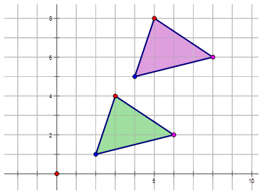

1. The pink triangle is translated down 4 and over 2 to the left.

In this first concept of Chapter **Is it a Slide, a Flip, or a Turn?** you were introduced to one of the four types of transformations, translations. Translations involve sliding an image on the Cartesian plane to the left, to the right, up and down. You describe the translations in this manner.

**Problem Set**

Describe the translation of the purple original figures in the diagrams:

1.  
    
    \[Figure 14\]
    
2.  
    
    \[Figure 15\]
    
3.  
    
    \[Figure 16\]
    
4.  
    
    \[Figure 17\]
    
5.  
    
    \[Figure 18\]
    

Use the diagram below to describe the following translations:

1.  A onto B
2.  A onto C
3.  A onto D
4.  A onto E
5.  A onto F

--------------------------------------------------

**Concept Content**

In this second concept of lesson **Translations of Geometric Shapes**, you will learn how to graph an image that has undergone a translation. Remember that a translation occurs when a preimage is slid across the Cartesian plane to form a new image. Each point in the preimage is moved the same distance and the same direction in the slide.

In the last lesson you moved the image up and down the $y$\-axis and left or right on the $x$\-axis. In this lesson you will create the images and preimages by first graphing them on a Cartesian plane. When graphing the translated image, it is often helpful to remember that:

* translating up means add the translated unit to the $y$\-coordinate of the $(x, y)$ points in the preimage
* translating down means subtract the translated unit from the $y$\-coordinate of the $(x, y)$ points in the preimage
* translating right means add the translated unit to the $x$\-coordinate of the $(x, y)$ points in the preimage
* translating left means subtract the translated unit from the $x$\-coordinate of the $(x, y)$ points in the preimage

**Guidance**

Triangle $ABC$ has coordinates $A(1, 1), B(8, 1)$ and $C(5, 8)$. Draw the triangle on the Cartesian plane. Translate the triangle up 2 units and over 4 units to the right. State the coordinates of the resulting image. How far has each point moved?

, B^\prime(12, 3)$ and $C^\prime(9, 10)$. The points have moved a distance of 4 units to the right and up 2 units.")

**Examples**

**Example A**

Line $\overline{A B}$ drawn from (–4, 2) to (3, 2) has been translated 3 units down and 7 units to the left. Draw the preimage and image and properly label each.

Triangle $A$ is translated 3 units up and 5 units to the right to make triangle $B$. Find the coordinates of triangle $B$. On the diagram, draw and label triangle $B$.

")

\[Figure 23\]

**Example C**

The following figure is translated 4 units down and 6 units to the left to make a translated image. Find the coordinates of the translated image. On the diagram, draw and label the image.

")

\[Figure 25\]

**Vocabulary**

__Image__

In transformations, the final figure is called the image.

__Preimage__

In transformations, the original image $(ABCD)$ is called a preimage.

__Transformation__

A **_transformation_** is an operation that is created from some original image. There are four types of transformations: translations, reflections, dilations and rotations.

__Translations__

**_Translations_** are made on an original image by moving every point on that image the same distance and in the same direction.

**Guided Practice**

1. Line $\overline{S T}$ drawn from (–3, –3) to (–3, 8) has been translated 5 units up and 3 units to the right. Draw the preimage and image and properly label each.

2. The polygon below has been translated 4 units down and 10 units to the right. Draw the translated image and properly label each.

1. ")

\[Figure 29\]

3. 

In this first concept of Chapter **Is it a Slide, a Flip, or a Turn?** you were introduced to one of the four types of transformations, translations. You also learned how to describe the translations in this manner. In this lesson you worked from the translation description to graphing the translated images. You learned that:

* translating up means add the translated unit to the $y$\-coordinate of the $(x, y)$ points in the preimage
* translating down means subtract the translated unit from the $y$\-coordinate of the $(x, y)$ points in the preimage
* translating right means add the translated unit to the $x$\-coordinate of the $(x, y)$ points in the preimage
* translating left means subtract the translated unit from the $x$\-coordinate of the $(x, y)$ points in the preimage

**Problem Set**

1.  Translate figure $MATH$ on the grid by moving it up 2 and over 5 to the right. 
    
    \[Figure 31\]
    
2.  Translate figure $DEFGH$ on the grid by moving it down 3 and over 8 to the left. 
    
    \[Figure 32\]
    
3.  Translate figure $LMO$ on the grid by moving it down 4 and over 3 to the right. 
    
    \[Figure 33\]
    
4.  Translate figure $WXY$ on the grid by moving it up 5 and over 5 to the left. 
    
    \[Figure 34\]
    
5.  Translate the red figure on the grid by moving it up 6 and over 4 to the right. 
    
    \[Figure 35\]
    

For each of the following diagrams translate the preimage 3 units up and 4 units to the left to make the translated images. Find the coordinates of the preimages. On the diagram, draw and label the translated image.

--------------------------------

**Concept Content**

In this third concept with respect to translations, you will learn how to describe a translation using a rule. In the first lesson you used words to describe a translation. For example, you described translating a preimage to a new position by stating that the preimage moved up 3 and over 5 to the left. This is one way to describe the translation.

You could have used a notation to describe the translation. A notation such as $T_{(3, \  5)}$. This notation tells you to add 3 to the $x$ values and add 5 to the $y$ values. Sometimes this notation is written as $T_{3, \ 5}(x, y) = (x+3, y+5)$. Another way to describe a translation using a rule is to write the translation as a mapping rule. A mapping rule has the following form $(x, y) \rightarrow (x-7, y+5)$ and tells you that the $x$ and $y$ coordinates are translated to $x - 7$ and $y + 5$.The mapping rule is the most common method.

As with the other sections, when the translation is positive, you are adding. A positive value means the preimage has moved up or to the right. When the translation is negative, you are subtracting. A negative value means the preimage has moved down or to the left. In this concept you will write rules for translations as well as draw graphs from these rules.

**Guidance**

The figure below shows a pattern of a floor tile. Write the mapping rule for the translation of the two blue floor tiles.

 is being translated.")

$$
p(x, y) \rightarrow p^\prime(x+a, y+b)
$$

where “$a$” is the number of units the image is translated left or right and “$b$” is the number of units translated up or down and “$p$” is the point.

So you know that:

$A: (-7, 2) \ \ A^\prime: (-2, 4)$

$A(x, y) \rightarrow A^\prime(x+a, y+b)$

So: $A(-7, 2) \rightarrow A^\prime(-7+a, 2+b)$ or $A(-7, 2) \rightarrow A^\prime(-2, 4)$

Therefore: 

$$
\begin{align*}
-7+a&=-2 \quad \ \ and \quad \ \ 2+b=4 \\
a&=5 \qquad \qquad \qquad \quad \ b=2
\end{align*}
$$

You can now write the general mapping rule for the translation of any point on the preimage to the translated image.

$$
(x, y) \rightarrow (x+5, y+2)
$$

**Examples**

**Example A**

Sarah describes a translation as point $P$ moving from $P(-2, 2)$ to $P^\prime(1, -1)$. Write the mapping rule to describe this translation for Sarah.

$P: (-2, 2) \ P^\prime: (1, -1)$

$P(x, y) \rightarrow P^\prime(x+a, y+b)$

So: $P(-2, 2) \rightarrow P^\prime(-2+a, 2+b)$ or $P(-2, 2) \rightarrow P^\prime(1, -1)$

Therefore: 

$$
\begin{align*}
-2+a&=1 \quad \ \ and \quad \ \ 2+b=-1 \\
a&=3 \qquad \qquad \qquad \ \ b=-3
\end{align*}
$$

You can now write the general mapping rule for the translation of any point on the preimage to the translated image.

$$
(x, y) \rightarrow (x+3, y-3)
$$

**Example B**

Mikah describes a translation as point $D$ in a diagram moving from $D(1, -5)$ to $D^\prime(-3, 1)$. Write the mapping rule to describe this translation for Mikah.

$D: (1, -5) \ D^\prime: (-3, 1)$

$D(x, y) \rightarrow D^\prime(x+a, y+b)$

So: $D(1, -5) \rightarrow D^\prime(1+a, -5+b)$ or $D(1, -5) \rightarrow D^\prime(-3, 1)$

Therefore: 

$$
\begin{align*}
1+a&=-3 \quad \ \ and \quad \ \ -5+b=1 \\
a&=-4 \qquad \qquad \qquad \qquad b=6
\end{align*}
$$

You can now write the general mapping rule for the translation of any point on the preimage to the translated image.

$$
(x, y) \rightarrow (x-4, y+6)
$$

**Example C**

Write the mapping rule that represents the translation of the preimage $A$ to the translated image $J$ in the diagram below.

 \ D^\prime: (6, 1)$")

$D(x, y) \rightarrow D^\prime(x+a, y+b)$

So: $D(-1, 4) \rightarrow D^\prime(-1+a, 4+b)$ or $D(-1, 4) \rightarrow D^\prime(6, 1)$

Therefore: 

$$
\begin{align*}
-1+a&=6 \quad \ \ and \quad \ \ 4+b=1 \\
a&=7 \qquad \qquad \qquad \ \ b=-3
\end{align*}
$$

You can now write the general mapping rule for the translation of any point on the preimage to the translated image.

$$
(x, y) \rightarrow (x+7, y-3)
$$

**Vocabulary**

__Mapping Rule__

A **_mapping rule_** has the following form $(x, y) \rightarrow (x-7, y+5)$ and tells you that the $x$ and $y$ coordinates are translated to $x-7$ and $y + 5$.

__Translations__

**_Translations_** are made on an original image by moving every point on that image the same distance and in the same direction.

**Guided Practice**

1. Jack describes a translation as point $J$ moving from $J(-2, 6)$ to $J^\prime(4, 9)$. Write the mapping rule to describe this translation for Jack.

2. Write the mapping rule that represents the translation of the red triangle to the translated green triangle in the diagram below.

1. $J: (-2, 6) \quad J^\prime: (4, 9)$

$J(x, y) \rightarrow J^\prime(x+a, y+b)$

So: $J(-2, 6) \rightarrow J^\prime(-2+a, 6+b)$ or $J(-2, 6) \rightarrow J^\prime(4, 9)$

Therefore: 

$$
\begin{align*}
-2+a&=4 \quad \ \ and \quad \ \ 6+b=9 \\
a&=6 \qquad \qquad \qquad \ \ b=3
\end{align*}
$$

You can now write the general mapping rule for the translation of any point on the preimage to the translated image.

$$
(x, y) \rightarrow (x+6, y+3)
$$

2. In order to write a mapping rule, choose one point on the preimage (the red triangle) and then the translated point on the green triangle to see how the point has moved.

$T: (8, 5) \quad T^\prime: (5, 0)$

$T(x, y) \rightarrow T^\prime(x+a, y+b)$

So: $T(8, 5) \rightarrow T^\prime(8+a, 5+b)$ or $T(8, 5) \rightarrow T^\prime(5, 0)$

Therefore: 

$$
\begin{align*}
8+a&=5 \quad \ \ and \quad \ \ 5+b=0 \\
a&=-3 \qquad \qquad \quad \ \ \ b=-5
\end{align*}
$$

You can now write the general mapping rule for the translation of any point on the preimage to the translated image.

$$
(x, y) \rightarrow (x-3, y-5)
$$

3. If you look closely at the diagram below, there two pairs of trapezoids that are translations of each other. Therefore you can choose one blue trapezoid that is a translation of the other and pick a point to find out how much the shape has moved to get to the translated position.

 \quad D^\prime: (-6, -3)$")

$D(x, y) \rightarrow D^\prime(x+a, y+b)$

So: $D(-10, 2) \rightarrow D^\prime(-10+a, 2+b)$ or $D(-10, 2) \rightarrow D^\prime(-6, -3)$

Therefore: 

$$
\begin{align*}
-10+a&=-6 \quad \ \ and \quad \ \ 2+b=-3 \\
a&=4 \qquad \qquad \qquad \quad \ \ b=-5
\end{align*}
$$

You can now write the general mapping rule for the translation of any point on the preimage to the translated image.

$$
(x, y) \rightarrow (x+4, y-5)
$$

**Summary**

In this last concept of lesson **Translations of Geometric Shapes** you have learned the final step in working with translations, that is, to write the mapping rule to describe the translation. The mapping rule allows you to quickly determine how much each point has moved both on the $x$\-axis and on the $y$\-axis to translate the preimage to the translated image. The most common form of writing a rule for a translation is $(x, y) \rightarrow (x+a, y+b)$ where “$a$” represents the number of units the translated point has moved left or right on the $x$\-axis and “$b$” represents the number of units the point has moved up or down on the $y$\-axis.

There are other forms of writing a mapping rule that you may see in math literature. In the last examples you wrote mapping rules like:

$(x, y) \rightarrow (x-4, y+5)$

You could have indicated the translation by writing:

$T_{(-4, 5)} (x, y) = (x-4, y+5)$

where $T_{(-4, 5)}$ represents the points moving left 4 units and up 5 units. This notation is less common but does exist in some mathematical texts.

**Problem Set**

Write the mapping rule to describe the movement of the points in each of the translations below.

1.  $S(1, 5) \rightarrow S^\prime(2, 7)$
2.  $W(-5, -1) \rightarrow W^\prime (-3, 1)$
3.  $Q(2, -5) \rightarrow Q^\prime(-6, 3)$
4.  $M(4, 3) \rightarrow M^\prime(-2, 9)$
5.  $B(-4, -2) \rightarrow B^\prime(2, -2)$

Write the mapping rule that represents the translation of the preimage $A$ to the translated images in the diagrams below.

1.  
    
    \[Figure 46\]
    
2.  
    
    \[Figure 47\]
    
3.  
    
    \[Figure 48\]
    
4.  
    
    \[Figure 49\]
    
5.  
    
    \[Figure 50\]
    

The Properties of a Translation
-------------------------------

**Concept Content**

As you learned earlier, translations involve sliding all points on a preimage the same distance and in the same direction. Translations do not involve rotating, changing the size, or anything else. Translations are just moving.

In this last concept you will look at the properties of translations. Since the translated image is congruent to the preimage, translations are considered to have the following properties:

* line segments are the same length (distance)
* angle measures in a figure remain the same (angles)
* lettering order remains the same (orientation)
* parallel lines remain parallel (same slopes)
* points that are on each line remain on the line for the translated image (collinear)

**Guidance**

The triangle $ABC$ is drawn such that the vertices are at $A(1, 1), B(5, 5)$ and $C(-2, 4)$. Triangle $DEF$ is drawn such that the vertices are at $D(-6, -3), E(-2, 1)$, and $F(9, 0)$.

a) Measure each angle either with a protractor or using geometry software. What angles are congruent?

b) Measure each side length. Are the distances the same?

c) Can you conclude that the triangle $DEF$ is a translation of triangle $ABC$?

a) The measures of each angle are shown in the diagram.

b) Congruent angles have the same measure. Since $\angle A = \angle D, \angle B = \angle E, \angle C = \angle E$, the angles are congruent.

")

\[Figure 52\]

The side lengths are also the same $(m \overline{A B} = m \overline{D E}, m \overline{A C} = m \overline{D F},$ and $m \overline{B C} = m \overline{E F})$.

c) Since the angle measures are the same and the lengths of each side are the same, the triangles are congruent. Each point it moved down 7 units and over 4 units to the left. With all of this, you can conclude that triangle $DEF$ is a translated image of the preimage triangle $ABC$.

**Examples**

**Example A**

Graph the following two squares to determine if Square $X$ is translated to form Square $Y$.

Square $X$ Vertices: $A(2, 3), B(8, 3), C(8, 8),$ and $D(2, 8)$.

Square $Y$ Vertices: $W(-3, -4), X(3, -4), Y(3, 1),$ and $Z(-3, 1)$.

$.")

Since the side measures are the same (both shapes are squares and therefore all angles are $90^\circ$), Square $X$ is congruent to Square $Y$. Each point it moved down 7 units and over 5 units to the left. With all of this, you can conclude that Square $Y$ is a translated image of the preimage Square $X$.

**Example B**

Describe how you would know if image $T$ is translated onto image $T^\prime$.

")

\[Figure 55\]

As indicated on the graph, the side measures are the same and the angle measures are all the same. Image $T$ is congruent to Image $T^\prime$. Each point it moved down 5 units and over 5 units to the right. With all of this, you can conclude that Image $T^\prime$ is a translated image of the preimage Image $T$.

**Example C**

Describe how you would know if image $A$ is translated onto image $B$.

")

\[Figure 57\]

As indicated on the graph, the side measures are the same and the angle measures are all the same. Image A is congruent to Image B. Each point it moved up 1 unit and over 10 units to the right. With all of this, you can conclude that Image B is a translated image of the preimage Image A.

**Vocabulary**

__Congruent Angles__

**_Congruent angles_** have the same measure.

__Translations__

**_Translations_** are made on an original image by moving every point on that image the same distance and in the same direction.

**Guided Practice**

1. Describe how you would know if image A is translated onto image B.

1. 

2. 

3. 

**Summary**

The previous three lessons you worked with translations, a transformation of a figure that involves moving the figure along the Cartesian plane. In this lesson you looked more closely at the properties of transformations. These properties include:

* line segments are the same length (distance)
* angle measures in a figure remain the same (angles)
* lettering order remains the same (orientation)
* parallel lines remain parallel (same slopes)
* points that are on each line remain on the line for the translated image (collinear)

Through the use of geometry software, it is easy to measure both the angles and the side lengths to determine if they are congruent, thus satisfying the first two properties. If points are each moving in the same direction and at the distance measure, you can be sure that the preimage is translated to form the new image.

**Problem Set**

Describe how you would know if image A is translated onto image B in each of the following diagrams.

1.  
    
    \[Figure 64\]
    
2.  
    
    \[Figure 65\]
    
3.  
    
    \[Figure 66\]
    
4.  
    
    \[Figure 67\]
    
5.  
    
    \[Figure 68\]
    

In each case, is the second image a translation of preimage A? How do you know?

1.  
    
    \[Figure 69\]
    
2.  
    
    \[Figure 70\]
    
3.  
    
    \[Figure 71\]
    
4.  
    
    \[Figure 72\]
    
5.  
    
    \[Figure 73\]
    

Summary
-------

In this first lesson of chapter **Is it a Slide, a Flip, or a Turn?** you have been introduced to translations. Remember that translations are just one of the four different transformations that can be done to a shape. There are also rotations, reflections, and dilations. Translations are simply movements. You can move a figure or a shape up and down on the $y$\-axis. You can also move the shape or figure left or right on the $x$\-axis. Or you can do both. The original image is known as the preimage and when you move the preimage to form a translated image, you have to describe the translation.

You first learned to describe the translation using words. So, you learned when the translation is positive, you are adding. A positive value means the preimage has moved up or to the right. When the translation is negative, you are subtracting. A negative value means the preimage has moved down or to the left. You ended this lesson learning how to write a mapping rule to describe a translation. The most common method for writing a mapping rule was using mapping notation $(x, y) \rightarrow (x+a, y+b)$ where “$a$” represents how many units your preimage has moved left or right on the $x$\-axis and “$b$” represents the number of units your preimage has moved up or down on the $y$\-axis. So, for example, you may see the mapping rule $(x, y) \rightarrow (x+4, y-5)$ which describes a translation of a preimage moved 4 units to the right and 5 units down. If you were to graph this, you would see the following:

")

\[Figure 75\]

Finally in this lesson, you learned that translations have the following properties:

* line segments are the same length (distance)
* angle measures in a figure remain the same (angles)
* lettering order remains the same (orientation)
* parallel lines remain parallel (same slopes)
* points that are on each line remain on the line for the translated image (collinear)

You used these properties to prove that one image is a translation of another image by finding the lengths of the preimage and the translated image as well as the angle measures in both images. You then found where the points moved from the preimage to the translated image. All of these properties combined proved that the one image was a translation of the other.

</article>

### 10.2 Reflections of Geometric Shapes

<article>

**Objectives**

The lesson objectives for Reflections of Geometric Shapes are:

* What is a reflection?
* Graphing an image that has undergone a reflection
* Writing a rule for a reflection
* The properties of a reflection

What Is a Reflection?
---------------------

**Concept Content**

As you learned in the previous lesson, there are four types of transformations. In the previous lesson, you learned about one of these transformations, translations. The other three transformations are reflections, dilations and rotations. In this lesson, you will learn about reflections. Reflections in transformations involve flipping a shape or figure. Reflections can be performed over a line of reflection, a point of reflection, or a plane of reflection. In reflections, all of the points in the preimage and the reflected image are equidistant from this line of reflection. As well, since reflections flip over the line of reflection (or the mirror line) the points on the mirror line stay the same for a reflection and the other points are on the opposite side.

* reflections in the $x$\-axis,
* reflections in the $y$\-axis,
* reflections about the origin, and
* reflections in the line $y = x$ or $y = -x$.

In later concepts, you will also learn to graph reflections, write rules to describe them, and finally learn some of the properties of reflections.

**Guidance**

Scott looked at the image below and stated that the image was reflected about the $y$\-axis. Is he correct? Explain.

| **Point for $ABCD$** | **Point for $A^\prime B^\prime C^\prime D^\prime$** |
| --- | --- |
| $A(-7, 4)$ | $A^\prime(7, 4)$ |
| $B(-3, 4)$ | $B^\prime(3, 4)$ |
| $C(-1, 1)$ | $C^\prime(1, 1)$ |
| $D(-9, 1)$ | $D^\prime(9, 1)$ |

If you notice in the table, all of the $y$\-coordinates for the reflected image are the same as their corresponding points in the preimage. However, the $x$\-coordinate has been multiplied by –1. The mirror line (or the line of reflection) is the $y$\-axis. Scott knows that in reflections the points on the mirror line stay the same and the other points are on the opposite side. Therefore the $y$\-coordinates would remain the same (since the $y$\-axis is the mirror line) and the $x$\-coordinates would change sign.

**Examples**

**Example A**

Describe the reflection of the light blue triangle in the diagram below.

|     |     |     |     |
| --- | --- | --- | --- |
| Points on $BCD$ | $B(-4, 2)$ | $C(-2, -2)$ | $D(-7, -2)$ |
| Points on $B^\prime C^\prime D^\prime$ | $B^\prime(4, -2)$ | $C^\prime (2, 2)$ | $D^\prime(7, 2)$ |

In the table above, all of the $x$\-coordinates and the $y$\-coordinates are multiplied by –1. This would tell you that the line of reflection (or the mirror line) is the origin point (0, 0).

**Example B**

Describe the reflection of the purple pentagon in the diagram below.

|     |     |     |     |     |     |
| --- | --- | --- | --- | --- | --- |
| Points on $DEFGH$ | $D(3.5, 2)$ | $E(5.4, 3)$ | $F(5.5, 6)$ | $G(2.3, 6)$ | $H(1.4, 3.2)$ |
| Points on $D^\prime E^\prime F^\prime G^\prime H^\prime$ | $D^\prime(3.5, -2)$ | $E^\prime(5.4, -3)$ | $F^\prime(5.5, -6)$ | $G^\prime(2.3, -6)$ | $H^\prime(1.4, -3.2)$ |

In the table above, all of the $x$\-coordinates are the same but the $y$\-coordinates are multiplied by –1. This would tell you that the line of reflection (or the mirror line) is the $x$\-axis.

**Example C**

Describe the reflection in the diagram below.

|     |     |     |     |     |     |     |
| --- | --- | --- | --- | --- | --- | --- |
| Points on $GHIJKL$ | $G(-1, 1)$ | $H(-1, 2)$ | $I(-4, 2)$ | $J(-4, 8)$ | $K(-5, 8)$ | $L(-5, 1)$ |
| Points on $G^\prime H^\prime I^\prime J^\prime K^\prime L^\prime$ | $G^\prime(1, -1)$ | $H^\prime(2, -1)$ | $I^\prime(2, -4)$ | $J^\prime(8, -4)$ | $K^\prime(8, -5)$ | $L^\prime(1, -5)$ |

The line of reflection, or the mirror line is $y = x$. Notice that all of the points on the preimage reverse order (or interchange) to form the corresponding points on the reflected image. So for example the point $G$ on the preimage is at (–1, 1) but the corresponding point $G^\prime$ on the reflected image is at (1, –1). Therefore the $x$ values and the $y$ values change places.

**Vocabulary**

__Image__

In transformations, the final figure is called the **_image_**.

__Mirror Line__

A **_mirror line_** is another term for the line of reflection.

__Preimage__

In transformations, the original image $(ABCD)$ is called a **_preimage_**.

__Transformation__

A **_transformation_** is an operation that is created from some original image. There are four types of transformations: translations, reflections, dilations and rotations.

__Reflections__

**_Reflections_** in transformations involve flipping a shape or figure over a line of reflection, a point of reflection, or a plane of reflection. In reflections, all of the points in the preimage and the translated image are equidistant from this line of reflection.

**Guided Practice**

1. Describe the reflection of the pink triangle in the diagram below.

1. Examine the points of the preimage and the reflected image.

|     |     |     |     |
| --- | --- | --- | --- |
| Points on $LMO$ | $L(-2, 5)$ | $M(6, 1)$ | $O(-5, 1)$ |
| Points on $L^\prime M^\prime O^\prime$ | $L^\prime(-2, -5)$ | $M^\prime(6, -1)$ | $O^\prime(-5, -1)$ |

Notice that all of the $y$\-coordinates of the preimage (purple triangle) are multiplied by –1 to make the reflected image. Therefore, the line of reflection, or the mirror line, is the $x$\-axis.

2. Examine the points of the preimage and the reflected image.

|     |     |     |     |     |
| --- | --- | --- | --- | --- |
| Points on $AGHI$ | $A(3, 7)$ | $G(3, 4)$ | $H(3, 2)$ | $I(8, 2)$ |
| Points on $A^\prime G^\prime H^\prime I^\prime$ | $A^\prime(-3, 7)$ | $G^\prime(-3, 4)$ | $H^\prime(-3, 2)$ | $I^\prime(-8, 2)$ |

Notice that all of the $x$\-coordinates of the preimage (image 1) is multiplied by –1 to make the reflected image. Therefore, the line of reflection, or the mirror line, is the $y$\-axis.

3. Examine the points of the preimage and the reflected image.

|     |     |     |     |     |     |     |
| --- | --- | --- | --- | --- | --- | --- |
| Points on $ABCDEF$ | $A(2, 4)$ | $B(5, 4)$ | $C(6, 2)$ | $D(5, 0)$ | $E(2, 0)$ | $F(1, 2)$ |
| Points on $A^\prime B^\prime C^\prime D^\prime E^\prime F^\prime$ | $A^\prime(-4, -2)$ | $B^\prime(-4, -5)$ | $C^\prime(-2, -6)$ | $D^\prime(0, -5)$ | $E^\prime(0, -2)$ | $F^\prime(-2, -1)$ |

Notice that both the $x$\-coordinates and the $y$\-coordinates of the preimage (image 1) change places to form the reflected image. As well the points are multiplied by –1. Therefore, the line of reflection, or the mirror line, is the line $y = -x$.

**Summary**

In this concept you began your study of reflections, the second type of transformation. Remember reflections involve flipping an image over a line, a point, or a plane. The reflection line is often called the mirror line. You learned the following types of reflections in this concept:

| **Type of Reflection** | **What did you learn...** |
| --- | --- |
| Reflections in the $x$\-axis | $x$ values stay the same, $y$ values multiply by –1 |
| Reflections in the $y$\-axis | $y$ values stay the same, $x$ values multiply by –1 |
| Reflections about the origin | Both $x$ and $y$ values multiply by –1 |
| Reflections in the line $y = x$ | Interchange the $x$\- and $y$\-coordinates to form the reflected image |
| Reflections in the line $y = -x$ | Interchange the $x$\- and $y$\-coordinates to form the reflected image and multiply them by –1 |

Being able to recognize a reflection (or a flip) allows you to describe this type of transformation of the preimage to the transformed image. In the next concept you will learn how to graph reflection images.

**Problem Set**

If the following points were reflected about the $x$\-axis, what would be the coordinates of the reflected points? Show these reflections on a graph.

1.  (3, 1)
2.  (4, –2)
3.  (–5, 3)
4.  (–6, 4)

If the following points were reflected about the $y$\-axis, what would be the coordinates of the reflected points? Show these reflections on a graph.

1.  (–4, 3)
2.  (5, –4)
3.  (–5, –4)
4.  (3, 3)

If the following points were reflected about the origin, what would be the coordinates of the reflected points? Show these reflections on a graph.

1.  (3, –1)
2.  (–6, 2)
3.  (–7, 3)
4.  (–8, –9)

If the following points were reflected about the line $y=x$, what would be the coordinates of the reflected points? Show these reflections on a graph.

1.  (3, 1)
2.  (4, –2)
3.  (–5, 3)
4.  (–6, 4)

Describe the following reflections:

1.  
    
    \[Figure 9\]
    
2.  
    
    \[Figure 10\]
    
3.  
    
    \[Figure 11\]
    
4.  
    
    \[Figure 12\]
    

Graphing an Image that has undergone a Reflection
-------------------------------------------------

**Concept Content**

In this second concept of lesson **Reflections of Geometric Shapes**, you will learn how to graph an image that has undergone a reflection. Remember that a reflection takes place when a preimage is flipped over a line, a point, or a plane in the Cartesian plane to form a new image.

In the last lesson you learned to recognize what happens to the points and images when reflected in different lines or points. In this lesson you will create the images and preimages by first graphing them on a Cartesian plane. When graphing the reflected image, it is often helpful to remember that what happens to the points in the preimage depends on the type of reflection. The table below summarizes the types of reflections and what happens to the points in your preimage based on each type.

| **Type of Reflection** | **What did you learn...** |
| --- | --- |
| Reflections in the $x$\-axis | $x$ values stay the same, $y$ values multiply by –1 |
| Reflections in the $y$\-axis | $y$ values stay the same, $x$ values multiply by –1 |
| Reflections about the origin | Both $x$ and $y$ values multiply by –1 |
| Reflections in the line $y = x$ | Interchange the $x$\- and $y$\-coordinates to form the reflected image |
| Reflections in the line $y = -x$ | Interchange the $x$\- and $y$\-coordinates to form the reflected image and multiply them by –1 |

**Guidance**

Triangle $A$ has coordinates $E(-5, -5)$, $F(2, -6)$ and $G(-2, 0)$. Draw the triangle on the Cartesian plane. Reflect the image in the $y$\-axis. State the coordinates of the resulting image.

$ are $E^\prime(5, -5)$, $F^\prime(-2, -6)$ and $G^\prime(2, 0)$.")

**Examples**

**Example A**

Line $\overline{AB}$ drawn from (–4, 2) to (3, 2) has been reflected in the $x$\-axis. Draw the preimage and image and properly label each.

The diamond $ABCD$ is reflected about the line $y = x$ to form the image $A^\prime B^\prime C^\prime D^\prime$. Find the coordinates of the reflected image. On the diagram, draw and label the reflected image.

")

\[Figure 16\]

**Example C**

The following figure is reflected about the origin to make a translated image. Find the coordinates of the reflected image. On the diagram, draw and label the image.

")

\[Figure 18\]

**Vocabulary**

__Image__

In transformations, the final figure is called the **_image_**.

__Mirror Line__

A **_mirror line_** is another term for the line of reflection.

__Preimage__

In transformations, the original image $(ABCD)$ is called a **_preimage_**.

__Transformation__

A **_transformation_** is an operation that is created from some original image. There are four types of transformations: translations, reflections, dilations and rotations

__Reflections__

**_Reflections_** in transformations involve flipping a shape or figure over a line of reflection, a point of reflection, or a plane of reflection. In reflections, all of the points in the preimage and the translated image are equidistant from this line of reflection.

**Guided Practice**

1. Line $\overline{ST}$ is drawn from (–3, 4) to (–3, 8) has been reflected about the line $y = -x$. Draw the preimage and image and properly label each.

2. The polygon below has been reflected in the $y$\-axis. Draw the reflected image and properly label each.

1. ")

\[Figure 22\]

3. 

In this second concept of Chapter **Is it a Slide, a Flip, or a Turn?** you were introduced to describing reflections, keeping in mind the way coordinates change when reflecting about a line or a point. In this lesson you worked from the reflection description and graphed the reflected image. You used the following concepts to graph the reflected images:

| **Line of reflection** | **Points on preimage** | **Points on reflected image** |
| --- | --- | --- |
| $x$\-axis | $(x, y)$ | $(x, -y)$ |
| $y$\-axis | $(x, y)$ | $(-x, y)$ |
| $y = x$ | $(x, y)$ | $(y, x)$ |
| $y = -x$ | $(x, y)$ | $(-y, -x)$ |
| $(0, 0)$ | $(x, y)$ | $(-x, -y)$ |

**Problem Set**

1.  Reflect figure $MATH$ on the grid about the $y$\-axis. 
    
    \[Figure 24\]
    
2.  Reflect figure $DEFGH$ about the line $y=x$. 
    
    \[Figure 25\]
    
3.  Reflect figure $LMO$ in the $x$\-axis. 
    
    \[Figure 26\]
    
4.  Reflect figure $WXY$ about the origin. 
    
    \[Figure 27\]
    
5.  Reflect the purple figure in the line $y=-x$. 
    
    \[Figure 28\]
    

For each of the following diagrams reflect the images about the $y$\-axis. Find the coordinates of the preimages. On each diagram, draw and label the reflected image.

-------------------------------

**Concept Content**

In this third concept with respect to reflections, you will learn how to describe a reflection using a rule. In the first lesson you used words to describe a reflection. By examining the coordinates of the reflected image, you could describe if the preimage was reflected in the $x$\-axis, the $y$\-axis, the origin, or the lines $y=x$ or $y=-x$.

You could have used a notation to describe the reflection. If, for instance you had the image below:

$P(x,y) \rightarrow P^\prime (-x,y)$ or $r_{y-axis}(x,y) \rightarrow (-x,y)$

In this concept you will write rules for reflection as well as draw graphs from such rules. For this concept you will be using the second of the above notations, namely $r_{y-axis}(x,y) \rightarrow (-x,y)$.

**Guidance**

The figure below shows a pattern of two fish. Write the mapping rule for the reflection of Image A to Image B.

|     |     |     |     |     |     |     |
| --- | --- | --- | --- | --- | --- | --- |
| Image A | $A(-11.8, 5)$ | $B(-11.8, 2)$ | $C(-7.8, 5)$ | $D(-4.9, 2)$ | $E(-8.7, 0.5)$ | $F(-10.4, 3.1)$ |
| Image B | $A^\prime (-11.8,-5)$ | $B^\prime(-11.8, -2)$ | $C^\prime(-7.8, -5)$ | $D^\prime(-4.9, -2)$ | $E^\prime(-8.7, -0.5)$ | $F^\prime(-10.4, -3.1)$ |

Notice that all of the $y$\-coordinates have changed sign. Therefore Image A has reflected across the $x$\-axis. To write a rule for this reflection you would write: $r_{x-axis}(x,y) \rightarrow (x,-y)$.

**Examples**

**Example A**

Find an image of the point (3, 2) that has undergone a reflection in:

a) the $x$\-axis,

b) the $y$\-axis,

c) the line $y=x$, and

d) the line $y=-x$.

Write the notation to describe the reflection.

 Reflection in the $x$\-axis: $r_{x-axis}(3,2) \rightarrow (3,-2)$")

b) Reflection in the $y$\-axis: $r_{y-axis}(3,2) \rightarrow (-3,2)$

c) Reflection in the $y=x$: $r_{y=x}(3,2) \rightarrow (2,3)$

d) Reflection in the $y=x$: $r_{y=-x}(3,2) \rightarrow (-2,-3)$

**Example B**

Reflect Image A in the diagram below:

a) About the $y$\-axis and label it $B$.

b) About the $x$\-axis and label it $O$.

c) In the line $y=-x$ and label it $Z$.

 Reflection in the $y$\-axis: $r_{y-axis}A \rightarrow B=r_{y-axis}(x,y) \rightarrow (-x,y)$")

b) Reflection in the $x$\-axis: $r_{x-axis}A \rightarrow O=r_{x-axis}(x,y) \rightarrow (x,-y)$

c) Reflection in the $y=-x$: $r_{y=-x}A \rightarrow Z=r_{y=-x}(x,y) \rightarrow (-y,-x)$

**Example C**

Write the notation that represents the reflection of the preimage A to the reflected image J in the diagram below.

$D: (-1, 5) \quad D^\prime: (1, -5)$

Notice how both $x$ and $y$ is multiplied by –1. This indicates that the preimage A is reflected about the origin to form the Reflected Image J. therefore the notation is $r_{origin}A \rightarrow J=r_{origin}(x,y) \rightarrow (-x,-y)$.

**Vocabulary**

__Notation Rule__

A **_notation rule_** has the following form $r_{y-axis}A \rightarrow B=r_{y-axis}(x,y) \rightarrow (-x,y)$ and tells you that the image A has been reflected in the $y$\-axis and only the $x$\-coordinates are multiplied by –1. The $y$\-coordinates remain the same.

__Reflections__

**_Reflections_** in transformations involve flipping a shape or figure over a line of reflection, a point of reflection, or a plane of reflection. In reflections, all of the points in the preimage and the translated image are equidistant from this line of reflection.

**Guided Practice**

1. Thomas describes a translation as point $J$ moving from $J(-2, 6)$ to $J^\prime(-2, -6)$. Write the notation to describe this reflection for Thomas.

2. Write the notation that represents the reflection of the yellow diamond to the reflected green diamond in the diagram below.

1. $J: (-2, 6) \quad J^\prime: (-2, -6)$

Since the $y$\-coordinate is multiplied by –1 and the $x$\-coordinate remains the same, this is a reflection in the $x$\-axis. The notation is: $r_{x-axis}J \rightarrow J^\prime=r_{x-axis} (-2,6) \rightarrow (-2,-6)$

2. In order to write the notation to describe the reflection, choose one point on the preimage (the yellow diamond) and then the reflected point on the green diamond to see how the point has moved. Notice that point E is shown in the diagram:

$E(-1,3) \rightarrow E^\prime(3,-1)$

Since both $x$\- and $y$\-coordinates are reversed numbers, the reflection is in the line $y=x$. The notation for this reflection would be: $r_{y=x}(x,y) \rightarrow (y,x)$.

3. In order to write the notation to describe the transformation, choose one point on the preimage (purple and blue diagram) and then the transformed point on the orange and blue diagram to see how the point has moved. Notice that point $A$ is shown in the diagram:

$C(7,0) \rightarrow C^\prime(-7,0)$

Since both $x$\-coordinates only are multiplied by –1, the transformation is a reflection is in $y$\-axis. The notation for this reflection would be: $r_{y-axis}(x,y) \rightarrow (-x,y)$.

In this concept of lesson **Reflections of Geometric Shapes** you have learned to describe a reflection in notation form. Notations for reflections can allow you to quickly determine where the reflected point or points are going to be in a diagram. In other words, you can draw a reflected image from a preimage when you know the notation. In order to write a notation you use the following general forms:

| **Line of reflection** | **Points on preimage** | **Points on reflected image** | **Notation rule** |
| --- | --- | --- | --- |
| $x$\-axis | $(x, y)$ | $(x, -y)$ | $r_{x-axis}(x,y) \rightarrow (x,-y)$ |
| $y$\-axis | $(x, y)$ | $(-x, y)$ | $r_{y-axis}(x,y) \rightarrow (-x,y)$ |
| $y = x$ | $(x, y)$ | $(y, x)$ | $r_{y=x}(x,y) \rightarrow (y,x)$ |
| $y = -x$ | $(x, y)$ | $(-y, -x)$ | $r_{y=-x}(x,y) \rightarrow (-y,-x)$ |
| $(0, 0)$ | $(x, y)$ | $(-x, -y)$ | $r_{origin}(x,y) \rightarrow (-x,-y)$ |

Using these mapping rules allows you to quickly determine the types of reflections in images. It also allows you to draw a reflected image from the notation.

**Problem Set**

Write the notation to describe the movement of the points in each of the reflections below.

1.  $S(1,5) \rightarrow S^\prime(-1,5)$
2.  $W(-5,-1) \rightarrow W^\prime(5,1)$
3.  $Q(2,-5) \rightarrow Q^\prime(2,5)$
4.  $M(4,3) \rightarrow M^\prime(-3,-4)$
5.  $B(-4,-2) \rightarrow B^\prime(-2,-4)$

Write the notation that represents the reflection of the preimage A to the reflected images in the diagrams below.

1.  
    
    \[Figure 40\]
    
2.  
    
    \[Figure 41\]
    
3.  
    
    \[Figure 42\]
    
4.  
    
    \[Figure 43\]
    
5.  
    
    \[Figure 44\]
    

The Properties of a Reflection
------------------------------

**Concept Content**

As you learned earlier, reflections involve flips of a preimage to form a reflected image. In this last concept you will look at the properties of reflections. Reflections result in reverse orientation. As you have seen in the examples from the previous three concepts, a reflection involves flipping an image or a point in a line or over the origin. The line is known as the line of symmetry. **The line of symmetry** is really just a line of reflection but it allows the point's preimage to be reflected to a translated image and maintain its measurements. Therefore reflected images have the same length and angle measurements as their preimages. As well, points of the reflected image are collinear if they are collinear in the preimage. In other words, if $B$ is between $A$ and $C$, then $B^\prime$ will be between $A^\prime$ and $C^\prime$.

In summary, reflections are considered to have the following properties:

* line segments are the same length (distance)
* angle measures in a figure remain the same (angles)
* reverse orientation
* points that are on each line remain on the line for the reflected image (collinear)

**Guidance**

The triangle $ABC$ is drawn such that the vertices are at $A(1, 1)$, $B(5, 5)$ and $C(-2, 4)$. Triangle $TOM$ is reflected across the $x$\-axis.

a) What are the coordinates of Triangle $TOM$?

b) Measure each angle either with a protractor or using geometry software. What angles are congruent?

c) Measure each side length. Are the distances the same?

d) Can you conclude that the triangle $TOM$ is a reflection of triangle $ABC$?

a) The coordinates of $TOM$ upon reflection in the $x$\-axis would be:

|     |     |     |     |
| --- | --- | --- | --- |
| Preimage $ABC$ | $A(1, 1)$ | $B(5, 5)$ | $C(-2, 4)$ |
| Reflected Image $TOM$ | $T(1, -1)$ | $O(5, -5)$ | $M(-2, -4)$ |

b) The measures of each angle are shown in the diagram.

c) $")

d) Since the angle measures are the same and the lengths of each side are the same, the triangles are congruent. Triangle $ABC$ has been reflected to produce triangle $TOM$.

**Examples**

**Example A**

Graph the following two squares to determine if Square A is reflected to form Square B.

Square A Vertices: $A(2, 3), B(8, 3), C(8, 8),$ and $D(2, 8)$.

Square B Vertices: $W(-2, 3), X(-8, 3), Y(-8, 8),$ and $Z(-2, 8)$.

$.")

Since the side measures are the same (both shapes are squares and therefore all angles are $90^\circ$), Square A is congruent to Square B. Each $x$\-coordinate on $ABCD$ is multiplied by –1 to produce Square B. With all of this, you can conclude that Square B is a reflected image of the preimage Square A. The reflection is about the $y$\-axis.

**Example B**

Describe how you would know if image $T$ is reflected onto image $T^\prime$.

Describe how you would know if image $A$ is reflected to form image $A^\prime$.

__Congruent Angles__

**_Congruent angles_** have the same measure.

__Line of Symmetry__

The **_line of symmetry_** is really just a line of reflection but it allows the point's preimage to be reflected to a translated image and maintain their measurements.

__Reflections__

**_Reflections_** in transformations involve flipping a shape or figure over a line of reflection, a point of reflection, or a plane of reflection. In reflections, all of the points in the preimage and the translated image are equidistant from this line of reflection.

**Guided Practice**

1. Describe how you would know if image A is reflected onto image B.

1. 

2. 

3. 

**Summary**

The previous three lessons you worked with reflections, a transformation of a figure that involves flipping a point or a figure along the Cartesian plane. In this lesson you looked more closely at the properties of reflections. These properties include:

* line segments are the same length (distance)
* angle measures in a figure remain the same (angles)
* reverse orientation
* points that are on each line remain on the line for the reflected image (collinear)

Through the use of geometry software, it is easy to measure both the angles and the side lengths to determine if these elements are congruent, thus satisfying the first two properties. If points are each moving in the same direction and measure the same distance, you can be sure that the preimage is reflected to form the new image.

**Problem Set**

Describe how you would know if image A is reflected onto image B in each of the following diagrams.

1.  
    
    \[Figure 58\]
    
2.  
    
    \[Figure 59\]
    
3.  
    
    \[Figure 60\]
    
4.  
    
    \[Figure 61\]
    
5.  
    
    \[Figure 62\]
    

In each case, is the second image a reflection of preimage A? How do you know?

1.  
    
    \[Figure 63\]
    
2.  
    
    \[Figure 64\]
    
3.  
    
    \[Figure 65\]
    
4.  
    
    \[Figure 66\]
    
5.  
    
    \[Figure 67\]
    

Summary
-------

In this second lesson of Chapter **Is it a Slide, a Flip, or a Turn?** you have been introduced to reflections. Remember that a reflection is just a flip of the preimage to create a translated image. Reflections are an important concept as you notice them probably on a daily basis in your everyday life. You look into a mirror and see a reflection of yourself! You can hold up your two hands and one is a reflection of the other. Reflections are also found in the study of chemical compounds only here they use the word **chirality** to describe the reflection. Chirality simply means that the structures of the compounds have opposite orientation and are, really, just mirror images of each other.

You first learned to describe the reflection using words. So you learned to look at points in a reflected image and its preimage to determine if the images involve:

* a reflection in the $x$\-axis,
* a reflection in the $y$\-axis,
* a reflection about the origin, and
* a reflection in the line $y = x$ or $y = -x$.

In this lesson you described the type of reflection using words. Following this, you learned to draw a reflected image based on a description. You further identified the types of reflections using the following data.

| **Type of Reflection** | **What happens...** |
| --- | --- |
| Reflections in the $x$\-axis | $x$ values stay the same, $y$ values multiply by –1 |
| Reflections in the $y$\-axis | $y$ values stay the same, $x$ values multiply by –1 |
| Reflections about the origin | Both $x$ and $y$ values multiply by –1 |
| Reflections in the line $y = x$ | Interchange the $x$\- and $y$\-coordinates to form the reflected image |
| Reflections in the line $y = -x$ | Interchange the $x$\- and $y$\-coordinates to form the reflected image and multiply them by –1 |

Therefore if you were asked to reflect an image in the line $y=x$, you quickly knew to interchange the $x$\- and $y$\-coordinates of the preimage to form the translated image.

In the third concept, you learned to write the notation for the reflected image from a preimage. Expanding on the table above, you could graph a reflected image and then write the notation for the image. Your new table to use when working with reflections became:

| **Line (point) of reflection** | **Points on preimage** | **Notation rule** |
| --- | --- | --- |
| $x$\-axis | $x$ values stay the same, $y$ values multiply by –1 | $r_{x-axis}(x,y) \rightarrow (x,-y)$ |
| $y$\-axis | $y$ values stay the same, $x$ values multiply by –1 | $r_{y-axis}(x,y) \rightarrow (-x,y)$ |
| $y = x$ | Interchange the $x$\- and $y$\-coordinates to form the reflected image | $r_{y=x}(x,y) \rightarrow (y,x)$ |
| $y = -x$ | Interchange the $x$\- and $y$\-coordinates to form the reflected image and multiply both by –1 | $r_{y=-x}(x,y) \rightarrow (-y,-x)$ |
| Origin: (0, 0) | Both $x$ and $y$ values multiply by –1 | $r_{origin}(x,y) \rightarrow (-x,-y)$ |

Finally in the last concept of this lesson, you learned that reflections have the following properties:

* line segments are the same length (distance)
* angle measures in a figure remain the same (angles)
* reverse orientation
* points that are on each line remain on the line for the reflected image (collinear)

You used these tendencies to prove that one image is a reflection of another image by finding the lengths of the preimage and the reflected image as well as the angle measures in both images. You then found where the points moved from the preimage to the reflected image. All of these properties combined proved that the one image was a reflection of the other.

</article>

### 10.3 Rotations of Geometric Shapes

<article>

**Objectives**

The lesson objectives for Rotations of Geometric Shapes are:

* What is a rotation?
* Graphing an image that has undergone a rotation.
* Writing a rule for a rotation
* The properties of a rotation

What Is a Rotation?
-------------------

**Concept Content**

As you learned in the previous lesson, there are four types of transformations. There, you learned about one of these transformations, reflections. The other three transformations are rotations, dilations and translations. In this lesson, you will learn about rotations. The transformations known as rotations involve turning or spinning a figure through a specific angle and direction and about a fixed point. This fixed point is called the turn center. A rotations is also called a turn and the turn center can be called the center of rotation. The figure below shows that the Preimage A is rotated $90^\circ$ counter-clockwise about the center point $A$ to form the rotated image. Point $A$ is the turn center.

1.  A rotation about a point of a specific number of degrees that is positive (i.e. $90^\circ$) is described as a $90^\circ$CCW or counter-clockwise rotation.
2.  A rotation about a point of a specific number of degrees that is negative (i.e. $-90^\circ$) is described as a $90^\circ$CW or clockwise rotation.
3.  A rotation about the origin will require you to look at specific points in the preimage and compare them to their corresponding points in the rotated image. The table below shows how you would describe the different rotations about the origin.

| **Center of Rotation (turn point)** | **Angle of Rotation** | **Preimage (Point $P$)** | **Rotated Image (Point $P^\prime$)** |
| --- | --- | --- | --- |
| (0, 0) | $90^\circ$ (or $-270^\circ$) | $(x, y)$ | $(-y, x)$ |
| (0, 0) | $180^\circ$ (or $-180^\circ$) | $(x, y)$ | $(-x, -y)$ |
| (0, 0) | $270^\circ$ (or $-90^\circ$) | $(x, y)$ | $(y, -x)$ |

In later concepts, you will also learn to graph rotations, write rules to describe them, and finally understand some of the properties of rotations.

**Guidance**

Which one of the following figures represents a rotation? Explain.

")

\[Figure 3\]

**Examples**

**Example A**

Describe the rotation of the blue triangle in the diagram below.

, the rotation is said to be clockwise.")

**Example B**

Describe the rotation of the triangles in the diagram below.

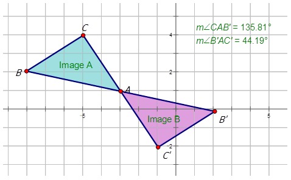

**Example C**

Describe the rotation in the diagram below.

Points $BC$ $B(-3, 4)$ $C(-5, 0)$

Points $B^\prime C^\prime$ $B^\prime (4, 3)$ $C^\prime (0, 5)$

From the table in the introduction, you know that these points represent a rotation of $90^\circ$CW about the origin. Each coordinate point has followed the conditions of the $90^\circ$CW meaning that the point $(x, y)$ becomes the point $(y, -x)$.

**Vocabulary**

__Turn Center__

A **_turn center_** is the fixed point for which the figure is turned in a rotation. The turn center is also called the center of rotation.

__Rotations__

**_Rotations_** in transformations involve turning or spinning a figure through a specific angle and direction and about a fixed point.

**Guided Practice**

1. Describe the rotation of the pink triangle in the diagram below.

1. Examine the points of the preimage and the rotated image (the blue triangle).

|     |     |     |     |
| --- | --- | --- | --- |
| Points on $BCD$ | $B(1, -1)$ | $C(2, 6)$ | $D(5, 1)$ |
| Points on $B^\prime C^\prime D^\prime$ | $B^\prime (1, 1)$ | $C^\prime (-6, 2)$ | $D^\prime (-1, 5)$ |

From the table in the introduction, you know that these points represent a rotation of $90^\circ$CCW about the origin. Each coordinate point has followed the conditions of the $90^\circ$CCW meaning that the point $(x, y)$ becomes the point $(-y, x)$.

2. For this image, look at the rotation. It is not rotated about the origin but rather about the point $A$. We can measure the angle of rotation:

. You would say that the blue polygon is rotated $145^\circ$CW to form the orange polygon.")

3. For this image, look at the rotation. It is not rotated about the origin but rather about the point $D$. We can measure the angle of rotation:

. You would say that the green hexagon is rotated $90^\circ$CCW to form the orange hexagon.")

**Summary**

In this concept you began your study of rotations, the third type of transformations. Remember rotations involve turning or spinning about a fixed point, including the origin. The rotation line is often called the mirror line. You learned the following types of rotations in this concept as well as how to describe them:

1.  A rotation about a point of a specific number of degrees that is positive (i.e. $90^\circ$) is described as a $90^\circ$CCW or counter-clockwise rotation.
2.  A rotation about a point of a specific number of degrees that is negative (i.e. $-90^\circ$) is described as a $90^\circ$CW or clockwise rotation.
3.  A rotation about the origin will require you to look at specific points in the preimage and compare them to their corresponding points in the rotated image. The table below shows how you would describe the different rotations about the origin.

| **Center of Rotation (turn point)** | **Angle of Rotation** | **Preimage (Point $P$)** | **Rotated Image (Point $P^\prime$)** |
| --- | --- | --- | --- |
| (0, 0) | $90^\circ$(or $-270^\circ$) | $(x, y)$ | $(-y, x)$ |
| (0, 0) | $180^\circ$(or $-180^\circ$) | $(x, y)$ | $(-x, -y)$ |
| (0, 0) | $270^\circ$(or $-90^\circ$) | $(x, y)$ | $(y, -x)$ |

In later concepts, you will also learn to graph rotations, write rules to describe them, and finally understand some of the properties of rotations.

**Problem Set**

If the following points were rotated about the origin with a $180^\circ$CCW rotation, what would be the coordinates of the rotated points? Show these rotations on a graph.

1.  (3, 1)
2.  (4, –2)
3.  (–5, 3)
4.  (–6, 4)
5.  (–3, –3)

If the following points were rotated about the origin with a $90^\circ$CW rotation, what would be the coordinates of the rotated points? Show these rotations on a graph.

1.  (–4, 3)
2.  (5, –4)
3.  (–5, –4)
4.  (3, 3)
5.  (–8, –9)

Describe the following rotations:

1.  
    
    \[Figure 13\]
    
2.  
    
    \[Figure 14\]
    
3.  
    
    \[Figure 15\]
    
4.  
    
    \[Figure 16\]
    

Graphing an Image that has Undergone a Rotation
-----------------------------------------------

**Concept Content**

In this second concept of lesson **What is a Rotation?**, you will learn how to graph an image that has undergone a rotation. Remember that a rotation is when a preimage is turned or spun through a specific angle and direction and about a fixed point.

In the last lesson you learned to recognize what happens to the points and images when rotated in different directions and angles. In this lesson you will create the images and preimages by first graphing them on a Cartesian plane. When graphing the rotated image, it is often helpful to remember what happens to the points in the preimage depends on the type of rotation. The table below summarizes the types of rotations and what happens to the points in your preimage based on each type.

1.  A rotation about a point of a specific degrees that is positive (i.e. $90^\circ$) is described as a $90^\circ$CCW or counter-clockwise rotation.
2.  A rotation about a point of a specific degrees that is negative (i.e. $-90^\circ$) is described as a $90^\circ$CW or clockwise rotation.
3.  A rotation about the origin will require you to look at specific points in the preimage and compare them to their corresponding points in the rotated image. The table below shows how you would describe the different rotations about the origin.

| **Center of Rotation (turn point)** | **Angle of Rotation** | **Preimage (Point $P$)** | **Rotated Image (Point $P^\prime$)** |
| --- | --- | --- | --- |
| (0, 0) | $90^\circ$(or $-270^\circ$) | $(x, y)$ | $(-y, x)$ |
| (0, 0) | $180^\circ$(or $-180^\circ$) | $(x, y)$ | $(-x, -y)$ |
| (0, 0) | $270^\circ$(or $-90^\circ$) | $(x, y)$ | $(y, -x)$ |

**Guidance**

Quadrilateral $WXYZ$ has coordinates $W(-5, 5), X(-2, 0), Y(2, 3)$ and $Z(-1, 3)$. Draw the quadrilateral on the Cartesian plane. Rotate the image $110^\circ$ clockwise about the point $X$. Show the resulting image.

**Example A**

Line $\overline{AB}$ drawn from (–4, 2) to (3, 2) has been rotated about the origin at an angle of $90^\circ$CW. Draw the preimage and image and properly label each.

The diamond $ABCD$ is rotated $145^\circ$CCW about the origin to form the image $A^\prime B^\prime C^\prime D^\prime$. Find the coordinates of the rotated image. On the diagram, draw and label the reflected image.

")

\[Figure 20\]

Notice the direction of the angle is counter-clockwise.

**Example C**

The following figure is rotated about the origin $200^\circ$CW to make a rotated image. Find the coordinates of the rotated image. On the diagram, draw and label the image.

")

\[Figure 22\]

Notice the direction of the angle is counter-clockwise, therefore the angle measure is $160^\circ$.

**Vocabulary**

__Turn Center__

A **_turn center_** is the fixed point for which the figure is turned in a rotation. The turn center is also called the center of rotation.

__Rotations__

**_Rotations_** in transformations involve turning or spinning a figure through a specific angle and direction and about a fixed point.

**Guided Practice**

1. Line $\overline{ST}$ drawn from (–3, 4) to (–3, 8) has been rotated $60^\circ$CW about the point $S$. Draw the preimage and image and properly label each.

2. The polygon below has been rotated $155^\circ$CCW about the origin. Draw the rotated image and properly label each.

1. 

2. 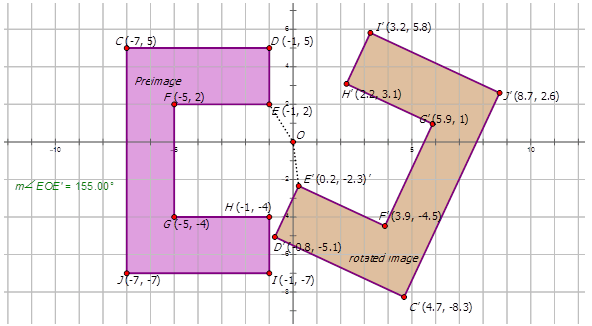

3. 

**Summary**

In this third concept of Chapter **Is it a Slide, a Flip, or a Turn?** you were introduced to describing rotations, keeping in mind the way the angle rotates about a fixed point or the origin. In this lesson you worked from the rotation description and graphed the rotated image. You used the following concepts to graph the rotated images:

1.  A rotation about a point of a specific number of degrees that is positive (i.e. $90^\circ$) is described as a $90^\circ$CCW or counter-clockwise rotation.
2.  A rotation about a point of a specific number of degrees that is negative (i.e. $-90^\circ$) is described as a $90^\circ$CW or clockwise rotation.
3.  A rotation about the origin will require you to look at specific points in the preimage and compare them to their corresponding points in the rotated image. The table below shows how you would describe the different rotations about the origin.

| **Center of Rotation (turn point)** | **Angle of Rotation** | **Preimage (Point $P$)** | **Rotated Image (Point $P^\prime$)** |
| --- | --- | --- | --- |
| (0, 0) | $90^\circ$(or $-270^\circ$) | $(x, y)$ | $(-y, x)$ |
| (0, 0) | $180^\circ$(or $-180^\circ$) | $(x, y)$ | $(-x, -y)$ |
| (0, 0) | $270^\circ$(or $-90^\circ$) | $(x, y)$ | $(y, -x)$ |

**Problem Set**

1.  Rotate figure $MATH$ on the grid about the origin $180^\circ$. 
    
    \[Figure 28\]
    
2.  Rotate figure $DEFGH$ about the origin $-270^\circ$. 
    
    \[Figure 29\]
    
3.  Rotate figure $LMO$ about the point $M$ by $-45^\circ$. 
    
    \[Figure 30\]
    
4.  Rotate figure $WXY$ about the point $W$ by $-45^\circ$. 
    
    \[Figure 31\]
    
5.  Rotate the purple figure about the origin by $-90^\circ$. 
    
    \[Figure 32\]
    

For each of the following diagrams rotate the images about the origin by $90^\circ$CCW. Find the coordinates of the preimages. On each diagram, draw and label the reflected image.

-----------------------------

**Concept Content**

In this third concept with respect to rotations, you will learn how to describe a rotation using a rule. In the first lesson you used words to describe a rotation. By examining the coordinates of the rotated image, you could describe if the preimage was rotated about the origin with a specific direction and a specific angle. You will focus on only rotations about the origin in this concept as the notation rules are specific to those found in the table below.

| **Center of Rotation (turn point)** | **Angle of Rotation** | **Preimage (Point $P$)** | **Rotated Image (Point $P^\prime$)** | **Notation (Point $P^\prime$)** |
| --- | --- | --- | --- | --- |
| (0, 0) | $90^\circ$(or $-270^\circ$) | $(x, y)$ | $(-y, x)$ | $(x, y) \rightarrow (-y, x)$ |
| (0, 0) | $180^\circ$(or $-180^\circ$) | $(x, y)$ | $(-x, -y)$ | $(x, y) \rightarrow (-x, -y)$ |
| (0, 0) | $270^\circ$(or $-90^\circ$) | $(x, y)$ | $(y, -x)$ | $(x, y) \rightarrow (y, -x)$ |

If, for instance you had the image below:

$$
(x,y) \rightarrow (-y,x) \ \text{or} \ R_{90^\circ}(x,y)=(-y,x)
$$

In this concept you will write rules for rotation as well as draw graphs from these rules. For this concept you will be using the second of the above notations, namely $R_{90^\circ}(x,y)=(-y,x)$.

**Guidance**

The figure below shows a pattern of two fish. Write the mapping rule for the rotation of Image A to Image B.

=(y,-x)$.")

**Examples**

**Example A**

Find an image of the point (3, 2) that has undergone a rotation in:

a) about the origin at $90^\circ$,

b) about the origin at $180^\circ$, and

c) about the origin at $270^\circ$.

Write the notation to describe the rotation.

 Rotation about the origin at $90^\circ : R_{90^\circ}(x,y)=(-y,x)$")

b) Rotation about the origin at $180^\circ : R_{180^\circ}(x,y)=(-x,-y)$

c) Rotation about the origin at $270^\circ : R_{270^\circ}(x,y)=(y,-x)$

**Example B**

Rotate Image A in the diagram below:

d) about the origin at $90^\circ$, and label it $B$.

e) about the origin at $180^\circ$, and label it $O$.

f) about the origin at $270^\circ$, and label it $Z$.

 Rotation about the origin at $90^\circ$: $R_{90^\circ}A \rightarrow B=R_{90^\circ}(x,y) \rightarrow (-y,x)$")

b) Rotation about the origin at $180^\circ$: $R_{180^\circ}A \rightarrow O=R_{180^\circ}(x,y) \rightarrow (-x,-y)$

c) Rotation about the origin at $270^\circ$: $R_{270^\circ}A \rightarrow Z=R_{270^\circ}(x,y) \rightarrow (y,-x)$

**Example C**

Write the notation that represents the rotation of the preimage A to the rotated image J in the diagram below.

$$
E: (-1, 2) \quad E^\prime: (1, -2)
$$

Notice how both the $x$\- and $y$\-coordinates are multiplied by –1. This indicates that the preimage A is rotated about the origin by $180^\circ$CCW to form the rotated image J. Therefore the notation is $R_{180^\circ}A \rightarrow J=R_{180^\circ}(x,y) \rightarrow (-x,-y)$.

**Vocabulary**

__Notation Rule__

A **_notation rule_** has the following form $R_{180^\circ}A \rightarrow O=R_{180^\circ}(x,y) \rightarrow (-x,-y)$ and tells you that the image A has been rotated about the origin and both the $x$\- and $y$\-coordinates are multiplied by –1.

__Rotations__

**_Rotations_** in transformations involve turning or spinning a figure through a specific angle and direction and about a fixed point.

**Guided Practice**

1. Thomas describes a translation as point $J$ moving from $J(-2, 6)$ to $J^\prime(6, 2)$. Write the notation to describe this rotation for Thomas.

2. Write the notation that represents the rotation of the yellow diamond to the rotated green diamond in the diagram below.

1. $J: (-2, 6) \quad J^\prime: (6, 2)$

 \rightarrow (y,-x)$")

2. In order to write the notation to describe the rotation, choose one point on the preimage (the yellow diamond) and then the rotated point on the green diamond to see how the point has moved. Notice that point $E$ is shown in the diagram:

$$
E(-1,3) \rightarrow E^\prime(-3,-1)
$$

Since both $x$\- and $y$\-coordinates are reversed places and the $y$\-coordinate has been multiplied by –1, the rotation is about the origin $90^\circ$. The notation for this rotation would be: $R_{90^\circ}(x,y) \rightarrow (-y,x)$.

 and then the transformed point on the orange and blue diagram to see how the point has moved. Notice that point $C$ is shown in the diagram:")

$$
C(7,0) \rightarrow C^\prime(0,-7)
$$

Since the $x$\-coordinates only are multiplied by –1, and then $x$\- and $y$\-coordinates change places, the transformation is a rotation is about the origin by $270^\circ$. The notation for this rotation would be: $R_{270^\circ}(x,y) \rightarrow (y,-x)$.

**Summary**

In this concept of lesson **Rotations of Geometric Shapes** you have learned to describe a rotation in notation form. Notations for rotations can allow you to quickly determine at what angle and direction the rotation occurs as well as help you determine the coordinates of the rotated points. In other words, you can draw a rotated image from a preimage knowing the notation. In order to write a notation you use the following general forms:

| **Center of Rotation** | **Angle of Rotation** | **Notation rule** |
| --- | --- | --- |
| (0, 0) | $90^\circ$ (or $-270^\circ$) | $R_{90^\circ}(x,y)=(-y,x)$ |
| (0, 0) | $180^\circ$ (or $-180^\circ$) | $R_{180^\circ}(x,y) \rightarrow (-x,-y)$ |
| (0, 0) | $270^\circ$ (or $-90^\circ$) | $R_{270^\circ}(x,y) \rightarrow (y,-x)$ |

Using these mapping rules not only allows you to quickly determine the types of rotations in images but also allows you to draw a rotated image from the notation. Remember as well that a positive angle of rotation turns the figure counterclockwise, and a negative angle of rotation turns the figure in a clockwise direction.

**Problem Set**

Complete the following table:

| **Starting Point** | **$90^\circ$ Rotation** | **$180^\circ$ Rotation** | **$270^\circ$ Rotation** | **$360^\circ$ Rotation** |
| --- | --- | --- | --- | --- |
| 1. (1, 4) |     |     |     |     |
| 2. (4, 2) |     |     |     |     |
| 3. (2, 0) |     |     |     |     |
| 4. (–1, 2) |     |     |     |     |
| 5. (–2, –3) |     |     |     |     |

Write the notation that represents the rotation of the preimage A to the reflected images in the diagrams below.

1.  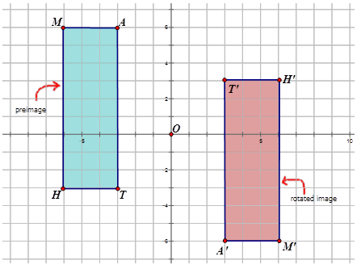
    
    \[Figure 45\]
    
2.  
    
    \[Figure 46\]
    
3.  
    
    \[Figure 47\]
    
4.  
    
    \[Figure 48\]
    
5.  
    
    \[Figure 49\]
    

The Properties of a Rotation
----------------------------

**Concept Content**

As you learned earlier, rotations involve turns or spins of a preimage to form a rotated image. In this last concept you will look at the properties of rotations. Rotations result when an image and its rotated image have the same shape but the rotated image may be turned in different directions. You have seen in the examples of rotations from the previous three concepts where a rotation involves turning or spinning an image across the origin or from a point on the preimage. Therefore rotated images have the same length and angle measurements as their preimages. As well, points of the rotated image are collinear if they are collinear in the preimage. In other words, if $B$ is between $A$ and $C$, then $B^\prime$ will be between $A^\prime$ and $C^\prime$.

In summary, rotations are considered to have the following properties:

* line segments are the same length (distance)
* angle measures in a figure remain the same (angles)
* same orientation (lettering remains the same)
* points that are on each line remain on the line for the reflected image (collinear)
* parallelism (parallel lines remain parallel)

**Guidance**

The triangle $ABC$ is drawn such that the vertices are at $A(1, 1), B(5, 5)$ and $C(-2, 4)$. Triangle $A^\prime B^\prime C^\prime$ is rotated $45^\circ$CW.

a) What are the coordinates of Triangle $A^\prime B^\prime C^\prime$?

b) Measure each angle either with a protractor or using geometry software. What angles are congruent?

c) Measure each side length. Are the distances the same?

d) Can you conclude that the triangle $A^\prime B^\prime C^\prime$ is a rotation of triangle $ABC$?

a) The coordinates of $A^\prime B^\prime C^\prime$ upon rotation $45^\circ$CW would be:

Preimage $ABC$ $A(1, 1)$ $B(5, 5)$ $C(-2, 4)$

Reflected Image $A^\prime B^\prime C^\prime$ $A^\prime (-0.7, 5)$ $B^\prime (5, 5)$ $C^\prime (-0.7, -9.2)$

b) The measures of each angle are shown in the diagram.

c) $.")

d) Since the angle measures are the same and the lengths of each side are the same, the triangles are congruent. Triangle $ABC$ has been reflected to produce triangle $A^\prime B^\prime C^\prime$.

**Examples**

**Example A**

Graph the following two squares to determine if Quadrilateral A is rotated to form Quadrilateral B.

Quadrilateral A Vertices: $W(2, -2), X(5, 0), Y(5, 3),$ and $Z(4, 3)$.

Quadrilateral B Vertices: $W^\prime (2, 2), X^\prime (0, 5), Y^\prime (-3, 5),$ and $Z^\prime (-3, 4)$.

 and the angle lengths are the same $(\angle X= \angle X^\prime, \angle Y=\angle Y^\prime, \angle W= \angle W^\prime$, _and_ $\angle Z= \angle Z^\prime)$.")

Since the side and angle measures are the same Quadrilateral A is congruent to Quadrilateral B. Each y-coordinate on $ABCD$ is multiplied by –1 and then coordinate points are reversed to produce Quadrilateral B. With all of this, you can conclude that Quadrilateral B is a rotated image of the preimage Quadrilateral A. The rotation is about the origin $90^\circ$CCW.

**Example B**

Describe how you would know if image $T$ is rotated onto image $T^\prime$.

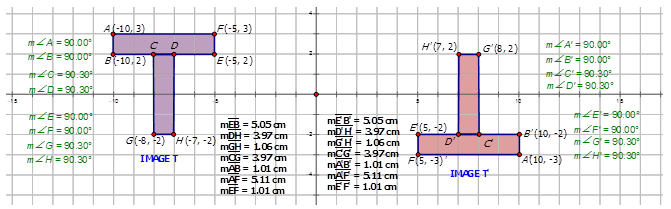

Describe how you would know if image $R$ is rotated to form image $R^\prime$.

__Congruent Angles__

Congruent angles have the same measure.

__Rotations__

**_Rotations_** in transformations involve turning or spinning a figure through a specific angle and direction and about a fixed point.

**Guided Practice**

1. Describe how you would know if image A is rotated onto image B.

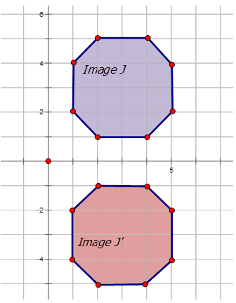

1. 

2. 

3. 

**Summary**

The previous three lessons you worked with rotations, a transformation of a figure that involves turning a point or a figure along the Cartesian plane. In this lesson you looked more closely at the properties of rotations. These properties include:

* line segments are the same length (distance)
* angle measures in a figure remain the same (angles)
* same orientation (lettering remains the same)
* points that are on each line remain on the line for the reflected image (collinear)
* parallelism (parallel lines remain parallel)

Through the use of geometry software, it is easy to measure both the angles and the side lengths to determine if these elements are congruent, thus satisfying the first two properties. If points are each moving in the same direction and are at the same distance measure, you can be sure that the preimage is rotated to form the new image.

**Problem Set**

Describe how you would know if image A is rotated onto image B in each of the following diagrams.

1.  
    
    \[Figure 63\]
    
2.  
    
    \[Figure 64\]
    
3.  
    
    \[Figure 65\]
    
4.  
    
    \[Figure 66\]
    
5.  
    
    \[Figure 67\]
    
6.  Triangle $ABC$ with vertices $A(3, 1), B(0, -1)$ and $C(1, 5)$ has been rotated about the point $P(-1, 1) \ 180^\circ$ to produce triangle $A^\prime B^\prime C^\prime$. Draw the diagram representing this rotation and prove the image $A^\prime B^\prime C^\prime$ is actually a rotation.
7.  Triangle $DEF$ with vertices $D(0, 1), E(5, 1)$ and $F(2, 5)$ has been rotated about the point $P(-2, 5) \ 90^\circ$CCW to produce triangle $D^\prime E^\prime F^\prime$. Draw the diagram representing this rotation and prove the image $D^\prime E^\prime F^\prime$ is actually a rotation.
8.  Draw a letter from the alphabet that produces the same letter after a $180^\circ$ rotation. Prove the rotated image is actually a rotation.
9.  Draw another letter from the alphabet that produces the same letter after a $180^\circ$ rotation. Prove the rotated image is actually a rotation.
10. Prove that the preimage triangle 1 is rotated to produce triangle 2. Determine the rotation of triangle 1 to triangle 2. 
    
    \[Figure 68\]
    

Summary
-------

In this third lesson of Chapter **Is it a Slide, a Flip, or a Turn?** you have been introduced to rotations. Remember that a rotation is just a turn or spin of the preimage to create a rotated image. Rotations are an important concept as you notice them probably daily in your everyday life. Amusement park rides such as the Ferris wheel and the tilt-a-whirl involve rotations (of you), blades on a ceiling fan involve rotations, and even some flags use rotations to create the pattern.

You first learned to describe the rotation using words. So, you learned to look at points in a rotated image and the preimage to determine if the images involve:

* a rotation about a point clockwise,
* a rotation about a point counter-clockwise, or
* a rotation about the origin of a specific angle and direction

In this lesson you described the type of rotation using words. Following this you learned to draw a rotated image based on a description. You further identified the types of rotations using the following data.

1.  A rotation about a point of a specific number of degrees that is positive (i.e. $90$) is described as a $90^\circ$CCW or counter-clockwise rotation.
2.  A rotation about a point of a specific number of degrees that is negative (i.e. $-90^\circ$) is described as a $90^\circ$CW or clockwise rotation.
3.  A rotation about the origin will require you to look at specific points in the preimage and compare them to their corresponding points in the rotated image. The table below shows how you would describe the different rotations about the origin.

| **Center of Rotation (turn point)** | **Angle of Rotation** | **Preimage (Point $P$)** | **Rotated Image (Point $P^\prime$)** |
| --- | --- | --- | --- |
| (0, 0) | $90^\circ$ (or $-270^\circ$) | $(x, y)$ | $(-y, x)$ |
| (0, 0) | $180^\circ$ (or $-180^\circ$) | $(x, y)$ | $(-x, -y)$ |
| (0, 0) | $270^\circ$ (or $-90^\circ$) | $(x, y)$ | $(y, -x)$ |

Therefore if you were asked to rotate an image about the origin at $90^\circ$CCW, you quickly knew to multiply the $y$\-coordinate by –1 and then to interchange the $x$\- and $y$\-coordinates of the preimage to form the rotated image.

In the third concept, you learned to write the notation for the rotated image from a preimage. You learned to graph a rotated image and then write the notation for the image. Your new table to use when working with rotations became:

| **Center of Rotation** | **Angle of Rotation** | **Notation rule** |
| --- | --- | --- |
| (0, 0) | $90^\circ$ (or $-270^\circ$) | $R_{90^\circ}(x,y)=(-y,x)$ |
| (0, 0) | $180^\circ$ (or $-180^\circ$) | $R_{180^\circ}(x,y) \rightarrow (-x,-y)$ |
| (0, 0) | $270^\circ$ (or $-90^\circ$) | $R_{270^\circ}(x,y) \rightarrow (y,-x)$ |

Finally in the last concept of this lesson, you learned that rotations have the following properties:

* line segments are the same length (distance)
* angle measures in a figure remain the same (angles)
* same orientation (lettering remains the same)
* points that are on each line remain on the line for the reflected image (collinear)
* parallelism (parallel lines remain parallel)

You used these tendencies to prove that one image is a rotation of another image by finding the lengths of the preimage and the rotated image as well as the angle measures in both images. You then found where the points moved from the preimage to the rotated image. All of these properties combined proved that one image was a rotation of the other.

</article>

### 10.4 Dilations of Geometric Shapes

<article>

**Objectives**

The lesson objectives for dilations of Geometric Shapes are:

* What is a dilation?
* Graphing an image that has undergone a dilation.
* Writing a rule for a dilation
* The properties of a dilation

What Is a Dilation?
-------------------

**Concept Content**

As you learned in the previous lessons, there are four types of transformations. In the previous lesson, you learned about one of these transformations, rotations. The other three transformations are dilations, reflections, and translations. In this lesson, you will learn about dilations. The transformations known as dilations involve changing the size of a preimage to create the dilation image. When performing a dilation you use a scale factor. The scale factor will determine how much bigger or smaller the dilation image will be. The scale factor is sometimes called the scalar factor and has the symbol $r$. The figure below shows that the image $A^\prime$ is a dilation by a scale factor of 2. The key to remember is that the shape does not change; just the size does.

In later concepts, you will also learn to graph dilations, write rules to describe them, and finally understand some of the properties of dilations.

**Guidance**

Which one of the following figures represents a dilation. Explain.

")

\[Figure 3\]

You know that a dilation is a transformation that produces an image of the same shape but larger or smaller. Both of the figures above represent objects that involve dilations. In the figure with the triangles, the scale factor is 3.

**Example A**

Describe the dilation about the center point $B$ in the diagram below.

Using the measurement below and the scale factor, determine the measure of the dilation image.

$$
\begin{align*}
m \overline{A B} &= 15 \ cm \\
r &=\frac{1}{3}
\end{align*}
$$

You need to multiply the scale factor by the measurement of $AB$ in order to find the measurement of the dilation image $A^\prime B^\prime$.

$m \overline{A^\prime B^\prime} = |r| m \overline{A B}$

Since $|r|=\frac{1}{3}$, and $m \overline{A B} = 15$,

$$
\begin{align*}
& m \overline{A^\prime B^\prime}=\frac{1}{3}(15) \\
& m \overline{A^\prime B^\prime}= 5 \ cm
\end{align*}
$$

**Example C**

Using the measurement below and the scale factor, determine the measure of the preimage.

$$
\begin{align*}
m \overline{H^\prime I^\prime} &= 24 \ cm \\
r &=2
\end{align*}
$$

Here, you need to divide the scale factor by the measurement of $H^\prime I^\prime$ in order to find the measurement of the preimage $HI$.

$m \overline{H^\prime I^\prime} = |r| m \overline{H I}$

Since $|r|=2$, and $m \overline{H^\prime I^\prime} = 24$,

$$
\begin{align*}
&24 = 2m\overline{H I} \\
& m \overline{H I}=\frac{24}{2} \\
& m \overline{H I}= 12 \ cm
\end{align*}
$$

**Vocabulary**

__Center Point__

The **_center point_** is the center of the dilation. You use the center point to measure the distances to the preimage and the dilation image. It is these distances that determine the scale factor.

__Dilations__

**_Dilations_** in transformations involve changing the size of a preimage to create the dilation image.

__Scale Factor__

The **_scale factor_** will determine how much bigger or smaller the dilation image will be. The scale factor is sometimes called the scalar factor and has the symbol $r$.

**Guided Practice**

1. Using the measurement below and the scale factor, determine the measure of the preimage.

$$
\begin{align*}
m \overline{T^\prime U^\prime}&=12 \ cm \\
r&= 4 \ cm
\end{align*}
$$

If the center point is $S$ draw the image and dilation image.

2. Describe the dilation in the diagram below.

, T(2, 0), U(-2, -1),$ and $V(-3, 1)$. The quadrilateral undergoes a dilation about the origin with a scale factor of $\frac{4}{5}$. Sketch the preimage and the dilation image.")

**Answers**

Here, you need to divide the scale factor by the measurement of $H^\prime I^\prime$ in order to find the measurement of the preimage $HI$.

1. $m \overline{T^\prime U^\prime} = |r| m \overline{T U}$

$$
\begin{align*}
&12 = 4m\overline{T U} \\
& m \overline{T U}=\frac{12}{4} \\
& m \overline{T U}= 3 \ cm
\end{align*}
$$

2. Look at the diagram below:

3. Look at the diagram below:

**Summary**

In this concept you began your study of dilations, the forth type of transformations. Remember dilations involve increasing or decreasing the size of a figure by a scale factor. The scale factor uses the symbol $r$. Also, the preimage undergoes a dilation about the center point to produce the dilation image. Remember the size of the figure changes but not the shape. In later concepts, you will also learn to graph dilations, write rules to describe them, and finally understand some of the properties of dilations.

**Problem Set**

Find the measure of the dilation image given the following information:

1.  .

____$$
\begin{align*}
m \overline{A B} &= 12 \ cm \\
r&=2
\end{align*}
$$__

$$
\begin{align*}
m \overline{A B} &= 12 \ cm \\
r&=2
\end{align*}
$$__

__$$
\begin{align*}
m \overline{A B} &= 12 \ cm \\
r&=2
\end{align*}
$$__

$$
\begin{align*}
m \overline{A B} &= 12 \ cm \\
r&=2
\end{align*}
$$

2.  .

____$$
\begin{align*}
m \overline{C D} &= 25 \ cm \\
r&=\frac{1}{5}
\end{align*}
$$__

$$
\begin{align*}
m \overline{C D} &= 25 \ cm \\
r&=\frac{1}{5}
\end{align*}
$$__

__$$
\begin{align*}
m \overline{C D} &= 25 \ cm \\
r&=\frac{1}{5}
\end{align*}
$$__

$$
\begin{align*}
m \overline{C D} &= 25 \ cm \\
r&=\frac{1}{5}
\end{align*}
$$

3.  .

____$$
\begin{align*}
m \overline{E F} &= 18 \ cm \\
r&=\frac{2}{3}
\end{align*}
$$__

$$
\begin{align*}
m \overline{E F} &= 18 \ cm \\
r&=\frac{2}{3}
\end{align*}
$$__

__$$
\begin{align*}
m \overline{E F} &= 18 \ cm \\
r&=\frac{2}{3}
\end{align*}
$$__

$$
\begin{align*}
m \overline{E F} &= 18 \ cm \\
r&=\frac{2}{3}
\end{align*}
$$

4.  .

____$$
\begin{align*}
m \overline{G H} &= 18 \ cm \\
r&=3
\end{align*}
$$__

$$
\begin{align*}
m \overline{G H} &= 18 \ cm \\
r&=3
\end{align*}
$$__

__$$
\begin{align*}
m \overline{G H} &= 18 \ cm \\
r&=3
\end{align*}
$$__

$$
\begin{align*}
m \overline{G H} &= 18 \ cm \\
r&=3
\end{align*}
$$

5.  .

____$$
\begin{align*}
m \overline{I J} &= 100 \ cm \\
r&=\frac{1}{10}
\end{align*}
$$__

$$
\begin{align*}
m \overline{I J} &= 100 \ cm \\
r&=\frac{1}{10}
\end{align*}
$$__

__$$
\begin{align*}
m \overline{I J} &= 100 \ cm \\
r&=\frac{1}{10}
\end{align*}
$$__

$$
\begin{align*}
m \overline{I J} &= 100 \ cm \\
r&=\frac{1}{10}
\end{align*}
$$

Find the measure of the preimage given the following information:

1.  .

____$$
\begin{align*}
m \overline{K^\prime L^\prime} &= 48 \ cm \\
r&=4
\end{align*}
$$__

$$
\begin{align*}
m \overline{K^\prime L^\prime} &= 48 \ cm \\
r&=4
\end{align*}
$$__

__$$
\begin{align*}
m \overline{K^\prime L^\prime} &= 48 \ cm \\
r&=4
\end{align*}
$$__

$$
\begin{align*}
m \overline{K^\prime L^\prime} &= 48 \ cm \\
r&=4
\end{align*}
$$

2.  .

____$$
\begin{align*}
m \overline{M^\prime N^\prime} &= 32 \ cm \\
r&=4
\end{align*}
$$__

$$
\begin{align*}
m \overline{M^\prime N^\prime} &= 32 \ cm \\
r&=4
\end{align*}
$$__

__$$
\begin{align*}
m \overline{M^\prime N^\prime} &= 32 \ cm \\
r&=4
\end{align*}
$$__

$$
\begin{align*}
m \overline{M^\prime N^\prime} &= 32 \ cm \\
r&=4
\end{align*}
$$

3.  .

____$$
\begin{align*}
m \overline{O^\prime P^\prime} &= 36 \ cm \\
r&=6
\end{align*}
$$__

$$
\begin{align*}
m \overline{O^\prime P^\prime} &= 36 \ cm \\
r&=6
\end{align*}
$$__

__$$
\begin{align*}
m \overline{O^\prime P^\prime} &= 36 \ cm \\
r&=6
\end{align*}
$$__

$$
\begin{align*}
m \overline{O^\prime P^\prime} &= 36 \ cm \\
r&=6
\end{align*}
$$

4.  .

____$$
\begin{align*}
m \overline{Q^\prime R^\prime} &= 20 \ cm \\
r&=\frac{1}{4}
\end{align*}
$$__

$$
\begin{align*}
m \overline{Q^\prime R^\prime} &= 20 \ cm \\
r&=\frac{1}{4}
\end{align*}
$$__

__$$
\begin{align*}
m \overline{Q^\prime R^\prime} &= 20 \ cm \\
r&=\frac{1}{4}
\end{align*}
$$__

$$
\begin{align*}
m \overline{Q^\prime R^\prime} &= 20 \ cm \\
r&=\frac{1}{4}
\end{align*}
$$

5.  .

____$$
\begin{align*}
m \overline{S^\prime T^\prime} &= 40 \ cm \\
r&=\frac{4}{5}
\end{align*}
$$__

$$
\begin{align*}
m \overline{S^\prime T^\prime} &= 40 \ cm \\
r&=\frac{4}{5}
\end{align*}
$$__

__$$
\begin{align*}
m \overline{S^\prime T^\prime} &= 40 \ cm \\
r&=\frac{4}{5}
\end{align*}
$$__

$$
\begin{align*}
m \overline{S^\prime T^\prime} &= 40 \ cm \\
r&=\frac{4}{5}
\end{align*}
$$

**Describe the following dilations:**

1.  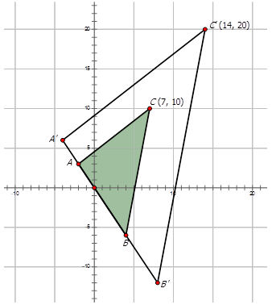
    
    \[Figure 12\]
    
2.  
    
    \[Figure 13\]
    
3.  
    
    \[Figure 14\]
    
4.  
    
    \[Figure 15\]
    
5.  
    
    \[Figure 16\]
    

Graphing an Image that Has Undergone a Dilation
-----------------------------------------------

**Concept Content**

In this second concept of lesson **Dilations of Geometric Shapes**, you will learn how to graph an image that has undergone a dilation. Remember that a dilation occurs when a preimage is increased or decreased by a scale factor that is based on the center point. In the last lesson you learned to recognize what happens to the points and images when undergoing a dilation. In this lesson you will create the images and preimages by first graphing them on a Cartesian plane. When graphing the dilation image, it is often helpful to remember that what happens to the points in the preimage depends on the scale factor.

**Guidance**

Quadrilateral $WXYZ$ has coordinates $W(-5, -5), X(-2, 0), Y(-1, 3)$ and $Z(2, 3)$. Draw the quadrilateral on the Cartesian plane. The quadrilateral has a dilation centered at the origin of scale factor $\frac{1}{3}$. Show the resulting image.

$$
\begin{align*}
& scale \ factor = \frac{dilation \ image \ length}{preimage \ length} \\
& scale \ factor = \frac{10.63}{3.54} \\
& scale \ factor = 3
\end{align*}
$$

**Examples**

**Example A**

Line $\overline{A B}$ drawn from (–4, 2) to (3, 2) has undergone a dilation about the origin to produce $A^\prime(-6, 3)$ and $B^\prime(4.5, 3)$. Draw the preimage and dilation image and determine the scale factor.

\begin{align*}
& scale \ factor = \frac{dilation \ image \ length}{preimage \ length} \\
& scale \ factor = \frac{10.5}{7.0} \\
& scale \ factor = \frac{3}{2}
\end{align*}
$$

**Example B**

The diamond $ABCD$ undergoes a dilation about the origin to form the image $A^\prime B^\prime C^\prime D^\prime$. Find the coordinates of the dilation image. Using the diagram, determine the scale factor.

")

\[Figure 20\]

$$
\begin{align*}
& scale \ factor = \frac{dilation \ image \ length}{preimage \ length}\\
& scale factor = \frac{7.21}{3.61} \\
& scale factor = 2
\end{align*}
$$

**Example C**

The diagram below undergoes a dilation about the origin to form the dilation image. Find the coordinates of $A$ and $B$ and $A^\prime$ and $B^\prime$ of the dilation image. Using the diagram, determine the scale factor.

")

\[Figure 22\]

$$
\begin{align*}
& scale factor = \frac{dilation \ image \ length}{preimage \ length}\\
& scale \ factor = \frac{2.00}{10.00} \\
& scale \ factor = \frac{1}{5}
\end{align*}
$$

**Vocabulary**

__Dilations__

**_Dilations_** in transformations involve changing the size of a preimage to create the dilation image.

__Scale Factor__

The **_scale factor_** will determine how much bigger or smaller the dilation image will be. The scale factor is sometimes called the scalar factor.

**Guided Practice**

1. Line $\overline{S T}$ drawn from (–3, 4) to (–3, 8) has undergone a dilation of scale factor 3 about the point $A (1, 6)$. Draw the preimage and image and properly label each.

2. The polygon below has undergone a dilation about the origin with a scale factor of $\frac{5}{3}$. Draw the dilation image and properly label each.

, K(-1, 4)$ and $L(1, -3)$ has undergone a dilation of scale factor $\frac{1}{2}$. about the center point $L$. Draw and label the dilation image and the preimage then check the scale factor.")

**Answers**

1. 
\begin{align*}
& scale \ factor = \frac{dilation \ image \ length}{preimage \ length} \\
& scale \ factor = \frac{12.00}{4.00} \\
& scale \ factor = 3
\end{align*}
$$

2. 
\begin{align*}
& scale factor = \frac{dilation \ image \ length}{preimage \ length} \\
& scale \ factor = \frac{5.00}{3.00} \\
& scale \ factor = \frac{5}{3}
\end{align*}
$$

3. 
\begin{align*}
& scale \ factor = \frac{dilation \ image \ length}{preimage \ length}\\
& scale \ factor = \frac{7.21}{3.61} \\
& scale \ factor = \frac{1}{2}
\end{align*}
$$

**Summary**

In this concept of Chapter **Is it a Slide, a Flip, or a Turn?**, lesson **Dilations of Geometric Shapes**, you were introduced to graphing dilations knowing the scale factor and the center point. When graphing the dilation image, it is often helpful to remember what happens to the points in the preimage depends on the scalar factor. The preimage will be increased or decreased in size because of this scale factor. The position of the dilation image depends on the center point. Remember that the shape does not change; just the size does.

**Problem Set**

1.  Draw a dilation image for the figure $MATH$ on the grid below about the origin with a scale factor of $\frac{1}{2}$. 
    
    \[Figure 27\]
    
2.  Draw a dilation image for Image A on the grid below about the origin with a scale factor of 3. 
    
    \[Figure 28\]
    
3.  Draw a dilation image for the figure below on the grid below about the point $D$ with a scale factor of $\frac{3}{2}$. 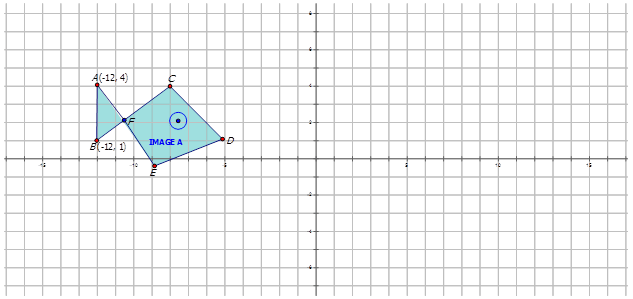
    
    \[Figure 29\]
    
4.  Draw a dilation image for the Image A on the grid below about the origin with a scale factor of 2. 
    
    \[Figure 30\]
    
5.  Draw a dilation image for the figure on the grid below about the origin with a scale factor of $\frac{2}{3}$. 
    
    \[Figure 31\]
    

For each of the following diagrams the images undergo a dilation about the origin by a scale factor of 2. On each diagram, draw and label the dilation image. Test the images to see if the scale factor is correct.

-----------------------------

**Concept Content**

In this third concept with respect to dilations, you will learn how to describe a dilation using a rule. In the first lesson you used words to describe a dilation. By examining the coordinates of the dilation image, you could describe if the preimage underwent a dilation about the origin or about a point with a specific scale factor. You might have noticed that the coordinate points for positive scale factors are also multiplied by the scale factor to produce the dilation image. Look at the diagram below:

$$
D_k(x, y)=(kx, ky)
$$

If $k$ is greater than one, the dilation image will be larger than the preimage. If $k$ is between 0 and 1, the dilation image will be smaller than the preimage. If $k$ is equal to 1, you will have a dilation image that is congruent to the preimage. The mapping rule corresponding to a dilation notation would be:

$$
(x, y) \rightarrow (kx, ky)
$$

In this concept you will write rules for dilation about the origin as well as draw graphs from such rules.

**Guidance**

The figure below shows a dilation of two trapezoids. Write the mapping rule for the dilation of Image A to Image B.

$$
\begin{align*}
& \text{Image} \ A \qquad \ B(-9, 6) \quad \qquad C(-5, 6) \quad \qquad D(-5, -1) \qquad \quad \ \ E(-10, -3) \\
& \text{Image} \ B \qquad B^\prime(-4.5, 3) \qquad C^\prime(-2.5, 3) \qquad D^\prime(-2.5, -0.5) \qquad E^\prime(-5, -1.5)
\end{align*}
$$

Notice that the coordinate points in Image B (the dilation image) are $\frac{1}{2}$ that found in Image A. Therefore the Image A undergoes a dilation about the origin of scale factor $\frac{1}{2}$. To write a mapping rule for this dilation you would write: $(x, y) \rightarrow \left(\frac{1}{2}x, \frac{1}{2}y\right)$.

**Examples**

**Example A**

The mapping rule for the dilation applied to the triangle below is $(x, y) \rightarrow (1.5x, 1.5y)$. Draw the dilation image.

$$
\begin{align*}
& \text{Image} \ A \qquad \qquad \ \ \ A(3, 5) \quad \qquad \ \ B(4, 2) \quad \qquad \ \ \ C(1, 1) \\
& \text{Dilation Image} \qquad A^\prime(4.5, 7.5) \qquad B^\prime(6, 3) \qquad C^\prime(1.5, 1.5)
\end{align*}
$$

The dilation image looks like the following:

The mapping rule for the dilation applied to the diagram below is $(x, y) \rightarrow \left(\frac{1}{3}x, \frac{1}{3}y\right)$. Draw the dilation image.

$$
\begin{align*}
& \text{Image} \ D \qquad \qquad \ \ \ D(-3, 7) \quad \qquad E(-1, 3) \quad \qquad F(-7, 5) \quad \qquad \ \ G(-5, 1) \\
& \text{Dilation Image} \qquad D^\prime(-1, 2.3) \qquad E^\prime(-0.3, 1) \qquad F^\prime(-2.3, 1.7) \qquad G^\prime(-1.7, 0.3)
\end{align*}
$$

The dilation image looks like the following:

Write the notation that represents the dilation of the preimage A to the dilation image J in the diagram below.

$C:(-7, 5) \quad C^\prime: (-1.75, 1.25)$

Notice how both the $x$\- and $y$\-coordinates are multiplied by $\frac{1}{4}$. This indicates that the preimage A undergoes a dilation about the origin by a scale factor of $\frac{1}{4}$ to form the dilation image J. Therefore the mapping notation is $(x, y) \rightarrow \left(\frac{1}{4}x, \frac{1}{4}y\right)$.

**Vocabulary**

__Notation Rule__

A **_notation rule_** has the following form $D_k(x, y)=(kx, ky)$ and tells you that the preimage has undergone a dilation about the origin by scale factor $k$. If $k$ is greater than one, the dilation image will be larger than the preimage. If $k$ is between 0 and 1, the dilation image will be smaller than the preimage. If $k$ is equal to 1, you will have a dilation image that is congruent to the preimage. The mapping rule corresponding to a dilation notation would be: $(x, y) \rightarrow (kx, ky)$

__Dilations__

**_Dilations_** in transformations involve changing the size of a preimage to create the dilation image.

**Guided Practice**

1. Thomas describes a dilation of point $JT$ with vertices $J(-2, 6)$ to $T(6, 2)$ to point $J^\prime T^\prime$ with vertices $J^\prime(-4, 12)$ and $T^\prime(12, 4)$. Write the notation to describe this dilation for Thomas.

2. Given the points $A(12, 8)$ and $B(8, 4)$ on a line undergoing a dilation to produce $A^\prime(6, 4)$ and $B^\prime(4, 2)$, write the notation that represents the dilation.

3. Janet was playing around with a drawing program on her computer. She created the following diagrams and then wanted to determine the transformations. Write the notation rule that represents the transformation of the preimage A to the image A'.

1. \rightarrow (2x, 2y)$")

2. In order to write the notation to describe the dilation, choose one point on the preimage and then the corresponding point on the dilation image to see how the point has moved. Notice that point $EA$ is:

$$
A(12, 8) \rightarrow A^\prime(6, 4)
$$

Since both $x$\- and $y$\-coordinates are multiplied by $\frac{1}{2}$, the dilation is about the origin has a scale factor of $\frac{1}{2}$. The notation for this dilation would be: $(x, y) \rightarrow \left(\frac{1}{2}x, \frac{1}{2}y \right)$.

3. In order to write the notation to describe the dilation, choose one point on the preimage A and then the corresponding point on the dilation image $A^\prime$ to see how the point has changed. Notice that point $E$ is shown in the diagram:

$$
E(-5, -3) \rightarrow E^\prime(-1, -0.6)
$$

Since both $x$\- and $y$\-coordinates are multiplied by $\frac{1}{5}$, the dilation is about the origin has a scale factor of $\frac{1}{5}$. The notation for this dilation would be: $(x, y) \rightarrow \left(\frac{1}{5}x, \frac{1}{5}y \right)$.

**Summary**

In this concept of lesson **Dilations of Geometric Shapes** you have learned to describe a dilation in notation form. Notations for dilations can allow you to quickly determine what the scale factor is for the preimage to undergo a dilation. The notation for a dilation of scale factor $k$ is $D_k(x, y)=(kx, ky)$.

| **Scale Factor, $k$** | **Size change for preimage** |
| --- | --- |
| $k>1$ | Dilation image is larger than preimage |
| $0 < k < 1$ | Dilation image is smaller than preimage |
| $k=1$ | Dilation image is the same size as the preimage |

Mapping notation for dilations follows the form $(x, y) \rightarrow (kx, ky)$ and also allows you to quickly determine the scale factor in images as the dilation image can simply be determine by multiplying the $x$\- and $y$\-coordinates by $k$.

**Problem Set**

Complete the following table:

| **Starting Point** | **Scale factor = 2** | **Scale factor = 5** | **Scale factor = $\frac{1}{2}$** | **Scale factor = $\frac{3}{4}$** |
| --- | --- | --- | --- | --- |
| 1. (1, 4) |     |     |     |     |
| 2. (4, 2) |     |     |     |     |
| 3. (2, 0) |     |     |     |     |
| 4. (–1, 2) |     |     |     |     |
| 5. (–2, –3) |     |     |     |     |

Write the notation that represents the dilation of the preimage A to the dilation image in the diagrams below.

1.  
    
    \[Figure 43\]
    
2.  
    
    \[Figure 44\]
    
3.  
    
    \[Figure 45\]
    
4.  
    
    \[Figure 46\]
    
5.  
    
    \[Figure 47\]
    

The Properties of a Dilation
----------------------------

**Concept Content**

As you learned earlier, dilations involve increasing or decreasing the size of a preimage to create a dilation image. In this last concept you will look at the properties of dilations. Dilations result when an image is multiplied by a scale factor with respect to a center point. You have seen in the examples of dilations from the previous three concepts where a dilation occurs on the preimage across the origin or from a point (called the center point) and with a specified scale factor. Therefore rotated images have the same length and angle measurements as their preimages. As well, points of the rotated image are collinear if they are collinear in the preimage. In other words, if $B$ is between $A$ and $C$, then $B^\prime$ will be between $A^\prime$ and $C^\prime$.

In summary, dilations are considered to have the following properties:

* angle measures in a figure remain the same (angles)
* same orientation (lettering remains the same)
* points that are on each line remain on the line for the dilation image (collinear)
* parallelism (parallel lines remain parallel)

**Guidance**

The triangle $ABC$ is drawn such that the vertices are at $A(1, 1), B(5, 5)$ and $C(-2, 4)$. Triangle $A^\prime B^\prime C^\prime$ is a result of multiplying the preimage by a scale factor of 2.

a) What are the coordinates of Triangle $A^\prime B^\prime C^\prime$?

b) Measure each angle either with a protractor or using geometry software. What angles are congruent?

c) Can you conclude that the triangle $A^\prime B^\prime C^\prime$ is a dilation of triangle $ABC$?

a) The coordinates of $A^\prime B^\prime C^\prime$ after a dilation of triangle $ABC$ would be:

$$
\begin{align*}
& \text{Preimage} \ ABC \qquad \qquad \quad \ \ A(1, 1) \qquad \ B(5, 5) \quad \qquad \ C(-2, 4) \\
& \text{Reflected Image} \ A^\prime B^\prime C^\prime \qquad A^\prime(2, 2) \qquad B^\prime(10, 10) \qquad C^\prime(-4, 8)
\end{align*}
$$

b) The measures of each angle are shown in the diagram.

c) Since the angle measures are the same the triangles are congruent and each coordinate point of the preimage has been multiplied by the scale factor to produce the dilation image. Therefore, you can conclude that triangle $ABC$ has undergone a dilation to produce triangle $A^\prime B^\prime C^\prime$.

**Examples**

**Example A**

Graph the following two quadrilaterals to determine if Quadrilateral A undergoes a dilation to form Quadrilateral B. Show that this graph represents a dilation. Determine the scale factor.

Quadrilateral A Vertices: $W(2, -2), X(5, 0), Y(5, 3),$ and $Z(4, 3)$.

Quadrilateral B Vertices: $W^\prime(1, -1), X^\prime(2.5, 0), Y^\prime(2.5, 1.5),$ and $Z^\prime(2, 1.5)$.

$.")

Since the angle measures are the same Quadrilateral A is congruent to Quadrilateral B. Each coordinate point on $ABCD$ is multiplied by $\frac{1}{2}$ to produce Quadrilateral B. With all of this, you can conclude that Quadrilateral B is a dilation image of the preimage Quadrilateral A. The dilation is about the origin with a scale factor of $\frac{1}{2}$.

You can also test the scale factor by looking at the side lengths and using the formula:

$$
\begin{align*}
& scale \ factor = \frac{dilation \ image \ length}{preimage \ length}\\
& scale \ factor = \frac{1.50}{3.00} \\
& scale \ factor = \frac{1}{2}
\end{align*}
$$

**Example B**

Describe how you would know if image $T$ has undergone a dilation to form image $T^\prime$.

$$
\begin{align*}
& scale \ factor = \frac{dilation \ image \ length}{preimage \ length}\\
& scale \ factor = \frac{7.66}{5.11} \\
& scale \ factor = \frac{3}{2}
\end{align*}
$$

**Example C**

Describe how you would know if image $S$ has undergone a dilation to form the blue image $S^\prime$.

$$
\begin{align*}
& scale \ factor = \frac{dilation \ image \ length}{preimage \ length} \\
& scale \ factor = \frac{10.0}{5.00} \\
& scale \ factor = 2
\end{align*}
$$

**Vocabulary**

__Congruent Angles__

**_Congruent angles_** have the same measure.

__Dilations__

**_Dilations_** in transformations involve changing the size of a preimage to create the dilation image.

**Guided Practice**

Describe how you would know if the preimage has undergone a dilation to produce the dilation image.

1. 

1. As indicated on the graph below the angle measures are all the same. The preimage is congruent to the dilation image. Each coordinate point is multiplied by 3. With all of this, you can conclude that the preimage undergoes a dilation of scale factor 3 about the origin to form the dilation image.

$$
\begin{align*}
& scale \ factor = \frac{dilation \ image \ length}{preimage \ length}\\
& scale \ factor = \frac{7.51}{2.50} \\
& scale \ factor = 3
\end{align*}
$$

2. 

$$
\begin{align*}
& scale \ factor = \frac{dilation \ image \ length}{preimage \ length}\\
& scale \ factor = \frac{6.75}{9.00} \\
& scale \ factor = \frac{3}{4}
\end{align*}
$$

3. 

$$
\begin{align*}
& scale \ factor = \frac{dilation \ image \ length}{preimage \ length} \\
& scale \ factor = \frac{10.62}{3.54} \\
& scale \ factor = 3
\end{align*}
$$

With all of this, you can conclude that the preimage A undergoes a dilation of scale factor 3 about the center point C to form the dilation image T.

**Summary**

In the previous three lessons you worked with dilations. A dilation is a transformation of a figure that involves increasing or decreasing the size of the preimage along the Cartesian plane. In this lesson you looked more closely at the properties of dilations. These properties include:

* line segments are the same length (distance)
* same orientation (lettering remains the same)
* points that are on each line remain on the line for the reflected image (collinear)
* parallelism (parallel lines remain parallel)

Through the use of geometry software, it is easy to measure both the angles to determine if they are congruent, thus satisfying the first property. If the points are moving in the same direction, you can be sure that the preimage is undergoing a dilation to form the new image.

**Problem Set**

Describe how you would know if image S undergoes a dilation to produce the second image in each of the following diagrams.

1.  
    
    \[Figure 60\]
    
2.  
    
    \[Figure 61\]
    
3.  
    
    \[Figure 62\]
    
4.  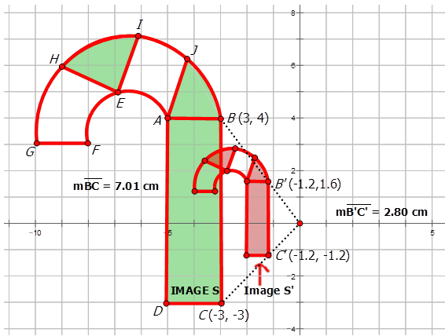
    
    \[Figure 63\]
    
5.  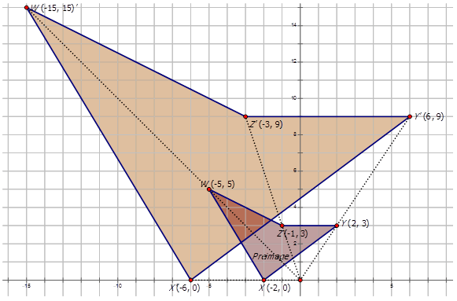
    
    \[Figure 64\]
    
6.  Triangle $ABC$ with vertices $A(3, 1), B(0, -1)$ and $C(1, 5)$ has undergone a dilation of scale factor 4 about the origin to produce triangle $A^\prime B^\prime C^\prime$. Draw the diagram representing this dilation and prove the image $A^\prime B^\prime C^\prime$ is actually a dilation image.
7.  Triangle $DEF$ with vertices $D(0, 1), E(5, 1)$ and $F(2, 5)$ has undergone a dilation of scale factor 2 about the origin to produce triangle $A^\prime B^\prime C^\prime$. Draw the diagram representing this dilation and prove the image $A^\prime B^\prime C^\prime$ is actually a dilation image.
8.  Quadrilateral $DEFG$ with vertices $D(0, 1), E(1, 5), F(2, 5)$, and $G(5, 1)$ has undergone a dilation of scale factor $\frac{1}{3}$ about the origin to produce quadrilateral $D^\prime E^\prime F^\prime G^\prime$. Draw the diagram representing this dilation and prove the image $D^\prime E^\prime F^\prime G^\prime$ is actually a dilation image.
9.  Quadrilateral $IJKL$ with vertices $I(0, 2), J(2, 3), K(3, 6)$, and $L(3, 1)$ has undergone a dilation of scale factor $\frac{2}{5}$ about the origin to produce quadrilateral $I^\prime J^\prime K^\prime L^\prime$. Draw the diagram representing this dilation and prove the image $I^\prime J^\prime K^\prime L^\prime$ is actually a dilation image.
10. Prove that the preimage triangle 1 undergoes a dilation about the origin to produce triangle 2. Determine the scale factor of triangle 1 to triangle 2 
    
    \[Figure 65\]
    

Summary
-------

In this fourth lesson of Chapter **Is it a Slide, a Flip, or a Turn?** you have been introduced to dilations. Remember that a dilation involves increasing or decreasing the size of a figure by a scale factor, $k$, about a center point. Dilations are an important concept as you notice them probably on a daily basis in everyday life. Making enlargements on photocopiers, enlargements of photo prints, changing the pixel size on your computer, or building models such as model planes or cars all involve using the properties of dilations.

You first learned to describe the dilation using words. So, you learned to look at points in a dilation image and the preimage to determine if the images involve:

* A scale factor greater than 1 and therefore you have an increase in size, or
* A scale factor between 0 and 1 and therefore you have an decrease in size.

You could also have a scale factor equal to 1 and therefore have a congruent image. In this lesson you described the type of dilation using words. Following this you learned to draw a dilation image. You could make this drawing knowing the preimage coordinates and the scale factor if the center point was the origin. It was in this lesson that you were introduced to the formula for finding the scale factor.

$$
\begin{align*}
& scale \ factor = \frac{dilation \ image \ length}{preimage \ length}
\end{align*}
$$

In the third concept, you learned to write the notation for the dilated image from the preimage. You learned to graph a dilated image and then write the notation for the image. The notation for a dilation is:

$$
D_k(x, y)=(kx, ky)
$$

with a mapping notation of:

$$
(x, y) \rightarrow (kx, ky)
$$

Finally in the last concept of this lesson, you learned that dilations have the following properties:

* angle measures in a figure remain the same (angles)
* same orientation (lettering remains the same)
* points that are on each line remain on the line for the reflected image (collinear)
* parallelism (parallel lines remain parallel)

Notice, unlike the other three transformations, dilations do not have sides that are the same length. Remember that dilations involve increasing or decreasing the size of a shape. Remember as well, that the figure itself does not change in shape. You used these tendencies to prove that one image is a dilation of another image by finding the angles of the preimage and the dilation image. You then found where the points of the preimage were multiplied by the scale factor to produce the dilation image. All of these properties proved that the one image was a dilation of the other.

</article>

### 10.5 Composite Transformations

<article>

**Objectives**

The lesson objectives for composite transformations are:

* What is a composite transformation?
* The order of a composite transformation
* The notation for a composite transformation

What Is a Composite Transformation?
-----------------------------------

**Concept Content**

Up until now you have worked with single transformations. That is you worked with problems involving translations, rotations, reflections, and dilations. In each of the problems you have worked with in the previous four lessons, there was only one transformation taking place. For example, you would have a preimage and rotate it about the origin $90^\circ$CCW.

In lesson **Composite Transformations**, you will study composite transformations. Composite transformations result when two or more transformations are combined to form a new figure from the preimage. The result is a composition of transformations. In this first concept of lesson **Composite Transformations**, you will learn to recognize and draw composite transformations.

**Guidance**

Look at the following diagram. It involves two translations. Identify the two translations of triangle $ABC$ where the vertices of $\Delta ABC$ are $A(-1, 0)$, $B(4, 0)$, and $C(2, 6)$. Pay particular attention to the notation of the vertices as the triangle moves.

**Examples**

**Example A**

Describe the transformations in the diagram below. The transformations involve a reflection and a rotation.

**Example B**

Describe the transformations in the diagram below.

**Example C**

Triangle $ABC$ where the vertices of $\Delta ABC$ are $A(-1, -3)$, $B(-4, -1)$, and $C(-6, -4)$ undergoes a composition of transformations described as:

a) a translation 10 units to the right, then

b) a reflection in the $x$\-axis.

Draw the diagram to represent this composition of transformations. What are the vertices of the triangle after both transformations are applied.

$, $B^{\prime \prime}(6, 1)$, and $C^{\prime \prime}(4, 4)$.")

**Vocabulary**

__Composite Transformations__

**_Composite transformations_** result when two or more transformations are combined to form a new figure from the preimage. The result is a composition of transformations.

**Guided Practice**

1. Describe the transformations in the diagram below. The transformations involve a rotation and a reflection.

$, $Y (-3, 6)$ and $Z (4, 5)$.The triangle undergoes a translation of 2 units to the right and 1 unit down to form triangle $X^\prime Y^\prime Z^\prime$. Triangle $X^\prime Y^\prime Z^\prime$ is then reflected about the $y$\-axis to form triangle $X^{\prime \prime} Y^{\prime \prime} Z^{\prime \prime}$. Draw the diagram of this composite transformation and determine the vertices for triangle $X^{\prime \prime} Y^{\prime \prime} Z^{\prime \prime}$.")

3. The coordinates of the vertices of $\Delta JAK$ are $J(1, 6)$, $A(2, 9)$, and $K(7, 10)$.

a) Draw and label $\Delta JAK$.

b) $\Delta JAK$ is reflected over the line $y=x$. Graph and state the coordinates of $\Delta J^\prime A^\prime K^\prime$.

c) $\Delta J^\prime A^\prime K^\prime$ is then reflected about the $x$\-axis. Graph and state the coordinates of $\Delta J^{\prime \prime} A^{\prime \prime} K^{\prime \prime}$.

d) $\Delta J^{\prime \prime} A^{\prime \prime} K^{\prime \prime}$undergoes a translation of 5 units to the left and 3 units up. Graph and state the coordinates of $\Delta J^{\prime \prime \prime} A^{\prime \prime \prime} K^{\prime \prime \prime}$.

**Answers**

1. The transformations involve a reflection and a rotation. First line $AB$ is reflected about the $x$\-axis to produce line $A^\prime B^\prime$.

2. ")

\[Figure 10\]

**Summary**

In this concept you began your study of composite transformations. Composite transformations involve two or more transformations combined to form a new figure from the preimage. In this lesson, you worked with diagrams where preimages undergo a translation, a reflection, or a rotation to the transformed image $T^\prime$ and then a second transformation is performed on image $T^\prime$ to form image $T^{\prime \prime}$. You also had a quick look at a diagram with three transformations in that image $T^{\prime \prime}$ was transformed into image $T^{\prime \prime \prime}$.

**Problem Set**

Find the measure of the transformed image given the following information:

1.  A point $X$ has coordinates (–1, –8). The point is reflected in the $y$\-axis to form $X^\prime$. $X^\prime$ is translated over 4 to the right and up 6 to form $X^{\prime \prime}$. What are the coordinates of $X^\prime$ and $X^{\prime \prime}$?
2.  A point $A$ has coordinates (2, –3). The point is translated over 3 to the left and up 5 to form $A^\prime$. $A^\prime$ is reflected in the $x$\-axis to form $A^{\prime \prime}$. What are the coordinates of $A^\prime$ and $A^{\prime \prime}$?
3.  A point $P$ has coordinates (5, –6). The point is reflected in the line $y = -x$ to form $P^\prime$. $P^\prime$ is rotated about the origin $90^\circ$CCW to form $P^{\prime \prime}$. What are the coordinates of $P^\prime$ and $P^{\prime \prime}$?
4.  Line $JT$ has coordinates $J(-2, -5)$ and $T(2, 3)$. The line is rotated about the origin $180^\circ$ to form $J^\prime T^\prime$. $J^\prime T^\prime$ is translated over 6 to the right and down 3 to form $J^{\prime \prime} T^{\prime \prime}$. What are the coordinates of $J^\prime T^\prime$ and $J^{\prime \prime} T^{\prime \prime}$?
5.  Line $SK$ has coordinates $S(-1, -8)$ and $K(1, 2)$. The line is translated over 4 to the right and up 4 to form $S^\prime K^\prime$. $S^\prime K^\prime$ is rotated about the origin $90^\circ$CCW to form $S^{\prime \prime} K^{\prime \prime}$. What are the coordinates of $S^\prime K^\prime$ and $S^{\prime \prime} K^{\prime \prime}$?

Describe the following composite transformations:

6.  
    
    \[Figure 11\]
    
7.  
    
    \[Figure 12\]
    
8.  
    
    \[Figure 13\]
    
9.  
    
    \[Figure 14\]
    
10. 
    
    \[Figure 15\]
    

The Order of a Composite Transformation
---------------------------------------

**Concept Content**

In this second concept of lesson **Composite Transformations**, you will learn about the order of a composite transformation. The order is very important. Imagine if you rotate, then dilate, and then translate a rectangle of vertices $A(1, 1), B(1, 3), C(5, 3)$, and $D(5, 1)$. You would end up with a diagram similar to that found below:

**Guidance**

Quadrilateral $WXYZ$ has coordinates $W(-5, -5), Z(-2, 0), Y(2, 3)$ and $X(-1, 3)$. Draw the quadrilateral on the Cartesian plane. The quadrilateral has a dilation centered at the origin of scale factor $\frac{1}{3}$ and is then translated 4 units to the right and 5 units down. Show the resulting image.

**Example A**

Line $\overline{AB}$ drawn from (–4, 2) to (3, 2) has undergone a reflection in the $x$\-axis. It then undergoes a translation up one unit and over 3 units to the right to produce $A^{\prime \prime} B^{\prime \prime}$. Draw a diagram to represent this composite transformation and indicate the vertices for each transformation.

For the composite transformation in Example A, suppose the preimage $AB$ undergoes a translation up one unit and over 3 units to the right and then undergoes a reflection in the $x$\-axis. Does the order matter?

. Therefore order does matter.")

**Example C**

Triangle $BCD$ is rotated $90^\circ$CCW about the origin. The resulting figure is then translated over 3 to the right and down 7. Does order matter?

Order: Rotation then Translation

**Vocabulary**

__Composite Transformations__

**_Composite transformations_** result when two or more transformations are combined to form a new figure from the preimage. The result is a composition of transformations.

**Guided Practice**

1. Line $\overline{ST}$ drawn from (–3, 4) to (–4, 8) has undergone a rotation about the origin at $90^\circ$CW and then a reflection in the $x$\-axis. Draw a diagram with labeled vertices to represent this composite transformation.

2. Line $\overline{ST}$ drawn from (–3, 4) to (–3, 8) has undergone a reflection in the $x$\-axis and then a rotation about the origin at $90^\circ$CW. Draw a diagram with labeled vertices to represent this composite transformation. Is the graph the same as the diagram in #1?

3. The triangle with vertices $J(-5, -2), K (-1, 4)$ and $L (1, -3)$ has undergone a transformation of up 4 and over to the right 4 and then a reflection in the $x$\-axis. Draw and label the composite transformation. Does order matter?

**Answers**

1. ")

\[Figure 24\]

If you compare the graph above to that found in Question 1, you see that the final transformation image $S^{\prime \prime}T^{\prime \prime}$ has different coordinates than the image $S^{\prime \prime}T^{\prime \prime}$ in question 2. Therefore order does matter.

3. 

In this problem, order did matter. The final image after the composite transformation changed when the order changed.

**Summary**

In this concept of Chapter **Is it a Slide, a Flip, or a Turn?**, lesson **Composite Transformations**, you learned that in the majority of cases, the order in which you complete composite transformations is important. Composite transformations occur in any combination of reflections, translations, and rotations. When graphing the composite image, it is necessary for you to perform the transformations in the order they are written.

**Problem Set**

1.  Draw the composite image for the figure $MATH$ on the grid below that undergoes a reflection in the $y$\-axis and then a reflection in the $x$\-axis. 
    
    \[Figure 27\]
    
2.  Draw a composite image for Image A on the grid below that has undergone a reflection in the $y$\-axis and then a transformation of 3 units down and 4 units to the left. 
    
    \[Figure 28\]
    
3.  Draw a composite image for the figure below on the grid below that undergoes a translation of 5 units to the right and 3 units up. Then this image is rotated across the origin $90^\circ$CW. 
    
    \[Figure 29\]
    
4.  Draw a composite image for the Image A on the grid below that undergoes a rotation of $180^\circ$ about the point $B$ and then a translation of 3 units to the left and 3 units up. 
    
    \[Figure 30\]
    
5.  Draw a composite image for the figure on the grid below that undergoes a reflection in the line $y = -x$ and then a rotation about the origin at $270^\circ$CW. 
    
    \[Figure 31\]
    

For each of the following diagrams the images undergo a reflecting in the $y$\-axis, then a rotation of $90^\circ$CW and finally a translation of 4 units right and 7 units up. Draw and label the composite images.

-------------------------------------------

**Concept Content**

As you have learned in the previous two concepts, a composite transformation depends on order. In this last concept, you will learn how to describe a composite transformation using a rule. Notation for composite transformations combines the transformations using the symbol $\circ$.

In Lesson **Translations of Geometric Shapes**, you learned that the notation for translations used the symbol $T$. Therefore a translation with notation $T_{3, 5}(x, y) = (x + 3, y + 5)$ or a translation of 3 units to the right and 5 units up. In Lesson **Reflections of Geometric Shapes**, you learned that the notation for reflections could be in the form $P(x,y) \rightarrow P^{\prime}(-x, y)$ or $r_{y-axis}(x,y) \rightarrow (-x,y)$ with the most common notation of $r_{y-axis}(x,y) \rightarrow (-x,y)$. In lesson **Rotations of Geometric Shapes**, you learned that the notation for rotations uses the form $R_{90^\circ}(x,y)=(-y,x), R_{180^\circ}(x,y)=(-x,-y),$ or $R_{270^\circ}(x,y)=(y,-x)$ depending on the rotation angle with respect to the center point, the origin.

In this final concept of lesson **Composite Transformations**, you will learn to combine these notations using the symbol $\circ$ in order to write the notation for the composite transformations.

**Guidance**

The figure below shows a composite transformation of a trapezoid. Write the mapping rule for the composite transformation.

$$
r_{y-axis}\ \circ \ R_{270^\circ}
$$

**Example A**

Graph the line $XY$ given that $X(2, -2)$ and $Y(3, -4)$. Also graph the composite image that satisfies the following rule

$$
R_{90^\circ} \ \circ \ r_{y-axis}
$$

The first translation is a $90^{\circ}$CCW turn about the origin to produce $X^{\prime}Y^{\prime}$. The second translation is a reflection about the $y$\-axis to produce $X^{\prime \prime}Y^{\prime \prime}$. State the coordinates of $X^{\prime \prime}Y^{\prime \prime}$.

Image A with vertices $A(3, 5), B(4, 2)$ and $C(1, 1)$ undergoes a composite transformation with mapping rule $r_{y-axis} \ \circ \ r_{x-axis}$. Draw the preimage and the composite image and show the vertices of the composite image.

Image D with vertices $D(-3, 7), E(-1, 3), F(-7, 5)$ and $G(-5, 1)$ undergoes a composite transformation with mapping rule $r_{x-axis} \ \circ \ T_{3,4}$. Draw the preimage and the composite image and show the vertices of the composite image.

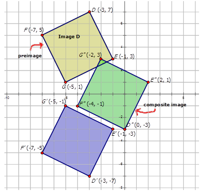

__Composite Transformations__

**_Composite transformations_** result when two or more transformations are combined to form a new figure from the preimage. The result is a composition of transformations.

**Guided Practice**

1. Graph the line $XY$ given that $X(2, -2)$ and $Y(3, -4)$. Also graph the composite image that satisfies the following rule

$$
r_{y-axis} \ \circ \ R_{90^\circ}
$$

The first translation is a reflection about the $y$\-axis to produce $X^{\prime}Y^{\prime}$. The second translation is a $90^\circ$CCW turn about the origin to produce $X^{\prime \prime}Y^{\prime \prime}$. State the coordinates of $X^{\prime \prime}Y^{\prime \prime}$.

2. Describe the composite transformations in the diagram below and write the notation to represent the transformation of figure $ABCD$ to $A^{\prime \prime}B^{\prime \prime}C^{\prime \prime}D^{\prime \prime}$.

1.  rotation about the point (2, 0) to produce the figure $A^{\prime \prime}B^{\prime \prime}C^{\prime \prime}D^{\prime \prime}$. Notation for this composite transformation is:")

$$
r_{x=2} \ \circ \ R_{270^{\circ}}
$$

3. There are two transformations shown in the diagram. The first transformation is a translation of 1 unit to the left and 5 units down to produce $A^{\prime}B^{\prime}C^{\prime}$. The second reflection in the $y$\-axis to produce the figure $A^{\prime \prime}B^{\prime \prime}C^{\prime \prime}$. Notation for this composite transformation is:

$$
T_{-1,-5} \ \circ \ r_{y-axis}
$$

**Summary**

In this last concept of lesson **Composite Transformations** you have learned to describe composite transformations in notation form. Notations can allow you to quickly determine what is happening to the preimage to form the final composite image. The notations for composite transformations combine the notations for reflections, rotations, and translations using the symbol $\circ$. Remember to work left to right as you complete the transformations. For example a notation of $T_{3,-4} \ \circ \ R_{90^{\circ}}$ represents a translation of 3 units to the right and 4 units down then a rotation about the origin of $90^{\circ}$CCW. Always remember that order is important.

**Problem Set**

Complete the following table:

| **Starting Point** | $T_{3,-4} \ \circ \ R_{90^{\circ}}$ | $r_{x-axis} \ \circ \ r_{y-axis}$ | $T_{1,6} \ \circ \ r_{x-axis}$ | $r_{y-axis} \ \circ \ R_{180^{\circ}}$ |
| --- | --- | --- | --- | --- |
| 1. (1, 4) |     |     |     |     |
| 2. (4, 2) |     |     |     |     |
| 3. (2, 0) |     |     |     |     |
| 4. (–1, 2) |     |     |     |     |
| 5. (–2, –3) |     |     |     |     |

Write the notation that represents the composite transformation of the preimage A to the composite images in the diagrams below.

1.  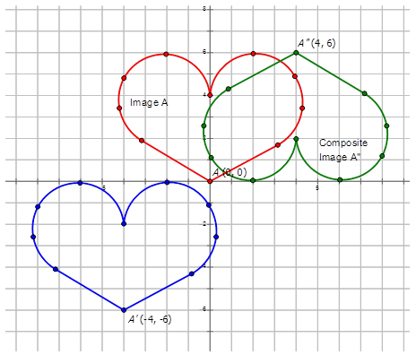
    
    \[Figure 40\]
    
2.  
    
    \[Figure 41\]
    
3.  
    
    \[Figure 42\]
    
4.  
    
    \[Figure 43\]
    
5.  
    
    \[Figure 44\]
    

Summary
-------

In this fifth lesson of Chapter **Is it a Slide, a Flip, or a Turn?** you have been introduced to composite transformations. Composite transformations result when two or more transformations are combined to form a new figure from the preimage. The result is a composition of transformations. Composite transformations involve the combination of reflections, rotations and translations of a point, a line, or a figure. In the first concept, you learned how to draw and recognize composite transformations. In concept **Reflections of Geometric Shapes** you learned that order is important. If you were asked to draw a figure, translate it and then rotate it, this is not the same as taking the same figure and rotating it then translating it. The key is to work left to right.

In the last concept of lesson **Composite Transformations**, you learned to determine the notation for a composite transformation or to draw a figure from a composite transformation. Remember the notation uses the symbol $\circ$ to indicate the composite transformation. For example a notation of $T_{-3,5} \ \circ \ r_{y-axis}$ represents a translation of 3 units to the left and 5 units up then a reflection in the $y$\-axis. You need to remember that order is important.

</article>

### 10.6 Formulas for Justifying Translations

<article>

**Objectives**

The lesson objectives for justifying translations are the following formulas:

* Mid-Point Formula
* Distance Formula
* Slope Formula

Mid-Point Formula
-----------------

**Concept Content**

In the first lessons on transformations, you learned about translations, reflections, rotations, and dilations. The last concept in each of these lessons talked about the properties of the transformation type. One additional property is common to all of these transformations and that is mid-point. The mid-point is the average of the two endpoints in a segment. Mid-point has the symbol $M$ and the formula:

$$
M= \left( \frac{x_2+x_1}{2}, \frac{y_2+y_1}{2} \right)
$$

Midpoints can be used in proving figures are reflections, for example. Look at the equilateral triangle in the diagram below.

If you were to draw the lines of symmetry in the triangle above, you would draw a line from each vertex to the midpoint on the opposite side.

**Guidance**

Find the midpoints for the digram below in order to draw the lines of reflection (or the lines of symmetry).

\begin{align*}
M_{AB}&= \left( \frac{x_2+x_1}{2}, \frac{y_2+y_1}{2} \right) && M_{AD}= \left( \frac{x_2+x_1}{2}, \frac{y_2+y_1}{2} \right) \\
M_{AB}&= \left( \frac{10+10}{2}, \frac{1+5}{2} \right) && M_{AD}= \left( \frac{10+1}{2}, \frac{5+5}{2} \right) \\
M_{AB}&= \left( \frac{20}{2}, \frac{6}{2} \right) && M_{AD}= \left( \frac{11}{2}, \frac{10}{2} \right) \\
M_{AB}&=(10,3) && M_{AD}=(5.5,5)
\end{align*}
$$

$$
\begin{align*}
M_{BC}&= \left( \frac{x_2+x_1}{2}, \frac{y_2+y_1}{2} \right) && M_{CD}= \left( \frac{x_2+x_1}{2}, \frac{y_2+y_1}{2} \right) \\
M_{BC}&= \left( \frac{10+1}{2}, \frac{1+1}{2} \right) && M_{CD}= \left( \frac{1+1}{2}, \frac{1+5}{2} \right) \\
M_{BC}&= \left( \frac{11}{2}, \frac{2}{2} \right) && M_{CD}= \left( \frac{2}{2}, \frac{6}{2} \right) \\
M_{BC}&=(5.5,1) && M_{CD}=(1,3)
\end{align*}
$$

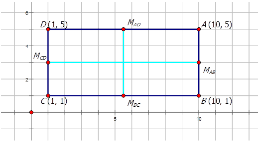

**Example A**

In the diagram below, $C$ is the midpoint between $A(-9, -1)$ and $B(-3, 7)$. Find the coordinates of $C$.

\begin{align*}
M_{AB}&= \left( \frac{x_2+x_1}{2}, \frac{y_2+y_1}{2} \right) \\
M_{AB}&= \left( \frac{-9+-3}{2}, \frac{-1+7}{2} \right) \\
M_{AB}&= \left( \frac{-12}{2}, \frac{6}{2} \right) \\
M_{AB}&=(-6,3)
\end{align*}
$$

**Example B**

Find the coordinates of point $T$ on the line $ST$ knowing that $S$ has coordinates (–3, 8) and the midpoint is (12, 1).

Look at the midpoint formula.

$$
M= \left( \frac{x_2+x_1}{2}, \frac{y_2+y_1}{2} \right)
$$

For this problem, if you let point $T$ have the coordinates $x_1$ and $y_1$, then you need to find $x_1$ and $y_1$ using the midpoint formula.

$$
\begin{align*}
M_{ST}&= \left( \frac{x_2+x_1}{2}, \frac{y_2+y_1}{2} \right) \\
(12,1)&= \left( \frac{-3+x_1}{2}, \frac{8+y_1}{2} \right)
\end{align*}
$$

Next you need to separate the $x$\-coordinate formula and the $y$\-coordinate formula to solve for your unknowns.

$$
12= \frac{-3+x_1}{2} \quad 1= \frac{8+y_1}{2}
$$

Now multiply each of the equations by 2 in order to get rid of the fraction.

$$
24=-3+x_1 \quad 2=8+y_1
$$

Now you can solve for $x_1$ and $y_1$.

$$
27=x_1 \quad -6=y_1
$$

Therefore the point $T$ in the line $ST$ has coordinates (27, –6).

**Example C**

Find the midpoints for the digram below in order to draw the lines of reflection (or the lines of symmetry).

\begin{align*}
M_{IL}&= \left( \frac{x_2+x_1}{2}, \frac{y_2+y_1}{2} \right) && M_{IJ}= \left( \frac{x_2+x_1}{2}, \frac{y_2+y_1}{2} \right) \\
M_{IL}&= \left( \frac{2+-1}{2}, \frac{-2+1}{2} \right) && M_{IJ}= \left( \frac{2+5}{2}, \frac{-2+1}{2}\right) \\
M_{IL}&= \left( \frac{1}{2}, \frac{-1}{2} \right) && M_{IJ}= \left( \frac{7}{2}, \frac{-1}{2}\right) \\
& && M_{IJ}=(3.5,-0.5)
\end{align*}
$$

$$
\begin{align*}
M_{JK}&= \left( \frac{x_2+x_1}{2}, \frac{y_2+y_1}{2} \right) \\
M_{JK}&= \left( \frac{5+2}{2}, \frac{4+1}{2} \right) \\
M_{JK}&= \left( \frac{7}{2}, \frac{5}{2} \right) \\
M_{JK}&=(3.5,2.5)
\end{align*}
$$

$$
\begin{align*}
M_{KL}&= \left( \frac{x_2+x_1}{2}, \frac{y_2+y_1}{2} \right) \\
M_{KL}&= \left( \frac{2+-1}{2}, \frac{1+4}{2} \right) \\
M_{KL}&= \left( \frac{1}{2}, \frac{5}{2} \right) \\
M_{KL}&=(0.5,2.5)
\end{align*}
$$

__Line of Symmetry__

The **_line of symmetry_** (or the line of reflection or the mirror line) is the line drawn so that each of the halves that result from drawing the line is congruent or is the same size and shape.

__Mid-Point__

The **_mid-point_** is the average of the two endpoints in a segment. Mid-point has the symbol $M$ and the formula:

$M= \left( \frac{x_2+x_1}{2}, \frac{y_2+y_1}{2} \right)$

**Guided Practice**

1. In the diagram below, $Z$ is the midpoint between $X (-5, 6)$ and $Y (3, -4)$. Find the coordinates of $Z$.

 and the midpoint is (10, 1).")

3. A diameter is drawn in the circle as shown in the diagram below. What are the coordinates for the center of the circle, $O$?

1. 

$$
\begin{align*}
M_{XY}&= \left( \frac{x_2+x_1}{2}, \frac{y_2+y_1}{2} \right) \\
M_{XY}&= \left( \frac{-5+3}{2}, \frac{-4+6}{2} \right) \\
M_{XY}&= \left( \frac{-2}{2}, \frac{2}{2} \right) \\
M_{XY}&=(-1,1)
\end{align*}
$$

2. Let point $K$ have the coordinates $x_1$ and $y_1$, then find $x_1$ and $y_1$ using the midpoint formula.

$$
\begin{align*}
M_{JK}&= \left( \frac{x_2+x_1}{2}, \frac{y_2+y_1}{2} \right) \\
(10,1)&= \left( \frac{-2+x_1}{2}, \frac{5+y_1}{2} \right)
\end{align*}
$$

Next you need to separate the $x$\-coordinate formula and the $y$\-coordinate formula to solve for your unknowns.

$$
10= \frac{-2+x_1}{2} \quad 1= \frac{5+y_1}{2}
$$

Now multiply each of the equations by 2 in order to get rid of the fraction.

$$
20=-2+x_1 \quad 2=5+y_1
$$

Now you can solve for $x_1$ and $y_1$.

$$
22=x_1 \quad -3=y_1
$$

Therefore the point $K$ in the line $JK$ has coordinates (22, –3).

3. 

$$
\begin{align*}
M_{AB}&= \left( \frac{x_2+x_1}{2}, \frac{y_2+y_1}{2} \right) \\
M_{AB}&= \left( \frac{1+-4}{2}, \frac{2+7}{2} \right) \\
M_{AB}&= \left( \frac{-3}{2}, \frac{9}{2} \right) \\
M_{AB}&=(-1.5,4.5)
\end{align*}
$$

**Summary**

In this concept you looked at the mid-point formula. The mid-point formula has the symbol $M$ and the formula:

$M= \left( \frac{x_2+x_1}{2}, \frac{y_2+y_1}{2} \right)$

Mid-point is a property of all transformations. It is particularly useful in determining the lines of symmetry or the lines of reflection in figures.

**Problem Set**

Find the mid-point for each line below given the endpoints:

1.  Line $AB$ given $A(5, 7)$ and $B(3, 9)$.
2.  Line $BC$ given $B(3, 8)$ and $C(5, 2)$.
3.  Line $CD$ given $C(4, 6)$ and $D(3, 5)$.
4.  Line $DE$ given $D(9, 11)$ and $E(2, 2)$.
5.  Line $EF$ given $E(1, 1)$ and $F(8, 7)$.

For the following lines, one endpoint is given and then the mid-point. Find the other endpoint.

1.  Line $AB$ given $A(-3, 5)$ and $M_{AB}(7, 7)$.
2.  Line $BC$ given $B(2, 4)$ and $M_{BC}(4, 9)$.
3.  Line $CD$ given $C(-2, 6)$ and $M_{CD}(1, 1)$.
4.  Line $DE$ given $D(2, 9)$ and $M_{DE}(8, 2)$.
5.  Line $EF$ given $E(-6, -5)$ and $M_{EF}(-2, 6)$.

For each of the diagrams below, find the midpoints.

1.  
    
    \[Figure 12\]
    
2.  
    
    \[Figure 13\]
    
3.  
    
    \[Figure 14\]
    
4.  
    
    \[Figure 15\]
    

Distance Formula
----------------

**Concept Content**

In this second concept of lesson **Formulas for Justifying Translations**, you will learn how the distance formula is used in transformations. All of the transformations except dilations have the common property of side lengths being the same. Dynamic geometry software can calculate the distance formula but you can calculate it as well. In order to calculate the distance of side lengths, you use the distance formula. The distance formula has the symbol $d$ and is calculated using the formula:

$$
d= \sqrt{ \left(x_2-x_1 \right)^2+ \left(y_2-y_1 \right)^2}
$$

**Guidance**

Triangle $ABC$ has vertices $A(-5, 7), B(-8, 6)$ and $C(-3, 3)$. The triangle is reflected about the $y$\-axis to form triangle $A^\prime B^\prime C^\prime$. Assuming that $\angle A= \angle A^\prime, \angle B= \angle B^\prime$,_and_ $\angle C= \angle C^\prime$ prove the two triangles are congruent.

$$
\begin{align*}
d_{AB}&= \sqrt{\left(x_2-x_1 \right)^2+ \left(y_2-y_1 \right)^2} && d_{A^\prime B^\prime}= \sqrt{\left(x_2-x_1 \right)^2+ \left(y_2-y_1 \right)^2} \\
d_{AB}&= \sqrt{\left(-5- \left(-8 \right) \right)^2+ \left(7-6 \right)^2} && d_{A^\prime B^\prime}= \sqrt{ \left(5-8 \right)^2+ \left(7-6 \right)^2} \\
d_{AB}&= \sqrt{\left(3 \right)^2+ \left(1 \right)^2} && d_{A^\prime B^\prime}= \sqrt{ \left(-3 \right)^2+ \left(1 \right)^2} \\
d_{AB}&= \sqrt{9+1} && d_{A^\prime B^\prime}= \sqrt{9+1} \\
d_{AB}&= \sqrt{10} && d_{A^\prime B^\prime}= \sqrt{10} \\
d_{AB}&=3.16 \ cm && d_{A^\prime B^\prime}=3.16 \ cm
\end{align*}
$$

$$
\begin{align*}
d_{AC}&= \sqrt{\left(x_2-x_1 \right)^2+ \left(y_2-y_1 \right)^2} && d_{A^\prime C^\prime}= \sqrt{ \left(x_2-x_1 \right)^2+ \left(y_2-y_1\right)^2} \\
d_{AC}&= \sqrt{\left(-5- \left(-3 \right) \right)^2+ \left(7-3 \right)^2} && d_{A^\prime C^\prime}= \sqrt{\left(5-3 \right)^2+ \left(7-3 \right)^2} \\
d_{AC}&= \sqrt{\left(-2 \right)^2+ \left(4 \right)^2} && d_{A^\prime C^\prime}= \sqrt{\left(2 \right)^2+ \left(4 \right)^2} \\
d_{AC}&= \sqrt{4+16} && d_{A^\prime C^\prime}= \sqrt{4+16} \\
d_{AC}&= \sqrt{20} && d_{A^\prime C^\prime}= \sqrt{20} \\
d_{AC}&=4.47 \ cm && d_{A^\prime C^\prime}=4.72 \ cm
\end{align*}
$$

$$
\begin{align*}
d_{BC}&= \sqrt{\left(x_2-x_1\right)^2+ \left(y_2-y_1\right)^2} && d_{A^\prime C^\prime}= \sqrt{ \left(x_2-x_1\right)^2+ \left(y_2-y_1\right)^2} \\
d_{BC}&= \sqrt{\left(-8- \left(-3\right)\right)^2+ \left(6-3\right)^2} && d_{A^\prime C^\prime}= \sqrt{\left(8-3\right)^2+ \left(6-3\right)^2} \\
d_{BC}&= \sqrt{\left(-5\right)^2+ \left(3\right)^2} && d_{A^\prime C^\prime}= \sqrt{\left(5\right)^2+ \left(3\right)^2} \\
d_{BC}&= \sqrt{25+9} && d_{A^\prime C^\prime}= \sqrt{25+9} \\
d_{BC}&= \sqrt{34} && d_{A^\prime C^\prime}= \sqrt{34} \\
d_{BC}&=5.83 \ cm && d_{A^\prime C^\prime}=5.83 \ cm
\end{align*}
$$

It is given that $\angle A= \angle A^\prime, \angle B= \angle B^\prime,$ _and_ $\angle C= \angle C^\prime$, and the distance formula proved that $m \overline{AB}=m \overline{A^\prime B^\prime},m \overline{AC}=m \overline{A^\prime C^\prime},$ _and_ $m \overline{BC}=m \overline{B^\prime C^\prime}$. Therefore the two triangles are congruent.

**Examples**

**Example A**

Line $AB$ is translated 5 units to the right and 6 units down to produce line $A^\prime B^\prime$. The diagram below shows the endpoints of lines $AB$ and $A^\prime B^\prime$. Prove the two lines are congruent.

\begin{align*}
d_{AB}&= \sqrt{\left(x_2-x_1\right)^2+ \left(y_2-y_1\right)^2} && d_{A^\prime B^\prime}= \sqrt{\left(x_2-x_1\right)^2+ \left(y_2-y_1\right)^2} \\
d_{AB}&= \sqrt{\left(-4-3\right)^2+ \left(2-2\right)^2} && d_{A^\prime B^\prime}= \sqrt{\left(1-8\right)^2+ \left(-4- \left(-4\right)\right)^2} \\
d_{AB}&= \sqrt{\left(-7\right)^2+ \left(0\right)^2} && d_{A^\prime B^\prime}= \sqrt{ \left(-7\right)^2+ \left(0\right)^2} \\
d_{AB}&= \sqrt{49+0} && d_{A^\prime B^\prime}= \sqrt{49+0} \\
d_{AB}&= \sqrt{49} && d_{A^\prime B^\prime}= \sqrt{49} \\
d_{AB}&=7 \ cm && d_{A^\prime B^\prime}=7 \ cm
\end{align*}
$$

**Example B**

Line $AB$ has been rotated about the origin $90^\circ$CCW to produce $A^\prime B^\prime$. The diagram below shows the lines $AB$ and $A^\prime B^\prime$. Prove the two lines are congruent.

\begin{align*}
d_{AB}&= \sqrt{\left(x_2-x_1\right)^2+ \left(y_2-y_1\right)^2} && d_{A^\prime B^\prime}= \sqrt{\left(x_2-x_1\right)^2+ \left(y_2-y_1\right)^2} \\
d_{AB}&= \sqrt{\left(-4-3\right)^2+ \left(2-2\right)^2} && d_{A^\prime B^\prime}= \sqrt{\left(-2- \left(-2\right)\right)^2+ \left(-4-3\right)^2} \\
d_{AB}&= \sqrt{\left(-7\right)^2+ \left(0\right)^2} && d_{A^\prime B^\prime}= \sqrt{ \left(0\right)^2+ \left(-7\right)^2} \\
d_{AB}&= \sqrt{49+0} && d_{A^\prime B^\prime}= \sqrt{0+49} \\
d_{AB}&= \sqrt{49} && d_{A^\prime B^\prime}= \sqrt{49} \\
d_{AB}&=7 \ cm && d_{A^\prime B^\prime}=7 \ cm
\end{align*}
$$

**Example C**

The diamond $ABCD$ has been reflected about the line $y = x$ to produce $A^\prime B^\prime C^\prime D^\prime$ as shown in the diagram below. Prove the two are congruent.

$$
\begin{align*}
d_{AB}&= \sqrt{\left(x_2-x_1\right)^2+ \left(y_2-y_1\right)^2} && d_{A^\prime B^\prime}= \sqrt{\left(x_2-x_1\right)^2+ \left(y_2-y_1\right)^2} \\
d_{AB}&= \sqrt{\left(-6.1- \left(-3\right)\right)^2+ \left(9.3-4.9\right)^2} && d_{A^\prime B^\prime}= \sqrt{\left(9.3- 4.9\right)^2+ \left(-6.1- \left(-3\right)\right)^2} \\
d_{AB}&= \sqrt{\left(-3.1\right)^2+ \left(4.4\right)^2} && d_{A^\prime B^\prime}= \sqrt{\left(4.4\right)^2+ \left(-3.1\right)^2} \\
d_{AB}&= \sqrt{9.61+19.36} && d_{A^\prime B^\prime}= \sqrt{19.36+9.61} \\
d_{AB}&= \sqrt{28.97} && d_{A^\prime B^\prime}= \sqrt{28.97} \\
d_{AB}&=5.38 \ cm && d_{A^\prime B^\prime}=5.38 \ cm
\end{align*}
$$

$$
\begin{align*}
d_{AD}&= \sqrt{\left(x_2-x_1\right)^2+ \left(y_2-y_1\right)^2} && d_{A^\prime D^\prime}= \sqrt{\left(x_2-x_1\right)^2+ \left(y_2-y_1\right)^2} \\
d_{AD}&= \sqrt{\left(-6.1- \left(-10.5\right)\right)^2+ \left(9.3-6.2\right)^2} && d_{A^\prime D^\prime}= \sqrt{\left(9.3- 6.2\right)^2+ \left(-6.1- \left(-10.5\right)\right)^2} \\
d_{AD}&= \sqrt{\left(4.4\right)^2+ \left(3.1\right)^2} && d_{A^\prime D^\prime}= \sqrt{\left(3.1\right)^2+ \left(4.4\right)^2} \\
d_{AD}&= \sqrt{19.36+9.61} && d_{A^\prime D^\prime}= \sqrt{9.61+19.36} \\
d_{AD}&= \sqrt{28.97} && d_{A^\prime D^\prime}= \sqrt{28.97} \\
d_{AD}&=5.38 \ cm && d_{A^\prime D^\prime}=5.38 \ cm
\end{align*}
$$

$$
\begin{align*}
d_{BC}&= \sqrt{\left(x_2-x_1\right)^2+ \left(y_2-y_1\right)^2} && d_{B^\prime C^\prime}= \sqrt{\left(x_2-x_1\right)^2+ \left(y_2-y_1\right)^2} \\
d_{BC}&= \sqrt{\left(-3- \left(-7.4\right)\right)^2+ \left(4.9-1.8\right)^2} && d_{B^\prime C^\prime}= \sqrt{\left(4.9- 1.8\right)^2+ \left(-3- \left(-7.4\right)\right)^2} \\
d_{BC}&= \sqrt{\left(4.4\right)^2+ \left(3.1\right)^2} && d_{B^\prime C^\prime}= \sqrt{\left(3.1\right)^2+ \left(4.4\right)^2} \\
d_{BC}&= \sqrt{19.36+9.61} && d_{B^\prime C^\prime}= \sqrt{9.61+19.36} \\
d_{BC}&= \sqrt{28.97} && d_{B^\prime C^\prime}= \sqrt{28.97} \\
d_{BC}&=5.38 \ cm && d_{B^\prime C^\prime}=5.38 \ cm
\end{align*}
$$

$$
\begin{align*}
d_{CD}&= \sqrt{\left(x_2-x_1\right)^2+ \left(y_2-y_1\right)^2} && d_{C^\prime D^\prime}= \sqrt{\left(x_2-x_1\right)^2+ \left(y_2-y_1\right)^2} \\
d_{CD}&= \sqrt{\left(-7.4- \left(-10.5\right)\right)^2+ \left(1.8-6.2\right)^2} && d_{C^\prime D^\prime}= \sqrt{\left(1.8- 6.2\right)^2+ \left(-7.4- \left(-10.5\right)\right)^2} \\
d_{CD}&= \sqrt{\left(3.1\right)^2+ \left(4.4\right)^2} && d_{C^\prime D^\prime}= \sqrt{\left(-4.4\right)^2+ \left(3.1\right)^2} \\
d_{CD}&= \sqrt{9.61+19.36} && d_{C^\prime D^\prime}= \sqrt{19.36+9.61} \\
d_{CD}&= \sqrt{28.97} && d_{C^\prime D^\prime}= \sqrt{28.97} \\
d_{CD}&=5.38 \ cm && d_{C^\prime D^\prime}=5.38 \ cm
\end{align*}
$$

Since all of the side measures are the same and $m \overline{AB}=m \overline{A^\prime B^\prime},m \overline{AD}=m \overline{A^\prime D^\prime},m \overline{BC}=m \overline{B^\prime C^\prime},$ _and_ $m \overline{CD}=m \overline{C^\prime D^\prime}$, the two diamonds are congruent figures.

**Vocabulary**

__Distance Formula__

The **_distance formula_** has the symbol $d$ and is calculated using the formula $d= \sqrt{\left(x_2-x_1\right)^2+ \left(y_2-y_1\right)^2}$

**Guided Practice**

1. Line $\overline{ST}$ drawn from $S(-3, 4)$ to $T(-4, 8)$ has undergone a reflection in the $y$\-axis to produce Line $S^\prime T^\prime$ drawn from $S^\prime (3, 4)$ to $T^\prime (4, 8)$. Draw the preimage and image and prove the two lines are congruent.

2. The triangle below has undergone a rotation of $90^\circ$CW about the origin. Given that all of the angles are equal, draw the translated image and prove the two figures are congruent.

1. 
\begin{align*}
d_{ST}&= \sqrt{\left(x_2-x_1\right)^2+ \left(y_2-y_1\right)^2} && d_{S^\prime T^\prime}= \sqrt{\left(x_2-x_1\right)^2+ \left(y_2-y_1\right)^2} \\
d_{ST}&= \sqrt{\left(-3- \left(-4\right)\right)^2+ \left(4-8\right)^2} && d_{S^\prime T^\prime}= \sqrt{\left(3-4\right)^2+ \left(4-8\right)^2} \\
d_{ST}&= \sqrt{\left(1\right)^2+ \left(-4\right)^2} && d_{S^\prime T^\prime}= \sqrt{\left(-1\right)^2+ \left(-4\right)^2} \\
d_{ST}&= \sqrt{1+16} && d_{S^\prime T^\prime}= \sqrt{1+16} \\
d_{ST}&= \sqrt{17} && d_{S^\prime T^\prime}= \sqrt{17} \\
d_{ST}&=4.12 \ cm && d_{S^\prime T^\prime}=4.12 \ cm
\end{align*}
$$

2. 
\begin{align*}
d_{AB}&= \sqrt{\left(x_2-x_1 \right)^2+ \left(y_2-y_1 \right)^2} && d_{A^\prime B^\prime}= \sqrt{\left(x_2-x_1 \right)^2+ \left(y_2-y_1 \right)^2} \\
d_{AB}&= \sqrt{\left(2-7 \right)^2+ \left(2-3 \right)^2} && d_{A^\prime B^\prime}= \sqrt{\left(2-3 \right)^2+ \left(-2- \left(-7 \right)\right)^2} \\
d_{AB}&= \sqrt{\left(-5 \right)^2+ \left(-1 \right)^2} && d_{A^\prime B^\prime}= \sqrt{\left(-1 \right)^2+ \left (5 \right)^2} \\
d_{AB}&= \sqrt{25+1} && d_{A^\prime B^\prime}= \sqrt{1+25} \\
d_{AB}&= \sqrt{26} && d_{A^\prime B^\prime}= \sqrt{26} \\
d_{AB}&=5.10 \ cm && d_{A^\prime B^\prime}=5.10 \ cm
\end{align*}
$$

$$
\begin{align*}
d_{AC}&= \sqrt{\left(x_2-x_1 \right)^2+ \left(y_2-y_1 \right)^2} && d_{A^\prime C^\prime}= \sqrt{\left(x_2-x_1 \right)^2+ \left(y_2-y_1 \right)^2} \\
d_{AC}&= \sqrt{\left(2-4 \right)^2+ \left(2-6 \right)^2} && d_{A^\prime C^\prime}= \sqrt{\left(2-6 \right)^2+ \left(-2- \left(-4 \right)\right)^2} \\
d_{AC}&= \sqrt{\left(-2 \right)^2+ \left(-4 \right)^2} && d_{A^\prime C^\prime}= \sqrt{\left(-4 \right)^2+ \left (2 \right)^2} \\
d_{AC}&= \sqrt{4+16} && d_{A^\prime C^\prime}= \sqrt{16+4} \\
d_{AC}&= \sqrt{20} && d_{A^\prime C^\prime}= \sqrt{20} \\
d_{AC}&=4.47 \ cm && d_{A^\prime C^\prime}=4.72 \ cm
\end{align*}
$$

$$
\begin{align*}
d_{BC}&= \sqrt{\left(x_2-x_1 \right)^2+ \left(y_2-y_1 \right)^2} && d_{B^\prime C^\prime}= \sqrt{\left(x_2-x_1 \right)^2+ \left(y_2-y_1 \right)^2} \\
d_{BC}&= \sqrt{\left(7-4 \right)^2+ \left(3-6 \right)^2} && d_{B^\prime C^\prime}= \sqrt{\left(3-6 \right)^2+ \left(-7- \left(-4 \right)\right)^2} \\
d_{BC}&= \sqrt{\left(3 \right)^2+ \left(-3 \right)^2} && d_{B^\prime C^\prime}= \sqrt{\left(-3 \right)^2+ \left(-3 \right)^2} \\
d_{BC}&= \sqrt{9+9} && d_{B^\prime C^\prime}= \sqrt{9+9} \\
d_{BC}&= \sqrt{18} && d_{B^\prime C^\prime}= \sqrt{18} \\
d_{BC}&=4.24 \ cm && d_{B^\prime C^\prime}=4.24 \ cm
\end{align*}
$$

3. 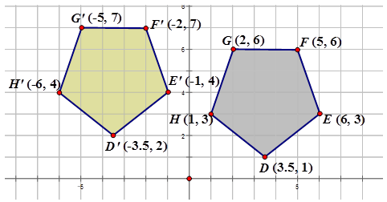
\begin{align*}
d_{DE}&= \sqrt{\left(x_2-x_1 \right)^2+ \left(y_2-y_1 \right)^2} && d_{D^\prime E^\prime}= \sqrt{\left(x_2-x_1 \right)^2+ \left(y_2-y_1 \right)^2} \\
d_{DE}&= \sqrt{\left(3.5-6 \right)^2+ \left(1-3 \right)^2} && d_{D^\prime E^\prime}= \sqrt{\left(-3.5- \left(-1 \right) \right)^2+ \left(2-4 \right)^2} \\
d_{DE}&= \sqrt{\left(-2.5 \right)^2+ \left(-2 \right)^2} && d_{D^\prime E^\prime}= \sqrt{\left(-2.5 \right)^2+ \left(-2 \right)^2} \\
d_{DE}&= \sqrt{6.25+4} && d_{D^\prime E^\prime}= \sqrt{6.25+4} \\
d_{DE}&= \sqrt{10.25} && d_{D^\prime E^\prime}= \sqrt{10.25} \\
d_{DE}&=3.20 \ cm && d_{D^\prime E^\prime}=3.20 \ cm
\end{align*}
$$

$$
\begin{align*}
d_{EF}&= \sqrt{\left(x_2-x_1 \right)^2+ \left(y_2-y_1 \right)^2} && d_{E^\prime F^\prime}= \sqrt{\left(x_2-x_1 \right)^2+ \left(y_2-y_1 \right)^2} \\
d_{EF}&= \sqrt{\left(6-5 \right)^2+ \left(3-6 \right)^2} && d_{E^\prime F^\prime}= \sqrt{\left(-1- \left(-2 \right) \right)^2+ \left(4-7 \right)^2} \\
d_{EF}&= \sqrt{\left(1 \right)^2+ \left(-3 \right)^2} && d_{E^\prime F^\prime}= \sqrt{\left(1 \right)^2+ \left(-3 \right)^2} \\
d_{EF}&= \sqrt{1+9} && d_{E^\prime F^\prime}= \sqrt{1+9} \\
d_{EF}&= \sqrt{10} && d_{E^\prime F^\prime}= \sqrt{10} \\
d_{EF}&=3.16 \ cm && d_{E^\prime F^\prime}=3.16 \ cm
\end{align*}
$$

$$
\begin{align*}
d_{FG}&= \sqrt{\left(x_2-x_1 \right)^2+ \left(y_2-y_1 \right)^2} && d_{F^\prime G^\prime}= \sqrt{\left(x_2-x_1 \right)^2+ \left(y_2-y_1 \right)^2} \\
d_{FG}&= \sqrt{\left(5-2 \right)^2+ \left(6-6 \right)^2} && d_{F^\prime G^\prime}= \sqrt{\left(-2- \left(-5 \right) \right)^2+ \left(7-7 \right)^2} \\
d_{FG}&= \sqrt{\left(3 \right)^2+ \left(0 \right)^2} && d_{F^\prime G^\prime}= \sqrt{\left(3 \right)^2+ \left(0 \right)^2} \\
d_{FG}&= \sqrt{9+0} && d_{F^\prime G^\prime}= \sqrt{9+0} \\
d_{FG}&= \sqrt{9} && d_{F^\prime G^\prime}= \sqrt{9} \\
d_{FG}&=3.00 \ cm && d_{F^\prime G^\prime}=3.00 \ cm
\end{align*}
$$

$$
\begin{align*}
d_{GH}&= \sqrt{\left(x_2-x_1 \right)^2+ \left(y_2-y_1 \right)^2} && d_{G^\prime H^\prime}= \sqrt{\left(x_2-x_1 \right)^2+ \left(y_2-y_1 \right)^2} \\
d_{GH}&= \sqrt{\left(2-1 \right)^2+ \left(6-3 \right)^2} && d_{G^\prime H^\prime}= \sqrt{\left(-5- \left(-6 \right) \right)^2+ \left(7-4 \right)^2} \\
d_{GH}&= \sqrt{\left(1 \right)^2+ \left(3 \right)^2} && d_{G^\prime H^\prime}= \sqrt{\left(1 \right)^2+ \left(3 \right)^2} \\
d_{GH}&= \sqrt{1+9} && d_{G^\prime H^\prime}= \sqrt{1+9} \\
d_{GH}&= \sqrt{10} && d_{G^\prime H^\prime}= \sqrt{10} \\
d_{GH}&=3.16 \ cm && d_{G^\prime H^\prime}=3.16 \ cm
\end{align*}
$$

$$
\begin{align*}
d_{HD}&= \sqrt{\left(x_2-x_1 \right)^2+ \left(y_2-y_1 \right)^2} && d_{H^\prime D^\prime}= \sqrt{\left(x_2-x_1 \right)^2+ \left(y_2-y_1 \right)^2} \\
d_{HD}&= \sqrt{\left(1-3.5 \right)^2+ \left(3-1 \right)^2} && d_{H^\prime D^\prime}= \sqrt{\left(-6- \left(-3.5 \right) \right)^2+ \left(4-2 \right)^2} \\
d_{HD}&= \sqrt{\left(-2.5 \right)^2+ \left(2 \right)^2} && d_{H^\prime D^\prime}= \sqrt{\left(-2.5 \right)^2+ \left(2 \right)^2} \\
d_{HD}&= \sqrt{6.25+4} && d_{H^\prime D^\prime}= \sqrt{6.25+4} \\
d_{HD}&= \sqrt{10.25} && d_{H^\prime D^\prime}= \sqrt{10.25} \\
d_{HD}&=3.20 \ cm && d_{H^\prime D^\prime}=3.20 \ cm
\end{align*}
$$

**Summary**

In this concept of Chapter **Is it a Slide, a Flip, or a Turn?**, lesson **Formulas for Justifying Translations**, you were introduced to the distance formula. The distance formula has the symbol $d$ and is calculated using the formula:

$$
d= \sqrt{\left(x_2-x_1 \right)^2+ \left(y_2-y_1 \right)^2}
$$

The distance formula is used to help justify congruence by proving that the sides of a preimage have the same length as the sides of the transformed image.

**Problem Set**

Find the distance for each line below given the endpoints:

1.  Line $AB$ given $A(5, 7)$ and $B(3, 9)$.
2.  Line $BC$ given $B(3, 8)$ and $C(5, 2)$.
3.  Line $CD$ given $C(4, 6)$ and $D(3, 5)$.
4.  Line $DE$ given $D(9, 11)$ and $E(2, 2)$.
5.  Line $EF$ given $E(1, 1)$ and $F(8, 7)$.

For each of the diagrams below, find the distances to prove congruence knowing the angles are congruent.

1.  
    
    \[Figure 25\]
    
2.  
    
    \[Figure 26\]
    
3.  
    
    \[Figure 27\]
    
4.  
    
    \[Figure 28\]
    

Slope Formula
-------------

**Concept Content**

For transformations and rotations, the slope of a line can also be found to determine if the lines or figures are congruent. In this last lesson of the chapter, you will use the slope formula to calculate the slope of lines in preimages that have been translated or rotated. The slope formula has the symbol $m$ and can be calculated using the formula:

$$
m= \frac{y_2-y_1}{x_2-x_1}
$$

Lines that are parallel have the same slope. In contrast lines that are perpendicular have negative reciprocal slopes. For transformations, the following table shows how the slope formula can be used to help prove congruence.

| **Transformation Type** | **Line type** | **What happens to the slope?** |
| --- | --- | --- |
| Translations | Parallel | Slopes will remain the same |
| Rotation of $90^\circ$ | Perpendicular | Slopes will be negative reciprocals |
| Rotation of $180^\circ$ | Parallel | Slopes will be the same |
| Dilations | Parallel | Slopes will be the same |

So you can use slope as another justification for transformations including translations, rotations, and dilations.

**Guidance**

The figure below shows a dilation of two trapezoids. Show the dilation lines have the same slope.

\begin{align*}
m_{BC}&= \frac{6-6}{-5- \left(-9 \right)} && m_{B^\prime C^\prime}= \frac{3-3}{-2.5- \left(-4.5 \right)} \\
m_{BC}&= \frac{0}{4} && m_{B^\prime C^\prime}= \frac{0}{2} \\
m_{BC}&=0 && m_{B^\prime C^\prime}=0
\end{align*}
$$

$m_{BC}$ and $m_{B^\prime C^\prime}$ have the same slopes.

$$
\begin{align*}
m_{BE}&= \frac{-3-6}{-10- \left(-9 \right)} && m_{B^\prime E^\prime}= \frac{-1.5-3}{-5- \left(-4.5 \right)} \\
m_{BE}&= \frac{-9}{-1} && m_{B^\prime E^\prime}= \frac{-4.5}{-0.5} \\
m_{BE}&=9 && m_{B^\prime E^\prime}=9
\end{align*}
$$

$m_{BE}$ and $m_{B^\prime E^\prime}$ have the same slopes.

$$
\begin{align*}
m_{ED}&= \frac{-3- \left(-1 \right)}{-10- \left(-5 \right)} && m_{E^\prime D^\prime}= \frac{-1.5- \left(-0.5 \right)}{-5- \left(-2.5 \right)} \\
m_{ED}&= \frac{-2}{-5} && m_{E^\prime D^\prime}= \frac{-1}{-2.5} \\
m_{ED}&= \frac{2}{5} && m_{E^\prime D^\prime}= \frac{2}{5}
\end{align*}
$$

$m_{ED}$ and $m_{E^\prime D^\prime}$ have the same slopes.

$$
\begin{align*}
m_{DC}&= \frac{-1-6}{-5- \left(-5 \right)} && m_{D^\prime C^\prime}= \frac{-0.5-3}{-2.5- \left(-2.5 \right)} \\
m_{DC}&= \frac{-7}{0} && m_{D^\prime C^\prime}= \frac{3.5}{0} \\
m_{DC}&=undefined && m_{D^\prime C^\prime}=undefined
\end{align*}
$$

$m_{DC}$ and $m_{D^\prime C^\prime}$ have the same slopes.

The lines in Image A that correspond to the dilation lines in Image B have the same slope so are parallel.

**Examples**

**Example A**

Find the slope of the following line.

\begin{align*}
m_{AB}&= \frac{-3-5}{-13- \left(-3 \right)} \\
m_{AB}&= \frac{-8}{-10} \\
m_{AB}&= \frac{4}{5}
\end{align*}
$$

**Example B**

The figure below shows a rotation of two quadrilaterals $90^\circ$CW about the origin. Show the slopes of reflected lines have negative reciprocal slopes as one justification of $90^\circ$ rotations.

\begin{align*}
m_{AH}&= \frac{6.1-2.5}{2.3-4} && m_{A^\prime H^\prime}= \frac{-2.3- \left(-4 \right)}{6.1-2.5} \\
m_{AH}&= \frac{3.6}{-1.7} && m_{A^\prime H^\prime}= \frac{1.7}{3.6} \\
m_{AH}&=-2.12 && m_{A^\prime H^\prime}=0.472
\end{align*}
$$

$$
\begin{align*}
m_{HI}&= \frac{3.2-2.5}{8-4} && m_{H^\prime I^\prime}= \frac{-8- \left(-4 \right)}{3.2-2.5} \\
m_{HI}&= \frac{0.7}{4} && m_{H^\prime I^\prime}= \frac{-4}{0.7} \\
m_{HI}&=0.175 && m_{H^\prime I^\prime}=-5.71
\end{align*}
$$

The lines in preimage that correspond to the rotated lines in the final image have negative reciprocal slopes so they are perpendicular.

**Example C**

The figure below shows a translation of line $VW$ over 4 units to the right and down 3 units. Show the slopes of the translated lines are the same as one justification of translations.

\begin{align*}
m_{VW}&= \frac{3- \left(-2 \right)}{6- \left(-1 \right)} && m_{V^\prime W^\prime}= \frac{-5-0}{3-10} \\
m_{VW}&= \frac{-5}{-7} && m_{V^\prime W^\prime}= \frac{5}{7}\\
m_{VW}&= \frac{5}{7} && m_{V^\prime W^\prime}= \frac{5}{7}
\end{align*}
$$

The lines $VW$ and $V^\prime W^\prime$ for the translation are parallel.

**Vocabulary**

__Slope__

The slope formula has the symbol $m$ and can be calculated using the formula:

$$
m= \frac{y_2-y_1}{x_2-x_1}
$$

**Guided Practice**

1. A line passes through the points (4, 25) and (10, 40). What is the slope of the line?

2. The figure below shows a translation of line $QT$ over 3 units to the left and up 6 units. Show the slopes of the translated lines are the same as one justification of translations.

1. 

$$
\begin{align*}
m&= \frac{40-25}{10-4} \\
m&= \frac{15}{6} \\
m&=2.5
\end{align*}
$$

2. 

$$
\begin{align*}
m_{QT}&= \frac{-6-1}{3- \left(-2 \right)} && m_{Q^\prime T^\prime}= \frac{0-7}{0- \left(-5 \right)} \\
m_{QT}&= \frac{-7}{5} && m_{Q^\prime T^\prime}= \frac{-7}{5} \\
m_{QT}&=-1.4 && m_{Q^\prime T^\prime}=-1.4
\end{align*}
$$

The lines $QT$ and $Q^\prime T^\prime$ for the translation are parallel.

3. 

$$
\begin{align*}
m_{AB}&= \frac{1-2}{-3- \left(-8 \right)} && m_{A^\prime B^\prime}= \frac{-1- \left(-2 \right)}{3-8} \\
m_{AB}&= \frac{-1}{5} && m_{A^\prime B^\prime}= \frac{1}{-5} \\
m_{AB}&=-0.2 && m_{A^\prime B^\prime}=-0.2
\end{align*}
$$

$$
\begin{align*}
m_{AC}&= \frac{1-4}{-3- \left(-5 \right)} && m_{A^\prime C^\prime}= \frac{-1- \left(-4 \right)}{3-5} \\
m_{AC}&= \frac{-3}{2} && m_{A^\prime C^\prime}= \frac{3}{-2} \\
m_{AC}&=-1.5 && m_{A^\prime C^\prime}=-1.5
\end{align*}
$$

$$
\begin{align*}
m_{BC}&= \frac{2-4}{-8- \left(-5 \right)} && m_{B^\prime C^\prime}= \frac{-2- \left(-4 \right)}{8-5} \\
m_{BC}&= \frac{-2}{-3} && m_{B^\prime C^\prime}= \frac{2}{3} \\
m_{BC}&=0.67 && m_{B^\prime C^\prime}=0.67
\end{align*}
$$

The lines in Image A that correspond to the rotated lines in Image B have the same slope so they are parallel.

**Summary**

In this last concept of lesson **Formulas for Justifying Translations**, and the chapter **Is It a Slide, a Flip, or a Turn?**, you learned that the slope can be used as a justification for translations, rotations, and dilations. With reflections, it depends on the type of reflection and the slope cannot always be used as a justification.

The slope formula has the symbol $m$ and can be calculated using the formula:

$$
m= \frac{y_2-y_1}{x_2-x_1}
$$

Lines that are parallel have the same slope. In contrast lines that are perpendicular have negative reciprocal slopes. For transformations, the following table shows how the slope formula can be used to help justify congruence.

| **Transformation Type** | **Line type** | **What happens to the slope?** |
| --- | --- | --- |
| Translations | Parallel | Slopes will remain the same |
| Rotation of $90^\circ$ | Perpendicular | Slopes will be negative reciprocals |
| Rotation of $180^\circ$ | Parallel | Slopes will be the same |
| Dilations | Parallel | Slopes will be the same |

Therefore you can use slope as another justification for transformations including translations, rotations, and dilations.

**Problem Set**

Find the slope for each line below given the endpoints:

1.  Line $AB$ given $A(5, 7)$ and $B(3, 9)$.
2.  Line $BC$ given $B(3, 8)$ and $C(5, 2)$.
3.  Line $CD$ given $C(4, 6)$ and $D(3, 5)$.
4.  Line $DE$ given $D(9, 11)$ and $E(2, 2)$.
5.  Line $EF$ given $E(1, 1)$ and $F(8, 7)$.

Justify the following transformations of the preimage A to the transformed images in the diagrams below using the slope formula.

1.  
    
    \[Figure 35\]
    
2.  
    
    \[Figure 36\]
    
3.  
    
    \[Figure 37\]
    
4.  
    
    \[Figure 38\]
    

Summary
-------

In this sixth lesson of Chapter **Is it a Slide, a Flip, or a Turn?** you learned some of the formulas for justifying transformations. You learned first about the mid-point formula that is used to help justify transformations. It is a property common to all transformations. The mid-point formula has the symbol $M$ and is found using the formula:

$$
M= \left(\frac{x_1+x_2}{2}, \frac{y_1+y_2}{2} \right)
$$

You next learned about the distance formula. You can use dynamic geometry software to determine distance but you could also calculate the distance given two points. The distance formula has the symbol $d$ and is found using the formula:

$$
d= \sqrt{ \left(x_2-x_1\right)^2+ \left(y_2-y_1\right)^2}
$$

Finally, you learned in concept 3 the slope formula. You could use the slope formula to justify the property of parallelism if it exists between two or more figures. Remember that parallel lines have the same slope. The slope formula has the symbol $m$ and is found using the formula:

$$
m= \frac{y_2-y_1}{x_2-x_1}
$$

Keep in mind that reflections can result in perpendicular lines not parallel ones. Perpendicular lines have negative reciprocal slopes. You see perpendicular lines all the time, such as the lines on a tennis court. (Tennis courts have parallel lines as well!)

| **Transformation Type** | **Line type** | **What happens to the slope?** |
| --- | --- | --- |
| Translations | Parallel | Slopes will remain the same |
| Rotation of $90^\circ$ | Perpendicular | Slopes will be negative reciprocals |
| Rotation of $180^\circ$ | Parallel | Slopes will be the same |
| Dilations | Parallel | Slopes will be the same |

Mid-point, distance, and slope can be used for justification of transformations.

For chapter **Is it a Slide, a Flip, or a Turn?** you have worked with the four types of transformations, graphed them, wrote notations, worked with the properties of transformations, and then justified them. The table below is a summary of the concepts learned.

| **Transformation** | **Notation** | **Mapping Rule** | **Properties** |
| --- | --- | --- | --- |
| Translation | $T_{a,b}(x,y)=(x+a,y+b)$ | $(x,y) \rightarrow (x+a,y+b)$ | 1. distance  2. angle measure  3. parallelism  4. colinearity  5. Mid-point |
| Reflection | $r_{x-axis}(x,y)=(x,-y)$  $r_{y-axis}(x,y)=(-x,y)$  $r_{y=x}(x,y)=(y,x)$  $r_{y=-x}(x,y)=(-y,-x)$  $r_{origin}(x,y)=(-x,-y)$ | $(x,y) \rightarrow (x,-y)$  $(x,y) \rightarrow (-x,y)$  $(x,y) \rightarrow (y,x)$  $(x,y) \rightarrow (-y,-x)$  $(x,y) \rightarrow (-x,-y)$ |
| Rotation | $R_{90^\circ}(x,y)=(-y,x)$  $R_{180^\circ}(x,y)=(-x,-y)$  $R_{270^\circ}(x,y)=(y,-x)$ | $(x,y) \rightarrow (-y,x)$  $(x,y) \rightarrow (-x,-y)$  $(x,y) \rightarrow (y,-x)$ |
| Dilation | $D_k(x,y)=(kx,ky)$ | $(x,y) \rightarrow (kx,ky)$ | 1. angle measure  2. parallelism  3. colinearity  4. midpoint |

</article>

### 10.7 Quiz

<article>

1.  What is the image of the point (5, –2) under a translation $T_{2,-3}$?
    1.  (3, 1)
    2.  (7, –5)
    3.  (10, 6)
    4.  (2, 0)
2.  Which of the following is the notation for a point undergoing a translation of 2 units to the left and 3 units up?
    1.  $(x, y) \rightarrow (x+2, y-3)$
    2.  $(x, y) \rightarrow (x+3, y-2)$
    3.  $(x, y) \rightarrow (x-2, y+3)$
    4.  $(x, y) \rightarrow (x-3, y+2)$
3.  If point $X(-1, 3)$ undergoes a translation of $T_{3, 2}$, what would be the translated point.
    1.  (2, 5)
    2.  (–3, 6)
    3.  (1, 6)
    4.  (–2, 1)
4.  If point $A(4, -7)$ is reflected across the $x$\-axis, what are the coordinates of the reflected point?
    1.  (–4, 7)
    2.  (4, 7)
    3.  (–4, –7)
    4.  (7, 4)
5.  If point $S(2, -5)$ is reflected about the origin, what are the coordinates of the reflected point?
    1.  (–2, 5)
    2.  (–5, 2)
    3.  (–2, –5)
    4.  (2, –5)
6.  If point $T(-8, 3)$ is reflected about the line $y=x$, what are the coordinates of the reflected point?
    1.  (8, –3)
    2.  (8, 3)
    3.  (–3, 8)
    4.  (3, –8)
7.  If triangle $ABC$ has the vertices $A(2, 4), B(5, 9)$ and $C(7, 2)$ and is reflected in the $y$\-axis, what are the coordinates of the reflected triangle?
8.  Write the notation for the transformation performed in question 7.
9.  If triangle $ABC$ has the vertices $A(2, 4), B(5, 9)$ and $C(7, 2)$ and is translated 5 units to the right and 5 units down, what are the coordinates of the translated triangle?
10. Write the notation for the transformation performed in question 9.

</article>

### 10.8 Chapter Test

<article>

1.  If the point $Q(5, -2)$ is rotated $90^\circ$ CW about the origin, what are the coordinates of the rotated point?
    1.  (2, 5)
    2.  (2, –5)
    3.  (–2, –5)
    4.  (–5, 2)
2.  If the image 
    
    \[Figure 1\]
    
    undergoes the rotation $R_{90^\circ}$, What is the resulting image?
    1.  
        
        \[Figure 2\]
        
    2.  
        
        \[Figure 3\]
        
    3.  
        
        \[Figure 4\]
        
    4.  
        
        \[Figure 5\]
        
3.  What is the mapping rule for the dilatation below? 
    
    \[Figure 6\]
    
    1.  $(x, y) \rightarrow (kx, ky)$
    2.  $(x, y) \rightarrow (2x, 2y)$
    3.  $(x, y) \rightarrow (0.5x, 0.5y)$
    4.  $(x, y) \rightarrow (x, y)$
4.  What is the notation for the translation below? 
    
    \[Figure 7\]
    
    1.  $R_{270^\circ} (x, y) = (y, -x)$
    2.  $R_{180^\circ} (x, y) = (-x, -y)$
    3.  $R_{90^\circ} (x, y) = (-y, x)$
    4.  $R_{-90^\circ} (x, y) = (-y, -x)$
5.  What property is not common for all of the transformation types?
    1.  distance
    2.  angle measures
    3.  mid-points
    4.  parallelism
6.  What are the coordinates of the point $G(-2, -3)$ that undergoes the composite transformation $r_{x-axis} \ \circ \ r_{y-axis}$
    1.  (2, –3)
    2.  (2, 3)
    3.  (3, –2)
    4.  (–3, –2)
7.  What are the coordinates of the point $G(6, -2)$ that undergoes the composite transformation $R_{90^\circ} \ \circ \ T_{4, 5}$
    1.  (11, 3)
    2.  (2, 6)
    3.  (–16, 11)
    4.  (6, 11)
8.  What is the notation for the translation below? 
    
    \[Figure 8\]
    
    1.  $T_{7, 3} \ \circ \ R_{180^\circ}$
    2.  $R_{180^\circ} \ \circ \ T_{7, 3}$
    3.  $r_{x-axis} \ \circ \ T_{7, 3}$
    4.  $T_{7, 3} \ \circ \ r_{x-axis}$
9.  What is the slope of the line $ST$ with vertices $S(-3, 5)$ and $T(4, -4)$ that undergoes a translation of 4 units to the left and 2 units up?
    1.  $\frac{7}{9}$
    2.  $-\frac{7}{9}$
    3.  $-\frac{9}{7}$
    4.  $\frac{9}{7}$
10. What is the distance of the line $ST$ with vertices $S(-3, 5)$ and $T(4, -4)$ that undergoes a reflection in the line $y=-x$?
    1.  1.4
    2.  0
    3.  11.4
    4.  –1.3

</article>

